# Форматирование сообщений в Telegram

## Разметка Markdown

Для правильной разметки текста в нужном блоке (разметка находится под полем для ввода текста сообщения) строго соблюдайте следующие шаги:

<figure><figcaption></figcaption></figure>

1. Ставим нужный текст в поле ответ.

Если вы используете переменные в тексте, то на данном этапе их указывать <mark style="color:red;">**не нужно**</mark>. В противном случае синтаксис переменных будет нарушен и знаки #{} также будут экранированы, а переменная не отобразится в тексте.

2. Включаем "Markdown в Telegram". Так в ваш текст будут добавлены символы экранирования.
3. Выделяем текст \*\* либо \_ \_ и т.п.


Если в этом блоке встречаются символы из перечисленных: '\_', '\*', '\[', ']', '(', ')', '\~', '\`', '>', '#', '+', '-', '=', '|', '{', '}', '.', '!'  — их нужно экранировать, добавлять перед ними обратный слэш \\&#x20;

Иначе сообщение не отправится вообще. При этом не имеет значения, какой участок текста вы размечаете.

&#x20;Пример: привет\\. Рады \*тебя\* видеть\\!


Спецсимволы:

**Жирный текст** — с обеих сторон ставите звездочки: \*тут текст\*\
**Курсив** — нижнее подчёркивание: \_текст\_\
**Подчеркнутый текст** — два нижних подчеркивания с обеих сторон: \_\_текст\_\_\
**Зачеркнутый текст** — тильда с обеих сторон текста: \~текст\~\
**Ссылка в тексте**: \[текст в квадратных скобках]\(ссылка в круглых скобках) \
\[inline URL]\([http://www.example.com/](https://vk.com/away.php?to=http%3A%2F%2Fwww.example.com%2F\&cc_key=))\
**Упоминание пользователя ТГ**: \[текст в квадратных скобках]\(ссылка на пользователя в круглых скобках). В ссылке после знака равно можно использовать #{platform\_id} \
\[inline mention of a user]\(tg://user?id=123456789)\
**Текст в виде кода** — с обеих сторон текста поставить обратный апостроф: \`inline fixed-width code\`\
**Скрытый текст или spoiler** - с обеих сторон от текста используйте ||&#x20;

4. Далее размечаете нужный текст при помощи спецсимволов.&#x20;

**Пример:**

<figure><figcaption>
Пример разметки
</figcaption></figure>

Результат:

<figure><figcaption></figcaption></figure>

При работе с Markdown необходимо не забывать, что спецсимволы следует экранировать, заменить в тексте управляющие символы на соответствующие текстовые подстановки. Делается это достаточно просто - перед спецсимволом добавляется **обратный слэш \\**  или  при помощи функции Калькулятора

**txt = tg\_escape(s), где** **s** - строка с исходным текстом.&#x20;


Чтобы в переменную записать текст с переносами строк, укажите значение следующим образом:

`ваша_переменная = "Текст первой строки" + "\n" + "Текст второй строки" + "\n" +"Третья строка"`


На выходе в **txt** приходит строка уже с вставленными слешами в нужных местах.&#x20;

**Пример:**

<figure><figcaption>
Пример экранирования
</figcaption></figure>

<figure><figcaption>
Как выглядит текст в Telegram
</figcaption></figure>

Далее размечаете нужный текст.

#### Пример с длинным текстом:

<figure><figcaption></figcaption></figure>

Для этого в калькуляторе необходимо:

Шаг 1. Вставить текст в поле сообщения:

<figure><figcaption></figcaption></figure>

Шаг 2. Включить кнопку разметки Marldown:

<figure><figcaption>
При включении кнопки разметки, экранируются спецсимволы
</figcaption></figure>

Шаг 3. Расставляем спецсимволы для форматирования сообщения по тексту:

<figure><figcaption></figcaption></figure>

Если после отправки сообщения, оно не дошло в мессенджер, а в диалоге в разделе Клиенты вы видите ошибку, значит вы неверно экранировали символы.&#x20;

При этом вы увидите ошибку при отправке сообщения в разделе "Клиенты", в ней будет указан символ, который не был экранирован.

Сообщения об ошибках, которые вы можете встретить:

1. Нет закрывающего символа:

<figure>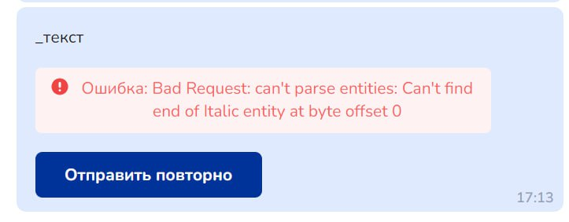<figcaption></figcaption></figure> <figure>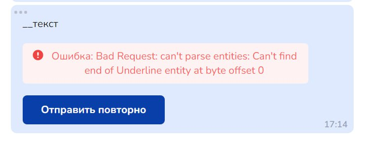<figcaption></figcaption></figure>

2. Отсутствует экранирование символа:

<figure>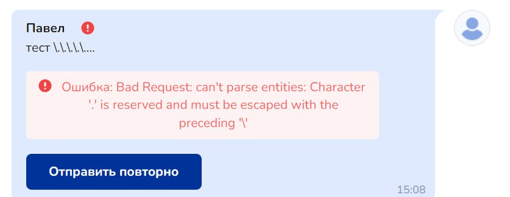<figcaption></figcaption></figure>

Ознакомьтесь с особенностями разметки текста в видео ниже и выполните экранирование правильно:


Форматирование текста в редакторе блока для Telegram: markdown


## Разметка HTML

Чтобы разметка HTML работала, не забудьте нажать на кнопку HTML под текстовым полем для сообщения:

<figure><figcaption></figcaption></figure>

1. \<a href="https://google.com">ссылка\</a> - вшивает ссылку в определенное слово.&#x20;

Пример заполнения:

<figure>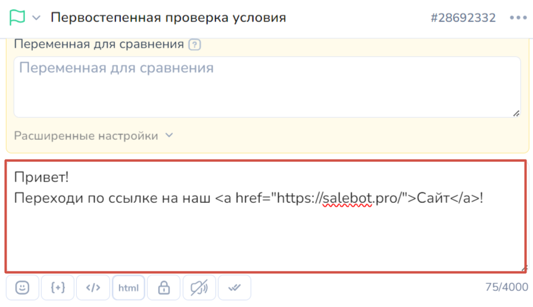<figcaption></figcaption></figure>

2. \<u>underlined\</u> - подчеркнутый шрифт

Пример:

<figure><figcaption></figcaption></figure> <figure>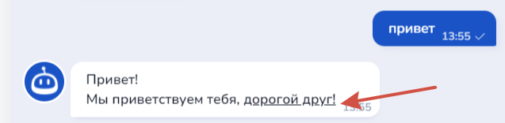<figcaption></figcaption></figure>

3. \<ins>underlined\</ins> - подчеркнутый шрифт

Пример:

<figure>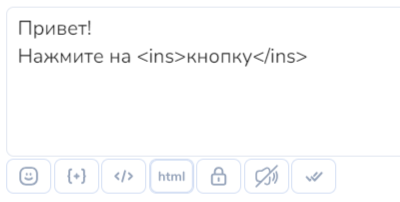<figcaption></figcaption></figure> <figure>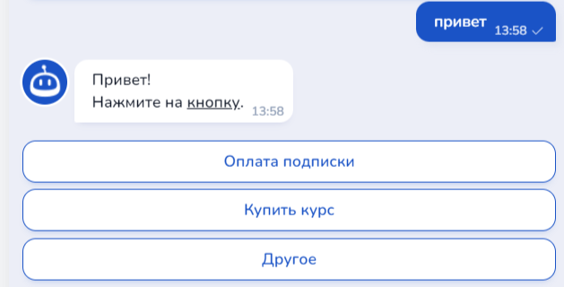<figcaption></figcaption></figure>

4. \<em>italic\</em> - курсивный шрифт

Пример:

<figure>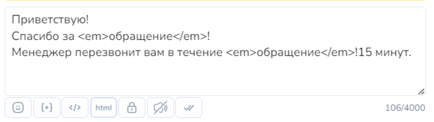<figcaption></figcaption></figure> <figure>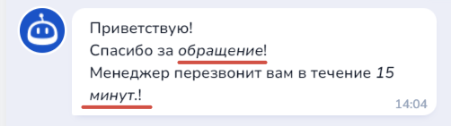<figcaption></figcaption></figure>

5. \<i>italic\</i> - курсивный шрифт

Пример:

<figure>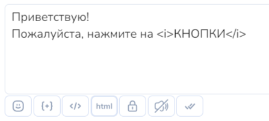<figcaption></figcaption></figure> <figure>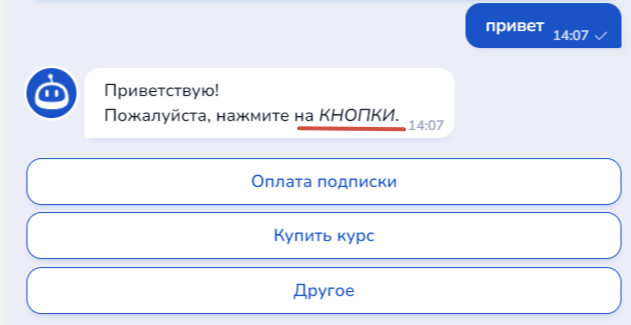<figcaption></figcaption></figure>

\<strong>strong\</strong> - жирный шрифт

<figure>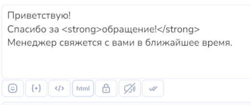<figcaption></figcaption></figure> <figure>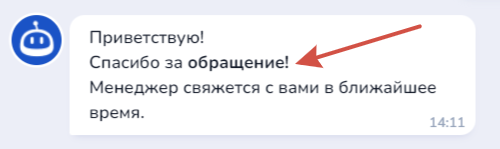<figcaption></figcaption></figure>

\<strike>strike\</strike> - зачеркнутый шрифт

<figure>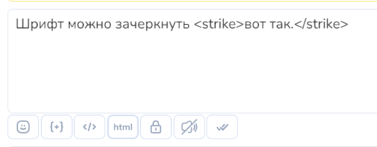<figcaption></figcaption></figure> <figure><figcaption></figcaption></figure>

\hidden\ - скрытый шрифт

Пример:

<figure>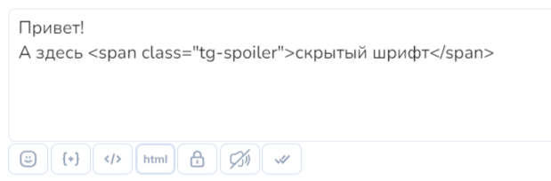<figcaption></figcaption></figure>

\<code>Prerfomatted\</code> - форматированный шрифт

Пример:

<figure>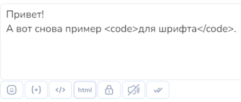<figcaption></figcaption></figure> <figure>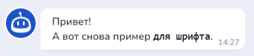<figcaption></figcaption></figure>

\<pre>Preformatted\</pre> - форматированный шрифт

Пример:

<figure>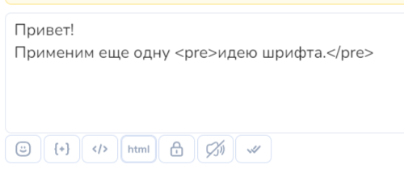<figcaption></figcaption></figure> <figure>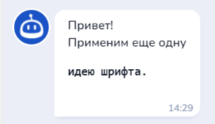<figcaption></figcaption></figure>

## Как включить защищенный режим для контента

Чтобы защитить контент от распространения можно включить защищенный режим для сообщений. Для этого в разделе "Сообщение" включите "Защитить контент":

<figure><figcaption></figcaption></figure>


Защищенные сообщения нельзя переслать, на телефоне нельзя сделать скриншот.



Telegram: защита контента, редактор блока

