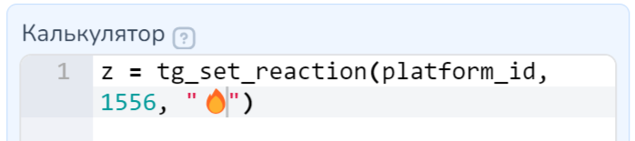

# Функции API Telegram

Функции API существенно расширяют возможности работы бота в Telegram. С помощью использования функций API можно работать с вложениями, с группами и чатами в Telegram, например, автоматизируя блокировку или разблокировку пользователей и многое другое!&#x20;


Первоисточник: [Telegram bot API](https://core.telegram.org/bots/api)



Важно!&#x20;

Для понимания работы с функциями API настоятельно рекомендуем ознакомиться с правилами указания функций и параметров в калькуляторе.

<mark style="color:red;">**ОБОЗНАЧЕНИЯ:**</mark>

<mark style="color:red;">**!**</mark> - восклицательным знаком обозначаются обязательные параметры

**параметр=None** - так указывается значение по умолчанию для обозначенного параметра,

<mark style="color:red;">**неправильно**</mark> просто копировать текст функции из документации tg\_send\_message(platform\_id, "Какой то текст", client\_message\_id=61818138, reply\_markup=None, parse\_mode=None, disable\_web\_page\_preview=0, protect\_content=False)

После знаков равно указаны значения по умолчанию для каждого параметра, следовательно, если Вам не нужен тот или иной параметр, но нужен какой-либо из последующих, то нельзя просто опустить его - следует указать вместо него значение по умолчанию для данного параметра.&#x20;

Таким образом, <mark style="color:green;">**правильным**</mark> будет ввод: \
tg\_send\_message(platform\_id, "Какой то текст", 61818138, None, None, 0, True)


### Где взять <mark style="color:red;">**platform\_id**</mark> для отправки уведомлений?

* У вас должен быть подключен телерам-бот к проекту
* В этого бота нужно прислать любое сообщение с того Telegram-аккаунта, куда должны приходить сообщения&#x20;
* В списке клиентов проекта выбираете диалог клиента, которому будете отправлять заявки
* Копируете значение ID в мессенджере

<figure><figcaption></figcaption></figure>

Пример передачи параметра platform_id

1. параметр platform\_id можно передавать без указания числовых значений:

<figure><figcaption>
platform_id передан без указания значений
</figcaption></figure>

`react = tg_set_reaction(platform_id, 1556, '👌')`

Функции с параметром будет отрабатывать без указания значения platform\_id.

Важно! Параметр в большинстве функций является обязательным и пропускать его нельзя. &#x20;

2. Если Вам необходимо использовать функцию в определенном чате, канале, группе, то понадобится передать platform\_id с числовым значением:

<figure><figcaption></figcaption></figure>

В функции tg\_send\_message(!platform\_id, !text) на примере выше параметр platform\_id передан с помощью кавычек, в которых вложено числовое значение:&#x20;

`tgmess = tg_send_message('1234566788', 'Привет!')`&#x20;

<figure><figcaption></figcaption></figure>

<figure><figcaption></figcaption></figure>

### Как прописывать кнопки в параметре reply\_markup

**Пример reply-кнопок:**

`opts = {"keyboard": [[{"text": "Налево"}, {"text": "Направо"}]]}`

**Пример inline-кнопок:**

opts = {"inline\_keyboard": \[\[{"text": "Пакет 1","callback\_data":1}, {"text": "Пакет 2","callback\_data":2}]]}

### Как использовать разметку текста (markdown) в параметре **parse\_mode?**&#x20;

Параметр **parse\_mode** выделяет весь текст/его часть курсивом или жирным шрифтом. Может иметь значения html, markdown, markdownV2.

1. <mark style="color:blue;">**Если выбираете html:**</mark>

&#x20;        для **жирного шрифта** используете  `"<b>caption</b>"`

&#x20;        для _курсива_ `"<i>caption</i>"`

2. <mark style="color:blue;">**Для Markdown:**</mark>

&#x20;        для **жирного шрифт**а используете  `"*caption*"`

&#x20;        для _курсива_ `"_caption_"`

**Пример отправки курсивного текста:**\
`tg_send_message(47615196, "<i>курсив</i>",None,None,"html")`

**Пример отправки жирного текста:**\
`tg_send_message(platform_id, '*test*', None, None, 'markdown')`

Список доступных функций

[**some\_client\_in\_list**](https://docs.salebot.pro/messendzhery-i-chaty/kak-sozdat-bota-v-telegram/api-telegram-funkcii-dlya-ispolzovaniya-vsekh-vozmozhnostei-telegram#kak-rabotat-s-podpischikami-chata-kanala-telegram)**(list\_id, recepient)** – проверка состоит ли участник чата в определенном списке

[**tg\_answer\_callback\_query**](https://docs.salebot.pro/messendzhery-i-chaty/kak-sozdat-bota-v-telegram/api-telegram-funkcii-dlya-ispolzovaniya-vsekh-vozmozhnostei-telegram#kak-pokazat-deistviya-v-chate-kanale-telegram)**(callback\_query\_id, text)** – показ пользователю Alert-уведомления

[**tg\_approve\_chat\_join\_request**](https://docs.salebot.pro/messendzhery-i-chaty/kak-sozdat-bota-v-telegram/api-telegram-funkcii-dlya-ispolzovaniya-vsekh-vozmozhnostei-telegram#kak-rabotat-s-zayavkami-v-chat-kanal-telegram)**(chat\_id, user\_id)** - принять заявку и добавить пользователя в канал/чат

[**tg\_ban\_chat\_member**](https://docs.salebot.pro/messendzhery-i-chaty/kak-sozdat-bota-v-telegram/api-telegram-funkcii-dlya-ispolzovaniya-vsekh-vozmozhnostei-telegram#kak-rabotat-s-podpischikami-chata-kanala-telegram)**(chat\_id, user\_id, hours)** – блокировка (бан) подписчика чата/канала

[**tg\_ban\_chat\_sender\_chat**](https://docs.salebot.pro/messendzhery-i-chaty/kak-sozdat-bota-v-telegram/api-telegram-funkcii-dlya-ispolzovaniya-vsekh-vozmozhnostei-telegram#kak-zabanit-razbanit-gruppu-telegram)**(platform\_id, sender\_chat\_id)** – отправка в бан группы

[**tg\_callback\_url\_open**](https://docs.salebot.pro/messendzhery-i-chaty/kak-sozdat-bota-v-telegram/api-telegram-funkcii-dlya-ispolzovaniya-vsekh-vozmozhnostei-telegram#kak-pokazat-deistviya-v-chate-kanale-telegram)**(callback\_query\_id, url)** – установка реакции на callback-кнопку с переходом в бота с тэгом

[**tg\_chat\_permission**](https://docs.salebot.pro/messendzhery-i-chaty/kak-sozdat-bota-v-telegram/api-telegram-funkcii-dlya-ispolzovaniya-vsekh-vozmozhnostei-telegram#kak-nastroit-prava-v-chate-kanale-telegram)**(platform\_id, permission, media\_permissions)** – установка общих ограничений для обычных пользователей чата или отдельных пользователей

[**tg\_close\_forum\_topic**](https://docs.salebot.pro/messendzhery-i-chaty/kak-sozdat-bota-v-telegram/api-telegram-funkcii-dlya-ispolzovaniya-vsekh-vozmozhnostei-telegram#kak-rabotat-s-dopolnitelnymi-temami-telegram)**(platform\_id, message\_thread\_id)** – закрытие доп.темы

[**tg\_close\_general\_forum\_topic**](https://docs.salebot.pro/messendzhery-i-chaty/kak-sozdat-bota-v-telegram/api-telegram-funkcii-dlya-ispolzovaniya-vsekh-vozmozhnostei-telegram#kak-rabotat-s-forumami-temami-telegram)**(platform\_id)** – закрытие Главной темы

[**tg\_copy\_message**](https://docs.salebot.pro/messendzhery-i-chaty/kak-sozdat-bota-v-telegram/api-telegram-funkcii-dlya-ispolzovaniya-vsekh-vozmozhnostei-telegram#kak-kopirovat-soobshenie-v-telegram)**(platform\_id, from\_chat\_id, message\_id, reply\_to\_message\_id, reply\_markup, parse\_mode, protect\_content, disable\_notification, message\_thread\_id )** – копирование сообщения

[**tg\_create\_chat\_invite\_link**](https://docs.salebot.pro/messendzhery-i-chaty/kak-sozdat-bota-v-telegram/api-telegram-funkcii-dlya-ispolzovaniya-vsekh-vozmozhnostei-telegram#kak-rabotat-s-ssylkami-na-chat-kanal-telegram)**(platform\_id, member\_limit, hours, request,name)** – создание ссылки на вступление в чат

[**tg\_create\_forum\_topic**](https://docs.salebot.pro/messendzhery-i-chaty/kak-sozdat-bota-v-telegram/api-telegram-funkcii-dlya-ispolzovaniya-vsekh-vozmozhnostei-telegram#kak-rabotat-s-dopolnitelnymi-temami-telegram)**(platform\_id, name, icon, icon\_color)** – создание доп.темы

[**tg\_decline\_chat\_join\_request**](https://docs.salebot.pro/messendzhery-i-chaty/kak-sozdat-bota-v-telegram/api-telegram-funkcii-dlya-ispolzovaniya-vsekh-vozmozhnostei-telegram#kak-rabotat-s-zayavkami-v-chat-kanal-telegram)**(chat\_id, user\_id)** – отклонить заявку в канал/чат

[**tg\_delete\_chat\_photo**](https://docs.salebot.pro/messendzhery-i-chaty/kak-sozdat-bota-v-telegram/api-telegram-funkcii-dlya-ispolzovaniya-vsekh-vozmozhnostei-telegram#kak-izmenit-nastroiki-chata-kanala-telegramhttps://docs.salebot.pro/messendzhery-i-chaty/kak-sozdat-bota-v-telegram/api-telegram-funkcii-dlya-ispolzovaniya-vsekh-vozmozhnostei-telegram)**(platform\_id) – удаление аватарки на группу/чат**

[**tg\_delete\_command**](https://docs.salebot.pro/messendzhery-i-chaty/kak-sozdat-bota-v-telegram/api-telegram-funkcii-dlya-ispolzovaniya-vsekh-vozmozhnostei-telegram#kak-ustanovit-prosmotret-udalit-komandy-dlya-bota)**(language, scope, platform\_id, user\_id)** – удаление команд бота

[**tg\_delete\_forum\_topic**](https://docs.salebot.pro/messendzhery-i-chaty/kak-sozdat-bota-v-telegram/api-telegram-funkcii-dlya-ispolzovaniya-vsekh-vozmozhnostei-telegram#kak-rabotat-s-dopolnitelnymi-temami-telegram)**(platform\_id, message\_thread\_id)** - удалить доп.тему со всеми сообщениями

[**tg\_delete\_message**](https://docs.salebot.pro/messendzhery-i-chaty/kak-sozdat-bota-v-telegram/api-telegram-funkcii-dlya-ispolzovaniya-vsekh-vozmozhnostei-telegram#kak-udalit-soobshenie-v-telegram)**(platform\_id, message\_id)** - удаление сообщения

[**tg\_edit\_forum\_topic**](https://docs.salebot.pro/messendzhery-i-chaty/kak-sozdat-bota-v-telegram/api-telegram-funkcii-dlya-ispolzovaniya-vsekh-vozmozhnostei-telegram#kak-rabotat-s-dopolnitelnymi-temami-telegram)**(platform\_id, message\_thread\_id, name, icon)** – переименование и/или смена эмодзи доп.темы

[**tg\_edit\_general\_forum\_topic**](https://docs.salebot.pro/messendzhery-i-chaty/kak-sozdat-bota-v-telegram/api-telegram-funkcii-dlya-ispolzovaniya-vsekh-vozmozhnostei-telegram#kak-rabotat-s-forumami-temami-telegram)**(platform\_id, topic\_name)** – переименование Главной темы группы

[**tg\_edit\_message\_caption**](https://docs.salebot.pro/messendzhery-i-chaty/kak-sozdat-bota-v-telegram/api-telegram-funkcii-dlya-ispolzovaniya-vsekh-vozmozhnostei-telegram#kak-redaktirovat-soobsheniya-v-telegram)**(platform\_id, message\_id, caption, reply\_markup, parse\_mode)** – редактирование описания

[**tg\_edit\_message\_media**](https://docs.salebot.pro/messendzhery-i-chaty/kak-sozdat-bota-v-telegram/api-telegram-funkcii-dlya-ispolzovaniya-vsekh-vozmozhnostei-telegram#kak-redaktirovat-soobsheniya-v-telegram)**(platform\_id, message\_id, media, reply\_markup)** – редактирование медиавложений

[**tg\_edit\_message\_reply\_markup**](https://docs.salebot.pro/messendzhery-i-chaty/kak-sozdat-bota-v-telegram/api-telegram-funkcii-dlya-ispolzovaniya-vsekh-vozmozhnostei-telegram#kak-redaktirovat-soobsheniya-v-telegram)**(platform\_id, message\_id, reply\_markup)** – редактирование инлайн-клавиатуры в сообщении

[**tg\_edit\_message\_text**](https://docs.salebot.pro/messendzhery-i-chaty/kak-sozdat-bota-v-telegram/api-telegram-funkcii-dlya-ispolzovaniya-vsekh-vozmozhnostei-telegram#kak-redaktirovat-soobsheniya-v-telegram)**(platform\_id, message\_id, text, reply\_markup, parse\_mode, disable\_web\_page\_preview) – редактирование текста в сообщении**

[**tg\_export\_chat\_link**](https://docs.salebot.pro/messendzhery-i-chaty/kak-sozdat-bota-v-telegram/api-telegram-funkcii-dlya-ispolzovaniya-vsekh-vozmozhnostei-telegram#kak-rabotat-s-ssylkami-na-chat-kanal-telegram)**(platform\_id)** - сделать неактивными все существующие ссылки и заменить их на одну

[**tg\_forward\_message**](https://docs.salebot.pro/messendzhery-i-chaty/kak-sozdat-bota-v-telegram/api-telegram-funkcii-dlya-ispolzovaniya-vsekh-vozmozhnostei-telegram#kak-pereslat-soobshenie-v-telegram)**(platform\_id, from\_chat\_id, message\_id, protect\_content, disable\_notification, message\_thread\_id)** - пересылка  сообщения

[**tg\_get\_bot\_description**](https://docs.salebot.pro/messendzhery-i-chaty/kak-sozdat-bota-v-telegram/api-telegram-funkcii-dlya-ispolzovaniya-vsekh-vozmozhnostei-telegram#kak-rabotat-s-opisaniem-bota-telegram-polnoe-kratkoe)**(language\_code)** - Получение текущего описания

[**tg\_get\_bot\_short\_description**](https://docs.salebot.pro/messendzhery-i-chaty/kak-sozdat-bota-v-telegram/api-telegram-funkcii-dlya-ispolzovaniya-vsekh-vozmozhnostei-telegram#kak-rabotat-s-opisaniem-bota-telegram-polnoe-kratkoe)**(language\_code)** - Получение текущего краткого описания

[**tg\_get\_chat\_member**](https://docs.salebot.pro/messendzhery-i-chaty/kak-sozdat-bota-v-telegram/api-telegram-funkcii-dlya-ispolzovaniya-vsekh-vozmozhnostei-telegram#kak-rabotat-s-podpischikami-chata-kanala-telegram)**(chat\_id, user\_id)** – проверка наличия подписки

[**tg\_get\_chat\_member\_count**](https://docs.salebot.pro/messendzhery-i-chaty/kak-sozdat-bota-v-telegram/api-telegram-funkcii-dlya-ispolzovaniya-vsekh-vozmozhnostei-telegram#kak-rabotat-s-podpischikami-chata-kanala-telegram)**(platform\_id)** – определение числа участников чата/канала

[**tg\_get\_command**](https://docs.salebot.pro/messendzhery-i-chaty/kak-sozdat-bota-v-telegram/api-telegram-funkcii-dlya-ispolzovaniya-vsekh-vozmozhnostei-telegram#kak-ustanovit-prosmotret-udalit-komandy-dlya-bota)**(language, scope, platform\_id, user\_id)** – просмотр команд бота

[**tg\_get\_forum\_icon**](https://docs.salebot.pro/messendzhery-i-chaty/kak-sozdat-bota-v-telegram/api-telegram-funkcii-dlya-ispolzovaniya-vsekh-vozmozhnostei-telegram#kak-poluchit-spisok-emodzi-dlya-temy-telegram)**()** – получить список эмодзи для Темы

[**tg\_hide\_general\_forum\_topic**](https://docs.salebot.pro/messendzhery-i-chaty/kak-sozdat-bota-v-telegram/api-telegram-funkcii-dlya-ispolzovaniya-vsekh-vozmozhnostei-telegram#kak-rabotat-s-forumami-temami-telegram)**(platform\_id)** –  скрыть Главную  тему

[**tg\_pin\_chat\_message**](https://docs.salebot.pro/messendzhery-i-chaty/kak-sozdat-bota-v-telegram/api-telegram-funkcii-dlya-ispolzovaniya-vsekh-vozmozhnostei-telegram#kak-rabotat-s-soobsheniyami-v-chate-kanale-telegram)**(platform\_id, message\_id, disable\_notification)** – как закрепить сообщение в чате/канале

[**tg\_promote\_user**](https://docs.salebot.pro/messendzhery-i-chaty/kak-sozdat-bota-v-telegram/api-telegram-funkcii-dlya-ispolzovaniya-vsekh-vozmozhnostei-telegram#kak-nastroit-prava-v-chate-kanale-telegram)**(platform\_id, user\_id, promote\_options\_list)** - настройка прав пользователя / повышение до администратора в супер-группе или канале в Telegram

[**tg\_reopen\_forum\_topic**](https://docs.salebot.pro/messendzhery-i-chaty/kak-sozdat-bota-v-telegram/api-telegram-funkcii-dlya-ispolzovaniya-vsekh-vozmozhnostei-telegram#kak-rabotat-s-dopolnitelnymi-temami-telegram)**(platform\_id, message\_thread\_id) – открыть ранее закрытую доп.тему**

[**tg\_reopen\_general\_forum\_topic**](https://docs.salebot.pro/messendzhery-i-chaty/kak-sozdat-bota-v-telegram/api-telegram-funkcii-dlya-ispolzovaniya-vsekh-vozmozhnostei-telegram#kak-rabotat-s-forumami-temami-telegram)**(platform\_id) – открытие ранее закрытой Главной темы**

[**tg\_restrict\_chat\_member**](https://docs.salebot.pro/messendzhery-i-chaty/kak-sozdat-bota-v-telegram/api-telegram-funkcii-dlya-ispolzovaniya-vsekh-vozmozhnostei-telegram#kak-nastroit-prava-v-chate-kanale-telegram)**(platform\_id, user\_id, minutes, permission, media\_permissions)** – установка персональных ограничений для обычных пользователей чата или для отдельных пользователей

[**tg\_revoke\_chat\_invite\_link**](https://docs.salebot.pro/messendzhery-i-chaty/kak-sozdat-bota-v-telegram/api-telegram-funkcii-dlya-ispolzovaniya-vsekh-vozmozhnostei-telegram#kak-rabotat-s-ssylkami-na-chat-kanal-telegram)**(platform\_id, invite\_link)** – удаление ссылки на вступление в чат

[**tg\_send\_animation**](https://docs.salebot.pro/messendzhery-i-chaty/kak-sozdat-bota-v-telegram/api-telegram-funkcii-dlya-ispolzovaniya-vsekh-vozmozhnostei-telegram#kak-otpravit-animaciyu)**(platform\_id, animation, caption, reply\_markup, parse\_mode, reply\_to\_message\_id, protect\_content, has\_spoiler, disable\_notification, message\_thread\_id)** – отправка анимации

[**tg\_send\_chat\_action**](https://docs.salebot.pro/messendzhery-i-chaty/kak-sozdat-bota-v-telegram/api-telegram-funkcii-dlya-ispolzovaniya-vsekh-vozmozhnostei-telegram#kak-pokazat-deistviya-v-chate-kanale-telegram)**(platform\_id, bot\_action,  message\_thread\_id )** – показ пользователю действий бота (печатает / выбирает стикер и т.д.)

[**tg\_send\_contact**](https://docs.salebot.pro/messendzhery-i-chaty/kak-sozdat-bota-v-telegram/api-telegram-funkcii-dlya-ispolzovaniya-vsekh-vozmozhnostei-telegram#kak-otpravit-kontakt)**(platform\_id, phone, first\_name, last\_name, protect\_content, disable\_notification, reply\_to\_message\_id, reply\_markup, message\_thread\_id)** – отправка контакта

[**tg\_send\_dice**](https://docs.salebot.pro/messendzhery-i-chaty/kak-sozdat-bota-v-telegram/api-telegram-funkcii-dlya-ispolzovaniya-vsekh-vozmozhnostei-telegram#kak-otpravit-emodzi-so-sluchainym-vyborom-dice)**(platform\_id, emoji, reply\_markup, disable\_notification, reply\_to\_message\_id, protect\_content, message\_thread\_id)** – отправка эмодзи со случайным выбором (Dice)

[**tg\_send\_document**](https://docs.salebot.pro/messendzhery-i-chaty/kak-sozdat-bota-v-telegram/api-telegram-funkcii-dlya-ispolzovaniya-vsekh-vozmozhnostei-telegram#kak-otpravit-dokument-neskolko-dokumentov-ili-drugie-faily)**(platform\_id, document, caption, reply\_markup, parse\_mode,reply\_to\_message\_id, protect\_content, disable\_notification, message\_thread\_id)** – отправка документа

[**tg\_send\_message**](https://docs.salebot.pro/messendzhery-i-chaty/kak-sozdat-bota-v-telegram/api-telegram-funkcii-dlya-ispolzovaniya-vsekh-vozmozhnostei-telegram#kak-otpravit-soobshenie-v-telegram)**(platform\_id, text,client\_message\_id, reply\_markup, parse\_mode, disable\_web\_page\_preview, protect\_content, disable\_notification, message\_thread\_id)** – отправка сообщения

[**tg\_send\_message\_1**](https://docs.salebot.pro/messendzhery-i-chaty/kak-sozdat-bota-v-telegram/api-telegram-funkcii-dlya-ispolzovaniya-vsekh-vozmozhnostei-telegram#kak-otpravit-soobshenie-s-ukazaniem-konkretnogo-bota-v-telegram)**(token, platform\_id, text, client\_message\_id, reply\_markup, parse\_mode, disable\_web\_page\_preview, protect\_content, disable\_notification, message\_thread\_id) –** отправка сообщения с указанием конкретного бота

[**tg\_send\_photo**](https://docs.salebot.pro/messendzhery-i-chaty/kak-sozdat-bota-v-telegram/api-telegram-funkcii-dlya-ispolzovaniya-vsekh-vozmozhnostei-telegram#kak-otpravit-kartinku-neskolko-kartinok)**(platform\_id, photo, caption, reply\_markup, parse\_mode, reply\_to\_message\_id, protect\_content, has\_spoiler, disable\_notification, message\_thread\_id)** – отправка картинки

[**tg\_send\_poll**](https://docs.salebot.pro/messendzhery-i-chaty/kak-sozdat-bota-v-telegram/api-telegram-funkcii-dlya-ispolzovaniya-vsekh-vozmozhnostei-telegram#kak-sozdat-zakryt-opros-v-chate-kanale-telegram)**(platform\_id, question, options, is\_anonymous, allows\_multiple\_answers, reply\_markup, disable\_notification, protect\_content, token, reply\_to\_message\_id,  message\_thread\_id )** – создание опроса

[**tg\_send\_quiz\_poll**](https://docs.salebot.pro/messendzhery-i-chaty/kak-sozdat-bota-v-telegram/api-telegram-funkcii-dlya-ispolzovaniya-vsekh-vozmozhnostei-telegram#kak-sozdat-zakryt-opros-v-chate-kanale-telegram)**(platform\_id, question, options, explanation, correct\_option\_id, is\_anonymous, reply\_markup, parse\_mode, protect\_content, disable\_notification, token, reply\_to\_message\_id, message\_thread\_id )** – создание викторины

[**tg\_send\_some\_audio**](https://docs.salebot.pro/messendzhery-i-chaty/kak-sozdat-bota-v-telegram/api-telegram-funkcii-dlya-ispolzovaniya-vsekh-vozmozhnostei-telegram#kak-otpravit-golosovoe-soobshenie-neskolko-audiosoobshenii)**(platform\_id, audio\_list, disable\_notification, reply\_to\_message\_id, message\_thread\_id)** – отправка нескольких аудио

[**tg\_send\_some\_document**](https://docs.salebot.pro/messendzhery-i-chaty/kak-sozdat-bota-v-telegram/api-telegram-funkcii-dlya-ispolzovaniya-vsekh-vozmozhnostei-telegram#kak-otpravit-dokument-neskolko-dokumentov-ili-drugie-faily)**(platform\_id, document\_list, disable\_notification, reply\_to\_message\_id, message\_thread\_id)** – отправка нескольких документов

[**tg\_send\_some\_photo**](https://docs.salebot.pro/messendzhery-i-chaty/kak-sozdat-bota-v-telegram/api-telegram-funkcii-dlya-ispolzovaniya-vsekh-vozmozhnostei-telegram#kak-otpravit-kartinku-neskolko-kartinok)**(platform\_id, image\_list, disable\_notification=0, protect\_content=False, reply\_to\_message\_id=0, has\_spoiler=False,message\_thread\_id)** – отправка нескольких картинок

[**tg\_send\_some\_video**](https://docs.salebot.pro/messendzhery-i-chaty/kak-sozdat-bota-v-telegram/api-telegram-funkcii-dlya-ispolzovaniya-vsekh-vozmozhnostei-telegram#kak-otpravit-video-neskolko-video)**(platform\_id, video\_list, disable\_notification, protect\_content, reply\_to\_message\_id, has\_spoiler, message\_thread\_id)** – отправка нескольких видео

[**tg\_send\_sticker**](https://docs.salebot.pro/messendzhery-i-chaty/kak-sozdat-bota-v-telegram/api-telegram-funkcii-dlya-ispolzovaniya-vsekh-vozmozhnostei-telegram#kak-otpravit-stiker)**(platform\_id, sticker\_id, protect\_content,  disable\_notification, reply\_to\_message\_id, reply\_markup, message\_thread\_id)** – отправка стикера

[**tg\_send\_venue**](https://docs.salebot.pro/messendzhery-i-chaty/kak-sozdat-bota-v-telegram/api-telegram-funkcii-dlya-ispolzovaniya-vsekh-vozmozhnostei-telegram#kak-otpravit-geotochku)**(platform\_id, latitude, longitude, title, address, protect\_content, disable\_notification, reply\_to\_message\_id, reply\_markup, message\_thread\_id)** – отправка геоточки

[**tg\_send\_video**](https://docs.salebot.pro/messendzhery-i-chaty/kak-sozdat-bota-v-telegram/api-telegram-funkcii-dlya-ispolzovaniya-vsekh-vozmozhnostei-telegram#kak-otpravit-video-neskolko-video)**(platform\_id, video, caption, reply\_markup, parse\_mode, reply\_to\_message\_id, protect\_content, has\_spoiler, disable\_notification, message\_thread\_id)** – отправка видео

[**tg\_send\_video\_note**](https://docs.salebot.pro/messendzhery-i-chaty/kak-sozdat-bota-v-telegram/api-telegram-funkcii-dlya-ispolzovaniya-vsekh-vozmozhnostei-telegram/funkcii-otpravki-vlozhenii-v-soobshenii#otpravit-krugloe-video-tg_send_video_note)**(platform\_id, video\_note, reply\_markup, protect\_content, reply\_to\_message\_id, disable\_notification, message\_thread\_id)** – отправка круглого видео

[**tg\_send\_voice**](https://docs.salebot.pro/messendzhery-i-chaty/kak-sozdat-bota-v-telegram/api-telegram-funkcii-dlya-ispolzovaniya-vsekh-vozmozhnostei-telegram#kak-otpravit-golosovoe-soobshenie-neskolko-audiosoobshenii)**(platform\_id, voice, caption, reply\_markup, parse\_mode, reply\_to\_message\_id, protect\_content, disable\_notification, message\_thread\_id)** – отправка голосового сообщения

[**tg\_set\_administrator\_title**](https://docs.salebot.pro/messendzhery-i-chaty/kak-sozdat-bota-v-telegram/api-telegram-funkcii-dlya-ispolzovaniya-vsekh-vozmozhnostei-telegram#kak-nastroit-prava-v-chate-kanale-telegram)**(platform\_id, user\_id, title)** – изменение титула администратора с помощью бота

[**tg\_set\_bot\_description**](https://docs.salebot.pro/messendzhery-i-chaty/kak-sozdat-bota-v-telegram/api-telegram-funkcii-dlya-ispolzovaniya-vsekh-vozmozhnostei-telegram#kak-rabotat-s-opisaniem-bota-telegram-polnoe-kratkoe)**(description, language\_code)** - Установка приветственного сообщения

[**tg\_set\_bot\_short\_description**](https://docs.salebot.pro/messendzhery-i-chaty/kak-sozdat-bota-v-telegram/api-telegram-funkcii-dlya-ispolzovaniya-vsekh-vozmozhnostei-telegram#kak-rabotat-s-opisaniem-bota-telegram-polnoe-kratkoe)**(description, language\_code)** - Установка описания для превью ссылки

[**tg\_set\_chat\_description**](https://docs.salebot.pro/messendzhery-i-chaty/kak-sozdat-bota-v-telegram/api-telegram-funkcii-dlya-ispolzovaniya-vsekh-vozmozhnostei-telegram#kak-izmenit-nastroiki-chata-kanala-telegram)**(platform\_id, description)** – смена описания чата через бот

[**tg\_set\_chat\_photo**](https://docs.salebot.pro/messendzhery-i-chaty/kak-sozdat-bota-v-telegram/api-telegram-funkcii-dlya-ispolzovaniya-vsekh-vozmozhnostei-telegram#kak-izmenit-nastroiki-chata-kanala-telegram)**(platform\_id, photo)** – установка аватарки на группу/чат

[**tg\_set\_command**](https://docs.salebot.pro/messendzhery-i-chaty/kak-sozdat-bota-v-telegram/api-telegram-funkcii-dlya-ispolzovaniya-vsekh-vozmozhnostei-telegram#kak-ustanovit-prosmotret-udalit-komandy-dlya-bota)**(commands, language, scope, platform\_id, user\_id)** – установка команд бота

[**tg\_set\_group\_title**](https://docs.salebot.pro/messendzhery-i-chaty/kak-sozdat-bota-v-telegram/api-telegram-funkcii-dlya-ispolzovaniya-vsekh-vozmozhnostei-telegram#kak-izmenit-nastroiki-chata-kanala-telegram)**(platform\_id, title)** – смена имени чата через бот

[**tg\_stop\_poll**](https://docs.salebot.pro/messendzhery-i-chaty/kak-sozdat-bota-v-telegram/api-telegram-funkcii-dlya-ispolzovaniya-vsekh-vozmozhnostei-telegram#kak-sozdat-zakryt-opros-v-chate-kanale-telegram)**(platform\_id, message\_id)** – завершение опроса

[**tg\_unban\_chat\_member**](https://docs.salebot.pro/messendzhery-i-chaty/kak-sozdat-bota-v-telegram/api-telegram-funkcii-dlya-ispolzovaniya-vsekh-vozmozhnostei-telegram#kak-rabotat-s-podpischikami-chata-kanala-telegram)**(chat\_id, user\_id)** - разблокировка (разбан) подписчика чата/канала

[**tg\_unban\_chat\_sender\_chat**](https://docs.salebot.pro/messendzhery-i-chaty/kak-sozdat-bota-v-telegram/api-telegram-funkcii-dlya-ispolzovaniya-vsekh-vozmozhnostei-telegram#kak-zabanit-razbanit-gruppu-telegram)**(platform\_id, sender\_chat\_id)** – снятие бана с группы

[**tg\_unhide\_general\_forum\_topic**](https://docs.salebot.pro/messendzhery-i-chaty/kak-sozdat-bota-v-telegram/api-telegram-funkcii-dlya-ispolzovaniya-vsekh-vozmozhnostei-telegram#kak-rabotat-s-forumami-temami-telegram)**(platform\_id)** – отобразить Главную тему

[**tg\_unpin\_all**](https://docs.salebot.pro/messendzhery-i-chaty/kak-sozdat-bota-v-telegram/api-telegram-funkcii-dlya-ispolzovaniya-vsekh-vozmozhnostei-telegram#kak-rabotat-s-soobsheniyami-v-chate-kanale-telegram)**(platform\_id)** – как открепить все закрепленные сообщения

[**tg\_unpin\_chat\_message**](https://docs.salebot.pro/messendzhery-i-chaty/kak-sozdat-bota-v-telegram/api-telegram-funkcii-dlya-ispolzovaniya-vsekh-vozmozhnostei-telegram#kak-rabotat-s-soobsheniyami-v-chate-kanale-telegram)**(platform\_id, message\_id)** – как открепить сообщение в чате/канале

[**tg\_unpin\_topic\_messages**](https://docs.salebot.pro/messendzhery-i-chaty/kak-sozdat-bota-v-telegram/api-telegram-funkcii-dlya-ispolzovaniya-vsekh-vozmozhnostei-telegram#kak-rabotat-s-dopolnitelnymi-temami-telegram)**(platform\_id, message\_thread\_id)**  - открепить все собщения доп.темы

