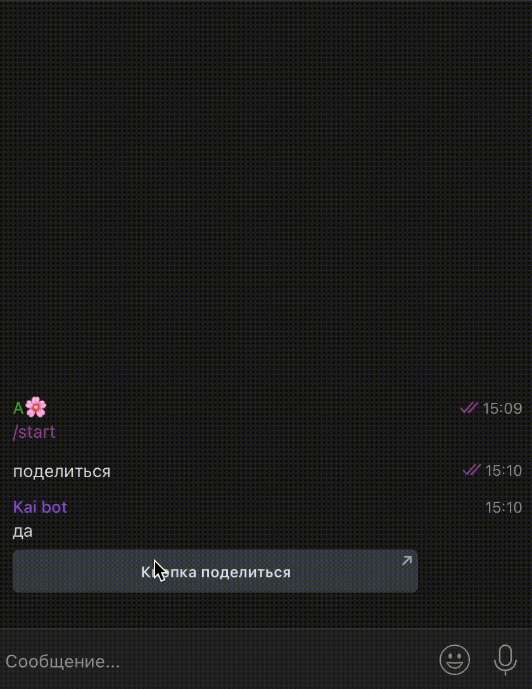

# Кнопки в Telegram


Рекомендуем ознакомиться со статьей "[Кнопки](/broken/pages/xeepnRj969zW3xRimkdg)" в разделе "[Как создать чат-бот"](/broken/pages/-M1GcGC3Set0iu6nGG-E).


В Telegram можно использовать как Reply-кнопки (обычные или клавиатурные), так и Inline-кнопки (кнопки в тексте).


**Важно!**&#x20;

**Информация об ограничениях:**\
\- Reply-кнопки (обычные или клавиатурные) до 12 штук в строке;\
\- Inline-кнопки до 8 штук в строке;\
\- ТЕКСТ в кнопке **ограничен 32 символами;**\
**-** кнопке **НЕЛЬЗЯ задать цвет**.


## Как создать кнопку в блоке

Чтобы создать кнопку любого вида в блоке чат-бота, перейдите в настройки блока и кликните на вкладку "Кнопки":

<figure><figcaption></figcaption></figure>

Тогда раскроются настройки для добавления и редактирования кнопки. Далее кликните добавить:

<figure><figcaption></figcaption></figure>

Откроется модальное окно с настройками кнопки, где указывается текст кнопки, ее функция и иные настройки:

<figure><figcaption></figcaption></figure>

В Сейлботе существует ряд кнопок, которые работают только для бота в Telegram:

1. Поделиться;
2. Callback-кнопка;
3. Telegram WebApp (чтобы открыть мини-приложение в ТГ, например, с виджетом или сайтом);
4. Авторизация через Telegram;

<figure><figcaption></figcaption></figure>

Также в Telegram доступны и другие кнопки, например, оплаты, запросить номер телефона или геолокацию, отправить ссылку.&#x20;

## К**нопка "Поделиться"**

При создании кнопки выбираете "Поделиться (только Telegram)" и заполняете поля (поле дополнительный текст необязательно):

<figure><figcaption></figcaption></figure>

При нажатии на получившуюся кнопку будет предложено выбрать кому из списка контактов переслать информацию:

<figure><figcaption></figcaption></figure>

В зависимости от того, какую ссылку вы поместили в строке "Поделиться ссылкой" в настройках кнопки, та ссылка будет отправлена по кнопке поделиться:

<figure><figcaption></figcaption></figure> <figure><figcaption></figcaption></figure>

После выбора получателя будет вставлена ссылка из строки “Поделиться ссылкой”, а также текст из строки “Дополнительный текст”.

Таким образом, можно передавать ссылки, в том числе на сообщения из каналов в телеграмм.&#x20;


Внимание! На некоторых устройствах под управлением iOs может работать некорректно.



Telegram: кнопка Поделиться


## **Кнопка для авторизации на сайте**

Для работы этой кнопки требуется привязка бота к домену. Делается это через @BotFather.&#x20;

Выберите бота в диалоге с @BotFather, далее Bot Settings

<figure><figcaption></figcaption></figure>

Далее переходим в пункт Domain:

<figure><figcaption></figcaption></figure>

Далее в зависимости от того, был ли ранее установлен домен, будет кнопка Set Domain или Edit domain:&#x20;

<figure><figcaption></figcaption></figure> <figure><figcaption></figcaption></figure>

Вам будет предложено установить домен для бота:

<figure><figcaption></figcaption></figure>

Как это сделать правильно? Укажите домен [salebot.pro](http://salebot.pro) или Свой домен, если он подключен к сайту на Сейлбот.

После того, как все приготовления готовы, можно создать кнопку:

<figure><figcaption></figcaption></figure>

В поле Текст впишите текст для надписи на кнопке.\
В поле Ссылка - url-адрес страницы, на которой будет реализована авторизация.

<figure><figcaption></figcaption></figure>

Остальные поля будут нужны, если для авторизации будет использоваться отдельный бот (требуется получить разрешение на отправку сообщений для этого бота):  в частности, потребуется указание имени бота.&#x20;

Если нужна возможность отправлять сообщения от указанного бота, то обязательно поставьте галочку для “Запросить разрешение у пользователя на отправку сообщений от бота”:

<figure><figcaption></figcaption></figure>


Telegram: кнопка Авторизация через Telegram


## Callback-кнопка

Callback-кнопка - это кнопки с обратной связью, когда клиент видит одно, а в бот мы получаем нужный нам callback для запуска какого-либо блока воронки.

<figure><figcaption></figcaption></figure>

Создать ее довольно просто: в поле Кнопки нажмите на кнопку Добавить кнопку. В открывшейся форме введите текст, укажите тип - Callback-кнопка (Вконтакте, Telegram) и введите текст Callback, который должен вернуться при клике на кнопку:

<figure><figcaption></figcaption></figure>

Визуально кнопка выглядит как обычная inline-кнопка:

<figure><figcaption></figcaption></figure>

В карточке клиента после клика по кнопке  Вы увидите настроенный Callback:

<figure><figcaption></figcaption></figure>


Важно!&#x20;

В Telegram <mark style="color:red;">**не поддерживается**</mark> Callback-клавиатурные кнопки.



Обращаем внимание!&#x20;

Если выбран тип кнопки "Колбек", то кнопка отобразится колбеком только в том случае, если текст кнопки будет отличаться от текста колбека.&#x20;


## **Кнопка Telegram Web Application**

Такая кнопка позволяет открыть сайт в виде веб-приложения в Telegram.

<figure><figcaption></figcaption></figure>

При добавлении кнопки укажите текст, тип кнопки Telegram Web Application. Далее если у вас создан сайт на платформе Сейлбот, то достаточно будет выбрать сайт из списка:

<figure><figcaption></figcaption></figure>

Если вам нужно указать сайт, созданный не в Сейлбот, то нажмите на кнопку "Указать внешнюю ссылку" и в поле URL вставьте нужную вам ссылку:

1. Можно указать ссылку через переменную:

<figure><figcaption></figcaption></figure>


Указать ссылку через переменную удобно, если вам часто необходимо менять адрес страницы или сайта, например, записав переменную в настройках проекта.

Затем чтобы спустя какое-то время не искать, в каком именно блоке у вас находится кнопка с Веб-апп, достаточно будет поменять значение переменной в настройках проекта.


Как указать ссылку в настройках проекта и передать ее в поле url

Например, укажите переменную в настройках проекта.&#x20;

1. Перейдите в настройки проекта:

<figure><figcaption></figcaption></figure>

2. Далее во вкладке "Переменные" укажите переменную, в которой лежит значение в виде ссылки:

<figure><figcaption></figcaption></figure>

Далее останется передать переменную с ссылкой #{url} в поле url:

<figure><figcaption></figcaption></figure>

2. Можно указать прямую ссылку в настройках кнопки:

<figure><figcaption></figcaption></figure>


Telegram: кнопка WebApp


## Как создать кнопки для использования в функциях API Telegram 

Для большинства довольно сложно освоить API ботов Telegram и потом использовать их при создании клавиатуры, но специально для новичков есть способ проще. Вы можете просто использовать в своих нуждах  генерируемый в расширенных настройках кнопок код.&#x20;

Для этого перейдите в настройки блока и выберите раздел Кнопки. Добавьте все необходимые кнопки:

<figure><figcaption></figcaption></figure>

Далее нажмите на "Расширенные настройки".

Код созданных кнопок Вы найдете при клике на Расширенные настройки в поле Расширенные настройки кнопки:

<figure><figcaption></figcaption></figure>

После этого скопируйте все из расширенных настроек кнопок (предварительно можете проверить работу кнопок прямо из этого блока) в переменную, например, под названием buttons:

<figure><figcaption></figcaption></figure>

Далее воспользуемся функцией <mark style="color:purple;">**tg\_send\_message**</mark>**(platform\_id, text,client\_message\_id,&#x20;**<mark style="color:red;">**reply\_markup**</mark>**, parse\_mode, disable\_web\_page\_preview, protect\_content, disable\_notification**, **message\_thread\_id, entities):**

Переменную buttons передайте переменную в функцию в параметре <mark style="color:red;">**reply\_markup:**</mark>

<figure><figcaption></figcaption></figure>

В результате получите кнопки в том виде, в каком задавали их в расширенных настройках кнопок:

<figure><figcaption></figcaption></figure>

### Видео-инструкция "Код кнопок"


Код кнопок для функций API Telegram


## Как удалить Reply-кнопки

Обычно кнопки удаляются сами, но бывают исключения.

Для удаления зависших кнопок Reply (клавиатурные кнопки) воспользуйтесь следующим кодом: \[{"buttons":\[],"one\_time":true,"index\_in\_line":0,"line":0}]

Данный код следует разместить в расширенных настройках кнопок:

<figure><figcaption></figcaption></figure>

## Клавиатурные кнопки-меню в Telegram


<mark style="color:red;">**ВНИМАНИЕ!**</mark> Данную возможность рекомендуем использовать только продвинутым пользователям


### Клавиатурные кнопки

Для получения возможности использовать клавиатурные кнопки (reply) как постоянное меню Телеграм достаточно присвоить любое значение переменной **tg\_permanent\_reply\_buttons** (переменная объявляется константой проекта).

<figure><figcaption></figcaption></figure> <figure><figcaption></figcaption></figure>

**Краткое описание действия включения** **tg\_permanent\_reply\_buttons:**

Задавая среди своих переменных **tg\_permanent\_reply\_buttons**, Вы говорите о своем желании получить полный контроль над кнопками типа reply. Автоматические действия отключаются и ответственность переходит в Ваши руки. Данное действие распространяется на все вновь созданные клавиатурные кнопки для телеграмм


Для возвращения возможности скрывать reply-клавиатуру удалите переменную **tg\_permanent\_reply\_buttons** и reply-кнопки, созданные пока данная переменная была в настройках  проекта.


## Как сделать меню в Telegram

Как сделать такое меню в Telegram:

<figure><figcaption></figcaption></figure>

Сделать такое меню может тот, кто создавал Telegram-бота.

Для этого нужно написать в [Botfather ](https://t.me/BotFather)в Телеграм.

Вводите команду /mybots , открывается список ваших ботов. Выбираете нужный. У вас открывается меню. Здесь нужно выбрать Edit Bot, а затем Edit Commands

<figure><figcaption></figcaption></figure>

<figure><figcaption></figcaption></figure>

Далее одним сообщением вводите команды и описание к ним. Название команд прописывается строчными буквами. Вам придет сообщение, что список команд обновлен.

<figure><figcaption></figcaption></figure>

Теперь в диалоге с ботом в Telegram можно увидеть меню:

<figure><figcaption></figcaption></figure>

При клике на кнопку меню, откроется список команд, которые ранее прописали в BotFather:

<figure><figcaption></figcaption></figure>

Далее переходите в Salebot, открываете проект, к которому подключен этот телеграм-бот.

Создаете блоки "Первостепенная проверка условия" или "Не состояние с условием", в условиях прописываете команды, а в поле "Текст сообщения" — тексты, которые будут приходить в ответ.

Пример:

<figure><figcaption></figcaption></figure>

## Как совместить два вида кнопок

Создаете блок с reply-кнопкой (клавиатурная), которые вам необходимо визуализировать. Например: \[{"type": "reply", "text": "НАЗВАНИЕ КНОПКИ", "line": 0, "index\_in\_line": 0}]

<figure><figcaption></figcaption></figure>

Далее создаете следующий блок (таймер в 0 секунд) с inline-кнопками (кнопки в тексте), которые необходимо разместить, не убирая reply-кнопки. Например: \[{"type": "inline", "text": "НАЗВАНИЕ КНОПКИ", "line": 0, "index\_in\_line": 0}]

<figure><figcaption></figcaption></figure>

Результат:

<figure><figcaption></figcaption></figure>


Полезно знать

Обязательно соблюдайте последовательность: сначала reply кнопки, а потом inline. Иначе reply-кнопки пропадут со следующим блоком.



Telegram: как соединить два вида кнопок

