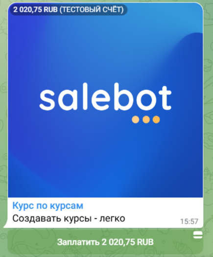
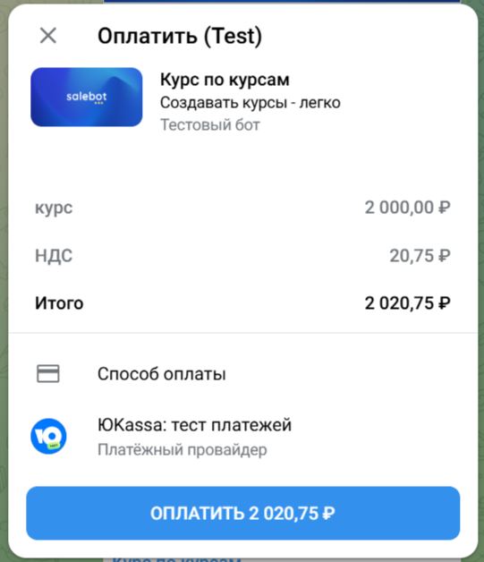

# Оплата Telegram

## Как подключить платежную систему

Платежная система встроена в Телеграм. Для того чтобы совершать платежи внутри мессенджера, нужно:&#x20;

* подключить платежную систему к боту в боте Botfather
* перейти в настройки нужного бота и в меню выбрать Payments
* следуя инструкциям, подключить доступную платежную систему и скопировать выданный токен

<figure><figcaption></figcaption></figure>

<figure><figcaption></figcaption></figure>

## **Как выставить счет клиенту (invoice)**

Для отправки инвойса в Telegram используйте метод и укажите необходимые параметры.

**tg\_send\_invoice(provider\_token, platform\_id, title, description, currency, prices, photo\_url, payload, protect\_content, disable\_notification, need\_name, need\_phone\_number, need\_email, reply\_to\_message\_id, reply\_markup, message\_thread\_id, provider\_data)**

<table><thead><tr><th width="270">Параметры функции</th><th>Описание параметра</th></tr></thead><tbody><tr><td><mark style="color:red;"><strong>!</strong></mark> provider_token </td><td>(обязательный параметр) токен, полученный в Botfather после подключения платежной системы</td></tr><tr><td><mark style="color:red;"><strong>!</strong></mark> platform_id </td><td>(обязательный параметр) идентификатор получателя - пользователя, группы или канала</td></tr><tr><td><mark style="color:red;"><strong>!</strong></mark> title </td><td>(обязательный параметр) заголовок товара, 1-32 символа</td></tr><tr><td><mark style="color:red;"><strong>!</strong></mark> description </td><td>(обязательный параметр) описание товара, 1-255 символов</td></tr><tr><td><mark style="color:red;"><strong>!</strong></mark> currency </td><td>(обязательный параметр) валюта платежа (RUB, USD, UAH и тд подробнее<a href="https://core.telegram.org/bots/payments#supported-currencies"> https://core.telegram.org/bots/payments#supported-currencies</a> )</td></tr><tr><td>prices</td><td>массив массивов с данными по стоимости товара и дополнительных услуг (доставки, упаковки и тд). Отображается на странице оплаты. Сумма указывается либо целым числом 125, либо дробным через точку 120.25 Например: [["товар", 2000], ["НДС", 20.75], ["упаковка", 100]]</td></tr><tr><td>photo_url</td><td>ссылка на картинку товара</td></tr><tr><td>payload </td><td>первая часть коллбэка об оплате, по умолчанию tg_payment</td></tr><tr><td>protect_content</td><td>1 защитить от копирования и скриншотов, 0 - без защиты</td></tr><tr><td>disable_notification </td><td>1 - отправить с уведомлением, 0 - без уведомления</td></tr><tr><td>need_name</td><td>1, если вам требуется полное имя пользователя для завершения заказа, 0 - без запроса имени</td></tr><tr><td>need_phone_number</td><td>1, если вам требуется номер телефона пользователя для завершения заказа, 0 - без запроса номера</td></tr><tr><td>need_email </td><td>1, если вам требуется емейл пользователя для завершения заказа, 0 - без запроса почты</td></tr><tr><td>reply_to_message_id</td><td>id сообщения, на которое отвечаем, если хотите отправить инвойс отдельным сообщение, то поставьте две одинарные кавычки</td></tr><tr><td>reply_markup</td><td>клавиатура, первой кнопкой должна быть кнопка с типом pay</td></tr><tr><td>message_thread_id </td><td>идентификатор темы (доступно для супергрупп при наличии функционала форума)</td></tr><tr><td>provider_data </td><td>данные о счете в формате JSON, которые будут переданы поставщику платежных услуг. Платежная система должна предоставить подробное описание обязательных полей.</td></tr></tbody></table>


**Важно!** Все параметры необходимо передать в порядке, в котором они указаны в функции. Если вам необходимо указать какой-то определённый параметр и опустить другие, на месте параметров, которые вам не нужны, оставляйте пустые значения или значения, соответствующие документации.


Пример:

<figure><figcaption>
Настройка блока "Стартовое условие"
</figcaption></figure>

В результате в Телеграм чате выставится счет:

<figure><figcaption></figcaption></figure> <figure><figcaption></figcaption></figure>

Если указан один из параметров **need\_name**, **need\_phone\_number** или **need\_email**, то перед оплатой у пользователя будут запрошены эти данные и при успешной оплате они сохранятся в переменные клиента.&#x20;

Пример:

<figure><figcaption></figcaption></figure>

Результат: перед оплатой запрашиваются данные:

<figure><figcaption></figcaption></figure>

## Коллбэк об оплате

После успешной оплаты в чат с пользователем придет коллбэк следующего содержания:

course\_pay 1372995196 120.75 RUB 2ff747b9-000f-5000-b000-16d7e3517aa9 **,** где&#x20;

1. course\_pay - payload - из запроса на создание инвойса;&#x20;
2. 1372995196 - ID чата, в который изначально был отправлен инвойс;&#x20;
3. 120.75 - полная сумма платежа;&#x20;
4. RUB - валюта;&#x20;
5. 2ff747b9-000f-5000-b000-16d7e3517aa9 - ID платежа в системе мерчанта.

<figure><figcaption></figcaption></figure>

А также если запрашивали ввод имени, телефона и/или email, то у клиента пропишутся переменные:

**tg\_payment\_name**, **tg\_payment\_phone** и **tg\_payment\_email**

<figure><figcaption></figcaption></figure>


В случае успеха коллбэк об оплате будет отправлен в личные сообщения пользователю.\
**Для этого обязательно взаимодействие клиента и бота до платежа (клиент должен быть подписан на бота)!**



После получения хука об оплате, платеж будет автоматически подтвержден, методом answerPreCheckoutQuery [https://core.telegram.org/bots/api#answerprecheckoutquery](https://core.telegram.org/bots/api#answerprecheckoutquery)


## Закрепленное сообщение с кнопкой оплаты

После подключения платежной системы необходимо воспользоваться функцией закрепления сообщений - **tg\_pin\_chat\_message(platform\_id, message\_id, disable\_notification)**

<table><thead><tr><th width="271">Параметры функции </th><th>Описание</th></tr></thead><tbody><tr><td><mark style="color:red;"><strong>!</strong></mark><strong> platform_id</strong></td><td>идентификатор чата внутри Telegram <a href="oplata-telegram.md#gde-vzyat-platform_id-dlya-otpravki-uvedomlenii"><strong>*</strong></a></td></tr><tr><td><strong>message_id</strong> </td><td>идентификатор сообщения, которое нужно закрепить</td></tr><tr><td><strong>disable_notification</strong> </td><td>
параметр определяет нужно ли отправлять уведомление всем участникам чата о новом закрепленном сообщении (уведомления всегда отключены в каналах и приватных чатах). 

Если не нужно отправлять уведомления, то в качестве значения параметра <strong>disable_notification</strong> передайте 1, иначе - 0.
</td></tr></tbody></table>

Пример:

1 шаг:\
prices = \[\["курс", 100], \["НДС", 20.75]]

result=tg\_send\_invoice('381764678:TEST:129736', platform\_id, 'Курс по курсам', 'Создавать курсы - легко', 'RUB', prices, 'https://salebot.pro/promo.png', 'course\_pay','0', '0', '1', '1', '1', '', '{"inline\_keyboard": \[\[{"text":"Оплатить", "pay":"True"}]]}')

2 шаг:\
В результате выполнения первого шага вы получите ответ, из которого требуется достать значение message\_id при помощи функции get(): \
res=get(result,'result')\
m\_id=get(res,'message\_id')

<figure><figcaption>
Переменные сделки в разделе "Клиенты"
</figcaption></figure>

Далее закрепляем сообщение: tg\_pin\_chat\_message(#{platform\_id}, #{m\_id}, 1)

<figure><figcaption>
Закрепленное сообщение в Telegram
</figcaption></figure>

### Пример с минимальным набором параметров

prices = \[\["супер-курс", 100]]

result= tg\_send\_invoice('381764678:TEST:129736', platform\_id, 'SuperКурс по курсам', 'Создавать курсы - superлегко', 'RUB', prices)

<figure><figcaption></figcaption></figure>

<figure><figcaption></figcaption></figure>

### **Пример с клавиатурой**

prices = \[\["курс", 100], \["НДС", 20.75]]

tg\_send\_invoice('381764678:TEST:129736', platform\_id, 'Курс по курсам', 'Создавать курсы - легко', 'RUB', prices, 'https://salebot.pro/promo.png', 'course\_pay','0', '0', '1', '1', '1', '', '{"inline\_keyboard": \[\[{"text":"Оплатить", "pay":"True"}], \[{"text":"Еще кнопка", "callback\_data": "Еще кнопка"}]]}')

<figure><figcaption></figcaption></figure>

<figure><figcaption></figcaption></figure>
