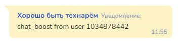
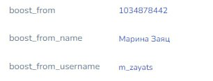
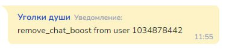
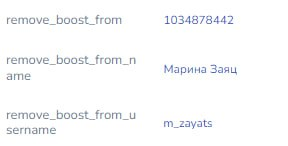

# Подключение бота к каналу/группе

## Работа с группами/каналами в Telegram


**Полезное**

Группа в Telegram представляет собой канал коммуникации между участниками: в ней могут писать все участники.

Telegram-канал является односторонним средством общения. Только владелец или администраторы могут отправлять сообщения, в то время как остальные участники могут только просматривать их и оставлять комментарии.


### Как добавить бота в группу/канал Telegram

Эта возможность для бота включается  в BotFather:

Шаг 1. Переходим в настройки бота:

<figure><figcaption>
Кликаем на Bot Settings
</figcaption></figure>

Шаг 2. Кликните по "Allow Groups?'

<figure><figcaption>
Allow Groups?
</figcaption></figure>

Шаг 3. Должен быть статус enabled

<figure><figcaption></figcaption></figure>

### Видео-инструкция добавления бота в канал


Как включить возможность добавлять бота в группы и каналы


### Добавить бота как администратора в группе/канале

Для того, чтобы автоматизировать работу в чатах и каналах необходимо добавить своего бота Администратором.&#x20;

Как это сделать?

Шаг 1.  Перейдите в Управление группой/каналом и выберите вкладку “Администраторы”

<figure><figcaption></figcaption></figure>

Шаг 2. Нажмите кнопку “Добавить Администратора”

<figure><figcaption></figcaption></figure>

Шаг 3.  В поисковой строке введите логин Вашего бота.&#x20;

<figure><figcaption></figcaption></figure>

Шаг 4. Для успешной работы бота предоставьте права на работу/удаление сообщений:

<figure><figcaption></figcaption></figure>

### Переменные для работы в чатах


Важно знать!&#x20;

Сохранение переменных в групповых чатах для таких событий, как вступление в чат, выход из чата, новый лайк и т д. недоступно.

Переменные будут доступны только внутри блока, который отработал. Можно в блоке вывести эти переменные для отслеживания работы

Это НИКАК не повлияет на работу чат-ботов, в разделе клиентов нельзя будет отследить, кто зашел/вышел.


1. **Переменные с информацией об авторе сообщения**&#x20;

**message\_from** - идентификатор автора сообщения \
**message\_from\_name** - имя автора сообщения \
**message\_from\_username** - ник автора сообщения в Телеграм

<figure><figcaption></figcaption></figure>

2. **Переменные с информацией о пересылаемом сообщении**

**reply\_message\_id** - номер сообщения, которое пересылают \
**reply\_from** - кто автор пересылаемого сообщения \
**reply\_from\_name** - имя того, чье сообщение пересылается \
**reply\_from\_username** - ник того, чье сообщение пересылается \
**reply\_from\_chat\_id** - номер диалога, из которого сообщение переслали

3. Добавление и удаление из группы

В этом случае срабатывают колбеки **new\_chat\_member** и **left\_chat\_member (переменные в карточке клиента не сохраняются)**:

**chat\_member\_name** - имя пользователя \
**chat\_member\_username** - ник пользователя\
**chat\_member\_id** - номер пользователя

## Callback / колбеки в Телеграм

**client\_unsubscribed** - клиент отписался, заблокировал бот\
**client\_returned** - клиент разблокировал бота

<figure><figcaption></figcaption></figure>

**write\_access\_allowed mytestapp** - где "mytestapp" название веб аппа.&#x20;

<figure><figcaption></figcaption></figure>

коллбэк означает, что клиент открыл веб-апп и выдал боту разрешение на получение сообщений. Выдать такое разрешение можно только единожды.

### Колбеки в группах/каналах&#x20;

**new\_chat\_member** - добавлен новый пользователь \
**left\_chat\_member** - пользователь покинул канал \
**kicked\_chat\_member** - пользователь удален администратором \
**chat\_join\_request** - получена заявка на добавление в канал\
**edited\_channel\_post** - пост на канале был отредактирован (edited\_channel\_post + дата и время редактирования)

<figure><figcaption>
Колбеки отображаются в разделе клиенты
</figcaption></figure>

bot\_added\_to\_group - в чат добавлен бот (неважно какой, отреагирует на любого, даже если подключенный бот сам был добавлен в группу);\
bot\_left\_group - аналогичный коллбэк - удаление бота из канала;\
new\_like - поставил лайк на пост\
like\_deleted - удалил лайк с поста

<figure><figcaption></figcaption></figure>

Число в коллбэке (new\_like; like\_deleted) - это id сообщения, на которое поставили или с которого убрали реакцию.&#x20;


Важно знать!&#x20;

1. **В Телеграм-каналах коллбеки на реакции не отображаются! Коллбеки на реакции приходят только в группах.**
2. Если один человек поставил несколько лайков, а потом удалил 1 из них, то не отображается, какой именно лайк был удален.


При появлении коллбеков с реакциями в группах доступны переменные в блоке:&#x20;

**reaction\_on\_message\_id** - содержит id сообщения на которое была реакция\
**reaction\_from** - id от кого была реакция\
**message\_from\_username** - юзернейм от кого была реакция (если есть)\
**reaction\_from\_name** - имя от кого была реакция

<figure><figcaption></figcaption></figure>

Также если в Telegram отвечают на сообщение, то переменная **reply\_text** в карточке будет содержать полный текст сообщения, на которое ответили.&#x20;

<figure><figcaption></figcaption></figure>

Если человек цитировал, то также будет переменная **tg\_quote**, содержащая цитату:

<figure><figcaption></figcaption></figure> <figure><figcaption></figcaption></figure>

### Коллбеки с Boost

1. chat\_boost\_from user #{id\_user} - подарили буст чату (или каналу):

<figure><figcaption></figcaption></figure>

При получении данного коллбека генерируются переменные:

<figure><figcaption></figcaption></figure>

2. remove\_boost\_from user #{id\_user} - забрали буст у чата (или канала):

<figure><figcaption></figcaption></figure>

При получении данного коллбека генерируются переменные:

<figure><figcaption></figcaption></figure>

3. chat\_boost from giveaway - выдается при проведении розыгрыша звезд в канале
4. remove\_chat\_boost from giveaway - закончился срок буста за розыгрыш звезд в канале

### Как автоматизировать удаление системных уведомлений в группах

Для автоматического удаления всех системных сообщений достаточно присвоить любое значение переменной **del\_tg\_system\_messages** (переменная может быть как константой проекта, так и переменной сделки) и дать боту разрешение на удаление сообщений.

Использовать переменную **del\_tg\_system\_messages** возможно только в группах. В каналах присвоение какого-либо значения данной переменной не приведет ни к какому результату.

<figure><figcaption></figcaption></figure>

<figure><figcaption>
Права администратора в настройках группы Телеграм
</figcaption></figure>

Удаляются следующие виды системных уведомлений:&#x20;

\- Изменено название группы&#x20;

\- Изменена фотография группы&#x20;

\- Удалена фотография группы&#x20;

\- Закреплено сообщение&#x20;

\- Пользователь вступил в группу&#x20;

\- Пользователь вышел из группы

Если вы хотите удалять лишь избранные типы системных уведомлений, то вместо переменной **del\_tg\_system\_messages** создайте переменную **del\_tg\_chosen\_messages** и поместите в нее массив с типами уведомлений, которые нужно удалить, через запятую.


Обращаем внимание!\
Данные переменные сработают только для групп в Телеграме, а в каналах - нет.&#x20;


Варианты системных уведомлений:&#x20;

* 'new\_chat\_member' – пользователь вступил в группу,&#x20;
* 'left\_chat\_member' – пользователь покинул группу,&#x20;
* 'pinned\_message' – закреплено сообщение,&#x20;
* 'delete\_chat\_photo' – удалена фотография группы,&#x20;
* 'new\_chat\_photo' – изменена фотография группы,&#x20;
* 'new\_chat\_title' – изменено название группы&#x20;

Например, вам нужно удалить все виды системных сообщений, кроме вступления в группу; тогда вам необходимо добавить все виды колбеков в переменную (константу) проекта, кроме "new\_chat\_member".&#x20;

<figure><figcaption></figcaption></figure>


Важно!&#x20;

Удаление системных уведомлений не затронет колбеки. Удалено будет только системное сообщение из диалога в Telegram


## Форум в Telegram

Форум — это группа, в которой можно создавать отдельные темы для обсуждения. В форуме можно использовать стандартные функции: прикреплять медиафайлы, публиковать опросы, настраивать уведомления. Ещё можно закреплять сообщения и добавлять ботов — отдельных в каждый чат.

<figure><figcaption></figcaption></figure>

Если возникает вопрос, зачем нужен форум, то ответ кроется в организации процесса общения между участниками. Если в группе много участников, следить за общением и находить нужные сообщения в общем потоке сложно. Поэтому организация разных тематических обсуждений или, привычное нам наименование, форумов значительно упрощает процесс объединения участников по интересам.

Создать тему может только владелец группы, если в группе свыше 100 участников. Если группа привязана к каналу, то Тему создать не получится. Подключаются Темы в Настройках группы:

<figure><figcaption></figcaption></figure>

Как администратор, создать тему можно в настройках группы-форума:

<figure><figcaption></figcaption></figure>

После подключения Тем аватарка с круглой изменится на квадратную, что позволяет выделить форум среди иных чатов Telegram:

<figure><figcaption></figcaption></figure>

## Как настроить связку клиента-телеграм с сайтом?


Подробнее о том, как после успешной оплаты привязать клиента телеграм и клиента с сайта, [читайте здесь](/broken/pages/YOzidl4HYJaWmkPXnuYY#kak-nastroit-svyazku-klienta-iz-telegram-s-klientom-saita-telefonii)


## Проверка подписок


