# Telegram Business-аккаунт

Теперь существует возможность создавать специализированных ботов, которые могут быть интегрированы в личные чаты бизнес-пользователей в мессенджере Telegram. Эти боты способны автоматически обрабатывать входящие запросы, отвечая от имени владельца аккаунта, что позволяет существенно сократить время на рутинные операции и повысить эффективность коммуникации.

Данные боты могут быть использованы для различных целей, таких как консультации по продуктам или услугам, ответы на вопросы пользователей и многое другое. Они могут быть настроены для выполнения широкого спектра задач.

Важно отметить, что пользователь всегда может вернуться к ручной форме общения в любое удобное для него время, не прерывая работу бота.


Важно!&#x20;

В Telegram business-аккаунт есть окно 24 часа.&#x20;

Если закрыто, то будет отправляться следующая ошибка:

Соответственно бот не сможет отправить сообщение клиенту.&#x20;

После первого сообщения от бота в течение 24 часов можно писать клиенту. Если клиент не ответил, то окно будет закрыто и сообщения не будут отправляться, пока клиент не ответит боту.&#x20;


## Подключение бота

Шаг 1. Настройка в разделе "Каналы".

1. **Если подключаете Телеграм-бота впервые.**

Для начала перейдите во вкладку Каналы в разделе Salebot для подключения чат-бота Telegram (если такового еще нет).&#x20;

<figure><figcaption></figcaption></figure>

Далее подключаем [Телеграм-бота согласно инструкции](/broken/pages/7fmy0xrLRyQ3zT9Cbo3I).&#x20;

2. **Если Телеграм-бот подключен**.&#x20;

В случае, если у вас уже есть подключенный Телеграм-бот, найдите данного бота в каналах:

<figure><figcaption></figcaption></figure>

Далее кликните по кнопке настройки, после чего вам откроется модальное окно с полями токена и пр.:

<figure>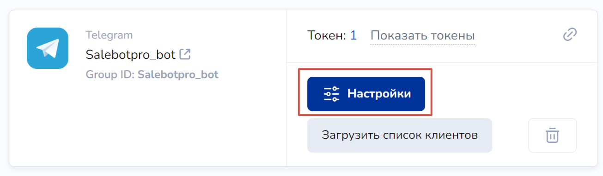<figcaption></figcaption></figure>

В открывшемся модальном окне кликните на ГОТОВО для обновления настроек вашего Телеграм-бота (больше никаких настроек менять не нужно):

<figure>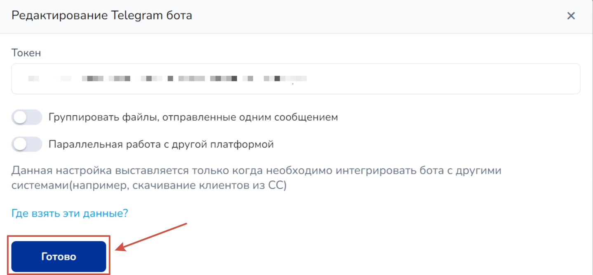<figcaption></figcaption></figure>

На данном этапе работа с каналами завершена. Переходите в настройки мессенджера.&#x20;

Шаг 2. Настройки мессенджера.&#x20;

Чтобы подключить в бизнес-аккаунте чат-бота для Telegram, перейдите в настройки профиля, где необходимо найти вкладку "Telegram для бизнеса":

<figure>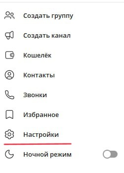<figcaption></figcaption></figure> <figure>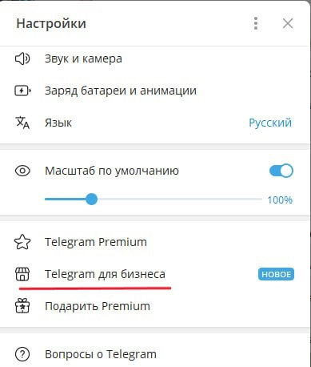<figcaption></figcaption></figure>

Далее вы увидите вкладку "Чат-боты", куда необходимо перейти:

<figure>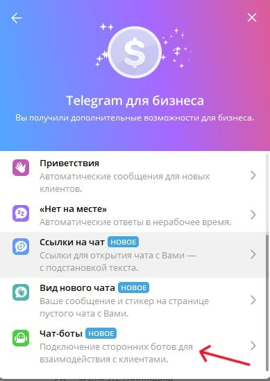<figcaption></figcaption></figure>

После чего в открывшейся вкладке укажите ссылку необходимого телеграм-бота либо его имя (приоритетнее ввод ссылки):

<figure>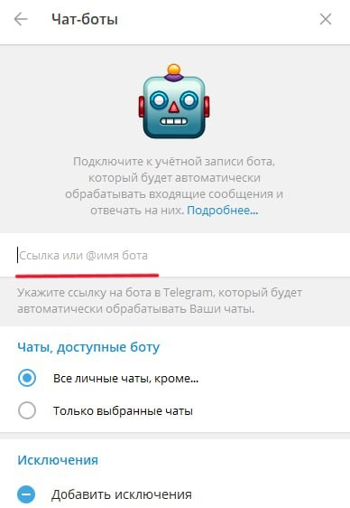<figcaption></figcaption></figure>

Установите в этой же вкладке разрешение (чекбокс "Ответы на сообщения") чат-боту отвечать на сообщения:

<figure><figcaption></figcaption></figure>

На данном этапе настройка чат-бота в бизнес аккаунте завершена. Переходите далее.

Шаг 3. Настройки BotFather.

После привязки чат-бота к бизнес-аккаунту, необходимо поменять настройки самого чат-бота в BotFather, где вы ранее создавали бота для Telegram. \
Для этого перейдите в диалог с BotFather, где необходимо подключить работу с бизнес-аккаунтом:

<figure>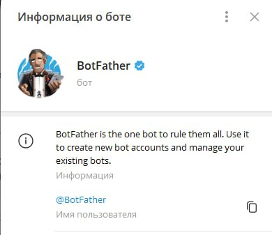<figcaption></figcaption></figure>

Перейдите в настройки самого бота:

<figure>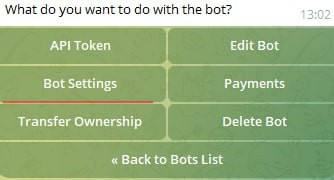<figcaption></figcaption></figure>

Далее кликните по кнопке "Business Mode" для подключения бизнес-режима для чат-бота:

<figure>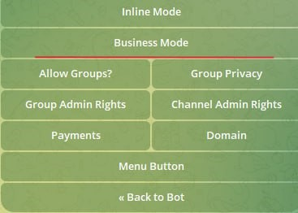<figcaption></figcaption></figure>


Готово! Все необходимые настройки чат-бота с бизнес аккаунтом завершены.


Теперь в настройках канала вы найдете Телеграм-бота, в котором увидите business ID и также имя владельца бизнес-аккаунта:

<figure>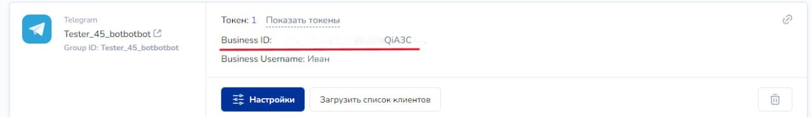<figcaption></figcaption></figure>

### Как отключить&#x20;

Для отключения чат-бота с бизнес-режимом, перейдите в каналы и найдите чат-бота, в котором необходимо отключить данную настройку. Кликните по кнопке настройки:

<figure>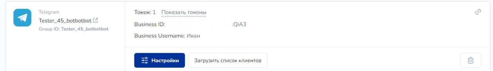<figcaption></figcaption></figure>

Кликните по кнопке "Отключить бизнес-аккаунт":

<figure>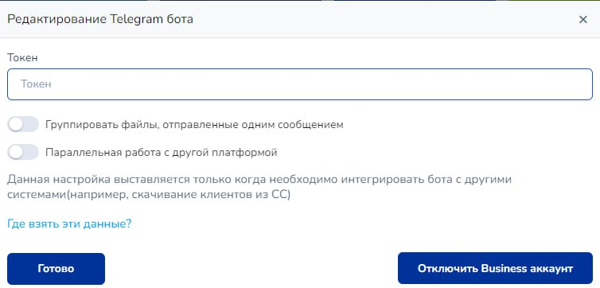<figcaption></figcaption></figure>


При отключении бизнес-аккаунта чат-бот продолжит свою работу в штатном режиме.&#x20;


## Видео-инструкция



## Доступные функции

1. Функция (API) в калькуляторе:

**tg\_callback(platform\_id , callback\_message,group\_id, tg\_business)**

<strong>tg_callback</strong>

Параметры:

**! platform\_id** - идентификатор клиент Telegram

**! callback\_message** - текст сообщение в колбеке

**group\_id** - идентификатор бота Telegram

**tg\_business -** для работы с бизнес-клиентами, передается значение "1".

**tg\_send\_poll(platform\_id, question, options, is\_anonymous, allows\_multiple\_answers, reply\_markup, disable\_notification, protect\_content, token, reply\_to\_message\_id, message\_thread\_id, business\_connection\_id)**

<strong>tg_send_poll</strong>

Параметры:&#x20;

**! platform\_id** - идентификатор чата внутри Telegram [**\***](https://docs.salebot.pro/messendzhery-i-chaty/kak-sozdat-bota-v-telegram/api-telegram-funkcii-dlya-ispolzovaniya-vsekh-vozmozhnostei-telegram#gde-vzyat-platform_id-dlya-otpravki-uvedomlenii)

**! question** - вопрос

**! options** - массив вариантов ответов

**is\_anonymous** - 1 - анонимный опрос, '' - не анонимный

**allows\_multiple\_answers** - 1 - возможны несколько ответов, '' - один ответ

**reply\_markup** - клавиатура или '' - без клавиатуры

**disable\_notification** — признак отправки со звуковым уведомлением (по умолчанию 0) 1 - отключить уведомление при получении, 0 - передать с уведомлением

**protect\_content** - 1 защитить от копирования и скриншотов, '' - без защиты

**token** - токен бота, если не передан используется текущий

**reply\_to\_message\_id** - идентификатор цитируемого сообщения

**message\_thread\_id** — идентификатор темы (доступно для супергрупп при наличии функционала форума)

**business\_connection\_id -** значение при подключении бота - Business ID - отображается в каналах. Следует передавать, если в параметрах передается токен бота и надо отправить через подключенный к боту пользовательский аккаунт

**tg\_send\_quiz\_poll(platform\_id, question, options, explanation, correct\_option\_id, is\_anonymous, reply\_markup, parse\_mode, protect\_content, disable\_notification, token, reply\_to\_message\_id, message\_thread\_id )**

<strong>tg_send_quiz_poll</strong>

**! platform\_id** - идентификатор чата внутри Telegram [**\***](https://docs.salebot.pro/messendzhery-i-chaty/kak-sozdat-bota-v-telegram/api-telegram-funkcii-dlya-ispolzovaniya-vsekh-vozmozhnostei-telegram#gde-vzyat-platform_id-dlya-otpravki-uvedomlenii)

**! question** - вопрос

**! options** - массив вариантов ответов

**! explanation** - текст, который отображается, когда пользователь выбирает неправильный ответ или нажимает на значок лампы в опросе в стиле викторины, 0–200 символов с не более, чем двумя переводами строки после разбора сущностей.

**! correct\_option\_id** - номер правильного ответа, нумерация с 1

**is\_anonymous** - 1 - анонимный опрос, '' - неанонимный

**reply\_markup** - клавиатура или '' - без клавиатуры

**parse\_mode** - markdown или html для explanation или '' - без форматирования

**protect\_content** - 1 защитить от копирования и скриншотов, '' - без защиты

**disable\_notification** — признак отправки со звуковым уведомлением (по умолчанию 0) 1 - отключить уведомление при получении, 0 - передать с уведомлением

**token** - токен бота, если не передан используется текущий

**reply\_to\_message\_id** - ид цитируемого сообщения

**message\_thread\_id** — идентификатор темы (доступно для супергрупп при наличии функционала форума)

**open\_period** - время для прохождения викторины/теста; передается числовое значение от 5 до 600, равное количеству секунд.

**business\_connection\_id -** значение при подключении бота - Business ID - отображается в каналах. Следует передавать, если в параметрах передается токен бота и надо отправить через подключенный к боту пользовательский аккаунт

**tg\_send\_message\_1(token, platform\_id, text, client\_message\_id, reply\_markup, parse\_mode, disable\_web\_page\_preview, protect\_content, disable\_notification, message\_thread\_id, entities, business\_connection\_id)**

<strong>tg_send_message_1</strong>

Параметры:

**! token** — токен Telegram-бота, полученный в BotFather

**! platform\_id** — идентификатор клиента в Telegram, которому необходимо прислать сообщение [**\***](https://docs.salebot.pro/messendzhery-i-chaty/kak-sozdat-bota-v-telegram/api-telegram-funkcii-dlya-ispolzovaniya-vsekh-vozmozhnostei-telegram/funkcii-dlya-otpravki-i-redaktirovaniya-soobshenii#gde-vzyat-platform_id-dlya-otpravki-uvedomlenii)

**! text** - текст сообщения

**client\_message\_id** - идентификатор сообщения, которое необходимо процитировать

**reply\_markup** — настройки кнопок [**\*\***](https://docs.salebot.pro/messendzhery-i-chaty/kak-sozdat-bota-v-telegram/api-telegram-funkcii-dlya-ispolzovaniya-vsekh-vozmozhnostei-telegram/funkcii-dlya-otpravki-i-redaktirovaniya-soobshenii#kak-propisyvat-knopki-v-parametre-reply_markup)

**parse\_mode** — выделение текста в описании жирным или курсивом [**\*\*\***](https://docs.salebot.pro/messendzhery-i-chaty/kak-sozdat-bota-v-telegram/razmetka-markdown.-formatirovanie-soobsheniya-v-telegram)**.** Может иметь значения html, markdown, markdownV2.

**disable\_web\_page\_preview -** отобразить превью ссылки. Чтобы отключить передайте 1, иначе 0 или оставьте пустое значение “”

**protect\_content** — признак защиты контента от копирования. Чтобы включить передайте любое значение, кроме 0, False и пустых кавычек ''

**disable\_notification** — признак отправки сообщения со звуковым уведомлением (по умолчанию 0) 1 - отключить уведомление при получении, 0 - передать с уведомлением

**message\_thread\_id** — идентификатор темы (доступно для супергрупп при наличии функционала форума) **entities** — c ним вы можете просто копировать сверстанный текст со всеми особенностями и просто указать с какого символа по какой он будет отображаться с тем или иным шрифтом. Пример можете подсмотреть в tg\_request в соответствующем поле. В параметре должен быть словарь.

**business\_connection\_id -** значение при подключении бота - Business ID - отображается в каналах. Следует передавать, если в параметрах передается токен бота и надо отправить через подключенный к боту пользовательский аккаунт

Пример передачи параметра:&#x20;

`entities = [{"offset":0,"length":5,"type":"bold"},{"offset":6,"length":4,"type":"text_link","url":"https://salebot.zmservice.ru"},{"offset":11,"length":9,"type":"strikethrough"},{"offset":21,"length":6,"type":"spoiler"},{"offset":29,"length":12,"type":"code"}]`&#x20;

В примере показан только словарь, при этом сама переменная с текстом сообщения задана в переменной.

2. Методы

\- [tg\_send\_chat\_action](https://docs.salebot.pro/messendzhery-i-chaty/kak-sozdat-bota-v-telegram/api-telegram-funkcii-dlya-ispolzovaniya-vsekh-vozmozhnostei-telegram/funkcii-raboty-v-chatakh-i-kanalakh-telegram#tg_send_chat_action)

\- [tg\_send\_message](https://docs.salebot.pro/messendzhery-i-chaty/kak-sozdat-bota-v-telegram/api-telegram-funkcii-dlya-ispolzovaniya-vsekh-vozmozhnostei-telegram/funkcii-dlya-otpravki-i-redaktirovaniya-soobshenii)

\- [tg\_send\_poll](https://docs.salebot.pro/messendzhery-i-chaty/kak-sozdat-bota-v-telegram/api-telegram-funkcii-dlya-ispolzovaniya-vsekh-vozmozhnostei-telegram#kak-sozdat-zakryt-opros-v-chate-kanale-telegram)

\- [tg\_send\_quiz\_poll](https://docs.salebot.pro/messendzhery-i-chaty/kak-sozdat-bota-v-telegram/api-telegram-funkcii-dlya-ispolzovaniya-vsekh-vozmozhnostei-telegram#kak-sozdat-zakryt-opros-v-chate-kanale-telegram)

\- [tg\_send\_video\_note](https://docs.salebot.pro/messendzhery-i-chaty/kak-sozdat-bota-v-telegram/api-telegram-funkcii-dlya-ispolzovaniya-vsekh-vozmozhnostei-telegram/funkcii-otpravki-vlozhenii-v-soobshenii)

\- [tg\_send\_sticker](https://docs.salebot.pro/messendzhery-i-chaty/kak-sozdat-bota-v-telegram/api-telegram-funkcii-dlya-ispolzovaniya-vsekh-vozmozhnostei-telegram/funkcii-otpravki-vlozhenii-v-soobshenii)

\- [tg\_send\_contact](https://docs.salebot.pro/messendzhery-i-chaty/kak-sozdat-bota-v-telegram/api-telegram-funkcii-dlya-ispolzovaniya-vsekh-vozmozhnostei-telegram/funkcii-otpravki-vlozhenii-v-soobshenii#otpravit-kontakt-tg_send_contact)

\- [tg\_send\_venue](https://docs.salebot.pro/messendzhery-i-chaty/kak-sozdat-bota-v-telegram/api-telegram-funkcii-dlya-ispolzovaniya-vsekh-vozmozhnostei-telegram/funkcii-otpravki-vlozhenii-v-soobshenii#otpravit-geotochku-tg_send_venue)

\- [tg\_send\_video](https://docs.salebot.pro/messendzhery-i-chaty/kak-sozdat-bota-v-telegram/api-telegram-funkcii-dlya-ispolzovaniya-vsekh-vozmozhnostei-telegram/funkcii-otpravki-vlozhenii-v-soobshenii?q=#primer-koda-dlya-kopirovaniya-6)

\- [tg\_send\_animation](https://docs.salebot.pro/messendzhery-i-chaty/kak-sozdat-bota-v-telegram/api-telegram-funkcii-dlya-ispolzovaniya-vsekh-vozmozhnostei-telegram/funkcii-otpravki-vlozhenii-v-soobshenii#otpravit-animaciyu-tg_send_animation)

\- [tg\_send\_voice](https://docs.salebot.pro/messendzhery-i-chaty/kak-sozdat-bota-v-telegram/api-telegram-funkcii-dlya-ispolzovaniya-vsekh-vozmozhnostei-telegram/funkcii-otpravki-vlozhenii-v-soobshenii#otpravit-animaciyu-tg_send_animation)

\- [tg\_send\_document](https://docs.salebot.pro/messendzhery-i-chaty/kak-sozdat-bota-v-telegram/api-telegram-funkcii-dlya-ispolzovaniya-vsekh-vozmozhnostei-telegram/funkcii-otpravki-vlozhenii-v-soobshenii#otpravit-animaciyu-tg_send_animation)

\- [tg\_send\_media\_group](https://docs.salebot.pro/messendzhery-i-chaty/kak-sozdat-bota-v-telegram/api-telegram-funkcii-dlya-ispolzovaniya-vsekh-vozmozhnostei-telegram/funkcii-otpravki-vlozhenii-v-soobshenii#otpravit-media-gruppu-tg_send_media_group)

\- [tg\_send\_some\_photo](https://docs.salebot.pro/messendzhery-i-chaty/kak-sozdat-bota-v-telegram/api-telegram-funkcii-dlya-ispolzovaniya-vsekh-vozmozhnostei-telegram/funkcii-otpravki-vlozhenii-v-soobshenii#otpravit-media-gruppu-tg_send_media_group)

\- [tg\_send\_some\_video](https://docs.salebot.pro/messendzhery-i-chaty/kak-sozdat-bota-v-telegram/api-telegram-funkcii-dlya-ispolzovaniya-vsekh-vozmozhnostei-telegram/funkcii-otpravki-vlozhenii-v-soobshenii#otpravit-media-gruppu-tg_send_media_group)

\- [tg\_send\_some\_document](https://docs.salebot.pro/messendzhery-i-chaty/kak-sozdat-bota-v-telegram/api-telegram-funkcii-dlya-ispolzovaniya-vsekh-vozmozhnostei-telegram/funkcii-otpravki-vlozhenii-v-soobshenii#otpravit-media-gruppu-tg_send_media_group)

\- [tg\_send\_some\_audio](https://docs.salebot.pro/messendzhery-i-chaty/kak-sozdat-bota-v-telegram/api-telegram-funkcii-dlya-ispolzovaniya-vsekh-vozmozhnostei-telegram/funkcii-otpravki-vlozhenii-v-soobshenii#otpravit-media-gruppu-tg_send_media_group)

\- [tg\_send\_dice ](https://docs.salebot.pro/messendzhery-i-chaty/kak-sozdat-bota-v-telegram/api-telegram-funkcii-dlya-ispolzovaniya-vsekh-vozmozhnostei-telegram/funkcii-otpravki-vlozhenii-v-soobshenii#otpravit-media-gruppu-tg_send_media_group)

автоматически работают с клиентами, написавшими в бизнес аккаунт телеграм так же, как в ботах.


Подробнее об указанных методах написано в статье "[API Telegram](/broken/pages/Cv3rieQMEhwLgHdm9aBq)".

