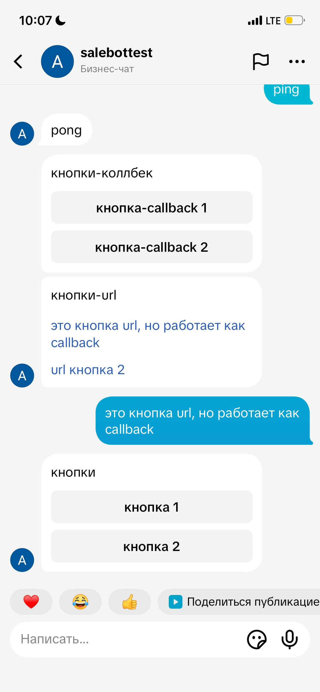

# TikTok

Теперь в Сейлбот доступна интеграция с TikTok — с одной из самых динамичных и популярных социальных платформ в мире. Это действительно новая глава в развитии нашей экосистемы! Миллионы пользователей ежедневно проводят время в TikTok, и именно там формируется современная культура общения, тренды и новые форматы взаимодействия. Возможность интеграции открывает для бизнеса и проектов совершенно иной уровень контакта с более молодой аудиторией.

<figure><figcaption></figcaption></figure>

Мы рассмотрим техническую сторону процесса: какие шаги нужно выполнить для активации интеграции, какие существуют колбеки, какие разрешения потребуется подтвердить.

Кроме того, мы уделим особое внимание нюансам, связанным с региональной доступностью.


Важно понимать, что интеграция с TikTok может работать не во всех странах и зависит от конкретных экономических зон, где платформа официально поддерживает такие функции. Мы укажем, где подключение доступно сразу, а где могут возникнуть ограничения.

TikTok API обмена сообщениями сейчас находится в стадии открытого бета-тестирования в Азиатско-Тихоокеанском регионе, Латинской Америке, странах Ближнего Востока и Африки (METAP) и Северной Америке (Кроме США). Подключаемый аккаунт должен быть зарегистрирован в этих регионах.&#x20;

Если пользователь из США, Европейской экономической зоны (ЕЭЗ), Швейцарии или Великобритании отправит сообщение - оно не будет получено в связи с ограничениями TikTok.

[Подробнее в официальной документации TikTok.](https://business-api.tiktok.com/portal/docs?id=1832184145137922)



Обращаем внимание.

Чтобы создать и настроить чат-бота для ТикТок, ознакомьтесь с разделом "[Как создать чат-бот для бизнеса](/broken/pages/jUOmUNDpph7DzSK8yyPF)".

Об особенностях кнопок в ТикТок, [рассказали здесь.](tiktok.md#knopki)


Подключение TikTok к Сейлбот — это не просто техническая новинка, а возможность быть на передовой в коммуникациях с аудиторией, использовать самый актуальный канал для продвижения и вовлекать пользователей там, где они проводят своё время.&#x20;

## Подготовка аккаунта

Начнём с самого важного — корректного подключения.

Перед подключением аккаунта необходимо переключиться на бизнес-аккаунт.

Шаг 1. Перейдите в раздел "Настройки и конфиденциальность":

<figure><figcaption></figcaption></figure>

Шаг 2. Далее — в раздел "Аккаунт":

<figure><figcaption></figcaption></figure>

Шаг 3. Нажмите на "Переключиться на бизнес-аккаунт":

<figure><figcaption></figcaption></figure>

Шаг 4. Заполните информацию о своем бизнесе:

<figure><figcaption></figcaption></figure> <figure><figcaption></figcaption></figure> <figure><figcaption></figcaption></figure>

Готово! Теперь ваш аккаунт готов к подключению в Сейлбот:

<figure><figcaption></figcaption></figure>

## Подключение к Salebot

Перейдите в раздел "Каналы" и нажмите на кнопку ТикТока

<figure><figcaption></figcaption></figure>

Далее в открывшемся окне войдите в свой аккаунт ТикТок:

<figure><figcaption></figcaption></figure>

И разрешите доступы Сейлбот к вашему аккаунту:

<figure><figcaption></figcaption></figure>


Важно!

Настоятельно просим Вас разрешить доступы к комментариям, к сообщениям, к информации о профиле, к просмотру ваших видео, иначе бот/колбеки могут попросту не сработать.

Иные доступы оставьте или запретите по своему усмотрению.&#x20;

На будущее, если Вы убрали какие-то доступы, которые мешают правильной отработке чат-бота, изменить их Вы сможете уже только на стороне TikTok.


Далее нажмите "Продолжить":

<figure><figcaption></figcaption></figure>

После чего Вас автоматически перебросит в раздел "Каналы" в Сейлбот и Вы увидите уведомление об успешном подключении интеграции:

<figure><figcaption></figcaption></figure>

## Особенности TikTok

1. Чтобы иметь возможность писать пользователю сообщения, он должен первым начать диалог.
2. Вы можете отправить до 10 сообщений в течение 48 часов после получения сообщения от пользователя TikTok.\
   Например, если вы получили одно сообщение от пользователя TikTok, вы можете отправить до 10 сообщений в течение следующих 48 часов. Если тот же пользователь позже отправит следующее сообщение, начнётся новый 48-часовой период, позволяющий вам отправить этому пользователю ещё 10 сообщений
3. Сообщение не может одновременно состоять из текста и изображения.
4. Отправка и получение вложенных изображений через API доступны только в том случае, если отправитель и получатель находятся в странах, где поддерживается вложение изображений в личные сообщения. Обмен изображениями доступен не во всех странах.
5. Максимальный размер отправляемого изображения - 3 мегабайта.&#x20;
6. В одном сообщении может быть только одно вложение.&#x20;

## Коллбеки

tiktok\_client\_new\_comment \<video\_id>: \<comment\_text> - пользователь оставил комментарий под вашим видео.

<figure><figcaption></figcaption></figure>

tiktok\_client\_share\_post \<shared\_video\_id> \<url> - пользователь отправил видео в личные сообщения подключенного аккаунта

<figure><figcaption></figcaption></figure>

## Сохраняемые переменные клиента

tiktok\_comment\_id - id комментария. сохраняется при отправке пользователем комментария к вашему видео. Используется для ответа на комментарий

tiktok\_comment\_video\_id - id видео, под которым оставлен комментарий. сохраняется при отправке пользователем комментария к вашему видео. Используется для ответа на комментарий

tiktok\_is\_follower - принимает значение True, если пользователь подписан на вас

tiktok\_conversation\_id - id диалога. Появляется после того как пользователь напишет сообщение в диалог. Требуется для отправки сообщений, не удалять!

## Кнопки

Максимальное количество кнопок в одном сообщении — 3.

В TikTok доступны два вида кнопок - callback и "по умолчанию" (url), <mark style="color:$danger;">**при этом в одном сообщении могут быть кнопки только одного вида.**</mark>

<figure><figcaption></figcaption></figure>

В TikTok отображаемый текст на кнопке и текст, который отправится боту после нажатия, - совпадают. Для формирования кнопки используются данные из поля "Текст ответного сообщения" или "URL" в настройках кнопки&#x20;

1. Callback-кнопки выглядят как обычные кнопки. При нажатии в чат отправляется сообщение от имени пользователя с текстом из кнопки. Максимальная длина - 20 символов.
2. URL кнопки выглядят как ссылки. Но поведение такое же, как у callback-кнопок. На данный момент в тиктоке нет возможности создать кнопку, при нажатии на которую будет открываться страница по указанному url. Максимальная длина - 40 символов.
3. Ограничения 40 символов в тексте (в поле "Сообщение"), если отправляете сообщение с кнопками:

<figure><figcaption></figcaption></figure>


Подробнее о работе с callback-кнопками в [Salebot рассказали здесь.](/broken/pages/xeepnRj969zW3xRimkdg#kak-dobavit-callback-knopku-vkontakte-telegram)


Обращаем внимание!

В десктоп версии ТикТока не поддерживаются сообщения с кнопками. В чате на компьютере / ноутбуке Вы увидите сообщение следующего вида:

<figure><figcaption></figcaption></figure>

Тогда как в Мобильной версии приложения сообщение будет отображаться корректно:

<figure><figcaption></figcaption></figure>

## Функции

Как ответить на комментарий:

tiktok\_create\_comment(text, comment\_video\_id, comment\_id) - отправляет ответ на комментарий с указанным id

<table><thead><tr><th width="276.55859375">Параметр</th><th>Описание</th></tr></thead><tbody><tr><td><mark style="color:red;"><strong>!</strong></mark> text</td><td>обязательный параметр, текст комментария</td></tr><tr><td>comment_video_id</td><td>id видео, под которым оставлен комментарий. Необязательный параметр, если не указан, будет использовано значение из переменной клиента tiktok_comment_video_id </td></tr><tr><td>comment_id</td><td>id комментария, на который нужно ответить. Необязательный параметр, если не указан, будет использовано значение из переменной клиента tiktok_comment_id </td></tr></tbody></table>
