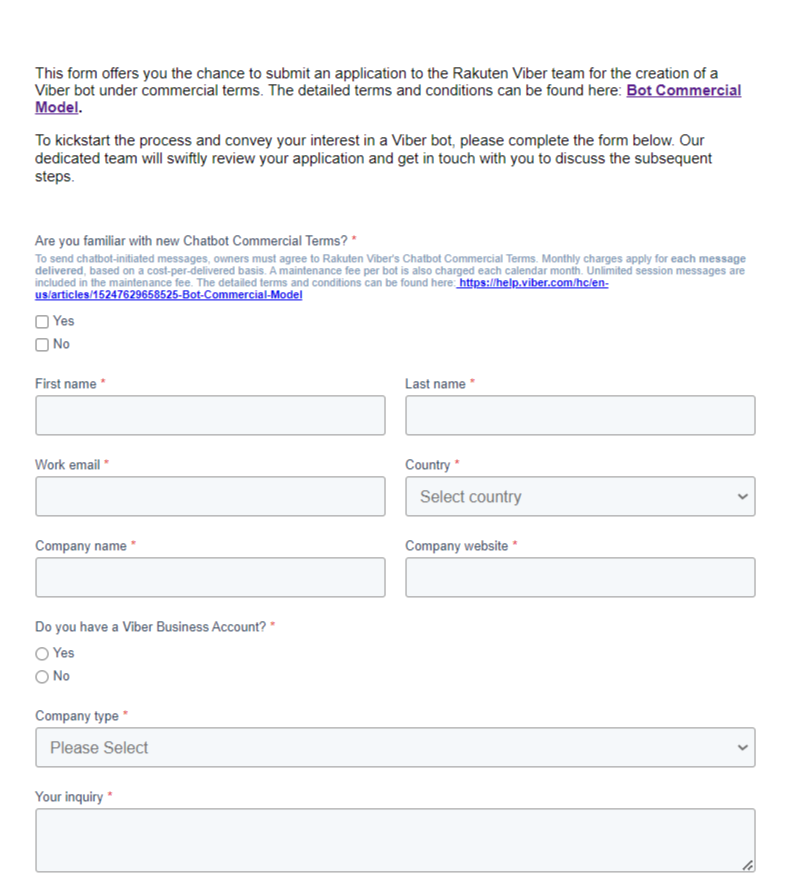
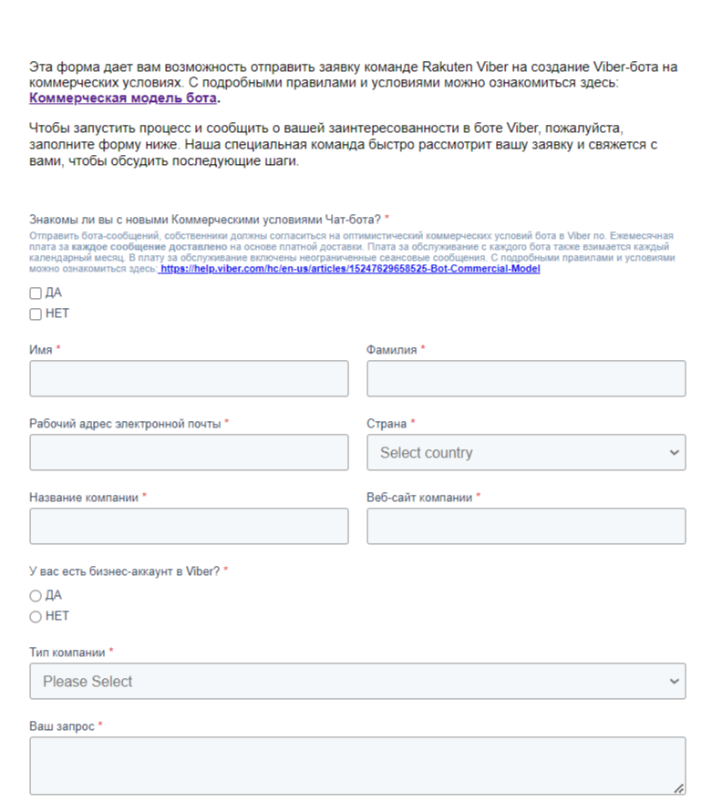
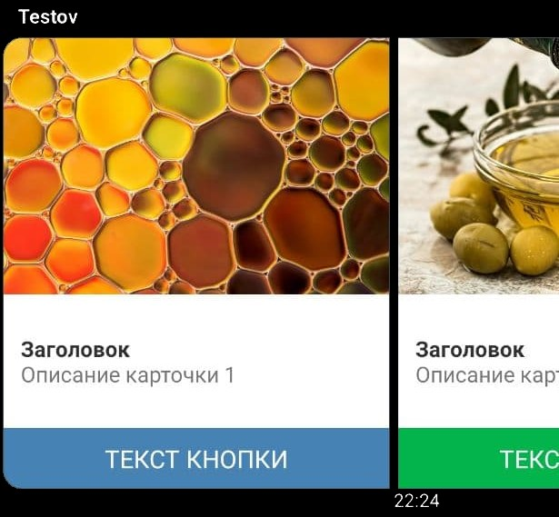

# Viber


ВАЖНО! Максимальная длина текстового сообщения 1000 символов

Учитывайте, что в Viber невозможно автоматически подтянуть номер телефона клиента


## Как подключить Viber

### Старая версия


Данная версия актуальна только для тех пользователей, которые создали своего чат-бота до 5 февраля 2024 года. \
Если у вас еще нет созданного бота для Viber (на момент времени после 5 февраля 2024), то перейдите к подразделу "Новая версия".


Для начала, необходимо пройти по [ссылке ](https://partners.viber.com/account)и авторизоваться на сайте.

<figure><figcaption></figcaption></figure>

Далее нужно создать паблик аккаунт для нашего бота. Выбираем фото и заполняем все поля:

<figure><figcaption></figcaption></figure>

**Account name** - имя бота, можно будет потом поменять

**Uri** - логин бота. Используется для формирования ссылок

**Category** - здесь нужно указать сферу деятельности (например местный бизнес)

**Subcategory** - подкатегория (например автомобильный бизнес)

**Language** - язык бота

**Account description** - описание бота, которое будет видно всем подписчикам

**Website Address** - сайт&#x20;

**Email Address**- электронная почта

**Location** - местоположение


&#x20;В форме регистрации есть переключатель "The account contains adult content". \
<mark style="color:red;">**НЕ ВКЛЮЧАЙТЕ!**</mark> \
Иначе перед запуском бота у всех пользователей будет предупреждение, что бот содержит контент для взрослых.


<figure><figcaption></figcaption></figure>

Нужно принять условия лицензионного соглашения и нажать "Create".&#x20;

<figure><figcaption></figcaption></figure>

Если все заполнено верно, вы получите токен бота, он будет нужен для следующего шага:

&#x20;

<figure><figcaption></figcaption></figure>

Бот готов. Осталось ввести его данные в Salebot. Для этого переходим в раздел "Каналы" и выбираем Viber.

Вводим полученный токен:

<figure><figcaption></figcaption></figure>

Бот будет подключен к Salebot после нажатия кнопки Готово. На мобильное устройство в приложение  Viber придет оповещение о созданном боте с его характеристиками, указанными нами в регистрационной форме.

### Новая версия (актуальна с 05.02.2024)

С 5 февраля 2024 года Viber изменил условия подключения (создания) чат-бота для мессенджера. Теперь данная услуга на платформе VIber является платной.


Чат-боты, созданные ранее указанной выше даты, будут работать согласно прежним условиям. \
Подробнее об этом [читайте здесь.](https://help.viber.com/hc/en-us/articles/15247629658525-Bot-commercial-model#apply)&#x20;



Обращаем внимание!

Согласно коммерческому предложению Viber, <mark style="color:orange;">**за КАЖДОГО чат-бота**</mark>, подключенного/созданного для указанного мессенджера, с пользователя будет взиматься комиссия в размере <mark style="color:orange;">**100 евро.**</mark>&#x20;

Каждое сообщение, отправленное ботом, включено в ежемесячную комиссию, оплачиваемую клиентом.&#x20;

Стоимость каждого сообщения варьируется в зависимости от региона.&#x20;

Например, для следующих стран указана следующая стоимость (в евро):

1. Россия - €0.0196;
2. Беларусь - €0.0138;
3. Украина - €0.0196;
4. Казахстан - €0.0137;

В случае, если количество сообщений превышает лимит оплаты в 100 евро, платформой может взиматься дополнительная плата.&#x20;

Подробнее в разделах "Rate card", "Fess" [данной статьи.](https://help.viber.com/hc/en-us/articles/15247629658525-Bot-commercial-model) &#x20;


Чтобы подключить чат-бота в Viber, необходимо подать [заявку здесь](https://share.hsforms.com/12pxGHMtAS3yq_3KcxQ6g1A4fpwx) только на коммерческих условиях.

Форма заявки будет иметь следующий вид:

<figure><figcaption>
Рис. 1 Оригинальная форма заявки
</figcaption></figure> <figure><figcaption>
Рис. 2 Переведенная форма заявки
</figcaption></figure>


Обращаем внимание!\
Форма заявки заполняется на АНГЛИЙСКОМ языке. \
Переведенная форма заявки (см. рис. 2 выше) показана в качестве ориентирования по поводу заполнения!


В поле "Ваш запрос" (Your inquiry) необходимо указать, что хотите подключить уже созданного чат-бота.

После подачи заявки специалисты Viber рассмотрят ее в индивидуальном порядке, после чего проконсультируют по поводу дальнейших действиях на стороне интеграции.&#x20;

После получения одобрения специалисты предоставят вам индивидуальный токен для подключения на стороне Saleot:

<figure><figcaption></figcaption></figure>


Обращаем внимание!\
Перед подачей заявки, ознакомьтесь со [статьей Viber](https://help.viber.com/hc/en-us/articles/15247629658525-Bot-commercial-model) по поводу коммерческого предложения для подключения/создания чат-бота на стороне платформы.&#x20;


## Как получить ссылку на Viber бота

Ссылку на созданного бота можно увидеть сразу после подключения.&#x20;

<figure><figcaption>
Подключенный бот Viber
</figcaption></figure>

Из-за ограничений Viber-бота нельзя найти в поиске, а перейти можно только по кнопке. Внутренние ссылки, как на примере браузеры и приложения не понимают, поэтому если вам нужно распространять бота, вы можете воспользоваться [нашими минилендингами](/broken/pages/-M1L_fPpT9ptt_t1BNvt#kak-sozdat-minilending), либо пропустить ссылку через укорачиватель, например, этот: [https://tinyurl.com/ ](https://tinyurl.com/)

## Как создать карусель в Viber


Viber поддерживает только 6 карточек в карусели, но позволяет использовать цветные кнопки



Формат используемых картинок: JPEG и PNG

Максимальный размер: 500 Кб


Рассмотрим на примере карусели из 3 карточек. Для создания карточек вам нужно в поле "Калькулятор" написать следующее:

p =\[{"title":"ЗАГОЛОВОК 1", "description": "ОПИСАНИЕ ", "image": "ССЫЛКА НА КАРТИНКУ 1", "buttons":\[{"text":"ТЕКСТ КНОПКИ 1"**,"color":"#4BB34B"**}]}, {"title":"ЗАГОЛОВОК 1", "description": "ОПИСАНИЕ ", "image": "ССЫЛКА НА КАРТИНКУ 1", "buttons":\[{"text":"ТЕКСТ КНОПКИ 1"}]}, {"title":"ЗАГОЛОВОК 2", "description": "ОПИСАНИЕ ", "image": "ССЫЛКА НА КАРТИНКУ 2", "buttons":\[{"text":"ТЕКСТ КНОПКИ 2", "url":"ССЫЛКА "}]}, {"title":"ЗАГОЛОВОК 3", "description": "ОПИСАНИЕ", "image": "ССЫЛКА НА КАРТИНКУ 3", "buttons":\[{"text":"ТЕКСТ КНОПКИ 3"}]}]\
r = send\_carousel(p, '')

То есть сначала записываем массив с title, description, image, buttons в переменную **p** (вы можете назвать переменную иначе), а далее используем её в методе **send\_carousel**(p, '')

Для построения команды Вы можете воспользоваться следующей таблицей:\
[https://docs.google.com/spreadsheets/d/1CzOBdrAAVPCjVNzBysrZlX4LcXFXvjGq/edit#gid=552753053](https://docs.google.com/spreadsheets/d/1CzOBdrAAVPCjVNzBysrZlX4LcXFXvjGq/edit#gid=552753053)\
достаточно скопировать сформированный текст.

Для того, чтобы сделать кнопку цветной, добавьте в массив buttons дополнительный параметр **"color":"#4BB34B"**. Цвет задается в виде числа в шестнадцатеричном коде и начинается с #. Подобрать цвет, можно в специальном редакторе, например: [https://htmlcolorcodes.com/](https://htmlcolorcodes.com/)

 (1).png>)


В кнопки карточек карусели Вы можете вставлять ссылки, используя параметр **url**, тогда при нажатии на кнопку клиент перейдет по ссылке и  получит выбранную ссылку как сообщение



В кнопках карточек карусели может быть добавлен еще один параметр **payload**, который не будет отображаться клиенту, но позволит проанализировать сделанный клиентом выбор&#x20;


\[{"title":"ЗАГОЛОВОК 1", "description": "ОПИСАНИЕ ", "image": "ССЫЛКА НА КАРТИНКУ 1", "buttons":\[{"text":"ТЕКСТ КНОПКИ 1","color":"#4BB34B", **"url":"ССЫЛКА ДЛЯ КНОПКИ","payload":"1"}**]}]

В случае, когда Вы используете кнопки с одинаковым текстом, может быть применён параметр **payload**, который не будет отображаться клиенту, но позволит проанализировать сделанный им выбор:

<figure><figcaption>
Пример использования payload
</figcaption></figure>

## Какие есть тонкости создания ботов для Viber

При создании Viber ботов, есть некоторые особенности, которые необходимо знать. Эти знания сэкономят Вам время и позволят использовать возможности Viber по максимуму.

### Как задать текст при переходе в бота и создать кнопку мотивирующую к действию

При первичном обращении к пользователю Viber не позволяет ботам отправлять более одного сообщения, пока пользователь на той стороне не ответит боту.

Поэтому, как только человек переходит по ссылке в бота, ему автоматически приходит первое сообщение. В этом сообщении вам надо попросить клиента либо нажать кнопку, либо что-то написать. Иначе все остальные ваши сообщения до него не дойдут. После того, как пользователь ответил боту, вы можете отправлять ему неограниченное количество сообщений.&#x20;

Такой вдохновляющий на действие текст первого сообщения для Вайбер указывается в настройках проекта:

<figure><figcaption>
Пример первого сообщения с кнопкой
</figcaption></figure>


Кнопки в тексте не отправляются при переходе в бота, нужно отправлять ТОЛЬКО клавиатурные.  После первого действия можно отправлять уже контент без ограничений.


Пример того, как выглядит это сообщение после перехода по ссылке:

 (1).png>)

### Как повторно протестировать первое сообщение


Эти действия нужно проводить каждый раз, как тестируете первое сообщение!


Для этого необходимо:

1\)  удалить переписку из раздела клиенты в конструкторе\
2\) Удалить переписку с ботом, нажав "Удалить и отписаться"

После этого при переходе по ссылке вы снова получите приветственное сообщение.

### Возможные ошибки при работе с Вайбер:

 (1).png>)

Если вы увидели такую вот надпись в переписке с пользователем в разделе Клиенты, то она может означать одно из двух:

* человек отписался от получения ваших сообщений (заблокировал бота в своем вайбер аккаунте)
* вы отправили второе и более сообщений сразу, когда пользователь еще ничего вам не написал в ответ. Стройте свою цепочку сообщений так, чтобы после первого вашего сообщения пользователь ответил или в разделе Настройки конструктора заполните поле Ответ на первое сообщение пользователя. Напишите в нем такое сообщение для пользователя, чтобы он вам написал в ответ (или нажал кнопку).
* в первом сообщении есть кнопки в тексте. В первом сообщении могут быть только клавиатурные кнопки.

### Как правильно начать диалог


Блок с #{none} - обязателен, он позволяет активировать бота, но не тратить лимит на отправку 1 сообщения в Viber


Далее идет сравнение значения переменной client\_type, в которой хранится внутреннее числовое обозначение мессенджера (для Viber client\_type=2)

Чтобы переход в нужный блок состоялся автоматически, надо поставить задержку в 0 секунд

<figure><figcaption></figcaption></figure>

Стрелка, которая пропускает тех, кто пришел из Вайбера выглядит следующим образом:

<figure><figcaption></figcaption></figure>

аа
