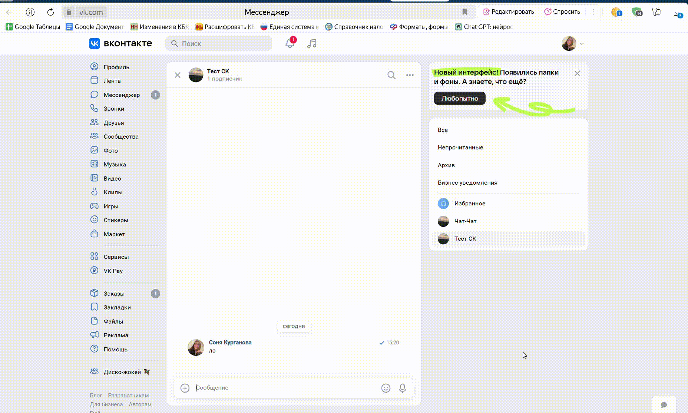

# API ВКонтакте

<details>

<summary>Список доступных функций</summary>

[**check\_vk\_subscription**](https://docs.salebot.pro/messendzhery-i-chaty/podklyuchenie-bota-k-vkontakte/api-vkontakte-funkcii-dlya-ispolzovaniya-vsekh-vozmozhnostei-vkontakte#check_vk_subscription)**(group\_id)** – проверка подписки на сообщество

[**comment\_text()**](https://docs.salebot.pro/messendzhery-i-chaty/podklyuchenie-bota-k-vkontakte/api-vkontakte-funkcii-dlya-ispolzovaniya-vsekh-vozmozhnostei-vkontakte#comment_text) – получение текста комментария

[**vk\_approve\_request**](https://docs.salebot.pro/messendzhery-i-chaty/podklyuchenie-bota-k-vkontakte/api-vkontakte-funkcii-dlya-ispolzovaniya-vsekh-vozmozhnostei-vkontakte#vk_approve_request)**(platform\_id, user\_id, token)**  - принятие заявки на вступление в группу

[**vk\_ban\_by\_id**](https://docs.salebot.pro/messendzhery-i-chaty/podklyuchenie-bota-k-vkontakte/api-vkontakte-funkcii-dlya-ispolzovaniya-vsekh-vozmozhnostei-vkontakte#vk_ban_by_id-or-vk_unban_by_id)**(platform\_id, user\_id, token, end\_date, reason, comment, visible)** – бан пользователя, добавление пользователя в черный список

[**vk\_callback\_url**](https://docs.salebot.pro/messendzhery-i-chaty/podklyuchenie-bota-k-vkontakte/api-vkontakte-funkcii-dlya-ispolzovaniya-vsekh-vozmozhnostei-vkontakte#vk_callback_url)**(platform\_id, vk\_user\_id, opened\_url, event\_id)** – переход по ссылке при нажатии на кнопку

[**vk\_close\_comment**](https://docs.salebot.pro/messendzhery-i-chaty/podklyuchenie-bota-k-vkontakte/api-vkontakte-funkcii-dlya-ispolzovaniya-vsekh-vozmozhnostei-vkontakte#vk_open_comment-or-vk_close_comment)**(owner\_id,post\_id,token)** – запретить комментирование поста

[**vk\_create\_comment**](https://docs.salebot.pro/messendzhery-i-chaty/podklyuchenie-bota-k-vkontakte/api-vkontakte-funkcii-dlya-ispolzovaniya-vsekh-vozmozhnostei-vkontakte#vk_create_comment)**(post\_id, message, reply\_to\_comment, sticker\_id)** – создание комментария на стене

[**vk\_delete\_last\_message()**](https://docs.salebot.pro/messendzhery-i-chaty/podklyuchenie-bota-k-vkontakte/api-vkontakte-funkcii-dlya-ispolzovaniya-vsekh-vozmozhnostei-vkontakte#vk_delete_last_message) – удаление последнего сообщения в беседе

[**vk\_delete\_messages**](https://docs.salebot.pro/messendzhery-i-chaty/podklyuchenie-bota-k-vkontakte/api-vkontakte-funkcii-dlya-ispolzovaniya-vsekh-vozmozhnostei-vkontakte#vk_delete_messages)**(platform\_id, message\_ids)** – удаление сообщений

[**vk\_edit\_manager**](https://docs.salebot.pro/messendzhery-i-chaty/podklyuchenie-bota-k-vkontakte/api-vkontakte-funkcii-dlya-ispolzovaniya-vsekh-vozmozhnostei-vkontakte#vk_edit_manager)**(platform\_id, user\_id, token, role, is\_contact, position, phone, email)** – назначение/удаление администратора группы с добавлением/удалением из списка контактов

[**vk\_edit\_message**](https://docs.salebot.pro/messendzhery-i-chaty/podklyuchenie-bota-k-vkontakte/api-vkontakte-funkcii-dlya-ispolzovaniya-vsekh-vozmozhnostei-vkontakte#vk_edit_message)**(platform\_id, message\_id, text, attachments\_photo, attachments\_files, keyboard, keep\_forward\_messages, keep\_snippets, dont\_parse\_links, disable\_mentions)** – редактирование сообщения

[**vk\_export\_chat\_link**](https://docs.salebot.pro/messendzhery-i-chaty/podklyuchenie-bota-k-vkontakte/api-vkontakte-funkcii-dlya-ispolzovaniya-vsekh-vozmozhnostei-vkontakte#vk_export_chat_link)**(platform\_id, new)** – получение ссылки-приглашения на группу

[**vk\_get\_chat\_member\_count**](https://docs.salebot.pro/messendzhery-i-chaty/podklyuchenie-bota-k-vkontakte/api-vkontakte-funkcii-dlya-ispolzovaniya-vsekh-vozmozhnostei-vkontakte#vk_get_chat_member_count)**(platform\_id)** – получение количества подписчиков на чат в группе

[**vk\_get\_name**](https://docs.salebot.pro/messendzhery-i-chaty/podklyuchenie-bota-k-vkontakte/api-vkontakte-funkcii-dlya-ispolzovaniya-vsekh-vozmozhnostei-vkontakte#vk_get_name)**(platform\_id, full)** – получение имени пользователя

[**vk\_get\_short\_link**](https://docs.salebot.pro/messendzhery-i-chaty/podklyuchenie-bota-k-vkontakte/api-vkontakte-funkcii-dlya-ispolzovaniya-vsekh-vozmozhnostei-vkontakte#vk_get_short_link)**(link, private, user\_token)** – создание короткой ссылки

[**vk\_get\_wall\_count** ](https://docs.salebot.pro/messendzhery-i-chaty/podklyuchenie-bota-k-vkontakte/api-vkontakte-funkcii-dlya-ispolzovaniya-vsekh-vozmozhnostei-vkontakte#vk_edit_message)- полезна для составления отчетов по маркированным рекламным постам

[**vk\_mark\_conversation**](https://docs.salebot.pro/messendzhery-i-chaty/podklyuchenie-bota-k-vkontakte/api-vkontakte-funkcii-dlya-ispolzovaniya-vsekh-vozmozhnostei-vkontakte#vk_mark_conversation)**(platform\_id, mark\_type)** – установка отметки «важный / отвеченный / прочитанный»

[**vk\_open\_comment**](https://docs.salebot.pro/messendzhery-i-chaty/podklyuchenie-bota-k-vkontakte/api-vkontakte-funkcii-dlya-ispolzovaniya-vsekh-vozmozhnostei-vkontakte#vk_open_comment-or-vk_close_comment)**(owner\_id,post\_id,token)** – разрешить комментирование поста

[**vk\_pin\_message**](https://docs.salebot.pro/messendzhery-i-chaty/podklyuchenie-bota-k-vkontakte/api-vkontakte-funkcii-dlya-ispolzovaniya-vsekh-vozmozhnostei-vkontakte#vk_pin_message-or-vk_unpin_message)**(platform\_id, conversation\_message\_id)** – закрепление сообщения

[**vk\_remove\_group\_user**](https://docs.salebot.pro/messendzhery-i-chaty/podklyuchenie-bota-k-vkontakte/api-vkontakte-funkcii-dlya-ispolzovaniya-vsekh-vozmozhnostei-vkontakte#vk_remove_group_user)**(platform\_id, user\_id, token)** – удаление пользователя из группы и всех бесед, созданных группой

[**vk\_search\_message**](https://docs.salebot.pro/messendzhery-i-chaty/podklyuchenie-bota-k-vkontakte/api-vkontakte-funkcii-dlya-ispolzovaniya-vsekh-vozmozhnostei-vkontakte#vk_search_message)**(serched\_text, platform\_id)** – поиск сообщения по тексту

[**vk\_send\_chat\_action**](https://docs.salebot.pro/messendzhery-i-chaty/podklyuchenie-bota-k-vkontakte/api-vkontakte-funkcii-dlya-ispolzovaniya-vsekh-vozmozhnostei-vkontakte#vk_send_chat_action)**(platform\_id, bot\_action)** – показ действий бота

[**vk\_send\_some\_photo**](https://docs.salebot.pro/messendzhery-i-chaty/podklyuchenie-bota-k-vkontakte/api-vkontakte-funkcii-dlya-ispolzovaniya-vsekh-vozmozhnostei-vkontakte#vk_send_some_photo)**(platform\_id, image\_list, text, keyboard, dont\_parse\_links, disable\_mentions)** – отправка нескольких картинок

[**vk\_send\_sticker**](https://docs.salebot.pro/messendzhery-i-chaty/podklyuchenie-bota-k-vkontakte/api-vkontakte-funkcii-dlya-ispolzovaniya-vsekh-vozmozhnostei-vkontakte#vk_send_sticker)**(platform\_id, sticker\_id)** – отправка стикера

[**vk\_send\_message**](https://docs.salebot.pro/messendzhery-i-chaty/podklyuchenie-bota-k-vkontakte/api-vkontakte-funkcii-dlya-ispolzovaniya-vsekh-vozmozhnostei-vkontakte#vk_send_message)**(platform\_id, message, keyboard, reply\_to, forward\_messages, sticker\_id, dont\_parse\_links, disable\_mentions, attachments\_photo, attachments\_files)** - отправка сообщения

[**vk\_show\_alert\_message**](https://docs.salebot.pro/messendzhery-i-chaty/podklyuchenie-bota-k-vkontakte/api-vkontakte-funkcii-dlya-ispolzovaniya-vsekh-vozmozhnostei-vkontakte#vk_show_alert_message)**(platform\_id, vk\_user\_id, text, event\_id)** – показ исчезающего сообщения

[**vk\_unban\_by\_id**](https://docs.salebot.pro/messendzhery-i-chaty/podklyuchenie-bota-k-vkontakte/api-vkontakte-funkcii-dlya-ispolzovaniya-vsekh-vozmozhnostei-vkontakte#vk_ban_by_id-or-vk_unban_by_id)**(platform\_id, user\_id, token)** – разбан, удаление из черного списка

[**vk\_unmark\_conversation**](https://docs.salebot.pro/messendzhery-i-chaty/podklyuchenie-bota-k-vkontakte/api-vkontakte-funkcii-dlya-ispolzovaniya-vsekh-vozmozhnostei-vkontakte#vk_unmark_conversation)**(platform\_id, mark\_type)** – снятие отметки «важный / отвеченный / прочитанный»

[**vk\_unpin\_message**](https://docs.salebot.pro/messendzhery-i-chaty/podklyuchenie-bota-k-vkontakte/api-vkontakte-funkcii-dlya-ispolzovaniya-vsekh-vozmozhnostei-vkontakte#vk_pin_message-or-vk_unpin_message)**(platform\_id)** – открепление сообщения

[**vk\_vision\_recognize\_text**](https://docs.salebot.pro/messendzhery-i-chaty/podklyuchenie-bota-k-vkontakte/api-vkontakte-funkcii-dlya-ispolzovaniya-vsekh-vozmozhnostei-vkontakte#vk_vision_recognize_text)**(token, file\_url)** – распознавание  текста на изображении, отправленном в бот

</details>

### <mark style="color:red;">\*</mark> Где взять **platform\_id (owner\_id)** клиента для отправки уведомлений

**1 способ:**

* Ваше сообщество должно быть подключено к проекту
* Отправьте любое сообщение в диалог с сообществом, куда должны приходить сообщения бота
* В списке клиентов проекта выбираете диалог клиента, которому будете отправлять сообщение
*   Копируете значение ID в мессенджере<br>

    <figure><figcaption></figcaption></figure>

**2 способ:**

Получить идентификатор группы/пользователя Вконтакте можно из адресной строки браузера.&#x20;

Адрес профиля пользователя имеет вид https://vk.com/idXXXXXX, адрес сообщества — https://vk.com/publicXXXXXX или https://vk.com/clubXXXXXX, где XXXXXX — ID страницы. Посмотреть ID можно в адресной строке браузера.\
\
Если профилю или сообществу присвоен буквенно-цифровой адрес, то ID можно определить иначе. Откройте любую фотографию пользователя/сообщества; первые цифры после слова photo (XXXXXX в ссылке вида https://vk.com/photoXXXXXX\_YYYYYYY) — это и есть интересующий вас ID.\
\
Найти ID своей страницы вы можете в разделе [Настройки](https://vk.com/settings) → Адрес страницы.

<figure><figcaption></figcaption></figure>

### <mark style="color:red;">\*\*</mark> Как прописывать кнопки в параметре keyboard

**Пример reply-кнопок:**

knop = {"one\_time":false, "buttons":\[\[{"action":{"type":"text", "payload":"{"button": "1"}", "label":"Red"}, "color":"negative"}, {"action":{"type":"text","payload":"{"button": "2"}","label":"Green"},"color":"positive"},{"action":{"type":"text","payload":"{"button": "2"}", "label":"Blue"},"color":"primary"},{"action":{"type":"text","payload":"{"button": "2"}", "label":"White"},"color":"secondary"}]]}

**Пример inline-кнопок:**

knop={"inline": true, "buttons": \[\[{"action": {"type": "open\_link", "link": "https://dev.vk.com/", "label": "Оформить"\}}, {"action": {"type": "text", "label": "Поддержка"\}}]]}


Более подробные примеры и объяснения смотрите в [первоисточнике](https://dev.vk.com/api/bots/development/keyboard)


Чтобы убрать у пользователя клавиатуру, необходимо отправить сообщение с пустым параметром `buttons`:

{"buttons":\[],"one\_time":true}


## Как отправить сообщение во Вконтакте&#x20;

**Описание:**

**vk\_send\_message(platform\_id, message, keyboard, reply\_to, forward\_messages, sticker\_id, dont\_parse\_links, disable\_mentions, attachments\_photo, attachments\_files)**

Параметры:

<mark style="color:red;">**!**</mark>**&#x20;platform\_id** — id клиента в мессенджере [\*](./#gde-vzyat-platform_id-owner_id-klienta-dlya-otpravki-uvedomlenii)

<mark style="color:red;">**!**</mark>**&#x20;message** — текст сообщения

**keyboard** — кнопки в сообщении [\*\*](./#kak-propisyvat-knopki-v-parametre-keyboard)

**reply\_to** — id сообщения для ответа/цитаты

**forward\_messages** — id пересылаемых сообщений (формат списка                                       "{#айдипервогосообщения}, #{второго}, #{итакдалее}"

**sticker\_id** — id стикера &#x20;

**dont\_parse\_links** — создавать сниппет или нет, может принимать значение 1 — создавать, 0 — нет&#x20;

**disable\_mentions** — отключить уведомление об упоминании в сообщении, для отключения уведомлений передайте в этот параметр что угодно, иначе оставьте пустым

**attachments\_photo** — добавить в медиавложения сообщения фотографии, которые пока не загружены во ВКонтакте, в виде списка ссылок на фотографии в формате:\
&#x20;                                      `'["#{url1}","#{url2}"]'`, где \
`url` - это ссылка на фотографию на доступных ресурсах в Интернете.&#x20;

**attachments\_files** — различные вложения из ВКонтакте. Для использования attachments\_files потребуется строка с вложениями, перечисленными через запятую и уже находящимися во ВКонтакте, имеющая следующий вид: \
&#x20;                    `'doc-182762603_638918266, photo-182762603_638918266'`\
_Каждое вложение описываем следующим образом:_\
&#x20;                         _`<type>-<owner_id>_<media_id>` - где:_ \
`<type>` — тип медиа-вложения:

* `photo` — фотография;
* `video` — видеозапись;
* `audio` — аудиозапись;
* `doc` — документ;
* `wall` — запись на стене;&#x20;
* `market` — товар;&#x20;
* `poll` — опрос.

`<owner_id>` — идентификатор владельца медиа-вложения.\
`<media_id>` — идентификатор медиа-вложения.<br>

_Обратите внимание, если прикрепляется объект, принадлежащий другому пользователю, следует добавлять к вложению его access\_key в формате_ \
&#x20;                             _-\<owner\_id>_\<media\_id>\_\<access\_key> <br>

Если присвоить функцию переменной, то в переменную будет помещен id сообщения, который будет необходим для возможно последующего редактирования сообщения.

**Примеры:**

Отправим сообщение с кнопками и с картинкой, заранее загруженной в нашу группу:

<figure><figcaption><p>Настройка блока отправки сообщения</p></figcaption></figure>

Тестируем

<figure><figcaption><p>Отправка сообщения в чат ВКонтакте</p></figcaption></figure>

Обратите внимание на значение переменной soob, в которую мы записали результат отправки сообщения

<figure><figcaption></figcaption></figure>

Как видите функция вернула идентификатор отправленного  сообщения. Это позволяет нам проводить дальнейшие манипуляции над сообщением

**Пример кода для копирования:**

```
knop={"inline": true, "buttons": [[{"action": {"type": "open_link", "link": "https://salebot.site/tutor_reg_1", "label": "Регистрируйся"}}, {"action": {"type": "text", "label": "Отмена"}}]]}
soob=vk_send_message(2000000001, "Выбирай", knop, None, None, None, None, None, None, "photo-217945289_457239047")
```


Чтобы в переменную записать текст с переносами строк, укажите значение следующим образом:

`message = "Текст первой строки" + "\n" + "Текст второй строки" + "\n" +"Третья строка"`


## Как редактировать сообщение во  ВКонтакте&#x20;

**Описание:**

**vk\_edit\_message(platform\_id, message\_id, text, attachments\_photo, attachments\_files, keyboard, keep\_forward\_messages, keep\_snippets, dont\_parse\_links, disable\_mentions)**

Параметры:

<mark style="color:red;">**!**</mark>**&#x20;platform\_id** — id клиента в мессенджере [\*](./#gde-vzyat-platform_id-owner_id-klienta-dlya-otpravki-uvedomlenii)

<mark style="color:red;">**!**</mark>**&#x20;message\_id** — id редактируемого сообщения

**text** — текст сообщения&#x20;

**attachments\_photo** — добавить в медиа вложения сообщения фотографии, которые пока не загружены во ВКонтакте, в виде списка ссылок на фотографии в формате:\
&#x20;                                      `'["#{url1}","#{url2}"]'`, где \
`url` - это ссылка на фотографию на доступных ресурсах в Интернете.&#x20;

**attachments\_files** — различные вложения из ВКонтакте. Для использования attachments\_files потребуется строка с вложениями, перечисленными через запятую и уже находящимися во ВКонтакте, имеющая следующий вид: \
&#x20;                    `'doc-182762603_638918266, photo-182762603`_`638918266'.`_ \
_Каждое вложение описываем следующим образом:_\
&#x20;                         _`<type>-<owner_id>_<media_id>` - где:_ \
`<type>` — тип медиа-вложения:

* `photo` — фотография;
* `video` — видеозапись;
* `audio` — аудиозапись;
* `doc` — документ;
* `wall` — запись на стене;&#x20;
* `market` — товар;&#x20;
* `poll` — опрос.

`<owner_id>` — идентификатор владельца медиа-вложения.\
`<media_id>` — идентификатор медиа-вложения.<br>

_Обратите внимание, если прикрепляется объект, принадлежащий другому пользователю, следует добавлять к вложению его access\_key в формате_ \
&#x20;                             _-\<owner\_id>_\<media\_id>\_\<access\_key>&#x20;

**keyboard** — кнопки в сообщении [\*\*](./#kak-propisyvat-knopki-v-parametre-keyboard)

**keep\_forward\_messages** — признак необходимости сохранить прикреплённые пересланные сообщения (любое значение)

**keep\_snippets** — признак необходимости сохранить прикреплённые внешние ссылки (сниппеты)(любое значение) &#x20;

**dont\_parse\_links** — признак того, что не надо создавать сниппет (любое значение)

**disable\_mentions** — признак того, что надо отключить уведомление об упоминании в сообщении (любое значение)

**Примеры:**

Продолжим с Вами предыдущий пример - отредактируем сообщение через 5 секунд

<figure><figcaption><p>Настройка блока редактирования сообщения</p></figcaption></figure>

Тестируем:

<figure><figcaption><p>Редактирование отправленного сообщения в чате ВКонтакте</p></figcaption></figure>

**Пример кода для копирования:**

Блок отправки сообщения:

```
knop={"inline": true, "buttons": [[{"action": {"type": "open_link", "link": "https://salebot.site/tutor_reg_1", "label": "Регистрируйся"}}, {"action": {"type": "text", "label": "Отмена"}}]]}
soob=vk_send_message(2000000001, "Выбирай", knop, None, None, None, None, None, None, "photo-217945289_457239047")
```

Блок редактирования:

```
soob=vk_edit_message(2000000001, soob, 'Долго думаешь', None, 'photo-217945289_457239048', None, None, None, None, None)
```

## Как удалить сообщение ВКонтакте &#x20;

**Описание:**

**vk\_delete\_messages(platform\_id, message\_ids)**

Параметры:

<mark style="color:red;">**!**</mark>**&#x20;platform\_id** — id чата в мессенджере\
<mark style="color:red;">**!**</mark>**&#x20;message\_ids** – список из conversation\_message\_id \
Вы можете удалить как одно сообщение, так и несколько.\
Для удаления нескольких сообщений передайте перечень conversation\_message\_id сообщений, которые хотите удалить, через запятую в общих кавычках

**Примеры:**

<figure><figcaption></figcaption></figure>

Согласно представленному примеру будут удалены сообщения с ид 215 и 217, а 216 останется.

**Пример кода для копирования:**

```
vk_delete_messages(136856885, "217, 215")
```

## Как удалить последнее сообщение в беседе во Вконтакте

**Описание:**

**vk\_delete\_last\_message()**

Параметры: НЕТ

Удаляет последнее сообщение в чате.  На личные сообщения из диалога бота с клиентом не распространяется!

**Примеры:**

Вернемся к примеру с исключением из чата в случае употребления ненормативной лексики. Добавим удаление сообщения с таким содержанием:

<figure><figcaption><p>Настройки блока для исключения из чата с удалением сообщения</p></figcaption></figure>

**Пример кода для копирования:**

```
vk_delete_last_message()
```

## Как создать короткую ссылку в Вконтакте

**Описание:**

**vk\_get\_short\_link(link, private, user\_token)**

Параметры:

<mark style="color:red;">**!**</mark>**&#x20;link** — ссылка, которую нужно будет открывать по короткой ссылке\
**private** — позволяет сделать статистику ссылки приватной (любое значение)\
**user\_token** — персональный токен пользователя. Обязательный параметр в случае использования **private** &#x20;

Присвойте функцию переменной **.** Тогда в случае успешного выполнения в переменной будет содержаться короткая ссылка, а в случае наличия ошибок в эту же переменную будет помещен весь ответ сервера. &#x20;

**Примеры:**

<figure><figcaption></figcaption></figure>

Результат:

<figure><figcaption></figcaption></figure>

**Пример кода для копирования:**

```
vklink=vk_get_short_link('https://www.google.com/')
```

## Как отправить стикер во Вконтакте

**Описание:**

**vk\_send\_sticker(platform\_id, sticker\_id)**

Параметры:&#x20;

<mark style="color:red;">**!**</mark>**&#x20;platform\_id** — id клиента в мессенджере

<mark style="color:red;">**!**</mark>**&#x20;sticker\_id** — id стикера.&#x20;

**Как узнать id стикера?**

Отправьте стикер в чат и в разделе переменных клиента появится переменная **sticker\_id**

<figure><figcaption></figcaption></figure>

**Примеры:**

<figure><figcaption></figcaption></figure>

Отправка стикера:

<figure><figcaption></figcaption></figure>

**Пример кода для копирования:**

```
otpravka = vk_send_sticker(platform_id, 3384)
```

## **Как отправить несколько картинок** во Вконтакте&#x20;

**Описание:**

**vk\_send\_some\_photo(platform\_id, image\_list, text, keyboard, dont\_parse\_links, disable\_mentions)**

Параметры:

<mark style="color:red;">**!**</mark>**&#x20;platform\_id** — id клиента в мессенджере \
<mark style="color:red;">**!**</mark>**&#x20;image\_list** - массив с картинками\
**text** - текст для сообщения с картинками\
**keyboard** - кнопки в сообщении [\*\*](./#kak-propisyvat-knopki-v-parametre-keyboard)\
**dont\_parse\_links** - отключение превью ссылок\
**disable\_mentions** -отключение уведомлений

Пример

`image_list=["Ссылка на картинку 1", "Ссылка на картинку 2", "Ссылка на картинку 3"]`

**Примеры:**

Отправим нескольких картинок,  указав в качестве параметров функции переменные:

<figure><figcaption></figcaption></figure>

<figure><figcaption></figcaption></figure>

Отправим нескольких картинок, заполнив параметры в функции:

<figure><figcaption></figcaption></figure>

<figure><figcaption></figcaption></figure>


**Пример кода для копирования:**

```
/*Отправим нескольких картинок, передав в параметры функции переменные*/
project.image_list=["https://i.ibb.co/991xmY3/00068363.jpg","https://i.ibb.co/qycx2ZT/149.jpg","https://i.ibb.co/w0BnRjM/images-cms-image-000028089.jpg","https://i.ibb.co/Y3h2TWX/images-cms-image-000028098.jpg","https://i.ibb.co/kX4H2Xq/images-cms-image-000028102.jpg"]
vk_send_some_photo(platform_id, image_list, "Тюльпаны")

/*Отправим нескольких картинок, заполнив параметры в функции*/
test=vk_send_some_photo('257328430', '["https://pdds.ru/wp-content/uploads/2022/12/image-1.jpg","https://avto-ravon.ru/wp-content/uploads/2022/02/ravon-r2-.png", "https://rdm-import.ru/image/product/35682/DSC_8767.jpg"]')
```

## Как определить поставил ли пользователь лайк под  конкретным объектом во Вконтакте

**Описание:**

**vk\_liked\_object(type, owner\_id, item\_id, user\_id, user\_token)**

Параметры:

**type -** тип объекта\
**owner\_id -** идентификатор владельца Like-объекта. Если параметр не задан, то считается, что он равен идентификатору текущего пользователя[\*](./#gde-vzyat-platform_id-owner_id-dlya-otpravki-uvedomlenii)\
**item\_id -** идентификатор объекта\
**user\_id -** идентификатор пользователя в вк\
**user\_token -** персональный токен

#### Возможные типы объектов **type** :

* `post` — запись на стене пользователя или группы;
* `comment` — комментарий к записи на стене;
* `photo` — фотография;
* `video` — видеозапись;
* `note` — заметка;
* `photo_comment` — комментарий к фотографии;
* `video_comment` — комментарий к видеозаписи;
* `topic_comment` — комментарий в обсуждении.


Результат выполнения функции - словарь вида: {"response":{"liked":1,"copied":0\}}

* `liked` — есть ли отметка «Мне нравится» от текущего пользователя (`0` — отметки нет, `1` — отметка есть);
* `copied` — сделан ли репост текущим пользователем (`0` — не сделан, `1` — сделан).

**Примеры:**

Итак, давайте проверим, делал ли клиент с идентификатором 257328430 лайк или репост поста в сообществе Админ.

Для начала определим идентификатор инстересующего нас поста:

* открываем пост на просмотр и из адресной строки забираем цифры после знака подчеркивания в конце строки

<figure><figcaption></figcaption></figure>

Переходим к заполнению параметров функции в поле Калькулятор:

<figure><figcaption></figcaption></figure>

Можно отправлять клиента в блок и проверять результат:

<figure><figcaption></figcaption></figure>


**Пример кода для копирования:**

```
res=vk_liked_object('post', -217945289, 3, 257328430)
```

## Как исключить пользователя из беседы во Вконтакте

**Описание:**

**vk\_remove\_chat\_user(member\_id)**

Параметры:

<mark style="color:red;">**!**</mark>**&#x20;member\_id** — id пользователя, которого нужно исключить. Здесь же вы можете использовать значение **from\_id**.&#x20;

**Примеры:**

Как правило из чата удаляют в случае употребления ненормативной лексики. Давайте разберем как выполнить исключение из чата при помощи бота.

Вводим бота-администратора в наш чат

<figure><figcaption></figcaption></figure>

Далее в проекте создадим блок с условием (это может быть "Стартовое условие" или "Не состояние с условием") и установим в условии слова, на которые должен отреагировать наш бот и исключить клиента за несоблюдение правил.

<figure><figcaption></figcaption></figure>

Тестируем:

<figure><figcaption><p>Бот исключил из чата ВКонтакте пользователя, написавшего условное слово</p></figcaption></figure>

**Пример кода для копирования:**

```
vk_remove_chat_user(from_id)
```

## Как получить имя пользователя в беседе Вконтакте&#x20;

**Описание:**

**vk\_get\_name(member\_id, full)**

Параметры:

<mark style="color:red;">**!**</mark>**&#x20;member\_id** — id пользователя. Здесь же вы можете использовать значение **from\_id**.&#x20;

<mark style="color:red;">**!**</mark>**&#x20;full** - признак какие данные выдать. Может принимать значение True, тогда будет выдано имя и фамилия пользователя, иначе (False) - только имя

**Примеры:**

Для получения имени и фамилии клиент напишем функцию со следующими значениями параметров:

<figure><figcaption></figcaption></figure>

Тестируем<br>

<figure><figcaption></figcaption></figure>

**Пример кода для копирования:**

```
sobesed=vk_get_name(from_id, True)
```

## Как опубликовать пост во  ВКонтакте

**Описание:**

**vk\_create\_wall\_post(token, owner\_id, text, attachments, from\_group, signed, mark\_as\_ads, close\_comments, mute\_notifications, copyright)**

Параметры: НЕТ

**token** - персональный токен ВКонтакте с правами wall

**owner\_id** - id пользователя или сообщества, на стене которого необходимо опубликовать запись [\*](./#gde-vzyat-platform_id-owner_id-dlya-otpravki-uvedomlenii)

**text** - текст публикации, если есть вложения, то можно вместо текста передать пустую строку ("")

**attachments** — список объектов, приложенных к комментарию и разделённых символом «,». Поле `attachments` представляется в формате:\
&#x20;                            <mark style="color:purple;">\<type></mark>_<mark style="color:purple;">\<owner\_id>\_\<media\_id></mark>,_&#x433;де\
<mark style="color:purple;">`<type>`</mark> — тип медиа-вложения:

* `photo` — фотография;
* `video` — видеозапись;
* `audio` — аудиозапись;
* `doc` — документ;
* `page` — вики-страница;&#x20;
* `note` — заметка;&#x20;
* `poll` — опрос;&#x20;
* `album` — альбом;&#x20;
* `market` — товар;&#x20;
* `market_album` — подборка товаров;&#x20;
* `audio_playlist` — плейлист с аудио.

<mark style="color:purple;">`<owner_id>`</mark> — идентификатор владельца медиавложения (идентификатор сообщества должен начинаться со знака -).\
<mark style="color:purple;">`<media_id>`</mark> — идентификатор медиавложения. Формат описания ссылки: \
&#x20;                                                     {protocol}{URL}, где: \
&#x20;               <`protocol`> — протокол HTTP или HTTPS. \
&#x20;               <`URL`> — оставшаяся часть URL. \
<mark style="color:red;">**Примечание**</mark><mark style="color:red;">.</mark> Можно указать несколько медиавложений, но только одну ссылку. Если указать больше одной ссылки, вернётся ошибка.&#x20;

**from\_group** - 0, если нужно опубликовать от своего имени, 1 - если от имени сообщества&#x20;

**signed** - если опубликовано от имени сообщества, то можно оставить подпись под постом, для включения передайте 1&#x20;

**mark\_as\_ads** - является ли пост рекламным, чтобы отметить пост как рекламный укажите 1 (<mark style="color:red;">**Внимание!**</mark> рекламным может быть только пост от имени группы)

**close\_comments** - передайте 1, если хотите закрыть комментарии, иначе - 0

**mute\_notifications** - информация о том, включены ли уведомления к публикации записи, для выключения передайте 1, иначе 0

**copyright** - источник материала. Поддерживаются внешние и внутренние ссылки. Просто передайте ссылку на источник в кавычках.

**Примеры:**

Итак, приступим.

Первым делом получаем[ персональный токен пользователя.](https://docs.salebot.pro/messendzhery-i-chaty/podklyuchenie-bota-k-vkontakte/personalnye-i-servisnye-tokeny) Полученный токен прописываем в константах проекта.

Далее определим идентификатор сообщества, на стене которого желаем оставить пост, и идентификатор фотографии

<figure><figcaption></figcaption></figure>

Определение идентификаторов сообщества и фото, которые будем публиковать на стене нашего сообщества

1 - id сообщества

2 - id изображения

Итак, переходим к заполнению параметров функции

<figure><figcaption></figcaption></figure>

Поле Калькулятор - настройка функции публикации поста

Можем перейти к тестированию

<figure><figcaption></figcaption></figure>

Опубликованный пост от имени сообщества с подписью автора<br>

**Пример кода для копирования:**

```
/*project.token='' Прописать в константах проекта*/
newpost=vk_create_wall_post(token, -217945289, text, 'photo-217945289_457239017', 1, 1, 0, 0, 0,'')
```

## К**ак делать репосты постов со стены ВКонтакте**

**Описание:**

В **vk\_send\_message** и **vk\_edit\_message** есть параметр **attachments\_files**.&#x20;

Для репоста в сообщения в этот параметр нужно передать в виде:

**'wall{owner\_id}\_{post\_id}'**

**owner\_id** — владелец публикации (в случае с группами перед id нужно добавить знак минус)

**post\_id** — идентификатор поста на стене этого владельца

<figure><figcaption></figcaption></figure>

**Примеры:**

Рассмотрим вариант репоста при комментировании записи:

<figure><figcaption></figcaption></figure>

Тестируем:

<figure><figcaption><p>Комментарий под постом сообщества</p></figcaption></figure>

<figure><figcaption><p>Ответ бота на комментарий под постом сообщества</p></figcaption></figure>

**Пример для копирования кода:**

```
comm = comment_text()
repost=vk_send_message(platform_id, "Вы прокомментировали нашу запись: #{comm}", None, None, None, None, '', '', '', 'wall-217945289_10')
```

## Как оставить комментарий на стене во Вконтакте

**Описание:**

**vk\_create\_comment(post\_id, message, reply\_to\_comment, sticker\_id, token, attachments)**

Параметры:

<mark style="color:red;">**!**</mark>**&#x20;post\_id** — id комментируемого поста\
<mark style="color:red;">**!**</mark>**&#x20;message** — текст комментария\
**reply\_to\_comment** — id комментария, на который отвечаем \
**sticker\_id** — id стикера\
**token**  — токен\
**attachments** — список объектов, приложенных к комментарию и разделённых символом «,». Поле `attachments` представляется в формате:\
&#x20;                            \<owner\_id>_\<media\_id>,\<owner\_id>_\<media\_id>\
`<type>` — тип медиа-вложения:

* `photo` — фотография;
* `video` — видеозапись;
* `audio` — аудиозапись;
* `doc` — документ.

`<owner_id>` — идентификатор владельца медиа-вложения.\
`<media_id>` — идентификатор медиа-вложения.

<figure><figcaption></figcaption></figure>

Если не передавать необязательные параметры, то функция будет выглядеть так: `vk_create_comment(post_id, message)`

**Примеры:**

Итак, разберем на практике как добавить комментарий на стене нашего сообщества.

Для начала определим id нашего поста:

Откройте пост в отдельном окне и обратите меня на адрес поста в адресной строке браузера:

<figure><figcaption><p>Определение id поста, который будем комментировать</p></figcaption></figure>

Последняя цифра после знака подчеркивания и есть искомый нами id поста.

Далее идем в наш проект и настраиваем команду отправки комментария в калькуляторе нужного блока воронки:

<figure><figcaption><p>Функция отправки комментария под постом с id = 1</p></figcaption></figure>

Тестируем:

<figure><figcaption><p>Отправка комментария под пост с id=1</p></figcaption></figure>

При этом обратим внимание на значение переменной k в карточке клиента:

<figure><figcaption><p>Ответ сервера ВКонтакте</p></figcaption></figure>

Здесь мы можем получить id нашего комментария.

Теперь ответим на комментарий нашего клиента. Ранее было рассмотрено получение колбека при комментировании нашего поста. Повторим разобранное. Прокомментируем наш пост и зайдем в карточку клиента в нашем проекте:

<figure><figcaption><p>Коллбэк при написании комментария</p></figcaption></figure>

<figure><figcaption><p>Переменные, получаемые вместе с коллбэком</p></figcaption></figure>


Настроим реакцию на получаемый коллбэк - отправим благодарность нашему клиенту:

<figure><figcaption></figcaption></figure>

<figure><figcaption><p>Скрин поста с нашими экспериментами</p></figcaption></figure>

Давайте разберем еще один пример работы с комментариями - отправка картинки в ответ на комментарий. Выше мы подробно рассмотрели как получить id поста, но сейчас мы будем отвечать нашему клиенту в ответ на его комментарий. Пропишем в калькуляторе условного блока следующую функцию:

<figure><figcaption></figcaption></figure>

При этом ссылку на фото мы получили из адресной строки браузера:

<figure><figcaption><p>Получение идентификатора фото</p></figcaption></figure>

Ну а теперь посмотрим на результат нашего труда:

<figure><figcaption><p>Отправка вложения в ответ на комментарий клиента под постом</p></figcaption></figure>

**Пример кода для копирования:**

```
/*Отправка комментария под пост*/
k=vk_create_comment(1, 'Комментарий')

/*Отправка благодарности на комментарий от клиента*/
k=vk_create_comment(1, 'Спасибо за проявленный интерес!',wall_reply_id)

/*Отправка вложения в ответ на комментарий клиента*/
komm=vk_create_comment(wall_reply_post_id, 'текст', wall_reply_id, '', '', 'photo-27121021_457268025')
```

## Как сохранить текст комментария во ВКонтакте

**Описание:**

**comment\_text()**

Параметры: НЕТ

**Примеры:**

Разберем на примере:

Не забываем, что для работы с комментариями необходим отдельный токен, подробнее о его получении и добавлении в проект смотрим [ персональный токен пользователя](https://docs.salebot.pro/messendzhery-i-chaty/podklyuchenie-bota-k-vkontakte/personalnye-i-servisnye-tokeny).

Не забываем включить для нашего канала связи - группа ВКонтакте, комментирование записей

<figure><figcaption></figcaption></figure>

Выполняем настройки блока для ловли комментария - событие client\_wall\_reply\_new:

<figure><figcaption></figcaption></figure>

Выполняем тестирование:

<figure><figcaption></figcaption></figure>

<figure><figcaption></figcaption></figure>

**Пример кода для копирования:**

```
comm = comment_text()
```

## **Как открыть или закрыть комментирование поста в сообществе во ВКонтакте**

**Описание:**


<mark style="color:red;">**Внимание!!!**</mark> Для данных действий нужен дополнительный ключ для работы с комментариями на стене. \
Как получить токен для работы с комментариями указано [здесь](/broken/pages/WBaiG74T8AnPvwTVxcn1)


<mark style="background-color:blue;">**Включить комментирование поста**</mark>

**vk\_open\_comment(owner\_id,post\_id,token )**

Параметры:

<mark style="color:red;">**!**</mark>**&#x20;owner\_id** — автор сообщения&#x20;


Если используете токен для работы с комментариями, то для включения комментариев будут доступны только посты от имени группы


<mark style="color:red;">**!**</mark>**&#x20;post\_id** — идентификатор поста

**token** — токен

<mark style="background-color:blue;">**Закрыть комментирование поста**</mark>

**vk\_close\_comment(owner\_id,post\_id,token )**

Параметры:

<mark style="color:red;">**!**</mark>**&#x20;owner\_id** — автор сообщения (если указывать идентификатор группы, то для выключения комментариев будут доступны только посты от имени группы, не забудьте указать перед идентификатором группы знак “-”

<mark style="color:red;">**!**</mark>**&#x20;post\_id** — идентификатор поста

**token** — токен

**Примеры:**

Давайте разберем на примере. Построим небольшую воронку, в которой заложим следующую логику:

После ввода ключевого слова закрываем комментирование поста с конкретным id, через 15 секунд открываем для комментирования.

Для начала определяем id автора поста (1) и его номер (2) - открываем пост на просмотр и из адресной строки вытягиваем соответствующие значения:

<figure><figcaption><p>Получение параметров для функций vk_open_comment и vk_close_comment</p></figcaption></figure>

Начинаем строить нашу воронку. Первый блок - блок первостепенной проверки условия (закрываем комментирование поста) из него стрелка с таймером на 15 секунд с переходом в блок состояние диалога (открываем комментирование поста):

<figure><figcaption></figcaption></figure>

<figure><figcaption><p>Открываем комментирование поста</p></figcaption></figure>

Как это выглядит на практике:

<figure><figcaption></figcaption></figure>

Пример использования функций vk\_comment\_open и vk\_comment\_close

Если видим ошибку вида:

<figure><figcaption><p>Ошибка во Вконтакте</p></figcaption></figure>

тогда обновите страницу. Мы выполнили апи-запрос на закрытие комментирования поста, но не обновили отображение страницы ВКонтакте.<br>

**Пример кода для копирования:**

```
status=vk_close_comment(-217960351,12,token)
status=vk_open_comment(-217960351,12,token)
```

## Удаление комментария со стены

**Описание:**

**vk\_delete\_wall\_post\_comment(token, owner\_id, comment\_id)**

Параметры:

<mark style="color:red;">**!**</mark>**&#x20;token** — персональный токен пользователя

<mark style="color:red;">**!**</mark>**&#x20;owner\_id**  — идентификатор пользователя, на чьей стене находится комментарий к записи

<mark style="color:red;">**!**</mark>**&#x20;comment\_id** — идентификатор комментария

<mark style="color:red;">**Обратите внимание**</mark>, идентификатор сообщества в параметре **owner\_id** необходимо указывать со знаком «-» — например, owner\_id = -123.., что соответствует идентификатору сообщества.

После успешного выполнения возвращает 1.&#x20;

В случае успешного запроса выдаст:

<figure><figcaption></figcaption></figure>

**Примеры:**

<figure><figcaption></figcaption></figure>

**Пример кода для копирования:**

```
res=vk_delete_wall_post_comment(token,-230462869,61)
```


-230462869 - id сообщества

61 - id комментария под постом сообщества


## Как найти сообщение по тексту и получить все необходимые параметры по нему

**Описание:**

**vk\_search\_message(serched\_text, platform\_id,date,count)**

Параметры:

<mark style="color:red;">**!**</mark>**&#x20;searched\_text** — текст для поиска в сообщениях группы\
<mark style="color:red;">**!**</mark>**&#x20;platform\_id** — идентификатор назначения для поиска по отдельному диалогу, это либо id пользователя, либо id диалога, либо id сообщества (в этом случае нужно добавить знак “-” перед идентификатором), \
**date** — дата в формате DDMMYYYY, если параметр задан, в ответе будут только сообщения, отправленные не позднее указанной даты,\
**count** –  необязательный параметр, количество возвращаемых сообщений (максимум - 20, по умолчанию - 10).

**Примеры:**

**vk\_search\_message(serched\_text, platform\_id)**\
В ответе будет указано общее кол-во найденных сообщений с искомым текстом, сами найденные сообщения будут идти начиная с последнего отправленного.

Ответ будет иметь примерно такой вид:\
{"response":{"count":26,"items":\[{"date":1661248453,"from\_id":-ххххххххх,"id":795,"out":1,"attachments":\[],"conversation\_message\_id":538,"fwd\_messages":\[],"important":false,"is\_hidden":false,"payload":"{\\"from\\":\\"salebot\\"}","peer\_id":ххххххх,"random\_id":-1877332,"text":"serched\_text"},{"date":1655829530,"from\_id":-ххххххххх,"id":553,"out":1,"attachments":\[],"conversation\_message\_id":326,"fwd\_messages":\[],"important":false,"is\_hidden":false,"payload":"{\\"from\\":\\"salebot\\"}","peer\_id":ххххххх,"random\_id":-190978,"text":"serched\_text"}]\}}

В данном примере всего подходящих под условие сообщений найдено 26, показаны 2.

## Как проверить подписку на сообщество

**Описание:**

**check\_vk\_subscription(group\_id)**

Параметры:\
<mark style="color:red;">**!**</mark>**&#x20;group\_id -** идентификатор  сообщества, подписку на которое необходимо проверить. Если к проекту подключена только одна группа/сообщество, то этот параметр можно опустить.

В ответ возвращается значение True, если подписан, и False, если не подписан.

**Примеры:**

Если к проекту подключено одно сообщество ВКонтакте, то в поле "Калькулятор" пишем, например, так: result = check\_vk\_subscription()

<figure><figcaption></figcaption></figure>

Вместо result вы можете использовать свое название переменной.&#x20;

Дальше сравниваем значение нашей переменной: перейдите в настройки одной стрелки и в поле "Переменная для сравнения" пропишите <mark style="color:orange;">**result\***</mark> == False

> <mark style="color:orange;">\*Если у вас другое название переменной, то есть в зеленом блоке в калькуляторе написано не result, а \*любое название переменной\* = check\_vk\_subscription(), то в стрелке должно быть именно \*любое название переменной\* == False.</mark>

<figure><figcaption></figcaption></figure>

Аналогично настраиваем другую стрелку, где в result == True:

<figure><figcaption></figcaption></figure>

Результат:

<figure><figcaption></figcaption></figure>

Если есть необходимость проверить подписку на другое сообщество, то укажите параметр group\_id в качестве параметра функции:

<figure><figcaption></figcaption></figure>

group\_id можно найти в разделе “Каналы”:

<figure><figcaption></figcaption></figure>

Получаем результат:

<figure><figcaption><p>Проверка подписки на конкретную группу Вконтакте</p></figcaption></figure>

Если вам не нужно разделять пользователей по разным цепочкам в боте, можно сделать проверку и выдачу ответа одним блоком с помощью оператора if. Пример:

`result = check_vk_subscription()`&#x20;

`otvet = if(result == True, "Подписка есть", if(result == False, "подписки нет", "Не могу проверить, простите"))`

<figure><figcaption></figcaption></figure>

**Пример кода для копирования:**

```
result=check_vk_subscription()
```

## **Как закрепить/открепить сообщения в чатах сообщества во ВКонтакте**

**Описание:**

_<mark style="background-color:blue;">**Закрепление сообщения чата**</mark>_

_**vk\_pin\_message(platform\_id, conversation\_message\_id)**_

Параметры

<mark style="color:red;">**!**</mark>**&#x20;platform\_id** - идентификатор чата\
<mark style="color:red;">**!**</mark>**&#x20;conversation\_message\_id** - идентификатор сообщения

<mark style="background-color:blue;">**Открепление сообщения чата**</mark>

**vk\_unpin\_message(platform\_id)**

Параметры

<mark style="color:red;">**!**</mark>**&#x20;platform\_id** - идентификатор чата

**Примеры:**

Итак, реализуем отправку в закреп сообщения, помеченного хештегом #взакреп. Команда должна выполняться, только в случае отправки данного сообщения администратором.

Для начала пишем в чат тестовое сообщение и идем в карточку нашего чата в нашем проекте. Нас интересуют переменные, которые возникают при отправке сообщения в чат:

<figure><figcaption></figcaption></figure>

Как видим, в карточке клиента есть информация о том кто отправил сообщение **from\_id** и идентификатор сообщения _**conversation\_message\_id.**_

_Перейдем к настройке нашего блока, в котором собственно будет выполняться команда отправки в закреп нашего сообщения:_

* Поскольку срабатывать команда должна на конкретное условие -  #взакреп, то используем любой блок с условием

<figure><figcaption></figcaption></figure>

* Тестируем:

<figure><figcaption></figcaption></figure>



Ранее закреплённое сообщение будет заменено новым сообщением, отправляемым в закреп


Аналогичным образом настраиваем открепление сообщения чата:

<figure><figcaption></figcaption></figure>

Тестируем:

<figure><figcaption></figcaption></figure>

**Пример кода для копирования:**

```
vk_pin_message(2000000001, conversation_message_id)
vk_unpin_message(2000000001)
```

## Как показать пользователю действия бота (печатает, записывает аудио) во ВКонтакте&#x20;

**Описание:**

**vk\_send\_chat\_action(platform\_id, bot\_action)**

Параметры

<mark style="color:red;">**!**</mark>**&#x20;platform\_id** – идентификатор назначения (групповой чат или переписка клиента с сообществом)

<mark style="color:red;">**!**</mark>**&#x20;bot\_action** – действие бота.\
\
Возможные значения bot\_action:\
&#xNAN;_**typing**_ – печатает,\
&#xNAN;_**audiomessage**_ – записывает аудио.

&#x20;\
В случае опечатки в названии действия будет использовано действие бота typing.


Данное уведомление будет отображаться пока не придет какой-либо ответ от бота, но не более 10 секунд.


**Примеры:**

Перейдем к наглядному примеру. При вводе волшебного слова перезвони будем показывать нашим пользователям, что Админ чата записывает аудиосообщение. Настраивается это буквально в один блок:

<figure><figcaption></figcaption></figure>

Эффект действия бота длится не более 10 секунд:

<figure><figcaption></figcaption></figure>

**Пример кода для копирования:**

```
vk_send_chat_action(2000000001, 'audiomessage')
```

## Поставить реакцию на сообщение в личных сообщениях или в чатах

У клиентов вк, после входящего сообщения появляется переменная **`cmid`**, в ней хранится порядковый номер сообщения в чате  и переменная **`reply_cmid` -** id цитируемого сообщения, если сообщение это ответ.\
\
Ниже описаны  функции для создания реакции на сообщения в ВК. Данные функции указываем в Калькуляторе блока.

Добавлены **коллбэки на реакции** в чатах. Для включения нужно зайти в управление, пункт в настройках работа с API, выбрать во вкладке callback API наш сервер и зайти в типы событий, там найдете Действие с реакциями на сообщение и поставите галочку напротив этого поля. После этого в чаты будет приходить коллбэк с информацией на сообщение с каким _conversation\_id_ была реакция и какая.

**react 2 on 629** - 2 реакция на cmID 629

**cancel reaction on 629** - отменил ранее поставленную реакцию на cmID 629

### Добавить или изменить ранее добавленную реакцию

**`vk_send_message_reaction(cmid, reaction_id)`** - Добавляет или изменяет ранее добавленную реакцию на сообщение

Все параметры обязательные.

**cmid** - порядковый номер сообщения в чате (переменная cmid). Или передайте переменную **reply\_cmid,** чтобы поставить реакцию на цитируемое сообщение.

**reaction\_id** - идентификатор реакции от 1 до 16 (на скриншоте слева направо)

<figure><figcaption></figcaption></figure>

Пример настройки функции в калькуляторе:

<figure><figcaption></figcaption></figure>

Результат выполнения функции в чате:

<figure><figcaption></figcaption></figure>

При успехе возвращает {'response': 1}&#x20;

При ошибке описание ошибки: {'error': {'error\_code': 100, 'error\_msg': 'One of the parameters specified was missing or invalid', 'request\_params': \[{'key': 'method', 'value': 'messages.sendReaction'}, {'key': 'oauth', 'value': '1'}, {'key': 'v', 'value': '5.131'}, {'key': 'peer\_id', 'value': '620578274'}, {'key': 'cmid', 'value': '106'}, {'key': 'reaction\_id', 'value': '150'}]\}}

### Удалить ранее поставленную реакцию на сообщение

**`vk_delete_message_reaction(cmid)`** - Удаляет как реакцию, созданную ботом, так и реакцию от лица сообщества.

**cmid** - порядковый номер сообщения в чате (переменная cmid или reply\_cmid)

_При успехе_ возвращает {'response': 1}&#x20;

_При ошибке_: {'error': {'error\_code': 100, 'error\_msg': 'One of the parameters specified was missing or invalid: invalid cmid', 'request\_params': \[{'key': 'method', 'value': 'messages.deleteReaction'}, {'key': 'oauth', 'value': '1'}, {'key': 'v', 'value': '5.131'}, {'key': 'peer\_id', 'value': '620578274'}, {'key': 'cmid', 'value': '1106'}]\}}

### Получить счетчик реакции на сообщения

**`vk_get_message_reactions(cmds)`** - Получить актуальные счётчики реакций на сообщения. Если реакций не много, возвращает так же id пользователей и сообществ, поставивших реакции&#x20;

**cmds** - порядковый номер сообщения (переменная cmid) или список через запятую сообщений, для которых нужно вернуть счётчики реакций.&#x20;

Например '3611' или '118,117,116,115'

<figure><figcaption><p>Пример функции в Калькуляторе и получение количества, таких же реакций от других пользователей</p></figcaption></figure>

_Пример при успехе_: {'response': {'items': \[{'cmid': 118, 'counters': \[{'reaction\_id': 2, 'count': 1, 'user\_ids': \[620578000]}]}, {'cmid': 117, 'counters': \[{'reaction\_id': 12, 'count': 1, 'user\_ids': \[620578000]}]}]\}}

_При отсутствии реакций_: {'response': {'items': \[]\}}

_При ошибке_: {'error': {'error\_code': 100, 'error\_msg': 'One of the parameters specified was missing or invalid', 'request\_params': \[{'key': 'method', 'value': 'messages.getMessagesReactions'}, {'key': 'oauth', 'value': '1'}, {'key': 'v', 'value': '5.131'}, {'key': 'peer\_id', 'value': '6205178274'}, {'key': 'cmids', 'value': '1187'}]\}}

## Как работать с Callback-кнопками во ВКонтакте

<mark style="background-color:blue;">**Как создать Callback-кнопку**</mark>

<mark style="color:red;">Кнопки данного вида существуют только во ВКонтакте и Telegram.</mark> При добавлении кнопок выберите тип (функция) Callback-кнопка (ВКонтакте, Telegram)

<figure><figcaption><p>Создание кнопки в редакторе блоков</p></figcaption></figure>

<figure><figcaption><p>Настройка Callback-кнопки</p></figcaption></figure>

Кнопки внешне выглядят как обычные кнопки, но при нажатии на них клиенту приходит колбек, указанные в поле "Текст ответного сообщения":

<figure><figcaption><p>Callback после нажатия на кнопку</p></figcaption></figure>

<mark style="background-color:blue;">**Как использовать реакции при нажатии на callback-кнопку**</mark>

Разберём, как настроить реакцию на нажатие callback-кнопки. Для этого используйте любой условный блок или стрелку и в поле Условие укажите текст Callbackа:

<figure><figcaption><p>Настройка реакции на нажатие Callback-кнопки</p></figcaption></figure>

&#x20;Как это выглядит со стороны клиента:

<figure><figcaption><p>Пример использования Callback-кнопок</p></figcaption></figure>

<mark style="color:red;">**Обратите внимание!**</mark> После нажатия на callback-кнопки в карточке клиента появится переменная **vk\_event\_id**, которая потребуется для дальнейшей работы.

<figure><figcaption><p>Карточка клиента - Раздел переменные</p></figcaption></figure>

## Как перейти по ссылке после нажатия callback-кнопки

**Описание:**

**vk\_callback\_url(platform\_id, vk\_user\_id, opened\_url, event\_id )**

Параметры:

<mark style="color:red;">**!**</mark>**&#x20;platform\_id** — идентификатор диалога (в личных сообщениях совпадает с vk\_user\_id)\
<mark style="color:red;">**!**</mark>**&#x20;vk\_user\_id** — идентификатор пользователя в ВК, нажавшего кнопку\
**opened\_url** — ссылка, которая будет открываться\
**event\_id** — идентификатор события. Используйте переменную vk\_event\_id, которая появляется при  нажатии callback-кнопки.

**Примеры:**

<figure><figcaption></figcaption></figure>

**Пример кода для копирования:**

```
vk_callback_url(platform_id, vk_user_id, "https://www.google.com", vk_event_id)
```

## **Как показать исчезающее сообщение**

**Описание:**

**vk\_show\_alert\_message(platform\_id, vk\_user\_id, text, event\_id)**

Параметры:

<mark style="color:red;">**!**</mark>**&#x20;platform\_id** — идентификатор диалога (в личных сообщениях совпадает с vk\_user\_id), \
<mark style="color:red;">**!**</mark>**&#x20;vk\_user\_id** — идентификатор пользователя в ВК, нажавшего кнопку, \
<mark style="color:red;">**!**</mark>**&#x20;text** — текст исчезающего сообщения, который будет показан на несколько секунд,\
<mark style="color:red;">**!**</mark>**&#x20;event\_id** — идентификатор события. Используйте переменную vk\_event\_id, которая появляется при  нажатии callback-кнопки.

**Примеры:**

Для работы с данной функцией необходимо помнить, что callback о нажатии кнопки придет не в чат, а в диалог бота с клиентом. Соответственно необходимо предусмотреть получение идентификаторов чата и клиента.

Пример настройки блоков для работы с функцией:

<figure><figcaption></figcaption></figure>

<figure><figcaption><p>настройка callback-кнопки</p></figcaption></figure>

<figure><figcaption></figcaption></figure>

Итак, оценим результат:

<figure><figcaption><p>Тестирование работы функции Alert-уведомления</p></figcaption></figure>

**Пример кода для копирования:**

1й блок "Отправка сообщения с Callback-кнопкой"

```
проект.chat_id=platform_id
```

2й блок "Реакция на нажатие Callback-кнопки"

```
user_id=platform_id
vk_show_alert_message('#{chat_id}', '#{user_id}', "Вы нажали кнопку 111", vk_event_id)
```

## **Как определить число участников в групповом чате**

**Описание:**

**vk\_get\_chat\_member\_count(platform\_id )**

Параметры

<mark style="color:red;">**!**</mark>**&#x20;platform\_id** - идентификатор чата.&#x20;

**Примеры:**

Итак, давайте узнаем число участников нашего чата.

Для работы с функцией нам потребуется идентификатор нашего  чата. В предыдущей функции рассмотрен вариант получения идентификатора чата через переменную platform\_id. Второй вариант получения идентификатора - это посмотреть идентификатор в карточке клиента и прописать его значение в параметре функции.

<figure><figcaption></figcaption></figure>

Результат:<br>

<figure><figcaption></figcaption></figure>

<mark style="color:red;">**Обратите внимание!**</mark> Функция возвращает значение количества подписчиков чата за минусом ботов.

**Пример кода для копирования:**

```
count = vk_get_chat_member_count(2000000003)
```

## **Как получить ссылку-приглашение в чат**&#x20;

**Описание:**

**vk\_export\_chat\_link(platform\_id, new)**

Параметры:

<mark style="color:red;">**!**</mark>**&#x20;platform\_id** – идентификатор чата\
**new** – при передаче в него любого значения прежняя ссылка перестает работать и будет возвращена новая ссылка, если же его не передавать, то вернет актуальную ссылку.&#x20;

**Примеры:**

Вы можете сформировать ссылку на чат и передавать ее клиентам:

<figure><figcaption></figcaption></figure>

<figure><figcaption><p>Настройка кнопки для получения ссылки на чат</p></figcaption></figure>

<figure><figcaption><p>Получение ссылки на чат</p></figcaption></figure>

**Пример кода для копирования:**

```
link=vk_export_chat_link(platform_id, new)
```

## **Как отметить в сообществе диалог как важный/отвеченный/прочитанный**

**Описание:**

**vk\_mark\_conversation(platform\_id, mark\_type)**

Параметры

<mark style="color:red;">**!**</mark>**&#x20;platform\_id** — id пользователя, диалог с которым нужно отметить\
**mark\_type** — тип отметки \
Возможные значения:\
'important' - важный (значение по умолчанию)\
'answered' - отвеченный\
'read' - прочитанный

**Примеры:**

Поэкспериментируем? Допустим, у нас есть клиент, который регулярно пишет нам заявки. И нам важно выделить его диалог из общей массы. Приступим!

Для работы с функцией нам потребуется platform\_id клиента. Его мы легко найдем в карточке клиента нашего проекта:

<figure><figcaption><p>Определяем platform_id</p></figcaption></figure>

Далее переходим к сборке функции:

<figure><figcaption></figcaption></figure>

Вот и все! Тестируем:

<figure><figcaption><p>Тестируем работу функции</p></figcaption></figure>

**Пример кода для копирования:**

```
soob=vk_mark_conversation(123, 'important')
```

## Как снять отметку “важно” с диалога или обозначить диалог непрочитанным в сообществе

**Описание:**

**vk\_unmark\_conversation(platform\_id, mark\_type)**

Параметры

<mark style="color:red;">**!**</mark>**&#x20;platform\_id** — id пользователя, для которого требуется снять отметку с диалога,\
**mark\_type** — тип отметки \
Возможные значения:\
'important' - важный (значение по умолчанию)\
'answered' - отвеченный\
'read' - прочитанный

**Примеры:**

Все настраивается аналогично предыдущему примеру.

<figure><figcaption></figcaption></figure>

Тестируем

<figure><figcaption><p>Пример использования функции vk_unmark_conversation()</p></figcaption></figure>

**Пример кода для копирования:**

```
soob=vk_unmark_conversation(257328430, 'important')
```

## **Как принять заявку на вступление в группу**

**Описание:**

**vk\_approve\_request(platform\_id, user\_id, token)**

Параметры

<mark style="color:red;">**!**</mark>**&#x20;platform\_id** – идентификатор группы, в которую оставили заявку на вступление, \
<mark style="color:red;">**!**</mark>**&#x20;user\_id** – идентификатор пользователя, оставившего заявку, \
<mark style="color:red;">**!**</mark>**&#x20;token** – персональный токен администратора.

#### Колбеки для группы:

**client\_group\_join request** - подан запрос на вступление в группу  \
**client\_group\_join approved** -  клиент принят в группу

**Примеры:**

<figure><figcaption><p>Пример настройки блока</p></figcaption></figure>

**Пример кода для копирования:**

```
vk_approve_request(214443311, 154666822, "xxxxxxxxxxxxxxxxxxxxxxxxxxxxxxxxxxxxxxxxxxxxxxxxxxxxxxxxxxxxxxxxxxxxxxxxxxxxxxxxxxxxx")
```

## **Как работать с черным списком группы**

**Описание:**

<mark style="background-color:blue;">**Добавление  пользователя или сообщества в черный список**</mark>

**vk\_ban\_by\_id(platform\_id, user\_id, token, end\_date, reason, comment, visible)**

<mark style="color:red;">**!**</mark>**&#x20;platform\_id** – идентификатор группы, в черный список которой нужно добавить пользователя или сообщество\
<mark style="color:red;">**!**</mark>**&#x20;user\_id** – идентификатор пользователя или сообщества (если передаете идентификатор сообщества, то перед идентификатором нужно поставить символ “-”)\
<mark style="color:red;">**!**</mark>**&#x20;token** – персональный токен администратора, \
**end\_date** – дата окончания бана (если не использовать, то бан будет перманентный. Максимальный возможный срок окончания бана, который можно указать, — один год с его начала)\
**reason** – код причины блокировки\
**comment** – комментарий администратора (может содержать пояснения по блокировке), \
**visible** – виден ли комментарий администратора забаненному (может принимать любое значение). По умолчанию комментарий забаненному клиенту не виден.&#x20;

**Дата окончания блокировки** передается в виде D.M.Y, где D - число, M - месяц, Y - год. \
Также можно использовать current\_date. \
Помимо этого может быть передана дата со временем в виде D.M.Y H:M, где D - число, M - месяц, Y - год, H - часы, M – минуты. \
**Причины блокировки** закодированы следующим образом: \
0 — другое (по умолчанию) \
1 — спам \
2 — оскорбление участников \
3 — нецензурные выражения \
4 — сообщения не по теме \
В комментарии можно дать какие-либо разъяснения только для администраторов или доступные пользователю, если передан параметр видимости.

<mark style="background-color:blue;">**Удаление из черного списка**</mark>

**vk\_unban\_by\_id(platform\_id, user\_id, token)**

Параметры

<mark style="color:red;">**!**</mark>**&#x20;platform\_id** – идентификатор группы, из черного списка которой нужно убрать пользователя или сообщество, \
<mark style="color:red;">**!**</mark>**&#x20;user\_id** – идентификатор пользователя или сообщества (если передаете идентификатор сообщества, то перед идентификатором нужно поставить символ “-”), \
<mark style="color:red;">**!**</mark>**&#x20;token** – персональный токен администратора.

**Примеры:**

Добавить в черный список:

<figure><figcaption><p>Настройка блока</p></figcaption></figure>

Удалить из черного списка:

<figure><figcaption><p>Настройка блока</p></figcaption></figure>

**Пример кода для кодирования:**

Добавление в черный список:

```
vk_ban_by_id(214443311, 154666822, "xxxxxxxxxxxxxxxxxxxxxxxxxxxxxxxxxxxxxxxxxxxxxxxxxxxxxxxxxxxxxxxxxxxxxxxxxxxxxxxxxxxxx", "25.05.2022 22:30", 3, "разбана до срока не будет", 1)
```

Удаление из черного списка:

```
vk_unban_by_id(214443311, 154666822, "xxxxxxxxxxxxxxxxxxxxxxxxxxxxxxxxxxxxxxxxxxxxxxxxxxxxxxxxxxxxxxxxxxxxxxxxxxxxxxxxxxxxx")
```

## Как удалить пользователя из группы и всех бесед, созданных в группе

**Описание:**

**vk\_remove\_group\_user(platform\_id, user\_id, token)**

Параметры&#x20;

<mark style="color:red;">**!**</mark>**&#x20;platform\_id** – идентификатор группы, в черный список которой нужно добавить пользователя или сообщество\
<mark style="color:red;">**!**</mark>**&#x20;user\_id** – идентификатор пользователя\
<mark style="color:red;">**!**</mark>**&#x20;token** – персональный токен администратора.

**Примеры:**

<figure><figcaption><p>Настройка блока</p></figcaption></figure>

**Пример кода для копирования:**

```
vk_remove_group_user(214443311, 154666822, "xxxxxxxxxxxxxxxxxxxxxxxxxxxxxxxxxxxxxxxxxxxxxxxxxxxxxxxxxxxxxxxxxxxxxxxxxxxxxxxxxxxxx")
```

## **Как назначить/разжаловать администратора группы и указать/убрать его в списке контактов**

**Описание:**

**vk\_edit\_manager(platform\_id, user\_id, token, role, is\_contact, position, phone, email)**

Параметры

<mark style="color:red;">**!**</mark>**&#x20;platform\_id** – id целевой группы\
<mark style="color:red;">**!**</mark>**&#x20;user\_id** – назначаемый пользователь\
<mark style="color:red;">**!**</mark>**&#x20;token** - персональный токен администратора\
**role** - роль назначаемого администратора (если оставить пустым или указать должность с ошибкой, то будет лишен прав администратора)\
**is\_contact** – будет ли отображаться администратор в списке контактов группы (если оставить пустым, то отображаться не будет и если отображался, то будет убран из списка контактов)\
**position** – передается только при заполненном параметре is\_contact, отображаемая должность (любой текст для должности в списке контактов)\
**phone** – передается только при заполненном параметре is\_contact, телефон, отображаемый в списке контактов\
**email** – передается только при заполненном параметре is\_contact, email, отображаемый в списке контактов.&#x20;

В параметре **role** можно передать один из 4 вариантов роли администратора:\
**moderator** — модератор; \
**editor** — редактор; \
**administrator** — администратор; \
**advertiser** — рекламодатель.

**Примеры:**

Назначение администратором рассмотрим на примерах:&#x20;

* пользователь **33362211** будет назначен на должность **модератора** в группу **212223322** и не будет добавлен в список контактов.&#x20;

<figure><figcaption></figcaption></figure>

* пользователь **33362211** будет назначен на должность **модератора** в группу **212223322** и будет добавлен в список контактов с указанием должности **test\_moder**, **телефона +79991111111 и электронной почты tester666@gmail.ru**

<figure><figcaption></figcaption></figure>

Аналогичным образом рассмотрим разжалование администратора:

* пользователь **33362211** будет разжалован в группе **212223322** и будет удален из списка контактов, если он там находился

<figure><figcaption></figcaption></figure>

* пользователь **33362211** добавится в список контактов группы **212223322** с указанием должности **test\_contact**, телефона **+79991111111** и электронной почты **tester666@gmail.ru**, но не получит прав администратора

<figure><figcaption></figcaption></figure>

**Пример кода для копирования:**

Назначение администратора без добавления его в список контактов группы

```
vk_edit_manager(212223322, 33362211, 'xxxxxxxxxxxxxxxxxxxxxxxxxxxxxxxxxxxxxxxxxxxxxxxxxxxxxxxxxxxxxxxxxxxxxxxxxxxxxxxxxxxxx', 'moderator')
```

Назначение администратора с добавлением его в список контактов группы

```
vk_edit_manager(212223322, 33362211, 'xxxxxxxxxxxxxxxxxxxxxxxxxxxxxxxxxxxxxxxxxxxxxxxxxxxxxxxxxxxxxxxxxxxxxxxxxxxxxxxxxxxxx', 'moderator')
```

Разжалование администратора с удалением из списка контактов

```
vk_edit_manager(212223322, 33362211, 'xxxxxxxxxxxxxxxxxxxxxxxxxxxxxxxxxxxxxxxxxxxxxxxxxxxxxxxxxxxxxxxxxxxxxxxxxxxxxxxxxxxxx')
```

Добавление в список контактов без прав администратора

```
vk_edit_manager(212223322, 33362211, 'xxxxxxxxxxxxxxxxxxxxxxxxxxxxxxxxxxxxxxxxxxxxxxxxxxxxxxxxxxxxxxxxxxxxxxxxxxxxxxxxxxxxx', '', 1, 'test_contact', '+79991111111', 'tester666@gmail.ru')
```

## Как распознать текст на изображении

**Описание:**


Для работы данной функции необходима регистрация в VK Vision (VK cloud). После регистрации необходимо [получить сервисный токен](./#poluchenie-servisnogo-tokena-vk-vision).&#x20;


**vk\_vision\_recognize\_text(token, file\_url)**&#x20;

Параметры

**token**- сервисный ключ от аккаунта VK Vision. \
**file\_url** - ссылка, на фотографию, которую вы отправили в чат-бот.&#x20;


**Важно!** Функция работает только с фотографиями, которые находятся на сервере Salebot.


**Примеры:**

Разберем на примере. В результате выполнения функция возвращает распознанный текст.<br>

<figure><figcaption></figcaption></figure>

**Пример кода для копирования:**

```
file_url = #{attachment_url} 
foto = vk_vision_recognize_text('272mEbKNCP2CnRtmkGPm7J6mGojDbS9bYZV9hj7w8hTC6yJZRf', file_url)
```
