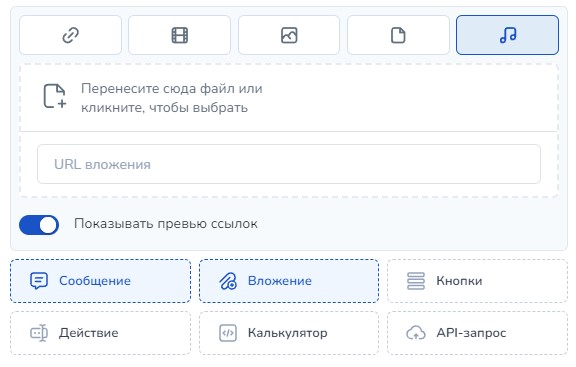

# WhatsApp\*


\*— принадлежит компании Meta Platforms Inc.,деятельность которой признана экстремистской в РФ и запрещена!



Мы не призываем Пользователей к использованию ресурса.

Помните!

1. Действия, связанные с приобретением товаров или услуг у запрещенной организации могут быть расценены как финансирование экстремистской деятельности, согласно ст. 282.3 УК РФ.
2. Также с 1 сентября 2025 запрещено распространять рекламу на информационных ресурсах тех организаций, деятельность которых запрещена в РФ (согласно ч. 3 ст. 12 ФЗ от 25 июля 2002 № 114-ФЗ).



При работе с мессенджером учитывайте следующее:

1. Максимальная длина текстового сообщения 4096 символов:
2. Под бота нужен отдельный номер отдельный телефон с приложением, подключенным к этому номеру!
3. Если чат-бот перестал реагировать на команды, то напишите ему  ::bot\_info\
   Если в ответ он молчит, то ваше подключение не работает. Если же он отвечает на этот запрос, то проблема в вашей схеме.


Если подключение не работает, то пройдите в **раздел Каналы, где подключен ваш мессенджер.** Статус авторизации должен быть: **Авторизован.** Если написано В спящем режиме, то возьмите телефон, на котором установлен мессенджер и запустите его.

Если бот авторизован, но все равно не отвечает на ::bot\_info, то в этом же разделе нажмите Аварийно переподключить мессенджер.

Если и это не помогает, то напишите в тех. поддержку.

<figure><figcaption></figcaption></figure>

## Как подключить бота

Перейдите в раздел "Каналы" и выбираем необходимый мессенджер. В появившемся окне введите номер телефона и нажмите кнопку "Готово".

<figure><figcaption></figcaption></figure>

Далее необходимо авторизоваться через qr-код&#x20;

Для сканирования QR-кода используйте QR-сканер внутри приложения WhatsApp на своём телефоне.


Успеть сканировать QR-код надо за 20 секунд после генерации кода!\
Если не успели, то сгенерируйте код заново, перезагрузив страницу.


Для этого откройте приложение на телефоне:

* На Android: откройте экран Чаты > Меню > WhatsApp\* Web.
* На iPhone: откройте Настройки > WhatsApp\* Web.
* На Windows Phone: откройте Меню > WhatsApp\* Web.

Если не удалось подключиться и страница не обновилась самостоятельно, обновите ее вручную.

<figure><figcaption></figcaption></figure>

Если все прошло успешно, в следующем окне вы увидите окно подключения с надписью "Авторизован".

Если же вы видите сообщение как на рисунке ниже, то 20 секунд на сканирование истекли и вам надо перезагрузить страницу с кодом.

<figure><figcaption>
Рисунок 3
</figcaption></figure>

Если все прошло успешно, то в Каналах для WhatsApp\* будет статус "В сети"

<figure><figcaption></figcaption></figure>

Если подключение не удалось, то статус будет выглядеть следующим образом:

<figure><figcaption></figcaption></figure>

Вы можете загрузить базу номеров телефонов для рассылки или переноса с другого аккаунта. Для этого необходимо нажать на кнопку "Загрузить список клиентов":

<figure><figcaption></figcaption></figure>


Необходимо учитывать, что если в проекте подключено более одного номера WhatsApp, то  при отключении одного из номеров запланированные сообщения будут уходить с активного на текущий момент номера.&#x20;

Такой алгоритм работы выбран для того, чтобы клиенты не терялись и получали сообщения от мессенджера. Учитывайте данную особенность интеграции с мессенджером при построении логики вашей схемы.


Ниже перечислены статусы подключения Whatsapp\*:

1. **Не удалось запустить бота.** _Проверьте, запущен ли Whatsapp\* на смартфоне_&#x20;
2. **В сети**&#x20;
3. **Спящий режим**_. Сообщения будут получены или отправлены, когда Whatsapp на телефоне выйдет из него._
4. **Бот не работает**_. Для запуска бота нажмите переподключить._
5. **Бот не работает.** _Whatsapp авторизован где-то еще. Возможно вы подключили его к другому проекту или Whatsapp.web_


Сканировать QR-код в вотсапе можно только в одном месте(сервисе/платформе)&#x20;

Если вы используете Salebot для WhatsApp, **нигде больше подключить WhatsApp веб не сможете. Либо бот отключится!**


Номера телефонов можно добавить вручную или загрузив CSV файл с номерами.

<figure><figcaption>
Рисунок 5
</figcaption></figure>

## Как отправить контакты

Вы можете отправить контакт в Whatsapp\*, чтобы клиент добавил вас в адресную книгу, это снижает вероятность блокировок.

 (1).png>)

Для того, чтобы отправить контакт, вы должны. сделать запрос POST-data:

URL запроса: \
**https://chatter.salebot.pro/api/\<api\_key>/send\_contact**\
где api\_key - ключ апи, который вы должны взять в настройках проекта.

Параметры запроса: \
&#xNAN;**{"phone":"ТЕЛЕФОН", "name":"ИМЯ","client\_id":"#{client\_id}"}**\
client\_id **-** оставьте без изменения #{client\_id} 

 (1).png>)

 (1).png>)

## Как отправить файлы

Бот может отправлять файлы через настройки вложений. Тип файла может определиться автоматически, а может быть указан.

 (1).png>)

## Как снизить возможность блокировки при рассылке

### Рекомендации от платформы

1\. Рекомендуется делать рассылку тем, у кого ранее была переписка с номером телефона, на котором подключен бот.\
\
2\. Выставлять промежутки временные между сообщениями, а не слать все пачкой (это в нижней строке настроек рассылки)\
\
3\. Не слать ссылки в первом сообщении рассылки (лучше создать цепочку в два блока, и отправить ссылку когда пользователь ответит на первый блок); тогда рассылку создаёте из блока, а не из раздела рассылки\
\
4\. Не слать контент, который люди могут расценить как спам (могут нажать на спам, и номер заблокируют. Нет четкой статистики, на какую по счету жалобу это происходит)\
\
5\. Виртуальные номера блокируют моментально, неизвестно почему и как они их распознают\
\
6\. Добавляйте к рассылке кнопку отписки , чтобы те, кто не хочет получать сообщения, могли от них отказаться не только по нажатия на кнопку "Спам". Обычный Ватсапп -  без кнопочный мессенджер. Настраивайте команду для отписки и сообщайте в тексте рассылки\
\
7\. Использовать случайные части сообщения, которые сделают рассылку персонализированной.&#x20;

### Опыт пользователя по борьбе с блокировками

Данный текст записан со слов пользователя, который в ходе свой деятельности получал блокировки от мессенджера и выявил закономерности.

Если не хотите попасть в бан:

* **Отправляйте не более 5-10 сообщений в минуту,** т.е. отправлять сообщения порционно, а не все сразу;&#x20;
* **Подключайте номер, зарегистрированный в мессенджере старше 90 дней**. Если вы только что зарегистрировали номер, то подождите сутки перед подключением его к сервису и в течение суток ведите переписки по whatsapp\*.&#x20;
* Учитывайте реакцию пользователей на сообщение. **Обычно хватает 3-х нажатий на кнопку "Спам" со стороны клиента, чтобы номер заблокировали**;&#x20;
* **Наличие ссылок в сообщениях повышает вероятность бана**;&#x20;
* Физического ограничения у WhatsApp\* по количеству сообщений нет, но есть рекомендация **не превышать 5000 сообщений в день**. Если количество будет больше, то лучше раскидать их на несколько разных аккаунтов. Либо, если количество входящих и исходящих сообщений будет примерно одинаковым, то можно отправлять и чуть больше 5000;&#x20;
* **Используйте устройство на котором не было ранее банов**;&#x20;
* Получайте входящие сообщения. **Чем больше входящих сообщений - тем лучше**. Входящие сообщения не учитываются в рекомендации не превышать 5000 сообщений. **Не пишите одинаковые сообщения**.&#x20;
* Также рекомендуется в конструкторе использовать **случайные ответы и случайные задержки перед ответом**. Если вы подключаете WhatsApp\*-номер к CRM или какому-либо конструктору, будьте готовы к тому, что ваш номер ЗАБАНЯТ за нарушение лицензионного соглашения! Если забанили Написать в техническую поддержку мессенджера с вопросом, почему бан и можно ли разбанить. **При первой блокировке скорее всего номер разблокируют. Отвечает ТП быстро, в течение 2-3 часов**.

Внимание! Даже если номер вернули, **подключение на заблокированном ранее аппарате должно происходить по инструкции**:&#x20;

1. Удалите заблокированное приложение мессенджера
2. Удалите Google аккаунт (отключите синхронизацию с действующим гугл-аккаунтом)&#x20;
3. Отключите от wi-fi&#x20;
4. Выключите телефон&#x20;
5. Замените sim-карту.&#x20;
6. Включите телефон.&#x20;
7. Создайте НОВЫЙ Google-аккаунт и зайдите под ним;&#x20;
8. Установите приложение WhatsApp на мобильном интернете;&#x20;
9. Зарегистрируйте WhatsApp\*-номер на мобильном интернете.&#x20;
10. Отсканируйте QR-код на мобильном интернете.&#x20;
11. Дайте интеграции поработать на мобильном интернете 2-3 часа.&#x20;
12. Подключите Wi-Fi.&#x20;
13. **Не делайте рассылки с номера, который боитесь потерять**.&#x20;
14. Не отправляйте одинаковые сообщения. WhatsApp\* следит за одинаковыми сообщениями и тоже за это банит.&#x20;
15. Старайтесь менять хотя бы одно слово в сообщении. Если вы работаете из CRM, берите какие-либо данные из полей.

Администрация ресурса согласна **не со всеми** утверждениями автора, это лишь его субъективные замечания, который мы посчитали важными донести до вас.

## Как настроить телефон для стабильной работы

Для того, чтобы бот работал стабильно (всегда получал сообщения и отвечал на них) нужно **обязательно выключить режим энергосбережения в настройках телефона**. Также на некоторых телефонах нужно дополнительно разрешить автозапуск, работу в фоне.

_Важно! Если указанные действия не помогают, необходимо будет включить смартфон в розетку, подключить к Wifi и выключить блокировку экрана. Эта  мера гарантированно отключает засыпание Whatsapp\*._

Дополнительные инструкции по настройке в зависимости от производителя:

### iPhone

Чтобы выключить режим энергосбережения, перейдите в раздел «Настройки» > «Аккумулятор». Также режим энергосбережения можно выключить через Пункт управления. Откройте «Настройки» > «Пункт управления» > «Настроить элем. управления», затем выберите «Режим энергосбережения», чтобы добавить возможность управлять им с помощью Пункта управления.

### Смартфоны Samsung

**Настройка для телефонов с версией Android 5, 6, 7, 8**:

Зайдите в настройках телефона в Энергосбережение (или батарея/диспетчер питания и т.п.). Там нужно выключить энергосбережение, если включено.

**Важно!** В зависимости от модели телефона в нем может быть установлено фирменное приложение **Smart Manager**. Если такое приложение стоит, откройте его, зайдите в батарею, в секции Оптимизация приложения нажмите ПОДРОБНО, в появившемся списке найдите приложение Whatsapp\*, нажмите на него и в открывшемся меню отключите оптимизацию.

**Настройка для телефонов с версией Android 9 и выше**:

Зайдите в настройки телефона->Оптимизация (Аккумулятор)->Батарея->Там отключите энергосбережение, если включено; далее нажмите кнопку меню сверху, далее Настройки. Выключите Адаптивный режим аккумулятора, Перевод в режим сна, Автоотключение приложений и Оптимизация настроек.

### Смартфоны Huawei и Honor

**В зависимости от конкретной модели и версии обновления, настройки телефона различаются, один из описанных вариантов должен подойти (попробуйте каждый вариант по очереди):**

**Вариант 1:**\
1\. Добавьте приложение Whatsapp\* в список защищенных приложений, чтобы телефон не выключал его и бот не переставала работать.\
Эта настройка может находиться в **одном из двух мест**:\
a) Зайдите в настройки телефона, далее в **Энергосбережение (или батарея/диспетчер питания и т.п.)**.\
Там есть кнопка/меню **Защищенные приложения**, нужно туда добавить приложение Whatsapp.\
b) Зайдите в настройки телефона, далее **Защищенные приложения**, если такой пункт есть, то добавьте туда приложение Whatsapp\*.

2\. Также, рекомендуем отключить режим энергосбережения в общих настройках батареи (энергосбережения).

**Вариант 2:**\
1\. Откройте настройки телефона->Батарея:\
1.1. Отключите энергосбережение\
1.2. В меню Блокировка экрана закрывает приложения убедитесь, что приложение Whatsapp\* не выключается (переключать выключен)\
1.3. Там же в батарее нажмите иконку настроек в правом верхнем углу, далее снимите галочку Закрыть энергоемкие приложения\
2\. Откройте настройки телефона->Приложения->Whatsapp\*->Батарея->Выключите Сообщать о энергоемкости и Закрыть после блокировки экрана

**Вариант 3:**\
1\. Откройте настройки телефона->Батарея:\
1.1. Выключите энергосбережение\
1.2. Нажмите иконку настроек в правом верхнем углу, там выключить Сообщать об энергоемкости и Закрыть приложения при блокировке экрана (если такая опция есть)\
2\. Откройте настройки телефона->Приложения->Whatsapp\*->Батарея->Выключите Сообщать о энергоемкости, Закрыть после блокировки экрана. Если есть пункт Экономия заряда батареи, то нажмите его, далее в  приложении Whatsapp\* выберите Не экономить.\
3\. Откройте настройки телефона->Приложения->Специальный доступ->Экономия заряда батареи->Не экономят заряд->далее в приложеии Whatsapp\* выберите Не экономить.\
4\. Откройте на рабочем столе телефона приложение Диспетчер телефона, в нем нажмите Очистка памяти, далее нажмите иконку настроек в правом верхнем углу, там снимите галочку Автоудаление.\
**Для всех телефонов (для всех вариантов настройки):**

Закрепите приложение, чтобы оно не выгружалось из памяти при очистке (бывает не на всех моделях, но на большинстве есть):\
\- Откройте список запущенных приложений (обычно открывается нажатием сенсорной кнопки в виде квадрата)\
\- Нажмите на значок замка в заголовке приложения (чтобы он закрылся). Если замка нет, потяните приложение вниз, замок закроется.

### Смартфоны Xiaomi

1\. Разрешите приложению работать в фоне:\
Откройте настройки телефона, далее Дополнительно (если есть). Выбираем раздел **Батарея и производительность**, далее настройка может быть **в одном из следующих мест мест** в зависимости от модели:\
a) В меню **Фоновый режим**. Устанавливаем **уровень ограничения** **Стандартный**. Далее нажимаем **Приложения**, нажимаем на Whatsapp\* и назначаем ему **Нет ограничений**.\
b) В меню **Экономия энергии->Выбрать приложения->Нажать в списке на Whatsapp\* ->Выбрать Нет ограничений**.\
c) В меню **Активность приложений (или Выбор приложений)->Нажать в списке на Whatsapp\* ->Выбрать Нет ограничений**.\
d) Если в этих местах настройки нет, проверьте остальные подменю, в одном из них она точно будет.

3\. Закрепите приложение, чтобы оно не закрылось при запуске очистки/закрытия приложений пользователем:\
Находясь на рабочем столе телефона нажмите сенсорную кнопку открытия списка запущенных приложений (обычно самая левая кнопка на лицевой стороне телефона), далее потяните приложение Whatsapp\* вниз, далее нажмите на замочек (кнопку Закрепить).\
На некоторых моделях такой настройки может не быть, в таком случае ее не нужно делать.

### Смартфоны Meizu

1\. Откройте в списке программ **Безопасность (или Центр безопасности)**, во вкладке **Разрешения** разрешите автозапуск приложению Whatsapp\*. Так же, во вкладке **Энергосбережение->Управление спящим режимом** нужно разрешить приложению Whatsapp\* постоянную работу в фоне (выбрать нет ограничений).\
2\. Вернитесь на рабочий стол телефона, далее откройте список запущенных приложений (потяните экран от нижней части вверх), зажмите приложение Whatsapp\*, чтобы в заголовке появился значок замка (на некоторых моделях нужно потянуть приложение вниз вместо удержания).

### Смартфоны Asus

Если используете функцию очистки/ускорения, тогда обязательно добавить приложению Whatsapp\* в список исключений (защищенные приложения) там же в Мобильном диспетчере, иначе после ускорения/очистки приложение будет остановлено телефоном!

### Смартфоны Lenovo

1. Зайдите в настройках телефона в Энергосбережение (или батарея/диспетчер питания и т.п.). Там нужно выключить энергосбережение, если включено.
2. Проверьте наличие следующих приложений в телефоне:
3. На некоторых моделях бывает предустановлено приложение SecureIT. Если в списке программ есть такое, откройте его и в разделе Ускорение (Speed-up) добавьте приложение Whatsapp\* в список исключений отключения.
4. На некоторых моделях бывает предустановлено приложение Lenovo Power (или Power/Power Manager). Если такое приложение установлено, нужно в нем выключить энергосбережение, а так же разрешить приложению Whatsapp\* постоянную работу в фоне.
5. На некоторых моделях бывает предустановлено приложение Finally clean. Если такое приложение установлено, нужно его открыть, внизу нажать кнопку Я, далее Настройки, далее Список исключений, далее список игнорирования ускорения, там добавить приложение Whatsapp\*.
6. Нажмите в телефоне сенсорную кнопку в виде квадрата — откроется список запущенных приложений, зажмите приложение Whatsapp\* и потяните вниз, если появится кнопка в виде замка, нажмите ее, в заголовке приложения появится замок.

### Смартфоны Fly

1. Зайдите в настройках телефона в Энергосбережение (или батарея/диспетчер питания и т.п.). Там нужно выключить энергосбережение, если включено.
2. На некоторых моделях бывает предустановлено приложение Clean Master, которое мешает нормальной работе других приложений. Если такое приложение установлено, нужно в нем разрешить постоянную работу приложения Whatsapp\* (добавить в исключения). Если будут наблюдаться проблемы с работой бота, рекомендуем удалить Clean Master.

### Смартфоны ZTE

1\. Если на телефоне установлено фирменное ZTE приложение **Mi-assistant** (еще одно название **Помощник**), то откройте его, далее **Ускорение**->**Белый список**->включите в нем приложение Whatsapp\*; далее, там же в Ускорении нажмите на иконку настроек, далее **Приложения в автозагрузке**->Там включите приложение Whatsapp\*, если было выключено (если уже включено, оставьте как есть).\
2\. Если на телефоне предустановено приложение **360 security**, откройте его, далее в меню нажмите **Настройки**, далее в секции **Ускорение и энергосбережение** нажмите **Избранное**, там добавьте приложение Whatsapp\*. Или можете просто удалить этот 360 security, если не пользуетесь им.

### Общее/Остальные производители

1.  Зайдите в настройках телефона в Энергосбережение (или батарея/диспетчер питания и т.п.). Там нужно выключить энергосбережение, если включено.

    На некоторых телефонах может стоять отдельное системное приложение для настройки энергосбережения, там тоже нужно все отключить.
2. На некоторых смартфонах может стоять системное приложение под названием Безопасность/Разрешения/Менеджер приложений или похожее. Если такое приложение есть, откройте его и дайте все разрешения приложению Whatsapp\* (автозапуск, работу в фоне).
3. На некоторых телефонах могут быть установленые различные приложения по оптимизации/очистке памяти (например Clean Master, Duraspeed, CClean, 360 security и т.п). Данные приложения обычно мешают нормальной работе приложений, поэтому нужно удалить эти приложения или правильно их настроить.
