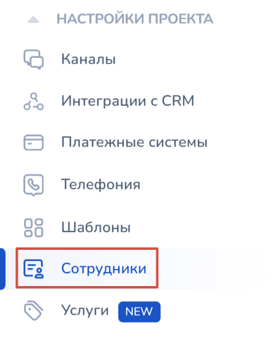
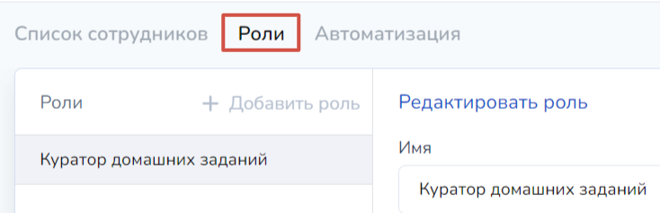
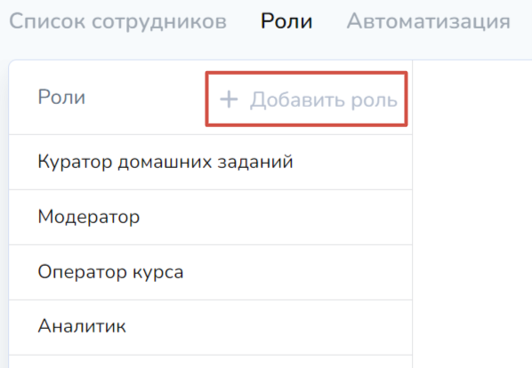
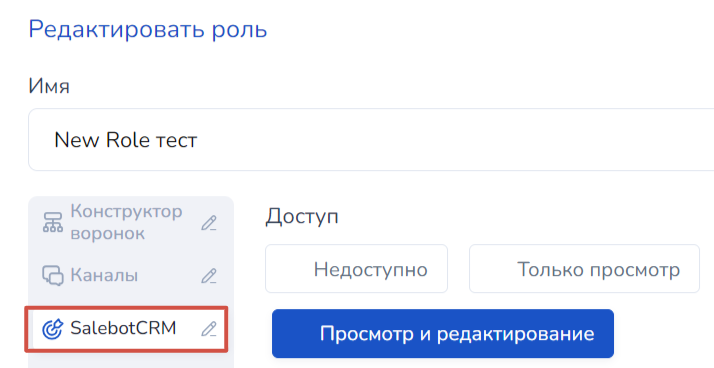
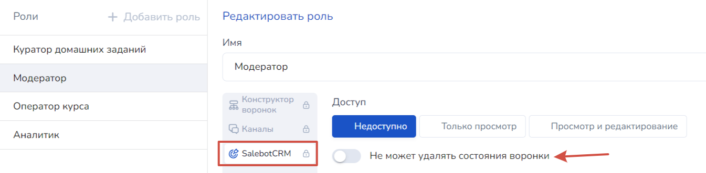

# CRM для бизнеса

CRM-система (Customer Relationship Management, система управления взаимоотношениями с клиентами) - мощный функционал, предназначенный для автоматизации и оптимизации процессов управления отношениями с клиентами, партнерами, поставщиками, подрядчиками и другими важными для контактами для бизнеса.

CRM позволяют собирать и структурировать информацию о клиентах, управлять продажами, следить за состояниями сделки, а также анализировать результаты работы и принимать обоснованные решения на основе собранных данных.

Основные функции и возможности CRM-систем включают:

1. Управление контактами: сбор и хранение контактной информации о клиентах, включая их имена, номера телефонов, электронную почту и другую необходимую информацию.
2. Управление продажами: планирование и отслеживание этапов продаж, определение задач и сроков выполнения, контроль за работой сотрудников бизнес-проекта.
3. Управление задачами: создание, назначение и контроль выполнения задач, связанных с продажами, обслуживанием клиентов и другими бизнес-процессами (см. статью "[Задачи](zadachi.md)").
4. Управление сделками: планирование, организация и анализ этапов сделок, отслеживание взаимодействия с клиентами и партнерами на всех этапах сделки.

<figure><figcaption>
Рис. 1. CRM-система в Salebot (p.s. все данные вымышлены и совпадения случайны)
</figcaption></figure>

## Основные настройки

<figure><figcaption>
Рис. 2. Название воронки CRM
</figcaption></figure>

Список воронок (рис. 2) - при клике на название воронки, откроется выпадающий список с созданными вронками в CRM, где вы сможете выбрать вкладку с филиалом:

<figure><figcaption>
Рис. 3. Список воронок (филиалов) в CRM
</figcaption></figure>

### Создание и настройки воронки

Здесь же, в меню со списком воронок, вы можете создать новую, кликнув по кнопке "+ Создать новую воронку":

<figure><figcaption>
Рис. 4. Модальное окно для создания новой воронки
</figcaption></figure>

В открывшемся окне вам нужно прописать название воронки (филиала) и выбрать валюту (рис. 4).&#x20;

После чего будет создана воронка без состояний\*:

<figure><figcaption>
Рис. 5. Новая воронка в CRM без состояний.
</figcaption></figure>


\*Состояния воронки CRM - это этапы, через которые проходит потенциальный клиент от момента первого контакта до завершения сделки или другого целевого действия. Каждый этап представляет собой определенный статус или стадию взаимодействия с клиентом, отражая его прогресс в процессе продажи или обслуживания (см. рис. 6)


<figure><figcaption>
Рис. 6. Состояния воронки
</figcaption></figure>

Нажмите на кнопку "Создать", чтобы создать состояние\* воронки:

<figure><figcaption>
Рис. 7. Модальное окно для создания состояния воронки с полем для ввода названия состояния
</figcaption></figure>

Пропишите название состояния воронки, после чего нажмите "Готово".&#x20;

Состояние будет создано в воронке, а вам откроется модальное окно для настроек воронки:

<figure><figcaption>
Рис. 8. Настройки новой воронки в CRM
</figcaption></figure>

В модальном окне (рис. 8) вы можете:

1. Изменить название воронки;
2. Изменить валюту;
3. Добавить новые состояния воронки;
4. Отобразить необходимые поля в сделке в виде "Доска"\*\*:

<figure><figcaption>
Рис. 9. Поля сделки
</figcaption></figure>


\*\*CRM можно отображать в виде доски и списка со сделками.

Вид доски CRM стандартный и отображается по умолчанию, выглядит следующим образом:

<em>Рис. 10. CRM в виде доски</em>

CRM в виде списка отображается таблицей со сделками:

<em>Рис. 11. CRM в виде списка</em>



5. На карточках сделок можно отобразить переменные:

<figure><figcaption>
Рис. 12. Настройки для отображения переменных в карточках сделок
</figcaption></figure>


Подробнее о том, что такое переменные, рассказали в одноименной статье "[Переменные](/broken/pages/-LxpXZscJeU6Wb2MlqSH)"


6. Отображение скрытых состояний

В CRM-системе по умолчанию существуют следующие состояния воронки:

а) успешные сделки;

б) архивные сделки;

в) проваленные сделки;

г) неразобранные сделки.

<figure><figcaption>
Рис. 13. Состояния воронки по умолчанию
</figcaption></figure>

В настройках воронки такие состояния можно скрыть или наоборот отобразить:

<figure><figcaption>
Рис. 14. Настройки воронки: как скрыть или отобразить состояния, существующие по  умолчанию в CRM
</figcaption></figure>

7. Чекбоксы для настройки вывода и действия со сделками:

<figure><figcaption>
Рис. 15. Дополнительные поля для отображения сделок
</figcaption></figure>

#### Объединение сделок

Если один клиент может вести диалог с вашей Компанией из разных мессенджеров, например в Telegram и WhatsApp, то вы можете объединить контакты клиента и так же объединить сделку, чтобы избежать дублей сделки одного клиента.&#x20;

Для этого включите настройку "Скрытия объединенных клиентов". Так на этапе воронки будет отображаться только одна сделка того клиента который выбран основным при связывании. \
\
Как работать с объединением сделок и клиентов подробно показали в видео-обзоре:&#x20;



Далее после настройки воронки нажмите "Сохранить":

<figure><figcaption>
Рис. 16. Для сохранения настроек воронки нужно  нажать на "Сохранить"
</figcaption></figure>

Теперь ваша новая воронка будет отображаться с установленными настройками:

<figure><figcaption>
Рис. 17. Вид новой воронки в CRM-системе
</figcaption></figure>

Чтобы вновь перейти в настройки воронки, нажмите на шестеренку в верхнем меню:

<figure><figcaption>
Рис. 18. Кнопка для настроек воронки
</figcaption></figure>

## Видеогид "Создать и удалить воронку в Salebot CRM"


Видео по работе с воронками, их созданием удалением и настройкой этапов воронки


## Неразобранное в воронке SalebotCRM

В CRM существует раздел "Неразобранное". В этом разделе будут отображаться все сделки, которые не попали на этап воронки по каким-то причинам.

Причины по которым сделка может не попасть на этап воронки в проекте:

* в настройках проекта не включен прием лидов на первый этап сделки
* воронка в проекте не настроена
* переход на этап воронки настроен в блоках схемы бота и _**нет**_ настройки приема лидов на первый этап - то есть клиент в блок с настройками не попал.

Сделки, которые не попали на этап воронки автоматически могут перемещаться в "Неразобранное".

Включить отображение неразобранного можно в настройках воронки, так же как и другие системные стадии (успешная/проваленная сделка/архивная сделка).

<figure><figcaption>
Рис. 19. Настройки воронки: как скрыть или отобразить состояния, существующие по  умолчанию в CRM
</figcaption></figure>

Отметьте чек-бокс для отображения системного состояния и сохраните настройки.

❗️Неразобранное можно отобразить для каждой воронки отдельно, но в нем будут _**ВСЕ**_ сделки, которые не попали на этап воронки.


Сделки из неразобранного нельзя перемещать методом перетаскивания на другой этап воронки. Такой вариант работы выбран для того, чтобы исключить ошибочные перемещения сделок в активные этапы воронки.&#x20;


Если сделка в неразобранном вам не нужна, то ее можно удалить. Данное действие требует подтверждения.&#x20;

## Запрет на удаление состояний воронки

При необходимости ограничить возможности и доступ ваших сотрудников в проекте и для безопасности сохранения существующих сделок в системе, вы можете установить запрет на удаление состояний воронки в настройках проекта.&#x20;

Для этого перейдите в настройках проекта в раздел сотрудники -> роли:

<figure><figcaption></figcaption></figure> <figure><figcaption></figcaption></figure>

Далее найдите необходимую роль в списке или создайте новую:

<figure><figcaption></figcaption></figure>

После чего в настройках редактирования роли найдите вкладку SalebotCRM:

<figure><figcaption></figcaption></figure>

После чего выберите доступ для роли в проекте: доступны просмотр и редактирование; только просмотр либо раздел недоступен совсем.&#x20;

Здесь же вы найдете чекбокс "Не может удалять состояния воронки" - именно он вам и нужен. Активируйте чекбокс, и тогда в настройках указанной роли будет стоять запрет на удаление.&#x20;

<figure><figcaption></figcaption></figure>


Как создавать и настраивать роли для сотрудников в проекте, смотрите в статье "[Настраиваемые роли](/broken/pages/SIUeJLHQq31693zHRNLY)".


## Настройка callback

В настройках проекта в разделе "Callback" можно изменить вид колбека crm\_state\_changed — можно сделать его короче, убрав ID состояния.

<figure><figcaption></figcaption></figure>

<figure><figcaption></figcaption></figure>

Меняет вид коллбека "crm\_state\_changed " — это значит, что можно убрать или наоборот добавить ID состояния:

<figure><figcaption></figcaption></figure> <figure><figcaption></figcaption></figure>

## Функции API Salebot

Для использования всех возможностей CRM через бота, ознакомьтесь со статьей:&#x20;


