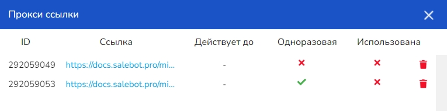
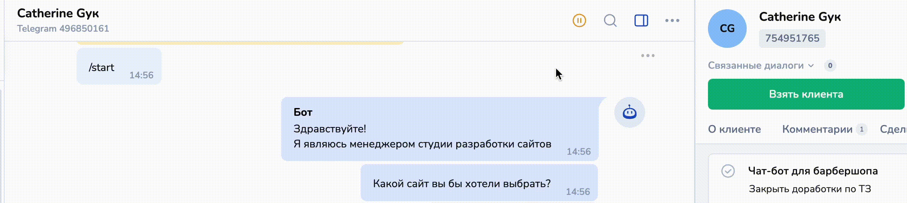
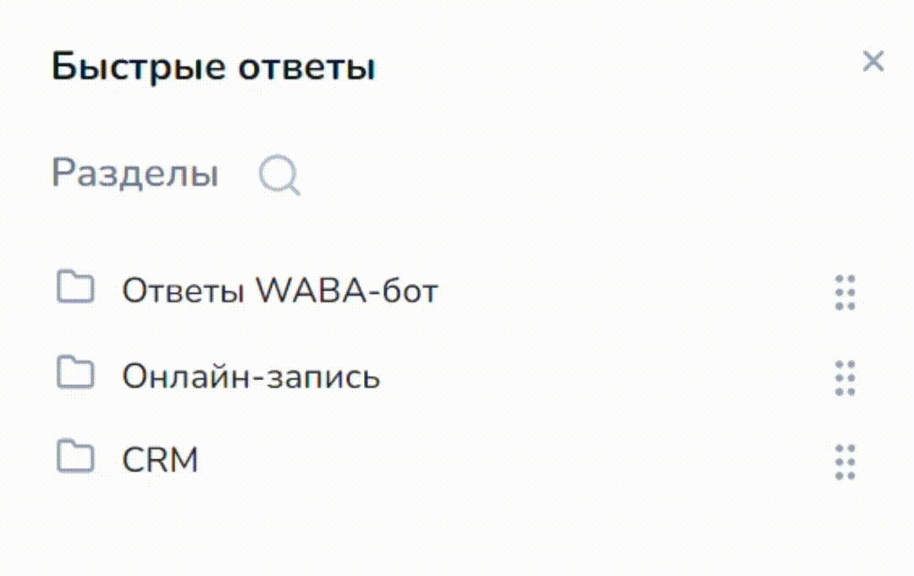

# Диалог с клиентом

В разделе "Клиенты" (при клике в левом списке на пользователя) можно открыть диалоговое окно, чтобы просмотреть необходимую информацию и историю переписки с клиентом:

<figure><figcaption></figcaption></figure>

При этом можно вести общение с пользователями из разных мессенджеров в едином разделе "Клиенты" — не нужно переключаться каждый раз к разным мессенджерам, социальным сетям или чату с объявлением (например, для Юлы, Циана или Авито).

## Данные и информация о клиенте

Правый бар - это карточка клиента, в которой указана вся информация о нем. В карточку записаны, как стандартные переменные, так и те которые вы записываете в боте, лендинге или получаете из сторонних сервисов (например телефонии):

<figure><figcaption></figcaption></figure>

<em>p.s. все данные вымышлены, совпадения случайны</em>

Карточка имеет несколько подразделов:

1. О клиенте;
2. Комментарии;
3. Сделки;
4. Задачи;
5. Курсы (на тарифе "Инфобизнес").

### О клиенте

В каждой карточке есть стандартные поля и кнопки взаимодействия.

<figure><figcaption></figcaption></figure>

<em>p.s. все данные вымышлены, совпадения случайны</em>

Если клиент обращается из мессенджера и у него установлен аватар, то он отобразится в карточке клиента. Также будет указано имя клиента (автоматически прописывается из мессенджера: номер телефона для whatsapp, имя пользователя — для Telegram, имя и фамилия — для Вконтакте и т.д.)  :

<figure><figcaption></figcaption></figure>

Чтобы изменить имя клиента, нажмите на кнопку карандаша и пропишите необходимое:

<figure><figcaption></figcaption></figure>

ID клиента - это идентификатор клиента в salebot, _<mark style="color:orange;">уникальный номер</mark>_ клиента. Этот идентификатор (client\_id) используется при работе с функциями в salebot, а так же может понадобится при работе с клиентами (поиск, связывание клиентов и прочее).&#x20;

<figure><figcaption></figcaption></figure>

Кнопка "Передать клиента" - кнопка позволят назначить ответственного для данного клиента.

Также ответственного можно назначить в плашке "Ответственный":

<figure><figcaption></figcaption></figure>

Во вкладке "О клиенте" можно увидеть карточку "Контакты":

<figure><figcaption></figcaption></figure>

В данной карточке отображается номер телефона и / или электронная почта, полученные:

1. Если клиент написал в бот, а бот собирал данные клиента с помощью переменных phone / email:

Пример схемы со сбором данных номера телефона (email) в переменные phone (email):

<figure><figcaption></figcaption></figure>

[Подробнее, как работать со стрелкой со сбором данных, рассказали здесь.](../../chat-boty/kak-sozdat-chat-bot-dlya-biznesa/strelki-soedineniya/tipy-soedinenii-strelok.md#strelka-so-sborom-dannykh)

1. Можно заполнить данные вручную в разделе "О клиенте":

<figure><figcaption></figcaption></figure>

2. При создании сделки в боте со сбором данных клиента или при ручном создании сделки (нужно заполнить поля телефон и почта):

<figure><figcaption></figcaption></figure>

3. При заполнении клиентом формы сбора данных ([при включении переключателя в настройках "Создать сделку в CRM](https://docs.salebot.pro/~/changes/5570/saity-dlya-biznesa/konstruktor-saitov/minilendingi-v-socialnykh-setyakh/sekcii-bloki/sekciya-forma#kak-dobavit-sdelku-v-salebotcrm-s-saita)")

<figure><figcaption></figcaption></figure>

В карточке клиента отображаются данные по этапу воронки, в которой находится клиент на текущий момент и реализована возможность перемещения клиента:

<figure><figcaption></figcaption></figure>


Если клиент не привязан к сделке или воронке, состояние сделки отображаться не будет.


Если у вас создано несколько воронок, то их состояния будут скрыты, до того момента пока вы не захотите изменить этап воронки для текущего клиента и не кликните на нужную воронку.&#x20;

Также в данном блоке вы можете добавить клиенту метку или переместить его в список. Метки и списки можно создать из карточки клиента:

<figure><figcaption></figcaption></figure>

Как добавить клиента в список или присвоить метку

Во вкладке "О клиенте" можно присвоить клиенту метку и добавить его в различный созданный список.&#x20;

<figure><figcaption></figcaption></figure>

Чтобы добавить метку, нажмите на кнопку "+ метки". В открывшемся окне в пустом поле пропишите название метки и при необходимости выберите ее цвет:

<figure><figcaption></figcaption></figure>

Добавьте необходимое количество меток и отметьте в галочку возле метки для добавления ее клиенту.

Чтобы удалить или изменить метку, нажмите на иконку карандаша, после чего в открывшемся окне произведите необходимые изменения или удалите метку.

<figure><figcaption></figcaption></figure>

В дальнейшей вы сможете осуществлять поиск по меткам в фильтрах.&#x20;

Аналогично функционалу создания метки, можно создавать списки клиентов:

<figure><figcaption></figcaption></figure>

В обязательном поле пропишите название списка и при необходимости выберите цветовую гамму списка. После чего отметьте галочкой необходимый список.&#x20;

Ниже в карточке клиента расположен блок с переменными и редактором переменных. \
Вы можете добавить переменную из данного блока указав тип переменной (переменная клиента или переменная сделки) задав ее имя и значение.&#x20;

<figure><figcaption></figcaption></figure>

Также в карточке указаны системные переменные: в документации будем рассматривать только их, так как набор переменных, которые вы можете задать в своем проекте, будет уникальным.


Подробнее о переменных рассказали [в одноименной статье. ](../../chat-boty/peremennye-i-funkcii/peremennye.md)


<figure><figcaption></figcaption></figure>

1. _**Тег**_ - Переменная-идентификатор которая позволяет отследить откуда пришел клиент. [Подробно о теге рассказали тут](../../saity-dlya-biznesa/konstruktor-saitov/nastroiki-stranicy-saita.md#teg)
2. _**Дата создания**_ - это дата и время в которые был создан текущий клиент. Часовой пояс указан тот, который задан в проекте.&#x20;
3. _**Последнее действие**_ - время последнего действия с клиентом
4. _**Источник**_ - мессенджер из которого пришел клиент.
5. _**ID в мессенджере**_ - уникальный идентификатор клиента в мессенджере (переменная platform\_id). Используется для загрузки клиентов, работы с функциями api, поиска клиента и прочих действий.&#x20;
6. _**Привязан к боту**_ - в этом параметре указано имя бота или его идентификатор&#x20;
7. _**Позиция в воронке**_ - номер блока в схеме раздела "Конструктор воронок". Если у вас создана схема и клиент проходит по ней, то в данном параметре будет указан номер блока в котором клиент находится на данный момент.&#x20;
8. _**Ответственный**_ -  email сотрудника, к которому привязан клиент. Если клиент ваш, так и будет написано “Ваш клиент”.
9. Если клиент остановился в воронке, где следующий блок отправляет сообщение с задержкой, то будет отображаться переменная "_**Сообщений запланировано":**_

<figure><figcaption></figcaption></figure>

Подробнее о запланированных сообщениях

Если кликнуть на параметр, то откроется окно со списком сообщений:

<figure><figcaption></figcaption></figure>

В модальном окне указан номер блока, из которого сообщение запланировано, текст сообщения или наименование блока, если оно задано, а также дата и время отправки.&#x20;

Дату и время вы можете изменить, для внесения изменений необходимо выполнить следующие действия:

* Указать дату, выбрав ее в календаре
* Ввести время отправки&#x20;
* Нажать кнопку <mark style="color:orange;">"Подтвердить"</mark>

<figure><figcaption></figcaption></figure>


Если изменение даты и времени не **подтвердить** нажатием кнопки, то сообщение будет отправлено по ранее созданным настройкам. \
Сохраняйте все изменения, которые вносите для корректной отправки сообщений.&#x20;


Можно отправить блок сразу (кнопка с иконкой письма), отменить отправку (кнопка с перечеркнутым кругом) или оставить без изменений (на крестик в правом верхнем углу).

<figure><figcaption></figcaption></figure>

10. **Прокси ссылки** — отображает количество прокси ссылок клиента. При нажатии открывается таблица этих прокси ссылок.

<figure><figcaption>
Таблица прокси-ссылок в карточке клиента
</figcaption></figure>

### Комментарии

Подраздел "Комментарий" дает возможность оставлять комментарии в диалоге клиента, причем сами сообщения из данного раздела клиент не увидит.&#x20;

<figure><figcaption></figcaption></figure> <figure><figcaption></figcaption></figure>

Это удобно когда вопрос клиента находится на уточнении или с клиентами работает несколько операторов или сотрудников из разных отделов.&#x20;

<figure><figcaption></figcaption></figure>

Комментарий можно оставить также, если нажать на "Преобразовать в комментарий", когда пишите сообщение:

<figure><figcaption></figcaption></figure>

В комментарии будет указан его создатель и дата/время. Также оставленный в диалоге комментарий можно удалить, редактировать или закрепить в диалоге клиента. Выбрать действие можно в боковом меню:

<figure><figcaption></figcaption></figure>

### Сделки

Во вкладке "Сделки" отображаются все сделки клиента и активные, и уже завершенные.&#x20;

<figure><figcaption></figcaption></figure>

Пример успешной закрытой сделки:

<figure><figcaption></figcaption></figure>

Если сделка закрыта, но вам необходимо добавить в нее переменную, то вы можете это сделать нажав на активную строку _**"+ Новая переменная".**_&#x20;

В этой вкладке вы можете создать новую сделку для данного клиента. \
Нажмите кнопку _**"+ Создать сделку"**_ и введите данные в форму создания. Укажите бюджет, задайте все необходимые данные и выберите состояние воронки для созданной сделки:

<figure><figcaption></figcaption></figure>

### Задачи

Раздел "Задачи" поможет поставить задачу на ответственного сотрудника и не забыть о её выполнении.

<figure><figcaption></figcaption></figure>

Создать задачу можно по клику на одноименную кнопку.&#x20;

Для создания укажите название задачи, внесите ее описание, приоритет и укажите дату выполнения:

<figure><figcaption></figcaption></figure>

Когда задача создана она отобразиться в разделе с описанием и датами выполнения.&#x20;

## **Диалоговое окно**

<figure><figcaption></figcaption></figure>

Верхняя часть содержит имя клиента, время последнего действия клиента, id в мессенджере.

<figure><figcaption></figcaption></figure>

Кнопки и меню в блоке:&#x20;

1. _**Поставить бота на паузу:**_ приостанавливает работу бота для этого клиента на 24 часа, либо запускает остановленного бота.
2. _**Поиск сообщений по словам**_ - поиск в диалоге по заданным словам.
3. _**Отобразить/спрятать боковое меню**_ - убирает либо отображает левую панель раздела "Клиенты".
4. _**Отметить диалог непрочитанным**_ - отметить последнее сообщение клиента, как непрочитанное.
5. _**Открепить диалог/Закрепить диалог**_ — закрепляет/открепляет диалог в списке клиентов. Закрепленные диалоги всегда располагаются в верхней части списка клиентов.
6. _**Заблокировать/разблокировать клиента**_ - блокирует или разблокирует клиента.&#x20;
7. _**Удалить клиента**_ - удалить клиента из Salebot.

В диалоговом окне отображаются сообщения от клиента, сообщения менеджеров и от бота, а также системные уведомления, которые отображаются желтым цветом (колбеки, комментария, которые клиент не видит):

<figure><figcaption></figcaption></figure>

Все сообщения содержат контекстное меню. Обычные сообщения можно закрепить или удалить:

<figure><figcaption></figcaption></figure>

Закрепленное сообщение будет отображаться в верхней части, с указанием времени отправки. Открепить сообщение можно с помощью крестика:

<figure><figcaption></figcaption></figure>

Можно переотправлять сообщение клиенту, при этом существует функционал изменения темы сообщения (для email-ботов), если перессылка осуществляется, например, из Telegram на электронную почту.&#x20;

Удалять сообщения могут все сотрудники, кроме операторов. Чтобы ограничить возможность удаления сообщений, вы можете настроить роли.&#x20;


Как работать с ролями рассказали в статье "[Сотрудники](../../o-nas/administrirovanie/sotrudniki.md)"


## **Форма отправки сообщения**

<figure><figcaption></figcaption></figure>

_**Главное поле**_ — поле ввода сообщения для отправки клиенту.\
Меню формы

1. _**Отправить emoji (смайлик)**_ открывает меню с выбором emoji, чтобы добавить emoji в ваше сообщение, просто нажмите на нужную иконку.
2. _**Прикрепить файл**_ - загрузить файл для отправки клиенту. Открывает меню с выбором типа файла. Также в этом окне вы можете просмотреть ранее загруженные файлы, их размер, дату загрузки и название. Ненужные файлы можно удалять.

<figure><figcaption></figcaption></figure>


Вы можете загрузить изображения из буфера обмена, просто вставив его в главное поле ввода сообщения. Оно будет загружено к нам на сервис и будет занимать 1 из 40 мест


<mark style="color:orange;">**В проекте может быть**</mark><mark style="color:orange;">**&#x20;**</mark>_<mark style="color:orange;">**до 200 файлов.**</mark>_<mark style="color:orange;">**&#x20;**</mark><mark style="color:orange;">**После загрузки 200 файлов, чтобы загрузить новый, вам придется удалить один из старых файлов.**</mark>

3. _**Быстрые ответы**_ - позволяет создавать шаблоны сообщений для отправки клиентам. Также можно формировать отдельные папки для удобства поиска и категорирования готовых сообщений.

<figure><figcaption></figcaption></figure>

После клика на кнопку (См. пример выше), откроется небольшая форма с заполнением поля названия раздела ответов:

<figure><figcaption></figcaption></figure>

После создания разделов, их можно перемещать в любом удобном порядке:

<figure><figcaption></figcaption></figure>

Чтобы создать сообщение с быстрым ответом, кликните по необходимой папке (разделу):&#x20;

<figure><figcaption></figcaption></figure>

после чего вы увидите форму добавления быстрого ответа:

<figure><figcaption></figcaption></figure>

4. _**Отправить сообщение из воронки**_  - позволяет отправить клиенту сообщение, из конкретного блока. После отправки сообщения, клиент будет перенаправлен в выбранный блок, а его дальнейшие действия будут зависеть от последующей цепочки в разделе воронки. \
   В открывшемся окне выбора блока из раздела воронки необходимо выбрать нужный блок. Блоки можно отфильтровать их по цвету (типу), найти через форму поиска по описанию, ID или ответу.

<figure><figcaption>
окно с выбором блока из схемы
</figcaption></figure>

Сообщение из выбранного блока можно отредактировать из главного поля. Кнопка Удалить блок удалит выбранный блок:

<figure><figcaption></figcaption></figure>

5. _**Преобразовать в комментарий**_ - позволяет преобразовывать сообщение в комментарий для подготовки более полного ответа клиенту и комментирования действий сотрудника в диалоге.


Подробнее о работе с комментариями рассказали выше в разделе "[Комментарии](dialog-s-klientom.md#kommentarii)"


6. **Иконка таймера** -  при нажатии открывается меню, в котором можно выбрать точное время для отправки сообщения. Чтобы выбрать дату и время, нужно кликнуть на соответствующее поле.

<figure><figcaption></figcaption></figure>

7. **Кнопка отправки сообщения** — отправляет введённое сообщение.&#x20;

Вы можете отправить переменную в виде #{имя\_переменной}, и она будет доставлена в виде значения этой переменной. Есть возможность изменять высоту поля ввода сообщения, для этого нужно просто потянуть за верхнюю часть блока, в котором находится поле.

8. Сгенерировать текст с помощью ИИ

<figure><figcaption></figcaption></figure>

Кликните по кнопке, после чего откроется модальное окно с выбором АИ-ассистента:

<figure><figcaption></figcaption></figure>

Чтобы сгенерировать любой необходимый текст с помощью ИИ, выберите АИ-ассистента, который будет вами использован:

<figure><figcaption></figcaption></figure>

Затем кликните на "Закрыть" и пропишите в поле для сообщения - необходимый текст.&#x20;

<figure><figcaption></figcaption></figure>

После чего кликните по кнопке для генерации текста:

<figure><figcaption></figcaption></figure>

Вы увидите результат в поле "Сообщения", переработанное ИИ:

<figure><figcaption></figcaption></figure>

## Отличие ответственного за сделку и ответственного за клиента

В контексте CRM-системы и диалогов с клиентами, ответственный за клиента и ответственный за сделку - это две разные роли, хотя и тесно взаимосвязанные.&#x20;

1. **Ответственный за клиента** обычно отвечает за установление и поддержание отношений с клиентом.&#x20;

В контексте диалогов с клиентом в Salebot - **ответственным за клиента** является тот менеджер (сотрудник) вашего проекта, который в данный момент ведет переписку с клиентом в разделе "Клиенты".&#x20;

<figure><figcaption>
Три способа, как назначить ответственного за клиента: 1. Кликнуть "Взять клиента"; 2. Кликнуть "Передать клиента"; 3. В поле "Ответственный" выбрать сотрудника.
</figcaption></figure>

Чтобы назначить ответственного, закрепленного за клиентом, можно перейти с ним в диалог и кликнуть на "Взять клиента":

<figure><figcaption></figcaption></figure>

Также ответственного, закрепленного за клиентом, можно изменить, кликнув на "Передать клиента" либо выбрав ответственного в выпадающем списке сотрудников в поле "Ответственный":

<figure><figcaption></figcaption></figure>

2. **Ответственный за сделку**, в свою очередь, фокусируется на конкретном этапе продаж, например, на заключении договора на этапе "Первичный контакт" или на выполнении заказа.

<figure><figcaption></figcaption></figure>

Чтобы просмотреть ответственных по сделкам клиентов, перейдите во вкладку "Сделки" в карточке клиента.

Ответственными за клиента и ответственными за сделку могут быть назначены разные сотрудники вашего проекта:

<figure><figcaption>
Рис. 1. Ответственный за клиента
</figcaption></figure> <figure><figcaption>
Рис. 2. Ответственные за сделки
</figcaption></figure>

Например, на рис. 1 сотрудником, ответственным за клиента, является менеджер Катерина; в свою очередь, на рис. 2, ответственным за сделку "Заключить договор" является юрист - Софья, а за разработку сайта — разработчик Вадим.&#x20;

То есть, за одним клиентом могут быть закреплены разные менеджеры и сотрудники, а по каждой отдельной сделке — отдельный ответственный сотрудник. Также сотрудника по сделке можно переназначать при переходе сделки в разные состояния CRM.

## Видеообзор


Видео с описанием диалога клиента.&#x20;

