# Задачи

Раздел "Задачи" определенно заслуживает статус полезного раздела "Сейлбот" - это важная функция, которая помогает пользователям организовывать и управлять своими задачами и списками дел. Она предоставляет систему для создания, редактирования, приоритизации и отслеживания задач, помогая тем самым сохранять порядок и повышать продуктивность.

К основным функциям раздела “Задачи” можно отнести:

1. Создание и редактирование задач: пользователь может создавать новые задачи, вводить их описание, устанавливать сроки выполнения.
2. Приоритизация задач: возможность установить приоритет для каждой задачи, чтобы в первую очередь выполнять наиболее важные задачи.
3. Привязка к определенному сотруднику: в системе можно привязать выполнение определенной задачи к нужному сотруднику, который в свою очередь может просмотреть список именно своих насущных дел, что помогает избежать забывчивости и повысить продуктивность.
4. Распределение задач по календарю: пользователь может отображать понедельный календарь и просматривать список всех уже существующих задач и отслеживать сроки, не пропуская их.
5. Группировка задач - позволяет распределить задачи по категориям, что упрощает их поиск и выполнение.
6. Отслеживание прогресса выполнения задач: пользователь может видеть статус выполнения каждой задачи, отмечать их как выполненные или откладывать на потом.

## Как пользоваться разделом задачи?

Использовать раздел "Задачи" достаточно просто - раздел полностью понятен на интуитивном уровне: как создать задачу, удалить или изменить ее.&#x20;

Все задачи отображаются по умолчанию в виде календаря:

<figure>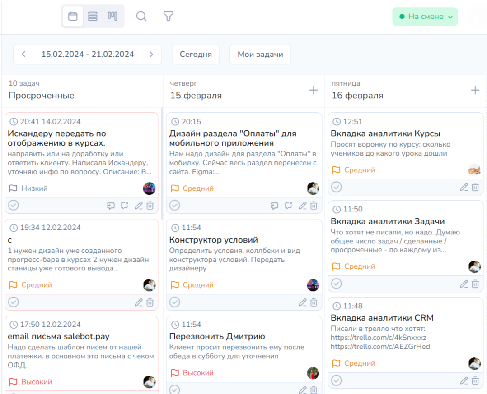<figcaption></figcaption></figure>

Однако при необходимости можно отобразить задачи в виде списка:

<figure><figcaption></figcaption></figure>


Выбор отображения задач в виде списка или календаря сохранится автоматически: вам не нужно каждый раз переключаться на удобный формат, также в последующем вы сможете выбрать удобный формат в любое время.



Редактировать просроченные задачи может сотрудник с ролью "Администратор" или сотрудник, у которого есть права на редактирование таких задач в кастомной роли.


Чтобы настроить редактирование задачи для других сотрудников, вам необходимо перейти в настройки сотрудника:

<figure>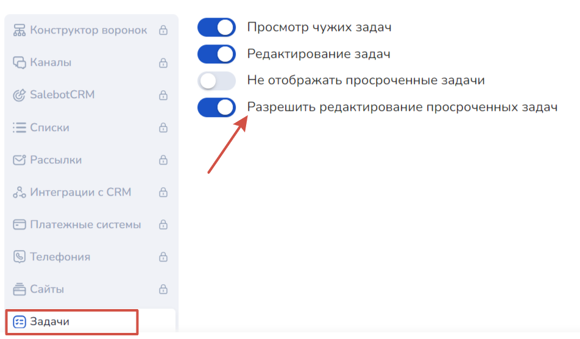<figcaption></figcaption></figure>

Далее активируйте необходимые чекбоксы для определенной роли или сотрудника.

### Создание и редактирование задач

Создать задачу можно как с привязкой к сделке, так и отдельно.

Привязанные к сделке задачи создаются в разделе SalebotCRM.

Чтобы создать задачу, нажмите на одноименную кнопку справка на экране, после чего откроется окно создания задачи:

<figure>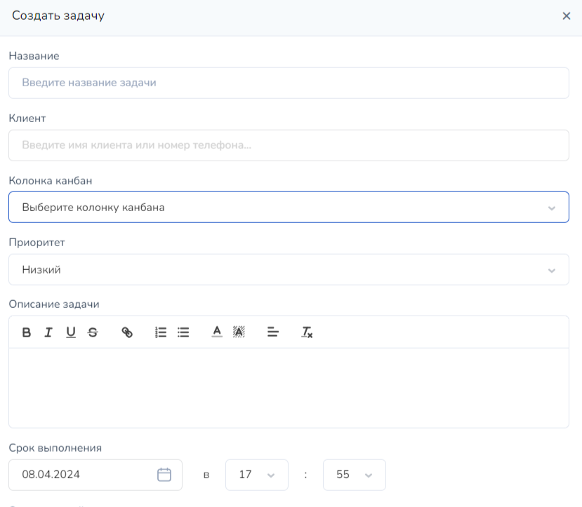<figcaption></figcaption></figure>

Также существует форма быстрого добавления задачи: для этого кликните на + напротив необходимой даты, где снизу откроется форма:

<figure>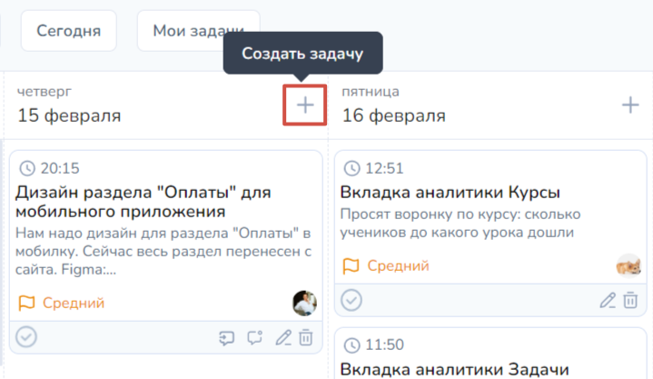<figcaption></figcaption></figure> <figure>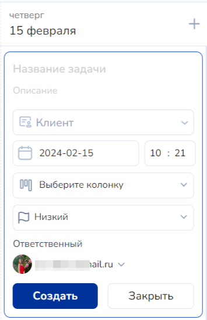<figcaption></figcaption></figure>

Где при нажатии на кнопку "+" откроется компактная форма добавления задачи со следующими полями:

1. Выбор клиента (для привязки задачи к определенному клиенту);
2. Дата и время истечения срока выполнения задачи;
3. Приоритет выполнения: низкий, средний, высокий.
4. Назначение ответственного сотрудника на выполнение задачи.&#x20;

В карточке клиента SalebotCRM можно увидеть сколько задач по клиенту было создано

<figure><figcaption>
Какрточка клиента SalebotCRM. Красный значок - задачи
</figcaption></figure>

В клиентах можно создать/удалить задачу и посмотреть перечень задач этого клиента.

<figure><figcaption>
Карточка Клиента - вкладка Задачи. Создание новой задачи
</figcaption></figure>

<figure><figcaption>
Карточка Клиента - вкладка Задачи
</figcaption></figure>

В меню проекта можно увидеть общее число незакрытых задач:

<figure><figcaption>
Меню проекта
</figcaption></figure>

Также создать задачу можно, не входя в диалог прямо в CRM-системе в воронке в списке имеющихся сделок с клиентами:

<figure>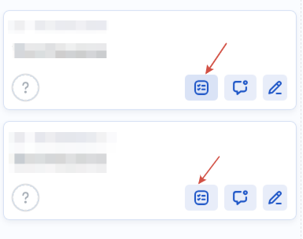<figcaption></figcaption></figure>

После нажатия на иконку задач откроется окно создания задач, аналогичное окну создания задачи в диалоге с клиентом:

В окне существуют поля для наименования задачи, постановки приоритета выполнения и даты; описания задачи, а также назначения ответственного сотрудника.

После создания задачи, просмотреть ее можно, нажав на иконку задачи:

<figure>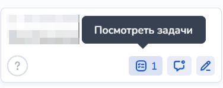<figcaption></figcaption></figure>

При нажатии на иконку, откроется диалоговое окно с клиентом с разделом задач:

<figure>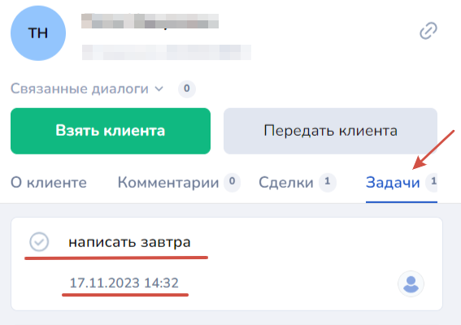<figcaption></figcaption></figure>

Здесь вы можете отредактировать задачу, завершить ее или вовсе удалить.&#x20;

<figure>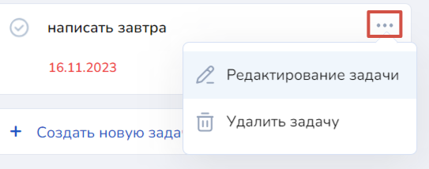<figcaption></figcaption></figure>

Для завершения задачи откройте окно редактирования, нажав на "Редактирование задачи".

В открывшемся окне редактирования можно перенастроить приоритет, изменить название, а также выбрать другого ответственного сотрудника.&#x20;

### Завершить задачу

Для завершения задачи необходимо кликнуть на галочку на плашке задачи:

<figure><figcaption></figcaption></figure>

После этого задача приобретет следующий вид:

<figure><figcaption></figcaption></figure>

## Канбан

Канбан - это одна из функций управления текущими делами, которая фокусируется на потоке работы и минимизации задержек. С помощью такой функции задачи можно распределить по определенным группам и отслеживать прогресс выполнения.

Канбан использует доски с карточками, на которых написаны задачи или этапы работы. Карточки перемещаются по доске в зависимости от стадии выполнения задачи. Например, карточка может начать на “Планировании”, перейти на “Выполнении” и затем на “Завершении”.

<figure>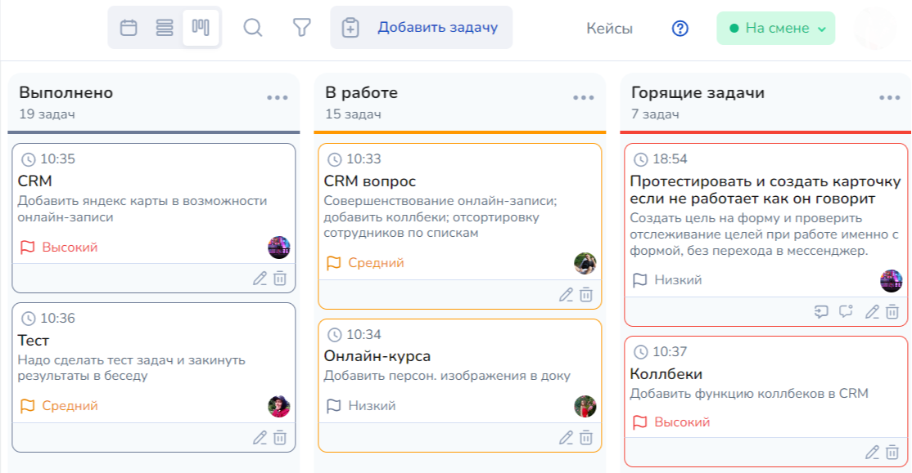<figcaption></figcaption></figure>

### Создание колонки и задач

Чтобы использовать функционал канбана, кликните и перейдите в соответствующий раздел:

<figure>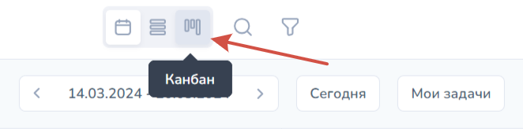<figcaption></figcaption></figure>

После чего откроется пустая вкладка с предложением создать первую колонку в разделе:

<figure>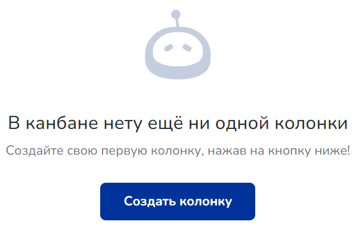<figcaption></figcaption></figure>

Кликнув на кнопку, откроется форма с полем для наименования колонки и выбором цвета колонки

<figure>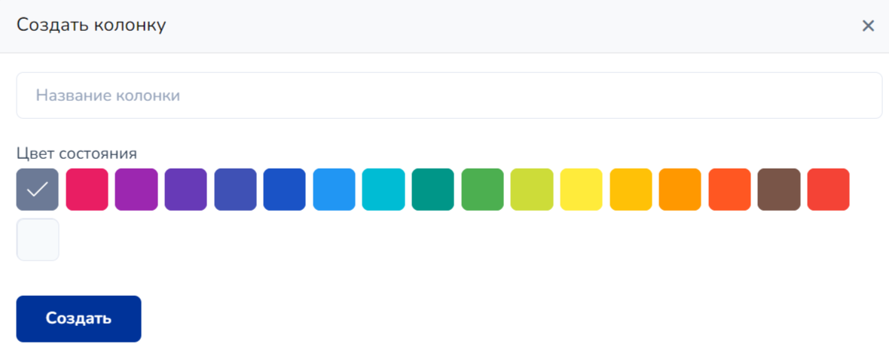<figcaption></figcaption></figure>

После того как вы прописали название колонки и, при необходимости выбрали цвет, колонка появится во вкладке канбан:

<figure>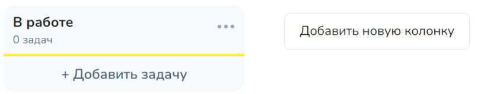<figcaption></figcaption></figure>

Можно добавлять любое необходимое количество колонок с помощью кнопки "Добавить новую колонку" (см. пример выше).&#x20;

Чтобы добавить в определенную колонку задачу, кликните по кнопке "+ Добавить задачу". Тогда откроется окошко быстрого добавления задачи:

<figure>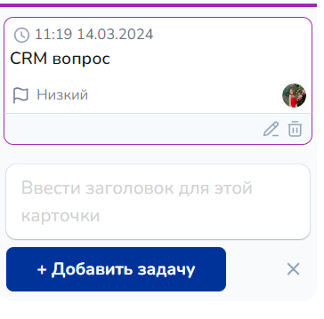<figcaption></figcaption></figure>

Также можно воспользоваться кнопкой на верхней панели для добавления задачи либо добавить  задачу в колонке уже под созданными задачами.

В открывшейся модальной форме существует:

1. Поле для названия задачи;
2. Привязка задачи к определенному клиенту;
3. Выбор колонки;
4. Приоритет выполнения;
5. Выбор срока выполнения;
6. Назначение ответственного сотрудника.&#x20;

<figure>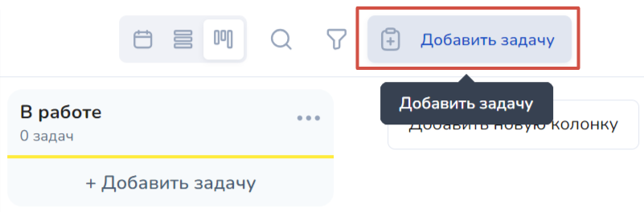<figcaption></figcaption></figure> <figure>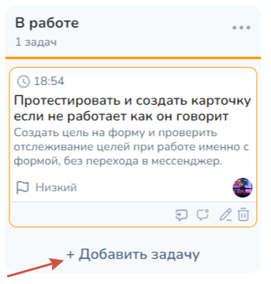<figcaption></figcaption></figure>

### Редактирование колонки и задач

Чтобы отредактировать колонку, воспользуйтесь меню дополнительных настроек, которое открывается при клике на данную кнопку:

<figure>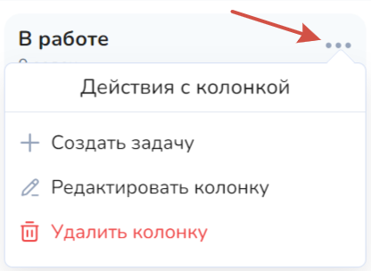<figcaption></figcaption></figure>

В выпадающем меню также можно создать задачу, отредактировать или удалить колонку.&#x20;

Стоит отметить, что при удалении колонки, задачи НЕ удаляются. Задачи переносятся из раздела "Канбан" на доску с календарем или списком с определенной датой:

<figure>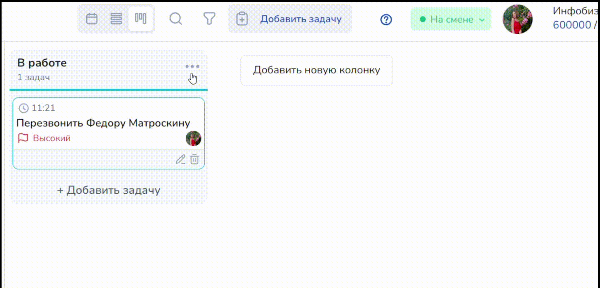<figcaption></figcaption></figure>

Любую задачу из доски календаря можно перенести в колонку канбана.&#x20;

Для этого достаточно перейти в настройки редактирования задачи и выбрать колонку, в которую хотите продублировать задачу:

<figure><figcaption></figcaption></figure>

Чтобы поменять местами колонки, достаточно кликнуть на шестеренку в верхнем меню, где откроется окно настроек:

<figure>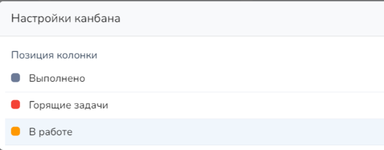<figcaption></figcaption></figure>

Далее зажмите левой кнопкой мыши необходимую колонку и перетяните ее в необходимое место.

### Вложения в задачах


Обращаем внимание!

Ограничение по вложениям:

1. Только фото- или видео-файлы;
2. Не более 10 вложений в одной задаче;
3. Размер каждого вложения не должен превышать 10 мб.


<figure><figcaption></figcaption></figure>

Чтобы добавить необходимое вложение внутри задачи, нажмите "Редактировать задачу":

<figure><figcaption></figcaption></figure>

Далее в открывшемся модальном окне найдите кнопку "Вложение":

<figure><figcaption></figcaption></figure>

Кликните на вложение и прогрузите необходимый файл (изображение или видео):

<figure><figcaption></figcaption></figure>

Дополнительно любое вложение можно добавить в описание вложения с помощью горячих клавиш.

Для начала выберите необходимое вложение и скопируйте его:

<figure><figcaption></figcaption></figure>

После чего перейдите в редактирование задачи канбана, куда необходимо внедрить вложение. \
Затем кликните на "Изменить" напротив описания:

<figure><figcaption></figcaption></figure>

Затем сочетанием горячих клавиш вставьте изображение (ctrl + V):

<figure><figcaption></figcaption></figure>

Чтобы удалить или загрузить изображение из задачи, воспользуйтесь одноименными кнопками внутри задачи:

<figure><figcaption></figcaption></figure>

## Коллбэки

### Функция коллбэк add\_new\_task\_from\_clients\_callback

При создании задачи, привязанной к определенному клиенту, в разделе "Клиенты" с ним в диалоге будет появляться сообщение с текстом: new\_task\_added\_callback task\_id:#{[task.id](https://vk.com/away.php?to=http%3A%2F%2Ftask.id\&post=-155867893_10927\&cc_key=)}, task\_name:#{[task.name](https://vk.com/away.php?to=http%3A%2F%2Ftask.name\&post=-155867893_10927\&cc_key=)}, где&#x20;

task\_id - это идентификатор задачи;

task\_name - это название задачи.

<figure>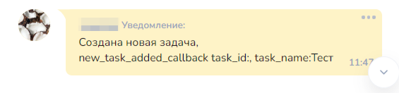<figcaption></figcaption></figure>

### Функция коллбэк edit\_task\_callback

При редактировании задачи, привязанной к определенному клиенту, в диалоге с клиентом будет появляться комментарий с текстом: "Задача была отредактирована #{current\_user.display\_name}: edit\_task\_callback task\_id:#{[task.id](https://vk.com/away.php?to=http%3A%2F%2Ftask.id\&post=-155867893_10927\&cc_key=)}, task\_name:#{[task.name](https://vk.com/away.php?to=http%3A%2F%2Ftask.name\&post=-155867893_10927\&cc_key=)}", где

task\_id - ID задачи;

task\_name - это название задачи.&#x20;

<figure>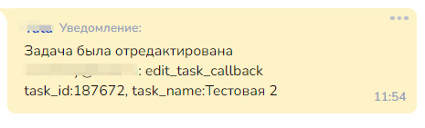<figcaption></figcaption></figure>
