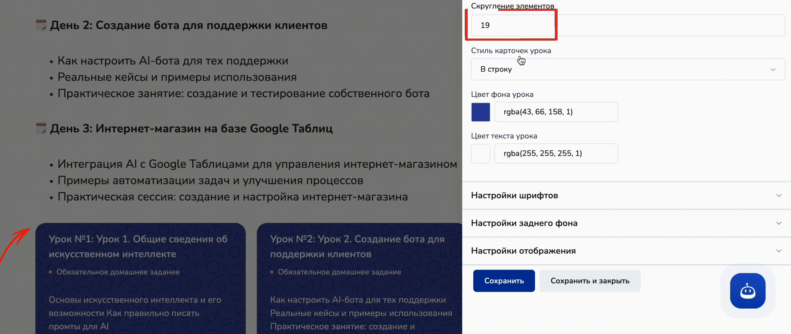

# Продажа курсов через сайт

Настройка оплаты по тарифу курса на минилендинге, созданном с помощью Salebot, поможет значительно упростить процесс покупки ваших знаний и управления финансовыми транзакциями.&#x20;

Создание простого и интуитивно понятного процесса оплаты позволяет вам предлагать курсы, не заботясь о технических аспектах внедрения платежной формы на ваш лендинг.

<figure><figcaption></figcaption></figure>

В этой статье мы расскажем, как быстро и без лишних сложностей настроить оплату по тарифу курса на вашем сайте.&#x20;


Обращаем внимание!

Перед созданием секции с формой записи на курс обязательно необходимо настроить тариф.

Как настроить тарифы в онлайн-курсах, рассказали [в одноименной статье](/broken/pages/-MF5l8zjW-wNPDw5IccK).


## Выбор платежной системы

Для покупок учениками курсов в чат-боте можно выбрать любой платежный сервис:

<figure><figcaption></figcaption></figure>


Интеграций с платежными серевисами в Salebot - большое количество.


Каждая платежная система имеет свои особенности подключения, описание и подробная инструкция которых существует в документации Salebot.&#x20;

Чтобы найти статью по выбранной платежной системе:

а) либо перейдите в раздел "[Эквайринг](../../platezhnye-sistemy/)" и изучите необходимую инструкцию для подключения:

<figure><figcaption></figcaption></figure>

б) либо кликните на "подключить" на плашке сервиса в разделе "Платежные системы" в настройках проекта:

<figure><figcaption></figcaption></figure>

После клика на необходимую кнопку, откроется окно модальной формы, где уже лежит ссылка на статью с выбранной вами платежной системой:

<figure><figcaption></figcaption></figure>

После подключения платежного сервиса, переходите в настройки курса.&#x20;


Напоминаем, что для дальнейшей настройки приема платежей Вам необходимо обязательно создать тарифы для курса.

Как настроить тарифы, читайте [в одноименной статье](../konstruktor-kursov/tarify-onlain-kursa.md).&#x20;


## Как создать сайт для курса

Перед началом работы подготовьте ваш сайт: для этого перейдите в соответствующий раздел:

<figure><figcaption></figcaption></figure>

Далее нажмите на "+ Создать":

<figure><figcaption></figcaption></figure>

Выберите тип сайта "Многостраничный сайт", "Лендинг" или "Форма":

<figure><figcaption></figcaption></figure>


О подробной настройке, как собрать сайт из секций в конструкторе, рассказано в разделе "[Сайты для бизнеса](/broken/pages/-M1L_fPpT9ptt_t1BNvt)".


Если у вас уже собран сайт на платформе Salebot, перейдите  в редктирование секций сайта, кликнув на карточку сайта:

<figure><figcaption></figcaption></figure>

### Многостраничный сайт

При создании многостраничного сайта автоматически создаются несколько страниц следующего типа:

1\) Главная страница;

2\) Наша команда;

3\) О нас.&#x20;

<figure><figcaption></figcaption></figure>

При этом генерируется шапка сайта и футер (подвал), в котором можно указать необходимую информацию о вашей компании. И шапка, и футер отображаются на каждой странице сайта для того, чтобы не создавать одинаковые блоки на каждой отдельной странице.

Чтобы перейти в режим редактирования любой страницы сайта, кликните по строке с нужной страницей:

<figure><figcaption></figcaption></figure>

Дополнительно можно создать еще страницы сайта. Для этого необходимо кликнуть одноименную кнопку и выбрать шаблон страницы, либо форму, либо загрузить страницу из файла:

<figure><figcaption></figcaption></figure>


Загрузка страницы из файла поможет перенести страницы сайта из другого проекта.&#x20;

Подробнее о том, как экспортировать и импортировать страницы сайта, рассказали ниже в разделе "[Экспорт / Импорт страницы сайта"](prodazha-kursov-cherez-sait.md#eksport-saita-import-stranicy).&#x20;


При клике на "Создать шаблон" откроется окно с выбором любого (в том числе пустого) шаблона страницы сайта:

<figure><figcaption></figcaption></figure>

### Лендинг (форма, опросы и квизы)

При клике на создать "Лендинг" откроется форма с выбором шаблонов сайта:

<figure><figcaption></figcaption></figure>

Вы можете выбрать любой понравившийся шаблон сайта, при этом в режиме редактирования изменить его различные настройки: шрифты, фон, изображения, добавить свои нужные блоки (секции) сайта и многое другое.

В отличие от многостраничного сайта, при создании лендинга, вы сразу перейдете в режим редактирования страницы.&#x20;

В последующем при клике на плашку лендинга

<figure><figcaption></figcaption></figure>

вас будет переносить в раздел заявок, основной информации и настроек лендинга, при этом не будет отображаться множество страниц, как в многостраничном сайте, поскольку у лендинга страница только одна:

<figure><figcaption></figcaption></figure>

Если вдруг вам понадобится добавить еще несколько страниц в лендинг, сделав его тем самым многостраничным сайтом, то перейдите в настройки сайта и поменяйте тип сайта на "Многостраничный сайт" и сохраните настройки:

<figure><figcaption></figcaption></figure>

Аналогично отображается сайт в виде формы, опроса и квиза, однако при создании таких сайтов, вам не предлагается шаблон, поскольку в страницу сразу вставляется блок "Форма" или "Квиз" (в зависимости от выбранного типа сайта":

<figure><figcaption>
Создание типа сайта "Форма"
</figcaption></figure>

Как видно из примера, чтобы перейти в настройки сайта типа "Форма", необходимо кликнуть на кнопку "Редактировать".

Тогда вы перейдете в режим редактирования страницы, в которой создана одна секция "Форма" (или квизы и постраничные опросы в зависимости от выбранного типа сайта).


В сайт (многостраничный и лендинг) можно добавлять секции "Форма", "Квиз" и "Опросы" в любое время.



Для дальнейшей настройки перейдите в режим редактирования сайта.


## Секция "Форма" для записи на курс

Независимо от того, какой тип сайта вы создали "Многостраничный сайт", "Лендинг" или "Форма", режим редактирования страницы будет идентичен.

<figure><figcaption></figcaption></figure>

Чтобы создать секцию "Форма" для записи на курсы (как и любую другую секцию в конструкторе сайтов), необходимо навести на секцию, после которой вы расположите форму оплаты, чтобы появилась кнопка "+" для открытия меню с секциями:

<figure><figcaption></figcaption></figure>

Далее в открывшемся меню найдите секцию "Форма:

<figure><figcaption></figcaption></figure>

И далее кликните по "Форме", чтобы секция добавилась на ваш сайт:

<figure><figcaption></figcaption></figure>

Теперь перейдем к настройкам формы:

<figure><figcaption></figcaption></figure>

Здесь необходимо активировать чекбокс "Форма для регистрации ученика на курс":

<figure><figcaption></figcaption></figure>

Именно данный чекбокс открывает дальнейшие настройки по оплатам для курса:

1. Выберите курс, для которого необходимо создать форму на сайте:

<figure><figcaption></figcaption></figure>

2. Выбор тарифа:

<figure><figcaption></figcaption></figure>

Данное поле является одним из основных для оплат тарифов курса, поскольку здесь вы выбираете, для какого тарифа (или всех тарифов) будет работать форма на сайте.

3. Подсказка в форме:

<figure><figcaption></figcaption></figure>

Вы можете оставить текст подсказки, существующий по умолчанию, либо прописать собственный:

<figure><figcaption></figcaption></figure> <figure><figcaption></figcaption></figure>

Также если вы не хотите, чтобы подсказка отображась в форме записи/оплаты на курс, то воспользуйтесь чекбоксом "Скрыть подсказку":

<figure><figcaption></figcaption></figure>

### Вопросы формы

При создании формы в обязательном порядке необходимо создать вопросы для ввода клиентом email, телефона и имени.&#x20;

Чтобы создать поле для ввода данных вашим пользователем, кликните по кнопке "Создать вопрос":

<figure><figcaption></figcaption></figure>

Далее вам откроется следующая форма заполнения вопроса:

<figure><figcaption></figcaption></figure>

Необходимо выбрать в выпадающем списке тип поля "Имя":

<figure><figcaption></figcaption></figure>

И активировать чекбокс "Обязательный вопрос":

<figure><figcaption></figcaption></figure>

Далее создайте второй вопрос:

<figure><figcaption></figcaption></figure>

Во втором вопросе укажите тип поля "Email":

<figure><figcaption></figcaption></figure>

Данный вопрос также должен быть обязательным, иначе ученик не сможет получить доступ к вашему курсу и пройти автоматическую регистрацию:

<figure><figcaption></figcaption></figure>

Аналогично добавьте следующий вопрос с типом поля "Номер телефона":

<figure><figcaption></figcaption></figure>

Теперь ваша основная настройка формы записи и оплаты на курс завершена.&#x20;


Далее вы можете кастомизировать секцию по своему усмотрению: поменять цвет фона, кнопок, а также добавить иные поля вопросов.&#x20;

О кастомизации и обо всех возможностях секции "Форма", читайте в разделе "[Ответы форм](/broken/pages/YOzidl4HYJaWmkPXnuYY)".


### Тестирование

После настройки формы оплат и записи на курс, обязательно сохраните настройки сайта:

<figure><figcaption></figcaption></figure>

Далее перейдите в предпросмотр сайта:

<figure><figcaption></figcaption></figure>

И на сайте вы увидите форму записи/оплаты на курс:

<figure><figcaption></figcaption></figure>

Протестируем форму, заполнив свои данные в пустых полях:

<figure><figcaption></figcaption></figure>

Теперь отправляем данные в систему и переходим в форму заявки и оплаты:

<figure><figcaption></figcaption></figure>

Форма отработалась корректно: перенаправила клиента на страницу с обработкой заказа, а далее уже открылось окно с формой оплаты через выбранную платежный сервис.

## Секция "Карточки курсов"

С помощью секции "Карточки курсов" вы сможете оставлять на сайте информацию о доступных в вашей школе курсах:

<figure><figcaption></figcaption></figure>

Чтобы добавить секцию "Карточки курса", нажмите на "+" в режиме редактирования вашего сайта:

<figure><figcaption></figcaption></figure>

Далее найдите в открывшемся меню секцию "Карточки курса" и кликните на него, чтобы секция добавилась на сайт:&#x20;

<figure><figcaption></figcaption></figure>

Секция будет добавлена на сайт, а для вас откроется меню настроек контента:

<figure><figcaption></figcaption></figure>

### Контент блока

Настройка контента блока "Карточки курса" состоит из выбора курса (курсов), который уже создан в проекте, для отображения на сайте и кастомизации элементов карточек. &#x20;


Как создавать курсы на платформе Сейлбот, рассказали в разделе "[Онлайн-курсы](/broken/pages/xxhyRoDRQWHFEHLWrrdC)"


### Выбор курса

Выберите курсы, которые бы вы хотели продемонстрировать на своем сайте:

<figure><figcaption></figcaption></figure>

Для этого проставьте галочки на строке с названием необходимого курса:

<figure><figcaption></figcaption></figure>

В свою очередь, выбранные курсы тут же отобразятся на странице вашего сайта с обложкой, которую вы установили в настройках курса.&#x20;

### Кастомизация

После того как вы выбрали необходимые курсы, переходите к кастомизации элементов карточки:

<figure><figcaption></figcaption></figure>

1. **Тень**

<figure><figcaption></figcaption></figure>

Для карточек курса в секции можно настроить интенсивность тени:

а) без тени:

<figure><figcaption></figcaption></figure>

б) легкая тень:

<figure><figcaption></figcaption></figure>

в) сильная тень:&#x20;

<figure><figcaption></figcaption></figure>

2. **Цветовая палитра для элементов карточки**

<figure><figcaption></figcaption></figure>

Изменить цвета в карточке можно для фона, текста (как на самой карточке, так и в кнопках), а также добавить интерактивности карточкам, изменив цвета элементов при наведении на них курсором:&#x20;

<figure><figcaption></figcaption></figure>

а) цвет текста: поможет изменить основной цвет текста в карточке (кроме кнопки):

<figure><figcaption></figcaption></figure>

б) фон карточки: для изменения цветового решения фона для карточки:

<figure><figcaption></figcaption></figure>

в) цвет обводки: для изменения цветового решения рамок карточек:

<figure><figcaption></figcaption></figure>

г) текст кнопки: для изменения цвета только текста кнопки в статичном состоянии:

<figure><figcaption></figcaption></figure>

д) фон кнопки: поможет изменить фоновый цвет для кнопки карточки курса:

<figure><figcaption></figcaption></figure>

Для динамичности сайта также можно изменить цвета кнопки при наведении курсора. Для этого можно воспользоваться настройками цвета при наведении:

<figure><figcaption></figcaption></figure>


Теперь вы знаете, как отображать имеющиеся курсы в Сейлбот на вашем сайте с помощью секции "Карточки курса".&#x20;



О настройках фона и отображения читайте в статье "[Универсальные настройки секций](/broken/pages/oX6Y9RGmKT74x44vZ8gr)".&#x20;


## Секция "Списки уроков"

Вместе с карточками онлайн-курса вы можете добавить на страницу сайта и списки уроков: достаточно выбрать в секции необходимый курс и все уроки отобразятся:

<figure><figcaption></figcaption></figure>

Чтобы добавить блок для отображения списка уроков курса, перейдите в режим редактирования сайта и наведите на рабочее пространство, а затем нажмите на "+":

<figure><figcaption></figcaption></figure>

Справа откроется меню с доступными секциями сайта, где необходимо найти блок "Списки уроков":

<figure><figcaption></figcaption></figure>

Кликните по "Карточкам курсов", после чего откроется меню для настройки контента блока:

<figure><figcaption></figcaption></figure>

Вам достаточно выбрать необходимый курс, который уже создан в Сейлботе, в выпадающем меню и кликнуть на "Сохранить".&#x20;

Далее перейдите в настройки для кастомизации контента блока:

<figure><figcaption></figcaption></figure>

### Кастомизация

При клике по кнопке "Настройки" при наведении на секцию, открываются настройки для кастомизации контента и самого блока:

<figure><figcaption></figcaption></figure>

#### Какие настройки доступны:

1. Стиль списка уроков

<figure><figcaption></figcaption></figure>

По умолчанию стиль списка уроков отображается в новом формате, при необходимости можно установить более лаконичный вариант классического формата:

<figure><figcaption>
Новый стиль
</figcaption></figure> <figure><figcaption>
Классический стиль
</figcaption></figure>

2. Стиль нумерации

<figure><figcaption></figcaption></figure>

Стиль нумерации доступен для нового стиля отображения уроков курса, нумерация изменяется в самой карточке урока:

<figure><figcaption></figcaption></figure>

3. Иконки урока

<figure><figcaption></figcaption></figure>


**Отображаются, если вы добавили превью внутри самого урока в настройках курса.**&#x20;


#### Как добавить иконки?

Шаг 1. Перейдите в настройки урока:

Для этого зайдите в режим настройки курса и найдите вкладку "Уроки":

<figure><figcaption></figcaption></figure>

Далее нажмите на "Редактировать", после чего откроется страница урока для редактирования.

Шаг 2. Откройте настройки страницы урока.&#x20;

<figure><figcaption></figcaption></figure>

Перейдите в настройках страницы урока в раздел "Основная информация":

<figure><figcaption></figcaption></figure>

Шаг 3. Загрузка превью урока

Раскройте в настройках основной информации список с настройкой изображений:

<figure><figcaption></figcaption></figure>

Загрузите изображение для превью урока:

<figure><figcaption></figcaption></figure>

Сохраните настройки:

<figure><figcaption></figcaption></figure>


Готово! Теперь превью урока будут отображаться в виде иконок в секции "Списки уроков" на сайте.


<figure><figcaption></figcaption></figure>

4. Фоновый узор

<figure><figcaption></figcaption></figure>

Добавит объема и уникальности для карточек ваших уроков:

<figure><figcaption></figcaption></figure>

5. Скругление элементов

<figure><figcaption></figcaption></figure>

Значение задается в пикселях, скругляет углы карточек уроков:

<figure><figcaption></figcaption></figure>

6. Стиль карточек уроков

<figure><figcaption></figcaption></figure>

Помогает расположить карточки уроков в одну строку или в ряд с переносом или без.&#x20;

7. Цвет фона и текста

<figure><figcaption></figcaption></figure>

В распоряжении обширная цветовая палитра, чтобы задать цвет фона карточки и цвет шрифта на карточке урока:

<figure><figcaption></figcaption></figure>


Теперь вы знаете, как добавить списки уроков на свой сайт и кастомизировать контент секции.&#x20;



О настройках фона и отображения читайте в статье "[Универсальные настройки секций](/broken/pages/3znyClBeT2ARaTjeA1OU)".&#x20;

