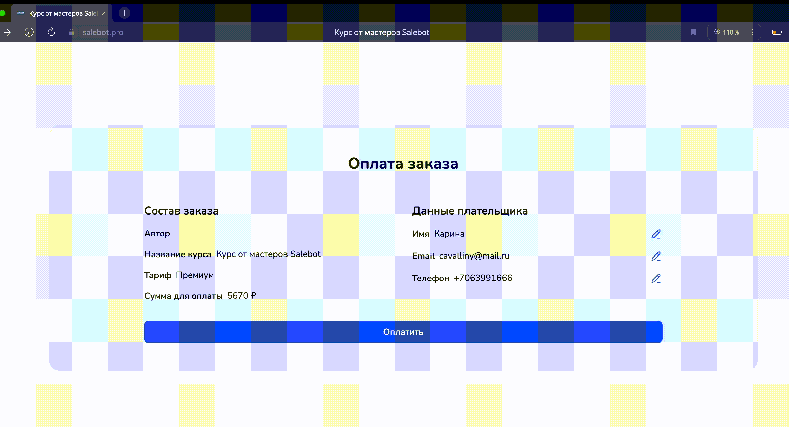

# Продажа курсов на промо-странице

Интеграция платежных сервисов с Salebot позволяет проводить продажи ваших курсов прямо на _**промо-странице**_\*, что существенно упрощает процесс оплат и записи на курс для пользователей (клиентов).&#x20;


\*Что такое **промо-страница?**&#x20;

Это страница с информацией о вашем курсе, на которой отображаются уроки, тарифы, ссылки на мессенджеры и пр.

Промо-страница курса настраивается в разделе "[Общие настройки](../konstruktor-kursov/sozdanie-onlain-kursa.md#obshie)"

Промо-страница выглядит так:



В этой статье мы рассмотрим технические аспекты настройки продаж на странице курса, а именно:&#x20;

1. Покажем, где подключать платежные сервисы для приема платежей;
2. Покажем путь клиента при оплате и регистрации в качестве учеников на ваш курс.

## Выбор платежной системы

Для подключения необходимого сервиса перейдите в соответствующий раздел "Платежные системы", находящийся в настройках проекта:

<figure><figcaption></figcaption></figure>

Далее подключите любую платежную систему, например, в которой у вас уже есть настроенный магазин:

<figure><figcaption></figcaption></figure>

Каждая платежная система имеет свои особенности подключения, описание и подробная инструкция которых существует [в документации Salebot. ](../../platezhnye-sistemy/)

Например, можно перейти в документацию прямо из раздела "Эквайринг" в проекте. Для этого нажмите на любую необходимую платежную систему:

<figure><figcaption></figcaption></figure>

После клика на необходимую кнопку, откроется окно модальной формы, где уже лежит ссылка на статью с выбранной вами платежной системой:

<figure><figcaption></figcaption></figure>

После подключения платежного сервиса, переходите в настройки курса.&#x20;

Создание онлайн-курса предполагает ваши личные затраты ресурсов на структурирование информации, ее дизайн, подачу, а также на иные технические настройки.&#x20;

Для получения необходимой и соразмерной оплаты за Ваши знания от учеников существует настройка тарифов и приема платежей как на странице курса, так и через чат-бота. &#x20;


Для дальнейшей настройки приема платежей Вам необходимо обязательно создать тарифы для курса.

Как настроить тарифы, читайте [в одноименной статье](../konstruktor-kursov/tarify-onlain-kursa.md).&#x20;


### Настройки оплат

Чтобы получать оплаты в курсе, необходимо перейти в "Настройки курса" -> "Оплаты":

<figure><figcaption></figcaption></figure>

<figure><figcaption></figcaption></figure>

Далее выберите необходимый платежный сервис и сохраните настройки:

<figure><figcaption></figcaption></figure>

Также в разделе "Оплата" можно добавить галочки с полями на согласие клиентов об обработке персональных данных, на рекламные рассылки и т.п.:

<figure><figcaption></figcaption></figure>

## Оплата на странице курса


Обращаем внимание!

Рекомендуем перейти к настройке тарифов, если вы еще этого не сделали.&#x20;

Как настроить тариф в онлайн-курсах, читайте в[ одноименной статье.](../konstruktor-kursov/tarify-onlain-kursa.md)


Чтобы ученику вашего курса купить любой тариф, ему достаточно перейти на страницу курса:

<figure><figcaption>
Светлая тема (можно выбрать в настройках курса)
</figcaption></figure>

На странице ваш пользователь сможет ознакомиться с программой курса, с доступными на каждом тарифе уроками, а также с расценками на тарифы.&#x20;

Чтобы купить ваш курс, пользователю достаточно кликнуть на кнопку "Купить курс" напротив выбранного им тарифа:

<figure><figcaption>
Темная тема (можно выбрать в настройках курса)
</figcaption></figure>

Далее клиент автоматически перейдет на страницу с формой оформления заказа, где ему необходимо будет указать свои данные:

<figure><figcaption></figcaption></figure>


Данная форма оформления заказа поможет зарегистрировать вашего пользователя после оплаты и направит ему на почту письмо с доступом к курсу.


После заполнения формы оформления заказа, ваш клиент при клике на "Перейти к оплате" перейдет к странице заказа, где он сможет убедиться в правильности заполненных данных, а также исправить какие-либо опечатки при наличии:

<figure><figcaption></figcaption></figure>

Чтобы исправить опечатку в имени, email или номере телефона, пользователю достаточно нажать на карандашик, расположенный напротив соответствующего поля:

<figure><figcaption></figcaption></figure>

После того как пользователь убедится в правильности вводимых данных, ему останется оплатить свой заказ:

<figure><figcaption></figcaption></figure>

Клиент будет оплачивать заказ на официальной странице платежного сервиса, что значительно повысит доверие ваших клиентов при осуществлении платежей.&#x20;


Таким образом, настройка продаж и платежей онлайн-курсов на промо-странице не представляет из себя сложности.&#x20;

Вам достаточно выставить ценовой диапазон тарифов курсов, выбрать необходимую платежную систему, а регистрацию и оплату за вас уже настроили разработчики Salebot.&#x20;

