# Чат

<figure><figcaption></figcaption></figure>


Важно!&#x20;

Чат-бот также будет работать через онлайн-чат.

Можно создать интересную схему с использованием [AI-ассистента ](/broken/pages/8a6l5HcDWyUuisBGtv1J)для ответов на вопросы учеников.


## Онлайн-чат для курса&#x20;

Чтобы создать чат с учениками зайдите в настройки курса и перейдите во вкладку Чат :

<figure><figcaption></figcaption></figure>

Нажмите на кнопку "Создать", чтобы создать онлайн-чат для учеников, который будет отображаться ученикам при прохождении курса.

Установив Онлайн-чат на сайт, вы сможете собирать данные о клиентах, автоматизировать общение с ними на сайте или организовать работу отдела продаж, подключая менеджеров к диалогам с клиентами. Вести диалоги с клиентами можно как из интерфейса Salebot на сайте, так и в нашем мобильном приложении для Android и iOS.

### Оформление

<figure><figcaption></figcaption></figure>

#### Заголовок чата

В этом поле прописывается наименование для онлайн-чата - самое верхнее поле.&#x20;

<figure><figcaption></figcaption></figure>

#### Подзаголовок чата

Это поле находится ниже, чем заголовок чата, и позволяет Вам уточнить роль онлайн-чата на вашем ресурсе.&#x20;

<figure><figcaption></figcaption></figure>

#### Надпись на кнопке виджета

<figure><figcaption></figcaption></figure>

Надпись на кнопке виджета отображается при свернутом состоянии онлайн-чата.&#x20;

<figure><figcaption></figcaption></figure>

По умолчанию отображается текст из полей заголовка и подзаголовка: можно установить другую надпись при необходимости.&#x20;

#### Приветственное сообщение в чате

<figure><figcaption></figcaption></figure>

В этом поле заполняется текст предварительного сообщения в онлайн-чате:

<figure><figcaption></figcaption></figure>

#### Ориентация текста

С помощью панели ориентации текста можно выравнивать заголовок и подзаголовок онлайн-чата относительно правого, левого края или центра по аналогии с любыми текстовыми редакторами:

<figure><figcaption></figcaption></figure>

#### Кнопка чата

Эта кнопка предназначена для открытия онлайн-чата при клике на нее.&#x20;

Можно выбрать, как будет выглядеть кнопка онлайн-чата на разных устройствах: веб-версия сайта и мобильная версия сайта (если использовать адаптивную версию кнопки).

<figure><figcaption></figcaption></figure>

1. Круглая кнопка

<figure><figcaption></figcaption></figure>

2. Классическая:

<figure><figcaption></figcaption></figure>

3. **Адаптивная:** кнопка будет круглой на маленьких экранах (смартфоны, планшеты) и классической на больших экранах (пк и ноутбуки).
4. Компактная:

<figure><figcaption></figcaption></figure>

Расположить кнопку можно по правому или левому краю:

<figure><figcaption></figcaption></figure>

#### Цветовая палитра

Для оформления онлайн-чата по своему вкусу можно применить не только настройки цвета, но и также отобразить интересные узоры на фоне чата и хедера:

<figure><figcaption></figcaption></figure>

Можно выбрать цвет и яркость узоров, а также иных элементов онлайн-чата. Для этого активируйте чекбокс "Расширенные настройки:

<figure><figcaption></figcaption></figure>

Также можно установить иные расширенные настройки цветового отображения для онлайн-чата.&#x20;

Например, для хедера можно выбрать градиентную заливку:

<figure>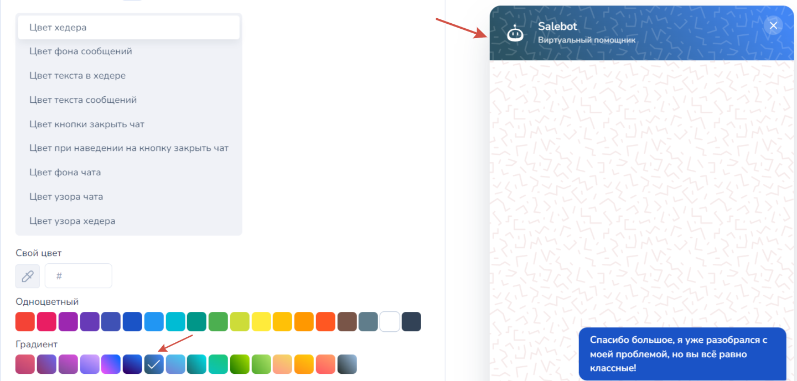<figcaption></figcaption></figure>

#### Аватар онлайн-чата

С помощью него можно поменять аватар помощника в онлайн-чате. Аватар может быть добавлен как ссылкой, так и загружен файлом.&#x20;

<figure><figcaption></figcaption></figure>

Также в случае необходимости, можно не отображать аватар чата с помощью одноименного чекбокса

#### Логотип

В настройках можно отображать логотип Salebot:

<figure><figcaption></figcaption></figure>

### Настройки

<figure><figcaption></figcaption></figure>

#### **Надпись внутри поля ввода**

В этом поле по умолчанию установлен следующий текст - "Введите сообщение и нажмите Enter".&#x20;

Вы можете самостоятельно указать свое значение или оставить по умолчанию.

<figure><figcaption></figcaption></figure>

#### **Надпись в мобильной версии**&#x20;

По умолчанию установлен текст "Выберите удобный способ связи"

<figure><figcaption></figcaption></figure>

#### **Сообщение при назначении ученику оператора**

Если вставить в поле #{operatorName}, то будет показано имя оператора, указанное в разделе Сотрудники. Назначить оператора можно вручную: кликнуть в диалоге с клиентом кнопку "Взять клиента" или "Передать клиента". Или настроить автораспределение клиентов между операторами в разделе Сотрудники.&#x20;

<figure><figcaption></figcaption></figure>

#### **Сообщение при отсутствии операторов в сети**

По умолчанию будет высвечивать следующее сообщение: "На данный момент операторов нет в сети. Оставьте нам сообщение и мы обязательно вам ответим в ближайшее время"&#x20;

<figure><figcaption></figcaption></figure>

Статус "В сети" бот получает из раздела "Сотрудники". Возможные статусы: В сети, Перерыв, Отсутствует.

<figure>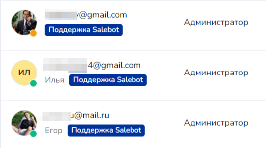<figcaption></figcaption></figure>

Сменить свой статус также можно в верхней строке, находясь в любом разделе проекта.

Пример данного сообщения в онлайн-чате:

<figure>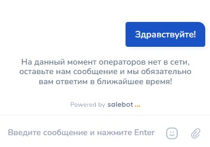<figcaption></figcaption></figure>

#### Язык в чате

Можно выбрать русский или английский язык для служебных сообщений в чате, которые установлены по умолчанию

<figure><figcaption></figcaption></figure>

Пример сообщений по умолчанию из поля "Сообщение, когда операторов нет в сети" и "Сообщение, когда клиенту назначается оператор при включенном" при включенном английском языке в настройках онлайн-чата :

<figure><figcaption></figcaption></figure>

#### **Звуковые уведомления в чате.**&#x20;

Данные настройки позволяют включить/выключить звуковые уведомления открытия чата и о новых сообщениях в онлайн-чате для клиентов на сайте:

<figure><figcaption></figcaption></figure>

#### **Отображение мессенджеров**&#x20;

Можно выбрать какие мессенджеры будут отображаться на сайте при наведении курсора на виджет (значок) онлайн-чата.


Кнопки мессенджеров появятся только после того, как эти мессенджеры будут подключены к конструктору.


<figure><figcaption></figcaption></figure>

#### **Ползунок Отображать только мессенджеры.**&#x20;

Если включить данный переключатель, то на сайте появятся только кнопки мессенджеров. Остальные функции онлайн-чата будут отключены.&#x20;

<figure><figcaption></figcaption></figure>

Пример отображения кнопок при включенном ползунке **Отображать только мессенджеры**

<figure><figcaption></figcaption></figure>

При неактивном положении "Отображать только мессенджеры" вид онлайн-чата будет таким:

1. При наведении на кнопку онлайн-чата будут всплывать кнопки на мессенджеры:

<figure><figcaption></figcaption></figure>

2. При клике на кнопку онлайн-чата, откроется окно на странице урока, чтобы написать куратору, не переходя в другой мессенджер:

<figure><figcaption></figcaption></figure>

#### **Надпись к мессенджерам**

По умолчанию "Написать в"&#x20;

<figure><figcaption></figcaption></figure>

#### **Начальное сообщение в Whatsapp**&#x20;

Этот текст будет записан в поле ввода у пользователя в приложении Whatsapp при переходе по кнопке с сайта. Ему будет достаточно нажать "Отправить". Так же прописывайте этот текст в условии стартового блока цепочки сообщений.

<figure><figcaption></figcaption></figure>

#### **Свои ссылки**

<figure><figcaption></figcaption></figure>

В онлайн-чате существует возможность, помимо кнопок мессенджеров, выводить свои кнопки с ссылками.

<figure><figcaption></figcaption></figure>

В настройках можно указать url ссылки и добавить изображение:

<figure><figcaption></figcaption></figure>

&#x20;**Загрузка файлов**

Данная настройка даёт возможность получать вложения от клиентов сайта, например, изображения.&#x20;

<figure><figcaption></figcaption></figure>


Ограничения на размер входящего файла через онлайн-чат : 20 МВ


#### **Данные пользователя**

В первом сообщении можно получить согласие на обработку персональных данных и/или собрать данные пользователя, используя форму для сбора данных, а также задать или изменить почту через приветственное окно. Заполнение формы можно пропустить или сделать обязательной, включив ползунок _Сделать заполнение формы обязательным._

<figure>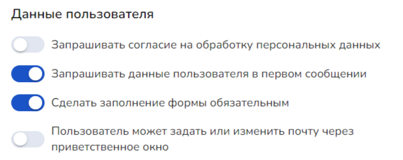<figcaption></figcaption></figure>

Пример первого сообщения со сбором данных:

<figure>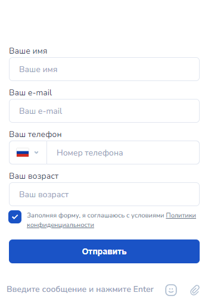<figcaption></figcaption></figure>

После настройки формы существует поле с выпадающим списком для выбора отображения настроек страны:

<figure><figcaption></figcaption></figure>

#### Запрос на звонок

Чекбокс "Запрос на звонок" отображается в настройках онлайн-чата, если в проекте подключена Телефония.&#x20;

<figure><figcaption></figcaption></figure>

_Принцип работы:_

При заполнении формы пользователь может поставить галочку на запрос обратного звонка, тогда автоматически будет выбран один из сотрудников, у кого подключена телефония и будет совершен звонок клиенту.


Сотрудник назначается автоматически. При выборе сотрудника проверяется\
\- статус "На смене"\
\- любая роль, в т.ч. администратор\
\- у сотрудника подключена(настроена) телефония

После звонка этот сотрудник будет назначен ответственным этому пользователю.


#### **Запрашивать разрешение на обработку персональных данных** &#x20;

Данный параметр по умолчанию отключен. При включенном ползунке при первом запуске онлайн-чата появится сообщение Даю согласие на обработку персональных данных  и кнопка **`Подтвердить`**

<figure><figcaption>
Настройка онлайн-чата
</figcaption></figure>

Пример первого сообщения для получения разрешения на обработку персональных данных:

<figure>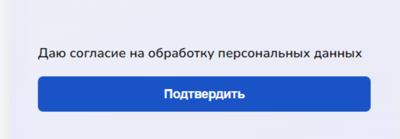<figcaption></figcaption></figure>

#### Настройка начальных кнопок

<figure><figcaption></figcaption></figure>

При клике по кнопке _**Добавить кнопку**_ откроется форма создания начальной кнопки:&#x20;

<figure><figcaption></figcaption></figure>

Кнопка может иметь одну из функций:

1. **Ссылка:** позволяет добавить ссылку для перехода на другую страницу сайта или сторонний веб-ресурс.

<figure>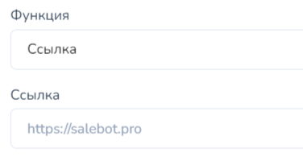<figcaption></figcaption></figure>

2. Почта: клиент будет перенаправлен на почтовый сервис, чтобы написать письмо на почту, указанную в настройках кнопки:

<figure>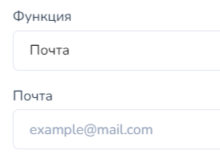<figcaption></figcaption></figure>

3. Телефон: запустится приложение для звонков. Или будет предложено выбрать с помощью какого приложения позвонить. Зависит от устройства, на котором пользователь (клиент) переходит по этой кнопке. Вызов будет на номер, указанный в настройках кнопки

<figure>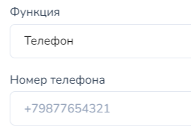<figcaption></figcaption></figure>

4. Сообщение (от администратора / пользователя) данная функция позволяет делать быстрые ответы от бота при клике на кнопку. \
   Например, можно сделать кнопку с названием Адрес, а в поле Сообщение указать точный адрес и время работы офиса.

<figure>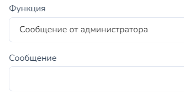<figcaption></figcaption></figure> <figure>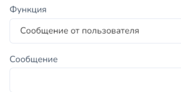<figcaption></figcaption></figure>


Текст в поле "Сообщение" будет без переноса строк. Учитывайте этот момент в работе.


**Обработка клиентов с разных доменов.** Эта настройка позволяет разделить диалоги, если один и тот же человек пишет в онлайн-чат, размещенный на разных доменах. По умолчанию это один и тот же диалог.

<figure>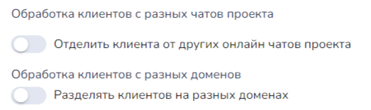<figcaption></figcaption></figure>

Данный переключатель необходим, если разные онлайн-чаты установлены на разных сайтах на одном домене, и нужно разделить диалоги, когда пишет один и тот же человек&#x20;

> Например:&#x20;
>
> https://salebot.site/page1/&#x20;
>
> https://salebot.site/page2/

**Кнопки в тексте будут отображаться в истории онлайн чата (Переключатель).** Включите его, чтобы кнопки в тексте из конструктора воронок отображались в истории онлайн -чата с клиентом

<figure><figcaption></figcaption></figure>

#### **Скрыть онлайн-чат**

Необязательно удалять онлайн чат с сайта. Емо можно просто скрыть с помощью соответствующего переключателя:

<figure><figcaption></figcaption></figure>

### Автоматические действия

Принцип работы автоматических действий следующий: для того чтобы автоматическое действие сработало, необходимо установить определенный триггер для данного действия - условие.&#x20;

<figure><figcaption></figcaption></figure>

Сначала устанавливаем условия, в какой момент должно выполниться настраиваемое действие. Можно добавлять условия в зависимости от времени дня, страны посетителя, города, URL текущей страницы и т.п.&#x20;

Подробнее об условиях:

1. **Время дня**. Выставьте автоматическое срабатывание онлайн-чата в зависимости от того, в какой промежуток клиент взаимодействует с онлайн-чатом (например, в счастливые часы после 16:00 при посещении вашего лендинга клиент может получить скидку).

<figure>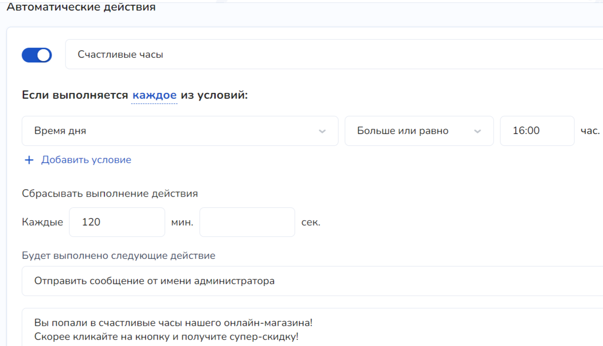<figcaption>
Пример условия (время дня) и автоматического действия (сообщение от им. администратора)
</figcaption></figure>

2. **Выполнить это действие только один раз за день для пользователя.** Данное условие может быть применено в различных случаях: например, для направления партнерских или иных ссылок в сообщении от имени администратора/пользователя (как доступ к новым материалам курса); для накопительной системы и т.п.:

<figure>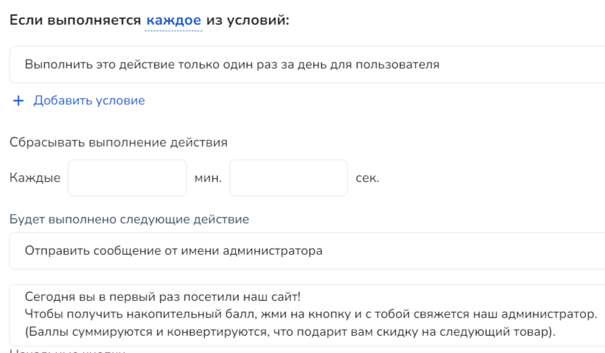<figcaption></figcaption></figure>

3. **Город посетителя. Страна посетителя.** Выставив данное условие, можно установить необходимый круг пользователей, которым бы была полезна ваша предоставляемая услуга, если, например, необходимо для покупки товара (услуги) личное присутствие клиента.&#x20;

<figure>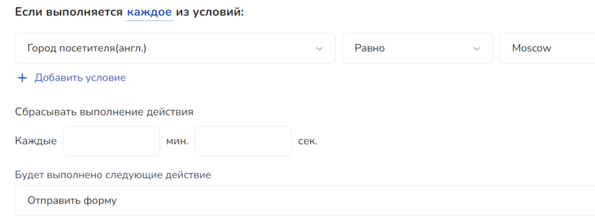<figcaption></figcaption></figure>

<figure>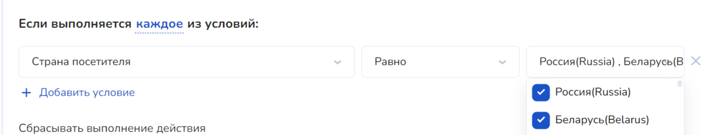<figcaption></figcaption></figure>

В данном случае можно установить соответствие как равно, так и не равно. Например, если вам необходимо установить город или страну (или список стран), для которых автоматическое действие воспроизводиться не будет, поставьте не равно.&#x20;

4. **День недели.** Данное условие является триггером для автоматических действий, исходя из дня недели. Здесь также можно установить чекбоксы (галочки) напротив дней недели, выставить соответствие равно/не равно и выбрать выполняемое онлайн-чатом автоматическое действие.&#x20;

Например, можно установить все рабочие дни недели ваших операторов/менеджеров для последующей их связи с клиентами.&#x20;

5. **URL текущей страницы**. Автоматическое действие будет срабатывать в зависимости от того, содержится/не содержится или равно/не равно URL ссылки.

<figure><figcaption>
В данном случае, чат автоматически откроется, если url страницы будет содержать ссылку, которую мы указали в поле для ссылки
</figcaption></figure>

Например, данное действие можно использовать, если вы хотите скрыть значок онлайн-чата в вводных уроках и т.д.

5. **Сообщение пользователя**. Чтобы автоматическое действие сработало с таким условием, необходимо в поле вставить определенное слово от пользователя:

<figure>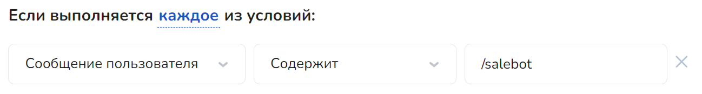<figcaption></figcaption></figure>

7. **Время на странице**. Данное условие схоже с временем дня, однако, например, если ваша клиентская база находится в разных часовых поясах и есть необходимость выполнения автоматического действия только в одно и то же время у каждого часового пояса, можно воспользоваться этим условием.&#x20;
8. **Время от закрытия окна Salebot**. Такое условие выставляется аналогично времени дня или времени на странице, однако зависит от действия самого пользователя по закрытию соответственно окна Salebot.&#x20;
9. **Время от первого сообщения посетителя.** Автоматическое действие сработает спустя определенный промежуток времени (в секундах), после того как ваш клиент написал какое-либо сообщение в онлайн-чат.&#x20;
10. **Время без ответа оператора с первого сообщения пользователя.** Данное условие также выставляется в секундах и выполняется соответственно вне зависимости от того, ответил клиенту оператор или нет.

При необходимости условия можно сочетать друг с другом и выставлять срабатывание автоматического действия исходя из нескольких условий:

<figure>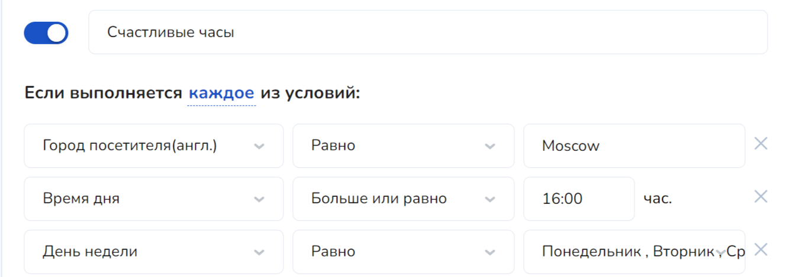<figcaption></figcaption></figure>

Исходя из примера выше, автоматическое действие выполнится только для клиентов из Москвы после 16:00 часов в понедельник, вторник и среду.&#x20;

Далее выбираем какое действие  для онлайн-чата должно выполниться автоматически:

<figure>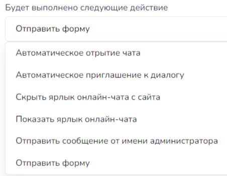<figcaption></figcaption></figure>

1. **Автоматическое открытие чата**. Данное действие соответственно откроет онлайн-чат для пользователя. Для данного действия не требуется дополнительных настроек.
2. **Автоматическое приглашение к диалогу**. Такое автоматическое действие направит пользователю любое прописанное в поле сообщение:

<figure>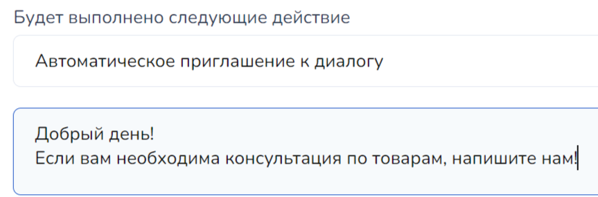<figcaption></figcaption></figure>

Также при необходимости можно скрыть поле ввода сообщения с помощью одноименного чекбокса:

<figure>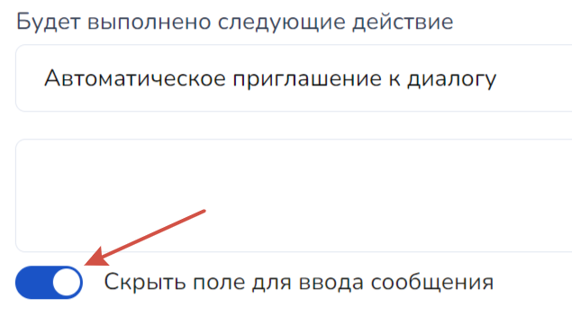<figcaption></figcaption></figure>

3. **Скрыть ярлык онлайн-чата с сайта**. Данное действие можно применить, например, по истечении рабочих часов ваших администраторов.&#x20;
4. **Показать ярлык онлайн-чата**. Аналогично предыдущему действию, можно показать ярлык онлайн-чата для клиентов в определенный промежуток времени (или по иным другим необходимым условиям).
5. **Отправить сообщение от имени администратора**. Данное действие направит соответственно сообщение в онлайн-чате от имени администратора.

<figure>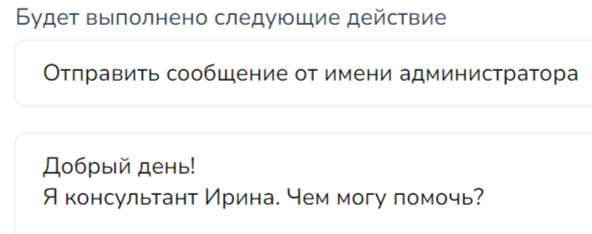<figcaption></figcaption></figure>

6. **Отправить форму**. Данное действие служит для сбора данных (информации) клиента, где вы можете заполнить текст формы, выбрать необходимые поля сбора данных (имя, номер телефона, email, чекбокс или иное поле ввода, которое можно настроить самостоятельно).&#x20;

<figure>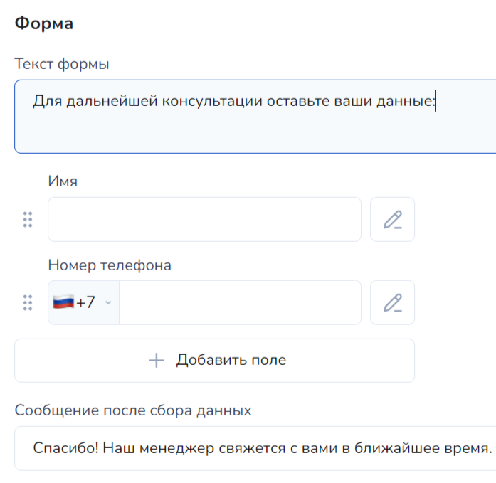<figcaption>
Пример формы.
</figcaption></figure>

Иное поле ввода можно настроить, например, для сбора города проживания или для другой информации:

<figure><figcaption>
Заполнение поля формы
</figcaption></figure> <figure>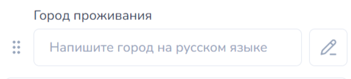<figcaption>
Вид поля формы в отправке
</figcaption></figure>

### Отправление формы для заполнения клиентами

В онлайн-чат также представлена функция отправления формы клиентам для сбора информации о пользователе, добавления его в систему для дальнейшей работы с ним:

<figure><figcaption></figcaption></figure>

Такая форма отправляется с помощью функции **online\_chat\_send\_form(),** где передаются параметры:

1. **name;**
2. **phone;**
3. **privacy;**
4. **callback (**&#x434;анный параметр работает только в случаях, если есть телефония в проекте);
5. age;
6. email\_group\_ID (если добавить этот параметр с имейлом, то будет создан email клиента и привязан к клиенту чата);
7.  wa\_group\_ID (если добавить этот параметр с телефоном, то создаст ватсап клиента и привяжет к клиенту чата)

    _Если указать несуществующую группу, то просто отправит форму, но клиента не создаст._


Важно! Все параметры записываются одной строкой через запятую!

_Пример записи в Калькуляторе:_ online\_chat\_send\_form("name,email,email\_group\_ID")


<figure><figcaption>
уведомление, которое придет в диалог после заполнения формы
</figcaption></figure>


В карточке онлайн-клиента из отправленной формы **значения сохраняются в переменных клиента** (см. ниже)


<figure><figcaption></figcaption></figure>

#### <mark style="color:red;">!</mark> online\_chat\_send\_form(arguments, texts)

Принимает два обязательных аргумента

arguments - строка параметров&#x20;

texts - имя формы

Например, в калькуляторе можно ввести таким образом: **online\_chat\_send\_form("name,phone", "Привет, Заполни форму")**

<figure>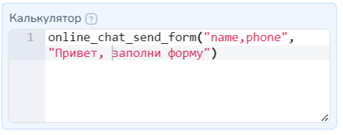<figcaption></figcaption></figure>

Пример ответа Онлайн-чата:

<figure><figcaption></figcaption></figure>

<figure><figcaption></figcaption></figure>

В настройках виджета онлайн-чата во вкладке "Баннеры" можно добавить кликабельные изображения в стартовое окно онлайн-чата.

Перейдем к настройкам. Нажмите на "Добавить баннер":

<figure><figcaption></figcaption></figure>

И загрузите изображение:

<figure><figcaption></figcaption></figure>


Размер изображения фиксированный.

Рекомендуемый формат изображения:&#x20;

1. Если прописываете заголовок и подзаголовок, то размер баннера — 345x194 или 16/9.


Чтобы баннер был кликабельным (то есть ваш клиент мог переходить по ссылке при клике на баннер), укажите ссылку в соответствующем поле:

<figure><figcaption></figcaption></figure>

При необходимости пропишите заголовок и подзаголовок, а затем нажмите "Сохранить":

<figure><figcaption></figcaption></figure>

После чего баннер отобразится в виджете онлайн-чата:

<figure><figcaption></figcaption></figure>

### Оценка качества

<figure>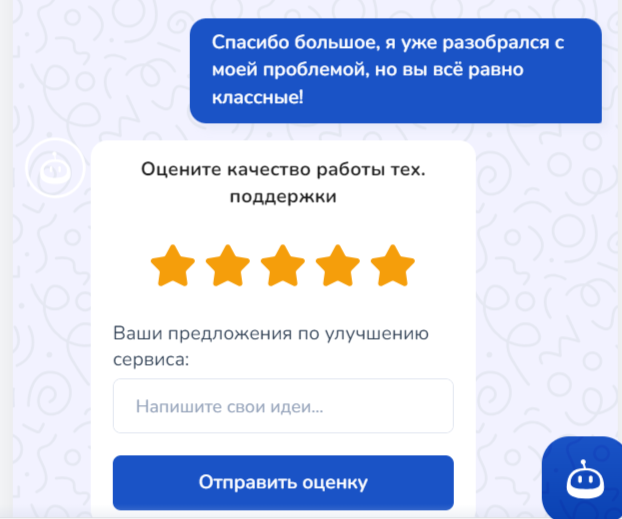<figcaption></figcaption></figure>

Теперь в онлайн-чате существует еще один раздел настройки - Оценка качества. Чтобы добавить такой функционал, перейдите в соответствующую вкладку в настройках:

<figure>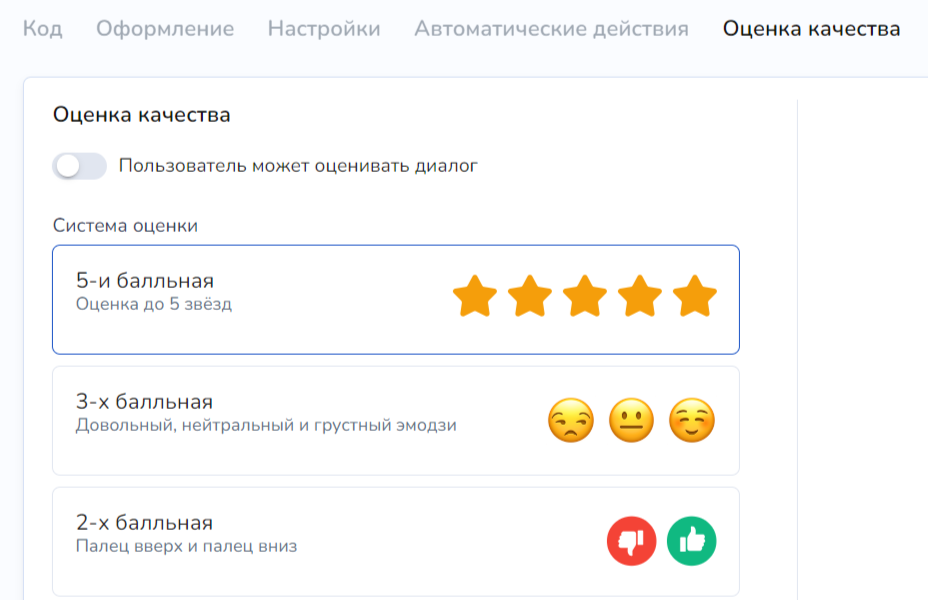<figcaption></figcaption></figure>

На выбор в функционале присутствует пятибалльная, трехбалльная и двухбалльная шкала оценивания качества работы:

<figure>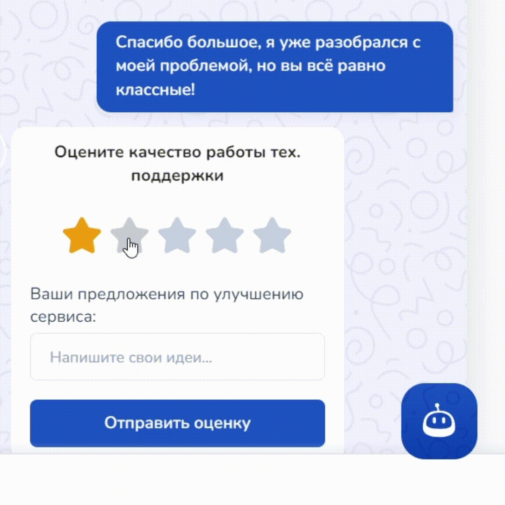<figcaption></figcaption></figure>

В поле с соответствующим названием вводится текст перед самой оценкой:&#x20;

<figure>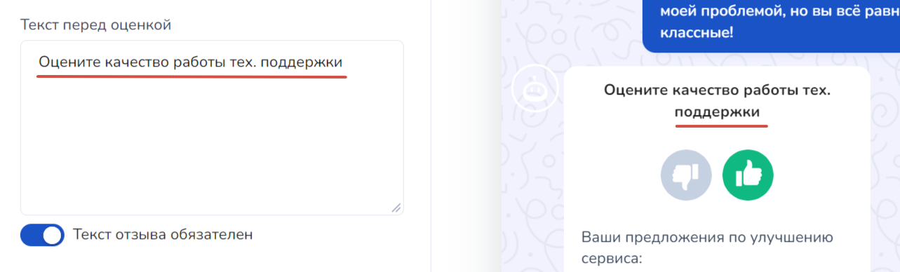<figcaption></figcaption></figure>

В этом поле нет значения по умолчанию, если его пропустить, то в плашке с оценкой качества будет виден такой текст:

<figure>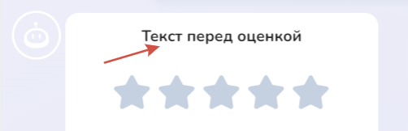<figcaption></figcaption></figure>

Также можно самостоятельно обозначить название поля для отзыва клиентом:

<figure>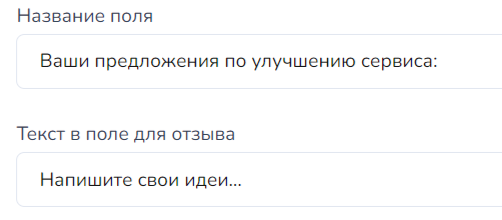<figcaption></figcaption></figure>

Для этого достаточно прописать свой текст в названии поля, а также подсказку внутри поля (текст в поле для отзыва). По умолчанию (см. пример выше) назначение и текст каждого поля уже указаны для вашего удобства.&#x20;

Можно активировать чекбокс с обязательным текстом отзыва клиента об оценке:

<figure><figcaption></figcaption></figure>

Далее можно заполнить сообщение обратной связи клиенту при положительном или отрицательном отзыве. Чтобы проверить, как выглядит последнее сообщение онлайн-чата после отправки оценки, нажмите на кнопку в чате для отправки оценки:

<figure>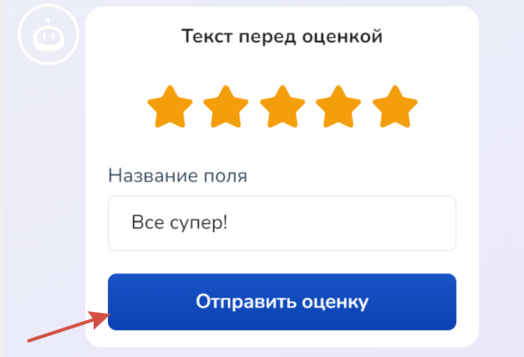<figcaption></figcaption></figure> <figure>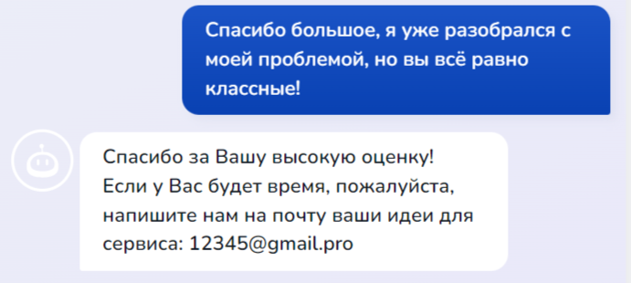<figcaption></figcaption></figure>

#### Чекбокс "Пользователь может оценивать диалог"&#x20;

<figure>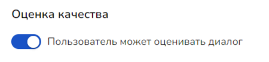<figcaption></figcaption></figure>

В разделе "Клиенты" в диалоге с пользователем сам оператор может завершить диалог с клиентом и в тех случаях, если данный чекбокс активирован, то пользователь  сможет поставить оценку.&#x20;


Сам оператор не видит оценку, которую клиент ему поставил за диалог.  Все оценки качества работы будут видны в разделе "Аналитика".&#x20;


В диалоге с пользователем сам оператор может нажать на кнопку "Завершить диалог". Тогда откроется форма с подтверждением действия оператора:

<figure>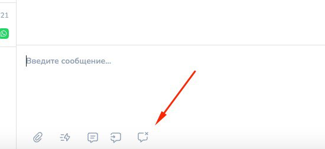<figcaption></figcaption></figure> <figure>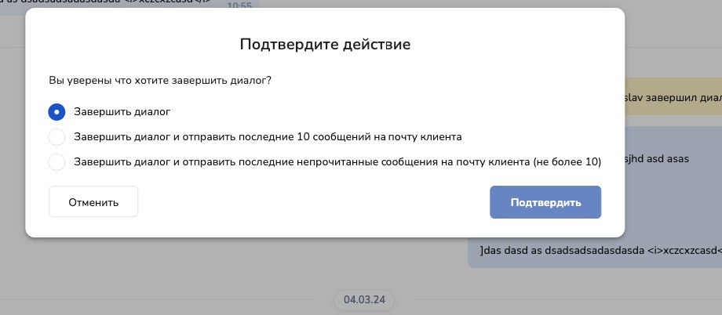<figcaption></figcaption></figure>

При этом если подключен в каналах почтовик, то появляются варианты отправить сообщения на почту:

<figure>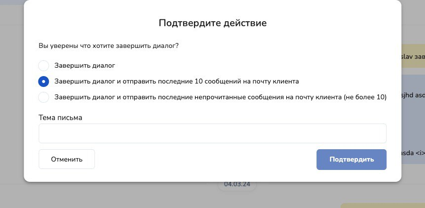<figcaption></figcaption></figure>

После того, как оператор завершил диалог, пользователю направляется форма оценки качества, где сама оценка приходит в Аналитику.&#x20;

В случае, если клиент не оставил оценку, то в статистике отобразится "Пользователь не оставил оценку".

## Видео-инструкция


