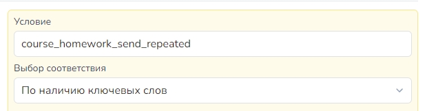

# Создание онлайн-курса


Доступно только на тарифе "Инфобиз"


Конструктор курсов от Salebot – это универсальный инструмент, который позволяет создавать, управлять и продавать обучающие курсы без необходимости глубоких технических знаний.

<figure><figcaption></figcaption></figure>

С помощью конструктора курсов можно быстро разработать модули и уроки, встроить тесты и опросы, автоматизировать взаимодействие с учениками и обеспечить удобное прохождение курсов. Платформа предоставляет гибкость в настройках, позволяя создавать курсы под разные целевые аудитории и форматы обучения. В этой статье мы рассмотрим настройки конструктора курсов на Salebot.&#x20;



## Как создать курс

Для создания курса перейдите во вкладку “Курсы” и нажмите кнопку “Создать”. Если у вас еще нет созданных курсов, то кнопка отображается в рабочей области по центру:

<figure><figcaption></figcaption></figure>

После клика по кнопке "Создать курс" вы перейдете в основные настройки курса:

<figure><figcaption></figcaption></figure>

## Настройки

В основных настройках курса настраивается информация о курсе и об авторе, тип обучения, аналитика и ссылки.

Чтобы перейти к настройкам курса, нажмите на кнопку настроек (иконка шестеренки):

<figure><figcaption></figcaption></figure>

Меню настроек откроется справа на экране:

<figure><figcaption></figcaption></figure>

### Общие

<figure><figcaption></figcaption></figure>

**Тип обучения** - настройка для выбора одного из типов: курс, марафон, интенсив и тренинг.&#x20;

В Salebot существует возможность устанавливать свой домен для курса или указывать красивое название ссылки с помощью дополнительных настроек.&#x20;

#### Уникальная ссылка на курс

<figure><figcaption></figcaption></figure>

Чтобы указать красивое название ссылки вместо уникального идентификатора страницы, состоящей из большого количества символов, достаточно придумать название ссылки на латинице:

<figure><figcaption></figcaption></figure>


Обращаем внимание!

При изменении названия ссылки меняется только та часть, что отмечена красным цветом: "https://salebot.pro/cs/<mark style="color:red;">**НАЗВАНИЕ\_СТРАНИЦЫ**</mark>".&#x20;

При этом промо-страница курса остается на домене Salebot.&#x20;


#### Установить домен

Чтобы изменить домен Salebot на собственный, нажмите на соответствующую кнопку:

<figure><figcaption></figcaption></figure>

Тогда откроется модальное окно, в котором необходимо будет ввести настроенный вами домен:

<figure><figcaption></figcaption></figure>


Как создать запись А, читайте в этой [статье](/broken/pages/SVmo5FWy8HXy0n1EdOSO#10.-ustanovlenie-domena).


Теперь уроки и главная страница курса будут открываться на вашем домене, а личный кабинет ученика также останется на домене Salebot.

#### **Прием домашних заданий**

<figure><figcaption></figcaption></figure>

**Прием домашних заданий** - данный переключатель можно активизировать в зависимости, соответственно, как вы хотите принимать домашние задания на курсе.&#x20;

Если вы выбрали автоматическую проверку домашнего задания, то в новом открывшемся поле можно выбрать уроки, для которых д/з принимается автоматически, и прописать комментарий для учеников, успешно сдавших задание:

<figure><figcaption></figcaption></figure>

#### Отправлять колбеки

<figure><figcaption></figcaption></figure>

**Отправлять колбек - отметив галочками нужные коллбеки,** вы сможете получать уведомления о действиях клиентов.&#x20;

Текст уведомлений (колбеков) которые поступают в диалог клиента.

_<mark style="color:green;">**Новые домашние задания**</mark>_ \
&#xNAN;**`course_homework_send_new course_id: 111, lesson_id: 222`** \
111 - id  вашего курса будет. \
222 - id урока \
&#xNAN;_<mark style="color:green;">**Повторные домашние задания:**</mark>_\
&#xNAN;**`course_homework_send_repeated course_id: 111, lesson_id: 222`**  

Для настройки реакции на данные уведомления укажите в условии блока или стрелки текст до первого пробела с типом соответствия "По наличию ключевых слов". Пример в скриншоте ниже.&#x20;

<figure><figcaption>
Условие и тип соответствия указывают или в блоке или в стрелке. 
</figcaption></figure>

_<mark style="color:green;">**Открытие урока:**</mark>_ \
&#xNAN;**`course_lesson_opened course_id: 111, lesson_id: 222`** \
111 - id  вашего курса будет. \
222 - id урока \
Закрытие урока: \
&#xNAN;**`course_lesson_closed course_id: 111, lesson_id: 222`** \
111 - id  вашего курса будет. \
222 - id урока&#x20;

_<mark style="color:green;">**При окончании курса:**</mark>_ \
&#xNAN;**`course_tariff_finish course_id: 111, tariff_id: 648`**\
111 - id  вашего курса будет. \
648 - id вашего тарифа

#### Метки и списки

<figure><figcaption></figcaption></figure>

**Добавить клиенту метку** - добавить метку из выпадающего списка. Метка клиенту будет назначена после того, как он запишется на курс. \
\
**Добавить клиента в список** - добавление клиента в список происходит при записи клиента на курс. Список создается в разделе "Списки".

#### Превью курса

Это функция отображения обложки курса в личном кабинете ученика либо в каталоге курсов. Необходимо загрузить вложение, которое отобразится в качестве обложки или добавить ссылку на файл в форму.

<figure><figcaption></figcaption></figure>

Превью курса будет также отображаться, например, на сайте при добавлении секции карточки курса:

<figure><figcaption></figcaption></figure>


Подробнее о секциях сайта для онлайн-курса рассказали в статье "[Секции для онлайн-курса](/broken/pages/FBlzIJMArVfogHlHjSGo)"


#### Другие настройки

Чтобы отправлять уведомления кураторам курса на почту, активируйте чекбокс в общих настройках курса:

<figure><figcaption></figcaption></figure>

Тогда соответствующие уведомления о курсе будут приходить прямо на почту кураторам.&#x20;

Для безопасности уникального контента от несанкционированного копирования текста в уроках можно активировать чекбокс "Запретить копирование текста":

<figure><figcaption></figcaption></figure>

Чтобы запретить покупку и запись на курс, который потерял свою актуальность, активируйте чекбокс "Архивировано" в общих настройках курса:

<figure><figcaption></figcaption></figure>

### Внешний вид

С помощью вкладки "Внешний вид" в конструкторе курсов вы сможете создать свой яркий и уникальный дизайн онлайн-обучения с надежными и интересными инструментами настройки:

<figure><figcaption></figcaption></figure>

Добавляйте интересные медиа-файлы (видео и изображение) в обложку курса, кнопки в мессенджеры и кликабельные кнопки - все это без знания программирования.&#x20;

Чтобы настроить внешний вид промо-страницы курса, перейдите во вкладку "Внешний вид" в общих настройках курса:

<figure><figcaption></figcaption></figure>

Во вкладке "Внешний вид" вы найдете настройки темы, основного цвета страницы, логотипа и фона для обложки курса.

#### Тема

Для удобного и быстрого старта в общих настройках можно выбрать уже готовую тему для промо страницы курса:

<figure><figcaption></figcaption></figure>

Существует как светлые темы, так и темные темы.

Для основных элементов страницы (кнопок, плашки с информацией о курсе, об авторе, карточки тарифов и т.п.) существуют настройки скругления:

<figure><figcaption></figcaption></figure>

По умолчанию установлено овальное скругление, но также доступно округлое и квадратное (без скругления):

<figure><figcaption>
Без скругления элементов
</figcaption></figure>

<figure><figcaption>
Округлое скругление элементов промо страницы
</figcaption></figure>

#### Настроить свою тему

Если предустановленные темы не подошли под ваше дизайнерское решение, то активируйте чекбокс "Настроить свою тему":

<figure><figcaption></figcaption></figure>

Расширенные настройки темы помогут настроить собственную кастомизацию курса:&#x20;

<figure><figcaption></figcaption></figure>

К заднему фону промо-страницы можно применить различные интересные узоры.&#x20;

#### Горизонтальная ориентация уроков/тарифов

<figure><figcaption></figcaption></figure>

Для отображения уроков и тарифов на промо странице курса в горизонтальном или вертикальном виде:

<figure><figcaption></figcaption></figure>

### Шапка страницы

По умолчанию, логотип в шапке отображается как основное лого Salebot.

<figure><figcaption></figcaption></figure>

Если вам необходимо отображать иное название или изображение, воспользуйтесь настройками здесь:

<figure><figcaption></figcaption></figure>

Можно загрузить изображение, ввести в поле URL ссылку на изображение, а также прописать логотип текстом.

<figure><figcaption></figcaption></figure>

### Обложка курса

В обложке страницы прописывается название курса и его описание, подгружается фоновое изображение, а также можно добавить видео, например, для рекламы вашего курса:

<figure><figcaption></figcaption></figure>

Настройки обложки курса начинается с двух текстовых редакторов, в которых прописывается название курса и его описание:

<figure><figcaption></figcaption></figure>

В поле редактора можно выбрать цвет шрифта, его размер, расположение относительно центра, правого или левого края, а также добавить различные ссылки в тексте.&#x20;

<figure><figcaption></figcaption></figure>

Чтобы добавить дополнительные теги над заголовком курса, воспользуйтесь кнопкой "Добавить тег":

<figure><figcaption></figcaption></figure>

**Выравнивание обложки**

<figure><figcaption></figcaption></figure>

По умолчанию контент обложки расположен по середине:

<figure><figcaption></figcaption></figure>

Также контент можно расположить слева, например, чтобы не перекрывалось фоновое изображение или для подгрузки видео. Для этого кликните на соответствующую кнопку обложки:

<figure><figcaption></figcaption></figure>

Тогда откроются настройки для загрузки медиа в правую часть обложки:

<figure><figcaption></figcaption></figure>

Здесь можно настроить расположение медиа (изображения или видео) в обложке, выбрать размер.&#x20;

#### Фон обложки

Для отображения изображения в виде фона обложки существуют свои настройки, где можно установить высоту изображения, предварительно загрузив его, а также расположение:

<figure><figcaption></figcaption></figure>

После загрузки фонового изображение, на него наложатся настройки цвета темы и узоров, которые вы делали в настройках внешнего вида промо страницы курса:

<figure><figcaption></figcaption></figure>

### О курсе и авторе

<figure><figcaption></figcaption></figure>

**Название курса** - текстовое поле для наименования вашего онлайн-продукта. В данном поле вы можете не только задать текст, который увидит клиент, но и оформить его:&#x20;

* выделить текст;
* &#x20;выбрать его стиль,&#x20;
* указать расположение текста на страницу;&#x20;
* прикрепить ссылку.&#x20;

**Описание курса** - текстовые поля, поддерживающие форматирование текста, его выделение и прочий функционал, аналогично любому текстовому редактору (например, Word).&#x20;


Требования к размеру аватара автора курса и другим фото в настройках курса:

**Размер аватара**: форма квадрат, размер фото **128 х 128px**

Расширенные настройки страницы курса:&#x20;

**блок Обложка**: Рекомендуемый размер фото - **1920px x 1080px**

Расширенные настройки страницы курса:

**блок Добавить изображения**: Рекомендуемый размер фото - **1920px x 1080px.** Рекомендуемое количество - не более 9.

**блок Галерея**: Рекомендуемый размер фото - **1920px x 1080px.** Рекомендуемое количество - не более 9.


<figure><figcaption></figcaption></figure>

**Имя автора** - текстовое поле, в котором вы можете указать Имя автора курса. Введенные данные будут отображаться на странице курса и в настройках вашего проекта на карточке созданного курса.&#x20;

**Описание автора** - данное текстовое поле также будет отображаться на странице созданного курса. В примере выше нами была указана непосредственно специализация автора.

### Футер

<figure><figcaption></figcaption></figure>

Настройка ссылки в футере поможет добавить на промо курса необходимые и важные ссылки в нижнюю часть страницы:&#x20;

<figure><figcaption></figcaption></figure>

Для этого в настройках кликните на "Добавить ссылку":

<figure><figcaption></figcaption></figure>

Далее введите название для пункта меню, например, "публичная оферта", а также укажите URL, куда будет вести ссылка:

<figure><figcaption></figcaption></figure>

И выберите, каким образом открывать ссылку: в этой же вкладке или новом окне.&#x20;

Далее кликните "Сохранить", и пункт меню футера сохранится в настройках футера:

<figure><figcaption></figcaption></figure>

#### Реквизиты

Также для промо-страницы существует возможность добавить реквизиты: организации, ИП и пр.:

<figure><figcaption></figcaption></figure>

Реквизиты также отображаются в нижней части страницы промо курса, как и футер с пунктами меню:

<figure><figcaption></figcaption></figure>

Вам достаточно заполнить пустые текстовые поля в плашке "Реквизиты":

<figure><figcaption></figcaption></figure>

### Аналитика

<figure><figcaption></figcaption></figure>

**Пиксель ВКонтакте** - позволяет добавить пиксель ВК (старый РК), как установить код пикселя рассказали [тут.](https://docs.salebot.pro/minilendingi-v-socialnykh-setyakh#piksel-vkontakte)\
\
**Пиксель Facebook** - дает возможность работать с пикселем FB, подробное описание настройки [тут.](https://docs.salebot.pro/minilendingi-v-socialnykh-setyakh#piksel-facebook)&#x20;

**Google Tag Manager** - установите код и настройте получение данных [по документации.](https://docs.salebot.pro/analitika/podklyuchaem-schetchiki-analitiki-i-nastraivaem-konversii-cherez-gtm) Будут получены события просмотра, без информации о нажатии кнопок. \
Какие события передаются: \
`page_view_course` - просмотр любого курса  \
`page_view_course_#{ID}` - просмотр конкретного курса \
`page_view_lesson` - просмотр любого урока курса  \
`page_view_lesson_#{ID}` - просмотр конкретного урока курса \
\
**Пиксель нового РК ВК** - передача данных в новый РК ВК. Как настроить [показали тут.](https://docs.salebot.pro/analitika/podklyuchenie-reklamnogo-kabineta-vkontakte-k-salebot) \
Какие события передаются: \
`page_view_course` - просмотр любого курса  \
`page_view_course_#{ID}` - просмотр конкретного курса \
`page_view_lesson` - просмотр любого урока курса  \
`page_view_lesson_#{ID}` - просмотр конкретного урока курса \
\*Будут получены события просмотра, без информации о нажатии кнопок.&#x20;

### Партнерская программа

Для привлечения еще большего количества учеников в онлайн-школу, можно создавать партнерскую программу для курса:

<figure><figcaption></figcaption></figure>

Для этого необходимо активировать чекбокс "Отображать кнопку стать партнером":

<figure><figcaption></figcaption></figure>

Тогда кнопка "Стать партнером" будет отображена на промо-странице курса:

<figure><figcaption></figcaption></figure>

При клике на кнопку, вашему будущему партнеру будет открыта форма для заполнения собственных данных:

<figure><figcaption></figcaption></figure>

Также в форме существует возможность активировать чекбокс для добавления страницы, на которой указаны условия партнерской программы:

<figure><figcaption></figcaption></figure>

Тогда в форме будет отображен чекбокс с ссылкой на страницу с условиями партнерской программы:

<figure><figcaption></figcaption></figure>

Все партнеры вашей школы будут отображены во вкладке "Партнерская программа" в разделе "Курсы":

<figure><figcaption></figcaption></figure>


Важно!&#x20;

Тип комиссии и сумма вознаграждения устанавливается для всех курсов одновременно в едином значении.


Чтобы настроить комиссию партнера, необходимо кликнуть на "Настройки партнерской программы":

<figure><figcaption></figcaption></figure>

Далее в выпадающем списке выберите тип комиссии: "Процент с продажи" или "Фиксированная сумма":

<figure><figcaption></figcaption></figure>

А затем укажите размер вознаграждения партнера:

1\) если процент с продажи, то укажите необходимое число без дополнительных знаков и символов:

<figure><figcaption></figcaption></figure>

2\) если фиксированная сумма, то укажите необходимую сумму без символов, пробелов:

<figure><figcaption></figcaption></figure>

### Расширенный редактор страницы

**Расширенный редактор страницы курса** позволяет применить уникальные настройки страницы с использованием различного функционала создания сайта/лендинга на платформе Salebot.&#x20;

<mark style="color:red;">**Внимание!**</mark> Если вы активируете чекбокс "Расширенные настройки", то у вас автоматически будет отображена страница сайта (пустого, если вы самостоятельно не настраивали страницу в расширенном редакторе), а не промо-страницы курса!&#x20;

<figure><figcaption></figcaption></figure>


Подробно о каждом блоке (секции) рассказано в "[Контент (блоки сайта)](/broken/pages/9VvYi1sRwNdMmQhsrk3a)".

