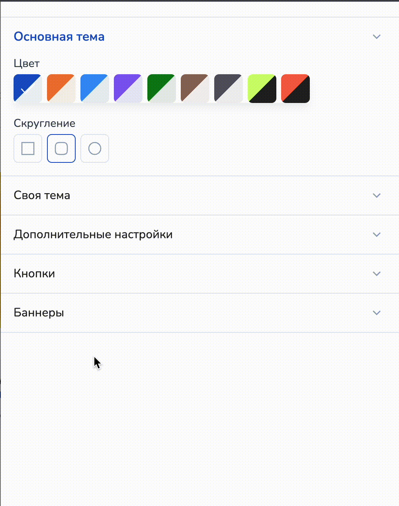

# Страница ученика

Создание привлекательной и функциональной страницы ученика — ключ к успешному онлайн-курсу. Ведь чем удобнее и красивее интерфейс, тем проще ученикам погрузиться в обучение и сохранить мотивацию на высоком уровне.&#x20;

<figure><figcaption></figcaption></figure>

Кастомные темы и настройки позволяют адаптировать внешний вид страницы ученика, создавая яркий и запоминающийся дизайн буквально за несколько кликов. В этой статье мы расскажем, как быстро и эффективно настроить страницу ученика, чтобы она стала визитной карточкой вашего курса, сочетая стиль с удобством использования.

## Что такое страница ученика?

**Страница ученика в онлайн-курсе** — это персонализированная страница, которая служит главным рабочим пространством для ученика в рамках обучающей системы на платформе Salebot. На этой странице собраны все важные элементы, необходимые для учебного процесса, и она позволяет вашему клиенту видеть содержание курса с количеством учебного материала, отслеживать прогресс, взаимодействовать с кураторами, проходить уроки и отправлять домашние задания.&#x20;

<figure><figcaption></figcaption></figure>

#### Для чего нужна страница ученика?

Страница ученика делает прохождение курса структурированным и удобным. Она позволяет:

* Быстро находить нужные материалы и продолжать обучение с того момента, на котором ученик остановился.
* Удобно отслеживать свой прогресс и видеть, какие задания уже выполнены, а какие еще предстоят.
* Получать обратную связь от кураторов, что способствует более персонализированному подходу к обучению.

## Где настроить страницу ученика?


Конструктор курсов доступен при подписке "Инфобиз".&#x20;


Перейдите в раздел "Курсы" в Salebot:

<figure><figcaption></figcaption></figure>

Далее выберите курс, в котором необходимо настроить страницу ученика, и перейдите в настройки:

<figure><figcaption></figcaption></figure>

Далее вы перейдете на страницу основных настроек курса, где вам необходимо перейти во вкладку "Страница ученика":

<figure><figcaption></figcaption></figure>

Теперь чтобы начать настраивать страницу ученика, найдите иконку с шестеренкой, чтобы открыть меню настроек:

<figure><figcaption></figcaption></figure>

При клике на кнопку с шестеренкой откроется меню с настройками основной (кастомной) темой, своей (настраиваемой) темой, а также с дополнительными настройками и добавлением кнопок:

<figure><figcaption></figcaption></figure>

## Основная тема

Основная тема страницы ученика - это предустановленные и готовые темы, которые помогут кастомизировать страницы за два клика:

<figure><figcaption></figcaption></figure>

Шаг 1. Выберите цветовое решение основной темы:

Для этого доступно 7 светлых и 2 темные темы:

<figure><figcaption>
Светлая тема
</figcaption></figure>

<figure><figcaption>
Темная тема
</figcaption></figure>

При применении кастомной темы меняются цвета всех основных элементов страницы:

1. Фон (обложки, самой страницы, прогресс-бара, плашек уроков);
2. Кнопки;
3. Шкала прогресс-бара;
4. Границы обводки и т.п.&#x20;

Шаг 2. Выберите степень скругления:&#x20;

а) нулевая степень: все углы и элементы страницы - квадратные;

<figure><figcaption></figcaption></figure>

б) средняя степень: углы и элементы - овальные;&#x20;

<figure><figcaption></figcaption></figure>

в) максимальная степень: углы и элементы страницы - закругленные:&#x20;

<figure><figcaption></figcaption></figure>


Готово!&#x20;

Теперь вы знаете, как быстро настроить основную тему страницы ученика.&#x20;

Если вы хотите добавить дополнительные кнопки, изображение в обложку, настроить цветовое решение страницы по своему уникальному дизайну, то предлагаем ознакомиться с дальнейшими разделами данной статьи.&#x20;


## Своя тема

Настройки во вкладке "Своя тема" помогут применить к элементам страницы ученика свои уникальные и отличные друг от друга цветовые решения:

<figure><figcaption></figcaption></figure>


Обращаем внимание!&#x20;

Основную и свою темы можно использовать в сочетании друг с другом: например, с помощью настроек во вкладке "Своя тема" можно настроить цветовые решения всего для нескольких элементов, а остальные элементы страницы оставить в цветах выбранной основной темы.&#x20;


#### Цвет фона

Настройка цвета фона изменяет цвет всей страницы, не включая элементы:

<figure><figcaption></figcaption></figure>

Нажмите на квадрат, чтобы открыть палитру цветов и выберите необходимый цвет:

<figure><figcaption></figcaption></figure>

Помимо обширной цветовой палитры для каждого элемента, можно выбрать степень насыщенности цвета, используя шкалу прозрачности:

<figure><figcaption></figcaption></figure>

#### Цвет фона подложки

Настройки цвета фона подложки изменяют цветовое решение на основных плашках страницы ученика:&#x20;

а) прогресс-бара;

б) подложки уроков;&#x20;

в) обложки курса.

<figure><figcaption></figcaption></figure>

#### Акцентный цвет

Настройки акцентного цвета помогут поменять цветовое решение основных выделяющихся элементов страницы:

1\) кнопки перехода к уроку;

2\) шкала прогресс-бара;

3\) обводки, подложки для номеров уроков и т.п.:

<figure><figcaption></figcaption></figure>

#### Цвет текста на фоне

Данная настройка поможет подобрать интересное цветовое решение для текста фона страницы:

<figure><figcaption></figcaption></figure>

#### Цвет текста на подложке

Настройка цвета текста подложек поможет изменить цветовое решение для текста основных элементов страницы ученика:

<figure><figcaption></figcaption></figure>

#### Цвет текста на акцентном цвете

Данная настройка изменяет цветовые решения для плашек с акцентными цветами и кнопок перехода к уроку:

<figure><figcaption></figcaption></figure>

#### Скругление элементов

Пустые поля, принимающие на ввод только числовые значения:

<figure><figcaption></figcaption></figure>

Можно выбрать не только скругление в пикселях, но и в процентах для своего удобства:

<figure><figcaption></figcaption></figure>

При вводе числового значения в первое поле скругления применяет введенное значение к кнопкам перехода к урокам:

<figure><figcaption></figcaption></figure>

Второе поле для ввода числового значения применяет введенное значение к подложкам обложки, прогресс-бара и уроков:

<figure><figcaption></figcaption></figure>

Третье поле для ввода применяет введенное числовое значение к акцентным элементам страницы ученика:

<figure><figcaption></figcaption></figure>

## Дополнительные настройки&#x20;

В дополнительных настройках страницы ученика можно загрузить изображение для обложки страницы:

<figure><figcaption></figcaption></figure>


Обращаем внимание!&#x20;

Размер изображения, которое можно загрузить в обложку страницы ученика с собственного устройства, не может превышать 15 мб.&#x20;


Шаг 1. Загрузка изображения

Изображение можно загрузить с собственного компьютера:

<figure><figcaption></figcaption></figure>

Либо загрузить изображение с файлового хранилища ссылкой:

<figure><figcaption></figcaption></figure>

Преимущество загрузки изображения ссылкой с файлового хранилища в том, что в обложку можно поставить изображение любого размера.

<figure><figcaption></figcaption></figure>


Подробнее о том, как использовать хранилище, рассказано в статье "[Файловое хранилище](/broken/pages/PicsdycUnWHDbDnHPG9D)".&#x20;


Шаг 2. Высота обложки

После загрузки изображения подберите высоту обложки на странице ученика:

<figure><figcaption>
Высота 260 px
</figcaption></figure>

<figure><figcaption>
Высота 400 px
</figcaption></figure>

Шаг 3. Расположение изображения:

<figure><figcaption></figcaption></figure>

Можно воспользоваться предустановленными настройками, располагая изображения по центру, по правому и левому краю, снизу, а также выбрать собственные настройки:

<figure><figcaption></figcaption></figure>

Где, перемещая кружок, можно установить изображения по своему вкусу.&#x20;

Шаг 4. Размер изображения

<figure><figcaption></figcaption></figure>

Поле размера изображения принимает значения (contain/cover) и числовые значения в пикселях (px) и процентах (%):

1\) значения contain/cover

<figure><figcaption></figcaption></figure>

2\) числовые значения:

<figure><figcaption></figcaption></figure>

Шаг 5. Повторение изображения

Повторение возможно по оси y, то есть вертикально:

<figure><figcaption></figcaption></figure>

По оси x, то есть горизонтально:

<figure><figcaption></figcaption></figure>

И без повторений:

<figure><figcaption></figcaption></figure>

Шаг 6. Чекбоксы

Для удобства ученика в персональной странице можно установить отображение прогресс-бара, количества пройденных уроков и принятых домашних заданий:

<figure><figcaption></figcaption></figure>

Если вы не хотите использовать данные элементы на странице, то чекбоксы можно деактивировать.&#x20;

## Кнопки

В странице ученика под шкалой прогресс-бара также существует функция для создания кнопок с ссылками:

<figure><figcaption></figcaption></figure>

Чтобы добавить кнопку, раскройте соответствующую вкладку в настройках страницы ученика:

<figure><figcaption></figcaption></figure>

Далее кликните на "Добавить кнопку":

<figure><figcaption></figcaption></figure>

После чего откроется модальное окошко для настройки кнопки:

<figure><figcaption></figcaption></figure>

Пропишите текст на кнопке:

<figure><figcaption></figcaption></figure>

Далее укажите ссылку на страницу/бота и т.п., на которую по клику по кнопке должен переходить  ученик:

<figure><figcaption></figcaption></figure>

Цветовое решение кнопки будет под выбранный цвет основной темы, но при необходимости можно подобрать собственную палитру текста и фона кнопки:

<figure><figcaption></figcaption></figure>

Далее кликните "Сохранить":

<figure><figcaption></figcaption></figure>

И ваша кнопка сохранится и добавится под прогресс-бар:

<figure><figcaption></figcaption></figure>

Кнопок можно добавить несколько - для этого достаточно перейти в меню настроек и кликнуть на "Добавить кнопку" под уже созданной кнопкой:

<figure><figcaption></figcaption></figure>

## Баннеры&#x20;

<figure><figcaption></figcaption></figure>

На странице ученика также есть возможность добавить кликабельные баннеры с переходом на страницу, которую вы укажете в настройках.&#x20;

Можно указать любые ссылки (в том числе, переход в бота в различных мессенджерах, группы и т.д.). Давайте перейдем к настройке.&#x20;

Шаг 1. Разверните раздел "Баннеры" в настройках:

<figure><figcaption></figcaption></figure>

Для этого кликните по разделу на выпадающее меню настроек:

<figure><figcaption></figcaption></figure>

Шаг 2. Загрузите изображение:

<figure><figcaption></figcaption></figure>

После загрузки изображение появится в поле настроек:

<figure><figcaption></figcaption></figure>

Шаг 3. Перейдите в настройки изображения:

<figure><figcaption></figcaption></figure>

Для этого необходимо кликнуть на шестеренку в левом углу загруженного изображения, после чего вам откроется модальное окно настроек:

<figure><figcaption></figcaption></figure>

Шаг 4. Установите ссылку для баннера, по клику на который ваш ученик перейдет на необходимую страницу/бота:

<figure><figcaption></figcaption></figure>

Шаг 5. Настройки высоты и ширины баннера:&#x20;

<figure><figcaption></figcaption></figure>

Пустые поля для ширины и высоты принимают исключительно числовые значения без указания px или %.

Шаг 6. Сохраните настройки баннера:

<figure><figcaption></figcaption></figure>

Настройки баннера завершены.&#x20;

Теперь вы увидите кликабельный баннер под прогресс-баром (если он у вас установлен) в правой части страницы ученика:

<figure><figcaption></figcaption></figure>

### Как добавить несколько баннеров

Можно добавить несколько баннеров на одну страницу. Для этого в настройках загрузите изображение и настройте его так, как описано выше:

<figure><figcaption></figcaption></figure>

Если вы кликните "добавить изображение" снизу под уже загруженным изображением, то баннер будет расположен ПОД добавленным баннером на странице ученика:

1\) Выберите загрузку изображения под добавленным баннером (нижняя большая кнопка загрузки):

<figure><figcaption></figcaption></figure>

2\) Изображение загрузилось под ранее добавленным баннером:

<figure><figcaption></figcaption></figure>

3\) На странице ученика баннер будет отображаться на следующей строке после ранее добавленного:

<figure><figcaption></figcaption></figure>

Если вы кликните  на кнопку "+" справа от уже загруженного изображения, то новый баннер будет расположен на одной строке с ранее добавленным баннером на странице ученика:

1\) Кликните на кнопку "+" справа от загруженного изображения в настройках страницы:

<figure><figcaption></figcaption></figure>

2\) Новое загруженное изображение будет расположено справа:

<figure><figcaption></figcaption></figure>

3\) На странице ученика баннер будет расположен на одной строке с ранее загруженным:

<figure><figcaption></figcaption></figure>

Можно добавлять баннеры одновременно на одной и последующих строках:

<figure><figcaption>
Страница ученика
</figcaption></figure>

<figure><figcaption>
Настройки баннеров
</figcaption></figure>


Готово! \
Теперь вы знаете, как полностью настроить страницу ученика!&#x20;


## Предпросмотр страницы

После настроек страницы ученика не забудьте сохранить свой прогресс:

<figure><figcaption></figcaption></figure>

После сохранения настроек, кликните на кнопку предпросмотр страницы:

<figure><figcaption></figcaption></figure>

Далее выберите "Перейти на страницу ученика":

<figure><figcaption></figcaption></figure>

После чего вы перейдете на предпросмотр страницы ученика:

<figure><figcaption></figcaption></figure>

На странице вы можете наглядно просмотреть, как выглядят все элементы, их расположение и остальные настройки, которые вы установили в режиме редактирования.&#x20;


Обращаем внимание!&#x20;

Страница ученика в режиме предпросмотра не является кликабельной и предназначена только для демонстрации.

