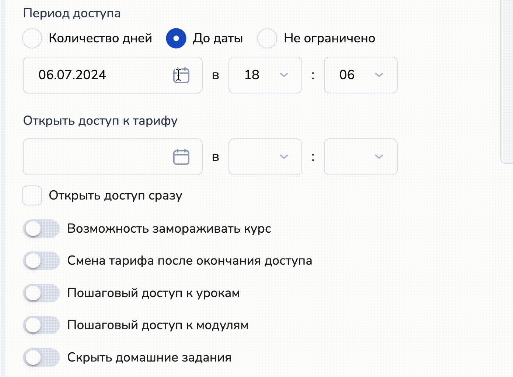

# Тарифы онлайн-курса

Принимать платежи за онлайн-курсы в Salebot можно как через чат-бота, так через страницу курса. Стоит отметить, что для одного курса можно настроить оба варианта приема оплат.


Как продавать курсы через чат-бота, рассказали в статье "[Продажа курсов в чат-боте](../kak-prodavat-kursy/prodazha-kursov-v-chat-bote/)".



Как настраивать платежи на странице курса, рассказали в статье "[Продажа курсов на промо-странице"](../kak-prodavat-kursy/prodazha-kursov-na-promo-stranice.md).


При продаже онлайн-курсов важной задачей является установка правильных тарифов. Корректно подобранная цена не только привлекает внимание потенциальных учеников, но и обеспечивает устойчивый доход для автора курса.&#x20;

<figure><figcaption></figcaption></figure> <figure><figcaption></figcaption></figure>

С технической точки зрения настройка тарифов на платформе Salebot не подразумевает под собой сложность в установке платежных систем или устойчивых знаний программирования. Достаточно подключенной платежной системы и настроенных, например, модулей (уроков) в онлайн-курсе.&#x20;

Перейдем к настройке.&#x20;

## Создание тарифа

После создания курса необходимо перейти в соответствующую вкладку "Тарифы":

<figure><figcaption></figcaption></figure>

Вы перейдете во вкладку "Тарифы" в настройках курса, где уже существует базовый бесплатный тариф:

<figure><figcaption></figcaption></figure>


Обращаем внимание!

Вы не можете удалить базовый бесплатный тариф, существующий в курсе по умолчанию, пока не создадите еще один или несколько тарифов для курса.&#x20;



Обращаем внимание!&#x20;

Если к вашему проекту не подключена ни одна платежная система, то платные тарифы на странице курса отображены не будут.&#x20;


Чтобы создать новый тариф, кликните по одноименной кнопке:

<figure><figcaption></figcaption></figure>

Либо отредактируйте Базовый тариф, существующий по умолчанию:

<figure><figcaption></figcaption></figure>

Тогда вы перейдете в форму настройки тарифа, которое выглядит следующим образом:

<figure><figcaption></figcaption></figure>

## Поля ввода

**Название тарифа** - текстовое поле для наименования, которое будет отображаться на странице курса.&#x20;

<figure><figcaption></figcaption></figure>

**Описание тарифа** - текстовое поле, которое поддерживает форматирование текста, создание списков и добавление ссылок. Оформить описание вы можете на свое усмотрение.

<figure><figcaption></figcaption></figure>

**Стоимость тарифа** - поле для ввода стоимости курса.

<figure><figcaption></figcaption></figure>


Обращаем внимание!

Сумма тарифа должна быть введена без пробелов.


Установить стоимость тарифа можно не только в российском рубле, но и использовать другие валюты:

<figure><figcaption></figcaption></figure>

**Сделать скидку** - чекбокс для отображения скидки и окончательной стоимости курса на странице:

<figure><figcaption></figcaption></figure>

## Настройки доступа по урокам (модулям)

После создания и редактирования модулей и уроков на курсе, они автоматически отобразятся в настройках тарифов:

<figure><figcaption></figcaption></figure>

Для каждого отдельного тарифа можно выбрать необходимые модули и уроки, например, в зависимости от контента вашего онлайн-курса или стоимости.&#x20;

Например, в самый дорогостоящий тариф вы можете включить дополнительные уроки, модули, а в базовом - оставить голую суть:

<figure><figcaption></figcaption></figure>


Обращаем внимание!

Если вы не выбрали ни одного урока или ни один модуль, то тариф на промо-странице курса, а также на сайте отображаться не будет!


## Настройки доступа по дате и времени

В настройках тарифа существует возможность ограничивать периоды доступа к тарифу и включенным в него урокам и/или модулям:

<figure><figcaption></figcaption></figure>

### По количеству дней

В поле "Период доступа" введите количество дней/недель/месяцев, в течение которых будет доступен уроки (модули) на данном тарифе:

<figure><figcaption></figcaption></figure>


Вы можете создавать несколько тарифов и в каждом устанавливать длительность доступа к созданным урокам больше или меньше в зависимости, например, от стоимости или материала курса.


### До даты

Также в настройках существует возможность ограничить доступ к тарифу и урокам в нем ДО определенной даты:

<figure><figcaption></figcaption></figure>

Чтобы установить ограничение доступа до определенной даты, выберите соотвествующее число месяца в календаре, а также определенные часы:

<figure><figcaption></figcaption></figure>

### Неограниченный доступ

Чекбокс "Не ограничено" позволяет ученикам вашего курса обратиться к материалам обучения в любое время после оплаты тарифа:

<figure><figcaption></figcaption></figure>

### Настройки доступа тарифа на курсе

В настройках тарифа существует функционал, который отображает созданный вами тариф только после определенной даты:

<figure><figcaption></figcaption></figure>

В таком случае на промо-странице курса у созданного вами тарифа откроется старт оплат только после установленной вами даты:

<figure><figcaption></figcaption></figure>

## Остальные настройки

### Заморозка курса

При настройке тарифа можно предусмотреть возможность заморозки для своих учеников:

<figure><figcaption></figcaption></figure>


Обращаем внимание!

1. Заморозить курс можно только 1 раз;&#x20;
2. При заморозке прерывается доступ к тарифу, но после разморозки доступ продлевается на время заморозки.&#x20;


### Пошаговый доступ

С помощью чекбокса "Пошаговый доступ к урокам/модулям" ученик будет переходить к последующим этапам обучения только после прохождения предыдущего модуля или урока:

<figure><figcaption></figcaption></figure>

При необходимости можно применить данную настройку только к определенным спискам или меткам.

Пошаговый доступ к урокам/модулям можно установить после:

1. Прохождения домашнего задания: тогда следующий урок/модуль откроется после выполнения д/з:

<figure><figcaption></figcaption></figure>

2. Через определенный промежуток:

<figure><figcaption></figcaption></figure>

Каждый последующий урок на курсе откроется только по истечению количества дней, заданных в  поле "Каждые n дней".&#x20;

3. По дате доступности урока:

<figure><figcaption></figcaption></figure>

Чтобы данная настройка работала в тарифе, перейдите в настройки урока:

<figure><figcaption></figcaption></figure>

Далее найдите поле с вводом даты и времени:

<figure><figcaption></figcaption></figure>

### Скрыть домашнее задание

Чекбокс "Скрыть домашнее" задание не отобразит в создаваемом вами тарифе д/з по курсу:

<figure><figcaption></figcaption></figure>

Можно использовать только для определенных меток/списков учеников.

### Настройки кнопки тарифа

Кнопку тарифа можно изменять по своему усмотрению:

<figure><figcaption></figcaption></figure>

Поле "Добавьте ссылку на оплату" понадобится в том случае, если вам необходимо использовать собственную ссылку на оплату через сервисы, которые необходимы именно вам.&#x20;


Обращаем внимание!

Кастомизированная кнопка для оплаты тарифа будет отображаться ДО того, как ваш ученик купит курс.&#x20;

После оплаты стоимости курса по определенному тарифу, на промо-странице вашего обучения в карточке тарифа будет отображаться стандартизированная кнопка по цветовым темам, используемым в ваших настройках.&#x20;


## Видеогид

{% embed url="https://www.youtube.com/watch?ab_channel=Salebot-%D0%9A%D0%BE%D0%BD%D1%81%D1%82%D1%80%D1%83%D0%BA%D1%82%D0%BE%D1%80%D1%87%D0%B0%D1%82%D0%B1%D0%BE%D1%82%D0%BE%D0%B2&v=5YInQ0tki9g" %}
