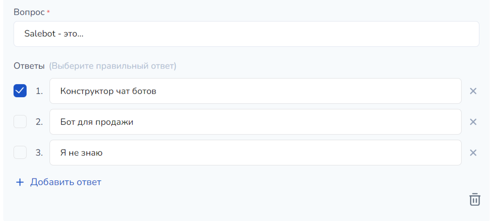

# Уроки и модули

Чтобы создать первый урок в курсе, необходимо переместиться во вкладку **Уроки** и нажать на кнопку **Создать:**

<figure><figcaption></figcaption></figure>

Далее открывается пустая страница для добавления секций контента урока:

<figure><figcaption></figcaption></figure>

## Контент урока

В контент урока можно включить различные материалы, в том числе изображения, а также видеоуроки, для чего существуют секции (блоки) для страницы:

<figure><figcaption></figcaption></figure>


Секция урока - это блок с контентом и предустановленными настройками, в котором лежат различные тексты, медиафайлы (видео, изображения) для построения страницы урока и размещения различного материала.&#x20;


Чтобы создать первую секцию урока, нажмите на плюс в середине экрана:

<figure><figcaption></figcaption></figure>

Для уроков существуют следующие виды блоков (секций):

<figure><figcaption></figcaption></figure>

Чтобы добавить текст в контент урока, необходимо кликнуть на секцию "Заголовок и текст":

<figure><figcaption></figcaption></figure>

Тогда секция с текстом добавится в контент вашего урока:

<figure><figcaption></figcaption></figure>


Вы можете добавлять в контент урока любое количество необходимых секций, при этом устанавливать для каждого собственные настройки шрифта, текста и пр.&#x20;


Для каждого поля, в котором будет расположен какой-либо текст (в том числе для других секций урока), существуют стандартные настройки, аналогичные любому текстовому редактору:

<figure><figcaption></figcaption></figure>

Можно установить:

1. Стили текста (заголовок первого уровня - H1, второго уровня - H2 и т.д.);
2. Начертание текста (жирный, полужирный);&#x20;
3. Курсив;
4. Подчеркивание;
5. Зачеркивание;
6. Размер;
7. Шрифт;&#x20;
8. Цвет шрифта, выделение текста и многое другое:

<figure><figcaption></figcaption></figure>

Например, при добавлении блока "Медиа" можно включить видео из различных платформ, куда вы ранее добавляли свои ролики, добавив ссылку на него в поле ниже:

<figure><figcaption></figcaption></figure> <figure><figcaption></figcaption></figure>

После добавлении ссылки, видео автоматически прогрузится в урок курса и вам останется лишь сохранить изменения.&#x20;


Все блоки (секции) урока аналогичны блокам (секциям) сайта.&#x20;

Ознакомиться подробнее с каждым блоком (секцией) можно в разделе ["Секции (блоки)"](/broken/pages/9VvYi1sRwNdMmQhsrk3a).


Все медиа, в том числе видео, можно загрузить в файловое хранилище, а затем добавлять url вложений в секции "Медиа" (или других секциях уроков). Для этого перейдите в файловое хранилище и загрузите необходимые материалы:

<figure><figcaption></figcaption></figure>

Далее в секции нажмите на кнопку "Загрузить из хранилища", которая расположена под полем для URL:

<figure><figcaption></figcaption></figure>

И в открывшемся окне выберите вложение для загрузки:

<figure><figcaption></figcaption></figure>

Тогда медиа подгрузится в секцию урока:

<figure><figcaption></figcaption></figure>


Для чего это может понадобиться?

1. Если формат вашего изображения слишком большой, а размер секции урока не позволяет загрузить изображение выше установленного лимита, то выход можно найти с помощью файлового хранилища.
2. Чтобы не терять актуальные баннеры и другие изображения в случае, если вы решите удалить какой-либо курс.
3. В связи с участившимися жалобами на перебойную работу ютуба и других ресурсов, видео-файлы можно загружать в файловое хранилище и не беспокоиться за возможные остановки работы хостинг-сервисов.&#x20;


### Как обозначить промежутки в видео в блоке медиа

В случае, если вам необходимо добавить видео с обозначением определенных промежутков (например, как в Youtube), можно использовать переменные.&#x20;

Для этого вам необходима переменная: `#{timecodes(video_id, title, HH.MM.SS)}`, где

id - это идентификатор видео, которое вам необходимо включить в урок;

title - название промежутка видео (например, "начало" или "конец", "основные моменты" или "итоги").

HH.MM.SS - время, с которого начинается необходимая часть видео в чч:мм:сс.

> Пример:
>
> \#{timecodes(34, подведение итогов, 01:25:23)}

Ее можно найти, нажав на иконку переменных в поле "Текст", в настройках секции "Медиа":

<figure><figcaption>
Кликните на кнопку для отображения переменных
</figcaption></figure>

<figure><figcaption>
Переменная для установки таймкода в видео находится в блоке Стандартные переменные
</figcaption></figure>

### Как добавить вебинар в урок?

Создавая курс и наполняя контент урока различными материалами с помощью секций контента, вы также сможете настраивать и проводить вебинары для собственных учеников.&#x20;


Подробнее о настройках вебинаров и трансляций рассказали в статье "[Трансляции](../translyacii.md)".&#x20;


При этом в контенте урока можно добавить секцию с прямым эфиром или повторяющейся трансляцией. Для этого найдите в меню с секциями блок "Вебинар":

<figure><figcaption></figcaption></figure>


В секцию можно добавить только уже созданный вебинар. Если вы ранее не создавали трансляций, то добавить не созданный вебинар не получится.&#x20;


Нажмите на секцию, чтобы добавить ее в урок. Тогда вам откроется правый бар для выбора вебинара, который необходимо отобразить в материалах урока:

<figure><figcaption></figcaption></figure>


Готово!&#x20;

Теперь ваши ученики смогут смотреть прямые трансляции или повторяющиеся вебинары прямо со страницы урока.


### Как перейти к контенту по клику на кнопку?&#x20;

Контент урока может состоять только из одной секции с видео-уроком, а может содержать большой объем текстового материала.

Чтобы ученики могли увидеть, например, из чего состоит какой-либо урок и сразу перейти к интересующему контенту урока, можно создавать кнопки с переходом по клику к определенной секции урока:

<figure><figcaption></figcaption></figure>

Шаг 1. Укажем название ID секции.&#x20;

Для этого выберите секцию, К КОТОРОЙ необходимо перейти при клике на кнопку (в нашем примере мы сделаем кнопку с переходом к секции с прямым эфиром), и нажмите кнопку "Редактировать":

<figure><figcaption></figcaption></figure>

Найдите поле, которое называется ID секции:

<figure><figcaption></figcaption></figure>

И пропишите удобное название ID секции по установленным ограничениям для названия id секции:

<figure><figcaption></figcaption></figure>

Например, название нашей секции будет иметь следующий вид:

<figure><figcaption></figcaption></figure>

Теперь скопируйте название и сохраните настройки:

<figure><figcaption></figcaption></figure>

Далее создайте секцию с кнопками (можно сделать секцию "Меню" либо секцию "Кнопки"):

<figure><figcaption></figcaption></figure>

При клике на необходимую секцию, сразу откроется меню для настроек контента секции (в примере добавлена секция "Кнопки"):

<figure><figcaption></figcaption></figure>

Нажмите на кнопку "Оплата" (данная кнопка является кнопкой по умолчанию без функции оплата), чтобы изменить ее настройки:

<figure><figcaption></figcaption></figure>

В открывшемся модальном окне измените название кнопки:

<figure><figcaption></figcaption></figure>

Функция остается та же "Ссылка", а вместо значения #url передайте название ID секции:

<figure><figcaption></figcaption></figure>


ВАЖНО!&#x20;

ID секции прописывается с спец. символом #!

<mark style="color:blue;">**#**</mark><mark style="color:red;">**id\_вашей\_секции**</mark>


<figure><figcaption></figcaption></figure>

Переход к секции по ее ID должен быть в этом же окне:

<figure><figcaption></figcaption></figure>

Далее можно установить кастомные настройки кнопки: цвет, ширина и т.п.:

<figure><figcaption></figcaption></figure>

Далее нажмите сохранить:

<figure><figcaption></figcaption></figure>

Чтобы удалить вторую кнопку, если она не нужна, или так же, как описано выше, настроить ее, кликните по кнопке:

<figure><figcaption></figcaption></figure>

И проделайте необходимые настройки либо удалите кнопку:

<figure><figcaption></figcaption></figure>


Готово!&#x20;

Теперь вы знаете, как настроить переход к секции при клике на кнопку.&#x20;



Важно!&#x20;

Не забывайте сохранять настройки каждой секции.&#x20;


## Общие настройки страницы урока

В основных настройках урока прописывается его название, добавляется домашнее задание, применяются настройки шрифтов для всей страницы урока (если вы не хотите, например, устанавливать отдельно шрифты для каждой секции), можно настроить доступ к уроку только по определенным тарифам, а также ставятся письма с дожимами.&#x20;


Подробнее о дожимах в онлайн-курсах рассказали в статье "[Уведомления и дожим](uvedomleniya-i-dozhim.md)"


Чтобы перейти в основные настройки страницы урока, нажимаем **Настройки** в верхнем меню:

<figure><figcaption></figcaption></figure>

Откроется меню с разделами настроек:

<figure><figcaption></figcaption></figure>

### Основная информация

<figure><figcaption></figcaption></figure>

#### Информация о странице

<figure><figcaption></figcaption></figure>

В открывшейся вкладке необходимо прописать название урока в поле "**Название в списке"** и "название вкладки в браузере".&#x20;

Название вкладки в браузере отображается в поисковой строке:

<figure><figcaption></figcaption></figure>

А название урока на промо странице курса, а также на странице ученика:

<figure><figcaption>
Заполненные поля в настройках
</figcaption></figure>

<figure><figcaption>
Названия уроков на странице курса
</figcaption></figure>

#### Настройка изображений

<figure><figcaption></figcaption></figure>

Чтобы указать уникальный логотип страницы вместо иконки Сейлбота, вы можете загрузить собственное изображение:

<figure><figcaption>
Загруженный фавикон
</figcaption></figure>

<figure><figcaption>
Где отображается фавикон
</figcaption></figure>

Чтобы добавить превью урока для отображения на странице курса (когда ученик уже добавил курс и зашел на курс для его прохождения), загрузите изображение в поле "Превью урока":

<figure><figcaption></figcaption></figure>


По умолчанию в превью урока отображается первая картинка из урока.&#x20;


#### Настройки курса

В настройках курса вы можете добавить данный урок в модули (если модули были созданы ранее), а также выбрать доступы к данному уроку:

<figure><figcaption></figcaption></figure>

Например, можно указать по каким тарифам будет доступен данный урок, если у Вас несколько тарифов, а также дату, с которой будет доступен урок.&#x20;

По умолчанию, на странице урока отображается шапка курса. Чтобы убрать ее, достаточно поставить галочку в чекбоксе "Скрыть шапку курса":

<figure><figcaption></figcaption></figure>

#### Настройка интерфейса и доступа

<figure><figcaption></figcaption></figure>

Чтобы поисковики не собирали и не сохраняли содержимое вашей страницы урока, установите соответствующий чекбокс "Запретить поисковикам индексировать страницу".&#x20;

В случае, если вы хотите давать доступ к курсам только по определенным спискам, установите галочку "Доступ только по спискам" и выберите соответствующие списки:

<figure><figcaption></figcaption></figure>

Также можно установить увеличение изображения при нажатии, скрыть надпись "Сделано на Сейлбот", добавлять клиента в списки или присваивать метки по прохождению данного урока.&#x20;

Чтобы сохранять статистику по прохождению данного урока в разделе "Аналитика", поставьте галочку в чекбокс "Сохранять данные аналитики для конверсии":

<figure><figcaption></figcaption></figure>



## Создание домашнего задания

Домашнее задание является одной из составных частей любого обучения: с помощью него ученик может закрепить материалы, изученные ранее, а наставник (преподаватель) или же сам обучаемый - проверить, в какой степени были усвоены знания и в последующем понять, на что лучше обратить внимание. &#x20;

При разработке онлайн-курса Вы сами решаете, к какому уроку нужно будет добавлять домашнее задание (возможно, ко всем), а в каких - этого не потребуется.&#x20;

Для создания домашнего задания Вам необходимо перейти в настройки урока:&#x20;

<figure><figcaption></figcaption></figure>

Затем перейдите во вкладку "Домашнее задание":

<figure><figcaption></figcaption></figure>

Здесь существует возможность выбрать формат домашнего задания:  в виде теста или стандартное:

<figure><figcaption></figcaption></figure>

Для начала пропишите название задания и его текст - данные поля аналогичны вводу текста в любом редакторе документов, где присутствует возможность изменить курсив, жирность, добавить подчеркивание, размер букв и пр.&#x20;

Также при необходимости можно прикрепить файловый документ в домашнем задании:&#x20;

<figure><figcaption></figcaption></figure>

Дополнительно для удобства работы можно указать правильный ответ на задание или подсказку при проверке. Отображаться будет только у проверяющего домашние задания.

<figure><figcaption></figcaption></figure>


При необходимости с помощью переключателей "Принимать ответы текстом" или "Принимать ответ файлом" можно принимать ответы в двух вариантах: текстом и файлом соответственно.&#x20;


### Задания в виде теста

Чтобы создать домашнее задание в виде теста, перейдите в одноименную вкладку в настройках домашнего задания:

<figure><figcaption></figcaption></figure>

Нажмите на "Создать вопрос", затем в поле вопроса введите необходимый текст:

<figure><figcaption></figcaption></figure>

Затем введите ответы на вопрос: ответов на вопрос по умолчанию два, но при необходимости можно добавить любое необходимое количество.&#x20;

Напротив правильного ответа нажмите на галочку.&#x20;

Если в вашем задании несколько правильных ответов, отметьте их при добавлении вопроса:

<figure><figcaption></figcaption></figure>

Чтобы добавить еще один вопрос, нажмите на соответствующую кнопку:

<figure><figcaption></figcaption></figure>


Можно добавить любое необходимое количество вопросов без ограничений.&#x20;


Также в вопросе можно добавить поле для открытого ответа.

Чекбокс "Автоматически принимать д/з" необходим для автоматического принятия домашнего задания с обозначением количества правильных ответов: если ученик прошел порог в тесте, то домашнее задание будет принято; если порог не набрал, то соответственно придется повторить попытку с тестом.&#x20;

<figure><figcaption></figcaption></figure>


При решении задания в виде теста при обновлении страницы домашнего задания, все ответы, которые были отмечены учеником, сохранятся без отправления.&#x20;


После того, как вы собрали тестовое задание, перейдите во вкладку "Стандартное задание" и активируйте чекбокс "Добавить тест в задание":

<figure><figcaption></figcaption></figure>

### Как проверять домашние задания


Как добавить куратора в проект рассказали [в отдельной статье](https://docs.salebot.pro/onlain-kursy/rabota-kuratorov-i-chat-s-uchenikami#kak-dobavit-kuratora-dlya-proverki-zadanii).


Куратор переходит в раздел "Ученики", где домашние отображаются все ученики курса:

<figure><figcaption>
Красная плашка с цифрой обозначает количество сданных и не проверенных кураторами д/з
</figcaption></figure>

Далее куратору необходимо перейти в раздел с новыми сданными д/з:

<figure><figcaption></figcaption></figure>

После того, как ученик нажимает **Сдать задание**, в разделе "Ученики" в проекте появляется значок-уведомление о новом задании на проверку. Затем куратор сможет увидеть подробную информацию: кто сдал, первично или повторно и т.п.&#x20;

<figure><figcaption></figcaption></figure>

У ученика, который проходит курс, уроки с домашними заданиями отображаются следующим образом:

<figure><figcaption></figcaption></figure>

Далее достаточно кликнуть на ученика, после чего откроется подробная информация по каким курсам было сдано д/з:

<figure><figcaption></figcaption></figure>

Чтобы открыть д/з, куратору достаточно кликнуть на соотвествующую кнопку и увидеть содержимое сданного д/з:

<figure><figcaption></figcaption></figure>

## Шаблоны уроков

При разработке уроков можно создавать шаблоны с помощью кнопки "Назначить шаблоном", что позволяет значительно ускорить процесс.&#x20;

<figure><figcaption></figcaption></figure>

Дальше придумать название для шаблона и нажать кнопку **Создать.** Теперь для создания урока достаточно использовать кликнуть на кнопку "Модули и шаблоны":

<figure><figcaption></figcaption></figure>

И выбрать необходимый шаблон и кликнуть по кнопке "Создаить урок":

<figure><figcaption></figcaption></figure>

## Настройки модулей курса

Модуль курса - это объединение различного количества уроков на одну или несколько тем, схожих по смыслу и значению.&#x20;

> Например, "Модуль 1. Алгоритмы" будет состоять из 5 уроков:&#x20;
>
> Урок 1. Понятие алгоритма и его значение;&#x20;
>
> Урок 2. Функции алгоритмов;&#x20;
>
> Урок 3. Виды алгоритмов и т.п.

Во вкладке "Уроки" найдите кнопку **Модули и шаблоны".**  Чтобы создать модуль нажмите на одноименную кнопку:

<figure><figcaption></figcaption></figure>

Откроется окно, в котором нужно указать название модуля, его описание и добавить уроки, которые должны быть доступны в этом модуле:

<figure><figcaption></figcaption></figure>


ВАЖНО!&#x20;

**Один урок не может** быть добавлен **в разные модули**! Если необходимо выдавать урок в нескольких модулей, то легко создать его копию кнопкой Копировать на общей странице с уроками.



Также функционал создания модулей позволяет добавить подмодули для онлайн-курса. Для этого существует кнопка "+ добавить подмодуль" в настройках модулей:

<figure><figcaption></figcaption></figure>

После нажатия на кнопку откроется окно добавления подмодуля, где можно заполнить поле с названием и выбрать необходимые уроки модуля:

<figure><figcaption></figcaption></figure>

После принятых настроек модуля, обязательно нажмите сохранить, как в открывшемся окне подмодуля (если таковой вам необходим), так и внизу страницы вкладки "Модули".&#x20;

### Видеоинструкция



## Как изменить порядок отображения уроков

Чтобы изменить порядок отображения и порядок прохождения уроков, их можно менять местами во вкладке "Уроки".&#x20;


&#x20;Уроки отображаются в панели технического специалиста и в такой же последовательности  отображены на сайте курса.&#x20;


<figure><figcaption>
Отображение уроков на промо странице курса
</figcaption></figure>

<figure><figcaption>
Порядок отображения уроков в настройках курса
</figcaption></figure>

Чтобы поменять местами уроки, нужно зажать кнопку в правом углу плашки:

<figure><figcaption></figcaption></figure>

### Видеоинструкция


