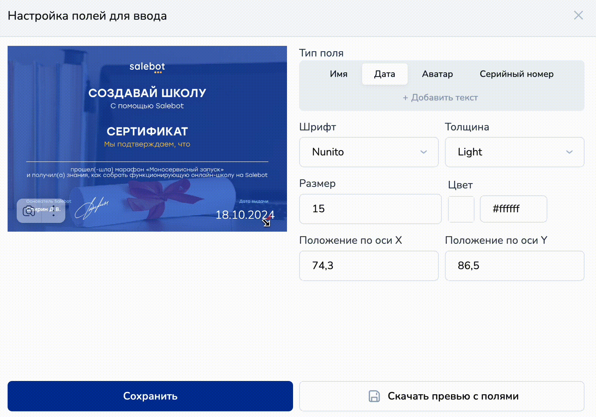

# Создание сертификата

При помощи конструктора сертификатов от Salebot можно создавать и настраивать любые сертификаты на ваш вкус, без углубленных технических знаний.


Выпущенные сертификаты можно пересоздавать и изменять при необходимости


Конструктор сертификатов от Salebot предоставляет возможность создания сертификата с привязкой к вашему курсу или без нее.&#x20;

<figure><figcaption></figcaption></figure>

Настраивайте сертификат, воплощая свою фантазию в реальность, используйте любые изображения, которые нравятся именно вам, вставляйте разнообразные тексты и форматируйте их по своему усмотрению. В статье рассмотрим с вами настройки конструктора сертификатов на Salebot.

## Как создать сертификат

Для создания сертификата перейдите во вкладку “Курсы”, где сверху будут расположены две вкладки - необходимо перейти в “Конструктор сертификатов":

<figure><figcaption></figcaption></figure>

Если у вас еще нет созданных сертификатов, то кнопка отображается в рабочей области по центру; если же у вас есть готовые продукты, то - в правой части экрана.

<figure><figcaption></figcaption></figure>

После клика по кнопке "Создать сертификат" вы перейдете в основные настройки сертификата.

<figure><figcaption></figcaption></figure>

### Основные настройки сертификата

В основных настройках сертификата настраивается формат, привязка к курсу, если у вас уже имеется курс, и выбирается изображение для сертификата.

<figure><figcaption></figcaption></figure>

**Название сертификата** - текстовое поле для наименования вашего сертификата.

<figure><figcaption></figcaption></figure>

**Формат сертификата** позволяет выбрать форму вашего сертификата: 1:1 (квадратный), 16:9 (прямоугольный) или 4:3 (портретный)

<figure><figcaption></figcaption></figure>


Обращаем внимание!&#x20;

Загружаемое изображение должно соответствовать выбранному формату.&#x20;


**Далее можно выбрать курс,** к которому будет привязан ваш сертификат, и тариф.&#x20;

<figure><figcaption></figcaption></figure>

В случае, если у вас нет курсов, можно пропустить этот шаг.


Необязательно добавлять определенный курс или тариф внутри настройки: тогда сертификат по окончанию будет выдаваться ученикам, прошедшим любой из каких-либо созданных онлайн-курсов на различных тарифах.&#x20;


Если вы хотите выдавать в качестве сертификата персонализированное изображение, то воспользуйтесь чекбоксом "Кастомное изображение" без привязки к курсу:

<figure><figcaption></figcaption></figure>


Как создавать персонализированные изображения и выдавать их через бота, рассказали в статье "[Персонализированные изображения](/broken/pages/3cInDufMPZ6EgDnyYDvw)".


В поле **“Загрузите сертификат”** вставьте изображение, которое будет фоном вашего сертификата.&#x20;

<figure><figcaption></figcaption></figure>

Изображение можно загрузить с вашего устройства или добавить ссылку на него из файлового хранилища.&#x20;

Чтобы добавить сертификат из хранилища, загрузите изображение в соответствующем разделе:&#x20;

<figure><figcaption></figcaption></figure>

<figure><figcaption></figcaption></figure>

Далее скопируйте на него ссылку:

<figure><figcaption></figcaption></figure>

И вставьте ссылку в поле URL в конструкторе сертификатов:

<figure><figcaption></figcaption></figure> <figure><figcaption></figcaption></figure>

После чего нажмите на кнопку “Сохранить”:

<figure><figcaption></figcaption></figure>

Далее появляется строчка “Настроить поля для ввода” - чтобы продолжить настройки сертификата, нажмите на нее:

<figure><figcaption></figcaption></figure>

### Настройки полей для ввода


Важно!

На сертификате будут отображаться данные, которые ученик ввел в своем личном кабинете. Поэтому важно уведомить ваших учеников, что данные должны быть введены корректно: ФИО, фотография ученика.


В настройках полей для ввода настраиваются текстовые элементы, которые будут автоматически заполнятся при выдаче сертификата.

<figure><figcaption></figcaption></figure>

**Имя** - кому выдается сертификат: когда ученик пройдет курс, именно его имя будет расположено на сертификате.&#x20;

Вы можете выбрать шрифт, толщину, размер, цвет текста, а также расположение на сертификате:

<figure><figcaption></figcaption></figure>

При наведении курсора на текст на изображении, курсор меняется на значок “руки” и вы можете переместить текстовый элемент в любое необходимое для вас место на сертификате. Также если навести курсор на текст в правом нижнем углу, появляется возможность изменить размер текста. Изменения отображаются в панели настроек.

<figure><figcaption></figcaption></figure>

**Дата** - дата выдачи сертификата соответствует дате прохождения всех уроков, если на курсе есть домашние задания, то дате сдачи последнего домашнего задания.

<figure><figcaption></figcaption></figure>

**Аватар** - здесь будет размещен аватар вашего ученика. Вы также можете изменить местоположение, выбрать форму вашего аватара:

<figure><figcaption></figcaption></figure>

* круглая или квадратная,&#x20;
* сделать обводку, выбрав цвет и толщину обводки.


Обратите внимание!&#x20;

1. Если вы не хотите, чтобы на вашем сертификате отображался аватар, не заполняйте поля.
2. В случае, если выберете отображение аватара на сертификате, а фотография не будет загружена в личный кабинет ученика, на сертификате будет отображаться пустой аватар.&#x20;


**Серийный номер сертификата** состоит из серии и номера. Серию вы можете вписать самостоятельно и отредактировать аналогично имени или дате. Номер формируется автоматически при выдаче сертификата.

<figure><figcaption></figcaption></figure>

Также вы можете добавить любой текст:

<figure><figcaption></figcaption></figure>

Для этого нажмите на “Добавить текст”, далее введите необходимый текст и редактируйте его по своему вкусу. Чтобы увеличить или уменьшить размер вашего текста, необходимо ввести в поле “Размер” цифровое значение.


Если вы хотите чтобы текст был в едином стиле, вы можете скопировать размер и цвет текста, и выбрать соответствующие шрифт и толщину.


Чтобы не потерять весь прогресс настройки, кликните по кнопке “Сохранить”:

<figure><figcaption></figcaption></figure>

После настройки всех данных  можете скачать превью, чтобы посмотреть, как будет выглядеть сертификат у ваших учеников:

<figure><figcaption></figcaption></figure>


Все созданные сертификаты отображаются в "Конструкторе сертификатов": вы всегда можете заменить их или изменить настройки.


Теперь ваши ученики могут получить сертификат после прохождения всех уроков или сдачи всех домашних заданий (если они имеются на курсе) в своем личном кабинете.

## Выдача сертификатов через чат-бот

Для настройки выдачи сертификатов через Чат-бот перейдите в схему блоков бота, через который будет происходить выдача.

В схеме создаем блок, в калькуляторе указываем функцию:

**get\_certificate(course\_id, name\_on\_cert, avatar, date, tariff\_id, texts)**


Внимание!&#x20;

Использование функции в боте эквивалентно отправлению 10 сообщений.&#x20;



&#x20;Перед использованием функции настройте сертификат в курсе.&#x20;


<table><thead><tr><th width="231">Параметры функции</th><th>Описание параметра</th></tr></thead><tbody><tr><td><mark style="color:red;"><strong>!</strong></mark><strong> course_id</strong></td><td> идентификатор курса </td></tr><tr><td><mark style="color:red;"><strong>!</strong></mark><strong> name_on_cert</strong></td><td>
имя на сертификате 

(<em>можете спрашивать или брать прямо из карточки клиента</em>)
</td></tr><tr><td><strong>avatar</strong></td><td>
необязательный параметр, 1 - если нужно передать аватар клиента, 0 - если нет 

<em>(0 значение по умолчанию, не забудьте настроить отображение аватара в курсе, если хотите его передавать)</em>
</td></tr><tr><td><strong>date</strong></td><td>
необязательный параметр, дата в произвольном формате 

<em>(по умолчанию будет текущая)</em>
</td></tr><tr><td><strong>tariff_id</strong></td><td>
необязательный параметр, нужен если хотите выдать сертификат, настроенный на тариф 

(<mark style="color:red;"><strong>!</strong></mark> <em>предварительно тариф нужно настроить</em>)
</td></tr><tr><td>texts</td><td>
необязательный параметр, в который нужно передать массив с текстами. 

(<em>если вы передадите <strong>больше текстов</strong>, чем настроили, то <strong>лишние просто отбросит</strong>; если передадите <strong>меньше</strong>, то <strong>отобразит</strong></em> <em><strong>те, что передали</strong></em>)
</td></tr></tbody></table>

<mark style="color:red;">**!**</mark> Ошибки в передаче параметров:

1. Если параметр **course\_id** передан неверно, то функция вернет ошибку <mark style="color:red;">**wrong course\_id**</mark>
2. Если параметр **tariff\_id** передан не верно, то вернет ошибку <mark style="color:red;">**wrong tariff\_id**</mark>


Если все настройки были сделаны правильно, бот пришлет пользователю сертификат с ссылкой.



По функции выдачи персонализированных изображений через конструктор сертификатов, читайте в статье "[Персонализированные изображения](/broken/pages/3cInDufMPZ6EgDnyYDvw)".


## Видео-обзор "Как создать сертификат для онлайн-курсов и настроить его выдачу":


