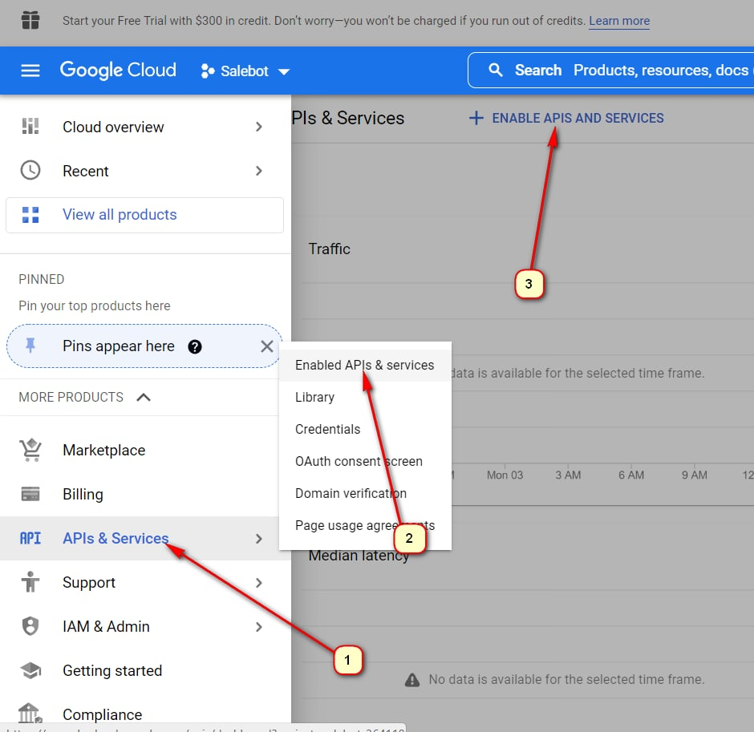

# Google-календарь

* [Как создать сервисный аккаунт](google-kalendar.md#kak-sozdat-servisnyi-akkaunt)
* [Как загрузить файл ключей](google-kalendar.md#kak-zagruzit-fail-klyuchei)
* [Как найти идентификатор календаря](google-kalendar.md#kak-naiti-identifikator-kalendarya)
* [Как создать новый календарь](google-kalendar.md#kak-sozdat-novyi-kalendar)
* [Как получить информацию о календаре](google-kalendar.md#kak-poluchit-informaciyu-o-kalendare)
* [Как получить список календарей сервисного аккаунта](google-kalendar.md#kak-poluchit-spisok-kalendarei-servisnogo-akkaunta)
* [Как работать с событиями/мероприятиями (Events)](google-kalendar.md#kak-rabotat-s-sobytiyami-meropriyatiyami-events)

## **Как создать сервисный аккаунт**

Для этого необходимо зарегистрировать свой аккаунт в сервисах [Google](https://console.developers.google.com/cloud-resource-manager).

Переходим по ссылке и создаем проект:

Придумываем название для проекта

Нажимаем Create и немного ждем, пока создается аккаунт.

Перезагружаем страницу. Нажимаем “F5”

Проверяем права доступа. Должно быть Полное -”Owner”

\
Переходим в настройки сервисного аккаунта

Заходим в “Сервисные аккаунты”

и создаём Сервисный аккаунт

Вводим название и почту сервисного аккаунта: 

Далее роль -> owner (Владелец):

Сохраняем и попадаем в список сервисных аккаунтов. Переходим в настройки ключей и создаем новый:

Сразу после создания ключ автоматически загрузится на ваш компьютер. Далее его нужно загрузить на хостинг или в конструктор Salebot и передавать ссылку на него в параметрах запросов, передавая полученный URL в параметре **creds\_path.**

Теперь надо добавить наше API-интеграции. Для этого заходим сюда.

<figure><figcaption></figcaption></figure>

Находим api календаря и включаем его в этом сервисном аккаунте:

На этом создание сервисного аккаунта завершено.

## **Как загрузить файл ключей**

Переходим в проект и загружаем полученный файл в блок, наприме&#x440;**,** вот так:

.png>)

Нажимаем "Готово" и переходим в тестового бота:

.png>)

Вводим фразу, которую задали для входа в блок. В примере это 123. В ответ получаем ссылку на файл с ключами: 


Блок удалять нельзя, иначе файл удалится с сервера и нужно будет заново добавлять.


Не забудьте в дальнейшем блок схемы бота выставить как "**Не состояние**", чтобы в дальнейшем не возникла утечка ключа:&#x20;

.png>)

Эту ссылку можно сохранить в переменную или передавать в параметре creds\_path как есть.

## **Как найти идентификатор календаря**

Идентификатор существующего календаря можно посмотреть в его настройках:

## **Как создать новый календарь**

Создать новый календарь можно двумя способами: вручную и через функцию (расскажем ниже).

Ручное создание календаря:

Чтобы можно было добавлять записи и редактировать существующий календарь **(**&#x438;ли созданный вручную), нужно добавить соответствующий доступ сервисному аккаунту. Для этого перейдите в настройки нужного календаря и добавьте email сервисного аккаунт&#x430;**.**

### **Как создать календарь с помощью функции**

<mark style="color:red;">**!**</mark>**&#x20;URL функции:** [https://store.salebot.pro/function/gcalendar](https://store.salebot.pro/function/gcalendar)

<mark style="color:red;">**!**</mark>**&#x20;Тип запроса**: POST-json




| Параметры   | Значение                                                                                   | Примечание |
| ----------- | ------------------------------------------------------------------------------------------ | ---------- |
| creds\_path | ссылка на ключ доступа сервисного аккаунта к апи календаря (полученный по инструкции выше) |            |
| command     | create                                                                                     |            |
| name        | название календаря                                                                         |            |
| description | описание календаря                                                                         |            |



<table><thead><tr><th width="263">Параметры</th><th>Описание параметров</th></tr></thead><tbody><tr><td>time_zone </td><td>Часовой пояс календаря. Идентификатор часового пояса IANA. По умолчанию: Europe/Moscow</td></tr><tr><td>location </td><td>географическое положение календаря в виде текста произвольной формы</td></tr><tr><td>owner_email </td><td>
емейл аккаунта, который будет добавлен как владелец календаря. 

С помощью данного параметра можно дать <strong>доступ</strong> другому аккаунту, например, своему основному аккаунту
</td></tr></tbody></table>




&#x20;По умолчанию календарь создастся в сервисном аккаунте. Чтобы иметь возможность визуального редактирования календаря из своего аккаунта, передавайте свой email в параметре owner\_email


Пример:

{"creds\_path": "https://files.salebot.pro/uploads/message/file/30037/calendar-project-320517-c241d9ab0577.json", "calendar\_id": "mail@gmail.com", "command": "update\_event", "event\_id": "v40c3d6j2ibl6vpg2m842538l0", "popup\_minutes": "11","email\_minutes": "22" }

**Сохраняемые значения из JSON-ответа:**

После успешного выполнения функция вернет следующие параметры, которые можно сохранить:

`{'kind': 'calendar#calendar', 'etag': '"WgASl9FY_5zrEmCZvrt4Qlh6tGQ"', 'id': '7e2q3mka5dmfmcohdltfupclj4@group.calendar.google.com', 'summary': 'Название календаря’', 'timeZone': 'UTC'}`\
\
Сохраним id созданного календаря:\
id -> calendar\_id

Для тестирования вы можете вывести на экран переменную #{custom\_answer}.&#x20;

Если был передан email (параметр owner\_email), то после успешного запроса необходимо перейти во Входящие и подтвердить добавление календаря в ваш аккаунт:

## **Как получить информацию о календаре**

**URL функции:** [https://store.salebot.pro/function/gcalendar](https://store.salebot.pro/function/gcalendar)

**Тип запроса:** POST-json

**Параметры:**

<table><thead><tr><th width="342">Параметры</th><th>Описание параметра</th></tr></thead><tbody><tr><td>creds_path </td><td>ссылка на ключ доступа сервисного аккаунта к апи календаря (полученный по инструкции выше)</td></tr><tr><td>command</td><td>get_calendar</td></tr><tr><td>calendar_id</td><td>идентификатор календаря</td></tr></tbody></table>

**Сохраняемые значения из JSON-ответа:**\
После успешного выполнения функция вернет следующие параметры, которые можно сохранить. Пример ответа функции:

`{'kind': 'calendar#calendar', 'etag': '"6KN4OTLeoqGGu7Nr5uNIQgCGYsU"', 'id': 'rcdd8mimc6gjtasan9ansn8354@group.calendar.google.com', 'summary': 'Название календаря', 'timeZone': 'UTC'}` 

## **Как получить список календарей сервисного аккаунта**

**URL функции:** [https://store.salebot.pro/function/gcalendar](https://store.salebot.pro/function/gcalendar)

**Тип запроса**: POST-json

**Параметры**:

<table><thead><tr><th width="252">Параметры</th><th>Значение</th></tr></thead><tbody><tr><td>creds_path</td><td>ссылка на ключ доступа сервисного аккаунта к апи календаря (полученный по инструкции выше)</td></tr><tr><td>command</td><td>calendars_list</td></tr></tbody></table>

**Сохраняемые значения из JSON-ответа:**

После успешного выполнения функция вернет следующие параметры, которые можно сохранить. Пример ответа функции:

`{`\
&#x20; `'kind': 'calendar#calendarList',`\
&#x20; `'etag': '"p32o8pm47rfqf20g"',`\
&#x20; `'nextSyncToken': 'CLCM2Ifb9PECEi5nc2hlZXRzQGdzaGVldHMtMjU0NzEzLmlhbS5nc2VydmljZWFjY291bnQuY29t',`\
&#x20; `'items': [`\
&#x20;   `{`\
&#x20;     `'kind': 'calendar#calendarListEntry',`\
&#x20;     `'etag': '"1625235372775000"',`\
&#x20;     `'id': '74u4aogu34hisgvi9v0pjriqho@group.calendar.google.com',`\
&#x20;     `'summary': 'AAAAAAAAaa',`\
&#x20;     `'timeZone': 'Asia/Singapore',`\
&#x20;     `'colorId': '17',`\
&#x20;     `'backgroundColor': '#9a9cff',`\
&#x20;     `'foregroundColor': '#000000',`\
&#x20;     `'selected': True,`\
&#x20;     `'accessRole': 'owner',`\
&#x20;     `'defaultReminders': [`\
&#x20;     `]`\
&#x20;   `},`\
&#x20;   `{`\
&#x20;     `'kind': 'calendar#calendarListEntry',`\
&#x20;     `'etag': '"1625235805096000"',`\
&#x20;     `'id': '5u9q24kdh571mnm667t2d3q16c@group.calendar.google.com',`\
&#x20;     `'summary': 'AAAAAAAAaa',`\
&#x20;     `'timeZone': 'Asia/Singapore',`\
&#x20;     `'colorId': '21',`\
&#x20;     `'backgroundColor': '#cca6ac',`\
&#x20;     `'foregroundColor': '#000000',`\
&#x20;     `'selected': True,`\
&#x20;     `'accessRole': 'owner',`\
&#x20;    `'defaultReminders': [`\
&#x20;     `]`\
&#x20;   `}`\
&#x20; `]`\
`}`

## **Как работать с событиями/мероприятиями (Events)**

### **Быстрое добавление события (мероприятия)**

**URL функции:** [https://store.salebot.pro/function/gcalendar](https://store.salebot.pro/function/gcalendar)

**Тип запроса**: POST-json

**Параметры:**

creds\_path - ссылка на ключ доступа сервисного аккаунта к апи календаря (полученный по инструкции выше)\
command - quick\_add\_event\
calendar\_id - идентификатор календаря\
event\_name - название события

Пример параметров: \
`{"creds_path": "https://files.salebot.pro/uploads/message/file/30037/calendar-project-320517-c241d9ab0565.json",`\
`"calendar_id": "i9svertstvoo2fq1o0i8cn39a8@group.calendar.google.com",`\
`"command": "quick_add_event","event_name": "Супер мероприятие"}`\
\
**Сохраняемые значения из JSON-ответа:**

После успешного выполнения функция вернет следующие параметры, которые можно сохранить по своему усмотрению.&#x20;

Для дальнейшего редактирования созданного события рекомендуется сохранить его идентификатор: id -> event\_id

Пример ответа функции:

`{'kind': 'calendar#event', 'etag': '"3253879667088000"', 'id': 'ljp7a3ocp8oorbov9u2cq221s0', 'status': 'confirmed', 'htmlLink': 'https://www.google.com/calendar/event?eid=bGpwN2Ezb2NwOG9vcmJvdjl1MmNxMjIxczAgaTlzdmVydHN0dm9vMmZxMW8waThjbjM5YThAZw', 'created': '2021-07-22T07:43:53.000Z', 'updated': '2021-07-22T07:43:53.544Z', 'creator': {'email': 'gsheets@gsheets-254713.iam.gserviceaccount.com'}, 'organizer': {'email': 'i9svertstvoo2fq1o0i8cn39a8@group.calendar.google.com', 'displayName': 'Testov', 'self': True}, 'start': {'dateTime': '2021-07-22T07:43:53Z', 'timeZone': 'UTC'}, 'end': {'dateTime': '2021-07-22T08:43:53Z', 'timeZone': 'UTC'}, 'iCalUID': 'ljp7a3ocp8oorbov9u2cq221s0@google.com', 'sequence': 0, 'reminders': {'useDefault': True}, 'eventType': 'default'}` 

.png>)

### **Как добавить событие (мероприятие)**

**URL функции:** [https://store.salebot.pro/function/gcalendar](https://store.salebot.pro/function/gcalendar)

**Тип запроса:** POST-json

**Параметры:**

<table><thead><tr><th width="256">Параметры</th><th>Значение</th></tr></thead><tbody><tr><td>creds_path </td><td>ссылка на ключ доступа сервисного аккаунта к апи календаря (полученный по инструкции выше)</td></tr><tr><td>command</td><td>add_event</td></tr><tr><td>calendar_id</td><td>идентификатор календаря</td></tr><tr><td>event_name </td><td>название события</td></tr></tbody></table>

Также нужно указать один из вариантов: дату или дату и время.\
Если мероприятие будет проводится весь день, то нужно передать даты:

1. start\_date - дата начала мероприятия в формате дд.мм.гггг (23.07.2021)
2. end\_date - дата завершения мероприятия в формате дд.мм.гггг (24.07.2021)

Если мероприятие в определенное время, то нужно передать дату:

1. start\_datetime - дата и время начала мероприятия в формате дд.мм.гггг чч:мм (23.07.2021 12:00)
2. end\_datetime - дата и время завершения мероприятия в формате дд.мм.гггг чч:мм (24.07.2021 13:00)
3. time\_zone - Часовой пояс события. Идентификатор часового пояса IANA. По умолчанию: Europe/Moscow


Если часовой пояс календаря и события разный, то событие добавится со временем в часовом поясе календаря.


**Пример:**

Календарь в часовом поясе (чс) Europe/Moscow +3, а событие добавляется с часовым поясом Europe/Berlin +2. Время события 12:00 (чс +2) в календарь добавится на 13:00, так как по московскому времени 13:00 соответствует 12:00 в часовом поясе +2

**Дополнительные параметры:**

<table><thead><tr><th width="210">Параметры</th><th width="204">Значение</th><th>Примечание</th></tr></thead><tbody><tr><td><strong>event_description</strong> </td><td>описание события</td><td></td></tr><tr><td><strong>location</strong></td><td>географическое положение мероприятия в виде текста произвольной формы</td><td></td></tr><tr><td><strong>email_minutes</strong></td><td>время в минутах: за сколько до начала события отправить уведомление участникам на емейл</td><td></td></tr><tr><td><strong>popup_minutes</strong></td><td>время в минутах: за сколько до начала события отправить уведомление участникам во всплывающих уведомлениях.</td><td></td></tr><tr><td><strong>transparency</strong></td><td>блокировка времени в календаре, может принимать два значения "opaque" или "transparent"</td><td>
"opaque" - значение по умолчанию. Событие блокирует время в календаре. Это эквивалентно настройке Показывать как занятой в пользовательском интерфейсе календаря. 

"transparent" — событие не блокирует время в календаре. Это эквивалентно настройке «Показать как доступно» в пользовательском интерфейсе календаря.
</td></tr><tr><td><strong>recurrence_days</strong></td><td>параметр для задания периодичности события. </td><td>
Например: 

"SU,MO,TU,WE,TH,FR,SA" - событие активно каждую неделю каждый день.

"MO,TU,WE,TH,FR" - событие активно каждую неделю каждый день. кроме субботы и воскресенья
</td></tr><tr><td>recurrence_until </td><td>Дата до которой событие должно повторяться (включительно). </td><td>Указывается в формате: 20240525</td></tr><tr><td>recurrence_count</td><td> количество раз, которое должно повториться это событие</td><td></td></tr></tbody></table>


Параметры recurrence\_count и recurrence\_until одновременно не используются. \
Если переданы оба параметра, будет использован только recurrence\_until




Календарь в часовом поясе (чс) Europe/Moscow +3, а событие добавляется с часовым поясом Europe/Berlin +2. Время события 12:00 (чс +2) в календарь добавится на 13:00, так как по московскому времени 13:00 соответствует 12:00 в часовом поясе +2

`{"creds_path": "https://files.salebot.pro/uploads/message/file/30037/calendar-project-320517-c241d9ab0565.json",`\
`"calendar_id": "i9svertstvoo2fq1o0i8cn39a8@group.calendar.google.com",`\
`"command": "add_event",`\
`"event_name": "Супер мероприятие",`\
`"start_datetime": "27.07.2021 12:00", "end_datetime": "27.07.2021  14:00"}`



Создать событие на каждую неделю с 07:00 до 16:00 по понедельникам, вторникам, четвергам и пятницам.&#x20;

Параметры:

`{ "creds_path": "https://files.salebot.pro/uploads/message/file/1/calendar-project-320517-c241d9ab0577.json", "calendar_id": "mail@gmail.com", "command": "add_event", "event_name": "Супер мероприятие 23", "start_datetime": "#{current_date} 07:00", "end_datetime": "#{current_date} 16:00", "recurrence_days": "MO,TU,TH,FR" }`

<figure><figcaption></figcaption></figure>



**Сохраняемые значения из JSON-ответа:**

После успешного выполнения функция вернет следующие параметры, которые можно сохранить.&#x20;

Для дальнейшего редактирования созданного события рекомендуется сохранить его идентификатор: \
id -> event\_id

**Пример ответа функции:**\
`{'kind': 'calendar#event', 'etag': '"3254057128970000"', 'id': 'ittr5291ppi7snapn8jbct5krs', 'status': 'confirmed', 'htmlLink': 'https://www.google.com/calendar/event?eid=aXR0cjUyOTFwcGk3c25hcG44amJjdDVrcnMgaTlzdmVydHN0dm9vMmZxMW8waThjbjM5YThAZw', 'created': '2021-07-23T08:22:35.000Z', 'updated': '2021-07-23T08:22:53.109Z', 'summary': 'Новое событие44', 'description': 'Descri xbb xhjxkv', 'location': 'city London', 'creator': {'email': 'gsheets@gsheets-254713.iam.gserviceaccount.com'}, 'organizer': {'email': 'i9svertstvoo2fq1o0i8cn39a8@group.calendar.google.com', 'displayName': 'Testov', 'self': True}, 'start': {'dateTime': '2021-07-23T13:30:00Z', 'timeZone': 'Europe/Moscow'}, 'end': {'dateTime': '2021-07-23T14:00:00Z', 'timeZone': 'Europe/Moscow'}, 'iCalUID': 'ittr5291ppi7snapn8jbct5krs@google.com', 'sequence': 0, 'attendees': [{'email': 'vasya@gmail.com', 'displayName': 'Vasya', 'responseStatus': 'needsAction'}], 'reminders': {'useDefault': False, 'overrides': [{'method': 'email', 'minutes': 10}, {'method': 'popup', 'minutes': 10}]}, 'eventType': 'default'}` 

.png>)

### Редактирование события (мероприятия)&#x20;

**URL функции:** [https://store.salebot.pro/function/gcalendar](https://store.salebot.pro/function/gcalendar)&#x20;

**Тип запроса:** POST-json&#x20;

**Параметры обязательные:**

<table><thead><tr><th width="297">Параметры</th><th>Значение</th></tr></thead><tbody><tr><td><strong>creds_path</strong></td><td> ссылка на ключ доступа сервисного аккаунта к апи календаря (полученный по инструкции выше) </td></tr><tr><td><strong>command</strong> </td><td>update_event</td></tr><tr><td>calendar_id </td><td>идентификатор календаря </td></tr><tr><td><strong>event_id</strong></td><td>идентификатор изменяемого события</td></tr></tbody></table>

**Возможные параметры для обновления:**&#x20;

<table><thead><tr><th width="295">Параметры</th><th>Значение</th></tr></thead><tbody><tr><td><strong>event_name</strong> </td><td>название события </td></tr><tr><td><strong>event_description</strong> </td><td>описание события location - географическое положение мероприятия в виде текста произвольной формы </td></tr><tr><td><strong>email_minutes</strong> </td><td>время в минутах: за сколько до начала события отправить уведомление участникам на емейл </td></tr><tr><td><strong>popup_minutes</strong> </td><td>время в минутах: за сколько до начала события отправить уведомление во всплывающих уведомлениях </td></tr></tbody></table>

Можно передать как один, так и несколько параметров.&#x20;

Если мероприятие будет проводится весь день, то можно передать даты:&#x20;

**start\_date** - дата начала мероприятия в формате дд.мм.гггг (23.07.2021)&#x20;

**end\_date** - дата завершения мероприятия в формате дд.мм.гггг (24.07.2021)&#x20;

Если мероприятие в определенное время, то можно передать дату со временем:&#x20;

**start\_datetime** - дата и время начала мероприятия в формате дд.мм.гггг чч:мм (23.07.2021 12:00)&#x20;

**end\_datetime** - дата и время завершения мероприятия в формате дд.мм.гггг чч:мм (24.07.2021 13:00)&#x20;

**time\_zone** - Часовой пояс события. Идентификатор часового пояса IANA. По умолчанию: Europe/Moscow

**transparency** - блокировка времени в календаре, может принимать два значения "opaque" или "transparent":

* "**opaque**" - значение по умолчанию. Событие блокирует время в календаре. Это эквивалентно настройке Показывать как занятой в пользовательском интерфейсе календаря.&#x20;
* "**transparent**" — событие не блокирует время в календаре. Это эквивалентно настройке «Показать как доступно» в пользовательском интерфейсе календаря.

**recurrence\_days** - параметр для задания периодичности события. Например: "SU,MO,TU,WE,TH,FR,SA" - событие активно каждую неделю каждый день. "MO,TU,WE,TH,FR" - событие активно каждую неделю каждый день. кроме субботы и воскресенья.

**Пример параметров:**&#x20;



`{"creds_path": "https://files.salebot.pro/uploads/message/file/30037/calendar-project-320517-c241d9ab0565.json", "calendar_id": "i9svertstvoo2fq1o0i8cn39a8@group.calendar.google.com", "event_id": "j1lcpm4q2p9c0cv705alv3brug", "command": "update_event", "event_name": "Обновленное мероприятие", "start_datetime": "27.07.2021 12:00", "end_datetime": "27.07.2021 14:00","popup_minutes": "11","email_minutes": "22"}`



`{ "creds_path": "https://files.salebot.pro/uploads/message/file/30037/calendar-project-320517-c241d9ab0577.json", "calendar_id": "mail@gmail.com", "command": "update_event", "event_id": "v40c3d6j2ibl6vpg2m842538l0", "popup_minutes": "11","email_minutes": "22", "recurrence_days": "MO,TU,FR" }`



**Сохраняемые значения из JSON-ответа:**&#x20;

После успешного выполнения функция вернет следующие параметры, которые можно сохранить.

**Пример ответа функции:** `{"kind":"calendar#event","etag":""3276713558524000"","id":"j1lcpm4q2p9c0cv705alv3brug","status":"confirmed","htmlLink":"https://www.google.com/calendar/event?eid=ajFsY3BtNHEycDljMGN2NzA1YWx2M2JydWcgaTlzdmVydHN0dm9vMmZxMW8waThjbjM5YThAZw","created":"2021-12-01T10:40:11.000Z","updated":"2021-12-01T10:43:16.738Z","summary":"Супер","creator":{"email":"gsheets@gsheets-254713.iam.gserviceaccount.com"},"organizer":{"email":"i9svertstvoo2fq1o0i8cn39a8@group.calendar.google.com","displayName":"Testov","self":true},"start":{"dateTime":"2021-12-28T09:00:00Z","timeZone":"Europe/Moscow"},"end":{"dateTime":"2021-12-29T11:00:00Z","timeZone":"Europe/Moscow"},"iCalUID":"j1lcpm4q2p9c0cv705alv3brug@google.com","sequence":0,"reminders":{"useDefault":false,"overrides":[{"method":"email","minutes":22},{"method":"popup","minutes":12}]},"eventType":"default","update_status":"ok"}`

### **Получить список событий (мероприятий)**

**URL функции:** [https://store.salebot.pro/function/gcalendar](https://store.salebot.pro/function/gcalendar)

**Тип запроса:** POST-json

**Параметры**:



| Параметры    | Значение                                                                                   |
| ------------ | ------------------------------------------------------------------------------------------ |
| creds\_path  | ссылка на ключ доступа сервисного аккаунта к апи календаря (полученный по инструкции выше) |
| command      | get\_event\_list                                                                           |
| calendar\_id | идентификатор календаря                                                                    |



<table><thead><tr><th width="268">Значение</th><th>Описание</th></tr></thead><tbody><tr><td>start_date </td><td>дата от которой искать события в формате дд.мм.гггг (23.07.2021)</td></tr><tr><td>end_date </td><td>дата до которой искать события в формате дд.мм.гггг (24.07.2021)</td></tr></tbody></table>

Если не передавать дополнительные события, то результатом будет список событий за сегодняшний день.



Пример параметров:\
Будут найдены события за 23 июля

`{"creds_path": "https://files.salebot.pro/uploads/message/file/30037/calendar-project-320517-c241d9ab0565.json",`\
`"calendar_id": "i9svertstvoo2fq1o0i8cn39a8@group.calendar.google.com",`\
`"command": "get_event_list",`\
`"start_date": "22.07.2021", "end_date": "23.07.2021"}`

**Сохраняемые значения из JSON-ответа:**

После успешного выполнения функция вернет следующие параметры, которые можно сохранить.

Список найденных событий можно сохранить в переменную: items -> event\_list

Пример ответа функции:

`{'kind': 'calendar#events', 'etag': '"p33odnesrinsv20g"', 'summary': 'Testov', 'description': 'Testov description', 'updated': '2021-07-23T12:13:05.686Z', 'timeZone': 'UTC', 'accessRole': 'owner', 'defaultReminders': [], 'items': [{'kind': 'calendar#event', 'etag': '"3254084771372000"', 'id': '6d8rocb9e2r21ue37jgsa0v06i', 'status': 'confirmed', 'htmlLink': 'https://www.google.com/calendar/event?eid=NmQ4cm9jYjllMnIyMXVlMzdqZ3NhMHYwNmkgaTlzdmVydHN0dm9vMmZxMW8waThjbjM5YThAZw', 'created': '2021-07-23T12:11:13.000Z', 'updated': '2021-07-23T12:13:05.686Z', 'summary': 'DDDDDDDDD', 'creator': {'email': 'adnimdd@gmail.com'}, 'organizer': {'email': 'i9svertstvoo2fq1o0i8cn39a8@group.calendar.google.com', 'displayName': 'Testov', 'self': True}, 'start': {'date': '2021-07-20'}, 'end': {'date': '2021-07-21'}, 'transparency': 'transparent', 'iCalUID': '6d8rocb9e2r21ue37jgsa0v06i@google.com', 'sequence': 0, 'reminders': {'useDefault': False}, 'eventType': 'default'}]}`

### **Как переместить события в другой календарь**

**URL функции:** [https://store.salebot.pro/function/gcalendar](https://store.salebot.pro/function/gcalendar)

**Тип запроса**: POST-json

**Параметры**:&#x20;

<table><thead><tr><th width="266">Описание</th><th>Значение</th></tr></thead><tbody><tr><td>creds_path</td><td>ссылка на ключ доступа сервисного аккаунта к апи календаря (полученный по инструкции выше)</td></tr><tr><td>command</td><td>move_event</td></tr><tr><td>calendar_id</td><td>идентификатор календаря, из которого перемещается событие</td></tr><tr><td>event_id </td><td>идентификатор события</td></tr><tr><td>destination_calendar_id</td><td>идентификатор календаря, в который перемещается событие</td></tr></tbody></table>

**Сохраняемые значения из JSON-ответа:**

После успешного выполнения функция вернет следующие параметры, которые можно сохранить. Пример ответа функции:

`{'kind': 'calendar#event', 'etag': '"3253880350568000"', 'id': 'ljp7a3ocp8oorbov9u2cq221s0', 'status': 'cancelled', 'htmlLink': 'https://www.google.com/calendar/event?eid=bGpwN2Ezb2NwOG9vcmJvdjl1MmNxMjIxczAgaTlzdmVydHN0dm9vMmZxMW8waThjbjM5YThAZw', 'created': '2021-07-22T07:43:53.000Z', 'updated': '2021-07-22T07:49:35.284Z', 'creator': {'email': 'gsheets@gsheets-254713.iam.gserviceaccount.com'}, 'organizer': {'email': '88q8fvkrv5ue7orsh109t6o60s@group.calendar.google.com', 'displayName': 'Тестовый календарь'}, 'start': {'dateTime': '2021-07-22T07:43:53Z', 'timeZone': 'UTC'}, 'end': {'dateTime': '2021-07-22T08:43:53Z', 'timeZone': 'UTC'}, 'iCalUID': 'ljp7a3ocp8oorbov9u2cq221s0@google.com', 'sequence': 0, 'reminders': {'useDefault': True}, 'eventType': 'default'}`

### **Как получить информацию о мероприятии**

**URL функции:** [https://store.salebot.pro/function/gcalendar](https://store.salebot.pro/function/gcalendar)

**Тип запроса**: POST-json

**Параметры**:

<table><thead><tr><th width="253">Параметры</th><th>Значение</th></tr></thead><tbody><tr><td>creds_path </td><td>ссылка на ключ доступа сервисного аккаунта к апи календаря (полученный по инструкции выше)</td></tr><tr><td>command </td><td>get_event</td></tr><tr><td>calendar_id </td><td>идентификатор календаря</td></tr><tr><td>event_id </td><td>идентификатор события</td></tr></tbody></table>

**Сохраняемые значения из JSON-ответа:**

После успешного выполнения функция вернет следующие параметры, которые можно сохранить. Пример ответа функции:

`{'kind': 'calendar#event', 'etag': '"3254067331414000"', 'id': 'ittr5291ppi7snapn8jbct5krs', 'status': 'confirmed', 'htmlLink': 'https://www.google.com/calendar/event?eid=aXR0cjUyOTFwcGk3c25hcG44amJjdDVrcnMgaTlzdmVydHN0dm9vMmZxMW8waThjbjM5YThAZw', 'created': '2021-07-23T08:22:35.000Z', 'updated': '2021-07-23T11:12:55.553Z', 'summary': 'Новое событие44', 'description': 'Descri xbb xhjxkv', 'location': 'city London', 'creator': {'email': 'gsheets@gsheets-254713.iam.gserviceaccount.com'}, 'organizer': {'email': 'i9svertstvoo2fq1o0i8cn39a8@group.calendar.google.com', 'displayName': 'Testov', 'self': True}, 'start': {'dateTime': '2021-07-23T13:30:00Z', 'timeZone': 'Europe/Moscow'}, 'end': {'dateTime': '2021-07-23T14:00:00Z', 'timeZone': 'Europe/Moscow'}, 'iCalUID': 'ittr5291ppi7snapn8jbct5krs@google.com', 'sequence': 0, 'attendees': [{'email': 'adnimdd@gmail.com', 'displayName': 'Vasya', 'responseStatus': 'needsAction'}], 'reminders': {'useDefault': False, 'overrides': [{'method': 'email', 'minutes': 10}, {'method': 'popup', 'minutes': 10}]}, 'eventType': 'default'}`

### **Как удалить мероприятие**

**URL функции:** [https://store.salebot.pro/function/gcalendar](https://store.salebot.pro/function/gcalendar)

**Тип запроса**: POST-json

**Параметры**:

<table><thead><tr><th width="273"></th><th></th></tr></thead><tbody><tr><td>creds_path </td><td>ссылка на ключ доступа сервисного аккаунта к апи календаря (полученный по инструкции выше)</td></tr><tr><td>command </td><td>remove_event</td></tr><tr><td>calendar_id</td><td>идентификатор календаря</td></tr><tr><td>event_id</td><td>идентификатор удаляемого события</td></tr></tbody></table>

Сохраняемые значения из JSON-ответа:

После успешного выполнения функция вернет следующие параметры, которые можно сохранить. Пример ответа функции:

`{'status': 'ok'}`

### **Как добавить участника мероприятия**

**URL функции**: [https://store.salebot.pro/function/gcalendar](https://store.salebot.pro/function/gcalendar)

**Тип запроса:** POST-json

**Параметры:**



| Параметры      | Значение                                                                                   |
| -------------- | ------------------------------------------------------------------------------------------ |
| creds\_path    | ссылка на ключ доступа сервисного аккаунта к апи календаря (полученный по инструкции выше) |
| command        | add\_client                                                                                |
| calendar\_id   | идентификатор календаря                                                                    |
| event\_id      | идентификатор события                                                                      |
| client\_email  |  электронная почта клиента                                                                 |




<table><thead><tr><th width="273">Параметры</th><th>Значение</th></tr></thead><tbody><tr><td>name </td><td>описание события</td></tr><tr><td>comment</td><td>комментарий участника</td></tr></tbody></table>



Пример параметров:

`{`\
`"creds_path": "https://files.salebot.pro/uploads/message/file/30037/calendar-project-320517-c241d9ab0565.json",`\
`"calendar_id": "i9svertstvoo2fq1o0i8cn39a8@group.calendar.google.com",`\
`"command": "add_client",`\
`"event_id": "#{event_id}",`\
`"client_email": "asdc@mail.com",`\
`"name": "Viktor",`\
`"comment": "Буду первым!"`\
`}` 

.png>)

**Сохраняемые значения из JSON-ответа:**

Функция всегда возвращает статус добавления add\_status. Он может иметь три значения:

ok - клиент добавлен\
exist - клиент уже записан\
error - ошибка добавления. (Дополнительно с add\_status, будет параметр error\_message с текстом ошибки)

Пример ответа функции при успехе:

`{'kind': 'calendar#event', 'etag': '"3254059247409000"', 'id': 'ittr5291ppi7snapn8jbct5krs', 'status': 'confirmed', 'htmlLink': 'https://www.google.com/calendar/event?eid=aXR0cjUyOTFwcGk3c25hcG44amJjdDVrcnMgaTlzdmVydHN0dm9vMmZxMW8waThjbjM5YThAZw', 'created': '2021-07-23T08:22:35.000Z', 'updated': '2021-07-23T08:58:11.548Z', 'summary': 'Новое событие44', 'description': 'Descri xbb xhjxkv', 'location': 'city London', 'creator': {'email': 'gsheets@gsheets-254713.iam.gserviceaccount.com'}, 'organizer': {'email': 'i9svertstvoo2fq1o0i8cn39a8@group.calendar.google.com', 'displayName': 'Testov', 'self': True}, 'start': {'dateTime': '2021-07-23T13:30:00Z', 'timeZone': 'Europe/Moscow'}, 'end': {'dateTime': '2021-07-23T14:00:00Z', 'timeZone': 'Europe/Moscow'}, 'iCalUID': 'ittr5291ppi7snapn8jbct5krs@google.com', 'sequence': 0, 'attendees': [{'email': 'adnimdd@gmail.com', 'displayName': 'Vasya', 'responseStatus': 'needsAction'}, {'email': 'adnimd@gmail.com', 'displayName': 'Vasya', 'responseStatus': 'needsAction'}, {'email': 'adnidgmd@gmail.com', 'displayName': 'Vasya2', 'responseStatus': 'needsAction'}], 'reminders': {'useDefault': False, 'overrides': [{'method': 'email', 'minutes': 10}, {'method': 'popup', 'minutes': 10}]}, 'eventType': 'default', ‘add_status’: 'ok'}`

### **Как удалить участника мероприятия**

**URL функции**: [https://store.salebot.pro/function/gcalendar](https://store.salebot.pro/function/gcalendar)

**Тип запроса:** POST-json

**Параметры:**

<table><thead><tr><th width="277">Параметры</th><th>Значение</th></tr></thead><tbody><tr><td>creds_path</td><td>ссылка на ключ доступа сервисного аккаунта к апи календаря (полученный по инструкции выше)</td></tr><tr><td>command</td><td>remove_client</td></tr><tr><td>calendar_id </td><td>идентификатор календаря</td></tr><tr><td>event_id</td><td>идентификатор события</td></tr><tr><td>client_email</td><td>электронная почта клиента</td></tr></tbody></table>

**Пример параметров:**

`{`\
`"creds_path": "https://files.salebot.pro/uploads/message/file/30037/calendar-project-320517-c241d9ab0565.json",`\
`"calendar_id": "i9svertstvoo2fq1o0i8cn39a8@group.calendar.google.com",`\
`"command": "remove_client",`\
`"event_id": "#{event_id}",`\
`"client_email": "asdc@mail.com"`\
`}`

**Сохраняемые значения из JSON-ответа:**

Функция всегда возвращает статус добавления remove\_status. Он может иметь три значения:\
1 - клиент успешно удален\
0 - клиент не найден\
error - ошибка удаления. (Дополнительно с remove\_status, будет параметр error\_message с текстом ошибки)

Пример ответа функции при успехе:

`{'kind': 'calendar#event', 'etag': '"3254059247409000"', 'id': 'ittr5291ppi7snapn8jbct5krs', 'status': 'confirmed', 'htmlLink': 'https://www.google.com/calendar/event?eid=aXR0cjUyOTFwcGk3c25hcG44amJjdDVrcnMgaTlzdmVydHN0dm9vMmZxMW8waThjbjM5YThAZw', 'created': '2021-07-23T08:22:35.000Z', 'updated': '2021-07-23T08:58:11.548Z', 'summary': 'Новое событие44', 'description': 'Descri xbb xhjxkv', 'location': 'city London', 'creator': {'email': 'gsheets@gsheets-254713.iam.gserviceaccount.com'}, 'organizer': {'email': 'i9svertstvoo2fq1o0i8cn39a8@group.calendar.google.com', 'displayName': 'Testov', 'self': True}, 'start': {'dateTime': '2021-07-23T13:30:00Z', 'timeZone': 'Europe/Moscow'}, 'end': {'dateTime': '2021-07-23T14:00:00Z', 'timeZone': 'Europe/Moscow'}, 'iCalUID': 'ittr5291ppi7snapn8jbct5krs@google.com', 'sequence': 0, 'attendees': [{'email': 'adnimdd@gmail.com', 'displayName': 'Vasya', 'responseStatus': 'needsAction'}, {'email': 'adnimd@gmail.com', 'displayName': 'Vasya', 'responseStatus': 'needsAction'}, {'email': 'adnidgmd@gmail.com', 'displayName': 'Vasya2', 'responseStatus': 'needsAction'}], 'reminders': {'useDefault': False, 'overrides': [{'method': 'email', 'minutes': 10}, {'method': 'popup', 'minutes': 10}]}, 'eventType': 'default', 'remove_status': '1'}`\
 
