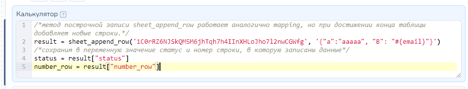
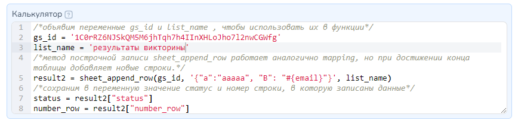

# Google-таблицы


Внимание! Устаревшее!&#x20;

Для лучшей работы с данными загрузите их в [Таблицы Salebot,](/broken/pages/m12tQghvK3rMwVuiUNYr) тогда Ваши боты будут работать намного быстрее и без ошибок, связанных с запросами к google-таблицам.


* [Как подготовить Google таблицу](google-tablicy.md#kak-podgotovit-google-tablicu)
* [Как написать json запрос](google-tablicy.md#kak-napisat-json-zapros)
* [Как осуществлять построчную запись в определенные столбцы](google-tablicy.md#1.-postrochnaya-zapis-v-opredelennye-stolbcy)
* [Как осуществлять запись данных в определенные ячейки](google-tablicy.md#2.-zapis-dannykh-v-opredelennye-yacheiki)
* [Как осуществлять удаление записи из конкретных ячеек](google-tablicy.md#1.-udalenie-zapisi-iz-konkretnykh-yacheek)
* [Как осуществлять запись в первую пустую ячейку строки](google-tablicy.md#3.-zapis-v-pervuyu-pustuyu-yacheiku-stroki)
* [Как осуществлять чтение данных из таблицы](google-tablicy.md#kak-osushestvlyat-chtenie-dannykh-iz-tablicy)
* [Как искать текст в таблице (вывод первой подходящей строки)](google-tablicy.md#1.-kak-iskat-tekst-v-tablice-vyvod-pervoi-podkhodyashei-stroki)
* [Как осуществлять поиск по всем листам и выводить результат поиска в виде списка](google-tablicy.md#2.-kak-osushestvlyat-poisk-po-vsem-listam-i-vyvodit-rezultat-poiska-v-vide-spiska)
* [Как вывести список всех совпадений из таблицы](google-tablicy.md#3.-kak-vyvesti-spisok-vsekh-sovpadenii-iz-tablicy)
* [Как полностью удалить строку (со смещением)](google-tablicy.md#2.-kak-udalit-stroku-polnostyu-so-smesheniem)
* [Как полностью удалить колонку (со смещением)](google-tablicy.md#3.-kak-udalit-kolonku-polnostyu-so-smesheniem)
* [Как сделать кнопки для выбора листа в таблице](google-tablicy.md#kak-sdelat-knopki-dlya-vybora-lista-v-tablice)
* [Как работать через свой аккаунт](google-tablicy.md#rabota-cherez-svoi-akkaunt)
* [Как работать с буквами колонок](google-tablicy.md#kak-rabotat-s-bukvami-kolonok)
* [Как задать переменные в именах колонок](google-tablicy.md#kak-zadat-peremennye-v-imenakh-kolonok)
* [Как осуществлять удаление из таблицы](google-tablicy.md#kak-udalit-dannye)
* [Как добавить лист в таблицу](google-tablicy.md#kak-dobavit-list-v-tablicu)
* [Возможные ошибки](google-tablicy.md#vozmozhnye-oshibki)
* [Функции (API) для работы с Google-таблицей](google-tablicy.md#funkcii-api-dlya-raboty-s-google-tablicei)

Для работы вам потребуется:

1. Google-таблица, открытая на редактирование для всех, у кого есть ссылка&#x20;
2. URL-функции запроса
3. Параметры запроса

## ОБЩАЯ ИНФОРМАЦИЯ

### Как подготовить Google-таблицу

.png>)

 (1).png>)

 (1).png>)

 (1).png>)

### Как написать json-запрос

Переходим в настройки блока, в котором у нас будет осуществляться запись данных таблицу.&#x20;

<figure><figcaption></figcaption></figure>

1. Добавляем раздел API-запрос.
2. Выбираем тип запроса "POST-json"
3. Переходим к заполнению полей запроса:

<figure><figcaption></figcaption></figure>

**URL запроса** - путь к функции для выполнения запроса

**Сохраняемые значения** - перечень параметров ответа запроса с указанием имен переменных, в которые следует сохранить результат в формате: **параметр\_из\_запроса -> ваша\_переменная**

> Если в ответ получаем параметры сложной структуры, то разбираем их так:&#x20;
>
> "cell\_number":{"row":4,"col":2}\
> cell\_number|row -> Строка; cell\_number|col -> Столбец

**Заголовок запроса** - заполняется при необходимости. Чаще всего здесь передаются форматы передаваемых данных и/или токен доступа

**JSON-параметры** - тело запроса, в котором прописываются параметры передаваемых данных в формате:

**{"id": "ид таблицы", "действие":{"имя\_1":"значение", "имя\_2": "#{переменная}"},"creds\_path": "путь к вашему файлу с данными для авторизации"}**

Для понимания в какой структуре запрос возвращает ответ, напишите в поле 'Сообщение' вывод значения переменной #{custom\_answer}.  

<figure><figcaption>
Получение результата выполнения API-запроса в виде сообщения
</figcaption></figure>

### Где взять идентификатор id таблицы

Идентификатор таблицы содержится в ссылке (выделено цветом, после d/ и до /edit):

<figure><figcaption></figcaption></figure>

### Где взять ключ доступа к данным таблицы **creds\_path**

Подробно создание сервисного аккаунта, получение и использование ключа доступа к данным таблицы рассмотрено [тут](https://docs.salebot.pro/integracii/google#podgotovka-servisnogo-akkaunta)


Создание сервисного аккаунта


## **КАК РАБОТАТЬ С GOOGLE-ТАБЛИЦАМИ**

Основные действия с таблицами:

* Запись
* Чтение
* Удаление
* Поиск

Далее подробно разберем каждое из действий над таблицами.

### Как **записать данные**

#### **1. Построчная запись в определенные столбцы**

Вы можете собрать множество данных от пользователя и записать их в первую свободную в таблице строку. Осуществляется с помощью функции **mapping.**&#x20;


В таблице должна быть заполнена шапка (хотя бы одна ячейка в первой строке)


<mark style="color:red;">**!**</mark>**&#x20;URL функции:** [https://store.salebot.pro/function/gsheets](https://store.salebot.pro/function/gsheets)

<mark style="color:red;">**!**</mark>**&#x20;JSON-Параметры запроса**&#x20;

**`{"id": "ид таблицы", "mapping":{"a":"#{переменная}", "b": "#{еще}", "c": "#{еще}", "d":"просто текст"}}`**

Если вы хотите записывать строки не на первом листе, то надо добавить в запрос параметр list\_name:

**`{"id": "ид таблицы", "mapping":{"a":"просто текст", "b": "#{переменная}"}, "list_name": "Название листа"}`**

Параметры:

id - идентификатор таблицы[\*](google-tablicy.md#gde-vzyat-identifikator-id-tablicy)\
a, b, c, d - это как раз имена столбцов\
list\_name - название вашего листа (например, "Лист2")

> Пример ответа:  **{"number\_row":8}**

Если проблем при выполнении запроса не возникло, то в ответ приходит номер строки, который можно сохранить и использовать для дальнейшей работы.

<mark style="color:red;">**!**</mark> Если вы не хотите рисковать и желаете ограничить доступ к своей таблице лишь своей учетной записью, то надо передавать параметр creds\_path с url вашего файла с данными. Подробнее об этом ниже в пункте Работа через свой аккаунт:&#x20;

**`{"id": "ид таблицы", "mapping":{"a":"#{переменная}", "b": "#{еще}", "c": "#{еще}", "d":"просто текст"},"creds_path": "путь к вашему файлу с данными для авторизации"}`**

<figure><figcaption></figcaption></figure>

#### **2. Запись данных в определенные ячейки**

<mark style="color:red;">**!**</mark>**&#x20;URL функции:** https://store.salebot.pro/function/gsheets

<mark style="color:red;">**!**</mark> JSON-Параметры запроса: \
`{"id": "ид таблицы", "write":{"a1":"#{переменная}", "b3": "#{еще}", "c1": "#{еще}", "d20":"просто текст"}}.` \
Запись осуществляется в конкретные ячейки, которые вы укажете (в нашем примере это a1, b3, c1, d20)


Нумерация колонок начинается с единицы.


Если вы хотите записывать строки не на первом листе, то надо добавить в запрос параметр list\_name:

`{"id": "ид таблицы", "write":{"a1":"#{переменная}", "b3": "#{еще}", "c1": "#{еще}", "d20":"просто текст"}, "list_name": "Название листа"}`

Если проблем при выполнении запроса не возникло, то в ответ не приходят никакие параметры.

Если вы не хотите рисковать и желаете ограничить доступ к своей таблице лишь своей учетной записью, то надо передавать параметр creds\_path с url вашего файла с данными. Подробнее об этом ниже в пункте Работа через свой аккаунт:&#x20;

`{"id": "ид таблицы", "write":{"a1":"#{переменная}", "b3": "#{еще}", "c1": "#{еще}", "d20":"просто текст"}, "list_name": "Название листа","creds_path": "путь к вашему файлу с данными для авторизации"}`

<figure><figcaption></figcaption></figure>

#### **3. Запись в первую пустую ячейку строки**

Вы можете записать данные в указанную строку, запись произойдет в пустую ячейку, справа от последней заполненной ячейки. Осуществляется с помощью функции **append\_in\_row**.

<mark style="color:blue;background-color:orange;">**URL функции:**</mark> https://store.salebot.pro/function/gsheets&#x20;

<mark style="background-color:orange;">JSON-Параметры запроса:</mark>&#x20;

**`{"id": "ид таблицы", "append_in_row":"номер строки", "value": "записываемое значение"}`**

Если вы хотите записывать строки не на первом листе, то надо добавить в запрос параметр list\_name:&#x20;

**`{"id": "ид таблицы", "append_in_row":"8", "value": "записываемое значение", "list_name": "Название листа"}`**&#x20;

Параметры:

**id** - это id вашей Google-таблицы. Вы можете получить его из ссылки на вашу таблицу (то, что выделено жирным в ссылке ниже):

https://docs.google.com/spreadsheets/d/<mark style="background-color:red;">**1aUbbUaw2SRnJFAavv06Noa1EzumhyShKDm7ie6lYKc4**</mark>/edit#gid=0

**append\_in\_row** - номер строки, в которую производится запись&#x20;

**value** - значение, которое запишется в ячейку

Если проблем при выполнении запроса не возникло, то в ответ приходит **{"number\_col":10,"col\_name":"J3"}.** Вы можете сохранить эти номера и использовать для дальнейшей работы.


Если вы не хотите рисковать и желаете ограничить доступ к своей таблице лишь своей учетной записью, то надо передавать параметр creds\_path с url вашего файла с данными.&#x20;


Подробнее об этом [Работа через свой аккаунт](https://docs.salebot.pro/integracii/google#podgotovka-servisnogo-akkaunta): \
&#xNAN;**`{"id": "ид таблицы", "mapping":{"a":"#{переменная}", "b": "#{еще}", "c": "#{еще}", "d":"просто текст"},"creds_path": "путь к вашему файлу с данными для авторизации"}`**

<figure><figcaption>
Пример записи данных в первуюпустую ячейку 8 строки
</figcaption></figure>

### Как **осуществлять чтение данных из таблицы**

<mark style="color:red;">**!**</mark>**&#x20;URL функции:** https://store.salebot.pro/function/gsheets

<mark style="color:red;">**!**</mark>**&#x20;JSON-Параметры запроса:**&#x20;

**`{"id": "ид таблицы", "read":{"a1":"a1", "b3":"b4", "c1":"c10", "d20":"a1"}}`**

Параметрами передавайте диапазоны. В примере "a1":"a1" возвращает одну ячейку, а "c1":"c10" 10 значений из колонки C. Возвращаемое значение хеш из адреса ячейки и значения из него.


Нумерация колонок идет с единицы.


Если вы хотите прочитать значения не на первом листе, то надо добавить в запрос параметр list\_name:

**`{"id": "ид таблицы", "read":{"a1":"a3", "b3": "b6"}, "list_name": "Название листа"}`**

Если проблем при выполнении запроса не возникло, то в ответ приходит название ячейки и ее содержимое:{"A1":"\u043f\u0440\u0438\u0432\u0435\u0442","A2":"\u043f\u0435\u0440\u0435\u043c\u0435\u043d\u043d\u0430\u044f","A3":"\u043f\u0435\u0440\u0435\u043c\u0435\u043d\u043d\u0430\u044f","B3":"\u0444\u0443\u043d\u043a\u0446","B4":"\u0444\u0443\u043d\u043a\u0446","B5":"\u0444\u0443\u043d\u043a\u0446"}


Если вы не хотите рисковать и желаете ограничить доступ к своей таблице лишь своей учетной записью, то надо передавать параметр creds\_path с url вашего файла с данными.&#x20;


**Подробнее о работе через свой аккаунт написано** [**здесь**](/broken/pages/AJyv5ldV9fJS174YJDVA)**:**&#x20;

**{"id": "ид таблицы", "read":{"a1":"a3", "b3": "b6"}, "list\_name": "Название листа","creds\_path": "путь к вашему файлу с данными для авторизации"}**

<figure><figcaption></figcaption></figure>

<figure><figcaption>
Пример чтения из таблиц
</figcaption></figure>

### Как **удалить данные**

#### 1. Удаление записи из конкретных ячеек

<mark style="color:red;">**!**</mark> URL функции: https://store.salebot.pro/function/gsheets

<mark style="color:red;">**!**</mark> JSON-Параметры запроса:&#x20;

**`{"id": "ид таблицы", "remove":["a1", "b3", "c2"]}`**.&#x20;

Удалит значения из конкретных ячеек, которые вы укажете (в нашем примере a1, b3, c2)


Нумерация колонок начинается с единицы.


Если вы хотите удалить ячейки не на первом листе, то надо добавить в запрос параметр list\_name:&#x20;

**`{"id": "ид таблицы", "remove":["a1", "b3", "c2"], "list_name": "Название листа"}`**&#x20;

Если проблем при выполнении запроса не возникло, то в ответ не приходят никакие параметры.


Если вы не хотите рисковать и желаете ограничить доступ к своей таблице лишь своей учетной записью, то надо передавать параметр creds\_path с url вашего файла с данными.&#x20;


Подробнее об этом [Работа через свой аккаунт](/broken/pages/AJyv5ldV9fJS174YJDVA):&#x20;

**`{"id": "ид таблицы", "remove":["a1", "b3", "c2"], "list_name": "Название листа","creds_path": "путь к вашему файлу с данными для авторизации"}`**

#### **2. Как удалить строку полностью (со смещением)**

<mark style="color:red;">**!**</mark>**&#x20;URL функции:** https://store.salebot.pro/function/cellerase

<mark style="color:red;">**!**</mark> JSON-Параметры запроса:&#x20;

**`{"id": "ид таблицы", "delrows": "номер строки", "list": "номер листа"}`**\
\
Для использования данного функционала передавайте в функцию следующие параметры:\
**id** - id гугл таблицы \
**delrows** - номер строки (начиная с 1) \
**list** - порядковый номер листа или **list\_name** - имя листа

Пример:\
`{"id": "1JysraU1Bzn3Etyt6_TYSwz1Y7_mEPfgkQnb7BHEm3_0", "delrows": "1", "list": "2" }`\
или\
`{"id": "1JysraU1Bzn3Etyt6_TYSwz1Y7_mEPfgkQnb7BHEm3_0", "delrows": "1", "list_name": "Лист2" }`

#### **3. Как удалить колонку полностью (со смещением)**

<mark style="color:red;">**!**</mark>**&#x20;URL функции:** https://store.salebot.pro/function/cellerase

<mark style="color:red;">**!**</mark> **JSON-Параметры запроса:**&#x20;

**`{"id": "ид таблицы", "delcols": "номер колонки", "list": "номер листа"}`**

Аналогично удалению строки, только нужно передать параметр delcols

**id** - id гугл таблицы \
**delcols** - номер столбца (начиная с 1)\
**list** - порядковый номер листа либо **list\_name** - имя листа

Пример:\
`{"id": "1JysraU1Bzn3Etyt6_TYSwz1Y7_mEPfgkQnb7BHEm3_0", "delcols": "1", "list": "2" }`\
или\
`{"id": "1JysraU1Bzn3Etyt6_TYSwz1Y7_mEPfgkQnb7BHEm3_0", "delcols": "1", "list_name": "Лист2" }`

### Как **искать данные**

#### **1. Как искать текст в таблице (вывод первой подходящей строки)**

<mark style="color:red;">**!**</mark> URL функции:  [https://store.salebot.pro/function/findcell](https://store.salebot.pro/function/findcell)

<mark style="color:red;">**!**</mark> JSON-Параметры запроса:&#x20;

**{"id": "ид таблицы", "find": "текст для поиска", "col": номер колонки, "return": номер колонки,"creds\_path": "путь к вашему файлу с данными для авторизации"}**

Часто бывает необходимо по ключу найти ответ в таблице и вывести в боте. Примеры использования: поиск наличия на складе товара, отображение стоимость услуги.


Нумерация строк и колонок идет с единицы.


Существует четыре способа:\
1\) <mark style="background-color:blue;">**Поиск по всей таблице и вывод текста из соседней ячейки**</mark>\
&#xNAN;**{"id": "ид таблицы", "find": "текст для поиска"}**\
Ответ: {"status":"1","data":"\u0440\u0430\u0441\u0441\u0432\u0435\u0442","cell\_number":{"row":4,"col":1, "col\_letter":"A"\}}\
<mark style="background-color:orange;">Разбор ответа:</mark> data -> Ответ; cell\_number|row -> Строка; cell\_number|col -> Столбец

2\) <mark style="background-color:blue;">**Поиск по колонке и вывод текста из соседней ячейки.**</mark> Где col номер колонки для поиска.\
&#xNAN;**{"id": "ид таблицы", "find": "текст для поиска", "col": 2}**\
Ответ: {"status":"1","data":"\u043a\u0440\u044b\u0448\u0430","cell\_number":{"row":4,"col":2, "col\_letter":"B"\}}\
<mark style="background-color:orange;">Разбор ответа:</mark> data -> Ответ; cell\_number|row -> Строка; cell\_number|col -> Столбец

3\) <mark style="background-color:blue;">**Поиск по колонке и вывод текста из указанной колонки в той же строке.**</mark> Где return номер колонки для вывода.\
&#xNAN;**{"id": "ид таблицы", "find": "текст для поиска", "col": 2, "return": 4}**\
Ответ: {"status":"1","data":"\u043f\u0435\u0440\u0435\u043c\u0435\u043d\u043d\u0430\u044f","cell\_number":{"row":6,"col":2, "col\_letter":"B"\}}\
<mark style="background-color:orange;">Разбор ответа:</mark> data -> Ответ; cell\_number|row -> Строка; cell\_number|col -> Столбец

4\) <mark style="background-color:blue;">**Поиск по колонке и вывод текста из всей строки.**</mark> Параметр return необходимо передать со значением 0.\
&#xNAN;**{"id": "ид таблицы", "find": "текст для поиска", "col": 2, "return": 0}**\
Ответ: {"status":"1","data":{"0":"\u0441\u043e\u043b\u043d\u0446\u0435","1":"\u0440\u0430\u0441\u0441\u0432\u0435\u0442","2":"\u043a\u0440\u044b\u0448\u0430","3":"","4":"\u043d\u0435\u0431\u043e"},"cell\_number":{"row":4,"col":1, "col\_letter":"A"\}}\
<mark style="background-color:orange;">Разбор ответа:</mark> data -> Ответ; data|0 -> Ячейка1; data|1 -> Ячейка2; data|2 -> Ячейка3; data|3 -> Ячейка4; cell\_number|row -> Строка; cell\_number|col -> Столбец

Если вы хотите прочитать значения не на первом листе, то надо добавить в запрос параметр list\_name:\
&#xNAN;**{"id": "ид таблицы", "find": "текст для поиска", "col": 2, "return": 4, "list\_name": "Название листа"}**

Если вы не хотите рисковать и желаете ограничить доступ к своей таблице лишь своей учетной записью, то надо передавать параметр creds\_path с url вашего файла с данными. Подробнее об этом ниже в пункте Работа через свой аккаунт:&#x20;

**{"id": "ид таблицы", "find": "текст для поиска", "col": 2, "return": 4,"creds\_path": "путь к вашему файлу с данными для авторизации"}**

Параметр ответа "status":"1" означает, что найдено значение, а "status":"0" - не найдено. data - найденное значение, cell\_number - найденная ячейка.

<figure><figcaption></figcaption></figure>

По умолчанию поиск идет на полное совпадение, но вы можете использовать и другие алгоритмы поиска. Об этом читайте ниже в пункте [Другие алгоритмы поиска](google-tablicy.md#4.-drugie-algoritmy-poiska).

#### 2. Как осуществлять поиск по всем листам и выводить результат поиска в виде списка

Если возникла необходимость искать значения по всем листам в таблице, то нужно использовать следующую функцию **sheet\_search\_in\_all\_sheets(workbook\_id, search\_value)**

**workbook\_id** - это идентификатор вашей гугл таблицы

**search\_value** - это значение, которое надо найти

В данной функции поиск идет по полному совпадению значений.

Пример:

result = sheet\_search\_in\_all\_sheets('1oP8Ax4A7FKUY7Mv9eAYAM8q0J0ddlKaD8dOa076AtvQ', '256')

Результат:

<figure><figcaption></figcaption></figure>

Если проблем при выполнении запроса не возникло, то в ответ приходит результат поиска - список словарей, где каждый словарь имеет следующие ключи:

**sheet\_name** — название листа, где было найдено искомое значение&#x20;

**cell\_id** — идентификатор ячейки, где было найдено искомое значение&#x20;

**search\_value** — само значение которое надо было найти

#### 3. Как вывести список всех совпадений из таблицы

Для нахождения всех заданных значений в колонке используйте функцию findcell с параметром 'find\_all', при этом она найдет все значения параметра 'find\_all' в колонке 'col' и выведет строкой список уникальных значений из колонки 'return'.

<mark style="color:red;">**!**</mark>**&#x20;URL функции:**  [https://store.salebot.pro/function/findcell](https://store.salebot.pro/function/findcell)

<mark style="color:red;">**!**</mark>**&#x20;JSON-Параметры запроса:**&#x20;

**`{"id": "id таблицы", "find_all": "что ищем", "list_name": "название листа", "col": "номер колонки в которой ищем", "return": "номер колонки из которой возвращаем" , "find": "!"}`**

Пример ответа:\
`{"status":1,"spisok":"\u0412\u0430\u0441\u0438\u043b\u0438\u0439\n+79873238217\n \u0448\u043f\u044b\u0446\n8906796808", "quantity": 5}`\
<mark style="background-color:orange;">**Разбор ответа:**</mark> spisok -> Список; quantity -> количество

#### 4. Поиск по нескольким колонкам

Если возникла необходимость искать по нескольким колонкам сразу, то нужно использовать следующий запрос.\
<mark style="color:red;">!</mark> **URL функции:**[ https://store.salebot.pro/function/findcell](https://store.salebot.pro/function/findcell)&#x20;

<mark style="color:red;">**!**</mark>**&#x20;JSON-Параметры запроса:**

**`{"id": "id таблицы", "find_all": "ok", "list_name": "название листа", "columns": {"2":"что ищем", "4": "еще что ищем", "3": "то что ищем"}, "return": "номер колонки из которой возвращаем", "with_index": "1"}`**

Обратите внимание на параметр: `"columns": {"2":"что ищем", "4": "еще что ищем", "8": "то что ищем"}`

цифры (2, 4, 8), это пример номеров колонок в каких нужно искать, а после двоеточия тот текст, который ищем

вспомогательный параметр "find\_all": "ok" также надо передавать

**with\_index** - если указан с значением 1, то функция вернет список с указанием номера строки, в которых найдены ячейки, например: \
белый - 3 \
красный - 7 \
желтый - 8 \
где 3,7,8 это номера строк, если этот параметр не передавать, то вернется:

**with\_index** - если указан с значением 2, то функция вернет список с указанием номера строки, в которых найдены ячейки, например: \
3 - белый \
7 - красный \
8 - желтый \
где 3,7,8 это номера строк

**with\_index** - если указан с значением 3, то функция вернет словарь значений с ключом от 0 и далее, в которых найдены ячейки, например: \
{"0":"белый", "1":"красный", "2":"желтый"} который можно разобрать используя функцию get()

Такой запрос вернет список значений, если в строке совпадут все значения по столбцам в параметре columns.

**Пример ответа:** \
&#xNAN;_{'status': 1, 'spisok': белый\nкрасный\nжелтый\n', 'quantity': 3, 'rows\_index': \[4, 9, 13]}_

&#x20;<mark style="background-color:orange;">**Разбор ответа:**</mark> \
&#xNAN;_&#x73;pisok -> список;_ \
_quantity -> количество_\
_rows\_index -> stroki_

Если в return указать 0, тогда вернется первая найденная строка со всеми значениями, которые можно сохранить: `{"status":"1","data":{"0":"значение 1 ячейки","1":"значение 1 ячейки","2":"значение 2 ячейки","3":"значение 3 ячейки","4":"значение 4 ячейки"},"row":5}`

data - словарь со значениями ячеек в строке&#x20;

row - номер найденной строки&#x20;

**Пример:**

<figure><figcaption></figcaption></figure>

#### 4. Другие алгоритмы поиска

Для использования новых алгоритмов поиска нужно, к стандартному вызову, добавить дополнительные параметры.

Добавлено <mark style="background-color:orange;">**4 новых алгоритма поиска (‘alg’)**</mark> по:

Левенштейну - ‘L’\
используя регулярное выражение - ‘R’\
частичному Левенштейну - ‘PL’\
по наличию ключевых слов - ‘K’

Пример запроса: **{"id": "ид таблицы", "find": "текст для поиска", "alg":"**<mark style="background-color:blue;">**L**</mark>**"}**

**Особенности использования и назначение:**

* Алгоритмы поиска по Левенштейну и по частичному Левенштейну используются при поиске с допустимыми орфографическими ошибками. Процент допустимых ошибок указывается в параметре “value”. Минимальный порог похожести 90%, при этом не учитывается регистр.\
  Пример JSON-параметров: \
  {"id": "ид  таблицы", "find": "текст для  поиска", **"alg": "L", "value": "90"**}
* Поиск по регулярному выражению - это поиск по соответствию заданной маске. Маска поиска указываеся в обязательном параметре:  “value”: “тут ваше регулярное выражение” &#x20;


Регулярное выражение необходимо экранировать. Перед каждым символом \ необходимо указать такой же \\, то есть исходное выражение "^\d\d$" должно выглядеть как "^\\\d\\\d$"&#x20;


* Поиск по наличию ключевых слов вам уже знаком из практики применения блоков с условиями - это поиск на вхождение указанного слова в строку

**Примеры**

Поиск по Левенштейну, порог вхождения 90 и выше.\
1\) Поиск по всей таблице и вывод текста из соседней ячейки\
{"id": "#{sheet\_id}", "find": "что-то, что я ищу", **"alg": "L", "value": "90"**}

Поиск с использованием регулярного выражения\
2\) Поиск по колонке и вывод текста из указанной колонки в той же строке. Где return номер колонки для вывода.\
`{"id": "ид таблицы", "col": 2, "return": 4,`**`"alg": "R", "value": "^\\d\\d$"`**`}`\
Параметр "find": "текст для поиска" в этом режиме поиска не нужен.

## **Как сделать кнопки для выбора листа в таблице**

Если вы хотите предложить пользователю возможность выбрать определенный лист в таблице (например, для записи на прием в определенный день), то воспользуйтесь вспомогательной функцией sheetchoice.

После вызова функция вернет массив с кнопками? который вы можете использовать для выбора листа или в случае мессенджеров без кнопок функция вернет текстовый выбор названий листов.

URL функции: [https://store.salebot.pro/function/sheetchoice](https://store.salebot.pro/function/sheetchoice)

функция принимает следующие параметры

`{"id": "id таблицы", "client_type": "#{client_type}", "show": "количество результатов для вывода"}`

где id - это id таблицы с которой вы работаете , client\_type - тип мессенджера и show - количество результатов для вывода

Пример ответа функции в случае мессенджеров с кнопками:

`{"vibor": "[{\"type\": \"reply\", \"text\": \"22.11.2019\", \"line\": 0, \"index_in_line\": 0}, {\"type\": \"reply\", \"text\": \"20.11.2019\", \"line\": 1, \"index_in_line\": 0}]"}`

Пример ответа функции в случае мессенджеров без кнопок:

`{"vibor": "0 - 22.11.2019\n1 - 20.11.2019\n"}`

Сохраните ответ функции в нужную вам переменную, например, так vibor->vibor. Для ботов, поддерживающих кнопки, вставляйте ее в поле "Расширенные настройки кнопок"

 (1).png>)

Для мессенджеров без кнопок выводите ее в блоке с ответом&#x20;

 (1).png>)

## Как работать с буквами колонок

Если вам надо перевести букву колонки в цифру, можете воспользоваться функцией калькулятора **c2n**, если нужно перевести цифру в букву, то используйте **n2c**. Также вы можете прибавлять к буквам колонок смещение через функцию addCols, которая принимает первым параметром строку с буквой колонки, а второй - смещение. Передайте отрицательное смещение, чтобы идти влево.

Пример:

 (1).png>)

Результат работы:

 (1).png>)

## Как задать переменные в именах колонок

Вы можете переменной указать адрес ячейки для считывания и по этой же переменной достать из ответа в переменную.

 (1).png>)

 (1).png>)

## Как добавить лист в таблицу

URL функции: _https://store.salebot.pro/function/gsheets_

Пример запроса:_`{"id": "ид таблицы", "new_list_name": "New list", "rows": "1000", "cols": "26"}`_\
&#xNAN;_&#x69;d_ - айди таблицы\
&#xNAN;_&#x6E;ew\_list\_name_ - имя нового листа\
&#xNAN;_&#x72;ows_ - количество строк в листе\
&#xNAN;_&#x63;ols_ - количество столбцов в листе\
При удачном создании листа, вернет _status - ok_ и ид созданного листа list\_id\
пример: `{"status": "ok", "list_id": 384046608}`\
Внимание ограничение на размер всей таблицы (не листа) 5000000 ячеек. Это сумма всех ячеек во всех листах одной таблицы.

#### Возможные ошибки, выводимые в custom\_answer

_{'code': 400, 'message': 'Invalid requests\[0].addSheet: This action would increase the number of cells in the workbook above the limit of 5000000 cells.', 'status': 'INVALID\_ARGUMENT'}_\
При попытке создания листа превышается лимит в 5000000 ячеек на одну таблицу.\
\
&#xNAN;_{'code': 400, 'message': 'Invalid requests\[0].addSheet: A sheet with the name "ZZZZZZZZZZZ" already exists. Please enter another name.', 'status': 'INVALID\_ARGUMENT'}_\
Лист с таким названием уже существует 

## Возможные ошибки

Если таблица в версии .XLSX, то интеграция работать не будет. Таблицу нужно конвертировать в формат Google-таблиц.

 (1).png>)

#### Видеоверсия:



## **Видео-примеры**


Построчная запись в таблицы



Запись и чтение из таблицы



Поиск информации по таблице


## Функции (API) для работы с Google-таблицей

API Google-таблиц

Подробно о подключении и использовании google-таблиц [ТУТ](/broken/pages/-M0rcpU5V2iF_guWKYJs)

Каждая функция принимает первым параметром sheet\_id идентификатор таблицы. Вы можете получить его из ссылки на вашу гугл таблицу (то что выделено жирным в ссылке ниже). [https://docs.google.com/spreadsheets/d/**1aUbbUaw2SRnJFAavv06Noa1EzumhyShKDm7ie6lYlc4**/edit#gid=0](https://docs.google.com/spreadsheets/d/1aUbbUaw2SRnJFAavv06Noa1EzumhyShKDm7ie6lYlc4/edit#gid=0)


Для удобства идентификатор таблицы лучше записать в переменную и передавать ее в функции


Все функции, описанные ниже возвращают словарь с результатом работы. Он обязательно включает **status**, который в зависимости от результата либо **true** при успехе, либо false, при ошибке.

Если статус **true**, то могут присутствовать и другие параметры, которые можно получить воспользовавшись функцией **get()**

Если статус **false**, то присутствует параметр **err**, в котором описание ошибки.

Если вы планируете работу не с первым листом таблицы, то можно передать дополнительный параметр **worksheet\_name\_or\_id\_or\_index**. Каждая из функций принимает этот параметр, который соответствует либо названию листа, либо его идентификатору.

**Словарь** - некоторые функции принимают параметром словарь с набором определенных данных. Есть ряд правил, которые нужно соблюдать.

* весь словарь заключается в одинарные кавычки '{}'
* ключи и значения (текст или переменная) в словаре заключаются в двойные кавычки '{"key": "value", "key2": "#{email}"}'

### **Как работать** через свой аккаунт

По умолчанию конструктор работает с собственными сервисными аккаунтами для доступа к вашим таблицам. Поэтому вам необходимо выдавать доступ на редактирование по ссылке.


Чтобы обеспечить достаточный уровень безопасности, вы можете использовать личные ключи с аутентификационными данными.



У гугл таблиц есть лимиты на количество запросов в единицу времени. Чтобы не зависеть от лимитов, вы можете использовать свой аккаунт.


Для этого в настройках проект в “Константы проекта”, нужно добавить переменную sheet\_json\_keys с массивом ваших ключей.

Он может содержать как ключи json из файла, так и url адреса на файл ключа.

Ключ json из файла - получаем файл с ключом (как его получить - читайте ниже), открываем любым текстовым редактором и копируем содержимое и добавляем в массив.

Url адреса на файл ключа - самый простой путь получения такого url - загрузить файл с данными в конструктор. Для этого нужно создать блок не состояние, во вложения - загрузить файл с сервисными данными (как его получить - читайте ниже). После этого нужно кликнуть правой кнопкой по названию файла и выбрать пункт Копировать адрес ссылки.&#x20;

Четыре примера переменной sheet\_json\_keys:

1. \["url адрес на файл ключа", "url адрес на файл ключа 2"]

2\. \["url адрес на файл ключа", "url адрес на файл ключа 2", {json ключ из файла}, {json ключ из файла}]

3\. \[{json ключ из файла}]

(ключ на скриншоте укорочен, реальный ключ на порядок больше)

4\. \["url адрес на файл ключа"]


Ключи прописываем в Константах проекта.\
\
В функциях (API) в калькуляторе передавать дополнительный параметр не нужно, ключи подтянутся автоматически.&#x20;



Если в переменной sheet\_json\_keys указано <mark style="color:green;">**несколько сервисных**</mark> аккаунтов, то <mark style="color:green;">**настройки доступа к таблице**</mark> на стороне Google делаем <mark style="color:green;">**на**</mark> <mark style="color:green;">**ВСЕ УКАЗАННЫЕ**</mark> в переменной sheet\_json\_keys <mark style="color:green;">**СЕРВИСНЫЕ АККАУНТЫ**</mark>.&#x20;



Если вы настраиваете интеграцию в разделе Запросы редактора блока, то необходимо передать дополнительный параметр creds\_path с url вашего файла с данными. Как это сделать описано [здесь](https://docs.salebot.pro/integracii/google/rabota-s-google-tablicami#kak-rabotat-cherez-svoi-akkaunt)


Подробнее о том, как работать через свой аккаунт с Google - таблицами и получении ключа читайте в этой статье:&#x20;

### **Как создать новую таблицу из Salebot**

Salebot поддерживает создание новых таблиц. Для этого у Вас должна быть переменная sheet\_json\_keys (как ее создать можно посмотреть [тут](https://docs.salebot.pro/integracii/google#podgotovka-servisnogo-akkaunta))

Функция для создания таблиц:

**sheet\_create\_spreadsheet**(new\_worksheet\_title, google\_email), где \
new\_worksheet\_title - имя вашей новой Google-таблицы. \
google\_email - почта вашего Google-аккаунта.


Переменная **google\_email** необходима для передачи указанной почте прав редактора созданной таблицы, т.к google автоматически присваивает права владельца вашему зарегистрированному ранее Google-проекту. К сожалению, на данный момент это единственная возможность создавать Google-таблицы через Api.


Пример: \
new = sheet\_create\_spreadsheet('ЧЕМОДАНчик', 'amadeoartista1992@gmail.com')

После обновления страницы Google-таблиц в Вашем аккаунте Вы найдете новую таблицу:

В списке переменных клиента появится переменная  google\_spreadsheet\_id, в которой будет записан идентификатор новой таблицы.

Если проблем при выполнении запроса не возникло, то в ответ приходит словарь содержащий статус и уведомление: \
{'status': True, 'message': Google worksheet ‘ЧЕМОДАНчик’ is created'}

status - результат копирования \
result - сообщение об операции \
Если возникла ошибка, то вернется статус false и описание ошибки.

### Как добавить новый лист в **Google-**&#x442;аблицу 

Осуществляется с помощью функции:&#x20;

**sheet\_create\_worksheet**(sheet\_id, list\_name, cols=None, rows=None)

Функция возвращает словарь с идентификатором нового листа и статусом True ({"status":true,"list\_id":1063146761}) или описание ошибки, если статус False ({"status":false,"err":"Ошибка или описание"})

Пример:

`result = sheet_create_worksheet('12sSVR3Wk-1kNb9CsjyJ2gjLb_PiRl5DhbF4YcD1VzTl', "New list")`

`status = get(result, 'status')`

### Как удалить лист в Google-таблице

Чтобы удалить лист в таблице, воспользуйтесь функцией **sheet\_delete\_worksheet(sheet\_id, worksheet\_name\_or\_index)**, где:\
**sheet\_id** - это идентификатор вашей Google-таблицы,\
**worksheet\_name\_or\_id\_or\_index** - название листа или идентификатор листа, который нужно удалить

Пример:

deleted\_sfh = sheet\_delete\_worksheet('1oP8Ax4A7FKUY7Mv9eAYAM8q0J0ddlKaD8dOa076AtvQ', 'Лист14')

<figure><figcaption>
Удаление листа из Google-таблицы
</figcaption></figure>

Функция вернет ответ по типу {"status":true,"result":"worksheet Лист14 is deleted"}. \
В случае возникновения ошибки, функция вернет ее описание.

### Как получить количество листов в Google-таблице

Чтобы получить количество листов, а также список пар “номер листа” - “название листа” , используйте функцию **sheet\_worksheet\_indexes(sheet\_id)**, где \
**sheet\_id** - это идентификатор вашей Google-таблицы

Пример:

worksheet\_indexes = sheet\_worksheet\_indexes('1oP8Ax4A7FKUY7Mv9eAYAM8q0J0ddlKaD8dOa076AtvQ')

<figure><figcaption>
Получение общего числа листов в Google-таблице
</figcaption></figure>

Функция вернет ответ по типу {"status":true,"worksheets\_count":10,"worksheet\_titles":{"1":"Лист1","2":"Лист2","3":"cvtyf","4":"Лист4","5":"о да","6":"Это новый лист","7":"вль и я","8":"таракан","9":"чемодан","10":"БАЗА ДАННЫХ"\}}.&#x20;

В случае ошибки функция вернет ответ с ее описанием

### Как переименовать лист в Google-таблице

Чтобы переименовать лист, используйте функцию **sheet\_rename\_worksheet(sheet\_id, worksheet\_name\_or\_index, new\_tile)**, где:\
**sheet\_id** - это идентификатор вашей Google-таблицы,\
**worksheet\_name\_or\_id\_or\_index** - название листа или идентификатор листа, который надо переименовать,\
&#x20;**new\_tile** - новое название

**Пример:**

worksheet\_title\_change = sheet\_rename\_worksheet('1oP8Ax4A7FKUY7Mv9eAYAM8q0J0ddlKaD8dOa076AtvQ','Лист5','о да') 

<figure><figcaption>
Переименование листа в Google-таблице
</figcaption></figure>

### **Как осуществить построчную запись** в определенные столбцы&#x20;

Вы можете собрать множество данных от пользователя и записать их в первую свободную в таблице строку.


В таблице должна быть заполнена шапка (хотя бы одна ячейка в первой строке)


Осуществляется с помощью функции:&#x20;

**sheet\_mapping\_cells**(sheet\_id, cell\_data, worksheet\_name\_or\_id\_or\_index=None)

**sheet\_id** - это идентификатор вашей гугл таблицы.

**cell\_data** - словарь с параметрами. '{"A": "value", "D": "#{email}"}' - где ключ это буква колонки

**worksheet\_name\_or\_id\_or\_index** - необязательный параметр, название листа, порядковый номер или идентификатор листа

Если проблем при выполнении запроса не возникло, то в ответ приходит словарь {"status":true,"number\_row":14}, можно сохранить номер строки number\_row и использовать для дальнейшей работы.

Пример:

`result = sheet_mapping_cells('12sSVR3Wk-1kNb9CsjyJ2gjLb_PiRl5DhbF4YcD1VzT', '{"a":"aaaaa", "B": "#{email}"}')`

`status = get(result, 'status')`

`number_row = get(result, 'number_row')`

Пример с указанием идентификатора листа:

list\_name = Рейтинг

`result` = sheet\_mapping\_cells('#{gsheet\_id}', '{"a":"#{client\_id}", "B": "#{ball}"}','#{list\_name}')

### Как осуществить запись в первую пустую строку

Вы можете собрать множество данных от пользователя и записать их в первую свободную в таблице строку.\
Работает аналогично mapping, но при достижении конца таблицы <mark style="color:green;">добавляет новые строки</mark>.


Обратите внимание, что данный метод записывает не в самый низ, а в **первую пустую** строку!\
Использовать его лучше всего для постоянного дописи одних и тех же колонок


Осуществляется с помощью функции:&#x20;

**sheet\_append\_row**(sheet\_id, cell\_data, worksheet\_name\_or\_id\_or\_index=None)

**sheet\_id** - это идентификатор вашей гугл таблицы.

**cell\_data** - словарь с параметрами. '{"A": "value", "D": "#{email}"}' - где ключ это буква колонки

**worksheet\_name\_or\_id\_or\_index** - необязательный параметр, название листа, порядковый номер или идентификатор листа

Если проблем при выполнении запроса не возникло, то в ответ приходит словарь {"status":true,"number\_row":14}, можно сохранить номер строки number\_row и использовать для дальнейшей работы.

<mark style="color:purple;">Пример:</mark>

`result = sheet_append_row('12sSVR3Wk-1kNb9CsjyJ2gjLb_PiRl5DhbF4YcD1VzT', '{"a":"aaaaa", "B": "#{email}"}')`

`status = result["status"]`

`number_row = result["number_row"]`

<figure><figcaption>
Пример записи на первый лист таблицы
</figcaption></figure>

<mark style="color:purple;">Пример с указанием идентификатора листа:</mark>

`list_name = 'результаты викторины'`\
`gs_id = '12sSVR3Wk-1kNb9CsjyJ2gjLb_PiRl5DhbF4YcD1VzT'`

`result` = `sheet_append_row(gs_id, '{"a":"#{client_id}", "B": "#{ball}"}',list_name)`

<figure><figcaption>
Пример с указанием названия листа для записи
</figcaption></figure>

### **Как осуществить запись** данных в определенные ячейки

Осуществляется с помощью функции:&#x20;

**sheet\_write\_cells**(sheet\_id, cell\_data, worksheet\_name\_or\_id\_or\_index=None)

**sheet\_id** - это идентификатор вашей гугл таблицы.

**cell\_data** - словарь с параметрами. '{"A1": "value", "D4": "#{email}"}' - где ключ это буква колонки и номер строки

**worksheet\_name\_or\_id\_or\_index** - необязательный параметр, название листа, порядковый номер (начиная с 1) или идентификатор листа

Пример _cell\_data_:

&#x20;'{"a1":"#{переменная}", "b3": "#{переменная}", "c1": "12545", "d20":"просто текст"}'&#x20;

Запись осуществляется в конкретные ячейки, которые вы укажете (в нашем примере a1, b3, c1, d20)

Если проблем при выполнении запроса не возникло, то в ответ приходит словарь {"status":true} или описание ошибки {"status":false,"err":"Ошибка или описание"}

Пример _sheet\_write\_cells_:

C указанием идентификатора листа 123456789:

`result = sheet_write_cells('12sSVR3Wk-1kNb9CsjyJ2gjLb_PiRl5DhbF4YcD1VzTl', '{"a1":"a3", "b3": "#{email}"}', '123456789')`

`result = sheet_write_cells('12sSVR3Wk-1kNb9CsjyJ2gjLb_PiRl5DhbF4YcD1VzTl', '{"a1":"a3", "b3": "#{email}"}')`

`status = get(result, 'status')`

### **Как удалить запись** из конкретных ячеек

Осуществляется с помощью функции:&#x20;

**sheet\_remove\_cells**(sheet\_id, cell\_list, worksheet\_name\_or\_id\_or\_index=None)

**sheet\_id** - это идентификатор вашей гугл таблицы.

**cell\_list** - массив ячеек. Пример: '\["A1", "D4"]' - где буква колонки и номер строки

**worksheet\_name\_or\_id\_or\_index** - необязательный параметр, название листа, порядковый номер (начиная с 1) или идентификатор листа

Если проблем при выполнении запроса не возникло, то в ответ приходит словарь {"status":true} или описание ошибки {"status":false,"err":"Ошибка или описание"}

Пример:

C указанием идентификатора листа 123456789:

`result = sheet_remove_cells('12sSVR3Wk-1kNb9CsjyJ2gjLb_PiRl5DhbF4YcD1VzT', '["a1", "b3", "c2"]', '123456789')`

`result = sheet_remove_cells('12sSVR3Wk-1kNb9CsjyJ2gjLb_PiRl5DhbF4YcD1VzT', '["a1", "b3", "c2"]')`

`status = get(result, 'status')`

Удалит значения из конкретных ячеек, которые вы укажете (в нашем примере a1, b3, c2)

Нумерация колонок начинается с единицы.

### **Как осуществить запись** в первую пустую ячейку строки

Вы можете записать данные в указанную строку, запись произойдет в пустую ячейку, справа от последней заполненной ячейки. Осуществляется с помощью функции:

**sheet\_append\_cell\_in\_row(sheet\_id, row, value, worksheet\_name\_or\_index=None)**

**sheet\_id** - это идентификатор вашей гугл таблицы.

**row** - номер строки, в которую производится запись&#x20;

**value** - значение, которое запишется в ячейку

**worksheet\_name\_or\_id\_or\_index** - необязательный параметр, название листа, порядковый номер (начиная с 1) или идентификатор листа

Если проблем при выполнении запроса не возникло, то в ответ приходит {"status":true, "number\_col":10,"col\_name":"J3"}. Вы можете сохранить эти номера и использовать для дальнейшей работы.

В случае ошибки придет словарь со статусом false и описанием ошибки {"status":false,"err":"Error value"}

Пример:

Запись в пустую ячейку первой строки.

`result = sheet_append_cell_in_row('12sSVR3Wk-1kNb9CsjyJ2gjLb_PiRl5DhbF4YcD1VzT', 1, "Значение")`

### **Как читать данные** из таблицы

Осуществляется с помощью функции:&#x20;

**sheet\_read\_cells**(sheet\_id, cell\_data, worksheet\_name\_or\_id\_or\_index=None)

**sheet\_id** - это идентификатор вашей гугл таблицы.

**cell\_data** - словарь с диапазонами.

**worksheet\_name\_or\_id\_or\_index** - необязательный параметр, название листа, порядковый номер (начиная с 1) или идентификатор листа

Пример cell\_data: '{"a1":"a1", "a3": "b4", "c1": "c3"}'

В примере "a1":"a1" возвращает значение одной ячейки, а "c1":"c3" - 3 значения из колонки C.

Если проблем при выполнении запроса не возникло, то в ответ приходит словарь содержащий статус и все ячейки со значениями {"status":true,"A1":"значение","A3":"значение","B3":"значение","A4":"значение", "B4":"значение", "C1":"","C2":"значение","C3":"ddddddd"} или описание ошибки {"status":false,"err":"Ошибка или описание"}

Пример:

C указанием идентификатора листа 123456789:

`result = sheet_read_cells('12sSVR3Wk-1kNb9CsjyJ2gjLb_PiRl5DhbF4YcD1VzTl', '{"a1":"a1", "a3": "b4", "c1": "c3"}', '123456789')`

`result = sheet_read_cells('12sSVR3Wk-1kNb9CsjyJ2gjLb_PiRl5DhbF4YcD1VzTl', '{"a1":"a1", "a3": "b4", "c1": "c3"}')`

`status = get(result, 'status')`

### **Как удалить** диапазон ячеек

Осуществляется с помощью функции:&#x20;

**sheet\_remove\_range**(sheet\_id, del\_range, worksheet\_name\_or\_id\_or\_index=None)

**sheet\_id** - это идентификатор вашей гугл таблицы.

**del\_range** -  в виде "A1:B2" - диапазон ячеек которые нужно стереть

**worksheet\_name\_or\_id\_or\_index** - необязательный параметр, название листа, порядковый номер (начиная с 1) или идентификатор листа

Если проблем при выполнении запроса не возникло, то в ответ приходит словарь {"status":true} или описание ошибки {"status":false,"err":"Ошибка или описание"}

\
Пример:&#x20;

удалить ячейки A1, B1, A2, B2 с первого листа

`result = sheet_remove_range('12sSVR3Wk-1kNb9CsjyJ2gjLb_PiRl5DhbF4YcD1VzT', 'A1:B2')`

### **Как полностью удалить** строку, со смещением

Осуществляется с помощью функции:&#x20;

**sheet\_remove\_row**(sheet\_id, row\_number, worksheet\_name\_or\_id\_or\_index=None)

**sheet\_id** - это идентификатор вашей гугл таблицы.

**row\_number** -  номер строки, который нужно стереть (нумерация с 1)

**worksheet\_name\_or\_id\_or\_index** - необязательный параметр, название листа, порядковый номер (начиная с 1) или идентификатор листа

Если проблем при выполнении запроса не возникло, то в ответ приходит словарь {"status":true} или описание ошибки {"status":false,"err":"Ошибка или описание"}

Пример:&#x20;

удалить строку номер 14 с первого листа

res`ult = sheet_remove_row('12sSVR3Wk-1kNb9CsjyJ2gjLb_PiRl5DhbF4YcD1VzT', '14')`

### **Как полностью удалить колонку**, со смещением

Осуществляется с помощью функции:&#x20;

**sheet\_remove\_col**(sheet\_id, col\_number, worksheet\_name\_or\_id\_or\_index=None)

**sheet\_id** - это идентификатор вашей гугл таблицы.

**col\_number**-  номер столбца, который нужно стереть (нумерация с 1)

**worksheet\_name\_or\_id\_or\_index** - необязательный параметр, название листа, порядковый номер (начиная с 1) или идентификатор листа

Если проблем при выполнении запроса не возникло, то в ответ приходит словарь {"status":true} или описание ошибки {"status":false,"err":"Ошибка или описание"}

Пример:&#x20;

удалить 6-ой столбец с первого листа

result = sheet\_remove\_col('12sSVR3Wk-1kNb9CsjyJ2gjLb\_PiRl5DhbF4YcD1VzT', '6')

### Как осуществлять поиск текста в таблице

Для каждого из вариантов поиска доступно четыре режима поиска algorithm:&#x20;

1. полное совпадение - F
2. по ключевым словам - K (латиница)
3. расстояние Левенштейна - 80 (значение от 1 до 100 уровень “похожести”)
4. используя регулярное выражение - R

Чтобы выбрать какой-то из режимов нужно передать значение в соответствующее поле метода (подробный пример в функции sheet\_search\_in\_col\_return\_cell).

### Как осуществлять поиск по колонке и выводить текст из указанной колонки в той же строке


Поиск по колонке вернет первое найденное значение.


Поиск по колонке осуществляется с помощью функции:&#x20;

**sheet\_search\_in\_col\_return\_cell(sheet\_id, query, col\_number, return\_col, algorithm, worksheet\_name\_or\_index=None)**

**sheet\_id** - это идентификатор вашей гугл таблицы.

**query** - поисковый запрос, то что нужно найти

**col\_number** - номер колонки, в которой искать (нумерация с 1)

**return\_col** - номер колонки из которой вернуть значение

**algorithm** - алгоритм поиска (F - полное совпадение, K - наличие ключевых слов, R - регулярное выражение, 1-100 - процент похожести (подробнее выше))

**worksheet\_name\_or\_id\_or\_index** - необязательный параметр, название листа или идентификатор листа

Пример использования

Рассмотрим все алгоритмы поиска на примере этой функции.

Условие: ищем в листе с названием Лист1, в колонке 2 ячейку с фразой "поисковый запрос", если такая будет найдена, то вернется значение в этой строке из колонки 5\
**1. Полное совпадение - F**

`sheet_search_in_col_return_cell("#{sheet_id}", "поисковый запрос", 2, 5, "F", "Лист1")`

Если же поиск в первом листе, то достаточный набор параметров:

`sheet_search_in_col_return_cell("#{sheet_id}", "поисковый запрос", 2, 5)`

 (1).png>)

Поиск фразы “Привет мир” в 1 листе во 2 колонке (колонка B). Запрашиваем содержимое ячейки этой же строки в 5 колонке (колонка E):

**2. По ключевым словам - K (латиница)**

Условия те же, что в первом примере.

`sheet_search_in_col_return_cell("#{sheet_id}", "поисковый запрос", 2, 5, "K", "Лист1")`

Например, если в столбце есть ячейка с текстом: “Передан поисковый запрос в службу”, то будет найдена эта ячейка, так как поисковый запрос входит в фразу: “Передан поисковый запрос в службу”

Поиск ключевого слова “сосед” в 1 листе в 1 колонке (колонка А). Запрашиваем содержимое ячейки этой же строки во 2 колонке (колонка B):

**3. Расстояние Левенштейна**

Условия те же, что в первом примере.

`sheet_search_in_col_return_cell("#{sheet_id}", "поисковый запрос", 2, 5, "80", "Лист1")`

В примере передали значение 80 - это минимальный порог похожести, регистр не учитывается (значение может быть от 1 до полного совпадения 100). Возвращает наилучшее совпадение.

Поиск фразы “Привет мир” (мы записали с ошибками “превет мор”) в 1 листе во 2 колонке (колонка B). Запрашиваем содержимое ячейки этой же строки в 5 колонке (колонка E)

**4. Используя регулярное выражение - R**

Условие: ищем в листе с названием Лист1, в колонке 1 ячейку по регулярному выражению "^\d\d\d$" (значение в ячейке состоит из 3 цифр), если такая будет найдена, то вернется значение в этой строке из колонки 5

`sheet_search_in_col_return_cell("#{sheet_id}", "^\d\d\d$", 1, 5, "R", "Лист1")`


Обратите внимание, что само регулярное выражение передается вторым параметров, вместо фразы для поиска.


 (1).png>)

Если проблем при выполнении запроса не возникло, то в ответ приходит словарь содержащий статус и результат поиска:

**status** - результат поиска

**find** - значение из выбранное колонки

**row** - номер строки

**col** - номер столбца

**cell** - полное имя ячейки

Если возникла ошибка, то вернется статус false и описание ошибки `{"status":false,"err":"Ошибка или описание"}`

### Как осуществлять поиск по колонке и вывод текста из всей строки 

Осуществляется с помощью функции:&#x20;

**sheet\_search\_in\_col\_return\_row(sheet\_id, query, col\_number, algorithm, worksheet\_name\_or\_index=None)**

**sheet\_id** - это идентификатор вашей гугл таблицы.

**query** - поисковый запрос, то что нужно найти

**col\_number** - номер колонки, в которой искать (нумерация с 1)

**algorithm** - алгоритм поиска (F - полное совпадение, K - наличие ключевых слов, R - регулярное выражение, 1-100 - процент похожести (подробнее выше))

**worksheet\_name\_or\_id\_or\_index** - необязательный параметр, название листа или идентификатор листа


Вернет строку первого найденного значения


Пример:

result = sheet\_search\_in\_col\_return\_row("#{sheet\_id}", "222", '1', 'F')

поиск строки 222 в колонке 1 и возврат всей строки.

 (1).png>)

Если проблем при выполнении запроса не возникло, то в ответ приходит словарь содержащий статус и все ячейки со значениями

**status** - результат поиска

**row\_data** - словарь с данными строки

**row** - номер строки

**col** - номер столбца

**cell** - полное имя ячейки

Если возникла ошибка, то вернется статус false и описание ошибки `{"status":false,"err":"Ошибка или описание"}`

### Как осуществлять поиск по колонке и вывод текста из всей строки с выводом результата в виде массива 

**sheet\_search\_in\_col\_return\_row\_array(sheet\_id, query, col\_number, algorithm, worksheet\_name\_or\_index=None)**, где:\
**sheet\_id** - это идентификатор вашей Google-таблицы.\
**query** - поисковый запрос, указание того, что нужно найти\
**col\_number** - номер колонки, в которой искать (нумерация с 1)\
**algorithm** - алгоритм поиска (F - полное совпадение, K - наличие ключевых слов, R - регулярное выражение, 1-100 - процент похожести (подробнее выше))\
**worksheet\_name\_or\_id\_or\_index** - необязательный параметр, название листа или идентификатор листа

Функция полностью аналогична функции **sheet\_search\_in\_col\_return\_row.** Разница только в выводе конечного результата поиска.

При успешном поиске в ответ будет получен массив по типу: \
\["222","ddddddd","то, что ищем",”еще что ищем”,"44444555"]. \
Если в найденной строке были пустые ячейки, то в массиве будут возвращены пустые значения.

### Как осуществлять поиск по колонке и вывод всех значений 

Для нахождения всех заданных значений в колонке используйте функцию

**sheet\_search\_in\_col\_return\_cells\_list(sheet\_id, query, col\_number, return\_col, algorithm, worksheet\_name\_or\_index=None)**

**sheet\_id** - это идентификатор вашей гугл таблицы.

**query** - поисковый запрос, то что нужно найти

**col\_number** - номер колонки, в которой искать (нумерация с 1)

**return\_col -** указывает, из какого столбца вернуть значения, если в столбце col\_number что-то нашлось

**algorithm** - алгоритм поиска (F - полное совпадение, K - наличие ключевых слов, R - регулярное выражение, 1-100 - процент похожести (подробнее выше))

**worksheet\_name\_or\_id\_or\_index** - необязательный параметр, название листа или идентификатор листа

Пример:

`result = sheet_search_in_col_return_cells_list("#{sheet_id}", "ффф", '1', '2', "F")`

Если проблем при выполнении запроса не возникло, то в ответ приходит словарь содержащий статус и все ячейки со значениями

**status** - результат поиска

**rows\_index** - массив с номерами найденных строк

**quantity** - количество найденных строк

**list** - строка со всеми значениями из выбранного столбца

Если возникла ошибка, то вернется статус false и описание ошибки {"status":false,"err":"Ошибка или описание"}

### Как осуществлять поиск по нескольким колонкам и вывод всех значений 

Если возникла необходимость искать по нескольким колонкам сразу и получить список значений из колонки в строках, в которых будут найдены все значения, то нужно использовать следующую функцию

**sheet\_search\_in\_multiple\_cols\_return\_list(sheet\_id, columns, return\_col, with\_index, delimiter, algorithm, worksheet\_name\_or\_index=None)**

**sheet\_id** - это идентификатор вашей гугл таблицы.

**columns** - поисковый запрос, то что нужно найти

**return\_col** - номер колонки, в которой искать (нумерация с 1)

**with\_index** - индекс или номер в списке найденных значений (0 - нумерация (1,2,3,…); 1 - индекс строки; "" - список значений с новой строки без индексов и нумерации)

**delimiter** - разделитель между индексом и значением

**algorithm** - алгоритм поиска (F - полное совпадение, K - наличие ключевых слов, R - регулярное выражение, 1-100 - процент похожести (подробнее выше))

**worksheet\_name\_or\_id\_or\_index** - необязательный параметр, название листа или идентификатор листа

Пример:

`result = sheet_search_in_multiple_cols_return_list("#{sheet_id}", '{"1":"ффф", "4": "ффф"}', '2', '1', ' - ', "F")`

`status = get(result, 'status')`

Если проблем при выполнении запроса не возникло, то в ответ приходит словарь содержащий статус и все ячейки со значениями&#x20;

`{"status":true,"rows_index":[11,22,15],"quantity":3,"list":"11 - 111\n15 - 222\n22 - 111\n"}`

**status** - результат поиска

**rows\_index** - массив с номерами найденных строк

**quantity** - количество найденных строк

**list** - строка со всеми значениями из выбранного столбца

Если возникла ошибка, то вернется статус false и описание ошибки `{"status":false,"err":"Ошибка или описание"}`

### Как осуществлять поиск по нескольким колонкам и вывод текста из всей строки 

Если возникла необходимость искать по нескольким колонкам сразу и получить первую найденную строку, то нужно использовать следующую функцию

**sheet\_search\_in\_multiple\_cols\_return\_row(sheet\_id, columns, algorithm, worksheet\_name\_or\_index=None)**

**sheet\_id** - это идентификатор вашей гугл таблицы.

**columns** - поисковый запрос, то что нужно найти

**algorithm** - алгоритм поиска (F - полное совпадение, K - наличие ключевых слов, R - регулярное выражение, 1-100 - процент похожести (подробнее выше))

**worksheet\_name\_or\_id\_or\_index** - необязательный параметр, название листа или идентификатор листа

Пример

`result = sheet_search_in_multiple_cols_return_row("#{sheet_id}", '{"1":"ффф", "4": "ффф"}', "F")`

`status = get(result, 'status')`

Если проблем при выполнении запроса не возникло, то в ответ приходит словарь содержащий статус и все ячейки со значениями&#x20;

`{"status":true,"rows_index":[11,22,15],"quantity":3,"row_data":{"1":"ффф","2":"111","3":"","4":"ффф","5":"sds"},"row":11}`

**status** - результат поиска

**rows\_index** - массив с номерами найденных строк

**quantity** - количество найденных строк

**list** - строка со всеми значениями из выбранного столбца

Если возникла ошибка, то вернется статус false и описание ошибки `{"status":false,"err":"Ошибка или описание"}`

### **Как осуществить поиск по ячейке, а затем сделать запись в таблицу**

Если требуется найти какое-либо значение в колонке, а затем сделать запись на листе, то нужно использовать следующую функцию: \
**sheet\_search\_in\_col\_write\_cells(sheet\_id, cell\_data, query, col\_number=None, algorithm=None, worksheet\_name\_or\_index=None)**, где:\
**sheet\_id** - это идентификатор вашей Google-таблицы. \
**cell\_data** - словарь с параметрами '{"A": "value", "D": "#{email}"}' - где ключ - это буква колонки\
**query** - поисковый запрос, то что нужно найти \
**col\_number** - номер колонки, в которой искать (нумерация начинается с 1) \
**algorithm** - алгоритм поиска (F - полное совпадение, K - наличие ключевых слов, R - регулярное выражение, 1-100 - процент похожести (подробнее выше)) **worksheet\_name\_or\_id\_or\_index** - необязательный параметр, название листа или идентификатор листа&#x20;

Пример: \
result = sheet\_search\_in\_col\_write\_cells('1oP8Ax4A7FKUY7Mv9eAYAM8q0J0ddlKaD8dOa076AtvQ', '{"t":"Пишем пишем"}','А вот и ячейка', 2, "F"), где:\
‘А вот и ячейка’ - значение для поиска, которое найдется по аналогии с функцией sheet\_search\_in\_col\_return\_cell, \
2 - номер столбца, \
а {"t":"Пишем пишем"} - фраза, которая запишется в таблицу по аналогии с функцией sheet\_mapping\_cells&#x20;

status = get(result, 'status')

Если проблем при выполнении запроса не возникло, то в ответ приходит словарь, содержащий статус и все ячейки со значениями, вида: {"status":true,"number\_row":24}&#x20;

Можно сохранить номер строки number\_row и использовать для дальнейшей работы. Если возникла ошибка, то вернется статус false и описание ошибки.

### Арифметические действия в таблицах

К арифметическим действиям относятся сложение, вычитание, умножение и деление. Разберем подробнее:

#### - Деление

**sheet\_div\_to\_acell(sheet\_id, cell, value, worksheet\_name\_or\_index)**, где:\
sheet\_id - ид Google-таблицы \
cell - делимое, адрес ячейки в стиле A1 (буква столбца (латиница) и номер строки ), например: B2, C333. Если значение ячейки - пустое значение, то по умолчанию значение будет приравнено 0\
value - делитель, число \
worksheet\_name\_or\_index - необязательный параметр, название листа или идентификатор листа

Пример: \
result = sheet\_div\_to\_acell("#{sheet\_id}", 'A1', 10) - деление значения в ячейке А1 на 10. Результат будет записан в ту же ячейку.

Для записи адреса ячейки в стиле R1C1: \
**sheet\_div\_to\_cell(sheet\_id, row, col, value, worksheet\_name\_or\_index)**, где:\
sheet\_id - ид Google-таблицы \
row - номер строки (начинается с 1) \
col - номер колонки (начинается с 1) \
value - делитель, число \
worksheet\_name\_or\_index - необязательный параметр, название листа или идентификатор листа

Если значение ячейки, заданной параметрами row и  col - пустое значение, то по умолчанию значение будет приравнено 0

Пример: \
result = sheet\_div\_to\_cell("#{sheet\_id}", 1, 1, 10) - деление содержимого  ячейки R1C1 (или А1) на 10. Результат  будет записан в ту же ячейку

#### - Умножение&#x20;

**sheet\_mul\_to\_acell(sheet\_id, cell, value, worksheet\_name\_or\_index)**, где:\
sheet\_id - ид Google-таблицы \
cell - множитель1, адрес ячейки в стиле A1 (буква столбца (латиница) и номер строки ), например: B2, C333. Если значение ячейки - пустое значение, то по умолчанию значение будет приравнено 0\
value - множитель2, число \
worksheet\_name\_or\_index - необязательный параметр, название листа или идентификатор листа

Пример: \
result = sheet\_mul\_to\_acell("#{sheet\_id}", 'a1', 10) - умножение содержимого ячейки A1 на 10. Результат будет записан в ту же ячейку

Для записи адреса ячейки в стиле R1C1: \
**sheet\_mul\_to\_cell(sheet\_id, row, col, value, worksheet\_name\_or\_index)**, где:\
sheet\_id - ид Google-таблицы \
row - номер строки (начинается с 1) \
col - номер колонки (начинается с 1) \
value - множитель2, число \
worksheet\_name\_or\_index - необязательный параметр, название листа или идентификатор листа

Если значение ячейки, заданной параметрами row и  col - пустое значение, то по умолчанию значение будет приравнено 0

Пример:\
result = sheet\_mul\_to\_cell("#{sheet\_id}", 1, 2, 10) - умножение содержимого  ячейки R1C2 (или А2) на 10. Результат  будет записан в ту же ячейку

#### - Вычитание&#x20;

**sheet\_sub\_to\_acell(sheet\_id, cell, value, worksheet\_name\_or\_index)**, где:\
sheet\_id - ид Google-таблицы \
cell - уменьшаемое, адрес ячейки в стиле A1 (буква столбца (латиница) и номер строки).  Если значение ячейки - пустое значение, то по умолчанию значение будет приравнено 0 \
value - вычитаемое, число \
worksheet\_name\_or\_index - необязательный параметр, название листа или идентификатор листа

Пример:\
result = sheet\_sub\_to\_acell("#{sheet\_id}", 'a1', 10)&#x20;

Для записи адреса ячейки в стиле R1C1: \
**sheet\_sub\_to\_cell(sheet\_id, row, col, value, worksheet\_name\_or\_index)**, где:\
sheet\_id - ид Google-таблицы \
row - номер строки (начинается с 1) \
col - номер колонки (начинается с 1) \
value - вычитаемое, число \
worksheet\_name\_or\_index - необязательный параметр, название листа или идентификатор листа

Если значение ячейки, заданной параметрами row и  col - пустое значение, то по умолчанию значение будет приравнено 0

Пример:\
result = sheet\_sub\_to\_cell("#{sheet\_id}", 1, 1, 10)&#x20;

#### - Сложение&#x20;

**sheet\_add\_to\_acell(sheet\_id, cell, value, worksheet\_name\_or\_index)**, где:\
sheet\_id - ид Google-таблицы \
cell - слагаемое1, адрес ячейки в стиле A1 (буква столбца (латиница) и номер строки ).Если значение ячейки - пустое значение, то по умолчанию значение будет приравнено 0 \
value - слагаемое2, число \
worksheet\_name\_or\_index - необязательный параметр, название листа или идентификатор листа

Пример:\
result = sheet\_add\_to\_acell("#{sheet\_id}", 'a1', 10)

Для записи адреса ячейки в стиле R1C1: \
**sheet\_add\_to\_cell(sheet\_id, row, col, value, worksheet\_name\_or\_index)**, где:\
sheet\_id - ид Google-таблицы \
row - номер строки (начинается с 1) \
col - номер колонки (начинается с 1) \
value - слагаемое2, число \
worksheet\_name\_or\_index - необязательный параметр, название листа или идентификатор листа

Если значение ячейки, заданной параметрами row и  col - пустое значение, то по умолчанию значение будет приравнено 0

Пример:\
result = sheet\_add\_to\_cell("#{sheet\_id}", 1,1, 10)&#x20;

#### - Конкатенация (сложение строк)

Дописывает к значению в ячейке то, что передано в параметрах функции:

**sheet\_append\_to\_acell(sheet\_id, cell, value, worksheet\_name\_or\_index)**, где:\
sheet\_id - ид Google-таблицы \
cell - слагаемое1, строка, адрес ячейки в стиле A1 (буква столбца (латиница) и номер строки). \
value - слагаемое2, строка\
worksheet\_name\_or\_index - необязательный параметр, название листа или идентификатор листа

Пример:\
result = sheet\_append\_to\_acell("#{sheet\_id}", 'a1', 'дописать') \
Результат: Если ячейка содержала значение "Привет", то результатом выполнения функции конкатенации будет: "Приветдописать"

Для записи адреса ячейки в стиле R1C1: \
**sheet\_append\_to\_cell(sheet\_id, row, col, value, worksheet\_name\_or\_index)**, где:\
sheet\_id - ид Google-таблицы \
row - номер строки (начинается с 1) \
col - номер колонки (начинается с 1) \
value - слагаемое2, строка\
worksheet\_name\_or\_index - необязательный параметр, название листа или идентификатор листа

Пример:\
result = sheet\_append\_to\_cell("#{sheet\_id}", 1, 1, 'дописать')\
Результат: Если ячейка содержала значение "Привет", то результатом выполнения функции конкатенации будет: "Приветдописать"

### Как скопировать все данные с листа на другой лист

Чтобы скопировать всю информацию с листа на другой, воспользуйтесь функцией **sheet\_copy\_list(sheet\_id, sourceSheet\_Name, destinationSheet\_Name)**, где: \
sheet\_id - это идентификатор вашей Google-таблицы. \
sourceSheet\_Name - имя листа, который будет скопирован \
destinationSheet\_Name - имя листа, куда будут скопированы данные

Пример: \
result = sheet\_copy\_list('1oP8Ax4A7FKUY7Mv9eAYAM8q0J0ddlKaD8dOa076AtvQ', 'Лист1','Лист5')

Если проблем при выполнении запроса не возникло, то в ответ приходит словарь содержащий статус и уведомление: \
{"status":true, 'result': spreadsheet ‘Лист1’ copied to ‘Лист5’} \
status - результат копирования \
result - сообщение об операции Если возникла ошибка, то вернется статус false и описание ошибки

### **Как скопировать часть данных (диапазон ячеек) с одного листа на другой**

Чтобы скопировать часть информации (диапазон ячеек) с листа на другой, воспользуйтесь функцией **sheet\_copy\_data\_block(sheet\_id, sourceSheet\_Name, destinationSheet\_Name, sourseSheet\_data, destinationSheet\_data),** где \
sheet\_id - это идентификатор вашей Google-таблицы. \
sourceSheet\_Name - имя листа, данные которого  будут скопированы \
destinationSheet\_Name - имя листа, куда будут скопированы данные \
sourseSheet\_data - список с номерами ячеек диапазона-источника (откуда копируем данные)\
destinationSheet\_data - список с номерами ячеек диапазона-приемника (куда поместить данные)

Переменные sourseSheet\_data и destinationSheet\_data должны представлять собой список вида \[0,6,0,6], состоящий из четырех цифр, обозначающих номера начальной и конечной строк, начального и конечного столбцов соответственно.


Нумерация столбцов и строк в таблице начинается с нуля, т.е.: \
столбец A будет иметь номер 0, строка 1 - тоже номер 0;\
столбец С - 2, строка 2 - 1.

Например, запись \[0,1,0,3] - это диапазон ячеек A1:C1 (A1 - \[0,1], C1 - \[0,3]).

Обратите внимание: номера конечной строки, столбца не входят в диапазон


Пример диапазона ячеек в таблице: \
Блок данных, находящийся в блоке с концами в ячейках A1-А5-F1-F5 будет иметь координаты \[0,5,0,6]:


При полном совпадении размеров диапазонов-источника данных sourseSheet\_data и приемника destinationSheet\_data данные будут скопированы полностью в указанных рамках;  \
Если размер диапазона-источника sourseSheet\_data больше диапазона-приемника destinationSheet\_data, то данные cкопируются полностью (превышая рамки диапазона-приемника); \
Если размер диапазона-приемника destinationSheet\_data больше источника sourseSheet\_data, то пустые ячейки будут дозаполнены в случае, если диапазон-источник поместится в полном объеме, иначе оставшиеся ячейки останутся пустыми.


Разберем на примерах:

1\) Если размер диапазона-источника sourseSheet\_data больше размеров диапазона-приемника destinationSheet\_data:

![диапазон-источник данных sourseSheet\_data \[0,5,0,6\]](<../../.gitbook/assets/image (69) (1).png>)

![диапазон-приемник данных destinationSheet\_data \[0,3,0,2\]](<../../.gitbook/assets/image (70) (1).png>)

2\) Если размер диапазона-приемника данных destinationSheet\_data больше размера диапазона-источника sourseSheet\_data:

![диапазон-приемник данных destinationSheet\_data \[1,10,1,7\]](<../../.gitbook/assets/image (71) (1).png>)

 (1).png>)

 (1).png>)

**Пример:**

Итак, разберем копирование диапазона данных A1:F5 с Лист1 в Лист2 со смещением на 1 строку и 1 столбец:\
data\_ag2 = \[0, 5, 0, 6] \
data\_ag3 = \[1, 6, 1, 7] \
result=sheet\_copy\_data\_block('1xeG0NcC5xaXVnXqgGY9z3uUkVlZX-vsx1xOTfK2Wnd4', 'Лист1', 'Лист2', '#{data\_ag2}', '#{data\_ag3}')

 (1).png>)

![диапазон-приемник данных destinationSheet\_data \[1,6,1,7\]](<../../.gitbook/assets/image (75) (1).png>)

Если проблем при выполнении запроса не возникло, то в ответ приходит словарь содержащий статус и уведомление:

{"status":true, 'result': spreadsheet block from ‘Лист1’ copied to ‘Лист2’}, где: \
status - результат копирования \
result - сообщение об операции \
Если возникла ошибка, то вернется статус false и описание ошибки.

 (1).png>)

