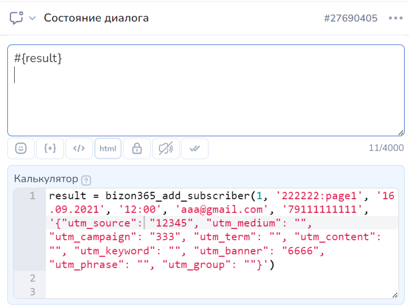
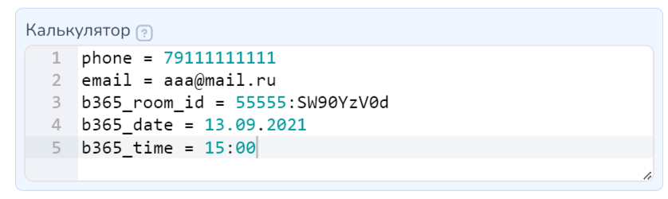
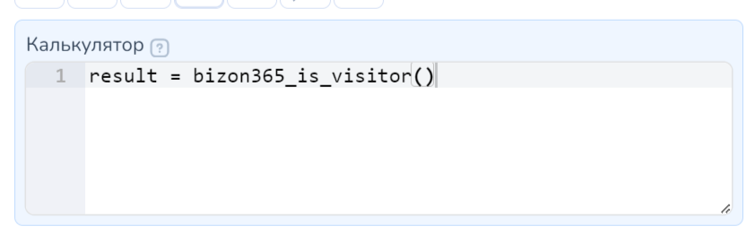
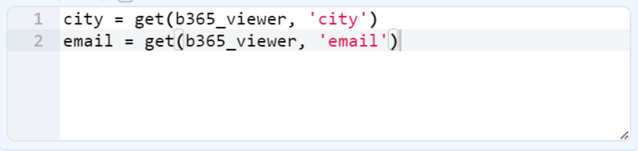

# Бизон 365


Доступно только на тарифе "Инфобиз".


Оптимизировать расходы организации - легко.&#x20;

Для этого достаточно настроить встроенные Трансляции в Salebot и работать с клиентами быстро, без потери данных и сложных интеграций со сторонними сервисами.

* [Как настроить bizon365 ](bizon-365.md#nastroiki-na-storone-bizon365)
* [Как регистрировать на вебинар из чат-бота ](bizon-365.md#registraciya-na-vebinar-iz-chat-bota)
* [Как проверить посещение вебинара ](bizon-365.md#proverka-posesheniya-vebinara)
* [Как зарегистрировать на вебинар, используя страницу регистрации](bizon-365.md#registraciya-na-vebinar-ispolzuya-stranicu-registracii)

Интеграция с bizon365 позволяет:

* проверить, посетил ли клиент вебинар;
* записать клиента на вебинар через чат-бот.
* получать вебхук от сервиса при записи клиента на вебинар (при условии, что на странице записи на вебинар запрашивается номер телефона или регистрация произошла через чат-бот или для регистрации использовалась специально сформированная ссылка из чат-бота)

## **Как настроить bizon365**

### **Как получить токен**

Токен необходимо получить в интерфейсе системы bizon365 -> в разделе «Модераторы, сотрудники» у конкретного пользователя, у которого есть права на регистрацию пользователей и просмотр отчетов.

<figure><figcaption></figcaption></figure>

Нажмите на "Изменить и настроить доступ"

<figure><figcaption></figcaption></figure>

Нажмите на "Генерировать" в строке "API-токен" (если у вас еще не было токена) и скопируйте его:

<figure><figcaption></figcaption></figure>

**После получения токена, переходим в настройки проекта -> Переменные проекта и сохраняем его в переменную bizon365\_token**

<figure><figcaption></figcaption></figure>

### **Как добавить адрес для вебхука**

В настройках вашего проекта в Salebot необходимо сгенерировать и скопировать ключ доступа к АПИ (токен).&#x20;

Перейдите в раздел интеграции и нажмите "Добавить API-ключ":

<figure><figcaption></figcaption></figure>

Далее в открывшемся окне нажмите на "Сгенерировать", далее активируйте переключатели для клиентов и для интеграции:

<figure><figcaption></figcaption></figure>

Затем пропишите название токена и нажмите "Готово":

<figure><figcaption></figcaption></figure>

Появится ключ, который можно копировать и изменять при необходимости:

<figure><figcaption></figcaption></figure>

Этот ключ используйте для формирования адреса для вебхуков:

**https://chatter.salebot.pro/bizon\_webhook/**<mark style="color:red;">**Ваш\_ключ\_к\_АПИ**</mark>, где вместо <mark style="color:red;"><Ваш\_ключ\_к</mark>_<mark style="color:red;">\_</mark>_<mark style="color:red;">АПИ></mark> вставляете полученный в настройках проекта ключ.

Исходя из примера, адрес будет выглядеть следующим образом: **https://chatter.salebot.pro/bizon\_webhook/**<mark style="color:red;">**523c8d51109b3b0343e7b5275d4fa31b**</mark>

Далее этот адрес необходимо использовать в настройках Страниц регистрации системы bizon365, в поле **Пересылка данных (webhook)**. Смотрите скриншоты 10-11.

Создайте страницу:&#x20;

<figure><figcaption></figcaption></figure>

Далее после созания страницы нажмите "Настроить":

<figure><figcaption></figcaption></figure>

Пролистните ниже до настройки "Обработка данных" и заполните поля "Маркер партнера в URL" - Salebot; в поле "Перессылка данных" — URL вида **ttps://chatter.salebot.pro/bizon\_webhook/**<mark style="color:red;">**Ваш\_ключ\_к\_АПИ**</mark>

<figure><figcaption></figcaption></figure>

**Заполните обязательные поля:**

<figure><figcaption></figcaption></figure>

### **Как избежать лишнего ввода данных пользователя**

Чтобы не нагружать пользователя лишними вводами обязательных данных (телефон, email), можно просто отправить пользователю ссылку на нужный вебинар с добавлением специального параметра, в котором передается идентификатор пользователя в salebot.

Перейдите в раздел "Комнаты" и создайте новую комнату (или отредактируйте уже существующую):

<figure><figcaption></figcaption></figure>

Далее в настройках комнаты перейдите во вкладку "Доступ":

<figure><figcaption></figcaption></figure>

Для этого достаточно перейти в настройки нужной вебинарной комнаты, вкладка Доступ и в поле Свой URL-параметр написать **salebot:**

<figure><figcaption></figcaption></figure>

Отключаем обязательный ввод email и телефона (если не нужен), сохраняем настройки и переходим к формированию ссылки.

### **Как сформировать ссылку на вход в вебинарную комнату**

Для формирования ссылки для перехода в вебинарную комнату, копируем ссылку нужной комнаты из списка вебинарных комнат в bizon365:

<figure><figcaption></figcaption></figure>

Далее в Salebot к ссылке нужно дописать следующее: **?salebot=#{client\_id}.**


Готовая ссылка для отправки клиенту должна получиться следующая: https://start.bizon365.ru/room/198436/e123a8a8470&#x66;**?salebot=#{client\_id}**


Далее чтобы выдать доступ к вебинару создадим блок для рассылки (например, не состояние):

<figure><figcaption></figcaption></figure>

В калькуляторе присвоим переменной link ссылку вида https://start.bizon365.ru/room/198436/e123a8a8470&#x66;**?salebot=#{client\_id}, а в кнопку вложим ссылку через конструкцию #{}:**

<figure><figcaption></figcaption></figure>

При переходе при клике на кнопку в мессенджере, пользователь попадет на вебинар:

<figure><figcaption></figcaption></figure>

<figure><figcaption></figcaption></figure>

И после окончания вебинара и получения по нему отчета, можно проверить посетил ли этот клиент данный вебинар используя функцию **bizon365\_is\_visitor()** (см. ниже).

### **Как сформировать ссылку на вход в вебинарную комнату с предзаполненными параметрами**

Для перехода в вебинарную комнату ссылка с предзаполненными параметрами пользователя формируется из общей ссылки на вход следующим образом:

https://start.bizon365.ru/222222/kfg1h3jf4t?salebot=#{client\_id}\&phone=#{bizon\_phone}\&email=#{bizon\_email}\&username=#{name}

https://start.bizon365.ru/222222/kfg1h3jf4t?salebot=#{client\_id}\&email=#{bizon\_email}\&username=#{name}

Индивидуальные ссылки на вебинар такой функционал не поддерживают. Общая ссылка для входа указана в Бизоне в настройках комнаты на вкладке Общие.

Где:

<table><thead><tr><th width="254">Переменная</th><th>Описание переменной</th></tr></thead><tbody><tr><td><mark style="color:red;"><strong>!</strong></mark>  #{client_id} </td><td>переменная, в которой содержится идентификатор клиента в salebot;</td></tr><tr><td>#{bizon_phone}</td><td>переменная, в которой содержится номер клиента (у вас она может называться иначе);</td></tr><tr><td>#{bizon_email} </td><td>переменная, в которой содержится email клиента (у вас она может называться иначе);</td></tr><tr><td>#{name}</td><td>переменная, в которой содержится имя клиента (у вас она может называться иначе)</td></tr></tbody></table>

Обязательным параметром является salebot=#{client\_id}, остальное по надобности.

При переходе по такой ссылке пользователь попадет на вебинар.&#x20;

И после окончания вебинара и получения по нему отчета можно проверить, посетил ли этот клиент данный вебинар используя функцию **bizon365\_is\_visitor()** (см. описание ниже).

Чтобы ссылка, отправляемая клиенту не была слишком громоздкой, ее можно укоротить.&#x20;

Например, поместить в качестве вложения с уведомлением о клике (в настройках блока) или воспользоваться функцией калькулятора proxy

### **Как сформировать ссылку для регистрации на вебинар**

При регистрации по такой ссылке клиенту придет колбек уведомление (описание ниже), при условии, что была произведена настройка вебхука, на которое можно поставить реакцию, например отправить информационное сообщение.

Переходим в личный кабинет в бизон -> Страницы регистрации -> Настроить:

<figure><figcaption></figcaption></figure>

И копируем одну из ссылок **Адрес страницы:**

<figure><figcaption></figcaption></figure>

И к ссылке нужно дописать следующее: **?salebot=#{client\_id}**&#x20;

В salebot готовая ссылка для отправки клиенту должна получиться следующая: \
https://start.bizon365.ru/page/222222/yourpag&#x65;**?salebot=#{client\_id}**&#x20;

или

http://yourpage.222222.bizonpages.r&#x75;**?salebot=#{client\_id}**

Ссылки будут выглядеть следующим образом:

<figure><figcaption></figcaption></figure>

После успешной регистрации, клиента можно найти в бизоне на странице подписчиков.

## **Как регистрировать на вебинар из чат-бота**

Для регистрации обязательно надо спрашивать у клиента email. Все остальное - по желанию.

Для регистрации пользователя на вебинар достаточно вызвать функцию: **bizon365\_add\_subscriber()** с нужными параметрами.

Есть два варианта использования этой функции.


Имя подписчика берется из переменной **b365\_name**. Если она не задана, т оиз переменной **name**.


### **Вариант 1 - задать нужные переменные**

До вызова функции у клиента должны быть переменные, данные из которых функция подтянет автоматически.

Обязательные переменные:

1. **email** - электронная почта подписчика
2. **b365\_page\_id** - Идентификатор страницы регистрации в Бизоне. (пример 222222:page1)
3. **b365\_date** - дата вебинара в формате ДД.ММ.ГГГГ (пример 16.09.2021)
4. **b365\_time** - время вебинара в формате: ЧЧ:ММ (пример 12:00)

Дополнительные, необязательные переменные:

1. **phone** - 79111111111
2. **utm\_** - UTM метки можете заполнить вашими метками

<figure><figcaption></figcaption></figure>

Пример переменных:

`phone = 79111111111`

`email = aaa@gmail.com`

`b365_page_id = 222222:page1`

`b365_date = 16.09.2021`

`b365_time = 12:00`

`utm_ = {"utm_source": "12345", "utm_medium": "", "utm_campaign": "333", "utm_term": "", "utm_content": "", "utm_keyword": "", "utm_banner": "6666", "utm_phrase": "", "utm_group": ""}`

* Если нужно добавить подписчика в режиме "**с подтверждением e-mail**" (так, как если бы он сам заполнил форму регистрации). Ему на почту придет письмо со ссылкой на подтверждение регистрации, то нужно при вызове функции передать 1 - bizon365\_add\_subscriber(1)

<figure><figcaption></figcaption></figure>

### **Вариант 2 - передать параметры**

Второй вариант записи на вебинар предусматривает передачу данных сразу в параметрах функции.

**bizon365\_add\_subscriber**(подтверждение емейл, идентификатор страницы, дата вебинара, время вебинара, емейл, телефон, utm метки)


Важен порядок передаваемых данных!


Обязательные параметры:

* подтверждение email - 1 нужно подтверждение, 0 - не нужно
* идентификатор страницы
* дата в формате ДД.ММ.ГГГГ (пример 16.09.2021)
* время вебинара в формате: ЧЧ:ММ (пример 12:00)
* емейл

Телефон и utm метки передавать по необходимости (если телефон не передается, а utm-метки передаются, тогда телефон необходимо передать).

Пример вызова функции:

`result = bizon365_add_subscriber(1, '222222:page1', '16.09.2021', '12:00', 'aaa@gmail.com', '79111111111', '{"utm_source": "12345", "utm_medium": "", "utm_campaign": "333", "utm_term": "", "utm_content": "", "utm_keyword": "", "utm_banner": "6666", "utm_phrase": "", "utm_group": ""}')`

<figure><figcaption></figcaption></figure>

**Функция возвращает True** при успешном добавлении или сообщение с пояснением, что пошло не так (например при отсутствии обязательных переменных: Missing required variables).

### **Как найти идентификатор страницы**

Перейдите в настройки страницы:

<figure><figcaption></figcaption></figure>

Идентификатор будет в первом поле:

<figure><figcaption></figcaption></figure>

После успешной регистрации, клиента можно найти в бизоне на странице подписчиков.

### **Как получить колбек при успешной регистрации**

После получение колбека о регистрации, если клиент зарегистрирован не через бота, поиск нужного клиента в сейлбот происходит следующим образом.

Если в колбеке от бизон365 получен и номер телефона и емей&#x43B;**:**

Сначала по всем переменным клиента ищется номер телефона, если клиент не найден, то ищется по всем переменным email. Если и после этого клиент не найден, а номер телефона есть, то добавляется WhatsApp клиент (если к проекту подключен WhatsApp).

Если клиент найден, то ему автоматически добавятся следующие переменные:

* bizon\_sublist\_id — идентификатор страницы регистрации
* bizon\_room — идентификатор комнаты, которая подключена к странице регистрации
* bizon\_email: "user@example.com",
* phone — телефон пользователя
* bizon\_webinar\_datetime: "2021-09-16T09:00:00.000Z",  — дата вебинара, на который зарегистрирован зритель
* bizon\_webinar\_time
* bizon\_webinar\_date
* bizon\_secret, — персональный ключ подписчика, для формирования индивидуальных ссылок на вебинар
* bizon\_url\_marker — значение маркера&#x20;
* bizon\_url\_marker\_name — название маркера
* bizon\_utm\_source
* bizon\_utm\_medium
* bizon\_utm\_campaign
* bizon\_utm\_term
* bizon\_utm\_content
* bizon\_utm\_keyword
* bizon\_utm\_banner
* bizon\_utm\_phrase
* bizon\_utm\_group

Если клиент найден в сейлбот, то в чат с ним придет сообщение (уведомление) **bizon client\_registered**, которое видит только оператор в сейлбот.

<figure><figcaption></figcaption></figure>

По этому уведомлению можно отправить сообщение клиенту или отправить его по воронке в нужное место.

Чтобы отправить клиенту благодарственное сообщение при регистрации на вебинар, надо ввести в поле **Условие** блока с **Первостепенной проверкой условия** следующий текст:

**bizon client\_registered**

Можно использовать для реакции на регистрацию как блок "Стартовое условие", так и блок "Не состояние с условием":

<figure><figcaption></figcaption></figure>

<figure><figcaption></figcaption></figure>


Если вы не хотите выбивать клиента из основной схемы чат-бота, воспользуйтесь блоком "Не состояние с условием" — в этот блок нельзя перейти, поэтому клиента после оплаты не выбьет из основной воронки и при этом он получит уведомление об успешной оплате.

А если вам нужно продолжить воронку с реакции на успешную оплату, то используйте блок "Стартовое условие", тогда клиент из блока оплаты перейдет в блок "Стартовое условие", с которого вы можете продолжить воронку.


## **Как проверить посещение вебинара**


**Важно знать, что отчет о посещении вебинара необходимо запрашивать не ранее чем через 1-3 часа после вебинара. Если вы запросите отчет раньше, то он может быть еще не сформирован. Учитывайте это при создании логики вашей схемы.**


Если вы планируете проверять посещение вебинара и по номеру телефона, надо в настройках комнаты вебинара в разделе "Доступ" включить обязательный запрос номера телефона:

Чтобы проверить, посетил ли клиент вебинар, нужно вызвать функцию **bizon365\_is\_visitor()**, доступно 2 варианта использования функции.

### **Вариант 1 - задать нужные переменные**

До вызова функции у клиента должны быть переменные, данные из которых, функция подтянет автоматически.


Если в вашем проекте все переходы и регистрации на вебинар происходят с использованием параметра salebot в ссылке (?salebot=#{client\_id}), тогда телефон и email передавать не нужно. Дату и время лучше указать, так как это гарантирует точное нахождение нужного отчета.


Обязательные переменные:

* email - электронная почта подписчика
* phone - 79111111111
* b365\_room\_id - Идентификатор страницы регистрации в Бизоне. (пример 222222:page1)


Можно передать оба значения email и телефон или одно значение (либо email, либо телефон). Если передаете одно значение, то второе нужно заменить на 1


Дополнительные (желательные) переменные:

b365\_date - дата вебинара в формате ДД.ММ.ГГГГ (пример 16.09.2021)\
b365\_time - время вебинара в формате: ЧЧ:ММ (пример 12:00)


Если не передать дату и время, то из указанной комнаты будет взят последний сформированный отчет вебинара!


<figure><figcaption></figcaption></figure>

Пример переменных:\
phone = 79111111111\
email = aaa@mail.ru\
b365\_room\_id = 55555:SW90YzV0d\
b365\_date = 13.09.2021\
b365\_time = 15:00

Далее можно вызвать функцию:

<figure><figcaption></figcaption></figure>

### **Вариант 2 - передать параметры**

Для записи на вебинар необходимо сразу в функцию передать нужные параметры.

**bizon365\_is\_visitor**(ID комнаты, емейл, телефон, дата вебинара, время вебинара)


Важен порядок передаваемых данных!


Обязательные параметры:

* ID комнаты
* email
* телефон

Дополнительные (желательные) параметры:

* дата вебинара в формате ДД.ММ.ГГГГ (пример 16.09.2021)
* время вебинара в формате: ЧЧ:ММ (пример 12:00)


Если не передать дату и время, то из указанной комнаты будет взят последний сформированный отчет вебинара!


Пример вызова функции

result = bizon365\_is\_visitor('55555:SW90YzV0i', 'aaa@gmail.com', '79111111111', '12.09.2021', '19:00')


Можно передать оба значения емейл и телефон или одно значение (либо емейл, либо телефон). Если передаете одно значение, то второе нужно заменить на 1


Пример вызова функции, только с емейлом

result = **bizon365\_is\_visitor**('55555:SW90YzV0i', 'aaa@gmail.com', '**1**', '12.09.2021', '19:00')

Пример вызова функции, только с телефоном

result = **bizon365\_is\_visitor**('55555:SW90YzV0i', '**1**', '79111111111', '12.09.2021', '19:00')

Функция возвращает:

* True - клиент был на вебинаре,
* False - клиент не был на вебинаре
* или сообщение с пояснением, что пошло не так (например отчет не найден: Report not found).

Если клиент найден, то в переменную **b365\_viewer** запишется все информация по нему, которую возвращает bizon365. Пример:

{"playVideo":1,"email":"mail@mail.ru","phone":"+7911111111","username":"Дарий","url":"https:\\/\\/start.bizon365.ru\\/room\\/222222\\/SW45zV0d","ip":"111.111.111.6","mob":true,"useragent":"Android, Chrome 91.0.4472.111","referer":"","cv":null,"cu1":"","p1":"","p2":"","p3":"","roomid":"222222:SW45YzV0d","chatUserId":"SeURFjsft","city":"Краснодар","country":"RU","region":"Краснодарский край","tz":"","created":"2021-09-12T16:24:48.125Z","webinarId":"222222:SW45YzV0d\*2021-09-12T19:00:00","view":1631463887082,"viewTill":1631464786805,"messages\_num":0}

Эти данные можно сохранить, используя функцию get, например:

* city = get(b365\_viewer, 'city')
* email = get(b365\_viewer, 'email')

<figure><figcaption></figcaption></figure>

Все возможные данные и их обозначения, которые могут быть в переменной b365\_viewer, можно посмотреть перейдя по ссылке: [https://blog.bizon365.ru/api/v1/webinars/reports/#getviewers](https://blog.bizon365.ru/api/v1/webinars/reports/#getviewers) . Они указаны после строки “Поле **viewers** — это массив, состоящий из объектов следующего формата:".

### Как выбрать отчеты при проверке посещения вебинара

По умолчанию при поиске нужного отчета берутся последние 10 сформированных отчетов. Бывает необходимость делать выборку по большему количеству, например если в одно время проводится сразу 10 и более вебинаров. Тогда можно задать в настройках проекта переменную **b365\_report\_limit**, которая принимает число, которое указывает количество последних отчетов, которое берется для поиска нужного. Ограничение 100.

Перейдите в настройки проекта во вкладке "Переменные" и нажмите на карандашик, чтобы добавить новую переменную:

<figure><figcaption></figcaption></figure>

Нажмите "+ Добавить переменную":

<figure><figcaption></figcaption></figure>


Если не передаете дату и время вебинара (в таком случае поиск производится только по идентификатору комнаты) и указываете большой **b365\_report\_limit**, есть вероятность нахождения старого отчета.


## **Как зарегистрировать на вебинар, используя страницу регистрации**

Если клиент попал на страницу регистрации не по ссылке из чат-бота, а, например, из рекламы, тогда можно создать с ним диалог, используя его номер телефона и бота whatsapp.

После регистрации в salebot придет уведомление, и поиск клиента будет происходить за следующим сценарием:&#x20;

1. вначале по всем переменным клиента ищется номер телефона, если клиент не найден,&#x20;
2. то ищется по всем переменным email,&#x20;
3. если и после этого клиент не найден, а номер телефона есть, то добавляется вотсап клиент (если к проекту подключен Вотсап).

### **Как добавить номер телефона в формы**

В сервисе bizon365 есть две основные формы: форма записи на вебинар и форма входа на вебинар. Чтобы работала функция вебхука, в чат-бот необходимо получить номер телефона пользователя в форме регистрации на вебинар. А чтобы работала проверка посещения вебинара, необходимо получить номер телефона пользователя в форме входа на вебинар.

Запрос номера телефона в форме регистрации возможен, только если вы используете собственную страницу (свой сайт), на которую вставлен виджет с кодом из стандартной страницы регистрации. В коде необходимо исправить phone:0 на phone:1. Пример на скриншотах ниже.

Запрос номера телефона в форме входа на вебинар настраивается в настройках вебинара. Там нужно перейти в раздел Доступ и поставить птички в полях "Номер телефона" и "Обязательное поле":

Во вкладке "Комнаты" нажмите на "Настроить комнату":

<figure><figcaption></figcaption></figure>

Далее перейдите в раздел "Доступ"  и отметьте галочками поля "Номер телефона" и "Обязательное поле":

<figure><figcaption></figcaption></figure>
