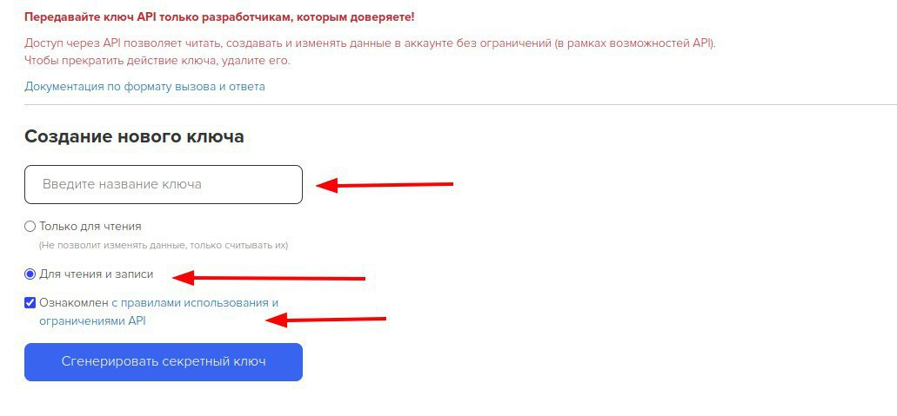

# Getcourse


Доступно только на тарифе "Инфобиз".


Попробуйте создать свою онлайн-школу на salebot.pro У нас можно принимать оплату через Продамус, к тому же работа с онлайн продуктами полностью бесплатна. \
Подробнее по ссылке: [https://docs.salebot.pro/kursy](https://docs.salebot.pro/kursy)&#x20;

* [Как настроить Getcourse ](getcourse.md#undefined)
* [Как создать в Getcourse дополнительное поле клиента (Salebot client\_id) ](getcourse.md#sozdanie-v-getcourse-dopolnitelnogo-polya-klienta-sb_id)
* [Как добавить пользователя ](getcourse.md#dobavlenie-polzovatelya)
* [Как добавить заказ ](getcourse.md#dobavlenie-zakaza)
* [Как редактировать заказ ](getcourse.md#redaktirovanie-zakaza)
* [Как изменить статус заказа](getcourse.md#kak-izmenit-status-zakaza)
* [Как отправить вебхук из Геткурс ](getcourse.md#otpravka-vebkhuk-iz-getkurs)
* [Как передать Salebot client\_id при регистрации клиента через лендинг Getcourse](getcourse.md#peredat-salebot-client_id-pri-registracii-klienta-cherez-lending-getcourse)

## Как настроить Getcourse

Для того, чтобы успешно заполнить поля, перейдите в вашем Геткурсе на эту страницу:[ http://ВАШ\_АККАУНТ.getcourse.ru/saas/account/api](http://xn--_-7sbbag5caz9bi3c.getcourse.ru/saas/account/api) Если у вас собственный домен, то токен находится по адресу: <mark style="color:blue;">https://<Ваш домен>/saas/account/api</mark>

На открывшейся странице нам нужны поля 1. Account name и 2. «Ваш секретный ключ». (фото ниже)

При создании ключа или его копировании проверьте, что возможность **Чтения и записи включена.** Если в текущем ключе нет таких настроек, то сгенерируйте новый ключ включив чтение и запись. \
Пример в скриншоте:  

<figure><figcaption>
Включите чтение и запись перед созданием ключа.
</figcaption></figure>


Если при формировании ключа не включить чтение и запись, то при работе вы можете получать ошибку "Действие запрещено".&#x20;


Далее переходим в проект на salebot в раздел Настройки и добавляем переменные в константы проекта:

1. **getcourse\_account\_name** - Account name
2. **getcourse\_secret** - Ваш секретный ключ

.png>)

.png>)

## **Как создать в Getcourse дополнительное поле клиента (Salebot client\_id)**

Дополнительное поле создается в Геткурсе в разделе Пользователи – Дополнительные поля

Кликните Добавить поле. Выберите Строка.

В поля Заголовок и Название при выводе впишите **sb\_id**. Поставьте галочку "Является ключевым", если хотите видеть это поле на странице списка пользователей (для удобства поиска клиентов из чат-бота). Нажмите Сохранить.

Теперь у вас в списке и карточке клиента появилось это дополнительное поле.

## Как добавить пользователя


Этот метод в Getcourse работает только на платных тарифах Getcourse. На тестовом периоде - нет.


&#x20;Можно не использовать этот метод, а сразу создавать заказ для клиента (например, регистрация на вебинар), используя функцию Добавление заказа (она описана чуть ниже).

В блоке, где надо в Геткурс сделать добавление клиента, заполните поле “Калькулятор” следующим образом:&#x20;

**getcourse\_add\_user(refresh, email, phone, name, user\_data, partner\_email,  session\_data, domain)**


Важен порядок передаваемых данных!


**Обязательные параметры:**

* refresh - обновлять ли данные существующего пользователя 1 - да, 0 - нет
* емейл и\или телефон

**Дополнительные параметры:**

* name - имя пользователя
* user\_data - объект с данными пользователя
* partner\_email - email партнера (для пользователя)
* session\_data - дополнительные параметры
* domain - имя домена(по умолчанию ‘ru’). В случае, если потребуется передать метод по адресу другого домена(например, getcourse.io/getcourse.us/getcourse.uk и тд),укажите домен вашего региона, например, ‘com’. Если не указать ничего, автоматически будет использован адрес российского региона.

Параметры **email**, **phone** и **name**, можно заменить на две двойные кавычки, их значение автоматически подтянется из переменных: email, phone и getcourse\_name соответственно, если они существуют у клиента. Пример: getcourse\_add\_user(1,””, “7811111111”)

**user\_data** - '{"last\_name": "Фамилия", "city": "город", "country": "страна"}'

Для добавления дополнительных полей пользователя нужно передать в объекте с данными пользователя user\_data параметр addfields, в котором перечислены нужные параметры с данными: пример: '{"last\_name": "Фамилия", "city": "#{city}", "country": "Россия", "addfields":{"Доп.поле1":"значение","Доп.поле2":"значение"\}}'

или просто: '{"addfields":{"Доп.поле1":"значение","Доп.поле2":"значение"\}}'

Этот параметр можно добавить не только пользователю, но и сделке в параметре deal\_data

**partner\_email** - email партнера (для пользователя)

* Если указанный для создаваемого/обновляемого пользователя партнер существует, то пользователь в системе будет помечен как реферал этого партнера.
* Если пользователь-партнер не существует — будет возвращена ошибка.
* Если пользователь-партнер существует, но не является партнером, то указанный пользователь автоматически получит статус партнера.

**session\_data** - '{"utm\_source":"", "utm\_medium":"", "utm\_content":"", "utm\_campaign":"", "utm\_group":"", "gcpc":"", "gcao":"", "referer":""}'

Данные из объекта session будут зафиксированы как параметры регистрации нового пользователя. Если происходит обновление данных (только при refresh == 1), то предыдущие будут заменены.

Функция возвращает **True** при успешном добавлении или сообщении с ошибкой (например, если не переданы группы: groups list not send).

Также при успехе клиенту запишется переменная **getcourse\_user\_id** (идентификатор клиента в геткурс) и  **getcourse\_user** с ответом сервера.

**Примечания:**

1. Если не передан какой-то параметр, но передан следующий за ним, то его пропуск нужно заменить двумя символами кавычек (двойными “” или одинарными ‘’)
2. Обязательным для регистрации пользователя является только email или телефон, все остальное – по желанию.&#x20;
3. Если в системе не существует пользователя с указанным email — будет создан новый пользователь.

**Примеры вызова функции:**

result = getcourse\_add\_user('0', 'mail@example.com', '', 'Nilson', '', 'partneremail@email.ru', '{ "utm\_source": "4545", "utm\_medium": "55555"}')

result = getcourse\_add\_user('1', 'mail@example.com')

result = getcourse\_add\_user('1', 'mail@example.com', '7811111111', 'Nilson', '{"last\_name": "Tesla", "city": "Москва", "country": "Россия"}', 'partneremail@email.ru', '{ "utm\_source": "4545", "utm\_medium": "55555"}')

### **Как добавить пользователя в группу**

Для добавления пользователя в группы, нужно вызвать функцию **getcourse\_add\_user\_to\_groups**(список групп, идентификатор пользователя, domain)

Функция принимает два обязательных параметра:

* список названий групп, в которые нужно добавить пользователя
* идентификатор пользователя в геткурс (не обязателен, если у пользователя есть переменная getcourse\_user\_id)

и один необязательный параметр:

* domain - имя домена(по умолчанию ‘ru’). В случае, если потребуется передать метод по адресу другого домена(например, getcourse.io/getcourse.us/getcourse.uk и тд),укажите домен вашего региона, например, ‘com’. Если не указать ничего, автоматически будет использован адрес российского региона.

В результате выполнения запроса пользователь будет состоять во всех группах, указанных в списке group\_name. Если ранее пользователь состоял в каких-либо группах, не указанных в group\_name — он будет удален из этих групп.

Пример вызова функции:

getcourse\_add\_user\_to\_groups('\["Группа 1", "Группа 2"]', 199388144)

**Функция возвращает True** при успешном добавлении или сообщении с ошибкой (например, если не переданы группы: groups list not send).

## **Как добавить заказ**

Для создания заказа необходимо перейти в геткурс, раздел Продажи – Продукты . Зайдите в нужное предложение, вкладка – Настройки. Здесь нужно придумать и вписать **Уникальный код предложения**.

Возвращаемся в воронку в Salebot. В настройках того блока, где нужно сделать добавление заказа для Геткурс, заполните поле “Калькулятор” следующим образом:&#x20;

**getcourse\_add\_deal**(email, phone, offer\_code, deal\_cost, deal\_data, user\_data, system\_data, session\_data, domain)


Важен порядок передаваемых данных!


**Обязательные параметры:**

* емейл и\или телефон
* offer\_code - уникальный код предложения (введенный выше в настройках)
* deal\_cost - сумма заказа&#x20;

**Дополнительные параметры:**

* deal\_data - объект с данными заказа
* user\_data - объект с данными пользователя
* system\_data - email партнера (для пользователя)
* session\_data - дополнительные параметры
* domain - имя домена(по умолчанию ‘ru’). В случае, если потребуется передать метод по адресу другого домена(например, getcourse.io/getcourse.us/getcourse.uk и тд),укажите домен вашего региона, например, ‘com’. Если не указать ничего, автоматически будет использован адрес российского региона.

Параметры **email** и **phone**, можно заменить на две двойные кавычки, значение туда автоматически подтягиваются из переменных: email, phone соответственно, если они существуют у клиента.


Если не передан какой-то параметр, но передан следующий за ним, его пропуск нужно заменить двумя символами кавычек (двойными “” или одинарными ‘’)


Если пользователь с указанным email уже есть в системе, то заказ добавляется к нему. Если его в системе еще нет, то он создается.'

Далее описаны параметры, в которых можно передать как одно значение, так и несколько.

**deal\_data** - '{"product\_title":"наименование предложения", "product\_description":"описание предложения", "quantity":1, "deal\_status":"код статуса заказа", "deal\_is\_paid": "нет", "manager\_email":"email менеджера", "deal\_created\_at":"дата заказа", "deal\_finished\_at":"дата оплаты/завершения заказа", "deal\_comment":"комментарий", "payment\_type":"тип платежа из списка", "payment\_status":"статус платежа из списка", "partner\_email":"email партнера (для заказа)", "deal\_currency":"код валюты заказа", "addfields":{"Доп.поле1":"значение","Доп.поле2":"значение"\}}'

**user\_data** - '{"first\_name":"имя", "last\_name":"фамилия", "city":"город", "country":"страна"}'

Для добавления дополнительных полей пользователя нужно передать в объекте с данными пользователя user\_data параметр addfields, в котором перечислены нужные параметры с данными: пример: '{"last\_name": "Фамилия", "city": "#{city}", "country": "Россия", "addfields":{"Доп.поле1":"значение","Доп.поле2":"значение"\}}'

или просто: '{"addfields":{"Доп.поле1":"значение","Доп.поле2":"значение"\}}'

**system\_data** - '{"refresh\_if\_exists":1, "partner\_email":"email партнера (для пользователя)\*", "multiple\_offers":0, "return\_payment\_link":1}'

**session\_data** - '{"utm\_source":"", "utm\_medium":"", "utm\_content":"", "utm\_campaign":"", "utm\_group":"", "gcpc":"", "gcao":"", "referer":""}'

Объект session\_data при импорте сделки содержит UTM-параметры, которые фиксируются как контекст создания заказа.

Дополнительно, если при импорте сделки происходит создание нового пользователя, то объект session используется так же и как контекст регистрации пользователя. Однако, при обновлении данных пользователя при импорте сделки объект session используется только для сделки, но не для пользователя.

Функция возвращает **True** при успешном добавлении или сообщение с описанием ошибки.

Также при успехе у клиента появятся переменные **getcourse\_deal\_number** (номер заказа используется для редактирования заказа и изменения статуса), **getcourse\_deal\_id** (идентификатор заказа в геткурс)  и **getcourse\_payment\_link** с ссылкой на оплату (если не было передано в system\_data - "return\_payment\_link":0)

Примеры вызова функции:

result = getcourse\_add\_deal('aaa@mail.com', '', '123456', '23', '{"product\_description":"Описание", "quantity":"1"}')

result = getcourse\_add\_deal('aaa@mail.com', '', '123456', '24', '{"product\_description":"Описание", "quantity":"1"}', '{"last\_name": "Tesla", "city": "Ростов", "country": "Россия"}', '', '{ "utm\_source": "#{name}", "utm\_medium": "#{utm\_medium}"}')

result = getcourse\_add\_deal('aaa@mail.com', '', '123456', '24', '{"product\_description":"Описание", "quantity":"1"}', '{"last\_name": "Tesla", "city": "Ростов", "country": "Россия"}', ' '{"refresh\_if\_exists":1, "multiple\_offers":0, "return\_payment\_link":1}'', '{ "utm\_source": "#{name}", "utm\_medium": "#{utm\_medium}"}')

## **Как редактировать заказ**

В блоке, где нужно отредактировать заказ Геткур&#x441;**,** в Salebot заполните поле “Калькулятор” следующим образом:&#x20;

**getcourse\_update\_deal**(email, phone, deal\_number, multiple\_offers, deal\_data, user\_data, system\_data, session\_data, domain)


Важен порядок передаваемых данных!


**Обязательные параметры:**

* емейл и\или телефон
* deal\_number - номер заказа, если не передан “”, то берется из переменной getcourse\_deal\_number
* multiple\_offers - 1 - переданные позиции в сделке добавляются к существующим, 0 - заменяют их

**Дополнительные параметры:**

* deal\_data - объект с данными заказа
* user\_data - объект с данными пользователя
* system\_data - email партнера (для пользователя)
* session\_data - дополнительные параметры
* domain - имя домена(по умолчанию ‘ru’). В случае, если потребуется передать метод по адресу другого домена(например, getcourse.io/getcourse.us/getcourse.uk и тд),укажите домен вашего региона, например, ‘com’. Если не указать ничего, автоматически будет использован адрес российского региона.

Параметры **email** и **phone**, можно заменить на две двойные кавычки, значение туда автоматически подтягиваются из переменных: email, phone соответственно, если они существуют у клиента.


Если не передан какой-то параметр, но передан следующий за ним, его пропуск нужно заменить двумя символами кавычек (двойными “” или одинарными ‘’)


Далее описаны параметры, в которых можно передать как одно значение, так и несколько.

**deal\_data** - '{"product\_title":"наименование предложения", "product\_description":"описание предложения", "quantity":1, "deal\_status":"код статуса заказа", "deal\_is\_paid": "нет", "manager\_email":"email менеджера", "deal\_created\_at":"дата заказа", "deal\_finished\_at":"дата оплаты/завершения заказа", "deal\_comment":"комментарий", "payment\_type":"тип платежа из списка", "payment\_status":"статус платежа из списка", "partner\_email":"email партнера (для заказа)", "deal\_currency":"код валюты заказа"}'

**user\_data** - '{"first\_name":"имя", "last\_name":"фамилия", "city":"город", "country":"страна"}'

Для добавления дополнительных полей пользователя нужно передать в объекте с данными пользователя user\_data параметр addfields, в котором перечислены нужные параметры с данными: пример: '{"last\_name": "Фамилия", "city": "#{city}", "country": "Россия", "addfields":{"Доп.поле1":"значение","Доп.поле2":"значение"\}}'

или просто: '{"addfields":{"Доп.поле1":"значение","Доп.поле2":"значение"\}}'

**system\_data** - '{"refresh\_if\_exists":1, "partner\_email":"email партнера (для пользователя)\*","return\_payment\_link":1}'

**session\_data** - '{"utm\_source":"", "utm\_medium":"", "utm\_content":"", "utm\_campaign":"", "utm\_group":"", "gcpc":"", "gcao":"", "referer":""}' 

Функция возвращает **True** при успешном результате или сообщении с ошибкой (например, если не передан номер заказа и его нет в переменных: deal\_number not send and not found in variable getcourse\_deal\_number).

**Примеры вызова функции:**

result = getcourse\_update\_deal('aaa@mail.com', '', '124563', '0', '{"product\_description":"Описание22", "partner\_email":"partner@email.ru", "quantity":"1"}')

result = getcourse\_update\_deal('aaa@mail.com', '7811111111', '124563', '0', '{"product\_description":"Описание22", "deal\_comment":"комментарий", "quantity":"1"}', '{"last\_name": "Tesla2", "city": "#{city}", "country": "Каир"}', '', '{ "utm\_source": "SOURSE", "utm\_medium": "#{utm\_medium}"}') 

### **Как изменить статус заказа**

**getcourse\_change\_deal\_status(status, email, phone, deal\_number, domain)**


Важен порядок передаваемых данных!


Емейл и телефон можно не указывать, тогда они подтянутся из переменных клиента email и phone

Можно передать оба значени&#x44F;**:** емейл и телефон, или одно значение (емейл или телефон). Если передаете одно значение, то второе нужно заменить на две двойные кавычки("").

Если заказ был создан из бота и/или у клиента (в переменных Информация о сделке) присутствует переменная **getcourse\_deal\_number**, то **deal\_number** можно не передавать, функция автоматически подтянет это значение.

domain - имя домена(по умолчанию ‘ru’). В случае, если потребуется передать метод по адресу другого домена(например, getcourse.io/getcourse.us/getcourse.uk и тд),укажите домен вашего региона, например, ‘com’. Если не указать ничего, автоматически будет использован адрес российского региона.

<figure><figcaption></figcaption></figure>

Список возможных статусов заказа:

* not\_confirmed - Не подтвержден&#x20;
* in\_work - В работе&#x20;
* payed - Завершен&#x20;
* cancelled - Отменен&#x20;
* false - Ложный&#x20;
* payment\_waiting - Ожидаем оплаты&#x20;
* part\_payed - Частично оплачен&#x20;
* waiting\_for\_return - Ожидаем возврата&#x20;
* pending - Отложен


Тестовые заказы отмечают статусом false, чтоб не отображались в списке всех заказов, так как возможности удаления заказов геткурс не предоставляет


Примеры:&#x20;

result = getcourse\_change\_deal\_status("in\_work", 'mail@example.com', "", 1455)

result = getcourse\_change\_deal\_status("in\_work") 

## **Как отправить вебхук из Геткурс**

Вебхук может понадобиться, если, например, вы захотите передавать в бота информацию об оплате ваших товаров. В сервисе Геткурс для отправки параметров в бот необходимо настроить Процесс:

Перейдите в Задачи – Процессы – Создать процесс.

<figure><figcaption></figcaption></figure>

Введите название процесса, выберите объект, данные которого будете передавать. Нажмите Создать. Перейдите на вкладку Процесс и нажмите Добавить блок. Выберите Операция – Вызвать URL.

Выставьте Метод POST.&#x20;

В URL впишите адрес для вебхука, включающий передаваемые параметры:

**Если отправляете параметры клиенту с Ватсап (в том числе, если хотите написать ему первым), то обязательными являются следующие параметры:**&#x20;

**При настройке процесса по заказам:**

https://chatter.salebot.pro/getcourse\_webhook/_<mark style="color:green;">Ключ доступа к API из настроек проекта Salebot</mark>_?phone={object.user.phone}\&callback\_text=send&… &#x20;

(также рекомендуется добавить емейл \&email={object.user.email})

**При настройке процесса по пользователям:**

https://chatter.salebot.pro/getcourse\_webhook/_<mark style="color:green;">Ключ доступа к API из настроек проекта Salebot</mark>_?phone={object.phone}\&callback\_text=send&…&#x20;

(также рекомендуется добавить емейл \&email={object.email})

**Если отправляете параметры пользователю с другим мессенджером, то обязательными являются следующие параметры:**

**При настройке процесса по заказам:**

https://chatter.salebot.pro/getcourse\_webhook/_<mark style="color:green;">Ключ доступа к API из настроек проекта Salebot</mark>_?client\_id={object.user.sb\_id}\&callback\_text=any\_message&… - &#x20;

(также рекомендуется добавить емейл \&email={object.user.email})

**При настройке процесса по пользователям:**

https://chatter.salebot.pro/getcourse\_webhook/_<mark style="color:green;">Ключ доступа к API из настроек проекта Salebot</mark>_?client\_id={object.sb\_id}\&callback\_text=any\_message&…&#x20;

(также рекомендуется добавить емейл \&email={object.email})


Email рекомендуется передавать, так как по нему ищется клиент в сейлбот, если не найден по номеру телефона или не передан client\_id.


_<mark style="color:green;">Ключ доступа к API из настроек проекта Salebot</mark>_  - вместо этого вставьте токен из раздела Настройки проекта в Salebot&#x20;

**phone** – здесь подтягиваете номер телефона пользователя \
**client\_id** – здесь подтягиваете значение, которое записано в дополнительное поле в Геткурсе (в нем значение #{client\_id} из Salebot) \
**callback\_text** – текст, который служит Условием в зеленых или серых блоках Salebot, чтобы отправлять сообщения пользователю. Только в условии к нему добавится еще getcourse

Здесь подробная инструкция по тому как передавать значения из переменных Геткурса в другие системы (в Salebot)[ https://getcourse.ru/blog/275857](https://getcourse.ru/blog/275857)

Для отлова этих вебхуков в вашей воронке создайте блок, в поле Условие которого впишите фразу, состоящую из слова getcourse + тот текст, который отправляете в Вебхуке в параметре callback\_text:

Например, если отправите из Геткурса callback\_text=send, то в Условие блока надо поставить getcourse send


Если не приходит вебхук, проверьте правильность передачи параметров client\_id, phone или email


## **Как передать Salebot client\_id при регистрации клиента через лендинг Getcourse**

Если вы хотите, чтобы клиент регистрировался в Геткурс не через бота, а через лендинг Геткурса, но при этом получал в свой мессенджер вебхуки из Геткурса, то внесите следующие правки в настройки лендинга.

1\. Проверьте, чтобы в карточке клиента в Getcourse было создано дополнительное поле sb\_id. Как его создавать описано выше.

2\. Пройдите в настройки своего лендинга (или создайте его). Сайт – Страницы – клик по нужному лендингу. 

3\. Внутри настроек лендинга кликните по кнопке Редактор страницы

4\. Создайте форму регистрации клиента или пройдите в Настройки уже существующей

5\. Теперь добавьте Поле пользователя

6\. В списке Поле выбираем название нашего поля **sb\_id**. Заголовок поля тоже ставим **sb\_id**. Для того, чтобы поле стало невидимым для пользователей прописываем CSS- класс элемента hide. И для связи с нашим полем прописываем там же sb\_id

7\. Сохраняем настройки формы.

8\. Внизу Настроек лендинга создайте новый элемент

9\. Выберите Вставка – JAVA-Script код

**10. Перейдите в Настройки этого элемента. Название можно написать любое, а вот в поле Значение впишите следующий код:**

`$(document).ready(function(){`\
&#x20; `var regex = new RegExp('[\\?&]sid=([^&#]+)');`\
&#x20; `var match = regex.exec(window.location.href);`\
&#x20; `if (match && match.length) {`\
&#x20;      `$('.sb_id input').val(decodeURIComponent(match[1]));`\
&#x20;  `}`\
`});` 

<figure><figcaption></figcaption></figure>

11\. Сохраните этот элемент. Опубликуйте изменения страницы.

12\. Теперь вы можете из бота выдать клиенту ссылку на этот лендинг с дополнительным параметром sid после знака вопроса:

https://salebot2.getcourse.ru/salebot?sid=#{client\_id}

Он перейдёт по ней, зарегистрируется в форме и у вас в Геткурсе появится новый пользователь, у которого дополнительное поле sb\_id заполнено значением client\_id из Salebot 

Далее вы можете отправлять вебхуки из Геткурса в аккаунт этого пользователя в Сейлбот.
