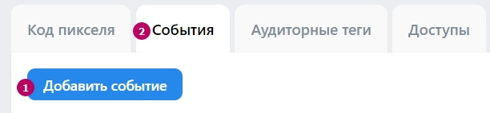
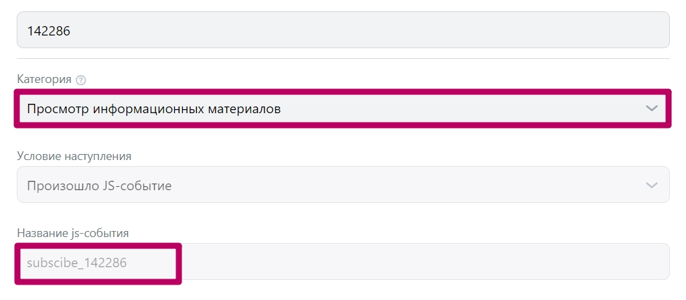

# Подключение рекламного кабинета ВКонтакте к Salebot

Зарегистрировать [рекламный кабинет](https://ads.vk.com/) или перейти в уже существующий

<figure><figcaption></figcaption></figure>

Перейти в раздел "Сайты" и создать пиксель

<figure><figcaption></figcaption></figure>

Добавить сайт, на который будет установлен пиксель

<figure><figcaption></figcaption></figure>


Пиксель может работать и на домене sbsite.pro  и на вашем личном домене, указанном в настройках страницы сайта!&#x20;


Скопировать ID пикселя&#x20;

<figure><figcaption></figcaption></figure>


**ОБРАТИТЕ ВНИМАНИЕ!**\
Для запуска рекламы используйте сайты со своим доменом.&#x20;


## Подключение пикселя к минилендингу

Для подключения пикселя нового Рекламного кабинета достаточно в настройках страницы сайта - Аналитика - поле Пиксель нового РК ВКонтакте указать ID пикселя ВК:

<figure><figcaption></figcaption></figure>

На этом подключение пикселя к странице сайта закончено! 

## Настройка событий

Создайте нужные события в рекламном кабинете в ВКонтакте.&#x20;

Заходим в раздел Сайты - выбираем пиксель и создаем необходимые события:

<figure><figcaption></figcaption></figure>

Нажимаем событие и заполняем основные поля:

<figure><figcaption></figcaption></figure>

* Категория  -> **Просмотр информационных материалов**


ВАЖНО! Категорию указываем только "Просмотр информационных материалов"


* Название - придумайте своё название для действия, выполненного клиентом на сайте. Можно ориентироваться на доступные цели событий.  Например " Клик по кнопке ТГ" или "Просмотр страницы"
* Ценность - при необходимости, не является обязательным
* Условия наступления - выберите из списка **JS событие**
* Название цели: возможные цели, которые можно отслеживать при подключении пикселя в разделе Аналитика сайта

## Цели для отслеживания

#### Для минилендингов:

* page\_view - просмотр всех привязанных минилендингов
* page\_view\_N - просмотр конкретного минилендинга,  где N - номер минилендинга
* button\_vk - нажатие на кнопку перехода в ВК
* button\_telegram -   нажатие на кнопку перехода в Телеграм
* button\_viber -   нажатие на кнопку перехода в Viber
* button\_facebook -  нажатие на кнопку перехода в Facebook
* button\_whatsapp -  нажатие на кнопку перехода в Whatsapp
* button\_ok -  нажатие на кнопку перехода в Одноклассники
* button\_instagram -  нажатие на кнопку перехода в Instagram
* кастомное событие кнопки, созданной в секции "Кнопки". Для этого укажите в настройках  кнопки в  поле "CSS класс кнопки" название цели.  Это же название укажите при создании JS- события в пикселе. [Пример ниже](podklyuchenie-reklamnogo-kabineta-vkontakte-k-salebot.md#cel-klik-po-kastomnoi-knopke)

#### События подписной ВКонтакте

* событие page\_view - просмотр всех привязанных минилендингов
* событие page\_view\_N где N - номер минилендинга - просмотр конкретного минилендинга
* событие button\_vk - кнопка “К диалогу”
* событие buttons-type\_button любая кастомная  кнопка

### Цель - отслеживание всех действий на всех минилендингах, где установлен пиксель.

В настройках события пикселя ВК укажите цель - `page_view`

<figure><figcaption></figcaption></figure>

### Цель - отслеживать события конкретного минилендинга

В настройках события пикселя ВК укажите цель - `page_view_N` ,  где N - номер минилендинга

<figure><figcaption></figcaption></figure>

Скопировать номер можно в списке минилендингов - раздел Минилендинги:

<figure><figcaption></figcaption></figure>

### Цель - клик по кнопке мессенджера

&#x20;Выберите одну [из подходящих целей. ](podklyuchenie-reklamnogo-kabineta-vkontakte-k-salebot.md#celi-dlya-otslezhivaniya)Под каждую кнопку можно создать отдельное событие. В примере настройка клика по кнопке Telegram - `button_telegram`

<figure><figcaption></figcaption></figure>

### Цель - клик по кастомной кнопке

Пример настройки цели на клик по кнопке из секции "Кнопки".

Выберите секцию "Кнопки":

<figure><figcaption></figcaption></figure>

Создайте новую кнопку и укажите основные настройки.  В последнем поле  "CSS класс кнопки" укажите название цели, при клике по этой кнопке:

<figure><figcaption></figcaption></figure>

Создайте в пикселе новое событие и укажите в поле Название цели этоже значение:

<figure><figcaption></figcaption></figure>

Создайте событие. На этом настройка закончена.  

### Отслеживание события "Подписка"

Создайте событие во вкладке "Сайты"&#x20;

<figure><figcaption>
Вкладки страницы
</figcaption></figure>

Укажите категорию события "Просмотр информационных материалов", в поле Условие наступления указываем  "Произошло JS-событие". \
в названии JS-события вы можете указать один из двух вариантов: \
\
**subscribe** - данные со всех привязанных минилендингов \
**subscribe\_N** - данные по конкретному лендингу, где N это номер минилендинга. Номер указан на плашке самого лендинга в общем списке после символа решетка. \
 

<figure><figcaption>
В примере показано название с номером конкретного лендинга 
</figcaption></figure>

При тестировании учитывайте, что данные приходят не сразу и их необходимо подождать.

### Видеогид


