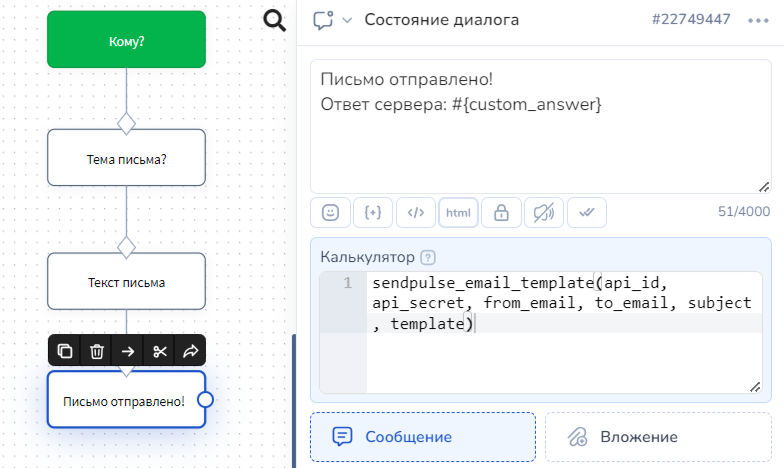

# Sendpulse

## Как настроить Sendpulse API

На стороне Sendpulse есть бесплатный тарифный план, которого хватит для единичных писем.

Для использования API вам потребуется ID, Secret, а так же зарегистрировать email отправителя.&#x20;


Вы можете слать письма только с того адреса, который зарегистрируете на sendpulse


<figure><figcaption></figcaption></figure>

Зарегистрировать почту для отправки можно разделе SMPT

<figure><figcaption></figcaption></figure>

## Как настроить отправку писем из конструктора

Для того чтобы отправить **письмо**, в поле "Калькулятор" вводите:

**sendpulse\_email(api\_id, api\_secret, from\_email, to\_email, subject, message, from\_name), где:**

1. **api\_id** — api id из Сендпульс
2. **api\_secret** — secret из Сендпульс
3. **from\_email** — почта отправителя
4. **to\_email** — почта получателя
5. **subject** — тема письма
6. **message** — тело письма
7. **from\_name** — имя отправителя

Для того чтобы отправить **шаблон**:

Сначала в поле "Калькулятор" задаете значение переменной **template,** это данные по нужному шаблону:

**template** = { "id": "Номер шаблона", "variables": { "имя переменной": "значение переменной", "имя переменной": "значение переменной" \}}

Далее указываете:

**sendpulse\_email\_template(api\_id, api\_secret, from\_email, to\_email, subject, template),** где:

1. **api\_id** — api id из Сендпульс
2. **api\_secret** — secret из Сендпульс
3. **from\_email** — почта отправителя
4. **to\_email** — почта получателя
5. **subject** — тема письма
6. **template** — значение этой переменной мы присвоили выше

Для большей наглядности разберем пример бота, который спрашивает кому, с каким заголовком и каким текстом отправить.

Сохраним значения **api\_id** и **api\_secret** в переменные - для этого переходим в Salebot в раздел Настройки.

<figure><figcaption></figcaption></figure>

Дальше создаем схему собирающую данные.

<figure><figcaption></figcaption></figure>

Протестируем в окне отладки.

<figure><figcaption></figcaption></figure>

Результат на почте

<figure><figcaption></figcaption></figure>

## Как добавить почту в адресную книгу

Для добавления почты в адресную книгу воспользуйтесь методом (прописываем в поле "Калькулятор":

**sendpulse\_add\_to\_addressbook(api\_id, api\_secret,** **book\_id, email, variables=None), где**

1. &#x20;book\_id — id адресной книги
2. email — почта, которую нужно добавить
3. variables — массив переменных, параметр необязательный. Если нужно указать, записывается в виде `{"имя_переменной":"значение_переменной"}`

## Как отправить смс

Чтобы отправить **смс**, в поле Калькулятор введите функцию

**sendpulse\_sms(api\_id, api\_secret, sender, phone, text, transliterate=0, route=None),** где

1. **api\_id** — api id из Сендпульс&#x20;
2. **api\_secret** — secret из Сендпульс&#x20;
3. **sender** — имя отправителя SMS (до 11 символов латиницей, можно с цифрами)&#x20;
4. **phone** — номер телефона, куда отправлять&#x20;
5. **text** — текст сообщения, его нужно брать в кавычки (если вы не подставляете переменную)
6. **transliterate** — указываете, отправлять на транслите или нет (1 или 0 соответственно)&#x20;
7. **route** — список каналов для отправки по странам, можно указать None
