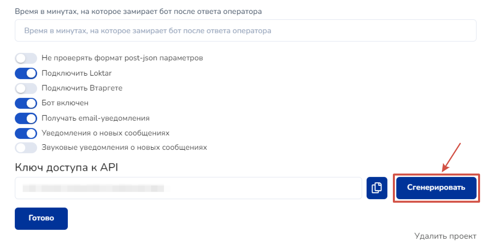
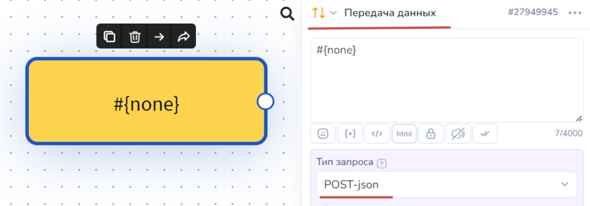

# Vakas-Tools


**ВАЖНО!** Функционал интеграции Vakas-Tools с Salebot доступен только при подключении тарифа «Базы» в VakasTools


Доступный функционал в Vakas-tools совместно с Salebot:

\- Передача регистраций;\
\- Передача событий из отчётов с вебинара;\
\- Передача данных о заказах и оплатах клиента в воронку Salebot.

## Как подключить Salebot к аккаунту Vakas-tools

К Вашему аккаунту Vakas-tools требуется подключение по API сервиса Salebot

Чтобы его подключить, необходимо в своем личном кабинете в меню слева нажать пункт меню «чат - боты»

 (1).png>)

Выбрав пункт Salebot, Вам необходимо вписать API-ключ:

 (1).png>)

В Salebot ключ можно взять в настройках Вашего проекта (пункт Настройки -> в самом низу страницы  Ключ доступа к API -> Сгенерировать):

<figure><figcaption>
Настройки Salebot
</figcaption></figure>

<figure><figcaption>
Генерируем API-ключ
</figcaption></figure>

После добавления ключа в VakasTools в разделе "Базы" станет доступна кнопка Salebot:

 (1).png>)

После подключения станет доступна возможность установить настройки:

 (1).png>)

## Как передать данные регистрации

Чтобы передавать регистрации в вашу базу в Vakas-tools, перейдите в «Регистрации», в меню сверху.

Копируете код из поля Для передачи данных с регистрации на страницу Спасибо.

 (1).png>)

 (1).png>)

Скопированный код нужно поставить на вашу страницу Tilda. Для этого переходим на свою страницу втTilda и добавляем блок Т123 - HTML - код. В разделе контент данного блока вставляем скопированный код, в котором уже прописана ссылка на вашу страницу «Спасибо».

 (1).png>)

После вставки кода нажимаем «Сохранить и закрыть», опубликовываем страницу, чтобы протестировать передачу регистраций.

 (1).png>)

Отправляем тестовую регистрацию. Вводим свои тестовые данные в регистрационной форме и нажимаем кнопку отправки данных (в нашем случае - Записаться на вебинар).

 (1).png>)

После отправки данных Вас перенаправит на страницу "Спасибо". При верной настройке в строке браузера после ссылки на страницу спасибо должны передаться все данные, которые Вы заполнили в форме, ниже на изображении данные из нашей тестовой формы: **Имя, Почта, Телефон**

 (1).png>)

На странице "спасибо" размещены кнопки перехода в мессенджер. Для того чтобы реализовать передачу данных с регистрационной формы на страницу "спасибо", потребуются дополнительные настройки со стороны Salebot.

Во-первых, для работы будем использовать прокси-ссылки на наши мессенджеры. А для этого создадим минилендинг в Salebot и с него скопируем ссылки на необходимые мессенджеры:

 (1).png>)

Полученные ссылки переносим в окно настройки кнопок на нашем сайте Tilda:

 (1).png>)

Во-вторых, разместим на странице Tilda дополнительный script (код). Для этого вернемся в личный кабинет Vakas-Tools -> раздел «Базы», где выбираем интересующую нас базу, и под кнопкой Salebot пункт меню «Регистрации» копируем второй код Для передачи данных в кнопки мессенджеров:

 (1).png>)

 (1).png>)

Вставляем данный код в разделе контент блока Т123:

 (1).png>)

Теперь нажимаем кнопку «Опубликовать».

Идем в воронку Salebot и добавляем новый блок. Этот блок будет передавать данные о клиенте в Salebot:

**Тип блока - передача данных**

**Тип запроса - POST- json**

<figure><figcaption></figcaption></figure>

Текст сообщения можно оставить пустым. Обязательно к заполнению данные поля **URL - запроса** - сюда мы пишем вебхук из раздела Ссылки Вашей Базы.

.png>)

.png>)

Копируем его и вставляем в поле URL-запроса блока воронки.

.png>)

В этом же блоке воронки есть возможность указать JSON-параметры, сюда мы вписываем те параметры, которые нужно передать в базу при регистрации.

.png>)

Параметры из примера:

{

"ss\_id": "#{client\_id}",

"client\_id": "#{client\_id}",

"name": "#{name}",

"phone": "#{phone}",

"email": "#{email}",

"utm\_source": "#{utm\_source}",

"utm\_medium": "#{utm\_medium}",

"utm\_campaign": "#{utm\_campaign}" ,

&#x20;"import":"update"

}

И вновь проводим тестовую регистрацию. Для теста передачи всех данных можете заранее сгенерировать и разметить ссылку с UTM - метками. Теперь переходим в воронку Salebot, нажимаем в меню слева «Клиенты» и проверяем результат передачи данных: справа в карточке клиента Вы должны обнаружить все данные клиента с регистрации:

.png>)

Чтобы передать дополнительные данные о клиенте, нажмите кнопку **«Добавить переменную»**

.png>)

**Например:** дополнительные переменные, которые будут передаватьс&#x44F;**:**

\- Дата вебинара, на которую зарегистрировался клиент.\
\- Сокращенная ссылка на вебинар.

.png>)

Вот в примере нашего тестового клиента передались эти данные Дата вебинара и Сокращенная ссылка на вебинарную комнату:

.png>)

## Как передавать отчеты

.png>)

Нажимаем кнопку «Добавить» и добавляем услови&#x44F;**,** при которых сработает выгрузка данных в SaleBot. **Например:**

.png>)

**Порядок** - « 1 » - порядок важен, т.к. в таком порядке проверяются условия.

**Воронка - startit -** воронка, которая запустится в SaleBot

И выбираете при каких условиях срабатывает данное событие.

**Поле в базе** - был на вебинаре

**Условие** « = »

**Значение поля** - « 1 »

Таким образом, в воронку Вашего проекта будет передана информация о том, что клиент был на вебинаре.

.png>)

Какие данные о вебинаре будем передавать задаем по кнопке «Добавить переменную» для каждого события.

**Например:**

\- был на вебинаре\
\- сколько был минут на вебинаре

.png>)

Эти данные также будут видны в карточке клиента.

.png>)

## Как передавать заказы

.png>)

Нажимаем кнопку «Добавить» и добавляем условия, при котором сработает выгрузка данных в SaleBot.

Пример созданного заказа:

.png>)

**Порядок** - « 1 » - порядок важен, т.к. в таком порядке проверяются условия.

**Воронка - pay -** воронка, которая запустится в SaleBo&#x74;**.**

Далее указываете при каких условиях срабатывает данное событие.

**Поле в базе** - оплачено

**Условие** « > »

**Значение поля** - « 0 »

Таким образом, в воронку Вашего проекта уйдет информация о том, что клиент создал и оплатил какую то часть заказа.

Какие данные о заказе следует передавать задаем по кнопке «Добавить переменную» для каждого события.

.png>)

Например:

sum - стоимость тарифа\
tarif - Название тарифа\
payed - оплачено

Все указанные данные заказа будут переданы в Вашу воронку в Salebot.

.png>)

При таких настройках информация в карточке клиента будет отображена следующим образом:

.png>)

## Как использовать шорткод link в воронке чат-бота на Salebot

Для того чтобы использовать **шорткод link,** который будет **передавать ссылку** на вебинарную комнату из Вашей Базы, Вам нужно создать в воронке блок с кнопкой:

 

.png>)

Нажимаем на кнопку «Вебинар начинается»

Пишем название, которое вам необходимо, задаете настройки кнопки и **пишите вместо ссылки шорткод - #{link}:**

.png>)
