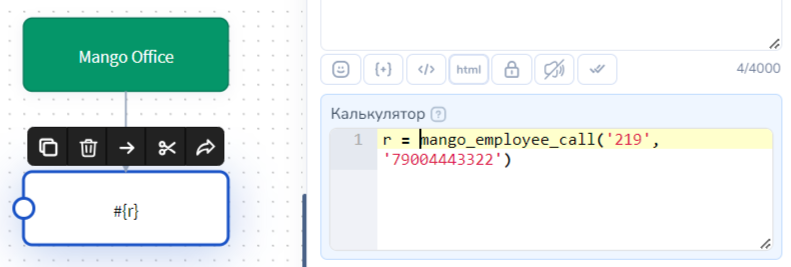
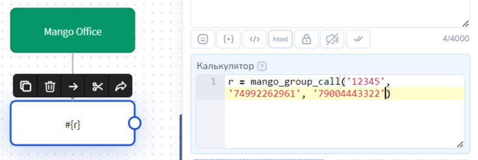

# MANGO OFFICE

## Как подключить сервис

Для подключения Mango к Salebot необходимо получить Api-ключ интеграции и API salt для генерации подписи.  Для этого следует зайти в личный кабинет -> интеграции и внизу страницы выбрать Api- коннектор:

После подключения услуги появятся необходимые данные: \
Уникальный код вашей АТС - mango\_Api\_key(например, 2jhj35hjkbv225nlklmbnv2) \
Ключ для создания подписи - mango\_Api\_salt(например, fds9sdgg4sdgsg2456sgsg8)

Эти данные требуется ввести в окне подключения MANGO OFFICE в Salebot - Телефония:

Сервис Mango Office подключен!&#x20;

## **Настройка групп и сотрудников в MANGO OFFICE**

Однако для успешной работы с телефонией нам понадобится информация о сотрудниках и группах. В главном меню выберите раздел “Сотрудники” и создайте работника, присвоив в графе “внутренний номер” значение номера. В примере - 219.&#x20;

Повторяем процедуру для всех сотрудников компании.

Если Вам понадобится работа с групповыми звонками, тогда следует перейти в подраздел “группы”**,** где необходимо настроить группу, заполнив все поля и присвоив ей уникальный номер(в примере “12345”)

## **Как происходит сопоставление данных клиента**

Для работы с телефонией используются номера в формате 71234567890 (должен начинаться с 7 (или с иного кода другой страны, например, 375), состоять из 11 и более цифр и не иметь лишних знаков и отступов). \
Последовательность сопоставления данных о клиенте: \
1\. Осуществляется поиск клиента Телефонии. Если клиент не найден, то происходит поиск по значениям всех переменных по всему списку клиентов проекта. Первая найденная запись о клиенте считается тем самым "искомым" клиентом. \
2.Если клиент не найден среди клиентов Телефонии и:\
\- к проекту подключен любой мессенджер, например, Whatsapp, то будет создан клиент Whatsapp с данным номером телефона. \
\- к проекту не подключены иные виды мессенджеров (Whatsapp, Viber, Instagram и т.д.), то будет создан клиент Телефонии. Такому клиенту Вы сможете совершать только звонки с получением информации о них. Написать такому клиенту возможности нет.

## Функция Salebot звонок на номер сотрудника

Для того, чтобы совершить звонок сотруднику из бота, необходимо использовать функцию **mango\_employee\_call(short\_employee\_number, client\_phone)**, \
которая принимает на вход следующие параметры: \
short\_employee\_number - короткий номер сотрудника в системе Mango, строка, пример - ‘219’ \
client\_phone - номер клиента, которому должен быть совершен звонок, строка, пример - '79004443322'.&#x20;

Пример реализации функции в боте:

<figure><figcaption></figcaption></figure>

## Функция звонок группе сотрудников в Salebot

Для того чтобы совершить звонок группе сотрудников, необходимо использовать функцию **mango\_group\_call(group\_number, line\_number, client\_phone)**, \
которая принимает на вход следующие параметры: \
**group\_number** - номер группы в системе Mango, строка, пример - ‘12345’ \
**line\_number** - виртуальный номер, который будет использован для переадресации звонков внутри группы, строка. Пример - ‘74992262961’ \
client\_phone - номер клиента, которому должен быть совершен звонок, строка, пример - '79004443322'&#x20;

Пример реализации функции в боте:

<figure><figcaption></figcaption></figure>


ВНИМАНИЕ! Тщательно проверьте настройки групповых звонков в MANGO! При неправильных настройках дозвона можно заспамить клиента вызовами!


## **Настройка звонков из карточки клиента**

Для настройки возможности осуществлять звонки непосредственно из карточки клиента введите сотрудников в систему Salebot. После регистрации сотрудника зайдите в редактирование его данных.

В позиции “Способ совершения телефонных звонков” выберите звонки по API Mango. \
\- Если выбрать пункт **Отключить звонки**, то этот сотрудник не сможет совершать звонки и иконка телефона возле номеров телефона у него не будет отображаться. \
\- **Звонки через приложение** - при нажатии на иконку телефона звонок будет перенаправлен в приложение, установленное для звонков на Вашем устройстве (Zopier и тд). \
\- **Звонки по API Mango** - при клике на иконку телефона АТС звонок поступит сначала сотруднику, чей id вы указали в карточке, а затем перенаправляет звонок клиенту.&#x20;

После выбора способа совершения телефонных звонков в “Звонки по API Mango” появится дополнительное поле, в которое следует вписать короткий номер Вашего сотрудника в системе Mango.

Для осуществления звонка выбранным методом достаточно в карточке клиента нажать на иконку голубой телефонной трубки рядом с его номером телефона:

## **Настройка вебхуков**

Для того чтобы настроить получение колбеков о статусе завершения звонка, необходимо в системе Mango перейти в “Интеграции”-”Api-коннектор”, далее  в разделе “Внешние системы” в поле “Адрес внешней системы” пропишите адрес вида: https://chatter.salebot.pro/mango\_webhook/<апи-ключ>, например, https://chatter.salebot.pro/mango\_webhook/2jhj35hjkbv225nlklmbnv2

В результате при завершении звонков в Salebot будет приходить уведомление следующего вида:

В системе используются множество статусов, обозначающих различные условия завершения звонка. При его наличии код будет присылаться в колбеке.

### Список кодов результатов&#x20;

Ниже приведен список кодов результатов выполнения команд или запросов, завершения вызовов, записей разговоров. В каждом конкретном случае возможно некоторое подмножество результатов. Все коды разделены на классы и подклассы. Например, если внешняя система получает код 2219, то она должна его интерпретировать как 2210 (класс 221х) "Доступ ограничен периодом использования", если 1090 — 1000 (класс 1ххх) "Действие успешно выполнено"

### Код Описание&#x20;

1000 -> Действие успешно выполнено \
1100 -> Вызов завершен в нормальном режиме \
1110 -> Вызов завершен вызывающим абонентом \
1111 -> Вызов не получил ответа в течение времени ожидания \
1120 -> Вызов завершен вызываемым абонентом \
1121 -> Получен ответ "занято" от удаленной стороны \
1122 -> Вызов отклонен вызываемым абонентом \
1123 -> Получен сигнал "не беспокоить" \
1124 -> Вызов завершен по причине недоступности сотрудника \
1130 -> Ограничения для вызываемого номера \
1131 -> Вызываемый номер недоступен \
1132 -> Вызываемый номер не обслуживается \
1133 -> Вызываемый номер не существует \
1134 -> Превышено максимальное число переадресаций \
1140 -> Вызовы на регион запрещены настройками ВАТС \
1150 -> Ограничения для вызывающего номера \
1151  -> Вызывающий номер в «черном» списке \
1152  -> Вызывающий номер не найден в «белом» списке \
1160  -> Вызов на группу не удался \
1161  -> Удержание запрещено настройками ВАТС \
1162  -> Очередь удержания заполнена \
1163  -> Превышено время ожидания в очереди удержания \
1164  -> Все операторы в данный момент недоступны \
1170 -> Вызов завершен согласно схеме переадресации \
1171  -> Неверно настроена схема переадресации \
1180 -> Вызов завершен командой пользователя \
1181  -> Вызов завершен по команде из внешней системы \
1182 -> Вызов завершен перехватом на другого оператора (только для исходящих плеч) \
1183 -> Назначен новый оператор (при команде ApiConnect, обычно при переводах) \
1190 -> Вызываемый номер неактивен либо нерабочее расписание \
1191 -> Вызываемый номер неактивен (снят флажок активности ЛК) \
1192 -> Вызываемый номер неактивен по расписанию

Ниже последуют коды нераспространенных ошибок

1200 -> Ошибка сессий КЦ \
1201 -> Достигнут лимит подключений \
1202 -> Данные сессии не найдены \
1210 -> Сервер КЦ не может принять подключение \
1211 -> Режим обслуживания \
1212 -> Сервер отключен от БД (БРТ) \
1230 -> Завершение сессии КЦ по независимым от пользователя причинам \
1231 -> Перезагрузка сервера КЦ \
1232 -> Сессия завершена администратором \
1233 -> Сессия завершена администратором, рекомендовано восстановление \
1234 -> Сессия завершена администратором, рекомендовано оставаться в оффлайн \
1235 -> Сервер отключился от БД (переход в БРТ) \
1236 -> Изменены критичные данные сессии (логин, пароль, номер телефона, и т.д.) \
2000 -> Ограничение биллинговой системы \
2100 -> Доступ к счету невозможен \
2110 -> Счет заблокирован \
2120 -> Счет закрыт \
2130 -> Счет не обслуживается (frozen) \
2140 -> Счет недействителен \
2200 -> Доступ к счету ограничен \
2210 -> Доступ ограничен периодом использования \
2211 -> Достигнут дневной лимит использования услуги \
2212 -> Достигнут месячный лимит использования услуги \
2220 -> Количество одновременных вызовов/действий ограничено \
2230 -> Услуга недоступна \
2240 -> Недостаточно средств на счете \
2250 -> Ограничение на количество использований услуги в биллинге \
2300 -> Направление заблокировано \
2400 -> Ошибка биллинга \
3000 -> Неверный запрос \
3100 -> Переданы неверные параметры команды \
3101 -> Запрос выполнен по методу, отличному от POST \
3102 -> Значение ключа не соответствуют рассчитанному \
3103 -> В запросе отсутствует обязательный параметр \
3104 -> Параметр передан в неправильном формате \
3105 -> Неверный ключ доступа \
3200 -> Неверно указан номер абонента \
3300 -> Объект не существует \
3310 -> Вызов не найден \
3320 -> Запись разговора не найдена \
3330 -> Номер не найден у ВАТС или сотрудника \
3340 -> Файл не найден \
4000 -> Действие не может быть выполнено \
4001 -> Команда не поддерживается \
4002 -> Продолжительность записи меньше минимально возможной в ВАТС, запись не будет сохранена \
4100 -> Выполнить команду по логике работы ВАТС невозможно \
4101 -> Вызов завершен либо не существует \
4102 -> Запись разговора уже осуществляется \
4200 -> Связаться с абонентом в данный момент невозможно \
4300 -> SMS сообщение отправить не удалось \
4301 -> SMS сообщение устарело \
4391 -> SMS сообщение утеряно (статус возвращает внешний оператор) \
4392 -> SMS сообщение отклонено (статус возвращает внешний оператор) \
4393 -> SMS сообщение отменено (статус возвращает внешний оператор) \
4400 -> Невозможно добавить участника в конференцию \
4401 -> Аппаратная ошибка \
4402 -> Сервис не доступен \
4403 -> Недостаточно ресурсов \
4404 -> Превышено ограничение на количество участников конференции \
4405 -> Подключение запрещено настройками комнаты конференций \
4500 -> Ограничения системы безопасности \
4501 -> Установлено ограничение частоты звонков \
4502 -> Вызывающий номер в черном списке входящих номеров \
4503 -> Превышен максимальный размер файла \
4504 -> Не удалось определить размер файла \
4505 -> Формат файла не соответствует разрешенному \
5000 -> Ошибка сервера \
5001 -> Перезапуск коммутатора, выполняется при срабатывании какого-либо ограничения канала или уровня на коммутаторе. \
5002 -> Перезапуск коммутатора по команде администратора / разработчика \
5003 -> Технические проблемы, внутренняя ошибка на коммутаторе \
5004 -> Проблемы доступа к базе данных коммутатора: не удалось подключиться к базе данных или в результате обработки запроса на манипуляцию с данными (чтение/вставка/удаление/ и так далее) в базе данных выдано сообщение об ошибке. \
5007 -> Во сторонней системе, связанной с коммутатором, выдано сообщение о внутренней ошибке. Сторонняя система не доступна коммутатору. \
5101 -> Нет продукта ЦОВ/ Контакт центр \
5102 -> Превышен лимит активных кампаний \
5103 -> Превышен лимит кампаний \
5105 -> Указанный при создании кампании "abonent\_id" в поле "created by" не существует \
5106 Не удалось вставить задания из-за неподходящего статуса кампании \
5107 -> Количество заданий для кампании превышает допустимое значение (10 000) \
5212 -> Нет активных номеров. Укажите хотя бы один номер \
6000 -> Доставка факса не выполнялась \
6010 -> Технические проблемы сервиса факс-рассылок \
6011 -> Указанный в задании на рассылку номер недоступен в течение часа \
6012 -> Указанный в задании на рассылку номер не существует \
6013 -> На указанном номере не установлен факс-аппарат \
6014 -> Адресат отказался принимать факс \
6100 -> Ошибка при преобразовании факса \
6101 -> Превышен допустимый размер исходного файла (10 мегабайт) \
6102 -> Превышено допустимое число страниц (30)
