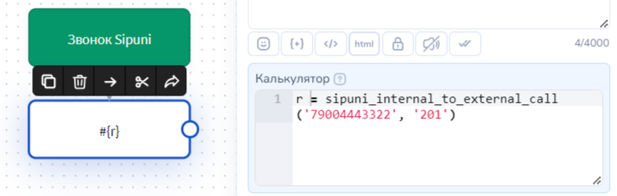
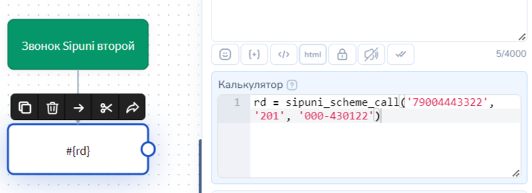

# Sipuni

## Как подключить сервис

Для подключения Sipuni к Salebot необходимо получить ключ интеграции. Для этого следует зайти в настройки - API, и сгенерировать себе API ключ доступа. Также в правом верхнем углу будет номер Вашего кабинета Sipuni - на примере 038226 - этот номер будет Вашим User ID.

Далее следует перейти в Salebot во вкладку телефония и ввести полученные данные в окно Sipuni.

Sipuni подключен! Однако для успешной работы с телефонией нам также понадобится информация о сотрудниках и схемах работы. В меню “Конструктор”, подменю “Сотрудники” добавляем необходимое количество работников, уделяя особое внимание короткому номеру(в примере 201 и 202).

Если Вам понадобится работа со сценариями звонков в телефонии, то в том же “Конструкторе” Вам следует настроить исходящие и входящие схемы. Для успешных звонков в Salebot по сценариям необходимо запомнить номер требуемой схемы. Для этого следует зайти в настройки(или создание) схемы. В примере - номер схемы “000-430122”.


Для звонков по Аpi Sipuni из карточки клиента и при помощи функций необходимо дополнительно подключить Услугу совершение звонков по API Sipuni для сотрудников.


## **Как происходит сопоставление клиента**

Для работы с телефонией используются номера в формате 71234567890 (должен начинаться с 7( или с иного кода другой страны, например, 375), состоять из 11 и более цифр и не иметь лишних знаков и отступов).&#x20;

Последовательность сопоставления данных о клиенте:\
1\. Осуществляется поиск клиента Телефонии. Если клиент не найден, то происходит поиск по значениям всех переменных по всему списку клиентов проекта. Первая найденная запись о клиенте считается тем самым "искомым" клиентом.\
2.Если клиент не найден среди клиентов Телефонии и:

* к проекту подключен любой мессенджер, например, Whatsapp, то будет создан клиент Whatsapp с данным номером телефона.
* к проекту не подключены иные виды мессенджеров (Whatsapp, Viber, Instagram и т.д.), то будет создан клиент Телефонии. Такому клиенту Вы сможете совершать только звонки с получением информации о них. Написать такому клиенту возможности нет.

## **Функция Salebot звонок с внутреннего номера на внешний**

Для того чтобы совершить звонок сотруднику из бота, необходимо использовать функцию sipuni\_internal\_to\_external\_call(client\_phone, short\_employee\_phone) , которая принимает на вход следующие параметры: \
client\_phone - номер клиента, которому должен быть совершен звонок, строка, пример - '79004443322'. \
short\_employee\_phone - короткий номер сотрудника в системе Sipuni, строка, пример - ‘201’&#x20;


Для звонков по Аpi Sipuni  при помощи Функции звонок с внутреннего номера на внешний необходимо дополнительно подключить Услугу совершение звонков по API Sipuni для сотрудников


Пример реализации функции в боте:

<figure><figcaption></figcaption></figure>

## Функция звонок по сценарию в Salebot

Для того чтобы совершить звонок сотруднику из бота, необходимо использовать функцию sipuni\_scheme\_call(client\_phone, short\_employee\_phone, tree\_code), которая принимает на вход следующие параметры: \
client\_phone - номер клиента, которому должен быть совершен звонок, строка, пример - '79004443322'. \
short\_employee\_phone - короткий номер сотрудника в системе Sipuni, строка, пример - '201'

tree\_code - номер схемы, по которой будет распределен звонок от клиента, строка, пример - ‘000-430122’.&#x20;


Для звонков по Аpi Sipuni  при помощи Функции звонок по сценарию необходимо дополнительно подключить Услугу совершение звонков по API Sipuni для сотрудников


Пример реализации функции в боте:

<figure><figcaption></figcaption></figure>

## **Настройка звонков из карточки клиента**

Для настройки возможности осуществлять звонки непосредственно из карточки клиента введите сотрудников в систему Salebot. После регистрации сотрудника зайдите в редактирование его данных.


Для звонков по Аpi Sipuni из карточки клиента необходимо дополнительно подключить Услугу совершение звонков по API Sipuni для сотрудников


В позиции “Способ совершения телефонных звонков” выберите звонки по API Sipuni.&#x20;

* Если выбрать пункт **Отключить звонки**, то этот сотрудник не сможет совершать звонки и иконка телефона возле номеров телефона у него не будет отображаться.&#x20;
* **Звонки через приложение** - при нажатии на иконку телефона звонок будет перенаправлен в приложение, установленное для звонков на Вашем устройстве (Zopier и тд).&#x20;
* **Звонки по API Sipuni** - при клике на иконку телефона АТС звонок поступит сначала сотруднику, чей id вы указали в карточке, а затем перенаправляет звонок клиенту.&#x20;

После выбора способа совершения телефонных звонков в “Звонки по API Sipuni” появится дополнительное поле, в которое следует вписать короткий номер Вашего сотрудника в системе Sipuni.

Для осуществления звонка выбранным методом достаточно в карточке клиента нажать на иконку голубой телефонной трубки рядом с его номером телефона:

## **Настройка вебхуков**

Для того чтобы настроить получение колбеков о завершении звонка, необходимо в системе Sipuni перейти в “Настройки”-”Api” - “События на АТС” и подключить данную услугу и в поле “URL принимающего скрипта”, прописать адрес вида: https://chatter.salebot.pro/sipuni\_webhook/<апи-ключ>, например, https://chatter.salebot.pro/sipuni\_webhook/0.a3skqw8js8d

В результате при завершении звонков в Salebot будет приходить уведомление следующего вида:

В системе используются следующие статусы: \
ANSWER - вызов отвечен \
BUSY - абонент занят \
NOANSWER - абонент не ответил после определённого таймаута \
CANCEL - вызов сброшен \
CONGESTION - перегрузка сети \
CHANUNAVAIL – абонент недоступен (например, sip абонент не зарегистрирован в сети)

Также если у звонка будет иметься запись разговора, то у клиента будет создана соответствующая переменная, содержащая ссылку на запись.

