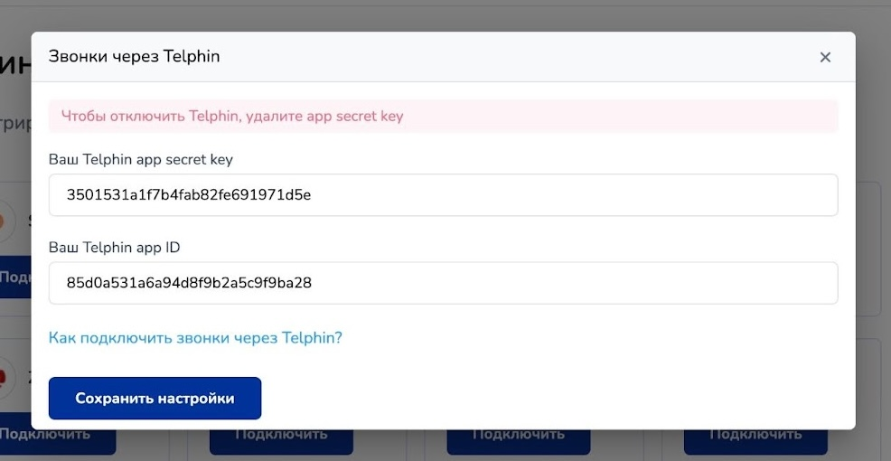
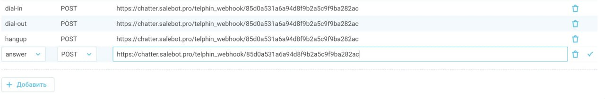

# Телфин

<figure><figcaption></figcaption></figure>

«Телфин» — современный российский поставщик индивидуальных решений для коммуникаций. Среди сервисов «Телфин» — облачная телефония для бизнеса, виртуальная АТС «Телфин.Офис», программный телефон «Телфин.Cофтфон», выгодные тарифы на интернет-телефонию, интеграция с CRM и мессенджерами. \
Компания предоставляет виртуальные номера 75 городов России и 65 стран мира. Собственные резервные каналы гарантируют высочайшую отказоустойчивость сервисов и качественную связь «Телфин» для десятков тысяч абонентов. По данным CNews, «Телфин» входит в ТОР-5 провайдеров IP-телефонии 2023.

## Подключение

### Регистрация Телфин&#x20;

Шаг 1: перейдите[ по ссылке](https://apiproxy.telphin.ru/app/register/):&#x20;

<figure><figcaption></figcaption></figure>

Шаг 2. Регистрация

Далее откроется окно регистрации, где необходимо:

1. application name - прописать любое имя;
2. поле redirect URLs НЕ НУЖНО заполнять;
3. &#x20;Application Type - в данном поле обязательно установить Trusted&#x20;
4. Application Access - установить Call API (у службы поддержки потом можно запросить полный доступ)

Шаг 3. Сохранение секретного ключа

После регистрации на сервисе вы автоматически перейдете на следующую страницу, где увидите следующие поля:

1. App ID
2. App Secret:

<figure><figcaption></figcaption></figure>

Эти данные будут использоваться для нашей интеграции: на Salebot мы укажем именно эти два поля в форме подключения.

### Подключение Salebot

На стороне Salebot вам необходимо перейти в раздел "Телефония" для подключения интеграции:

<figure><figcaption></figcaption></figure>

После чего найдите необходимую интеграцию Телфин и кликните "Подключить":

<figure><figcaption></figcaption></figure>

Вам откроется окно с полями ввода тех данных, которые мы ранее сохранили при регистрации на сайте Телфин: App ID и App Secret:

<figure><figcaption></figcaption></figure>

На этом подключение интеграции закончено.&#x20;

## Функции

Доступно две функции: telphin\_employee\_call, telphin\_group\_call

* telphin\_employee\_call(client\_phone, short\_employee\_number) - стандартная функция для интеграций с телефонией - функция обратного вызова;

принимает два параметра:

1. client\_phone - номер телефона клиента;
2. short\_emplotee\_number - внутренний короткий номер

Пример вызова функции:

<figure><figcaption></figcaption></figure>

* telphin\_group\_call(client\_phone, group\_id) - функция звонка группе, отличается она тем, что тут нужно указать не номер группы, а ее идентификатор.&#x20;

Принимает два параметра:

1. client\_phone - телефон клиента;
2. group\_id - идентификатор группы. Вы можете узнать его у службы поддержки, либо самостоятельно через терминал, предоставленный телфином.

Пример вызова функции:

<figure><figcaption></figcaption></figure>

## Настройка webhook\`ов&#x20;

Для настройки вебхуков необходимо перейти в личный кабинет АТС Телфин:

<figure><figcaption></figcaption></figure>

Для каждого внутреннего номера нужно отдельно настраивать вебхук: для этого кликните по одному из внутренних номеров, и переходите во вкладку события:

<figure><figcaption></figcaption></figure>

Нажимаем на кнопку <mark style="background-color:blue;">**+ Добавить**</mark>, после чего появится плашка, где нужно заполнить 3 поля:

1. Тип события: dial-in, dial-out, answer, hangup. Добавляйте их всех по очереди, чтобы получать уведомления от всех событий.
2. Метод: всегда выбираем POST.
3. URL: <mark style="color:green;">**https://chatter.salebot.pro/telphin\_webhook/**</mark><mark style="color:red;">**#{APP\_ID}**</mark> , где:\
   \- зеленым цветом обозначена неизменяемая часть URL;\
   \- красным цветом - часть URL, в которое необходимо вставить значение App ID


Где найти App ID, читайте в параграфе "[Регистрация Телфин](telfin.md#registraciya-telfin)".


При добавлении событий 4-х типов, вы увидите следующий результат:

<figure><figcaption></figcaption></figure>
