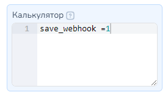
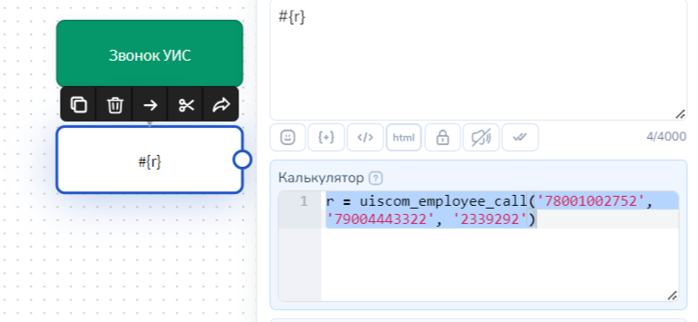
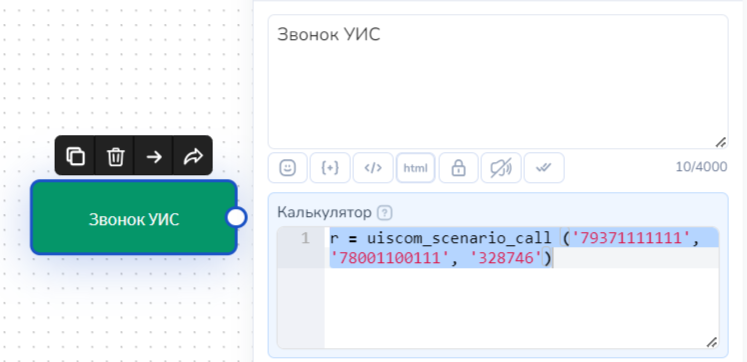
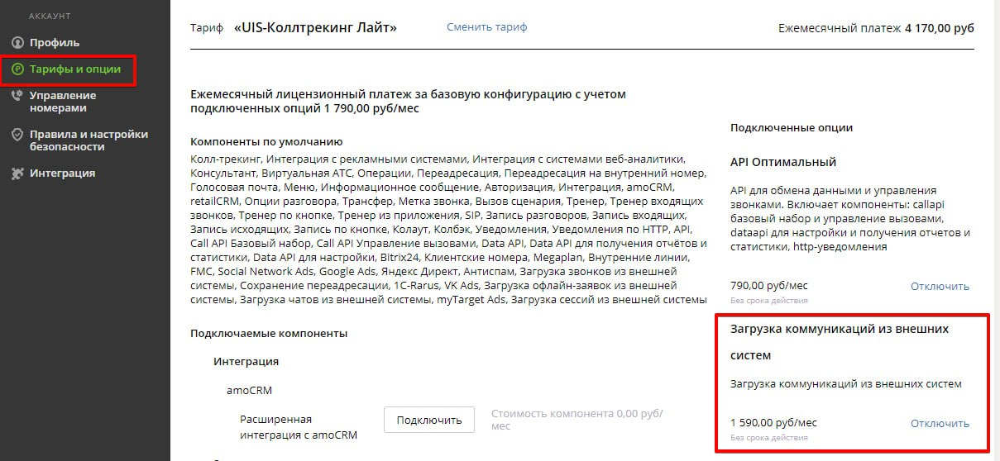

# UISCOM

## **Как подключить сервис**

### **1.**&#x41F;одключение компонента

Для настройки интеграции UISCOM c Salebot.pro в кабинете UIS необходимо подключить компонент API Оптимальный. Подключить компонент можно только под правами Администратора.

Для этого необходимо в верхнем правом углу нажать "Администратор - Аккаунт". Слева в меню выбрать раздел "Тарифы и опции", в предоставленном списке опций найти "API Оптимальный" и нажать кнопку "Подключить".

### 2. Настройка доступов API

Для работы интеграции необходимо сформировать ключ API, а также добавить IP-адрес salesbot.pro в список разрешенных.

Для формирования ключа API  в верхнем правом углу  перейдите в "Администратор - Управление пользователями".

Можно редактировать либо уже имеющегося пользователя, либо создать нового.

При редактировании или создании пользователя внизу должны быть выбраны следующие пункты:

1. Data API
2. Call API
3. Использовать ключ API - бегунок в положении включен&#x20;
4. Время жизни - Вечно

При проставлении галочки _Использовать ключ A&#x50;_&#x49; генерируется сразу ключ, который нужно скопировать. Ключ отображается один раз: до момента сохранения данных при редактировании или создании пользователя. Если вы не скопировали сразу ключ, то можно сгенерировать новый. Полученный ключ API укажите в настройках подключения телефонии UISCOM в вашем проекте Salebot:

В Uiscom после создания пользователя нужно перейти в "Администратор - Аккаунт", слева выбрать раздел "Правила и настройки безопасности", вкладка API. Нажать кнопку "Добавить", ввести в поле IP/Маска <mark style="color:red;">**ДВА IP-адреса: 158.160.42.134 и 62.84.125.172 (адрес salesbot.pro)**</mark><mark style="color:red;">;</mark> и нажать на дискету, чтобы сохранить указанный адрес.


Внимание!&#x20;

**IP-адреса для добавления при настройке интеграции:**

1\)  158.160.42.134

2\) 62.84.125.172

Необходимо добавить оба IP адреса в настройках безопасности во вкладке АPI на стороне Uiscom.&#x20;



При необходимости, можно разрешить в ЛК  запросы с любого ip через 0.0.0.0/0.&#x20;


### 3. Настройка телефонии

Если у вас еще не подключен номер UISCOM, то его можно подключить, перейдя "Администратор - Аккаунт", слева выбрать раздел "Управление номерами" и нажать кнопку "Подключить".

Во всплывающем окне выбрать понравившийся номер, проставить галочку "Согласен с условиями" и нажать кнопку "Подключить".

Для совершения звонков по сценарию, требуется создать сценарий в разделе "Виртуальная АТС - Сценарии".

После создания сценария необходимо получить id сценария, по которому должны обрабатываться звонки. Для этого нужно перейти в редактирование сценария и в адресной строке найти значение параметра "controller.params=xxxxxx" (вам нужны цифры, которые в дальнейшем понадобятся для настроек в salesbot.pro)

Для того чтобы звонки поступали конкретному сотруднику требуется создать соответствующего сотрудника в разделе "Сотрудники".

После создания сотрудника необходимо получить id сотрудника, на которого должны поступать звонки. Для этого нужно перейти в редактирование сотрудника и в адресной строке найти значение параметра "controller.params.recorId=xxxxxxx" (вам нужны цифры, которые в дальнейшем понадобятся для настроек в salebot.pro)

## Как получить полный вебхук от UISCOM


Вебхук - это уведомление о произошедшем событии. Такое уведомление содержит значения измененных переменных.


Для получения полного вебхука от UISCOM достаточно присвоить любое значение переменной  **save\_webhook** \
Переменная может быть как константой проекта, так и переменной сделки.

<figure><figcaption>
Переменная сделки: присваиваем в Калькуляторе блока 
</figcaption></figure>

<figure><figcaption>
Константы проекта
</figcaption></figure>

При этом ответ UISCOM будет записываться в переменную **`uiscom_request`**, которую вы найдете в карточке клиента среди переменных сделки.

<figure><figcaption>
Пример значения переменной <strong><code>uiscom_request</code></strong>
</figcaption></figure>

## **Как происходит сопоставление клиента**

Для работы с телефонией используются номера в формате 71234567890 (должен начинаться с 7, состоять из 11 цифр и не иметь лишних знаков и отступов).&#x20;

Последовательность сопоставления данных о клиенте:

1\. Осуществляется поиск клиента Телефонии. Если клиент не найден, то происходит поиск по значениям всех переменных по всему списку клиентов проекта. Первая найденная запись о клиенте считается тем самым "искомым" клиентом.

2\. Если клиент не найден среди клиентов Телефонии и:\
\- к проекту подключен любой мессенджер, например, Whatsapp, то будет создан клиент Whatsapp с данным номером телефона. \
\- к проекту не подключены иные виды мессенджеров (Whatsapp, Viber, Instagram и т.д.), то будет создан клиент Телефонии. Такому клиенту Вы сможете совершать только звонки с получением информации о них. Написать такому клиенту возможности нет.

## **Функция звонок сотруднику в Salebot**

Для того, чтобы совершить звонок сотруднику из бота, необходимо использовать функцию **uiscom\_employee\_call(virtual\_phone, client\_phone, employee\_id)**, которая принимает на вход следующие параметры: \
virtual\_phone - виртуальный номер, строка, пример - '78001002752' \
client\_phone - номер клиента, которому должен быть совершен звонок, строка, пример - '79004443322'. \
employee\_id - идентификатор сотрудника, которому будет направлен звонок клиента, строка, пример - ‘2339292’.

Пример бота:

<figure><figcaption></figcaption></figure>

## Функция звонок по сценарию в Salebot

Для того чтобы совершить звонок сотруднику из бота, необходимо использовать функцию **uiscom\_scenario\_call( virtual\_phone, client\_phone, scenario\_id)** , которая принимает на вход следующие параметры: \
virtual\_phone - виртуальный номер, строка, пример - '78001002752' \
client\_phone - номер клиента, которому должен быть совершен звонок, строка, пример - '79004443322'. \
scenario\_id - идентификатор сценария, по которому будет распределен звонок клиента, строка, пример - ‘328746’. \
Пример реализации функции в боте:

<figure><figcaption></figcaption></figure>

## **Настройка звонков из карточки клиента**

Чтобы настроить осуществление звонков непосредственно из карточки клиента. Для этого в систему Salebot вы должны внести своих сотрудников. После того, как вы зарегистрировали сотрудника, зайдите в редактирование его данных.

В позиции “Способ совершения телефонных звонков” выберите звонки по API Uiscom.&#x20;

* Если выбрать пункт **Отключить звонки**, то этот сотрудник не сможет совершать звонки и иконка телефона возле номеров телефона у него не будет отображаться.&#x20;
* **Звонки через приложение** - при нажатии на иконку телефона звонок будет перенаправлен в приложение, установленное для звонков на Вашем устройстве (Zopier и тд).&#x20;
* **Звонки по API Uiscom** - при клике на иконку телефона АТС звонок поступит сначала сотруднику, чей id вы указали в карточке, а затем перенаправляет звонок клиенту.

Далее потребуется указать виртуальный номер, зарегистрированный в Uiscom, а также id данного сотрудника в системе Uiscom.

Для осуществления звонка выбранным методом достаточно в карточке клиента нажать на иконку телефонной трубки рядом с его номером телефона:

## **Настройка вебхуков**

Чтобы настроить прием вебхуков с сервиса UIS, необходимо перейти в личный кабинет в раздел "Уведомления":

<figure><figcaption></figcaption></figure>

Далее нажмите на "Добавить уведомление":

Вы перейдете в настройки для добавления уведомлений:

<figure><figcaption></figcaption></figure>

Поставьте свитчер HTTP  в положение ВКЛ, метод - POST, а URL прописать вида [https://chatter.salebot.pro/uiscom\_webhook/](https://chatter.salebot.pro/uiscom_webhook/9xd99uobn9efrkjlx9ybsuz99c9m9nmz9fossm93)<апи-ключ>, например, **https://chatter.salebot.pro/uiscom\_webhook/9xd99uobn9efrkjlx9ybsuz99c9m9nmz9fossm93**

<figure><figcaption></figcaption></figure>

В тело запроса следует вставить следующий список: \
{ "external\_id":\{{external\_id\}}, \
"notification\_name":\{{notification\_name\}}, \
"virtual\_phone\_number":\{{virtual\_phone\_number\}}, \
"notification\_time":\{{notification\_time\}}, \
"scenario\_name": \{{scenario\_name\}}, \
"wait\_time\_duration" : \{{wait\_time\_duration\}}, \
"employee\_ids":\{{employee\_ids\}}, \
"contact\_info":{\
"contact\_phone\_number":\{{contact\_phone\_number\}}, \
"communication\_number":\{{communication\_number\}}, \
"contact\_id": \{{contact\_id\}}, "contact\_full\_name":\{{contact\_full\_name\}} \
}, \
"call\_session\_id":\{{call\_session\_id\}} \
}

Тип события уведомления и название уведомления вы выбираете самостоятельно:

<figure><figcaption></figcaption></figure>

При подключении вебхуков после совершения звонка клиенту в диалог приходят вебхуки вида "Uiscom\_event {название\_уведомления}":

Где название вы задали самостоятельно в настройках Uiscom.&#x20;

## Прочий функционал UISCOM

### 1.Функция для загрузки офлайн-заявок в UISCOM

Для включения функциональности загрузки заявок в личном кабинете UIS / CoMagic, в разделе Тарифы и опции требуется подключить опцию "Загрузка коммуникаций из внешних систем".&#x20;


Если такой опции в личном кабинете нет, скорее всего у Вас тариф, на котором данная опция не поддерживается. В таком случае пользователю нужно будет обратиться к своему менеджеру UIS / CoMagic.


<figure><figcaption></figcaption></figure>

**uiscom\_offline\_messages(message, site\_id, campaign\_id, visitor\_session\_id, phone, name)**&#x20;

Параметры:\
**message** - текст заявки из параметров site\_id, campaign\_id, visitor\_session\_id должен быть передан только один

**site\_id** - уникальный идентификатор сайта, с которого будет передана заявка ([подробнее  ниже](uiscom.md#2.funkciya-dlya-polucheniya-saitov-i-ikh-identifikatorov))&#x20;

**campaign\_id** - уникальный идентификатор рекламной кампании в CoMagic ([подробнее ниже](uiscom.md#3.funkciya-dlya-polucheniya-reklamnykh-kampanii-i-ikh-identifikatorov))

&#x20;<mark style="color:red;">**Внимание!!!**</mark> Если в campaign\_id выберете id -1, то указывать надо site\_id&#x20;

**visitor\_session\_id** - Уникальный идентификатор сессии посетителя, полученный из CoMagic. Для получения ID необходимо использовать[ метод JS API Comagic.getSessionId() ](http://www.comagic.ru/support/api/javascript-api/)\
<mark style="color:red;">**ВАЖНО!**</mark> эти данные нужно будет получать с использованием JS API на своем сайте, а не через Salebot

**phone** - необязательный параметр, контактный номер телефона.  Будет добавлен автоматически, если номер телефона присваивался какой-либо переменной ранее и не был передан в текущей функции. &#x20;

**name** - имя клиента, если не передать в функции, то будет взято имя клиента из раздела клиенты

### 2.Функция для получения сайтов и их идентификаторов&#x20;

**uiscom\_get\_sites()** - вернет словарь вида: {'test.ru': 80913}. Ключ - доменное имя сайта, значение - его id

### 3.Функция для получения рекламных кампаний и их идентификаторов&#x20;

**uiscom\_get\_campaigns()** - вернет словарь вида: {'Тестовый источник': 401745, 'Посетители без рекламной кампании': -1}, где ключ - имя кампании, значение - его id. <mark style="color:red;">id равный -1 использовать нельзя!</mark>
