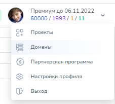

# Zvonobot

## Как подключить сервис

Для подключения Zvonobot к Salebot необходимо получить api-ключ. Для этого следует зайти в личный кабинет -> профиль. Внизу вы найдете кнопку **сгенерировать Api-ключ**.

<figure><figcaption>
Меню Звонобот
</figcaption></figure>

<figure><figcaption>
Форма получения API-ключа
</figcaption></figure>

Сохраните его в надежное место. Вы всегда можете использовать ранее полученный ключ или перегенерировать его


Стоит помнить, что после перегенерации ключа придется поменять его на новые во всех местах, где он использовался.&#x20;


Далее следует перейти в Salebot во вкладку телефония и ввести полученные данные в форму подключения Zvonobot.

<figure><figcaption>
Форма подключения Zvonobot в Salebot
</figcaption></figure>

Zvonobot подключен!&#x20;

Далее для успешной работы с телефонией нам понадобится номер сотрудника и идентификатор аудиозаписи, которая будет использоваться в рассылках. Для добавления номера следует зайти в **Другое-Номера телефонов** и установить номер, с которого будут рассылаться сообщения. Номеров может быть несколько, и они могут быть прикреплены ко всем вашим сотрудникам. Можете использовать системные номера сервиса либо добавить личный номер, чтобы абонентам приходили звонки с него. Если вы арендуете системный номер, то все, кто перезвонит по этому номеру, услышат ваш голосовой ролик.&#x20;

<figure><figcaption>
Подключение номера телефона
</figcaption></figure>

Для того чтобы добавить аудиозапись, следует пройти в меню аудиоролики и нажать создать видеоролик. Вам будут доступны несколько вариантов создания: загрузить аудиозапись заранее, надиктовать ее или же прописать текстом - после чего робот прочтет ее за вас. На выбор есть мужской и женский голос прочтения.

<figure><figcaption>
Создание аудиоролика
</figcaption></figure>

После того как вы добавите ролик, его необходимо послать на модерацию.&#x20;


Перед использованием Ваш аудиоролик должен быть обработан модератором.

**Требования:**&#x20;

Длительность ролика не менее 7 секунд


После обработки модератором аудиозаписи будет присвоен идентификатор - например, 1484915.

<figure><figcaption>
Перечень аудиозаписей
</figcaption></figure>

## **Как происодит сопоставление клиента**


**Требования к формату номера телефона**: \
\- Номер должен начинаться с 7 или иного кода страны, например 375 \
\- Номер должен состоять из 11 и более цифр и не иметь лишних знаков и отступов.\
Например: 71234567890


&#x20;Последовательность сопоставления данных о клиенте: \
1\. Осуществляется поиск клиента Телефонии. Если клиент не найден, то происходит поиск по значениям всех переменных по всему списку клиентов проекта. Первая найденная запись о клиенте считается тем самым "искомым" клиентом. \
2.Если клиент не найден среди клиентов Телефонии и: \
● к проекту подключен любой мессенджер, например, Whatsapp, то будет создан клиент Whatsapp с данным номером телефона. \
● к проекту не подключены иные виды мессенджеров (Whatsapp, Viber, Instagram и т.д.), то будет создан клиент Телефонии. Такому клиенту Вы сможете совершать только звонки с получением информации о них. Написать такому клиенту возможности нет.

## Функция Salebot звонок на номер&#x20;

Для того чтобы совершить звонок из бота, необходимо использовать функцию **zvonobot\_call(number, client\_phone, record\_id)**, которая принимает на вход следующие параметры: \
**number** - номер, с которого будет совершаться звонок. \
**client\_phone** - номер клиента, которому должен быть совершен звонок, строка, пример - '79004443322'. \
**record\_id** - идентификатор аудиозаписи.&#x20;

**Пример реализации функции в боте:** 

<figure><figcaption>
Пример сборки схемы в боте
</figcaption></figure>

<figure><figcaption>
Пример сборки схемы в боте
</figcaption></figure>

## Функция Salebot звонок на номер и последующее нажатие на кнопку&#x20;

Иногда предполагается, что после проигрывания сообщения клиент должен нажать кнопку, чтобы оставить свое намерение.&#x20;

Функция **zvonobot\_digits\_call (number, client\_phone, record\_id, payload)** позволит передать назначения на цифры от 0 до 9, среди которых \
а) включить следующую аудиозапись, \
б) прислать смс с текстом, \
в) перенаправить звонок на менеджера, \
г) разрешить клиенту добавить этот номер в чс.&#x20;

Функция принимает на вход следующие параметры: \
**number** - номер, с которого будет совершаться звонок. \
**client\_phone** - номер клиента, которому должен быть совершен звонок, строка, пример - '79004443322'. \
**record\_id** - идентификатор аудиозаписи. \
**payload** - список действий, состоящий из словарей, где ключи состоят из ключевых слов, обозначающих действие: \
&#xNAN;**"record"** - проиграть запись с указанным идентификатором, \
&#xNAN;**"managerPhone"** - перенаправить звонок на менеджера с указанным телефоном, \
&#xNAN;**"smsText"** - отправить на номер клиента смс с указанным текстом \
&#xNAN;**"needBlock"** - установить значение 1 для добавления номера в чс.&#x20;

payload может состоять из 10 словарей, каждый из которых соответствует цифре индекса в списке, т.е от 0 до 9&#x20;

Пример оформления **payload**: payload = \[{"record" : "1460168"},{"managerPhone": "74242490764"},{"smsText": "Привет, это Толик"},{"needBlock": "1"}]&#x20;

В данном примере при нажатии на цифру 0 будет проигрываться аудиосообщение с идентификатором 1460168, при нажатии на цифру 1 звонок будет перенаправлен менеджеру на номер 74242490764, при нажатии на цифру 2 будет отправлено смс с текстом “Привет, это Толик, а при нажатии на цифру 3 номер будет занесен в ЧС для данного клиента.&#x20;

Пример реализации функции в боте:&#x20;

<figure><figcaption>
Пример использования функции <strong>zvonobot_digits_call</strong>
</figcaption></figure>

## Настройка звонков из карточки клиента&#x20;

Для настройки возможности осуществлять звонки непосредственно из карточки клиента введите сотрудников в систему Salebot. После регистрации сотрудника зайдите в редактирование его данных.&#x20;

<figure><figcaption></figcaption></figure>

В позиции “Способ совершения телефонных звонков” выберите звонки по API Zvonobot.&#x20;

● Если выбрать пункт Отключить звонки, то этот сотрудник не сможет совершать звонки и иконка телефона возле номеров телефона у него не будет отображаться.&#x20;

● Звонки через приложение - при нажатии на иконку телефона звонок будет перенаправлен в приложение, установленное для звонков на Вашем устройстве (Zopier и тд).&#x20;

● Звонки по API Zvonobot - при клике на иконку телефона АТС звонок поступит c номера, указанного в карточке сотрудника, и проиграется указанная аудиозапись.&#x20;

После выбора способа совершения телефонных звонков в “Звонки по API Zvonobot” появится дополнительное поле, в которое следует вписать номер, с которого будет идти звонок, и ид аудиозаписи.

<figure><figcaption>
Форма редактирования данных
</figcaption></figure>

Для осуществления звонка выбранным методом достаточно в карточке клиента нажать на иконку голубой телефонной трубки рядом с его номером телефона:

<figure><figcaption>
Отображение данных в карточке клиента Salebot
</figcaption></figure>

## Настройка вебхуков

После совершения звонка в карточку клиента будет доставлено уведомление о его завершении или отмене.

<figure><figcaption></figcaption></figure>

<figure><figcaption></figcaption></figure>
