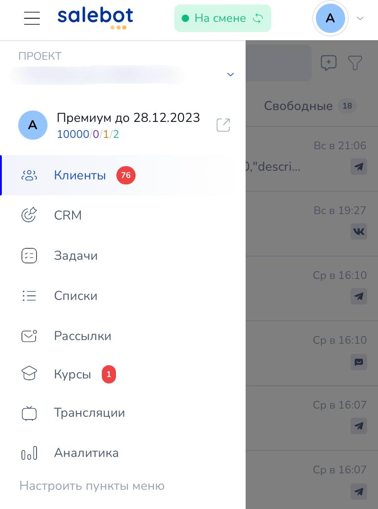

# Мобильное приложение

<figure><figcaption></figcaption></figure>

Приложение Salebot - ваш бизнес в кармане, где можно комфортно общаться с клиентами в дороге и без ноутбука.

В приложении Salebot можно создавать от простых автоворонок до чат-ботов, полностью автоматизирующих Ваш бизнес: практически весь функционал платформы доступен в вашем смартфоне.&#x20;

Основные преимущества мобильного приложения Salebot:

1. Защита аккаунта двухфакторной аутентификацией;
2. Push-уведомления: всегда можно быть на связи и не упускать ни единого клиента.
3. Просмотр существующих задач в системе и создание новых;
4. Встроенная SalebotCRM всегда рядом - для этого не нужен ноутбук или компьютер;
5. Доступна вся аналитика пользовательских проектов;
6. Настройка созданных курсов и добавление новых материалов прямо с телефона.

Скачать мобильное приложение можно в App Store, RuStore и GooglePlay:







## Начало работы с приложением Salebot

<figure><figcaption>
Оставайтесь всегда на связи!
</figcaption></figure>

## Авторизация в приложении

После установки приложения на мобильный телефон требуется авторизация: войдите в существующий аккаунт Salebot с помощью почты или с использованием аккаунта в социальных сетях (в случае использования приложения на iOS существует возможность использовать аккаунт iCloud Apple).

<figure><figcaption></figcaption></figure> <figure><figcaption></figcaption></figure>


Ваши данные защищены двухфакторной аутентификацией.


В приложении можно подключить двухфакторную аутентификацию. Если она подключена, следующим шагом приложение запросит ввести проверочный код из мессенджера, выбранного для двухфакторной аутентификации.  После успешной авторизации открывается раздел Профиль. После выбора проекта по умолчанию откроется вкладка Клиенты.

<figure><figcaption>
В мессенджер приходит проверочный код
</figcaption></figure> <figure><figcaption></figcaption></figure>


После успешной авторизации в мессенджер приходит уведомление с датой входа, местоположением и IP-адресом устройства.


### Подключение двухфакторной аутентификации (авторизации)

Пошаговая инструкция подключения двухфакторной авторизации в приложении Salebot.\
\
Шаг 1 . Зайдите в раздел Профиль. В верхнем правом углу под аватаркой нажимаем кнопку вызова меню (три точки). Откроется всплывающее меню. Нажимаем "Редактировать".&#x20;

<figure><figcaption></figcaption></figure>

Шаг 2. В нижней части открывшегося окна видим настройку Безопасность. Включаем ползунок "Включить двухфакторную авторизацию".  Видим кнопки для выбора каналов и установки мессенджера для авторизации, в который будет приходить код по умолчанию.

<figure><figcaption></figcaption></figure>

<figure><figcaption></figcaption></figure>

Шаг 3. Выбрать мессенджер для авторизации.\
Выбрать можно один или несколько каналов. В этот канал будет приходить информация о входах в аккаунт и проверочные коды для авторизации.

<figure><figcaption></figcaption></figure>

При подключении Telegram осуществляется перенаправление в официального бота Salebot.pro, где необходимо нажать Запустить (Старт). Вам придет сообщение от бота "Аккаунт успешно привязан к Сейлбот".

С этого момента ваши данные защищены двухфакторной авторизацией. Теперь уведомления о новом входе с IP адресом, местоположением и датой входа будут приходить в данном чате с официальным ботом от Salebot.

<figure><figcaption></figcaption></figure>

## Основные разделы приложения

В правом меню можно увидеть основные разделы доступные на данный момент в приложении.

В разделе Профиль выберите любой проект. Откроется вкладка Клиенты. Здесь все диалоги с клиентами текущего проекта. Чтобы перейти в меню с основными разделами приложения нажмите в левом верхнем углу кнопку  Меню (Три горизонтальные полосы).

<figure><figcaption></figcaption></figure>

В открывшемся меню расположены кнопки перехода между основными разделами, которые облегчают работу с клиентами и делают её эффективной:

* [Клиенты](mobilnoe-prilozhenie.md#klienty)
* [SalebotCRM](mobilnoe-prilozhenie.md#salebotcrm)
* [Задачи](mobilnoe-prilozhenie.md#zadachi)
* [Списки](mobilnoe-prilozhenie.md#spiski)
* [Рассылки](mobilnoe-prilozhenie.md#rassylki)
* [Курсы](mobilnoe-prilozhenie.md#kursy)
* [Трансляции](mobilnoe-prilozhenie.md#translyacii)
* [Профиль](mobilnoe-prilozhenie.md#profil)
* [Аналитика](mobilnoe-prilozhenie.md#analitika)

<figure><figcaption></figcaption></figure>

### Клиенты

В разделе Клиенты отображаются диалоги с клиентами. В зависимости от настроек роли сотрудника  будут отображаться вкладки разделения диалогов:\
Все, Без ответа, Мои, Свободные, Фильтр.

#### Фильтр клиентов

Для того чтобы отфильтровать клиентов по необходимым параметрам, откройте настройки фильтра. Для этого в разделе Клиенты в правом углу нажмите кнопку меню(три точки) и откроется форма фильтра.&#x20;

<figure><figcaption></figcaption></figure> <figure><figcaption></figcaption></figure> <figure><figcaption></figcaption></figure>

Настройте необходимый фильтр и нажмите "Фильтровать". Клиенты, попадающие под параметры фильтрации, отобразятся во вкладке Фильтр.&#x20;


Настройки фильтра можно сохранить и в дальнейшем использовать для быстрой фильтрации клиентов.


#### Диалог с клиентом

Рассмотрим основные разделы диалога и доступный функционал приложения.&#x20;

Для примера выберем рандомный диалог в списке: кликнув по нму, откроется переписка с клиентом, сохраненная в проекте. Рассмотрим подробнее каждую вкладку и кнопку в диалоге:&#x20;

<figure><figcaption></figcaption></figure>

1 - кнопка "**Остановить бота".**

Чтобы бот не вмешивался в общение менеджера и клиента, бота для этого клиента можно поставить на паузу

2 - кнопка "**Меню действий с диалогом клиента".**

В этом меню находятся:&#x20;

Поиск по сообщениям, Отметить диалог непрочитанным, Заблокировать и Удалить клиента.

<figure><figcaption></figcaption></figure>

3 - кнопка "**Добавить вложения"**

Можно добавлять изображения, аудио, видео и другие файлы. Вы можете использовать уже загруженные материалы в Salebot или добавлять новые. Файлы также можно загружать по ссылке.&#x20;

<figure><figcaption></figcaption></figure>

Массовые действия с файлами позволяют выделять несколько или все файлы и выполнять с ними необходимые действия.

4 - кнопка "**Быстрые ответы"**

<figure><figcaption></figcaption></figure>

Можно создавать шаблоны ответов. Это избавит от необходимости писать их вручную. Достаточно нажать на нужный ответ, и он появится в поле для отправки сообщения.

<figure><figcaption></figcaption></figure>

5 - кнопка "**Отправить сообщение из воронки"**

<figure><figcaption></figcaption></figure>

Можно выбрать блок из воронки и отправить клиенту. Таким способом можно запустить другой сценарий у клиента, переместить по воронке или отправить заранее подготовленные ответы.

6 - кнопка "**Ввод сообщения"**

#### _**Информация о клиенте**_

_**Кнопки распределения клиентов:**_\
_-_ Взять клиента;\
\- Отказаться

Вкладка "О клиенте": здесь вы увидите всю информацию о клиенте, как в десктопной версии Сейлбота:\
а) переменные; \
б) метки и списки; \
в) имя клиента; \
г) айди клиента и многое другое:&#x20;

<figure><figcaption>
Вкладка о клиенте
</figcaption></figure>

Вкладка “Комментарии”: Здесь вы можете оставлять свои комментарии для каждого клиента.

<figure><figcaption></figcaption></figure>

Вкладка "Сделки SalebotCRM": здесь вы увидите, в каком состоянии воронки в CRM находится ваш клиент:

<figure><figcaption></figcaption></figure>

Вкладка "Задачи": покажет прикрепленные к клиенту задачи:

<figure><figcaption></figcaption></figure>

_**Верхняя строка:**_\
\- имя клиента;\
\- ID  клиента: легко копировать нажатием кнопки копировать рядом с ID;\
\- ссылка на диалог с этим  клиентом.

Меню действий с диалогом клиента

Сообщение.

* Сообщения от клиента на сером "облаке", от бота и менеджера - на голубом. При некоторых настройках роли сотрудника доступно удаление сообщений и возможность закрепить сообщение. Для этого достаточно нажать на сообщение и удерживать до появления всплывающего окна с командами Удалить /Закрепить сообщение/ Копировать текст сообщения

<figure><figcaption></figcaption></figure>

### Ученики

<figure><figcaption></figcaption></figure>

Зарегистрировать нового ученика можно, нажав кнопку “+”. Откроется меню настроек регистрации.

<figure><figcaption></figcaption></figure>

Можете отфильтровать список учеников, для этого нажмите на значок фильтра. Откроются настройки фильтра:

<figure><figcaption></figcaption></figure>

В карточке ученика можно выполнить определенные действия, для этого нажмите на три точки в верхнем углу справа.

<figure><figcaption></figcaption></figure>

### SalebotCRM

<figure><figcaption></figcaption></figure>

Добавить сделку можно, нажав на кнопку “Быстрое добавление” или на синий значок “+”

<figure><figcaption></figcaption></figure>

Откроется меню “Создание сделки” с вкладкой “Общая информация”:

<figure><figcaption></figcaption></figure>

и вкладкой “Переменные сделки”:

<figure><figcaption></figcaption></figure>

Также вы можете открыть настройки фильтра (1) и настройки воронки (2):

<figure><figcaption></figcaption></figure>

В настройках фильтра вы можете выбрать, как отображать данные: по категориям сделок, клиентам, сотрудникам, ответственным за сделки и клиентов, цене сделки, переменным, дате создания, спискам и меткам, а также статусам.&#x20;

<figure><figcaption></figcaption></figure>

После применения настроек задайте имя фильтру, и он появится в разделе «Сохраненные фильтры». Чтобы сбросить все настройки фильтра, нажмите кнопку "Сбросить фильтр".

### Настройки фильтра

В настройках воронки можно изменить её название, выбрать валюту (рубли, евро, доллары и другие), добавить и отредактировать состояния. Также можно настроить отображение полей в формате «Доска», управлять скрытыми состояниями, настроить вывод и действия со сделками и онлайн-запись.&#x20;

Не забудьте указать адрес компании и настроить отображение переменных на карточках сделок. Также вы можете удалить все состояния из воронки, нажав на одноименную кнопку.

<figure><figcaption>
Настройки воронки
</figcaption></figure>

### Задачи

Раздел планирования задач для сотрудников. Удобно и легко создавать и редактировать задачи.

Чтобы открыть описание задачи, нужно просто кликнуть на неё. В описании можно изменить сроки выполнения, назначить ответственного и указать, с каким клиентом связана задача.

<figure><figcaption></figcaption></figure>

#### Задачи: все задачи

1 - Оформление раздела “Задачи” можно изменить на “Доска”, “Список” или “Канбан”.

2 - Значок поиска задач. После нажатия на него появится поле для поиска задач.

3 - Значок фильтра задач. После нажатия откроется меню настроек фильтра.

<figure><figcaption></figcaption></figure>

#### Настройка фильтра задач

В открытой задаче в правом верхнем углу есть меню (три точки). Используйте его чтобы перейти к диалогу с клиентом, указанным в задаче, или для удаления задачи.

<figure><figcaption></figcaption></figure>

#### Редактирование задачи

В открытой задаче вы также можете добавить участников (сотрудников), клиентов, выбрать состояние, приоритет, изменить описание, срок выполнения и другое.

### Списки

Аналог раздела Списки веб-версии конструктора. В данном разделе есть две вкладки: Списки и Метки.

Работа со списками:\
\- Создать рассылку по списку\
\- Добавить в список\
\- Удалить из списка\
\- Удалить клиентов из проекта\
\- Удалить список\
\- Редактировать список: изменить название

Работа с метками:\
\- Создать рассылку по метке\
\- Добавить в метку\
\- Удалить из метки\
\- Удалить клиентов из проекта\
\- Удалить метку\
\- Редактировать метку: изменить название и цвет метки

Чтобы открыть меню настроек списка/метки нажмите три точки в выбранном списке/метке.

<figure><figcaption></figcaption></figure> <figure><figcaption></figcaption></figure>

Чтобы добавить новый список или метку нажмите на синий значок “+” в нижнем правом углу экрана.

<figure><figcaption>
Меню настроек списка
</figcaption></figure> <figure><figcaption>
Меню настроек метки
</figcaption></figure>

### Рассылки

Аналог раздела Рассылки веб-версии конструктора:

<figure><figcaption></figcaption></figure>

В приложение добавлена возможность создавать рассылки в мессенджерах и email (если данный канал подключен).

Для создания новой рассылки нажмите на синий значок “+” в нижнем правом углу экрана.

Откроется меню настроек создания рассылки.&#x20;

Форма создания рассылки включает три вкладки: "Получатели", "Сообщение" и "Отправка".

На вкладке "Получатели" вы можете выбрать адресатов. Если фильтры не установлены, рассылка отправится всем подписчикам. Здесь можно задать тип фильтра, состояние в Salebot CRM, исключить отписавшихся и многое другое.

Вкладка "Сообщение" позволяет редактировать текст, добавлять вложения, кнопки и другие элементы.

<figure><figcaption></figcaption></figure>

Вкладка "Отправка" дает возможность настроить запланированную отправку или отправить рассылку немедленно, а также разделить ее на несколько частей.

Настроить рассылки вы можете так же, как и на платформе Salebot через ноутбук/компьютер.


Подробнее о настройках рассылок рассказали в статье [Рассылки в мессенджеры](https://docs.salebot.pro/rassylki-1/rassylki).


Нажмите кнопку “Предпросмотр” для предварительного ознакомления с настройками рассылки.

### Курсы

Редактирование курсов для авторов доступно как на официальном сайте Salebot, так и через мобильное приложение. К тому же ученики ваших курсов также могут проходить обучение с помощью смартфона.

<figure><figcaption></figcaption></figure>

В данном разделе можно увидеть уже созданные курсы в проекте, а также редактировать их и добавлять новые материалы для уроков.

Для того чтобы отредактировать основные настройки курса, кликните по одноименной кнопке синего цвета, где можно:

* Изменить название курса и его описание, а также применить текстовые настройки аналогично функционалу на платформе Salebot через ноутбук/компьютер:

<figure><figcaption></figcaption></figure>

* Выбрать другие настройки:

<figure><figcaption></figcaption></figure>

Выбор платежной системы: через приложение доступно выбрать оплату через бота или через Продамус/Робокассу.

С помощью "Скрыть лейблы" при необходимости можно скрыть лейбл Salebot.

При активации переключателя "настройка обложки" существует возможность выровнять обложку относительно высоты, отступа сверху и снизу (в полях указываются числовые значения).

При необходимости использования собственного логотипа примените переключатель "Свой логотип в шапке", где в поле URL укажите ссылку на файл, который хотите отображать в качестве лого, либо загрузите изображение файлом:

<figure><figcaption></figcaption></figure>

Если вы не хотите распространения вашего оригинального текста обучения, активируйте переключатель "Запретить копирование текста".&#x20;

Также для отображения кнопок навигации используйте одноименный переключатель "Показывать кнопки навигации по урокам".

Для того чтобы отображать превью в списке курсов ученика, используйте одноименный переключатель и загрузите изображение систему файлом или с помощью ссылки:

<figure><figcaption></figcaption></figure>

**Настройка внешнего вида страница для личного кабинета ученика**

<figure><figcaption></figcaption></figure>

Настройка в данном окне говорит сама за себя: здесь можно настроить отображение вида курса для учеников вашего курса.

<figure><figcaption></figcaption></figure>

Здесь можно прогрузить обложку для курса, а также выбрать цвет фона и настроить кнопки для перехода, например, на приветственное видео от авторов курса.

Как было сказано ранее, с помощью мобильного приложения вы можете не только редактировать основные настройки курса, но также и добавлять новые материалы по обучению и устанавливать тарифы или редактировать уже существующие.

Вверху экрана вашего смартфона можно увидеть поле с названием раздела: разверните данное поле и перейдите в настройки того элемента курса, которое вам необходимо:

<figure><figcaption></figcaption></figure>

Для быстрого перехода смахните страницу вправо:

<figure><figcaption></figcaption></figure>

Для каждого раздела курса будь то тарифы, либо чат с учениками можно применить настройки, аналогичные настройкам на платформе Salebot для компьютеров/ноутбуков.

Добавить новый тариф/модуль/урок и пр. или отредактировать уже существующий можно при переходе в одноименный раздел, где вы увидите актуальные тарифы/модули/уроки и пр. своего курса, а также сможете применить к нему новые настройки.

### Трансляции

С помощью вкладки "Трансляции" существует возможность добавлять новые онлайн-трансляции/автовебинары в проект, а также редактировать уже существующие.

В случае добавления новой трансляции/вебинара, можно выбрать вид трансляции (онлайн или автовебинар), название, дату и время показа, а также применить иные настройки:

<figure><figcaption></figcaption></figure>

Помимо настройки трансляции с помощью мобильного приложения, также доступен функционал настройки комнаты во время проведения онлайн-трансляции.

Для этого перейдите в одноименную вкладку, где укажите имя ведущего, а также при необходимости загрузите его аватар; установите и настройте кнопки для перехода на нужные страницы/видео для ваших учащихся:

<figure><figcaption></figcaption></figure>

Также доступны настройки баннеров, чата и сценария.

<figure><figcaption>
Вкладка “Баннеры”
</figcaption></figure> <figure><figcaption>
Вкладка “Настройки чата”
</figcaption></figure> <figure><figcaption>
Вкладка “Сценарий”
</figcaption></figure>

С помощью переключателей выстройте удобные для онлайн-трансляции настройки, а также при необходимости отобразите тарифы вашего курса.


Подробнее о настройках трансляций рассказали в статье [Трансляции.](../dlya-onlain-shkol/translyacii.md)


### Аналитика

В разделе Аналитика доступны две вкладки: Дашборды и Клиенты. Смотреть Аналитику можно за любой период времени, в том числе указать на календаре произвольный период.&#x20;

Вкладка Дашборды:

\- Клиенты\
\- Клиенты по каналам\
\- Заявки\
\- Отправлено сообщений\
\- Получено сообщений\
\- Отписалось от сообщений

В этом разделе можно Удалить отписавшихся от бота клиентов.

Вкладка Клиенты:\
\- Клиенты: количество клиентов по дням. Можно настроить фильтр по параметрам, чтобы получить аналитику по клиентам с заданными параметрами\
\- Отслеживание переменной. Для выбранной переменной учитывается 3 параметра: всего клиентов с этой переменной; Из них: Подписанные на бота (количество) и Отписавшиеся (количество).

<figure><figcaption>
Вкладка Дашборд
</figcaption></figure> <figure><figcaption>
Вкладка клиенты
</figcaption></figure> <figure><figcaption>
Настройки фильтра
</figcaption></figure>


Если Вы столкнетесь с какими-то проблемами, смело пишите в техподдержку личного кабинета! Мы стараемся устранять все возникшие неожиданности с максимально возможной скоростью.

