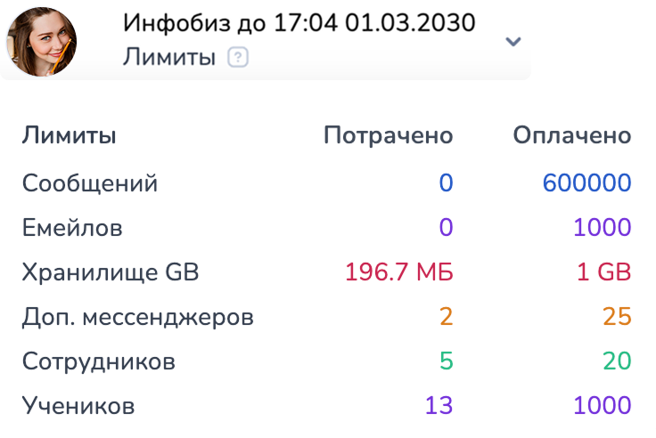

# Тарифы и оплата


Чтобы **сэкономить 15% на подписке**, вы можете оплатить подписку сразу на год!


<figure><figcaption></figcaption></figure>

Чтобы просмотреть доступные лимиты по тарифу, наведите на иконку вопроса под названием тарифа.

## **Чем отличаются тарифы**

Если у вас не оплачена подписка, вы можете бесплатно тестировать полный функционал в окне тестирования бота. Помните о том, что в тестовой среде не учитываются все особенности мессенджеров (ограничения по количеству кнопок и прочее).&#x20;

После создания проекта, вам дается три дня полного доступа (тестовый формат) с единственным ограничением — нет возможности создавать  рассылки\*.


**Суточный лимит** на время тестового периода 1000 сообщений.&#x20;



Резервные копии проектов создаются БЕЗ тестовой подписки. Такие копии помогут, если необходимо восстановить схему проекта. Рекомендуем их создавать перед внесением крупных изменений в проекте (например, изменение схемы чат-бота).&#x20;


Тарифы действуют с 01.10.2025

<table><thead><tr><th width="245">Бесплатный тариф</th><th>Бизнес</th><th>Инфобиз</th></tr></thead><tbody><tr><td>0 руб/мес</td><td>2999 руб/мес</td><td>3999 руб/мес</td></tr><tr><td>50 сообщений в сутки</td><td>До 10 000 сообщений в сутки </td><td>До 10 000 сообщений в сутки </td></tr><tr><td>Рассылки недоступны</td><td>1000 email-писем в сутки</td><td>1000 email-писем в сутки</td></tr><tr><td>— </td><td>— </td><td>до 1000 учеников в проекте</td></tr><tr><td>Работают все мессенджеры, кроме WhatsАpp</td><td>Работают все мессенджеры </td><td>Работают все мессенджеры </td></tr><tr><td><mark style="color:red;"><strong>!</strong></mark> Калькулятор недоступен, в том числе работа с переменными и функциями в проекте</td><td>Доступен калькулятор в конструкторе, в том числе работа с переменными в проекте</td><td>Доступен калькулятор в конструкторе, в том числе работа с переменными в проекте</td></tr><tr><td><mark style="color:red;"><strong>!</strong></mark> Whatsapp недоступен</td><td>Доступны рассылки* в мессенджеры и email </td><td>Доступны рассылки* в мессенджеры и email </td></tr><tr><td><mark style="color:red;"><strong>!</strong></mark> Avito недоступен</td><td>2 бесплатных доступа для сотрудников </td><td>2 бесплатных доступа для сотрудников </td></tr><tr><td></td><td>Интеграция со сторонними сервисами, которых есть открытое API**</td><td>Интеграция со сторонними сервисами, у которых есть открытое API**</td></tr><tr><td></td><td>Возможность принимать оплату в боте (доступны все штатные интеграции с платёжными системами, кроме Prodamus и Mandarin) </td><td>Возможность принимать оплату в боте (все штатные интеграции с платёжными системами)</td></tr><tr><td></td><td>Доступна Аналитика</td><td>Доступна Аналитика</td></tr><tr><td></td><td><mark style="color:red;"><strong>!</strong></mark>  Конструктор курсов и проведение трансляций недоступны</td><td>Встроенный конструктор курсов и проведение трансляций </td></tr><tr><td></td><td>Дополнительное место в файловом хранилище (1 - 199 гб)</td><td>Дополнительное место в файловом хранилище (1 - 199 гб)</td></tr><tr><td></td><td></td><td>Интеграция с сервисами для инфобизнеса, включая Getcourse, Bizon360, Prodamus</td></tr></tbody></table>

> _\*Рассылки - ручные рассылки по настраиваемому списку пользователей базы. Можно загружать список для рассылки файлом или настраивать фильтр по базе бота. Подробнее про ручные рассылки можно_[ _прочитать в этой статье_](/broken/pages/-MMtQpqDi8XnthJSlcTS)_._
>
>
>
> _\*\* Интеграции с API и API конструктора - всевозможные_ [_функции в калькуляторе_](https://docs.salebot.pro/peremennye-1/api-v-kalkulyatore) _и АПИ-запросы к сторонним сервисам. Можно настраивать_ [_стороннюю аналитику_](https://docs.salebot.pro/analitika)_, подключать_ [_сервисы Google_](https://docs.salebot.pro/integracii/google)_, принимать_ [_оплаты в боте_](https://docs.salebot.pro/integracii/platezhnye-sistemy)_, подключать_ [_сервисы для инфобизнеса_](https://docs.salebot.pro/integracii/servisy-dlya-marketologov) _и другие полезные интеграции (_[_посмотреть полный список доступных интеграций_](https://docs.salebot.pro/integracii)_). Также открывается возможность работать с_ [_API конструктора_](https://docs.salebot.pro/api-v-konstruktore-salebot.pro/api-konstruktora)

### Дополнительные услуги к тарифу


Дополнительные услуги доступны только для тарифов "Бизнес" и "Инфобиз"



Обращаем внимание!

Учитывайте лимиты, установленные для каждого тарифа.\
Увеличение установленного количества сообщений возможно за дополнительную плату к тарифу.\
Подробности указаны ниже.&#x20;


#### Количество сообщений

1. Дополнительный пакет сообщений - 1 890 р/месяц (+ 10 000).\
   За каждый последующий дополнительный пакет сообщений — 1 890 р (от + 10 тыс. до 1,99 млн сообщений в сутки).
2. Безлимит сообщений в сутки (от 1,99 млн) - 376 110 р/месяц;


Обращаем внимание!

<mark style="color:red;">В</mark> <mark style="color:red;"></mark><mark style="color:red;">**расчет статистики**</mark> <mark style="color:red;"></mark><mark style="color:red;">по сообщениям входят:</mark>\
\- <mark style="color:red;">**все сообщения**</mark>, отправляемые любым из видов блоков в схеме бота (в т.ч. пустые сообщения с #{none}), \
\- <mark style="color:red;">**запросы**</mark><mark style="color:red;">,</mark> <mark style="color:red;"></mark><mark style="color:red;">**отправляемые в сторонние сервисы**</mark> (мессенджеры, чаты, платежные сервисы и т.д.), \
\- а также <mark style="color:red;">**запросы, формируемые функциями API, в том числе входящие**</mark>**.**


#### Email

1. Базовый лимит — 1000 email-писем в сутки;
2. За каждые последующие 1000 email-писем в сутки — 490 р / месяц (до 99 тыс. писем в сутки).
3. Безлимит в сутки — 48 510 р / месяц (свыше 99 тыс. писем в сутки).

#### Дополнительное место для файлового хранилища:

1. Стоимость дополнительного 1 гб - 59 рублей в проекте.&#x20;
2. Максимальное количество 199 гб для одного проекта - 11 682 р / месяц.

#### Ученики

1. Количество учеников, входящих в пакет "Инфобиз", — до 1000.
2. За каждые последующие 1000 учеников — 490 р / мес.

#### Количество мессенджеров


Обращаем внимание!

Учитывайте лимиты, установленные для каждого тарифа!\
Увеличение установленного количества мессенджеров возможно за дополнительную плату к тарифу! \
Подробности указаны ниже.&#x20;


1. Дополнительный мессенджер - 649 р/месяц&#x20;
2. Безлимит на подключение мессенджеров - 32 450 р/мес

В каждом тарифе можно подключить по одному мессенджеру каждого типа:

<figure><figcaption></figcaption></figure>

#### Доступ в проект (количество подключенных сотрудников)

1. Дополнительный доступ для сотрудников - 599 р/месяц (по умолчанию, в тарифах - 2);
2. Безлимит на подключение доступа сотрудников - 11 980 р/месяц (свыше 20).

## Оплатить подписку


**Оплата идёт за конкретный проект**, а не на счёт аккаунта в Salebot.&#x20;

Будьте внимательны и проверяйте в каком проекте находитесь, когда формируете ссылку на оплату.


Чтобы оплатить подписку зайдите в раздел "Оплата" в настройках проекта:

<figure><figcaption></figcaption></figure>

Выберите тариф и дополнительные услуги при необходимости:

<figure><figcaption></figcaption></figure>

В калькуляторе стоимости будет указана сумма к оплате и какие услуги были выбраны. Далее нажмите оплата и перейдете на платежную страницу.&#x20;

После оплаты подписка автоматически  будет продлена.


<mark style="color:orange;">**ВАЖНЫЕ ПРИМЕЧАНИЯ:**</mark>

Можно как оплатить новый тариф на полный месяц, так и повысить тариф и дополнения к нему до окончания действия текущего тарифа.

**Чтобы повысить тариф необходимо включить переключатель Доплатить.** Только в этом случае если у вас меняются условия действующего на данный момент тарифа,  после доплаты за изменения, новые условия будут действовать **до окончания срока действия** **текущего тарифа**

Если у вас <mark style="color:orange;">**меняется тариф или изменяются дополнения  к тарифу**</mark>, а переключатель <mark style="color:red;">**Доплатить**</mark> при формировании ссылки был <mark style="color:red;">**ВЫКЛЮЧЕН**</mark>, то условия тарифа <mark style="color:orange;">**ПРИМЕНЯЮТСЯ С**</mark> <mark style="color:orange;">**ТЕКУЩЕЙ ДАТЫ**</mark> оплаты.&#x20;

Остаток дней ранее оплаченного тарифа обнулиться, начнет действовать новый тариф с новыми условиями.&#x20;


## Изменить текущий тариф или добавить услуги

После оплаты тарифа можно повысить тариф или докупить необходимое количество мессенджеров, суточный лимит сообщений и количество сотрудников в проекте до конца оплаченного периода.

Для этого зайдите в раздел Оплата  - > Дополнения к тарифу - > и включите переключатель "Доплатить".&#x20;

После этого можно повысить тариф и добавить все необходимые услуги. Калькулятор посчитает сумму к оплате с учетом окончания текущей подписки в проекте.&#x20;

<figure><figcaption></figcaption></figure>

### Автопродление


Если включено автопродление подписки, то за 3 дня до окончания подписки автоматически будет списана сумма равная ДЕЙСТВУЮЩИМ на момент автосписания настройкам проекта(суточный лимит сообщений, количество мессенджеров и сотрудников).&#x20;



После первой оплаты **включите** переключатель Автопродление и/или Автодоплата за сообщения, чтобы **бот не остановился**, если закончилась подписка или исчерпан суточный лимит отправки сообщений.&#x20;

_После остановки бота и повторного подключения тарифа нужно будет вручную запускать автоматические цепочки сообщений, а запущенная рассылка остановится._&#x20;

Если вы **не планируете** оплачивать конкретный проект, переключатель должен быть **выключен.**&#x20;


## Оплата подписки по счёту

<figure><figcaption></figcaption></figure>


В платежном поручении должны быть корректно заполнены все поля.

Важно! \
ООО "Сейлбот" работает с НДС по УСН.

В платежном поручении указывайте **НОМЕР СЧЕТА**.



Если Вам нужно получить информационно письмо ФНС о переходе ООО "Сейлбот" на УСН, то необходимо направить официальный запрос на почту documents@salebot.pro



Продление подписки при оплате счета выставленному по почте обрабатывается **бухгалтерией**.&#x20;

При оплате подписки по счету у вас должен быть запас рабочих дней (минимум 7-10 дней) до окончания подписки, чтобы она была вовремя продлена.\
\
Оплата счёта, выставленного в разделе Оплата, применяется автоматически.


Чтобы оплатить подписку по счёту, зайдите в раздел Оплата.

Установите необходимые настройки: тариф, количество сообщений в сутки, дополнительные мессенджеры и сотрудники, количество месяцев.&#x20;

Калькулятор автоматически посчитает сумму к оплате. После этого нажмите кнопку "Выставить счёт" и заполните форму для автоматического выставления счёта:

<figure><figcaption></figcaption></figure>


Важно!&#x20;

Заполнять данные в форме необходимо согласно документам (выписки из реестра ЕГРЮЛ/ЕГРИП).&#x20;


Все акты и документы расположены в личном кабинете (раздел оплата во вкладке) "Мои документы" отображаются выставленные счета и акты:

<figure><figcaption></figcaption></figure>

Можно генерировать закрывающие документы после успешной оплаты в PDF-формате.&#x20;

При выставлении счета, если вы указываете форму собственности "Юридическое лицо", то заполнять КПП обязательно!

<figure><figcaption></figcaption></figure>

Также при указании адреса электронной почты (email) при выставлении счета после успешного продления подписки, вам на почту придет сообщение с документом в формате pdf (акт или счет):

<figure><figcaption></figcaption></figure>

### Работа с ЭДО


Работаем с ЭДО (электронный документооборот), бумажные оригиналы не высылаем.


Для получения документов в систему ЭДО с электронной подписью, необходимо активировать чекбокс "Хочу получать закрывающие документы в ЭДО":

<figure><figcaption></figcaption></figure>

Далее необходимо заполнить поле "Идентификатор ЭДО" при выставлении счета:

<figure><figcaption></figcaption></figure>

При активации чекбокса "Хочу получать документы в ЭДО" акты в формате .pdf  будут сохраняться в системе и их можно будет скачать в разделе "Оплата", нажав на вкладку "Мои документы", после оплаты счета:

<figure><figcaption></figcaption></figure>

<figure><figcaption></figcaption></figure>

d
