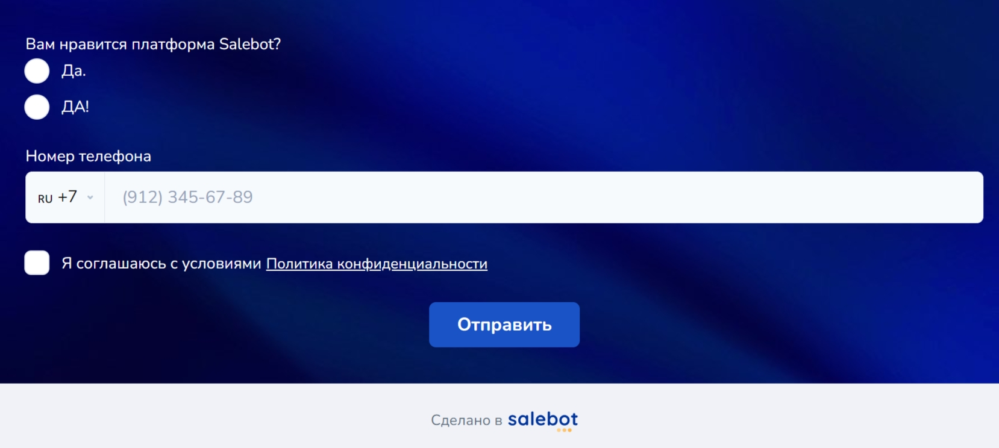

# Аккаунт в Salebot

## Основные термины

_**Аутентификационные данные**_ - уникальные логин и пароль Пользователя Сервисов, используемые для доступа к Личному кабинету из сети Интернет или доступа к соответствующим разделам Сервисов, предоставляющие возможность их использовать.

_**Личный кабинет**_ - персонализированный раздел веб-сайта [salebot.pro](https://salebot.pro/), закрытый для публичного доступа. Доступ к Личному Кабинету осуществляется посредством ввода на странице входа аутентификационных данных - логина (e-mail пользователя) и пароля (кода доступа).&#x20;

_**Чат-бот (бот)**_ - программа для ЭВМ, имитирующая речевое поведение человека при общении с одним или несколькими собеседниками (адресатами), выясняющая потребности клиентов, а затем помогающая удовлетворить их, и настроенная на мгновенный ответ на вопрос через мессенджеры, сайты или мобильное приложение.

_**Клиент, Customer, Адресат**_ - непосредственный получатель сообщений в различных мессенджерах, например: WhatsApp, Viber, Telegram, VK, Online Chat.&#x20;

_**Тариф на Услуги (Тариф)**_ - перечень, включающий конкретный набор Услуг, предоставляемый в рамках Публичной оферты, размещенной в открытом доступе на сайте [salebot.pro](https://salebot.pro/) , а также фиксированную плату, дающую право получения указанных Услуг. \
Виды Тарифов (Бесплатный, Бизнес и Инфобиз) размещены в разделе Оплата salebot.pro внутри проекта.

**Перманентный бан или вечный бан** — категория блокировок аккаунтов в Интернете, при которых не указывается срок окончания.

## Как создать аккаунт в Salebot

На сайте [salebot.pro](https://salebot.pro/) перейдите на страницу регистрации:

<figure><figcaption></figcaption></figure>

Доступны варианты входа в конструктор Salebot и в аккаунт ученика (для пользователей ваших курсов и участников трансляций, созданных в Salebot).

Создать аккаунт для создания чат-ботов, работы с CRM, конструктора сайтов, онлайн курсами  и всем доступным функционалом:

<figure><figcaption></figcaption></figure>

Зарегистрироваться можно по email или авторизоваться через соц.сети ВКонтакте, Facebook\* и Apple ID.&#x20;


\*принадлежит Meta inc., деятельность которой признана экстремистской и запрещена на территории РФ.&#x20;


Создать аккаунт ученика можно по email:

<figure><figcaption></figcaption></figure>

## Основные разделы аккаунта

После регистрации можно увидеть основные разделы для комфортной работы в Salebot:

<figure><figcaption></figcaption></figure>

Ваши возможности:

1. В разделе "Проекты" вы сможете создать любое необходимое количество проектов, настроенных по самым узким потребностям своего бизнеса.&#x20;
2. С помощью почтовых доменов можно подключить и осуществлять рассылки по email-базе своих клиентов;
3. Зарабатывать вместе с Salebot и Партнерской программой: приглашайте друзей, знакомых и партнеров, а также создавайте свои проекты и продавайте к ним доступ, используя промокоды и реферальные ссылки, **и получайте 10 % с оплат каждого реферального проекта бессрочно.**&#x20;


Подробнее в разделе "[Партнерам](/broken/pages/-M1dthoGCAqHdRb5G-JL)".&#x20;


4. Мы также поможем не пропустить ни одного важного события в ваших проектах с помощью раздела "Настройки уведомлений.&#x20;
5. Если вы хотите пройти интересные курсы и повысить свои навыки, то стоит воспользоваться функцией "Войти как ученик": в каталоге курсов лежат интереснейшие курсы от экспертов, как для новичков, так и для профессиональных разработчиков.&#x20;

### Проекты

Чтобы создать проект, в личном кабинете нажмите кнопку Создать проект. &#x20;

<figure><figcaption></figcaption></figure>

Заполните **Название проекта**. Это название видите только вы и сотрудники, которым будет выдан доступ для работы. &#x20;

<figure><figcaption></figcaption></figure>

При необходимости смените часовой пояс. По умолчанию установлено время GTM +03:00 Москва.&#x20;


Настройки таймеров и рассылки будут планироваться по часовому поясу указанному в настройках.&#x20;


Если у вас есть промокод его можно ввести только при создании проекта. \
\
Проекты можно создавать из шаблонов и сортировать созданные проекты по папкам. \
\
Нажимаем кнопку **Готово**.&#x20;

* [x] Поздравляем! Вы создали свой первый проект.


**Обратите внимание!**

Оплата идёт **за проект, а не за аккаунт.**&#x20;

В одном аккаунте у вас может быть любое количество проектов, но действующими будут только оплаченные!


### Как узнать номер проекта?

При обращении в службу технической поддержки или в других необходимых случаях, вам может понадобится номер проекта: например, номер вашего проекта может понадобиться , чтобы сотрудники технической поддержки могли увидеть наглядно, какая ошибка есть в схеме конструктора, или подсказать, на что вам стоит обратить внимание при разработке веб-инструмента.&#x20;

Номер проекта можно найти:

1. В разделе "Проекты" в личном кабинете:

<figure><figcaption></figcaption></figure>

В разделе "Проекты" в ЛК вы увидите созданные вами проекты. Номер проекта находится на информационной плашке проекта:

<figure><figcaption></figcaption></figure>

2. Номер проекта в адресной строке:

<figure><figcaption></figcaption></figure>

Чтобы каждый раз, когда вам понадобится искомый номер проекта, не переходить в раздел "Проекты" в личном кабинете, достаточно просто кликнуть по адресной строке вашего браузера.&#x20;

В адресной строке вы можете найти айди вашего проекта:

<figure><figcaption></figcaption></figure>

Номер проекта в адресной строке можно просмотреть в любом разделе Сейлбота внутри проекта:

<figure><figcaption>
Пример: адресная строка в разделе "Задачи"
</figcaption></figure> <figure><figcaption>
Пример: адресная строка в разделе "Клиенты"
</figcaption></figure>

### Почтовые домены

Почтовый домен — это часть адреса электронной почты, которая находится после символа «@».

<figure><figcaption></figcaption></figure>

Например, в адресе **documents@salebot.pro \*\*, где** домен — это **salebot.pro.** Почтовый домен играет несколько важных ролей:

1. **Идентификация организации**: Почтовый домен позволяет однозначно идентифицировать компанию или организацию, к которой относится электронная почта. Например, использование домена @**salebot.pro** показывает, что письмо отправлено от имени компании "Salebot".
2. **Создание корпоративных почтовых ящиков**: Почтовый домен позволяет компании создавать персонализированные и профессиональные адреса для сотрудников (например, **ivanov@salebot.pro**, что способствует поддержанию корпоративного стиля и профессионального имиджа.
3. **Маркетинг и доверие**: Электронные письма, отправленные с корпоративного домена, воспринимаются более доверительно клиентами и партнерами, чем письма, отправленные с общих почтовых сервисов (например, Gmail или Yandex).
4. **Фильтрация и безопасность**: Почтовый домен помогает серверу электронной почты получателя идентифицировать отправителя. Это снижает вероятность того, что письма от организации будут помечены как спам.
5. **Управление внутренней почтой**: Почтовый домен позволяет создавать и управлять множеством почтовых ящиков внутри компании, упрощая коммуникацию и централизованное управление.

Таким образом, почтовый домен помогает поддерживать профессиональный имидж, улучшать безопасность и обеспечивать упрощенное управление почтовыми ящиками сотрудников.


\*\* Обращаем внимание!

documents@salebot.pro - почта для обращения в Salebot.&#x20;

Если у вас остались какие-либо вопросы, вы всегда можете обратиться по указанному почтовому адресу и получить ответы на свои вопросы.&#x20;

Также не забывайте про тех. поддержку на сайте и телеграм.&#x20;



Как подключить почтовый домен, рассказали в статье "[Email-рассылки](/broken/pages/X39FSkgsiesVT3fUqbAs)".&#x20;


### Партнерская программа

В разделе "Партнерская программа" можно ознакомиться с основными условиями Партнерской программы и публичной офертой:

<figure><figcaption></figcaption></figure>

Мы предоставляем вам реферальную ссылку или промокод для создания проекта, а после того, как приглашенный вами пользователь или купивший у вас проект клиент оплатит подписку, начисляем вам 10% с выплат по подписке БЕССРОЧНО.&#x20;

Деньги начисляются Вам как доход для самозанятого, ИП и (или) юр. лица - все учитывается с помощью закрывающих Актов.&#x20;


Подробнее о Партнерской программе в разделе "[Партнерам](/broken/pages/-M1dthoGCAqHdRb5G-JL)" и в [публичной оферте](https://salebot.pro/ooo_offer_partner.pdf).


### Настройки уведомлений

В разделе настроек уведомлений устанавливаются все уведомления для проектов, созданных в вашем аккаунте, в том числе и для мобильного приложения:

<figure><figcaption></figcaption></figure>

Если вы не хотите получать уведомления, просто деактивируйте чекбокс "Включить уведомления":

<figure><figcaption></figcaption></figure>

Когда у вас активирован чекбокс "Включить уведомления", плашка с настройками будет развернута в полном виде, где для каждого отдельного проекта можно выбрать тип уведомлений.&#x20;

Чтобы выбрать проект, кликните по данному выпадающему списку:

<figure><figcaption></figcaption></figure>

Далее выберите раздел, в котором необходимо настроить уведомления:

<figure><figcaption></figcaption></figure>

Тип уведомления - классификация уведомления по способу получения сообщений о событии по электронной почте, в телеграме и (или) в мобильном приложении:

<figure><figcaption></figcaption></figure>

ЛИБО по событию, которое произошло в проектах:

<figure><figcaption></figcaption></figure>

Также при необходимости выберите мессенджер, в котором хотите получать уведомления по проектам:

<figure><figcaption></figcaption></figure>

Далее перейдите в необходимый канал Salebot, от имени которого будут приходить необходимые уведомления:

<figure><figcaption></figcaption></figure>

#### Раздел "Задачи"

В разделе "Задачи" настраиваются уведомления по добавлению/редактированию/удалению задач в канбане:

<figure><figcaption></figcaption></figure>

Можно выбрать, например, получать уведомления только по тем задачам, в котором вы выбраны ответственным, либо по всем сразу:

<figure><figcaption></figcaption></figure>

<figure><figcaption></figcaption></figure>

#### Раздел "Курсы"

В данном разделе доступны уведомления по д/з, продажам и прохождениям курса:

<figure><figcaption></figcaption></figure>

#### Раздел "Клиенты"

Для раздела клиенты доступно уведомление о назначении ответственного сотрудника:

<figure><figcaption></figcaption></figure>

#### Раздел "Рассылки"

В случае, если вы запланировали рассылку, вам поможет данный раздел, чтобы быть в курсе того, была ли отправлена рассылка или нет:

<figure><figcaption></figcaption></figure>

Например, если вы запланировали email-рассылку по базе, но процент попадаемости в спам превысил допустимые пределы, то рассылка не будет отправлена.&#x20;


Подробнее о работе с рассылками email читайте [здесь](/broken/pages/X39FSkgsiesVT3fUqbAs).


Чтобы не пропустить ошибку с рассылками, обязательно воспользуйтесь данными уведомлениями.&#x20;

#### Раздел "CRM"

Уведомления, настроенные в данном разделе, помогут отслеживать события с карточками в CRM:

<figure><figcaption></figcaption></figure>

А также уведомлять вас о записях клиентов к вам при настроенной онлайн-записи:

<figure><figcaption></figcaption></figure>


Функционал [онлайн-записи](/broken/pages/O7xlRksbq5SUsMYlCxL6) очень удобен и поможет записывать клиентов через сайты или ботов (и даже с внедрением искусственного интеллекта). Также с помощью данного раздела можно создать бронь на объекты: например, столики ресторанов, объекты недвижимости и многое другое.&#x20;


#### Раздел "Чат-боты"

Чтобы получать уведомления о продажах через чат-бот, достаточно установить галочки напротив необходимого типа уведомления:

<figure><figcaption></figcaption></figure>

Выглядеть уведомление о продажах в боте может следующим образом:

<figure><figcaption></figcaption></figure>

#### Раздел "Сайты"

Для сайта доступны уведомления о заполненной форме и запуске бота с сайта:

<figure><figcaption></figcaption></figure>

Для того чтобы получать уведомления с сайта, необходимо настроить секцию "Форма" на сайте с полями ввода:

<figure><figcaption></figcaption></figure>

Второе уведомление, достпуное для сайта, также связано с секцией "Форма":

<figure><figcaption></figcaption></figure>

Необходимо подключить передачу get-параметров.&#x20;

### Настройки профиля

В настройках профиля вы можете указать свое имя и поменять почту, с которой вы заходите на Salebot, а также при необходимости выбрать аватар для аккаунта:

<figure><figcaption></figcaption></figure>

Изменить пароль для входа в аккаунт:

<figure><figcaption></figcaption></figure>

Для безопасности аккаунта также подключите двухфакторную аутентификацию:

<figure><figcaption></figcaption></figure>

### Войти как ученик

В кабинете ученика отображаются все доступные курсы:

<figure><figcaption></figcaption></figure>


Ученик может проходить ваш курс как через официальный сайт Salebot, так и в[ мобильном приложении Salebot](/broken/pages/-M1KtETEtCinTee6rRxn).&#x20;


Также в личный кабинет ученика приходят различные уведомления:

<figure><figcaption></figcaption></figure>
