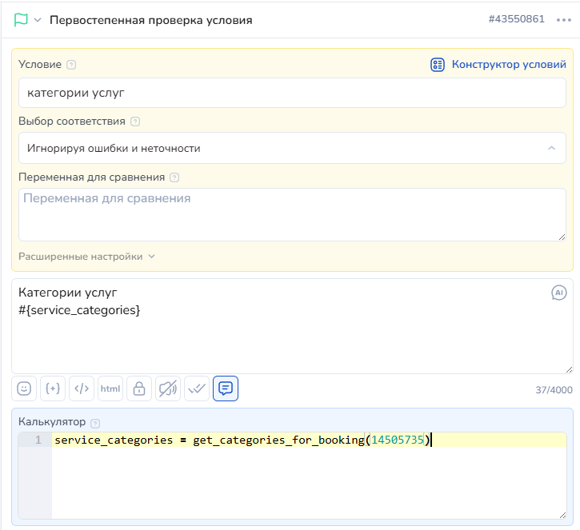

# Чат-бот для онлайн-записи

## Общая информация

Чат-бот для онлайн-записи - это набор функций конструктора воронок, при помощи которого вы можете автоматизировать процесс записи на услуги вашей компании.

Принцип работы бота основан на последовательном вызове функций бота, получении данных для показа клиенту и дальнейшей передачи этих данных для вызова новых функций и получения новых данных.

По мере прохождения клиента по воронке вам необходимо передавать в каждый следующий блок только те данных, которые соответствуют выбору клиента, - используйте их для настройки вызова следующих функций.

Благодаря возможности получать промежуточные данные (например, должности сотрудников и категории услуг), а также передавать их для фильтрации сотрудников и услуг, вы можете гибко настроить вашу воронку и предоставить клиенту выбор этапов ее прохождения.


Все методы, описанные в данной статье, возвращают массив со словарями.&#x20;

Для удобной работы с ними предлагаем ознакомиться с разделами "[Массивы](/broken/pages/r8w1VbzQtSXNLgL055iI)", "[Словари](/broken/pages/OfbSlqFeB0Uw1RyRZr42)".&#x20;

Также для использования функции генерации действий пользователя (выбор услуги, даты, записи) предлагаем рассмотреть метод [tools\_make\_button\_str\_checker](https://docs.salebot.pro/peremennye-1/rabota-s-massivami-i-slovaryami/rabota-s-massivami#tools_make_button_str_checker-or-tools_check_user_input).


Ниже представлена схема работы бота, где каждый блок этой схемы - это вызов определенной функции, а стрелками указаны потоки передачи данных от блока к блоку. Переданная в потоке информация позволяет настроить фильтрацию запрашиваемых данных, а также создать, отменить или изменить время записи.

<figure><figcaption>
схема чат-бота
</figcaption></figure>


Чтобы увидеть детальную схему настройки чат-бота для онлайн записи с использованными функциями, ознакомьтесь с параграфом "[Пример реализации бота](chat-bot-dlya-onlain-zapisi.md#primer-realizacii-bota)" данной статьи.&#x20;


## Получение информации о филиалах

Для создания воронки онлайн-записи и получения информации о филиалах проекта воспользуйтесь функцией get\_companies\_for\_booking.

Функция вернёт список с данными по каждому филиалу (воронке), у которого в настройках активирована “Онлайн-запись”.

<figure><figcaption></figcaption></figure>

Данные представлены в виде пары “ключ: значение” и состоят из идентификатора филиала (id), его наименования (name) и адреса (address).&#x20;

Функция не принимает параметров.

### Пример использования:

Вызов функции в блоке:

<figure><figcaption></figcaption></figure>

Пример возвращаемых данных:

<figure><figcaption></figcaption></figure>

## Получение информации о должностях или категориях услуг

Функция get\_categories\_for\_booking(company\_id) дает возможность получить список данных о всех типах специалистов или о категориях услуг филиала.

Каждый элемент полученного списка состоит из идентификатора (id), наименования (name) и описания (description) должности или категории услуг. Данные представлены в виде пар “ключ: значение”.

#### Параметры:

<table><thead><tr><th width="310">Параметр</th><th>Описание</th></tr></thead><tbody><tr><td>company_id (обязательный) </td><td>идентификатор филиала, ожидаемый формат - целое число;</td></tr></tbody></table>

### Пример использования:

Вызов функции в блоке:

<figure><figcaption></figcaption></figure>

## Получение информации о сотрудниках

Если вам необходимо предоставить информацию о сотрудниках филиала, воспользуйтесь функцией get\_employees\_for\_booking.

Вызов вернет список данных, содержащих идентификатор (id), имя (name), информацию (information) и должность (job\_title) сотрудников филиала.

Вы также можете отфильтровать сотрудников по списку услуг, должности или категории оказываемых услуг. Для этого вам необходимо передать в вызов функции дополнительный параметр service\_ids,  job\_title\_id или service\_category\_id.

#### Порядок следования параметров:

company\_id -> service\_ids ->  job\_title\_id -> service\_category\_id

#### **Параметры:**

<table><thead><tr><th width="287"></th><th></th></tr></thead><tbody><tr><td>company_id (обязательный)</td><td>идентификатор филиала, ожидаемый формат - целое число;</td></tr><tr><td>service_ids (опциональный)</td><td>идентификатор или список идентификаторов услуг, ожидаемый формат - целое число или список целых чисел в квадратных скобках через запятую, напр [844, 845]</td></tr><tr><td>job_title_id (опциональный)</td><td>идентификатор должности, ожидаемый формат - целое число;</td></tr><tr><td>service_category_id (опциональный) </td><td>идентификатор категории услуг, ожидаемый формат - целое число;</td></tr></tbody></table>

**Примечание:**

Если вы хотите получить всех сотрудников филиала, оставьте значения service\_ids, job\_title\_id и service\_category\_id пустыми.

* Пример вызова: get\_employees\_for\_booking(14275391)

Чтобы отфильтровать сотрудников по списку идентификаторов услуг, передайте его вторым параметром, а job\_title\_id и service\_category\_id оставьте пустыми.

* Пример вызова: get\_employees\_for\_booking(14275391, \[844, 845])

Если вы хотите отфильтровать сотрудников по должности, передайте идентификатор в параметр job\_title\_id, а service\_ids и service\_category\_id оставьте пустыми.

* Пример вызова: get\_employees\_for\_booking(14275391, “”, 1021)

Если вам нужно получить сотрудников, оказывающих услуги определенной категории, заполните параметры service\_ids и job\_title\_id пустой строкой, а в параметр service\_category\_id передайте идентификатор выбранной категории услуг.

* Пример вызова: get\_employees\_for\_booking(14275391, “”, “”, 1019)

### Пример использования:

Вызов функции в блоке:

<figure><figcaption></figcaption></figure>

Пример возвращаемых данных:

<figure><figcaption></figcaption></figure>

## Получение информации об услугах

Чтобы получить информацию о предоставляемых филиалом услугах, воспользуйтесь функцией get\_services\_for\_booking.

В результате вызова бот вернёт список с данными об услугах. Данные по каждой услуге содержат идентификатор (id), наименование (title), описание (description), стоимость (price) и длительность услуги в минутах (duration).

Вы можете отфильтровать результирующий список по категории услуг, по сотруднику или по категории услуг и сотруднику одновременно. Для этого при вызове функции необходимо передать дополнительные параметры service\_category\_id и/или employee\_id.

#### Порядок следования параметров:

company\_id -> service\_category\_id -> employee\_id

**Параметры:**

<table><thead><tr><th width="310"></th><th></th></tr></thead><tbody><tr><td>company_id (обязательный) </td><td>идентификатор филиала, ожидаемый формат - целое число</td></tr><tr><td>service_category_id (опциональный) </td><td>идентификатор категории услуг, ожидаемый формат - целое число;</td></tr><tr><td>employee_id (опциональный) </td><td>идентификатор сотрудника, ожидаемый формат - целое число;</td></tr></tbody></table>

#### Примечание к разделу “Параметры”:

Если вы хотите получить все услуги филиала, оставьте значения service\_category\_id и employee\_id пустыми.

* Пример вызова: get\_services\_for\_booking(14275391)

Если вы хотите отфильтровать услуги по категории и/или сотруднику, передайте соответствующий идентификаторы в параметры service\_category\_id и employee\_id. Для фильтрации по одному параметру, заполните пустой строкой значение второго параметра.&#x20;

Примеры вызова:

* get\_services\_for\_booking(14275391, 1018) - фильтр по категории услуг;
* get\_services\_for\_booking(14275391, “”, 512978) - фильтр по сотруднику;
* get\_services\_for\_booking(14275391, 1018, 463665) - фильтрация по обоим параметрам;

### Пример использования:

Вызов функции в блоке:

<figure><figcaption></figcaption></figure>

Пример возвращаемых данных:

<figure><figcaption></figcaption></figure>

## Получение доступных для записи дат

После того как клиент выбрал услуги для записи, ему необходимо получить список доступных для записи дат.

Чтобы сформировать данный список используйте функцию get\_dates\_for\_booking.

Функция проверит наличие свободного для записи времени и вернёт перечень подходящих дат в формате “день.месяц.год”.

#### Порядок следования параметров:

company\_id -> service\_ids -> employee\_id -> days\_limit

#### Параметры:

<table><thead><tr><th width="308"></th><th></th></tr></thead><tbody><tr><td>company_id (обязательный) </td><td>идентификатор филиала, ожидаемый формат - целое число;</td></tr><tr><td>service_ids (обязательный)</td><td>список идентификаторов услуг для записи, ожидаемый формат - целое число или список целых чисел в квадратных скобках через запятую (напр. 842 или [842, 843]);</td></tr><tr><td>employee_id (опциональный)</td><td>идентификатор сотрудника, ожидаемый формат - целое число. Если оставить значение параметра пустым или передать пустую строку “” - ищет свободные даты у всех сотрудников, оказывающих полный перечень услуг из списка service_ids;</td></tr><tr><td>days_limit (опциональный)</td><td>количество дней от текущей даты, в числе которых осуществляется поиск свободных дат, ожидаемый формат - целое число, значение по умолчанию - 14 (дней);</td></tr></tbody></table>

### Пример использования:

Вызов функции в блоке:

<figure><figcaption></figcaption></figure>

Пример возвращаемых данных:

<figure><figcaption></figcaption></figure>

## Получение доступных для записи слотов

Чтобы получить список доступных для записи слотов, необходимо воспользоваться функцией get\_slots\_for\_booking.

Функция проверит наличие доступного времени в выбранную дату и вернёт список свободных слотов в формате “часы:минуты”, например \[“09:00”, “11:00”, “14:30”, “16:00”].

#### Порядок следования параметров:

company\_id -> service\_ids -> employee\_id -> slot\_interval

#### Параметры:

<table><thead><tr><th width="284"></th><th></th></tr></thead><tbody><tr><td>company_id (обязательный)</td><td>идентификатор филиала, ожидаемый формат - целое число;</td></tr><tr><td>service_ids (обязательный) - </td><td>список идентификаторов услуг для записи, ожидаемый формат - целое число или список целых чисел (напр. 842 или [842, 843]);</td></tr><tr><td>date (обязательный) - </td><td>дата для проверки слотов, ожидаемый формат - строка в виде “число.месяц.год”,  например “01.01.2024”;</td></tr><tr><td>employee_id (опциональный)</td><td>идентификатор сотрудника, ожидаемый формат - целое число. Если оставить значение параметра пустым или передать пустую строку - ищет свободные слоты в расписаниях всех сотрудников, работающих в выбранную дату и оказывающих полный перечень услуг из списка service_ids;</td></tr><tr><td>slot_interval (опциональный) </td><td>интервал в минутах между свободными слотами, ожидаемый формат - целое число, значение по умолчанию - 30 (минут);</td></tr></tbody></table>

### Пример использования:

Вызов функции в блоке:

<figure><figcaption></figcaption></figure>

Пример возвращаемых данных:

<figure><figcaption></figcaption></figure>

## Создание записи

Для создания онлайн записи используйте функцию create\_booking.

При успешной записи функция вернёт информацию о статусе совершения операции (status) со значением True и данными о записи (booking) в формате“ключ: значение”.

Данные о новой записи содержат:

* идентификатор (id),&#x20;
* дату (booking\_date),&#x20;
* время (booking\_time),&#x20;
* наименования услуг (services),&#x20;
* длительность записи (service\_duration),&#x20;
* общую стоимость (total\_cost),&#x20;
* имя назначенного сотрудника (employee\_name), его должность (job\_title),&#x20;
* наименование филиала (company\_name) и адрес филиала (company\_address)&#x20;

в формате “ключ: значение”.

#### Порядок следования параметров:&#x20;

company\_id -> service\_ids -> booking\_date -> booking\_time -> employee\_id

Параметры:

<table><thead><tr><th width="288"></th><th></th></tr></thead><tbody><tr><td>company_id (обязательный)</td><td>идентификатор филиала, ожидаемый формат - целое число;</td></tr><tr><td>service_ids (обязательный)</td><td>список идентификаторов услуг для записи, ожидаемый формат - целое число или список целых чисел (напр. 5 или [5, 10, 15]);</td></tr><tr><td>booking_date (обязательный)</td><td>дата записи, ожидаемый формат - строка в виде “число.месяц.год”,  например “15.01.2024”;</td></tr><tr><td>booking_time (обязательный) </td><td>время записи, ожидаемый формат - строка в виде “часы:минуты”, например “12:30”;</td></tr><tr><td>employee_id (опциональный)</td><td>идентификатор сотрудника, ожидаемый формат - целое число. Если оставить значение параметра пустым или передать пустую строку “” - записывает к случайному сотруднику, оказывающему полный перечень услуг из списка service_ids, если он свободен в указанное дату и время;</td></tr></tbody></table>

### Пример использования:

Вызов функции в блоке:

<figure><figcaption></figcaption></figure>

Пример ответа об успешной записи:

<figure><figcaption></figcaption></figure>

При создании записей и повторном запросе свободных слотов вы увидите, что списки сократились, например для 05.02.2024 больше нет слота на 18:00 (он был свободен только в расписании Виктории), а к Павлу Тихонову на мужскую стрижку и моделирование бороды теперь можно записаться с 9 до 14, так как общая длительность процедур равна 1 часу и 45 минутам, а в 16:00 у Павла уже есть другая запись.

<figure><figcaption></figcaption></figure>

## Получение информации о предстоящих записях клиента

Актуальные записи клиента можно посмотреть, вызвав функцию get\_bookings\_info.

В ответ вернётся перечень активных записей, а также подробная информации о каждой записи.

Информация о записи представлена в формате “ключ: значение” и включает:&#x20;

* идентификатор записи (booking\_id),&#x20;
* дату (booking\_date),&#x20;
* время (booking\_time),&#x20;
* идентификаторы (service\_ids) и наименования (service\_names) выбранных услуг,&#x20;
* длительность записи (booking\_duration),&#x20;
* суммарная стоимость услуг (total\_cost),&#x20;
* идентификатор (employee\_id) и имя  (employee\_name) назначенного сотрудника, его должность (job\_title),&#x20;
* идентификатор филиала (company\_id)&#x20;
* наименование филиала (company\_name) и адрес (company\_address).

#### Параметры:

<table><thead><tr><th width="253"></th><th></th></tr></thead><tbody><tr><td>client_id (опциональный)</td><td>идентификатор клиента, ожидаемый формат - целое число. Данный параметр нужен, если вы хотите получить записи интересующего вас клиента, по умолчанию - идентификатор клиента в чате с ботом.</td></tr></tbody></table>

### Пример использования:

Вызов функции в блоке:

<figure><figcaption></figcaption></figure>

Пример возвращаемых данных:

<figure><figcaption></figcaption></figure>

## Изменение даты и времени записи

Клиент может самостоятельно изменить дату и время записи.  Для этого ему необходимо попасть в блок воронки, где происходит вызов функции modify\_booking\_time.

&#x20;При успешной операции, функция вернет информацию о статусе совершения операции (status) со значением True и сообщение (message)  “Booking time modified” в формате “ключ: значение”.

#### Порядок следования параметров:&#x20;

order\_id -> new\_date -> new\_time

#### Параметры:

<table><thead><tr><th width="300"></th><th></th></tr></thead><tbody><tr><td>order_id (обязательный) </td><td>идентификатор записи, ожидаемое значение - целое число;</td></tr><tr><td>new_date (обязательный)</td><td>новая дата записи, ожидаемый формат - строка в виде “число.месяц.год”,  например “16.01.2024”;</td></tr><tr><td>new_time (обязательный)</td><td>новое время записи, ожидаемый формат - строка в виде “часы:минуты”, например “14:30”;</td></tr></tbody></table>

### Пример использования:

Вызов функции в блоке:

<figure><figcaption></figcaption></figure>

Ответ бота при успешной операции:

<figure><figcaption></figcaption></figure>

Ранее занятый слот 16:00 теперь доступен для записи, а создать новую запись на аналогичные услуги теперь можно только с 11:00.

<figure><figcaption></figcaption></figure>

В информации о записях клиента вы также увидите измененное время записи:

<figure><figcaption></figcaption></figure>

## Отмена записи

Клиент может самостоятельно отменить существующую запись. Для этого ему необходимо попасть в блок, где происходит вызов функции cancel\_booking.

Успешное удаление вернет информацию о статусе совершения операции (status) со значением True и сообщение (message)  “Booking deleted” в формате “ключ: значение”.

Порядок следования параметров:&#x20;

pipeline\_id -> order\_id

Параметры:

<table><thead><tr><th width="321"></th><th></th></tr></thead><tbody><tr><td>pipeline_id (обязательный)</td><td>идентификатор филиала, ожидаемое значение - целое число;</td></tr><tr><td>order_id (обязательный)</td><td> идентификатор записи, ожидаемое значение - целое число;</td></tr></tbody></table>

### Пример использования:

Вызов функции в блоке:

<figure><figcaption></figcaption></figure>

Ответ бота при успешной отмене:

<figure><figcaption></figcaption></figure>

После отмены слоты “09:00” и “10:00” снова доступны для записи:

<figure><figcaption></figcaption></figure>

## Пример реализации бота

### Настройки в чат-боте

**Блок №1.** Начало. Особые действия не требуются

<figure><figcaption>
Блок 1.
</figcaption></figure>

**Блок №2**. В этом блоке получаем данные, которые будем предоставлять клиенту.

Описание содержимого калькулятора:

* comp\_id - идентификатор блока услуг, который можно найти в разделе "Услуги";
* data - данные о предоставляемых услугах
* res - словарь с данными, которые нам понадобятся при формировании кнопок и установке условий
* numbered\_list - может пригодиться, если нужно продублировать список услуг текстом
* buttons - массив кнопок, сгенерированный из данных о предоставляемых услугах
* checker - массив названий услуг, используем для установки условия для перехода в следующий блок

<figure><figcaption>
Блок № 2
</figcaption></figure>

**Блок №3**. Получаем и выводим данные о выбранной услуге.

title - В массиве словарей data ищем словарь, ключ ‘title’ которого равен ‘question’. Из найденного словаря получаем значение по этому же ключу ‘title’

description - аналогично, но получаем значение по ключу ‘description’

price - аналогично, но получаем значение по ключу ‘price’

serv\_id - аналогично, но получаем значение по ключу ‘id’

b - формируем массив строк, которые будут отображены под сообщением в виде кнопок

res - из массива строк b формируем массив со словарями, как в предыдущем блоке

buttons - получаем массив для отображения кнопок

Теперь мы имеем переменные с наименованием, описанием и ценой услуги, которую выбрал клиент

<figure><figcaption>
Блок № 3
</figcaption></figure>

**Блок №4.** Выводим доступные для записи даты.

print\_dates - с помощью функции получаем доступные даты для записи для выбранной услуги

print\_dates - к массиву с датами добавляем строку ‘Вернуться к списку услуг’, если нам нужно, чтобы кроме дат отображалась такая кнопка.

<figure><figcaption></figcaption></figure>

Для стрелки, возвращающей нас на предыдущий шаг, приоритет ставим выше, чем у стрелки с #{checker}. Это нужно потому, что #{checker} также содержит в себе условие “Вернуться к списку услуг”.

<figure><figcaption></figcaption></figure>

**Блок №5.**\
В блоке №5 мы сохраняем выбранную клиентом дату. Это нужно сделать в отдельном блоке потому, что на следующих этапах при возврате в Блок 6, переменная question уже не будет содержать в себе выбранную клиентом дату.

<figure><figcaption></figcaption></figure>

**Блок №6.** Выбор и отображение доступных ячеек для записи.

data - получаем доступные ячейки.

Логика такая же, как в Блоке №4 с выводом доступных дат. Также важно не забыть настроить повышенный приоритет у стрелки “Вернуться к выбору даты”

<figure><figcaption></figcaption></figure>

**Блок №7.** Сохранение выбранного времени в переменную и попытка записать клиента.&#x20;

choosed\_time - сохраняем время

a - попытка записать клиента

booking\_result - получаем результат выполнения функции.&#x20;

Получить результат необходимо, так как несколько человек могут попытаться записаться на одно время в один момент.&#x20;

<figure><figcaption></figcaption></figure>

**Блок №7.1.** Записать клиента не удалось.

Этот блок нужен только для сообщения об ошибке. После отправки сообщения возвращаем клиента на выбор времени для записи

<figure><figcaption></figcaption></figure>

**Блок №8.** Запись прошла успешно.

Сообщаем клиенту, что он записан на услугу и отображаем кнопку для оплаты.

<figure><figcaption></figcaption></figure>

Пример настройки кнопок.&#x20;

Для настройки используем переменные, которые мы получили в блоке №3:

<figure><figcaption></figcaption></figure>

**Блок №8.1.**

В этом блоке подтверждаем успешную оплату. Переход в блок настраиваем в соответствии с используемой платежной системой

<figure><figcaption></figcaption></figure>

**Блок №8.2.** Клиент не оплатил услугу. Отмена записи

Если клиент не оплатил вовремя услугу, мы можем отменить запись, если это необходимо.

or\_id - получаем id заказа

cancel\_status - после выполнения функции получаем ответ, успешно ли выполнена отмена.&#x20;

<figure><figcaption></figcaption></figure>

В этом примере клиент попадет в блок отмены через 5 секунд после получения ссылки на оплату, в реальной же ситуации вы можете установить необходимое количество времени, главное не забудьте включить переключатель “Отменить, если покинул блок”.

<figure><figcaption></figcaption></figure>

Полная схема: 

<figure><figcaption></figcaption></figure>

### Демонстрация 

<figure><figcaption></figcaption></figure>

<figure><figcaption></figcaption></figure>

## Callback о записи

В диалог с клиентом после записи будет приходить колбек — уведомление о записи — следующего вида:

<figure><figcaption></figcaption></figure>

<mark style="color:orange;">**new\_order\_in\_calendar**</mark> - не изменяемая часть колбека&#x20;

&#x20;<mark style="color:yellow;">**\[489046159]**</mark> - order\_id  идентификатор заявки&#x20;

<mark style="color:red;">**Добавлена запись даты\_и\_время\_записи**</mark>

<mark style="color:purple;">**на 30 минут**</mark> - длительность услуги&#x20;

<mark style="color:red;">**Объекту: Тест 30**</mark> - какому именно объекту добавлена запись

Вид самого колбека:

_**`new_order_in_calendar: [489046159] Добавлена запись с 2025-06-01 14:00 до 2025-06-01 14:30 на 30 минут. Объекту: Тест 30`**_

Настроить реакцию на колбек можно прописав значение в условии блока:

<figure><figcaption></figcaption></figure>

В блоке можно прописать необходимое обратное сообщение клиенту.
