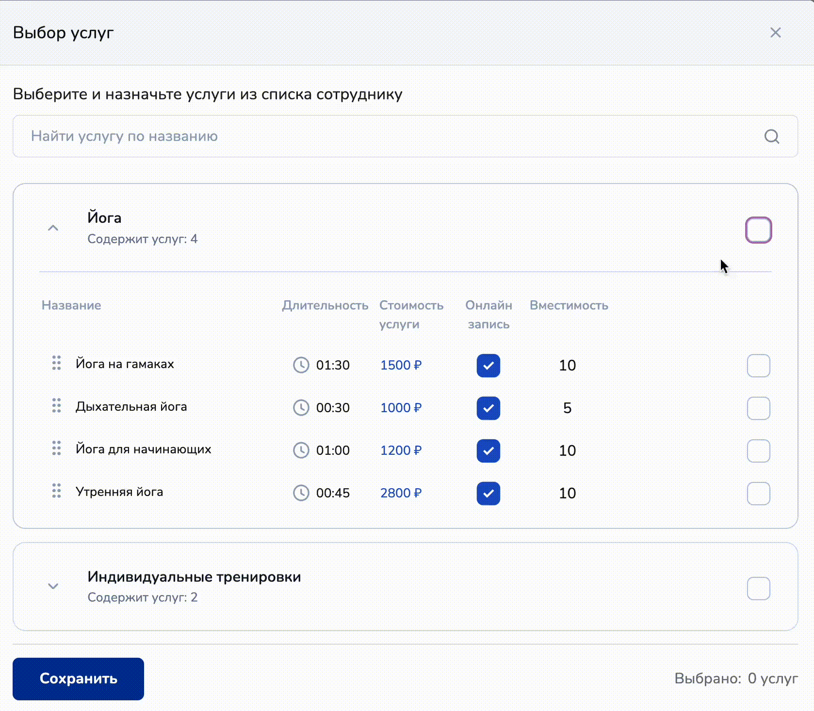

# Как назначить услуги

<figure><figcaption>
Как назначить услуги сотруднику
</figcaption></figure>

Чтобы назначить услуги сотруднику, необходимо кликнуть на сотрудника, которому хотите назначить услугу:

<figure><figcaption></figcaption></figure>

Затем перейти во вкладку услуги в настройках сотрудника:

<figure><figcaption></figcaption></figure>

Далее кликните по кнопке "Назначить услуги":

<figure><figcaption></figcaption></figure>

В открывшемся модальном окошке выберите услуги, которые будет оказывать сотрудник:

<figure><figcaption></figcaption></figure>

Можно выбрать как всю категорию услуг, так и одну из услуг:

<figure><figcaption></figcaption></figure>

Затем нажмите на "Сохранить", тогда в разделе "Услуги" в настройках сотрудника будут отображены назначенные услуги:

<figure><figcaption></figcaption></figure>


Готово!&#x20;

Теперь Вы знаете, как назначить услуги любому сотруднику в филиале.&#x20;

