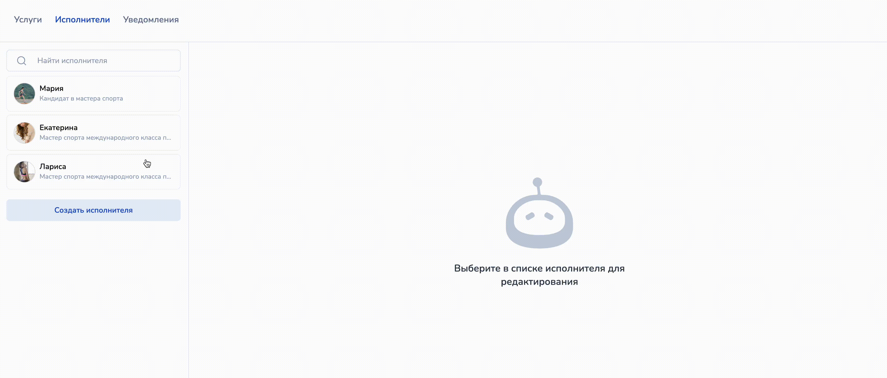

# Как редактировать информацию о сотруднике

<figure><figcaption>
Как редактировать информацию о сотруднике
</figcaption></figure>

Чтобы изменить информацию о сотруднике, кликните на необходимого сотруднике в списке исполнителей:

<figure><figcaption></figcaption></figure>

Далее в разделе "Основная информация" отредактируйте поля с именем сотрудника, его описание и фото:

<figure><figcaption></figcaption></figure>

Обязательно кликните по кнопке "Сохранить", чтобы изменения применились.&#x20;

В этом же разделе можно удалить сотрудника.&#x20;


Внимание!&#x20;

Если у сотрудника уже есть запись клиентов в расписании, то удалить сотрудника не получится.&#x20;

Чтобы клиенты больше не записывались к сотруднику, удалите последующий рабочий график и назначенные услуги.

После того как сотрудник отведет все записи, то его можно будет удалить.&#x20;

