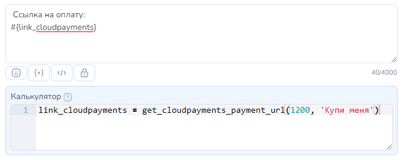
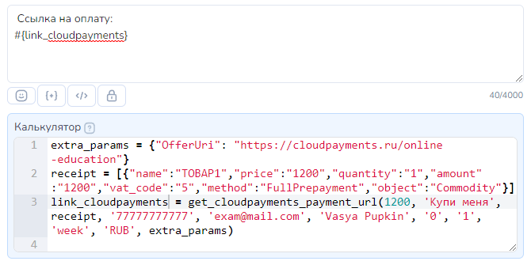

# Cloudpayments

## Как настроить Cloudpayments

Для подключения CloudPayments Вам понадобятся **Public ID** и **Пароль** для API.

Эти данные можно получить в личном кабинете в разделе "Сайты"

<figure><figcaption>
Раздел "Сайты" CloudPayments
</figcaption></figure>

Для того чтобы бот получал уведомления об оплате, также необходимо установить **callback\_url**. Для этого в разделе "Сайты" CloudPayments открываем вкладку уведомления:

<figure><figcaption>
Вкладка "Уведомления" в разделе "Сайты" CloudPayments
</figcaption></figure>

Немного ниже в строке Pay и Recurrent (**ВАЖНО именно Pay и Recurrent** ) необходимо включить переключатель и установить:\
**Адрес:** https://chatter.salebot.pro/cloudpayments\_callback/result\
**Кодировка:** UTF-8\
**HTTP метод:** POST\
**Форма запроса:** CloudPayments

<figure><figcaption>
Настройка уведомлений
</figcaption></figure>

## Как настроить Salebot.pro

Теперь переходим в конструктор. Два значения, о которых мы говорили выше (Public ID и Пароль для API), необходимо указать в форме ниже. Форма находится в разделе "Эквайринг"

<figure><figcaption>
Раздел "Эквайринг"
</figcaption></figure>

<figure><figcaption>
Настройка CloudPayments 
</figcaption></figure>

На этом подключение закончено. Теперь давайте разберемся, как использовать данный функционал.

**поле Ставка НДС (обязательный).** **Не нужно передавать, если товар не облагается НДС**!\
Если же облагается, тогда передаем следующие значения:

<table><thead><tr><th width="268">Передаваемое значение</th><th>Что подразумевает значение</th></tr></thead><tbody><tr><td>0 </td><td>НДС 0%</td></tr><tr><td>10</td><td>НДС 10%</td></tr><tr><td>20</td><td>НДС 20%</td></tr><tr><td>110 </td><td>Расчетный НДС 10/110</td></tr><tr><td>120 </td><td>Расчетный НДС 20/120</td></tr><tr><td>12 </td><td>НДС 12% (только для онлайн-касс в Казахстане)</td></tr></tbody></table>

**поле Система налогообложения (необязательный, если у вас одна система налогообложения )**

<figure><figcaption></figcaption></figure>

## Как сформировать ссылку на оплату


Сформировать ссылку на оплату в блоке можно **ОДНИМ ИЗ** из доступных способов:

* [Кнопка с функцией Оплата](cloudpayments.md#knopka-s-funkciei-oplata)&#x20;
* [Функция `get_cloudpayments_payment_url` в Калькуляторе](cloudpayments.md#funkciya-get_cloudpayments_payment_url-v-kalkulyatore)
* [Создание ссылки с помощью переменной payment\_sum  и дополнительных параметров](cloudpayments.md#sozdanie-ssylki-s-pomoshyu-peremennoi-payment_sum-i-dopolnitelnykh-parametrov) (устаревшая работающая версия)


## Кнопка с функцией Оплата

Ссылку на оплату можно создавать в кнопке с функцией "Оплата". О том как создавать такую кнопку  рассказано в этой статье:&#x20;


Статья про кнопку с функцией Оплата


Рассмотрим все возможные параметры данной кнопки.&#x20;

### **Обязательные параметры кнопки Оплата для** Cloudpayments&#x20;

Для формирования ссылки на оплату в настройках кнопки  необходимо указать  <mark style="color:green;">**обязательные параметры: Сумма  и Наименование товара.**</mark>

<figure><figcaption></figcaption></figure>

**поле Сумма.**  В этом поле указываем стоимость товара в рублях

**поле Назначение платежа.** В этом поле указывается назначение платежа в свободной форме.


**НЕЛЬЗЯ** использовать **двойные кавычки** в Назначении платежа: удалите или замените на одинарные кавычки.&#x20;


**чекбокс Автоплатеж.** Для подключения автоплатежа нужно перейти в раздел "Эквайринг" → открыть настройки "CloudPayments"  и включить автоплатежи

<figure><figcaption></figcaption></figure>

**меню Данные для формирования чека.** При клике откроется выпадающее меню с параметрами для формирования чека:&#x20;


Многие платежные системы поддерживают облачные онлайн-кассы, они необходимы по 54-ФЗ.\
Прочитайте особенности оформления чеков на сайте выбранной платежной системы, чтобы не попасть в неловкую ситуацию с налоговой инспекцией.


* Наименование товара или услуги
* Цена руб.
* Количество
* Итоговая цена
* Способ расчёта

**меню Дополнительная информация.** При клике откроется выпадающее меню для формирования ссылки:

* ФИО покупателя
* Переменная с email покупателя
* Переменная с номером телефона покупателя

**чекбокс С уведомление о клике.** Для отслеживания перехода по ссылке для оплаты можно поставить галочку. В таком случае, при клике по кнопке в диалог с клиентом в Сейлбот придет уведомление о том, что был совершен переход по ссылке

На данное уведомление можно настраивать дальнейшую логику работы бота.

### Дополнительные параметры для формирования чека и ссылки на оплату

#### меню "Данные для формирования чека" .&#x20;

При клике откроется выпадающее меню с параметрами для формирования чека:&#x20;

<figure><figcaption></figcaption></figure>

**поле Наименование товара или услуги (обязательный).**  В данном поле нужно указать название товара (не более 128 символов). Чем точнее указано название товара, тем лучше.&#x20;

Например: не Телефон, а Смартфон Xiaomi модель ххх


**НЕЛЬЗЯ** использовать **двойные кавычки** в Наименовании товара: удалите или замените на одинарные кавычки.&#x20;


**поле Цена руб. (обязательный) .** В данном поле указывается цена в руб за единицу товара.&#x20;

**поле Количество (обязательный).** Количество или вес товара. Передать можно целое или дробное число через точку. Пример, 5 или 10.3

**поле Итоговая цена (обязательный).** В данном поле необходимо указать сумму к оплате с учетом  количества товаров.&#x20;

**поле Способ расчёта.** В этом поле передаем признак способа расчета(например, предоплата). \
Число от 0 до &#x37;**.** Список значений [можно посмотреть тут](https://developers.cloudkassir.ru/#method)

**поле Предмет расчёта.** В этом поле передаем признак предмета расчета(например, товар/услуга).\
Число от 0 до 34. Список значений [можно посмотреть тут](https://developers.cloudkassir.ru/#object)

**выпадающее меню "Дополнительная информация"**

При клике откроется выпадающее меню с дополнительными параметрами для формирования ссылки:&#x20;

<figure><figcaption></figcaption></figure>

**поле ФИО покупателя.** В этом поле указываем для юрлиц — название организации; для ИП и физического лица — ФИО.


Если в названии юрлица есть кавычки их можно пропустить.&#x20;


**Поле Переменная с email покупателя** (необязательный, если передан Номер телефона) В данном поле указывается Email пользователя  (клиента). Можно указывать переменную, в которой хранится  email пользователя.&#x20;

Например, #{email}

**Поле Переменная с номером телефона покупателя** (необязательный, если передан Email). В данном поле можно указать переменную, в которой записан  номер телефона покупателя в формате 79000000000\
Например, #{phone}

### Переменные клиента, которые будут созданы автоматически при использовании кнопки с функцией Оплата

Как только пользователь получит блок с кнопкой "Оплата" автоматически будут созданы переменные клиента:

Служебная переменная клиента **`__payments`** , которая хранит сумму, идентификатор созданной ссылки, нужна для идентификации хука от платежной системы.


Служебную переменную клиента \_\_payments НЕЛЬЗЯ удалять или изменять!


Переменная клиента **`error_payment_button`** создается, если при формировании кнопки возникла ошибка.

В значение переменной error\_payment\_button запишется либо текст ошибки, либо ответ платежной системы с ошибкой.


Значение переменных становятся актуальными при переходе в следующий блок&#x20;


### Как обработать результат

**Успешный платеж.**

После успешной оплаты в бота <mark style="color:orange;">**АВТОМАТИЧЕСКИ**</mark> придет КОЛЛБЭК, который состоит из 10 символов секретного ключа платежной системы, слова \_success и через пробел сумма платежа. \
&#xNAN;_&#x414;ля использования в настройках схемы достаточно его скопировать._&#x20;

Например: `ovg58keefc_success 44`, где:&#x20;

ovg58keefc : первые 10 символов секретного ключа платежной системы

\_success : результат обработки запроса (успешный платеж)

44 : сумма платежа


Коллбэки (уведомления) от платежной системы пользователь НЕ ВИДИТ. Они отображаются только во вкладке Клиенты и видны оператору.


Пример использования:\
Шаг 1. В блоке "с кнопкой Оплата" добавляем кнопки с функцией Оплата.&#x20;

Шаг 2. В поле Условие соединения от этого блока к блоку "Успешная оплата" указываем коллбэк. Аналогично работает, если указать колбэк об успешной оплате в поле Условие блока "Стартовое условие".


Важно: выбор соответствия **Полное совпадение**  или **По наличию ключевых слов**: если используете **По наличию ключевых слов** в поле **Условие,** указывайте часть колбэка без суммы платежа:  10 символов секретного ключа\_\_success


<figure><figcaption></figcaption></figure>

**Платеж с ошибкой**

<mark style="color:blue;">**При ошибке проведения оплаты**</mark> в бота <mark style="color:orange;">**АВТОМАТИЧЕСКИ**</mark> придет КОЛЛБЭК, который состоит из 10 символов секретного ключа платежной системы, слова \_fail и через пробел сумма платежа

Например, `ovg58keefc_fail 44` , где

`ovg58keefc` : 10 символов секретного ключа платежной системы

`_fail` : результат обработки запроса -  платеж не выполнен или с ошибкой.&#x20;

`44` : сумма платежа


Колбэк зависит от платежной системы: не все платежные системы присылают коллбэк об ошибке платежа.


Если сумма, указанная в настройках кнопки, <mark style="color:blue;">**отличается от суммы, которую клиент оплатил**</mark>, то <mark style="color:orange;">**АВТОМАТИЧЕСКИ**</mark> придет КОЛЛБЭК, который состоит из 10 символов секретного ключа платежной системы, слова \_different\_amounts и через пробел уникальный ID платежа

Например: `ovg58keefc_different_amounts 123456` , где:&#x20;

`ovg58keefc` : 10 символов секретного ключа платежной системы

`_different_amounts` : результат обработки запроса (сумма оплаты отличается от суммы в ссылке)

`123456` : уникальный ID платежа

## Функция get\_cloudpayments\_payment\_url в Калькуляторе

Для формирования ссылки на оплату можно воспользоваться функцией `get_cloudpayments_payment_url` в Калькуляторе блоке.

В поле Калькулятор  переменной присвойте значение функции `get_cloudpayments_payment_url`&#x20;


Название переменной задаете самостоятельно.  На скринах примеры названия переменных.&#x20;


В эту переменную запишется ссылка на оплату. Переменную можно вывести на экран ссылкой в сообщении или разместить в кнопке с текстом "Оплатить". Ссылка имеет вид:&#x20;

**ПРИМЕР ссылки на оплату:**

&#x20;https://orders.cloudpayments.ru/d/PsdA6GaZmxSXB8xi


Многие платежные системы поддерживают облачные онлайн-кассы, они необходимы по 54-ФЗ.\
Прочитайте особенности оформления чеков на сайте выбранной платежной системы, чтобы не попасть в неловкую ситуацию с налоговой инспекцией.




Пример 1: ссылка на оплату без чека

<figure><figcaption>
Пример формирования ссылки: переданы только обязательные параметры
</figcaption></figure>

Пример 2: ссылка на оплату с чеком

<figure><figcaption>
Пример формирования ссылки: переданы все параметры
</figcaption></figure>



`link = get_cloudpayments_payment_url(amount, description, products_for_receipt, customer_phone, customer_email, full_name, taxation, recurrent, subscription_period, currency, extra_params)`

#### Параметры функции:

<table><thead><tr><th width="203">Параметр</th><th>Описание параметра</th></tr></thead><tbody><tr><td><strong><code>amount</code></strong></td><td><mark style="background-color:blue;">Сумма к оплате.</mark>  В этом поле указываем стоимость товара в рублях <strong><code>(обязательный параметр)</code></strong> </td></tr><tr><td><strong><code>description</code></strong></td><td>
<mark style="background-color:blue;">Описание заказа.</mark>  В этом поле можно использовать только символы английского или русского алфавита, цифры и знаки препинания. 

<em>Чтобы пропустить данный параметр передайте вместо него пару одинарных или двойных кавычек или значение</em> <em><code>None</code></em> 
</td></tr><tr><td>
<strong><code>products_for_</code></strong>

<strong><code>receipt</code></strong>
</td><td>
<mark style="background-color:blue;">Параметры для формирования чеков.</mark>  <em>Чтобы пропустить данный параметр передайте вместо него пару одинарных / пару двойных кавычек или значение</em> <em><code>None</code></em>

 Имеет следующий вид: 

<em>[{"name":"ТОВАР1","amount":"1200","vat_code":"5","method":"</em>FullPay<em>","object":"Commodity"}]</em>

<strong>Важно! Используйте двойные кавычки для формирования словаря {"ключ": "значение"}</strong>

<strong>name</strong> - Наименование товара

<strong>amount -</strong> Полная сумма в рублях за все количество данного товара с утом всех возможных скидок, бонусов и специальных цен.

<strong>vat_code</strong> - cтавка НДС. Этот параметр устанавливает налоговую ставку в ККТ. Возможные значения данного параметра: 

'1' - Без НДС 

'2' - НДС по ставке 0% 

'3' - НДС по ставке 10% 

'4' - НДС чека по ставке 20% 

'5' - НДС чека по расчетной ставке 10/110 

'6' - НДС чека по расчетной ставке 20/120

'7' - НДС 12% (только для онлайн-касс в Казахстане)

'8'  - НДС по ставке 5%

'9'  - НДС по ставке 7%

'10' - НДС чека по расчетной ставке 5/105

'11'  - НДС чека по расчетной ставке 7/107

<strong>method</strong> - дополнительный параметр для формирования чека. Признак способа расчёта. 

Пример значения параметра: FullPay — полный расчет 

Остальные доступные варианты можно найти в документации Cloudpayments : <a href="https://developers.cloudkassir.ru/#method">https://developers.cloudkassir.ru/#method</a> 

<strong>object</strong> - дополнительный параметр для формирования чека.  Предмет расчета может принимать разные значения. 

Например, commodity — товар

Остальные доступные варианты можно найти в документации  Cloudpayments : <a href="https://developers.cloudkassir.ru/#object">https://developers.cloudkassir.ru/#object</a>

</td></tr><tr><td><strong><code>customer_phone</code></strong></td><td>
<mark style="background-color:blue;">номер телефона покупателя</mark>, не обязательно, если передан параметр <code>customer_email</code> 

Чтобы пропустить данный параметр,  передайте вместо него одинарные или двойные кавычки
</td></tr><tr><td><strong><code>customer_email</code></strong></td><td>
<mark style="background-color:blue;">емейл покупателя</mark>, не обязательно, если передан параметр <code>customer_phone</code>

Чтобы пропустить данный параметр,  передайте вместо него одинарные или двойные кавычки.
</td></tr><tr><td><strong><code>full_name</code></strong></td><td>
<mark style="background-color:blue;">название/ФИО</mark> В данном параметре передаем для юрлица — название организации, для ИП и физического лица — ФИО

<em>Чтобы пропустить данный параметр,  передайте вместо него пару одинарных/ пару двойных кавычек или значение None.</em>
</td></tr><tr><td><mark style="background-color:blue;"><strong><code>taxation</code></strong></mark></td><td>
<mark style="background-color:blue;">Система налогообложения.</mark>    Возможные значения данного параметра: 

'1' - Общая система налогообложения 

'2' - Упрощенная (УСН, доходы) 

'3' - Упрощенная (УСН, доходы минус расходы) 

'4' - Единый налог на вмененный доход (ЕНВД) 

'5' - Единый сельскохозяйственный налог (ЕСН) 

'6' - Патентная система налогообложения  <em>Чтобы пропустить данный параметр передайте вместо него пару одинарных или двойных кавычек или значение</em> <em><code>None</code></em>
</td></tr><tr><td><strong><code>recurrent</code></strong></td><td><mark style="background-color:blue;">Подключение автоплатежа.</mark> Если автоплатеж включен, то передать значение 1, если отключен передайте значение None. </td></tr><tr><td>
<code>subscription_</code>

<code>period</code>
</td><td>
<mark style="background-color:blue;">Период автоплатежа.</mark> По умолчанию, период автоплатежа - месяц.   Доступно всего 2 вариант: месяц и неделя. 

Если передать 'week' - период повторного списания будет неделя.  Чтобы установить период платежа месяц нужно пропустить параметр, то есть либо передать значение None, либо "" (двойные кавычки)
</td></tr><tr><td><strong><code>currency</code></strong></td><td>
<mark style="background-color:blue;">Валюта платежа.</mark> По умолчанию платеж создается в рублях. Для указания другой валюты  необходимо передать значение. Например, '<em><strong>EUR'</strong></em> 

<em>Российский рубль <strong>RUB</strong></em> <em>Евро <strong>EUR</strong></em> <em>Доллар США <strong>USD</strong></em> <em>Фунт стерлингов <strong>GBP</strong></em> <em>Украинская гривна <strong>UAH</strong></em> <em>Белорусский рубль <strong>BYN</strong></em> <em>Казахский тенге <strong>KZT</strong></em> <em>Азербайджанский манат <strong>AZN</strong></em> <em>Швейцарский франк <strong>CHF</strong></em> <em>Чешская крона <strong>CZK</strong></em> <em>Канадский доллар <strong>CAD</strong></em> <em>Польский злотый <strong>PLN</strong></em> <em>Шведская крона <strong>SEK</strong></em> <em>Турецкая лира <strong>TRY</strong></em> <em>Китайский юань <strong>CNY</strong></em> <em>Индийская рупия <strong>INR</strong></em> <em>Бразильский реал <strong>BRL</strong></em> <em>Южноафриканский рэнд <strong>ZAR</strong></em>

<em>Чтобы пропустить данный параметр,  передайте вместо него пару одинарных/ пару двойных кавычек или значение None.</em>
</td></tr><tr><td><strong><code>extra_params</code></strong></td><td>дополнительные параметры, которых нет в данной функции. Возможные дополнительные параметры можно посмотреть по ссылке в документации работы с API  платежной системы <a href="https://developers.cloudpayments.ru/#sozdanie-scheta-dlya-otpravki-po-pochte">https://developers.cloudpayments.ru/#sozdanie-scheta-dlya-otpravki-po-pochte</a> Пример: <code>extra_params =</code> {"OfferUri": "https://cloudpayments.ru/online-education"}   <em>Чтобы пропустить данный параметр,  передайте вместо него пару одинарных или пару двойных кавычек или значение None.</em></td></tr></tbody></table>



<mark style="color:green;">Пример 1: ссылка на оплату без чека</mark>\
\
`link_cloudpayments = get_cloudpayments_payment_url(1200, 'Купи меня')`\
\
\
<mark style="color:green;">Пример 2: ссылка для формирования автоплатежа с чеком, интервал списания -неделя</mark>\
\
`extra_params = {"OfferUri": "https://cloudpayments.ru/online-education"}`

&#x20;`receipt = [{"name":"ТОВАР1","price":"1200","quantity":"1","amount":"1200","vat_code":"5","method":"FullPrepayment","object":"Commodity"}]`

`link_cloudpayments = get_cloudpayments_payment_url(1200, 'Купи меня', receipt, '77777777777', 'exam@mail.com', 'Vasya Pupkin', '0', '1', 'week', 'RUB', extra_params)`


Если вам не нужны все параметры функции, то можно не передавать последние пропущенные значения.


<mark style="color:green;">Пример 3: ссылка на оплату без автоплатежей, пропущены последние 4 параметра функции</mark>&#x20;

`link_cloudpayments = get_cloudpayments_payment_url(1200, 'Купи меня', receipt, '77777777777', 'exam@mail.com', 'Vasya Pupkin', '0')`




Переменную можно вывести на экран ссылкой в сообщении или разместить в кнопке с текстом, например, "Купить".&#x20;



Если в блоке несколько функций для получения ссылки и допущена ошибка, то значение ошибки будет записано в переменной  **`error_payment_func`**

\
Ошибка запишется по последней функции в Калькуляторе


## Создание ссылки с помощью переменной payment\_sum  и дополнительных параметров

### **Как указать сумму**

Для генерации ссылки на оплату вам необходимо установить значение переменной **payment\_sum**, сразу после этого появится переменная **cloudpayments\_pay\_url.** Эту переменную можно вывести на экран ссылкой или разместить на кнопке с текстом "Оплатить".&#x20;

**ПРИМЕР ссылки на оплату:**\
https://orders.cloudpayments.ru/d/PsdA6GaZmxSXB8xi

### **Как указать валюту**

Cloudpayments принимает платежи в нескольких валютах, по умолчанию платеж создается в рублях. Для указания другой валюты вам необходимо присвоить значение переменной **currency.** Переменная принимает значения:

<table><thead><tr><th width="347">Значения, принимаемые переменной:</th><th>Что подразумевает</th></tr></thead><tbody><tr><td> <em><strong>RUB</strong></em></td><td><em>Российский рубль</em></td></tr><tr><td> <em><strong>EUR</strong></em></td><td><em>Евро</em></td></tr><tr><td><em><strong>USD</strong></em></td><td><em>Доллар США</em> </td></tr><tr><td><em><strong>GBP</strong></em></td><td><em>Фунт стерлингов</em> </td></tr><tr><td><em><strong>UAH</strong></em></td><td><em>Украинская гривна</em> </td></tr><tr><td><em><strong>BYN</strong></em></td><td><em>Белорусский рубль</em> </td></tr><tr><td><em><strong>KZT</strong></em></td><td><em>Казахстанский тенге</em> </td></tr><tr><td><em><strong>AZN</strong></em></td><td><em>Азербайджанский манат</em> </td></tr><tr><td> <em><strong>CHF</strong></em></td><td><em>Швейцарский франк</em></td></tr><tr><td><em><strong>CZK</strong></em></td><td><em>Чешская крона</em> </td></tr><tr><td><em><strong>CAD</strong></em></td><td><em>Канадский доллар</em> </td></tr><tr><td><em><strong>PLN</strong></em></td><td><em>Польский злотый</em> </td></tr><tr><td><em><strong>SEK</strong></em></td><td><em>Шведская крона</em></td></tr><tr><td><em><strong>TRY</strong></em></td><td><em>Турецкая лира</em> </td></tr><tr><td><em><strong>CNY</strong></em></td><td><em>Китайский юань</em> </td></tr><tr><td><em><strong>INR</strong></em></td><td><em>Индийская рупия</em> </td></tr><tr><td><em><strong>BRL</strong></em></td><td><em>Бразильский реал</em> </td></tr><tr><td><em><strong>ZAR</strong></em></td><td><em>Южноафриканский рэнд</em> </td></tr></tbody></table>

Например, как на скрине ниже, чтобы указать валюту белорусского рубля, можно установить эту переменную в настройках проекта.

<figure><figcaption>
Настройки проекта → Переменные → Редактирование общих переменных
</figcaption></figure>

### **Как добавить описание платежа**

Вы можете добавить описание платежа, оно будет отображаться в заголовке формы оплаты.

<figure><figcaption></figcaption></figure>

Описание берется из переменной **payment\_description**

Также есть возможность указать необязательное поле - Идентификатор пользователя в вашей системе. Для этого нужно до объявления переменной payment\_sum объявить переменную **account\_id** с нужным вам значением


При включении автоплатежей поле "Идентификатор пользователя" заполняется автоматически


Другими словами, даже если ранее вы вручную задавали значение переменной account\_id, при включении автоплатежей она перезапишется и будет принимать значение идентификатора пользователя в Salebot. Такое изменение переменной требуется для корректного распознавания коллбэком в автоплатежах.

### **Как обработать результат**


**Важно**! после успешной оплаты в бот придет коллбэк, по которому вы сможете понять, что была успешная оплата.&#x20;

Этот коллбэк в системе вы видите, как сообщение от пользователя, чтобы его не мог отправить пользователь, он состоит из ключа cloudpayments и приписки со статусом, например: **1c00db20d8fc223bce1f407dc1925542db114a76ab62e5afa3714e8fff0cdc78\_success.**&#x20;


При успешной оплате по ссылке созданной с помощью кнопки с функцией ОПЛАТА или с помощью функции в калькуляторе, в бота <mark style="color:orange;">**АВТОМАТИЧЕСКИ**</mark> придет КОЛЛБЭК, который состоит из 10 символов секретного ключа платежной системы, слова \_success и через пробел сумма платежа. \
\
&#xNAN;_&#x414;ля использования в настройках схемы достаточно его скопировать._&#x20;

Например: `ovg58keefc_success 44`, где:&#x20;

ovg58keefc : первые первые 10 символов секретного ключа платежной системы

\_success : результат обработки запроса (успешный платеж)

44 : сумма платежа


Эти коллбэки НЕ ВИДИТ пользователь, они отображаются только оператору.


<figure><figcaption></figcaption></figure>

Также после успешной оплаты переменная **cloudpayments\_payment\_completed** устанавливается в **True.**

Если же оплата была неуспешной, Вам придет коллбэк вида 1c00db20d8fc223bce1f407dc1925542db114a76ab62e5afa3714e8fff0cdc78\_fail.&#x20;

<figure><figcaption></figcaption></figure>

Для того чтобы узнать причину, обратите внимание на переменную **cloudpayments\_payment\_status**.&#x20;

Она может принимать следующие значения:&#x20;

<table><thead><tr><th width="153"></th><th width="175"></th><th></th></tr></thead><tbody><tr><td>Completed</td><td>Завершена</td><td>После подтверждения операции</td></tr><tr><td>Cancelled</td><td>Отменена</td><td>В случае отмены операции</td></tr><tr><td>Declined</td><td>Отклонена</td><td>В случае невозможности провести операцию (нет денег на счете карты и др.)</td></tr></tbody></table>


Тип сравнения должен быть "**Полное совпадение**"



Для совершения повторного платежа обязательно необходимо обнулить **payment\_sum**, ранее сформированную ссылку и уже после переназначить переменную **payment\_sum** для получения свежей ссылки


### **Пример**


Для тестирования необходимо использовать карту  с номером: 4111111111111111. Остальные данные не имеют значения.


Пример схемы, которая позволит протестировать и быстро начать работу с Cloudpayments.

<figure><figcaption></figcaption></figure>

На рисунке показан пример первого блока, в котором пользователя спрашивают сколько он хочет оплатить.

Ниже настройки стрелки, в ней должен быть включен переключатель "Пользователь вводит данные" и в поле вписана переменная **payment\_sum.**

<figure><figcaption></figcaption></figure>

Ссылка на оплату содержится в переменной **#{cloudpayments\_pay\_url}**

После завершения оплаты клиенту добавится переменная **cloudpayment\_callback\_data**, содержащая данные ответа платежной системы по совершенной операции. Из полученного словаря можно извлечь необходимые данные при помощи метода **get**.

## Как сформировать чек

Для формирования чека онлайн-кассы необходимо при формировании ссылки на оплату передать дополнительные параметры.


**Обратите внимание:** переменной **payment\_sum** присваивается значение после других параметров.


Обязательные параметры:

<mark style="color:red;">**!**</mark>**&#x20;products\_for\_receipt** - это массив с перечисленными товарами чека, следующего вида:

\[{"**description**": "Название товара", "**quantity**": "Количество товара", "**price**": "Цена за единицу товара", "**amount**": "стоимость товара, произведение quantity и price", "**vat\_code**": "ставка НДС"},&#x20;

{"**description**": "Название товара 2", "**quantity**": "Количество товара 2", "**price**": "Цена за единицу товара 2", "**amount**": "стоимость товара, произведение quantity и price"}]

Каждый товар разделен запятой и имеет вид: \
{"**description**": "Название товара", "**quantity**": "Количество товара", "**amount**": "Цена за единицу товара", "**vat\_code**": "ставка НДС"}

где:&#x20;

<table><thead><tr><th width="187">Значение </th><th width="198">Описание</th><th>Примечание</th></tr></thead><tbody><tr><td><strong>description</strong> </td><td>название товара (не более 128 символов)</td><td></td></tr><tr><td><strong>quantity</strong> </td><td>количество товара, может быть целое число, либо дробное через точку (например: 1 или 5 или 2.0 или 3.5)</td><td></td></tr><tr><td><strong>price</strong> </td><td>цена за единицу товара</td><td></td></tr><tr><td><strong>amount</strong> </td><td>стоимость товара, произведение quantity и price</td><td></td></tr><tr><td><strong>vat_code</strong></td><td>ставка НДС (не указываем, если товар без НДС)</td><td>
<strong>vat_code</strong> не нужно передавать, если товар не облагается НДС (в примере выше первый товар с 0% НДС, второй без НДС), если же облагается, тогда передаем следующие значения:  '1' - Без НДС 

'2' - НДС по ставке 0% 

'3' - НДС по ставке 10% 

'4' - НДС чека по ставке 20% 

'5' - НДС чека по расчетной ставке 10/110 

'6' - НДС чека по расчетной ставке 20/120

'7' - НДС 12% (только для онлайн-касс в Казахстане)

'8'  - НДС по ставке 5%

'9'  - НДС по ставке 7%

'10' - НДС чека по расчетной ставке 5/105

'11'  - НДС чека по расчетной ставке 7/107
</td></tr></tbody></table>

Также необходимо указать, контактные данные клиента, как минимум: электронную почту или номер телефона:

**email** - E-mail покупателя для отправки чека\
**phone** - телефон покупателя в формате без скобок и дефисов для отправки ссылки на чек

Необязательные параметры:\
**full\_name** - для юрлица — название организации, для ИП и физического лица — ФИО\
**cloudpayments\_method** - признак способа расчета(например, предоплата). \
Число от 0 до &#x37;**.**&#x421;писок значений можно посмотреть [тут](https://developers.cloudkassir.ru/#method)\
**cloudpayments\_object** - признак предмета расчета(например, товар/услуга).\
Число от 0 до 34. Список значений можно посмотреть [тут](https://developers.cloudkassir.ru/#object)\
**cloudpayments\_inn** - ИНН организации, необходим для корректного формирования чека **cloudpayments\_taxation\_system** - система налогообложения, число от 0 до 5, где \
0-Общая система налогообложения \
1-Упрощенная система налогообложения (Доход) \
2-Упрощенная система налогообложения (Доход минус Расход) \
3-Единый налог на вмененный доход \
4-Единый сельскохозяйственный налог \
5-Патентная система налогообложения \
Если не указать, поставит первую систему, указанную при фискализации. **cloudpayments\_calculation\_place** - Место осуществления расчёта, например, адрес сайта 

<figure><figcaption></figcaption></figure>

Пример данных для чека:

`products_for_receipt = [{"description": "Название товара", "quantity": "2", "price": "25", "amount": "50", "vat_code": "0"}, {"description": "Название товара 2", "quantity": "3", "price": "50", "amount": "150"}]`\
`phone = 79000000000`\
`email = example@gmail.com`\
`full_name = Иванов Иван Иванович`

**После определения переменных платежа, определяем переменную payment\_sum**, после которой сразу появится ссылка на оплату в переменной cloudpayments\_pay\_url.

<figure><figcaption></figcaption></figure>


Внимание! Общая стоимость всех товаров должна быть равной переменной payment\_sum.


После оплаты на указанную почту клиенту придет квитанция об оплате, если был передан номер телефона, то на него придет сообщение со ссылкой на квитанцию.

<figure><figcaption>
Тестовая квитанция об оплате
</figcaption></figure>

## Как создать автоплатежи

Для создания платежа с подпиской, достаточно перейти в раздел "Эквайринг" в Salebot и в настройках платежной системы включить эту возможность:

<figure><figcaption></figcaption></figure>

Теперь при переходе по ссылке на оплату покупателю выводится информация, что после проведение платежа создастся подписка.

**Обратите внимание:** Автоплатеж автоматически создается с периодом списания равным **один месяц.**&#x20;

Вы можете задать период списания равный **одной неделе**, для этого перед первым (установочным) платежом дополнительно нужно задать переменную **cloudpayments\_subscription\_period** - со значением **week** 

<figure><figcaption></figcaption></figure>

## Как создать автоплатежи

### Как обработать результат платежей по подписки

Результат и статус платежа по подписке можно отследить по переменным сделки:

<table><thead><tr><th width="341"></th><th></th></tr></thead><tbody><tr><td>cloudpayments_payment_completed</td><td>общий индикатор успешного/неуспешного платежа, принимает значения True/False;</td></tr><tr><td>cloudpayments_subscription_payment</td><td>индикатор успешного/неуспешного платежа по подписке, принимает значения True/False;</td></tr><tr><td>cloudpayments_payment_status</td><td>статус платежа в системе Cloudpayments, принимает значения из таблицы ниже:</td></tr></tbody></table>

<figure><figcaption></figcaption></figure>

В случае успешного платежа в переменную subscription\_payment\_sum записывается его сумма, например 200.0

<figure><figcaption></figcaption></figure>

По каждому запросу на списание в бота придет коллбэк. Он выглядит так же, как при обычном платеже. Его описание есть выше в главе "[Обработка результата](https://docs.salebot.pro/integracii/platezhnye-sistemy/cloudpayments#kak-obrabotat-rezultat)".

### Как получить id подписки

При попытке совершить установочной платеж Salebot получит коллбэк, содержащий id подписки и запишет этот id в переменную клиента cloudpayments\_subscription\_id.

Данная переменная используется в запросах функциях изменения и отмены подписки.

<figure><figcaption></figcaption></figure>


&#x20;При создании и попытке оплаты новой подписки переменная перезапишется.


### Как отслеживать статус подписки

Статус подписки клиента записывается в переменную сделки cloudpayments\_subscription\_status. Она принимает значения “Active” или “Inactive”.

Выбор значения зависит от двух факторов:

* статуса последнего совершенного платежа по подписке, то есть если платеж был успешным (“Completed”), переменная примет значение “Active”, а в противном случае - “Inactive”;
* информации, которая приходит в ответ на запросы изменения или отмены подписки. Например, если вы отменили подписку, в Salebot придёт колбек c обновленными данными подписки и статусом “Cancelled”. Salebot распознает изменение статуса и перезапишет переменную.


Обратите внимание, что любой запрос на изменение подписки, которая была ранее отменена в системе Cloudpayments, вновь активирует подписку, а платежи по данной подписке будут взиматься в установленном при создании порядке. Чтобы избежать нежелательных платежей по подписке, при отмене, не связанной с результатом рекуррентного списания, рекомендуется обнулить переменную cloudpayments\_subscription\_id.


### **Как изменить существующую подписку**

Если после создания вам нужно изменить подписки, используйте функцию cloudpayments\_update\_subscription(amount, description, subscription\_interval, subscription\_period, products\_for\_receipt, start\_date)

Функция принимает набор параметров, однако ни один из них не является обязательным, поэтому, если вы хотите сохранить прежнюю информацию относительно одного из параметров, то просто передайте в него пустую строку - ‘’.

Параметры:

<table><thead><tr><th width="273"></th><th></th></tr></thead><tbody><tr><td>amount</td><td>значение суммы платежа по подписке, ожидаемый формат - целое или число с двумя знаками после точки;</td></tr><tr><td>description</td><td>описание назначения платежа по подписке, ожидаемый формат - строка;</td></tr><tr><td>subscription_interval</td><td>интервал списания оплаты, возможные значения: Day, Week, Month</td></tr><tr><td>subscription_period</td><td>частота списания оплаты по заданному интервалу. Например, если указать, subscription_interval = ‘Month’ и subscription_period = 3, списания будут производиться раз в 3 месяца.</td></tr><tr><td>products_for_receipt </td><td>параметры для формирования чека. Формат ожидаемого значения подробно описан  в разделе “<a href="https://docs.salebot.pro/integracii/platezhnye-sistemy/cloudpayments#kak-sformirovat-chek">Как сформировать чек</a>” </td></tr><tr><td>start_date </td><td>
дата и время первого или следующего платежа во временной зоне UTC.

Пример ожидаемого формата '2024-02-25T06:00:00'
</td></tr></tbody></table>

<mark style="color:orange;">**Для блоков, созданных ранее 16.01.2024:**</mark>

Параметры для изменения интервала, частоты списания и содержимого чеков, также можно задать в блоке с помощью переменных перед вызовом функции.


Обратите внимание, что названия параметров отличаются от тех, которые передаются напрямую в функцию!



Если вы ранее задавали нижеуказанные переменные и вызываете функцию с пустыми значениями в параметрах subscription\_interval, subscription\_period и products\_for\_receipt, функция будет брать значения переменных и учитывать их при формировании запроса. Чтобы избежать нежелательных изменений в подписке, обнулите переменные, присвоив им пустую строку - ''.


<table><thead><tr><th width="281"></th><th></th></tr></thead><tbody><tr><td>products_for_subscription_receipt</td><td>
параметры для формирования чека. Формат ожидаемого значения подробно описан  в разделе “<a href="https://docs.salebot.pro/integracii/platezhnye-sistemy/cloudpayments#kak-sformirovat-chek">Как сформировать чек</a>” 

Если вам не нужно менять содержимое чека, пропустите этот параметр или передайте в него пустую строку ‘’.
</td></tr><tr><td>cloudpayments_subscription_interval</td><td>интервал списания оплаты, возможные значения: Day, Week, Month;</td></tr><tr><td>cloudpayments_subscription_period</td><td>частота списания оплаты по заданному интервалу. Например, если указать, subscription_interval = ‘Month’ и subscription_period = 3, списания будут производиться раз в 3 месяца.;</td></tr></tbody></table>


Обратите внимание, что изменение интервала и периода подписки не будет работать, если Вы ранее не создавали  платеж по подписке, т.к. функция обновляет уже существующую подписку, а не создает новую.



Также стоит обратить внимание, что первый платеж по подписке Cloudpayments всегда создается на интервал раз в месяц или раз в неделю, поэтому первичное уведомление о платеже будет содержать вот такую приписку в платежной форме:


<figure><figcaption></figcaption></figure>

Для того, чтобы узнать, прошло ли изменение параметров подписки, следует найти описание переменной с функцией cloudpayments\_update\_subscription в переменных клиента. В приведенном примере в переменной response записан ответ функции, среди параметров ответа можно увидеть новые период и интервал подписки.

<figure><figcaption></figcaption></figure>

Пример ниже показывает использование нового описания подписки.&#x20;

Например, изменим данные подписки на следующие: \
products\_for\_subscription\_receipt = \[{"description": "Название товара", "quantity": "1", "price": "10", "amount": "10", "vat\_code": "0"}, {"description": "Название товара 2", "quantity": "3", "price": "30", "amount": "90"}] \
response = cloudpayments\_update\_subscription(100, "Новая подписка") products\_for\_subscription\_receipt - необязательная переменная, данные для чека (описание ниже)

<figure><figcaption></figcaption></figure>

### **Совершение обычного платежа при включенных подписках**

Если Вам нужно, при включенных автоплатежах провести оплату без подписки, то до указания переменной payment\_sum, нужно добавить переменную **cloudpayments\_manual\_recurrent\_disable** и присвоить ей значение 1.&#x20;

Таким образом, ссылка на оплату сформируется без подписки.


Важно! Не забывайте каждый раз обнулять переменную, после получения ссылки


<figure><figcaption></figcaption></figure>

### **Как получить чеки для платежей по подписке**

Если при первом платеже с включенными автоплатежами были переданы данные для чека, то создастся подписка уже с данными для чека. На каждый автоплатеж будет приходить чек на указанный email или номер телефона.

Если вы решили изменить сумму платежа по подписке, у вас подключена онлайн касса и после списания нужно отправлять чек, тогда до вызова функции **cloudpayments\_update\_subscription()** нужно создать переменную **products\_for\_subscription\_receipt**, которая будет содержать новые данные для чека. Если их не передать, списания будут происходить без чека.

**products\_for\_subscription\_receipt** заполняется таким же образом, как и переменная **products\_for\_receipt** описанная выше в главе "[Формирование чеков](cloudpayments.md#kak-sformirovat-chek)"

### Как получить информацию о подписке

Информацию о подписке клиента можно получить с помощью функции **cloudpayments\_subscription\_info()**.&#x20;

Функция не принимает параметров и вернёт данные подписки с id из переменной клиента cloudpayments\_subscription\_id.

Пример возвращаемых данных:

<figure><figcaption></figcaption></figure>

### Как отменить подписку

Чтобы отменить подписку, достаточно вызвать функцию **cloudpayments\_remove\_subscription()**

<figure><figcaption></figcaption></figure>

#### Как понять, что подписка отменена?&#x20;

Вам приходят уведомления по платежам по подписке, которые содержат текущий статус подписки.

Если подписка активна, то в диалоге будет коллбэк "частьключа\_\_success" и в переменную cloudpayments\_subscription\_status запишется значение "<mark style="color:green;">**Active**</mark>"

Если подписка отменена или не оплачена, в диалоге будет коллбэк "частьключа\_fail",  а в переменную cloudpayments\_subscription\_status запишется "<mark style="color:red;">**Inactive**</mark>"

## Как вывести данные о сделке

В cloudpayments доступна функция вывода полных данных о сделке. Для этого в окне подключения платежки необходимо включить “сохранять данные коллбэка". После этого, при совершении платежей пользователями, в информацию о сделке в переменную **cloudpayment\_callback\_data** будет приходить список, включающий в себя данные о совершенном действии. Из этого списка можно извлечь нужную вам информацию, такую как статус сделки, сумма, валюта, имя, почта и другое. Для этого воспользуйтесь встроенной функцией get()


На заметку! Статус платежа также записывается в переменную **cloudpayments\_payment\_status.**


<figure><figcaption></figcaption></figure>

<figure><figcaption></figcaption></figure>

## Оплата по токену (рекарринг)

**Рекарринг** — это услуга, которая позволяет клиентам проводить повторную оплату банковскими картами на сайте в один клик, не тратя время на ввод данных.

Этот вид платежа инициирует покупатель, когда оформляет онлайн-покупку впервые.

Если вы хотите подключить данный сервис, вам необходимо связаться с персональным менеджером Cloudpayments.

После подключения сервиса и оплаты по ссылке в ваших переменных появится платежный токен cloudpayments\_payment\_token, с помощью которого вы можете совершить рекарринговый платеж без ввода данных карты.

Чтобы произвести безакцептное списание, задайте переменную token\_payment\_sum (сумма платежа по токену) и воспользуйтесь функцией калькулятора cloudpayments\_payment\_token, передав в неё необходимые параметры в заданном порядке:

token -> initiator -> scheduled -> customer\_phone

#### Описание параметров:

<table><thead><tr><th width="200"></th><th width="221"></th><th></th></tr></thead><tbody><tr><td>token (обязательный)</td><td> токен первого платежа, ожидаемый формат - строка</td><td>например “tk_279a375c41672bd74fdafe625d56y”</td></tr><tr><td>initiator (необязательный) </td><td>признак инициатора списания денежных средств.</td><td>
Возможные значение:

0 (ноль, по умолчанию) - транзакция инициирована ТСП на основе ранее сохраненных учетных данных;

1 (единица) - транзакция инициирована держателем карты (клиентом) на основе ранее сохраненных учетных данных.
</td></tr><tr><td>scheduled (необязательный) </td><td>признак оплаты по расписанию на основе ранее сохраненных учетных данных.</td><td>
Возможные значение:

0 (ноль, по умолчанию) - без расписания;

1 (единица) - по расписанию.
</td></tr><tr><td>customer_phone (условно обязательный)</td><td>номер телефона плательщика в формате “89991234567” или “+79991234567”</td><td>
Не заполняйте данный параметр, если совершаете платеж с использованием узбекистанского провайдера.  

В запросах к российскому провайдеру Cloudpayments обязательна передача номера телефона плательщика, если вы являетесь ТСП, предоставляющей телекоммуникационные услуги (MCC 4814 Telecommunication Services). 

В случае отсутствия номера телефона в запросе, банки-эквайеры будут отклонять проводимые операции.
</td></tr></tbody></table>

В случае успешного платежа, вы получите привычный коллбэк об оплате.
