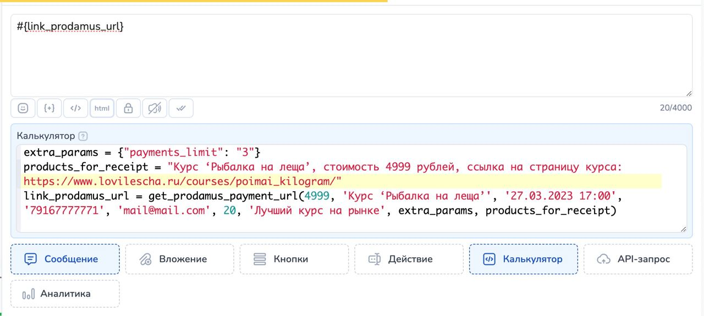
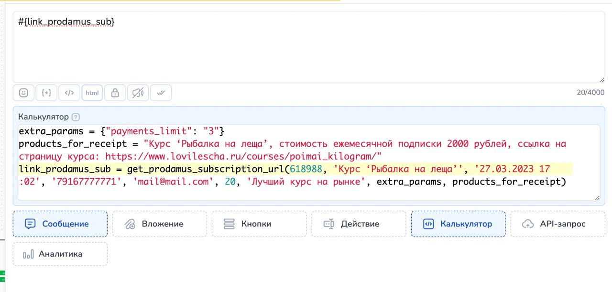

# Продамус (Prodamus)


Доступно только на тарифе "Инфобиз".


## Как подключить Продамус

Для подключения Prodamus Вам понадобятся URL-платежной формы и секретный ключ.

<mark style="color:green;">**URL-платежной формы**</mark> вы получаете после регистрации, он <mark style="color:green;">**имеет вид: demo.payform.ru**</mark>

Секретный ключ можно получить в личном кабинете, там же нужно прописать URL адрес для уведомлений.

<figure><figcaption>
Секретный ключ в настройках формы личного кабинета платежной системы "Продамус"
</figcaption></figure>

Подробная инструкция как это сделать: [https://help.prodamus.ru/payform.ru-onlain-oplaty/prochee/url-dlya-uvedomlenii-i-sekretnyi-klyuch](https://help.prodamus.ru/payform.ru-onlain-oplaty/prochee/url-dlya-uvedomlenii-i-sekretnyi-klyuch)

Адрес для уведомлений: **https://chatter.salebot.pro/prodamus\_callback/result**

Этот адрес нужно прописать в настройках в двух местах.

На главной странице настроек можно выбрать режим работы формы: демо-режим без оплат или режим оплат:

<figure><figcaption></figcaption></figure>

Адрес для уведомлений нужно прописать в настройках платежной системы в двух местах: вкладка Настройка формы  - для обычных оплат и вкладка, Подписки - для оплат по подписке.&#x20;

<figure><figcaption>
Настройка url для уведомлений
</figcaption></figure>

Адрес для уведомлений: **`https://chatter.salebot.pro/prodamus_callback/result`**

Для настройки работы с **оплатами по подписке**  перейдите во вкладку Подписки и пропишите адрес для уведомлений:

&#x20;**`https://chatter.salebot.pro/prodamus_callback/result`**

<figure><figcaption>
Настройка url для  уведомлений для оплат по подписке
</figcaption></figure>


Обратите внимание! После ввода url обязательно нажмите кнопку «Сохранить».


Для подключения Prodamus необходимо перейти в раздел "Эквайринг"

<figure><figcaption>
Раздел "Эквайринг" → Выбор платежной системы "Продамус"
</figcaption></figure>

Далее необходимо просто указать данные, о которых говорили выше, в форму:

<figure><figcaption>
Форма платежной системы "Продамус" в разделе "Эквайринг"
</figcaption></figure>


**ВАЖНО!** url - платежной формы указываем БЕЗ https://&#x20;


На этом подключение закончено. Теперь давайте разберемся как использовать данный функционал.

## Как сформировать ссылку на оплату


Сформировать ссылку на оплату в блоке можно **ОДНИМ ИЗ** из доступных способов:

* [Кнопка с функцией Оплата ](platezhnaya-sistema-prodamus-prodamus.md#knopka-s-funkciei-oplata)или
* [Функция get\_prodamus\_payment\_url в Калькуляторе](platezhnaya-sistema-prodamus-prodamus.md#funkciya-get_prodamus_payment_url-v-kalkulyatore) или
* [Создание ссылки с помощью переменной payment\_sum  и дополнительных параметров](platezhnaya-sistema-prodamus-prodamus.md#sozdanie-ssylki-s-pomoshyu-peremennoi-payment_sum-i-dopolnitelnykh-parametrov) (устаревшая работающая версия)


## Кнопка с функцией Оплата

Ссылку на оплату можно создавать в кнопке с функцией "Оплата". О том как создавать такую кнопку  рассказано в этой статье:&#x20;


Статья про кнопку с функцией Оплата


Рассмотрим все возможные параметры данной кнопки.&#x20;

### **Обязательные параметры кнопки Оплата для Продамус**

Для формирования ссылки на оплату в настройках кнопки необходимо указать <mark style="color:red;">**обязательные параметры**</mark> "**Сумма**", "**Наименование товара**", также параметр "**Оплаченный контент**", если у вас **нет своей онлайн кассы** и вы хотите получать чек от Prodamus.&#x20;

При переходе на страницу оформления заказа заранее будет прописана информация о продукте и его стоимости, клиенту останется только указать свои контакты.\
\
Если в настройках кнопки указать Email и\или телефон пользователя, то на странице оформления заказа будут  указаны контакты плательщика и информация о продукте и его стоимости.

<figure><figcaption>
Окно настроек кнопки
</figcaption></figure>

**поле Текст.** Данный текст будет указан на кнопке с ссылкой на оплату в сообщении

**поле Функция.** Для создания кнопки для выдачи ссылки на оплату выбираем функцию Оплата

**поле Платежная система.** В списке отображаются подключенные к проекту платежные системы


Если к проекту не подключены платежные системы данный тип кнопок будет не доступен


**поле Наименование  товара (обязательное).** В данном поле нужно указать название товара. Чем точнее указано название товара, тем лучше. Например: не Телефон, а Смартфон Xiaomi модель …&#x20;


**НЕЛЬЗЯ** использовать **двойные кавычки** в наименовании товара: удалите или замените на одинарные кавычки.&#x20;


**поле Сумма (обязательное).**  В этом поле указываем стоимость товара.&#x20;

**меню Дополнительная информация.** При клике по данной кнопке откроются дополнительные поля для формирования ссылки

* Описание заказа
* Скидка в руб.
* Переменная с email покупателя
* Переменная с номером телефона покупателя
* Время жизни ссылки
* ID товара для подписки (для создания автоплатежей)
* Оплаченный контент&#x20;

**чекбокс С уведомлением о клике.** Для отслеживания перехода по ссылке для оплаты можно поставить галочку. В таком случае, при клике по кнопке в диалог с клиентом в Сейлбот придет уведомление о том, что был совершен переход по ссылке

<figure><figcaption>
Коллбэк после перехода клиентом по ссылке
</figcaption></figure>

На данное уведомление можно настраивать дальнейшую логику работы бота.&#x20;


Многие платежные системы поддерживают облачные онлайн-кассы, они необходимы по 54-ФЗ.\
Прочитайте особенности оформления чеков на сайте выбранной платежной системы, чтобы не попасть в неловкую ситуацию с налоговой инспекцией.


А вот так выглядит страница оплаты, которая открывается при переходе по ссылке в кнопке Оплата:

<figure><figcaption>
Страница оплаты: в кнопке заполнены только основные параметры
</figcaption></figure>

### Дополнительные параметры формирования ссылки на оплату

<figure><figcaption></figcaption></figure>

**поле Описание заказа.**  Информация указанная в данном поле будет отображаться на странице оплаты в поле Дополнительные данные

**поле Скидка.** В данном поле можно указать размер скидки в рублях или рубли с копейками. Для того, чтобы указать сумму с копейками в качестве разделителя используем точку:  50.99\
На странице оплаты в поле Сумма к оплате будет указана с учетом скидки , а основная стоимость товара будет перечеркнута.&#x20;

**Поле Переменная с email покупателя** (необязательный, если передан Номер телефона) В данном поле указывается Email пользователя  (клиента). Можно указывать переменную, в которой хранится  email пользователя.&#x20;

Например, #{email}

**Поле Переменная с номером телефона покупателя** (необязательный, если передан Email). В данном поле можно указать переменную, в которой записан  номер телефона покупателя в формате 79000000000\
Например, #{phone}


Обязательно должен присутствовать email и/или телефон


**поле Время жизни ссылки.** Можно указать дату в формате дд.мм.гггг чч:мм (например 25.01.2021 11:00) или использовать переменные для назначения срока окончания действия ссылки. \
Пример использования переменной: `#{link_expired}`

**поле ID товара по подписки.**  Чтобы выполнить автоплатеж,  передайте значение ID товара.  Для создания подписки, нужно создать подписной товар.&#x20;

Подробная инструкция как создать товар для подписки: [https://help.prodamus.ru/payform/rekurrent-i-kluby/kak-sozdat-i-nastroit-podpiski](https://help.prodamus.ru/payform/rekurrent-i-kluby/kak-sozdat-i-nastroit-podpiski)


Если передать значение ID товара по подписке, то сумма платежа не учитывается. Данные по товару будут получены из карточки товара из кабинета Продамус


Номер телефона указанный при оплате будет необходим  для управлением подпиской.


Если передать **ID товара по подписки**, то  в колбэке при успешном  платеже будет передан ID  этого товара


**Поле Оплаченный контент** (условно обязательное). Данные необходимы для фискализации оплаты Prodamus'ом, если у вас нет своей онлайн кассы. В данном поле нужно указать описание покупки, её стоимость и ссылку на ресурс с контентом.&#x20;

_Например_: _Курс ‘Плетение кос’, стоимость 3000 рублей, ссылка на страницу курса:_ [_https://nbu.su/krasota/master-po-pleteniyu-kos/?yclid=13602995275739430911_](https://nbu.su/krasota/master-po-pleteniyu-kos/?yclid=13602995275739430911).&#x20;

Эти данные необходимы для передачи в ФНС.

#### Кнопка с функцией оплаты

Если вы указываете время жизни ссылки, то в случае

1. Когда пользователь запросил ссылку оплаты в ее активный срок (то есть ее срок жизни еще не закончился) и она есть в диалоге, то оплатить он не сможет и у него будет уведомление следующего вида:

<figure><figcaption></figcaption></figure>


Срок действия ссылки должен быть позже текущей даты, иначе и по такой ссылке клиент не сможет оплатить.&#x20;


2\. Когда пользователь запрашивает ссылку, а она уже неактивна\
В таком случае кнопка просто не появится. И в переменных клиента появится переменная "error\_payment\_button", которая содержит в себе следующее значение: "Ошибка: Срок действия ссылки должен быть позже текущей даты".


Чтобы пользователь мог оплатить корректно, желательно дополнительно обработать такой случай.&#x20;


Как это сделать?

Создайте блок с условием, в котором укажите, если пришло уведомление подобного плана, error\_payment\_button == "Ошибка: Срок действия ссылки должен быть позже текущей даты"&#x20;

С выводом текста: "Извините, вы не успели и ссылка на оплату больше недействительна":

<figure><figcaption>
Диалог в разделе "Клиенты"
</figcaption></figure>

<figure><figcaption>
Настройка блока "Стартовое условие"
</figcaption></figure>

### Переменные клиента, которые будут созданы автоматически при использовании кнопки с функцией Оплата

Как только пользователь получит блок с кнопкой "Оплата" автоматически будут созданы переменные клиента:

Служебная переменная клиента **`__payments`** , которая хранит сумму, идентификатор созданной ссылки, нужна для идентификации хука от платежной системы.


Служебную переменную клиента \_\_payments НЕЛЬЗЯ удалять или изменять!


Переменная клиента **`error_payment_button`** создается, если при формировании кнопки возникла ошибка.

В значение переменной error\_payment\_button запишется либо текст ошибки, либо ответ платежной системы с ошибкой.


Значение переменных становятся актуальными при переходе в следующий блок&#x20;


### Как обработать результат

**Успешный платеж.**

После успешной оплаты в бота <mark style="color:orange;">**АВТОМАТИЧЕСКИ**</mark> придет КОЛЛБЭК, который состоит из первых 10 символов секретного ключа платежной системы, слова \_success и через пробел сумма платежа. \
&#xNAN;_&#x414;ля использования в настройках схемы достаточно его скопировать._&#x20;

Например: `ovg58keefc_success 44`, где:&#x20;

ovg58keefc : первые 10 символов секретного ключа платежной системы

\_success : результат обработки запроса (успешный платеж)

44 : сумма платежа


Коллбэки (уведомления) от платежной системы пользователь НЕ ВИДИТ. Они отображаются только во вкладке Клиенты и видны оператору.


Пример использования:\
Шаг 1. В блоке "с кнопкой Оплата" добавляем кнопки с функцией Оплата.&#x20;

Шаг 2. В поле Условие соединения от этого блока к блоку "Успешная оплата" указываем коллбэк. Аналогично работает, если указать коллбэк об успешной оплате в поле Условие блока "Стартовое условие".


Важно: выбор соответствия Полное совпадение или По наличию ключевых слов


❗️Если вы решили проверять оплату именно в стрелке по условию, то продумайте логику вашей схемы. В случае если клиент покинет блок с переходом по условию с коллбэком, то перехода в блок не будет. Такой способ проверки логично использовать, только тогда когда клиент не меняет свою позицию в воронке (положение в схеме). \
В схемах, в которых клиент перемещается по блокам лучше использовать вариант с указанием коллбэка в блоке "Стартовое условие".  

<figure><figcaption>
Коллбэк об успешной оплате в поле Условие блока.
</figcaption></figure>

#### **Успешный платеж для товаров с автоподпиской.**&#x20;

После успешной оплаты в бота <mark style="color:orange;">**АВТОМАТИЧЕСКИ**</mark> придет КОЛЛБЭК, который состоит из первых 10 символов секретного ключа платежной системы, слова \_success и <mark style="color:green;">**через пробел ID товара по подписке**</mark>

Например: `214009eefc_success 618117`, где:&#x20;

`009eefc` : 10 символов секретного ключа платежной системы

\_success : результат обработки запроса (успешный платеж)

`618117`: ID товара по подписке

<figure><figcaption>
Пример коллбэка от Продамус для товаров с автоподпиской
</figcaption></figure>

**Платеж с ошибкой**

<mark style="color:blue;">**При ошибке проведения оплаты**</mark> в бота <mark style="color:orange;">**АВТОМАТИЧЕСКИ**</mark> придет КОЛЛБЭК, который состоит из 10 символов секретного ключа платежной системы, слова \_fail и через пробел сумма платежа

Например, `ovg58keefc_fail 44` , где

`ovg58keefc` : 10 символов секретного ключа платежной системы

`_fail` : результат обработки запроса -  платеж не выполнен или с ошибкой.&#x20;

`44` : сумма платежа


Зависит от платежной системы. Не все платежные системы присылают коллбэк об ошибке платежа.


Если сумма указанная в настройках кнопки <mark style="color:blue;">**отличается от суммы, которую клиент оплатил**</mark>, то <mark style="color:orange;">**АВТОМАТИЧЕСКИ**</mark> придет КОЛЛБЭК, который состоит из 10 символов секретного ключа платежной системы, слова \_different\_amounts и через пробел уникальный ID платежа

Например: `ovg58keefc_different_amounts 123456` , где:&#x20;

`ovg58keefc` : 10 символов секретного ключа платежной системы

`_different_amounts` : результат обработки запроса (сумма оплаты отличается от суммы в ссылке)

`123456` : уникальный ID платежа

## Функция get\_prodamus\_payment\_url в Калькуляторе

Для формирования ссылки на оплату можно воспользоваться функцией `get_prodamus_payment_url` в Калькуляторе блоке.

В поле Калькулятор  переменной присвоим значение функции `get_prodamus_payment_url`&#x20;


Название переменной задаете самостоятельно.  На скринах примеры названия переменных.&#x20;


В эту переменную запишется ссылка на оплату. Переменную можно вывести на экран ссылкой в сообщении или разместить на кнопке с текстом "Оплатить".&#x20;

**ПРИМЕР ссылки на оплату:** [https://payform.ru/7p3JR8/](https://payform.ru/7p3JR8/)



Пример 1:

<figure><figcaption></figcaption></figure>



`ваша_переменная =`` `**`get_prodamus_payment_url(amount, product_name, expired, customer_phone, customer_email, discount, description, extra_params, products_for_receipt)`**

**Параметры функции:**

<table><thead><tr><th width="253">Параметр</th><th>Значение параметра</th></tr></thead><tbody><tr><td><strong><code>amount</code></strong></td><td>сумма к оплате. Можно передать значение целое число и число с точкой. Например 25 или 52.5  <mark style="color:green;">(обязательный параметр)</mark> </td></tr><tr><td><strong><code>product_name</code></strong></td><td>Название товара. <mark style="color:green;">(обязательный параметр)</mark></td></tr><tr><td><strong><code>expired</code></strong></td><td>
время жизни ссылки на оплату, в формате <strong>дд.мм.гггг</strong> (например 25.01.2021). Также можно в поле "Калькулятор<em>"</em> указать: <em>expired = current_date + 2</em> (ссылка будет действительна 2 дня до 00:00) .  <code>expired</code> так же можно указать дату с точным временем, через пробел, в формате <strong>дд.мм.гггг чч:мм</strong> (например: <em>25.01.2021 12:23</em>). Так же можно использовать стандартные переменные, например зададим время действия ссылки 30 минут: 

<code>time = current_time + 30</code> <code>expired = "#{current_date} #{time}"</code>  Чтобы пропустить данный параметр,  передайте вместо него пару одинарных или двойных кавычки, или значение None
</td></tr><tr><td><strong><code>customer_phone</code></strong></td><td>номер телефона покупателя, не обязательно, если передан параметр <code>customer_email</code> Чтобы пропустить данный параметр,  передайте вместо него одинарные или двойные кавычки.</td></tr><tr><td><strong><code>customer_email</code></strong></td><td>емейл покупателя, не обязательно, если передан параметр <code>customer_phone</code> Чтобы пропустить данный параметр,  передайте вместо него одинарные или двойные кавычки.</td></tr><tr><td><strong><code>discount</code></strong></td><td>размер скидки. Передаем параметр число или число с точкой: 25 или 63.5   Чтобы пропустить данный параметр,  передайте вместо него одинарные или двойные кавычки.</td></tr><tr><td><strong><code>description</code></strong></td><td>описание товара (если не указать заполняется 'Оплата счета order_id') Чтобы пропустить данный параметр,  передайте вместо него одинарные или двойные кавычки.</td></tr><tr><td><strong><code>extra_params</code></strong></td><td>
дополнительные параметры, которых нет в данной функции. Возможные дополнительные параметры можно посмотреть по ссылке в документации работы с API  платежной системы <a href="https://help.prodamus.ru/payform/integracii/rest-api/instrukcii-dlya-samostoyatelnaya-integracii-servisov">https://help.prodamus.ru/payform/integracii/rest-api/instrukcii-dlya-samostoyatelnaya-integracii-servisov</a>  Пример: extra_params = {"payments_limit": "3", "payment_method": "vsegdada_installment_0_0_6"} 

<em>Чтобы пропустить данный параметр,  передайте вместо него пару одинарных/ пару двойных кавычек или значение None.</em>
</td></tr><tr><td><strong><code>products_for_receipt</code></strong> </td><td>
<strong>Строка от 50 до 4000 символов в формате</strong> "описание заказа - стоимость - ссылка на приобретаемый ресурс”. 

Например:

“Курс ‘Рыбалка на леща’, стоимость 4999 рублей, ссылка на страницу курса: https://www.lovilescha.ru/courses/poimai_kilogram/". <strong>Обязательный</strong>, если у вас нет своей онлайн кассы, для фискализации оплат через Prodamus.
</td></tr></tbody></table>



**extra\_params** = {<mark style="color:red;">"payments\_limit"</mark>: <mark style="color:red;">"3"</mark>}&#x20;

**products\_for\_receipt** = "<mark style="color:red;">Курс ‘Рыбалка на леща’</mark>, <mark style="color:red;">стоимость 4999 рублей</mark>, <mark style="color:red;">ссылка на страницу курса: https://www.lovilescha.ru/courses/poimai\_kilogram/"</mark>&#x20;

**link\_prodamus\_url** = get\_prodamus\_payment\_url(<mark style="color:blue;">4999</mark>, <mark style="color:red;">'Курс ‘Рыбалка на леща’'</mark>, <mark style="color:red;">'27.03.2023 17:00', '79167777771'</mark>, <mark style="color:red;">'mail@mail.com'</mark>, <mark style="color:blue;">20</mark>, <mark style="color:red;">'Лучший курс на рынке'</mark>, extra\_params, products\_for\_receipt)




Если в блоке несколько функций для получения ссылки и допущена ошибка, то значение ошибки будет записано в переменной  **`error_payment_func`**

\
Ошибка запишется по последней функции в Калькуляторе


## Создание ссылки с помощью переменной payment\_sum  и дополнительных параметров


Обратите внимание: переменной **payment\_sum** присваивается значение последней, после необязательных переменных **payment\_description, product\_name** и т.д.&#x20;


Для генерации ссылки на оплату, вам достаточно в поле Калькулятор установить значение переменной **payment\_sum.** Сразу после этого появится переменная **prodamus\_pay\_url**.&#x20;

**ПРИМЕР ссылки на оплату:**: [https://payform.ru/7p3JR8/](https://payform.ru/7p3JR8/)

Эту переменную можно вывести на экран ссылкой в сообщении или разместить на кнопке с текстом "Оплатить".&#x20;

До объявления переменной **payment\_sum** также можно указать следующие, необязательные переменные:&#x20;

| Параметры функции          | Описание параметра                                                                                                                                                                                                                                                                                                                                                                                                                    |
| -------------------------- | ------------------------------------------------------------------------------------------------------------------------------------------------------------------------------------------------------------------------------------------------------------------------------------------------------------------------------------------------------------------------------------------------------------------------------------- |
| **product\_name**          | наименование товара (если не указать заполняется 'Оплата счета order\_id') - на скриншоте ниже показано где отображается                                                                                                                                                                                                                                                                                                              |
| **payment\_description**   | описание товара (если не указать заполняется 'Оплата счета order\_id', скрин ниже) - на скриншоте ниже показано где отображается                                                                                                                                                                                                                                                                                                      |
| **discount\_value**        | размер скидки (например discount\_value = 25 или discount\_value = 50.25)                                                                                                                                                                                                                                                                                                                                                             |
| **customer\_phone**        | номер телефона покупателя, не обязательно, если передан параметр                                                                                                                                                                                                                                                                                                                                                                      |
| **customer\_email**        | емейл покупателя                                                                                                                                                                                                                                                                                                                                                                                                                      |
| **link\_expired**          | время жизни ссылки на оплату, в формате **дд.мм.гггг** (например 25.01.2021). Также можно в поле "_Калькулятор"_ указать: _link\_expired = current\_date + 2_ (ссылка будет действительна 2 дня до 00:00)                                                                                                                                                                                                                             |
| **link\_expired**          | 
так же можно указать дату с точным временем, через пробел, в формате <strong>дд.мм.гггг чч:мм</strong> (например: <em>25.01.2021 12:23</em>). Так же можно использовать стандартные переменные, например зададим время действия ссылки 30 минут: 

time = current_time + 30 link_expired = "#{current_date} #{time}"
                                                                                                   |
| **currency**               | 
валюта платежа, по умолчанию "rub".  Полный список аргументов: 

rub

usd

eur

kzt Данный параметр должен быть передан в нижнем регистре.
                                                                                                                                                                                                                                                           |
| **payment\_title**         | заголовок платежа (до 127 символов). Если не указать, заполняется текстом: “Оплата счета payment\_id” (payment\_id - идентификатор заказа в Salebot)                                                                                                                                                                                                                                                                                  |
| **payment\_description**   | краткое описание платежа (до 127 символов)                                                                                                                                                                                                                                                                                                                                                                                            |
| **locale**                 | язык страницы оплаты, указывается в виде en-US, fr-XC и т. д. По умолчанию - ‘ru-Ru’. Полный список доступен по ссылке https://developer.paypal.com/api/rest/reference/locale-codes/                                                                                                                                                                                                                                                  |
| **products\_for\_receipt** | 
<strong>Строка от 50 до 4000 символов в формате</strong> "описание заказа - стоимость - ссылка на приобретаемый ресурс”. 

Например:

“Курс ‘Рыбалка на леща’, стоимость 4999 рублей, ссылка на страницу курса: https://www.lovilescha.ru/courses/poimai_kilogram/". 

<mark style="color:red;"><strong>Обязательный</strong></mark>, если у вас нет своей онлайн кассы, для фискализации оплат через Prodamus.
 |
| **payment\_sum**           | (обязательный) сумма платежа                                                                                                                                                                                                                                                                                                                                                                                                          |


Переменные **discount\_value**, **customer\_phone**, **customer\_email** и **link\_expired** актуальны и для подписок.


<figure><figcaption></figcaption></figure>

Пример реализации.

В первом блоке задаем сумму оплаты:

<figure><figcaption></figcaption></figure>

Дальше выводим в нужном месте url, ссылку prodamus\_pay\_url:

<figure><figcaption></figcaption></figure>

**prodamus\_available\_payment\_methods** объявляется до объявления payment\_sum.

Возможные значения: &#x20;

<table><thead><tr><th width="323"></th><th></th></tr></thead><tbody><tr><td><strong>AC</strong></td><td>оплата картой, выпущенной в РФ </td></tr><tr><td><strong>ACkz</strong> </td><td>оплата картой Казахстана </td></tr><tr><td><strong>ACf</strong></td><td>оплата картами стран СНГ, кроме РФ</td></tr><tr><td><strong>ACEURNMBX</strong></td><td>Оплата EUR картой всех стран, кроме РФ и РБ </td></tr><tr><td><strong>SBP</strong></td><td>Быстрый платёж, без ввода данных карты. Для карт РФ </td></tr><tr><td><strong>QW</strong> </td><td>Qiwi wallet </td></tr><tr><td><strong>PC</strong></td><td>Юmoney </td></tr><tr><td><strong>GP</strong></td><td>платежный терминал </td></tr><tr><td><strong>sbol</strong></td><td>Сбербанк онлайн <strong>invoice</strong> - Оплата по счету <strong>installment</strong> - Частями от Продамус </td></tr><tr><td><strong>installment_5_21</strong></td><td>Частями от Продамус на 3 месяца </td></tr><tr><td><strong>installment_6_28</strong></td><td>Частями от Продамус на 6 месяцев </td></tr><tr><td><strong>installment_10_28</strong></td><td>Частями от Продамус на 10 месяцев </td></tr><tr><td><strong>installment_12_28</strong> </td><td>Частями от Продамус на 12 месяцев <strong>installment_0_0_3</strong> - Рассрочка от Тинькофф на 3 месяца</td></tr><tr><td><strong>installment_0_0_4</strong> </td><td>Рассрочка от Тинькофф на 4 месяца </td></tr><tr><td><strong>installment_0_0_6</strong></td><td>Рассрочка от Тинькофф на 6 месяцев </td></tr><tr><td><strong>installment_0_0_10</strong></td><td>Рассрочка от Тинькофф на 10 месяцев</td></tr><tr><td><strong>installment_0_0_12</strong></td><td>Рассрочка от Тинькофф на 12 месяцев</td></tr><tr><td><strong>installment_0_0_24</strong> </td><td>Рассрочка от Тинькофф на 24 месяца</td></tr><tr><td><strong>installment_0_0_36</strong></td><td>Рассрочка от Тинькофф на 36 месяцев </td></tr><tr><td><strong>credit</strong> </td><td>Кредит от Тинькофф</td></tr><tr><td><strong>vsegdada_installment_0_0_4</strong></td><td>Рассрочка ВсегдаДа на 4 месяца (не работает с available_payment_methods) </td></tr><tr><td>vs<strong>egdada_installment_0_0_6</strong></td><td>Рассрочка от ВсегдаДа на 6 месяцев</td></tr><tr><td><strong>vsegdada_installment_0_0_10</strong></td><td>Рассрочка от ВсегдаДа на 10 месяцев</td></tr><tr><td><strong>vsegdada_installment_0_0_12</strong></td><td>Рассрочка от ВсегдаДа на 12 месяцев без переплаты</td></tr><tr><td>vs<strong>egdada_installment_0_0_24</strong></td><td>Рассрочка от ВсегдаДа на 24 месяца</td></tr><tr><td><strong>vsegdada_installment_0_0_36</strong> </td><td>Рассрочка от ВсегдаДа на 36 месяцев</td></tr><tr><td><strong>sbrf_installment_0_0_6</strong></td><td>Рассрочка от СберБанка на 6 месяцев </td></tr><tr><td><strong>sbrf_installment_0_0_10</strong></td><td>Рассрочка от СберБанка на 10 месяцев</td></tr><tr><td><strong>sbrf_installment_0_0_12</strong></td><td>Рассрочка от СберБанка на 12 месяцев</td></tr><tr><td><strong>sbrf_installment_0_0_24</strong></td><td>Рассрочка от СберБанка на 24 месяца</td></tr><tr><td><strong>sbrf_installment_0_0_36</strong> </td><td>Рассрочка от СберБанка на 36 месяцев</td></tr><tr><td><strong>otp_installment_0_0_6</strong></td><td>Рассрочка «ОТП Банка» на 6 месяцев</td></tr><tr><td><strong>otp_installment_0_0_10</strong></td><td>Рассрочка «ОТП Банка» на 10 месяцев</td></tr><tr><td><strong>otp_installment_0_0_12</strong> </td><td>Рассрочка «ОТП Банка» на 12 месяцев</td></tr><tr><td><strong>otp_installment_0_0_24</strong></td><td>Рассрочка «ОТП Банка» на 24 месяца</td></tr><tr><td><strong>otp_installment_0_0_36</strong></td><td>Рассрочка «ОТП Банка» на 36 месяцев</td></tr><tr><td><strong>mts_installment_0_0_6</strong></td><td>Рассрочка «МТС Банка» на 6 месяцев</td></tr><tr><td><strong>mts_installment_0_0_10</strong> </td><td>Рассрочка «МТС Банка» на  10 месяцев</td></tr><tr><td><strong>mts_installment_0_0_12</strong> </td><td>Рассрочка «МТС Банка» на 12 месяцев</td></tr><tr><td><strong>mts_installment_0_0_24</strong></td><td>Рассрочка «МТС Банка» на 24 месяца</td></tr><tr><td> <strong>mts_installment_0_0_36</strong> </td><td>Рассрочка «МТС Банка» на 36 месяцев</td></tr><tr><td><strong>monetaworld</strong></td><td>Карты банков мира, кроме РФ </td></tr><tr><td><strong>sbrf_bnpl</strong></td><td>Частями от Сбер</td></tr></tbody></table>

Допускается передача нескольких значений, разделяя их вертикальной чертой. \
Например: prodamus\_available\_payment\_methods = "AC|PC|QW"

**prodamus\_currency** - еще один дополнительный параметр для передачи суммы в определенной валюте.\
Возможные значения валюты: \
**kzt** - для тенге \
**eur** - для евро \
**usd** - для доллара

Тогда сумма, указанная в ссылке, будет в указанной валюте.

При получении колбэка **payment\_callback** нужно ориентироваться на параметр **currency** и **currency\_sum,** в которых будет валюта и сумма валюте.


<mark style="color:red;">**Важно!**</mark> Проверьте есть ли у вас на странице метод оплаты в нужной валюте, поскольку если он отсутствует, то будет переход на страницу без методов оплаты.\
Методы подключаются через поддержку. Посмотреть включенные можно в настройках страницы или сформировав ссылку на оплату


<figure><figcaption>
Настройки страницы оплаты платежной системы "Продамус"
</figcaption></figure>

<figure><figcaption>
Варианты оплаты, которые подключены для Вашей страницы
</figcaption></figure>

## Как обработать результат

### Успешный платеж

Важно! после успешной или неуспешной оплаты в бот придут коллбэки, по которым вы сможете понять что была успешная оплата. Эти коллбэки в системе вы видите как сообщения от пользователя, чтобы их не мог отправить пользователь, они состоят из секретного ключа и приписки со статусом, например: 453e8fba8b7cef9ce58dc6e18e25b39ad5a05748175a3f205f2b084acbfc3b6&#x36;**\_success** или 453e8fba8b7cef9ce58dc6e18e25b39ad5a05748175a3f205f2b084acbfc3b6&#x36;**\_fail**. Также после успешной оплаты переменная **prodamus\_payment\_completed** устанавливается в **True**.


Внимание! Коллбэки приходят с задержкой, так что после вывода ссылки на оплату пользователю рекомендуем отправить сообщение типа: “После оплаты дождитесь сообщения об успешном завершении оплаты”



ВАЖНО!\
Для ссылок, созданных с помощью кнопки с функцией Оплата или с помощью функции в Калькуляторе, после оплаты в бота <mark style="color:orange;">**АВТОМАТИЧЕСКИ**</mark> придет КОЛЛБЭК, который состоит из символов секретного ключа платежной системы, слова \_success и через пробел сумма платежа. \
&#xNAN;_&#x414;ля использования в настройках схемы достаточно его скопировать._&#x20;

Например: `ovg58keefc_success`, где:&#x20;

ovg58keefc : секретный ключ **целиком**

\_success : результат обработки запроса (успешный платеж)


Например, можно сделать обработку успешной оплаты блоком с условием и вывести соответствующее сообщение пользователю:

<figure><figcaption></figcaption></figure>


Тип сравнения должен быть "**Полное совпадение**"



Для совершения повторного платежа обязательно необходимо обнулить payment\_sum, ранее сформированную ссылку и уже после переназначить переменную payment\_sum для получения свежей ссылки&#x20;


### Деактивация/реактивация подписки

Также в Продамусе существуют уведомления по поводу активации/деактивации подписки:

<figure><figcaption></figcaption></figure>

1. "Подписчик деактивировал подписку" - если подписка отменена вручную (например, отказался от подписки).

Может прийти до окончания текущего оплаченного периода. Подразумевает действие на ваше усмотрение - игнорирование или постановка на контроль, попытка вернуть подписчика.

2. "Подписчик реактивировал подписку" - восстановление подписки.&#x20;

Может прийти, если подписчик реактивировал подписку до окончания текущего оплаченного периода. Подразумевает действие на ваше усмотрение - игнорирование или удаление из списка мониторинга к возвращению.

3. "Деактивация подписки" - если подписка деактивирована после нескольких неудачных списаний

### **Как сохранить значения из коллбэка**

После получения уведомления об успешной оплате клиенту в заявку (переменная payment\_callback) запишется колбек от продамуса, со всеми данными по полученному платежу. Из него можно сохранить нужные данные и использовать по своему усмотрению. Пример коллбэка:

`{"date": "2021-03-30T11:44:43+03:00", "order_id": "757679", "order_num": "", "domain": "demo.payform.ru", "sum": "14.50", "customer_phone": "+77777777777", "customer_extra": "Тут описание товара", "payment_type": "Пластиковая карта Visa, MasterCard, МИР", "commission": "3.5", "commission_sum": "0.51", "attempt": "1", "discount_value": "10.5", "products[0][name]": "Доступ к обучающим материалам", "products[0][price]": "14.50", "products[0][quantity]": "1", "products[0][sum]": "14.50", "payment_status": "success", "payment_status_description": "Успешная оплата", "payment_init": "manual"}`

При формировании ссылки можно указать переменные **product\_name** и **payment\_description**. Тогда при получении коллбэка их можно будет достать вот так&#x20;

`product = get(payment_callback,'products[0][name]')`&#x20;

`description = get(payment_callback,'customer_extra')`

<figure><figcaption></figcaption></figure>


Обратите внимание: переменной **payment\_sum** присваивается значение последней, после необязательных переменных **payment\_description, product\_name**


Сумму можно получить так\
`summa = get(payment_callback,'sum')`

### Какие коллбэки доступны

Кроме основных коллбэков об успешной оплате в чате с пользователем выводится сообщение, которое пользователь не видит, со следующими текстами:

1. Подписчик деактивировал подписку ([подробнее тут](platezhnaya-sistema-prodamus-prodamus.md#deaktivaciya-reaktivaciya-podpiski))
2. Подписчик реактивировал подписку ([подробнее тут](platezhnaya-sistema-prodamus-prodamus.md#deaktivaciya-reaktivaciya-podpiski))
3. Подписка завершена
4. Не успешная оплата - приписка с пояснением (на скриншоте выше)
5. Уведомление о предстоящем списании - дата и время предстоящего списания
6. Заявка на рассрочку со статусом

Примеры коллбэков в диалоге с клиентом:&#x20;

* **Подписчик деактивировал подписку**
* **Подписчик реактивировал подписку**
* **Подписка завершена**
* **Не успешная оплата - Недостаточно средств.**
* **Не успешная оплата - Срок действия карты истёк.**
* **Не успешная оплата - Превышен лимит по карте.**
* **Не успешная оплата - Карта утеряна**
* **Не успешная оплата - Системная ошибка**&#x20;
* **Не успешная оплата - Операция отклонена. Обратитесь в банк, выпустивший карту.**&#x20;
* **Не успешная оплата - Отказ в проведении операции банком эмитентом.**
* **Не успешная оплата - Отказ в проведении операции банком.**&#x20;
* **Уведомление о предстоящем списании - дд.мм.гггг чч:мм**
* **Заявка на рассрочку одобрена**
* **Заявка на рассрочку отменена**
* **Заявка на рассрочку отклонена**

Подробнее прочитать описание ошибок можно здесь:


Продамус: коды ошибок


По желанию, можно настроить отправку пользователю какого-то сообщения. Для примера отправим сообщение, что автоматическое списание не удалось.\
\
На уведомление о **не успешной оплате с конкретной причиной**, можно настроить блок с ответом, например, вот так:

<figure><figcaption>
пример блока для уведомлений о Неуспешной оплате с конкретной причиной
</figcaption></figure>

Для отправки сообщения **на все неудачные списания, независимо от причины**, можно настроить следующим образом:

<figure><figcaption>
пример блока для уведомлений о Неуспешной оплате с любым пояснением причины
</figcaption></figure>

И на все коллбэки, в которых присутствует текст **Неуспешная оплата**, пользователю будет приходить сообщение с указанным вами текстом.

## Как создать платежи по подписке

### Как создать подписку

Для создания подписки, нужно создать подписной товар. Подробная инструкция как это сделать : [https://help.prodamus.ru/payform/rekurrent-i-kluby/kak-sozdat-i-nastroit-podpiski](https://help.prodamus.ru/payform/rekurrent-i-kluby/kak-sozdat-i-nastroit-podpiski)

Далее копируем id подписного товара, ниже показано где его взять:

Для генерации ссылки на оплату подписки, вам необходимо установить значение (id подписного товара) переменной **prodamus\_subscription**, сразу после этого появится переменная **prodamus\_pay\_url**.&#x20;

<figure><figcaption></figcaption></figure>

Переменную **prodamus\_pay\_url** можно вывести на экран ссылкой или разместить на кнопке с текстом "Оплатить". Ссылка имеет вид: [https://payform.ru/7p3JR8/](https://payform.ru/7p3JR8/) 

Обработка результата происходит так же, как и при разовой оплате (читать выше).

После успешной подписки пользователю добавится переменная с введенным при оплате номером телефона customer\_phone. Номер телефона нужен для управлением подпиской. 


customer\_phone нужен для управления подпиской, если не передан customer\_email


### Как создать ссылку на подписку функцией get\_prodamus\_subscription\_url

Рассмотри другой способ сформировать ссылку на оплату товара по подписке.&#x20;

Создаем подписной товар в кабинете Продамус.  Подробная инструкция как это сделать : [https://help.prodamus.ru/payform/rekurrent-i-kluby/kak-sozdat-i-nastroit-podpiski](https://help.prodamus.ru/payform/rekurrent-i-kluby/kak-sozdat-i-nastroit-podpiski)

Далее копируем id подписного товара, ниже показано где его взять:

Для получения ссылки для оплаты товара по подписке в Калькуляторе указываем функцию&#x20;

`get_prodamus_subscription_url`(subscription\_id, product\_name, expired, customer\_phone, customer\_email, discount, description, extra\_params, products\_for\_receipt)



Пример 1: Ссылка на оплату товара по подписке

<figure><figcaption></figcaption></figure>



`link = get_prodamus_subscription_url`(subscription\_id, product\_name, expired, customer\_phone, customer\_email, discount, description, extra\_params, products\_for\_receipt)

**Параметры функции:**

<table><thead><tr><th width="253">Параметр</th><th>Значение параметра</th></tr></thead><tbody><tr><td><strong><code>subscription_id</code></strong></td><td><strong>ID товара по подписке</strong>. Получить ID можно скопировать в кабинете Продамус  <mark style="color:green;">(обязательный параметр)</mark> </td></tr><tr><td><strong><code>product_name</code></strong></td><td>Название товара. <mark style="color:green;">(обязательный параметр)</mark></td></tr><tr><td><strong><code>expired</code></strong></td><td>
время жизни ссылки на оплату, в формате <strong>дд.мм.гггг</strong> (например 25.01.2021). Также можно в поле "Калькулятор<em>"</em> указать: <em>expired = current_date + 2</em> (ссылка будет действительна 2 дня до 00:00) .  <code>expired</code> так же можно указать дату с точным временем, через пробел, в формате <strong>дд.мм.гггг чч:мм</strong> (например: <em>25.01.2021 12:23</em>). Так же можно использовать стандартные переменные, например зададим время действия ссылки 30 минут: 

<code>time = current_time + 30</code> <code>expired = "#{current_date} #{time}"</code>  Чтобы пропустить данный параметр,  передайте вместо него пару одинарных или двойных кавычки, или значение None
</td></tr><tr><td><strong><code>customer_phone</code></strong></td><td>номер телефона покупателя, не обязательно, если передан параметр <code>customer_email</code> Чтобы пропустить данный параметр,  передайте вместо него одинарные или двойные кавычки.</td></tr><tr><td><strong><code>customer_email</code></strong></td><td>емейл покупателя, не обязательно, если передан параметр <code>customer_phone</code> Чтобы пропустить данный параметр,  передайте вместо него одинарные или двойные кавычки.</td></tr><tr><td><strong><code>discount</code></strong></td><td>размер скидки. Передаем параметр число или число с точкой: 25 или 63.5   Чтобы пропустить данный параметр,  передайте вместо него одинарные или двойные кавычки.</td></tr><tr><td><strong><code>description</code></strong></td><td>описание товара (если не указать заполняется 'Оплата счета order_id') Чтобы пропустить данный параметр,  передайте вместо него одинарные или двойные кавычки.</td></tr><tr><td><strong><code>extra_params</code></strong></td><td>дополнительные параметры, которых нет в данной функции. Возможные дополнительные параметры можно посмотреть по ссылке в документации работы с API  платежной системы <a href="https://help.prodamus.ru/payform/integracii/rest-api/instrukcii-dlya-samostoyatelnaya-integracii-servisov">https://help.prodamus.ru/payform/integracii/rest-api/instrukcii-dlya-samostoyatelnaya-integracii-servisov</a>  Пример: <code>extra_params = {"payments_limit": "3"}</code>  <em>Чтобы пропустить данный параметр,  передайте вместо него пару одинарных/ пару двойных кавычек или значение None.</em></td></tr><tr><td><strong><code>products_for_receipt</code></strong> </td><td>
<strong>Строка от 50 до 4000 символов в формате</strong> "описание заказа - стоимость - ссылка на приобретаемый ресурс”. 

Например:

“Курс ‘Рыбалка на леща’, стоимость 4999 рублей, ссылка на страницу курса: https://www.lovilescha.ru/courses/poimai_kilogram/". 

<strong>Обязательный</strong>, если у вас нет своей онлайн кассы, для фискализации оплат через Prodamus.
</td></tr></tbody></table>



**extra\_params** = {<mark style="color:red;">"payments\_limit"</mark>: <mark style="color:red;">"3"</mark>}&#x20;

**products\_for\_receipt** = <mark style="color:red;">"Курс ‘Рыбалка на леща’</mark>, <mark style="color:red;">стоимость ежемесячной подписки 2000 рублей</mark>, <mark style="color:red;">ссылка на страницу курса: https://www.lovilescha.ru/courses/poimai\_kilogram/"</mark>&#x20;

**link\_prodamus\_sub** = get\_prodamus\_subscription\_url(<mark style="color:blue;">618988</mark>, <mark style="color:red;">'Курс ‘Рыбалка на леща’</mark>', <mark style="color:red;">'27.03.2023 17:02', '79167777771', 'mail@mail.com'</mark>, <mark style="color:red;">20</mark>, <mark style="color:red;">'Лучший курс на рынке'</mark>, extra\_params, products\_for\_receipt)




Если в блоке несколько функций для получения ссылки и допущена ошибка, то значение ошибки будет записано в переменной  **`error_payment_func`**

\
Ошибка запишется по последней функции в Калькуляторе


### Как управлять статусом подписки


Метод работает только на реальных подписках, в демо-режиме связки с картой нет



Для управления подпиской должен быть передан один из обязательных параметров customer\_phone или  customer\_email.


Для возможности отписки пользователя от подписки нужно создать блок и вызвать функцию: **https://store.salebot.pro/function/delete\_subscription\_prodamus**

С параметрами:

**{**\
**"customer\_phone": "#{customer\_phone}",**\
**"id\_subscription":"#{prodamus\_subscription}",**\
**"url":"https://demo.payform.ru/", "secret\_key":"453e8fba8b7cef9ce58dc6e18e25b39ad5a05748175a3f205f2b084acbfc3b66",**\
**"switcher":"0"**\
**"profile\_id":"12345"**\
**}**

**url** - URL-платежной формы указанный в настройках конструктора\
**secret\_key** - секретный ключ из настроек\
**id\_subscription** - id подписного товара\
**customer\_phone** - телефон подписчика\
**switcher** = 0 это остановка подписки, если передать 1, подписка снова активируется.\
**profile\_id** - ID профиля в системе Продамус


Обращаем внимание!

Если придет id профиля, то значение будет сохранено в переменную profile\_id.

profile\_id можно передать в функцию delete\_subscription\_prodamus вместо customer\_phone или customer\_email для отмены подписки.


Пример настройка блока подписки:

<figure><figcaption></figcaption></figure>

Обратите внимание, что функция возвращает status, который сохраняем и можем обработать по своему усмотрению, при успешной деактивации\активации **status** равен **ok**

### Функция для управления подпиской

#### prodamus\_subscription\_switch\_status(subscription\_id, switcher, customer\_phone, customer\_email, profile\_id)

&#x20;**id\_subscription** - id подписного товара&#x20;

**switcher** = 0 это остановка подписки, если передать 1, подписка снова активируется.&#x20;

**customer\_phone** - телефон подписчика - необязательный, если передан customer\_email&#x20;

**customer\_email** - email подписчика - необязательный, если передан customer\_phone

profile\_id - ID профиля в системе Продамус

<figure><figcaption>
Пример использования функции prodamus_subscription_switch_status
</figcaption></figure>

Пример: передан параметр **customer\_phone,** пропущен customer\_email\
`stat = prodamus_subscription_switch_status`(`'618117', '0', '75431312321')`

Пример 2: передан параметр **customer\_email,** пропущен customer\_phone\
`stat = prodamus_subscription_switch_status('618117', '0', '', 'examp@mail.com')`


Функция вернет ok, если все прошло успешно или описание ошибки


### Управление скидками в подписке

Функция задает размер скидки на последующие платежи по подписке. Скидка может быть установлена на ограниченное и неограниченное количество списаний.

**prodamus\_subscription\_discount(subscription\_id, discount, customer\_phone, num, profile\_id)**\
**где:**\
**subscription\_id** - ID подписки\
**discount** - десятичное число с точностью до двух знаков после **точки**, значение должно быть больше нуля и не превышать базовую стоимость подписки\
**customer\_phone** - номер телефона клиента в формате: +79999999999 (необязательный параметр, если есть переменная customer\_email (появляется после первой оплаты описание выше))\
**num** - Количество оплат на которые будет действовать скидка (необязательный параметр, если не передавать, то количество оплат со скидкой не ограничено)

profile\_id - ID профиля в системе Продамус\
\
**При успешном выполнении запроса функция вернет 'ok', если запрос выполняется с ошибкой, то функция вернет ее описание.**


Размер скидки и интервал перезаписываются ТОЛЬКО если функцию вызвать повторно с новыми значениями!


#### **Примеры:**

1\. Оформление скидки на все последующие автоплатежи в размере 1р (номер телефона не указывается, так как будет автоматически взят из переменной customer\_phone, а количество списаний со скидкой по умолчанию - на весь период подписки)&#x20;

r = prodamus\_subscription\_discount('624034', '1')

2\. Оформление скидки 2р на следующие 3 списания (номер телефона заменен пустыми кавычками, так как будет автоматически взят из переменной customer\_phone)&#x20;

r = prodamus\_subscription\_discount('624034', '2', '', '3')

3\. Пример оформления скидки в виде числа с дробной частью до сотых (разделитель точка), числовые данные указываются без кавычек, номер телефона передаем через переменную

<figure><figcaption></figcaption></figure>

r = prodamus\_subscription\_discount(#{prodamus\_subscription}, 10.25, #{customer\_phone}, 3)

### Как установить дату следующего платежа по подписке

С помощью данного метода можно сдвинуть дату следующего платежа по подписке. Сдвигать дату можно только "в будущее" относительно текущей установленной даты следующего платежа. Тем самым увеличивая срок пребывания в клубе.


Например, можно применять в качестве бонуса для подписчиков.


Для этого нужно использовать функцию:

**prodamus\_subscription\_payment\_date(subscription\_id, date, customer\_phone, profile\_id)**&#x20;

где:

**subscription\_id** - ид подписки \
**date** - дата в формате дд.мм.гггг чч:мм или дд.мм.гггг, тогда время будет 00:00\
**customer\_phone** - не обязателен, если не передать подтянется из переменной customer\_phone, если и там не найдет, то не отработает\
**profile\_id** - ID профиля в системе Продамус

## Как передать параметры в Продамус

Чтобы передать в Продамус нужные вам параметры (например, дата старта подписки, отключение рассрочки и тд), в названии переменной приписывайте в начале prodamus\_&#x20;

Тогда при формировании ссылки на оплату эти параметры будут передаваться в платежную систему автоматически.

## Как тестировать оплату


Тестируем только оплату!


Для того, чтобы с вашего счета не списывались средства при тестировании интеграции и настройки воронок на оплату, можно воспользоваться тестовыми картами&#x20;


Сначала переведите свою платежную странницу в ДЕМО режим ⤵

Не забудьте нажать кнопку "Сохранить"


<figure><figcaption></figcaption></figure>

#### Чтобы провести тестовый платеж вы можете воспользоваться тестовыми счетами

Тестовые карты Сбербанка:&#x20;

МИР\
Номер карты 2202 2050 0001 2424\
Дата истечения срока действия 05/35\
Проверочный код на обратной стороне 669

MasterCard\
Номер карты 5469 9801 0004 8525\
Дата истечения срока действия 05/26\
Проверочный код на обратной стороне 041\
Проверочный код 3-D Secure 111111

Visa\
Номер карты 4006 8009 0096 2514\
Дата истечения срока действия 05/26\
Проверочный код на обратной стороне 941\
Проверочный код 3-D Secure 111111


! При оплате с тестовых счетов все настроенные воронки и интеграции сработают, как при обычной оплате !&#x20;


Форма протестирована


Для приема оплат реальными деньгами, необходимо перевести форму в рабочий режим. То есть перевести бегунок переключения демо-режима в положение, чтобы он стал бледно-красным

