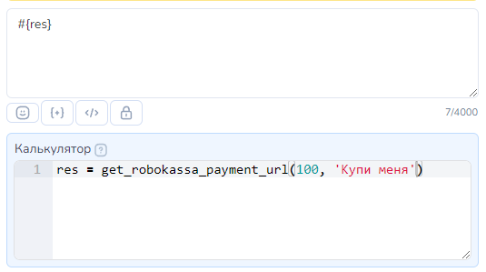
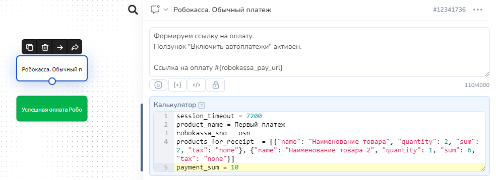
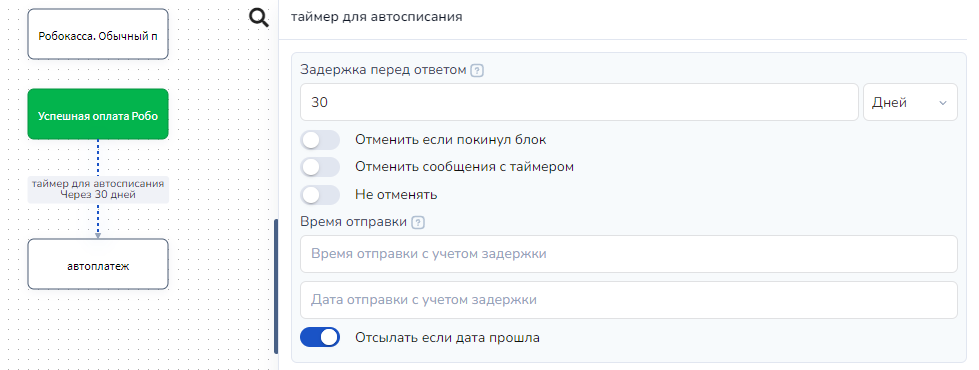
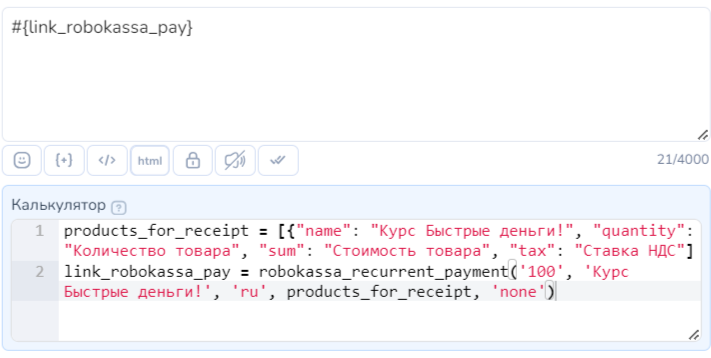
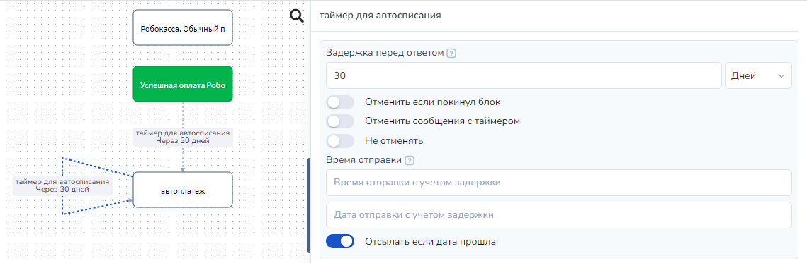
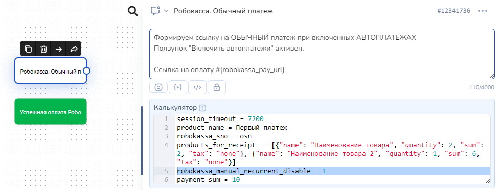

# Robokassa


Всем, **зарегистрировавшимся** [**по ссылке**](https://partner.robokassa.ru/Reg/Register?PromoCode=01spirin\&culture=ru) **(или промокоду),** предоставляются лояльные стартовые условия в виде тарифного плана «Реальный» (**2.9%**) сроком на 3 календарных месяца.

Промокод: **01spirin**



**Robokassa не работает с физическими лицами**.


* [Как настроить Robokassa](priem-platezhei-cherez-robokassu.md#kak-nastroit-robokassa)
* [Как настроить Salebot ](priem-platezhei-cherez-robokassu.md#kak-nastroit-salebot)
* [Кнопка с функцией Оплата](priem-platezhei-cherez-robokassu.md#knopka-s-funkciei-oplata)
* [Функция `get_robokassa_payment_url` в Калькуляторе](priem-platezhei-cherez-robokassu.md#funkciya-get_robokassa_payment_url-v-kalkulyatore)
* [Создание ссылки с помощью переменной payment\_sum](priem-platezhei-cherez-robokassu.md#sozdanie-ssylki-s-pomoshyu-peremennoi-payment_sum-i-dopolnitelnykh-parametrov)
* [Как сформировать чеки ](priem-platezhei-cherez-robokassu.md#cheki)
* [Какие могут быть ошибки ](priem-platezhei-cherez-robokassu.md#vozmozhnye-oshibki)
* [Как проводить автоматические платежи сервиса Robokassa ](priem-platezhei-cherez-robokassu.md#kak-provodit-avtomaticheskie-platezhi-servisa-robokassa)
* [Какие требования сервиса Robokassa к чат-ботам](priem-platezhei-cherez-robokassu.md#kakie-trebovaniya-servisa-robokassa-k-chat-botam)

## Как настроить Robokassa

Рассмотрим как реализовать прием оплат в боте через сервис Robokassa.

1. Создайте интернет-магазин в личном кабинете сервиса Robokassa и укажите данные технические настройки:

\- Алгоритм расчета хеша: MD5\
\- Result Url: https://chatter.salebot.pro/robokassa\_callback/result\
\- Метод отсылки данных по Result Url: GET\
\- Success Url: https://chatter.salebot.pro/robokassa\_callback/success\
\- Метод отсылки данных по Success Url: GET\
\- Fail Url: https://chatter.salebot.pro/robokassa\_callback/fail\
\- Метод отсылки данных по Fail Url: GET (Рисунок 1)

<figure><figcaption></figcaption></figure>

рис. 1


Создайте тестовые пароли и первоначальную настройку проводите в тестовом режиме.


## Как настроить Salebot

Зайдите в раздел "Эквайринг":&#x20;

<figure><figcaption>
Рис. 2
</figcaption></figure>

&#x20;Найдите кнопку Robokassa для подключения сервиса:

<figure><figcaption>
Рис. 3
</figcaption></figure>

и заполните форму в открывшейся форме:

<figure><figcaption>
Рис. 4
</figcaption></figure>

1. **Поле Идентификатор магазина —** Shop ID, который вы можете найти в настройках магазина в личном кабинете робокассы.
2. Пароли #1, пароль #2 — уникальные сгенерированные последовательности цифр+букв (см. рис. 1).&#x20;
3. **поле Ставка НДС.** Необходимо указать подходящий код для передачи значения НДС. Например, &#x20;

`none` - если без НДС  или&#x20;

`vat0`  -  если ставка НДС 0% .

Доступные варианты ставки НДС:

* none — без НДС
* vat0 — 0%
* vat10 — 10%
* vat20 — 20%
* vat110 — 10/110
* vat120 — 20/120
* vat5 – 8 – НДС по ставке 5%
* vat7  – 9 – НДС по ставке 7%
* vat105  – 10 – НДС чека по расчетной ставке 5/105
* vat107  – 11 – НДС чека по расчетной ставке 7/107

4. **поле Система налогообложения.** Можно выбрать систему налогообложения, которая будет передана в чеке. Необязательное поле, если у организации имеется только один тип налогообложения. (Данный параметр обязательно задается в личном кабинете магазина)

<figure><figcaption>
Рис. 5. Выбор системы налогообложения для формирования чека об оплате
</figcaption></figure>

На этом подключение закончено. Теперь давайте разберемся как использовать данный функционал.

5. **поле Доменная зона.** Доступные значения ru и kz. Ссылка будет иметь вид robokassa.ru или robokassa.kz

<figure><figcaption>
Рис. 6. Выбор доменной зоны
</figcaption></figure>

## Как сформировать ссылку на оплату


Сформировать ссылку на оплату в блоке можно **ОДНИМ ИЗ** из доступных способов:

* [Кнопка с функцией Оплата ](priem-platezhei-cherez-robokassu.md#knopka-s-funkciei-oplata)или
* [Функция get\_robokassa\_payment\_url в Калькуляторе](priem-platezhei-cherez-robokassu.md#funkciya-get_robokassa_payment_url-v-kalkulyatore) или
* [Создание ссылки с помощью переменной payment\_sum  и дополнительных параметров](priem-platezhei-cherez-robokassu.md#sozdanie-ssylki-s-pomoshyu-peremennoi-payment_sum-i-dopolnitelnykh-parametrov) (устаревшая работающая версия)


## Кнопка с функцией Оплата

Ссылку на оплату можно создавать в кнопке с функцией "Оплата". О том как создавать такую кнопку  рассказано в этой статье:&#x20;


Статья про кнопку с функцией Оплата


Рассмотрим все возможные параметры данной кнопки. О том как создавать кнопку с функцией Оплата  рассказано в этой статье:

### **Обязательные параметры кнопки Оплата для сервиса Robokassa**

Для формирования ссылки на оплату в настройках кнопки  необходимо указать  <mark style="color:green;">**обязательные параметры: Сумма  и Наименование товара.**</mark>

<figure><figcaption>
Рис. 7. Форма настройки кнопки оплаты в блоке чат-бота
</figcaption></figure>

**поле Сумма.**  В этом поле указываем стоимость товара в рублях

**поле Наименование товара.**  В этом поле можно использовать только символы английского или русского алфавита, цифры и знаки препинания. Максимальная длина — 100 символов. Эта информация отображается в интерфейсе Robokassa и в Электронной квитанции, которую получает клиент после успешного платежа.&#x20;


**НЕЛЬЗЯ** использовать **двойные кавычки** в наименовании товара: удалите или замените на одинарные кавычки.&#x20;


**чекбокс Автоплатеж.** Для подключения автоплатежа&#x20;

**чекбокс С уведомление о клике.** Для отслеживания перехода по ссылке для оплаты можно поставить галочку. В таком случае, при клике по кнопке в диалог с клиентом в Сейлбот придет уведомление о том, что был совершен переход по ссылке

На данное уведомление можно настраивать дальнейшую логику работы бота.


Многие платежные системы поддерживают облачные онлайн-кассы, они необходимы по 54-ФЗ.\
Прочитайте особенности оформления чеков на сайте выбранной платежной системы, чтобы не попасть в неловкую ситуацию с налоговой инспекцией.


### **Для формирования чека**

**меню Данные для формирования чека.** При клике откроется выпадающее меню с параметрами для формирования чека:

<figure><figcaption>
Рис. 8. меню "Данные для формирования чека" 
</figcaption></figure>

**поле Название товара**. <mark style="color:red;">**Обязательное для формирования чека.**</mark>&#x20;


**НЕЛЬЗЯ** использовать **двойные кавычки** в Названии товара: удалите или замените на одинарные кавычки.&#x20;


**поле Полная сумма в рублях.** В данном поле необходимо указать сумму к оплате с учетом  количества товаров. Если количество равно 1, то Полная сумма в рублях равна значению в поле Сумма в обязательном поле настройки кнопки

**поле Количество.** Количество или вес товара. Передать можно целое или дробное число через точку. Пример, 5 или 10.3

### Переменные клиента, которые будут созданы автоматически при использовании кнопки с функцией Оплата

Как только пользователь получит блок с кнопкой "Оплата" автоматически будут созданы переменные клиента:

<figure><figcaption>
Рис. 9. переменная payments
</figcaption></figure>

Служебная переменная клиента **`__payments`** , которая хранит сумму, идентификатор созданной ссылки, нужна для идентификации хука от платежной системы.


Служебную переменную клиента \_\_payments НЕЛЬЗЯ удалять или изменять!


Переменная клиента **`error_payment_button`** создается, если при формировании кнопки возникла ошибка.

В значение переменной error\_payment\_button запишется либо текст ошибки, либо ответ платежной системы с ошибкой.


Значение переменных становятся актуальными при переходе в следующий блок&#x20;


### Как обработать результат


Обращаем внимание!

Robokassa отсылает уведомление только по успешным транзакциям по параметру Result URL. <mark style="color:red;">**Коллбэков о неуспешных платежах в сервисе Robokassa нет.**</mark>&#x20;

Fail URL - это только страница неуспешной оплаты, куда будет переадресован плательщик в случае возникновения кодовой ошибки на платежной странице.&#x20;


**Успешный платеж.**

После того, как вы верно настроите оплату и сформируете ссылку для проведения платежа, протестируйте созданные настройки. Если оплата пройдет успешно, то в диалог клиента (раздел "Клиенты") <mark style="color:orange;">**АВТОМАТИЧЕСКИ**</mark> придет КОЛЛБЭК, который состоит из 10 символов секретного ключа платежной системы, слова \_success и через пробел сумма платежа. **Коллбэк генерируется автоматически**, его не надо составлять самим или запрашивать в поддержке платежной системы,

<figure><figcaption>
Рис. 10. Блок "Стартовое условие" с кнопкой оплаты
</figcaption></figure>

<figure><figcaption>
Рис. 11. Настройка кнопки
</figcaption></figure>

Например: `ovg58keefc_success 2999`, где:&#x20;

ovg58keefc : 10 символов секретного ключа платежной системы

\_success : результат обработки запроса (успешный платеж)

2999 : сумма платежа

Отработка блока:

<figure><figcaption>
Рис. 12. Диалог с клиентом
</figcaption></figure>

Колбек:

<figure><figcaption>
Рис. 13. Колбек
</figcaption></figure>


Коллбэки (уведомления) от платежной системы пользователь НЕ ВИДИТ. Они отображаются только во вкладке "Клиенты" и видны оператору/администратору.


### Пример настройки реакции на коллбэк

В  блоке с условием (это может быть как блок "Стартовое условие", так и блок "Не состояние с условием") необходимо указать коллбэк, который приходит при оплате.&#x20;


Важно: выбор соответствия Полное совпадение  или По наличию ключевых слов


<figure><figcaption>
Рис. 14. Реакция на колбек с помощью блока "Стартовое условие"
</figcaption></figure>

Далее при оплате клиенту будет приходить сообщение из блока, в котором настроена реакция на коллбэк:

<figure><figcaption>
Рис. 15. Диалог с клиентом
</figcaption></figure>

**Платеж с ошибкой**

Если сумма указанная в настройках кнопки <mark style="color:blue;">**отличается от суммы, которую клиент оплатил**</mark>,  в бота <mark style="color:orange;">**АВТОМАТИЧЕСКИ**</mark> придет КОЛЛБЭК, который состоит из 10 символов секретного ключа платежной системы, слова \_different\_amounts и через пробел уникальный ID платежа

Например: `ovg58keefc_different_amounts 123456` , где:&#x20;

`ovg58keefc` : 10 символов секретного ключа платежной системы

`_different_amounts` : результат обработки запроса (сумма оплаты отличается от суммы в ссылке)

`123456` : уникальный ID платежа

## Функция get\_robokassa\_payment\_url в Калькуляторе

Для формирования ссылки на оплату можно воспользоваться функцией `get_robokassa_payment_url` в Калькуляторе блоке.

В поле Калькулятор  переменной присвоим значение функции `get_robokassa_payment_url`&#x20;


Название переменной задаете самостоятельно.  На скринах примеры названия переменных.&#x20;


В эту переменную запишется ссылка на оплату. Переменную можно вывести на экран ссылкой в сообщении или разместить в кнопке с текстом "Оплатить".&#x20;

**ПРИМЕР ссылки на оплату:**: `https://auth.robokassa.ru/Merchant/Index.aspx?MerchantLogin=test_salebot&OutSum=800&InvId=1412&IsTest=1&SignatureValue=0427369c3bd068bae30935f896060dda`


Многие платежные системы поддерживают облачные онлайн-кассы, они необходимы по 54-ФЗ.\
Прочитайте особенности оформления чеков на сайте выбранной платежной системы, чтобы не попасть в неловкую ситуацию с налоговой инспекцией.




Пример 1:&#x20;

<figure><figcaption>
Рис. 16. Пример формирования ссылки: переданы только обязательные параметры
</figcaption></figure>



`get_robokassa_payment_url(amount, description, products_for_receipt, taxation, recurrent, country, currency)`

#### Параметры функции:

<table><thead><tr><th width="190">Параметр</th><th>Значение параметра</th></tr></thead><tbody><tr><td><strong><code>amount</code></strong></td><td>
<mark style="background-color:blue;">Сумма к оплате.</mark>  В этом поле указываем стоимость товара в рублях. 

<strong>(Обязательный параметр)</strong>
</td></tr><tr><td><strong><code>description</code></strong></td><td><mark style="background-color:blue;">Наименование товара.</mark>  В этом поле можно использовать только символы английского или русского алфавита, цифры и знаки препинания. Максимальная длина — 100 символов. Эта информация отображается в интерфейсе Robokassa и в Электронной квитанции, которую получает клиент после успешного платежа.  <strong>(Обязательный параметр)</strong></td></tr><tr><td>
<strong><code>products_for_</code></strong>

<strong><code>receipt</code></strong>
</td><td>
<mark style="background-color:blue;">Параметры для формирования чеков.</mark> 

Подробнее читайте <a href="priem-platezhei-cherez-robokassu.md#dlya-funkcii-get_robokassa_payment_url-i-robokassa_recurrent_payment">здесь.</a> 
</td></tr><tr><td><code>taxation</code></td><td>
<mark style="background-color:blue;">Система налогообложения.</mark>  

Подробнее читайте <a href="priem-platezhei-cherez-robokassu.md#dlya-funkcii-get_robokassa_payment_url-i-robokassa_recurrent_payment">здесь.</a> 
</td></tr><tr><td><strong><code>recurrent</code></strong></td><td><mark style="background-color:blue;">Подключение автоплатежа.</mark> Если автоплатеж включен, то передать значение 1, если отключен передайте значение None</td></tr><tr><td><strong><code>country</code></strong></td><td><mark style="background-color:blue;">Доменная зона.</mark> Если пропустить значение или передать значение None, то по умолчанию доменная зона будет .ru Ссылка будет иметь вид robokassa.ru.  Для Казахстана можно передать значение 'kz' . В этом случае ссылка будет иметь вид robokassa.kz</td></tr><tr><td><strong><code>currency</code></strong></td><td>
<mark style="background-color:blue;">Трехбуквенный код валюты.</mark>

Необходимо передавать значение строго по параметрам, принимаемым сервисом Robokassa. USD - доллар; RUB - рубль; EUR - евро; KZT - тенге.
</td></tr></tbody></table>



<mark style="color:green;">Пример 1: Ссылка на оплату без чека</mark>\
\
`res = get_robokassa_payment_url(100, 'Купи меня')`

<mark style="color:green;">Пример 2: Ссылка на оплату с чеком</mark>\
\
`receipt = [{"name":"DDDDDDDD","amount":"44","quantity":"1","vat_code":"5","method":"full_payment","object":"commodity"}]`

`res = get_robokassa_payment_url(100, 'Купи меня', receipt, '3', 1, 1)`




Переменную можно вывести на экран ссылкой в сообщении или разместить в кнопке с текстом, например, "Купить".&#x20;



Если в блоке несколько функций для получения ссылки и допущена ошибка, то значение ошибки будет записано в переменной  **`error_payment_func`**

\
Ошибка запишется по последней функции в Калькуляторе


После того, как вы верно настроите оплату и сформируете ссылку для проведения платежа, протестируйте созданные настройки.&#x20;

## Как добавить описание платежа

Вы можете добавить описание к платежу, установив переменную **payment\_description**

<figure><figcaption></figcaption></figure>

Это описание будет отображаться в форме оплаты, а также на чеке.

### Как обработать результат

Если оплата пройдет успешно, то в диалог клиента (раздел "Клиенты") <mark style="color:orange;">**АВТОМАТИЧЕСКИ**</mark> придет КОЛЛБЭК, который состоит из 10 символов секретного ключа платежной системы, слова \_success и через пробел сумма платежа. **Коллбэк генерируется автоматически**, его не надо составлять самим или запрашивать в поддержке платежной системы,&#x20;

Например: `ovg58keefc_success 1500`, где:&#x20;

ovg58keefc : 10 символов секретного ключа платежной системы

\_success : результат обработки запроса (успешный платеж)

1500 : сумма платежа


Обращаем внимание!&#x20;

Колбек виден только вам в диалоге с клиентом.&#x20;

Клиенту колбек не виден, но вы можете настроить реакцию на успешную обработку платежа.


### Пример

Настройки блока с функцией `get_robokassa_payment_url:`

1. Если выдаете ссылку в тексте:

<figure><figcaption>
Рис. 17. настройка блока "Стартовое условие" с ссылкой на оплату
</figcaption></figure>

Отработка блока:

<figure><figcaption>
Рис. 18. Пример ссылки на оплату, отправляемой ботом. 
</figcaption></figure>


Важно!&#x20;

Ссылка на оплату является уникальной: ее нельзя скопировать и потом направлять другим клиентам!&#x20;

Направляйте ссылку на оплату через переменную в боте (см. рис. 17).&#x20;


Коллбэк при успешной оплате:

<figure><figcaption>
Рис. 19. Колбек об успешной оплате
</figcaption></figure>

2. Ссылка в кнопке:

<figure><figcaption>
Рис. 20. Кнопка с ссылкой на оплату
</figcaption></figure>

Отработка блока:

<figure><figcaption>
Рис. 21. Пример отправки кнопки с ссылкой на оплату
</figcaption></figure>

Коллбэк при успешной оплате:

<figure><figcaption>
Рис. 22. Колбек об успешной оплате в диалоге с клиентом
</figcaption></figure>

## Создание ссылки с помощью переменной payment\_sum  и дополнительных параметров

Принимать оплату вы также можете генерируя ссылку с помощью переменной payment\_sum, в которой достаточно указать сумму платежа.&#x20;


**Обратите внимание:** переменной **payment\_sum** присваивается значение последней, после необязательных переменных **payment\_description, product\_name** и т.д.&#x20;


Для генерации ссылки на оплату, вам необходимо установить значение переменной **payment\_sum**, сразу после этого появится переменная **robokassa\_pay\_url.** Эту переменную можно вывести на экран ссылкой или разместить на кнопке с текстом "Оплатить".&#x20;

<figure><figcaption>
Рис. 23.  Пример настройки блока "Стартовое условие"
</figcaption></figure>

**ПРИМЕР отработки блоки (ссылки на оплату):**

<figure><figcaption>
Рис. 24. Пример ссылки в боте.
</figcaption></figure>


Важно!&#x20;

Ссылка на оплату является уникальной: ее нельзя скопировать и потом направлять другим клиентам!&#x20;

Направляйте ссылку на оплату через переменную в боте (см. рис. 23).&#x20;


Чтобы передавать ссылку в кнопке, укажите переменную в кнопке в поле url:

<figure><figcaption>
Рис. 24. Пример настройки кнопки
</figcaption></figure>

### Результат оплаты при формировании ссылки на оплату через payment\_sum

После успешной оплаты в бот придет коллбэк. Этот коллбэк в системе вы видите как сообщение от пользователя, чтобы их не мог отправить пользователь, они состоят из первого пароля от сервиса Robokassa и приписки со статусом success, например: **qxgZ7zkNX4HHnG8UpZ61\_success.**

<figure><figcaption>
Рис. 25. Пример колбека об успешной оплате
</figcaption></figure>

Также после успешной оплаты переменная **robokassa\_payment\_completed** устанавливается в **True.**

Этот коллбэк **НЕ ВИДИТ** пользователь, они отображаются только оператору


Тип сравнения должен быть "**Полное совпадение**"



Для совершения повторного платежа обязательно необходимо обнулить **payment\_sum**, ранее сформированную ссылку и уже после переназначить переменную payment\_sum для получения свежей ссылки\
\
Пример обнуления переменных: \
robokassa\_pay\_url=''\
payment\_sum=0


После завершения оплаты клиенту добавится переменная **robokassa\_callback\_data**, содержащая данные ответа платежной системы по совершенной операции. Из полученного словаря можно извлечь необходимые данные при помощи метода **get**.

## Как создать тестовую схему

Пример схемы, которая позволит протестировать и быстро начать работу с сервисом Robokassa:

<figure><figcaption>
Рис. 26. Настройка блока "Стартовое условие"
</figcaption></figure>

На рисунке показан пример первого блока, в котором пользователя спрашивают, сколько он хочет оплатит&#x44C;**.**

На рисунке ниже настройки стрелки, в ней должен быть включен переключатель "Пользователь вводит данные" и в поле вписана переменная **payment\_sum:**

<figure><figcaption>
Рис. 27. Настройки стрелки
</figcaption></figure>

Далее в следующем блоке оплаты добавьте кнопку и установите в строку url переменную **robokassa\_pay\_url:**

<figure><figcaption>
Рис. 28. Настройки блока с кнопкой оплаты
</figcaption></figure>

<figure><figcaption>
Рис. 29. Настройка кнопки
</figcaption></figure>

Схема отработает следующим образом:

<figure><figcaption>
Рис. 30. Пример отработки блоков
</figcaption></figure>

При клике на кнопку сумма, которую прописал клиент, будет доступна к оплате в платежной форме:

<figure><figcaption>
Рис. 31. Форма оплаты
</figcaption></figure>

После оплаты придет коллбэк, на который также можно настроить реакцию.&#x20;

<figure><figcaption>
Рис. 32. Отправка колбека об успешной оплате
</figcaption></figure>


Важно!&#x20;

Колбека о неуспешной оплате в Robokassa не существует.


Для этого добавьте еще один блок с условием, а в строке с условием пропишите коллбэк вида "**qxgZ7zkNX4HHnG8UpZ61\_success":**

<figure><figcaption>
Рис. 33. Пример настройки блока "Не состояние с условием" для реакции на успешную оплату
</figcaption></figure>


Тип проверки обязательно поставьте "Полное совпадение"


Схема будет отрабатывать следующим образом:

<figure><figcaption>
Рис. 34. Как работает схема
</figcaption></figure>

### Видеоурок



## Как сформировать запрос на фискализацию

### В кнопке с функцией “Оплата”

При создании кнопки в выпадающем меню “Данные для формирования чека”, заполните поля “Название товара”, “Полная сумма в рублях”, “Количество”, “Ставка НДС”, “Система налогообложения”.

<figure><figcaption>
Рис. 35. Данные для формирования чека
</figcaption></figure>

Подробнее в разделе "[Для формирования чека](priem-platezhei-cherez-robokassu.md#dlya-formirovaniya-cheka)".

### С помощью переменной payment\_sum

Так как генерация ссылки производится в момент, когда вы установили значение переменной payment\_sum, вам необходимо задать переменные products\_for\_receipt и robokassa\_sno.


Важно:&#x20;

* при формировании ссылки через переменную payment\_sum, система налогообложения задаётся в переменной robokassa\_sno.
* payment\_sum должна быть равна общей стоимости всех товаров (сумма всех параметров sum).


Пример:

session\_timeout = 7200

product\_name = Первый платеж

robokassa\_sno = osn

products\_for\_receipt = \[{"name": "Наименование товара", "quantity": 2, "sum": 2, "tax": "none"}, {"name": "Наименование товара 2", "quantity": 1, "sum": 6, "tax": "none"}]

payment\_sum = 10

### Для функций get\_robokassa\_payment\_url и robokassa\_recurrent\_payment

При вызове функций **get\_robokassa\_payment\_url** или функции **robokassa\_recurrent\_payment** передайте в качестве аргументов переменные **taxation** и **products\_for\_receipt** согласно описанию ниж&#x435;**.**

Функции подготовят ссылку с учётом товарной номенклатуры и сформируют запрос на фискализацию.


Важно:

Переменные **taxation** и **products\_for\_receipt** должны задаваться для каждого отдельного платежа.

Сервис Robokassa не хранит данные параметры и не сможет провести фискализацию платежей, для которых не была передана номенклатура.


1. **products\_for\_receipt** - массив, содержащий товарную номенклатуру.&#x20;

Каждая единица товара должна быть представлена в виде словаря, содержащего параметры **name, quantity, sum, tax, payment\_method, payment\_object и nomenclature\_code**.

\
&#x20;<mark style="color:red;">**!**</mark>**&#x20;products\_for\_receipt** нужно указать в следующем формате:

\[

{"name": "Наименование товара", "quantity": "Количество товара", "sum": "Стоимость товара", "tax": "Ставка НДС"},

{"name": "Наименование товара 2", "quantity": "Количество товара 2", "sum": "Стоимость товара", "tax": "Ставка НДС"}

]

где,&#x20;

1\) **name** - наименование товара. Если в наименовании товара вы используете специальные символы, например кавычки, то их обязательно необходимо экранировать.

2\) **quantity** - количество или вес товара (целое или дробное число через точку)

3\) **sum** или **amount** (_обязательный, два варианта имени_) - полная сумма в рублях за все количество данного товара с учетом всех возможных скидок, бонусов и специальных цен.

4\) **tax** или **vat\_code** - (обязательный, два варианта имени, значение зависит от имени) - ставка НДС. Этот параметр устанавливает налоговую ставку в ККТ.



<table data-full-width="true"><thead><tr><th width="272"> Значение</th><th>Описание</th></tr></thead><tbody><tr><td>none</td><td>без НДС</td></tr><tr><td>vat0</td><td>0%</td></tr><tr><td>vat10</td><td>10%</td></tr><tr><td>vat20 </td><td>20%</td></tr><tr><td>vat110</td><td>10/110</td></tr><tr><td>vat120</td><td>20/120</td></tr><tr><td>vat5 </td><td>5%</td></tr><tr><td>vat7 </td><td>7%</td></tr><tr><td>vat105</td><td>5/105</td></tr><tr><td>vat107 </td><td>7/107</td></tr></tbody></table>



<table><thead><tr><th width="209">Значения</th><th> Описание</th></tr></thead><tbody><tr><td>'1' </td><td>Без НДС</td></tr><tr><td>'2' </td><td>НДС по ставке 0%</td></tr><tr><td>'3'</td><td> НДС по ставке 10%</td></tr><tr><td>'4'</td><td> НДС чека по ставке 20%</td></tr><tr><td>'5' </td><td>НДС чека по расчетной ставке 10/110</td></tr><tr><td>'6' </td><td>НДС чека по расчетной ставке 20/120</td></tr><tr><td>'8'</td><td>НДС по ставке 5%</td></tr><tr><td>'9'</td><td>НДС по ставке 7%</td></tr><tr><td>'10' </td><td>НДС чека по расчетной ставке 5/105</td></tr><tr><td>'11'</td><td> НДС чека по расчетной ставке 7/107</td></tr></tbody></table>



5\) **method** или **payment\_method** - (два варианта имени, необязательный параметр) признак способа расчёта.&#x20;

<table><thead><tr><th width="345" align="center">Возможные значения параметра:</th><th>Что подразумевает значение: </th></tr></thead><tbody><tr><td align="center">full_prepayment</td><td>предоплата 100%. Полная предварительная оплата до момента передачи предмета расчёта</td></tr><tr><td align="center">prepayment</td><td>предоплата. Частичная предварительная оплата до момента передачи предмета расчёта</td></tr><tr><td align="center">advance</td><td>аванс</td></tr><tr><td align="center">full_payment </td><td>полный расчёт. Полная оплата, в том числе с учетом аванса (предварительной оплаты) в момент передачи предмета расчёта;</td></tr><tr><td align="center">partial_payment </td><td>частичный расчёт и кредит. Частичная оплата предмета расчёта в момент его передачи с последующей оплатой в кредит;</td></tr><tr><td align="center">credit </td><td>передача в кредит. Передача предмета расчёта без его оплаты в момент его передачи с последующей оплатой в кредит;</td></tr><tr><td align="center">credit_payment</td><td>оплата кредита. Оплата предмета расчёта после его передачи с оплатой в кредит (оплата кредита).</td></tr></tbody></table>

6\) **object** или **payment\_object** - (два варианта имени, необязательный параметр) предмет расчета (если не передать, будет commodity (товар))

<table><thead><tr><th width="328" align="center">Возможные значения параметра</th><th>Что подразумевает значение</th></tr></thead><tbody><tr><td align="center"><strong>commodity</strong></td><td>Товар. О реализуемом товаре, за исключением подакцизного товара (наименование и иные сведения, описывающие товар)</td></tr><tr><td align="center"><strong>excise</strong> </td><td>Подакцизный товар. О реализуемом подакцизном товаре (наименование и иные сведения, описывающие товар)</td></tr><tr><td align="center"><strong>job</strong></td><td>Работа. О выполняемой работе (наименование и иные сведения, описывающие работу)</td></tr><tr><td align="center"><strong>service</strong></td><td>Услуга. Об оказываемой услуге (наименование и иные сведения, описывающие услугу)</td></tr><tr><td align="center"><strong>gambling_bet</strong></td><td>Ставка азартной игры. О приеме ставок при осуществлении деятельности по проведению азартных игр</td></tr><tr><td align="center"><strong>gambling_prize</strong></td><td>выигрыш азартной игры. О выплате денежных средств в виде выигрыша при осуществлении деятельности по проведению азартных игр</td></tr><tr><td align="center"><strong>lottery</strong></td><td>лотерейный билет. О приеме денежных средств при реализации лотерейных билетов, электронных лотерейных билетов, приеме лотерейных ставок при осуществлении деятельности по проведению лотерей</td></tr><tr><td align="center"><strong>lottery_prize</strong></td><td>выигрыш лотереи. О выплате денежных средств в виде выигрыша при осуществлении деятельности по проведению лотерей</td></tr><tr><td align="center"><strong>intellectual_activity</strong> </td><td>предоставление результатов интеллектуальной деятельности. О предоставлении прав на использование результатов интеллектуальной деятельности или средств индивидуализации</td></tr><tr><td align="center"><strong>payment</strong></td><td>платеж. Об авансе, задатке, предоплате, кредите, взносе в счет оплаты, пени, штрафе, вознаграждении, бонусе и ином аналогичном предмете расчета</td></tr><tr><td align="center"><strong>agent_commission</strong> </td><td>агентское вознаграждение. О вознаграждении пользователя, являющегося платежным агентом (субагентом), банковским платежным агентом (субагентом), комиссионером, поверенным или иным агентом;</td></tr><tr><td align="center"><strong>composite</strong></td><td>составной предмет расчета. О предмете расчета, состоящем из предметов, каждому из которых может быть присвоено значение выше перечисленных признаков</td></tr><tr><td align="center"><strong>another</strong></td><td>иной предмет расчета. О предмете расчета, не относящемуся к выше перечисленным предметам расчета</td></tr><tr><td align="center"><strong>property_right</strong></td><td>имущественное право</td></tr><tr><td align="center"><strong>non-operating_gain</strong></td><td>внереализационный доход</td></tr><tr><td align="center"><strong>insurance_premium</strong></td><td>страховые взносы</td></tr><tr><td align="center"><strong>sales_tax</strong></td><td>торговый сбор</td></tr><tr><td align="center"><strong>resort_fee</strong></td><td>курортный сбор</td></tr></tbody></table>

7\) **nomenclature\_code** - (условно обязательный) маркировка товара: передаётся в том виде, как она напечатана на упаковке товара.&#x20;


Параметр является обязательным только для тех магазинов, которые продают товары, подлежащие обязательной маркировке.&#x20;

Код маркировки расположен на упаковке товара, рядом со штрих-кодом или в виде QR-кода.


2. **taxation** — система налогообложения, которую использует магазин. Необязательное поле, если у организации имеется только один тип налогообложения. Может принимать строковые и численные значения:&#x20;

| Строковые значения                                               | Численные значения                            |
| ---------------------------------------------------------------- | --------------------------------------------- |
| **osn** – общая СН                                               | '1' - Общая система налогообложения           |
| **usn\_income** – упрощенная СН (доходы);                        | '2' - Упрощенная (УСН, доходы)                |
| **usn\_income\_outcome** – упрощенная СН (доходы минус расходы); | '3' - Упрощенная (УСН, доходы минус расходы)  |
| **esn** – единый сельскохозяйственный налог;                     | '5' - Единый сельскохозяйственный налог (ЕСН) |
| **patent** – патентная СН.                                       | '6' - Патентная система налогообложения       |


Важно! Для фискализации важно передать параметры чека.&#x20;

Верный формат чека передается таким образом:

rec = \[{"name": "Пакет 1 месяц", "quantity": 1, "sum": 4800, "tax": "none"}]

response = robokassa\_recurrent\_payment(4800, 'Обучение в Лётной школе Авиатор', 'ru', rec, 'osn')

где необходимо подставить свои данные.&#x20;


## Формирование чека при приеме оплаты в Курсах на странице курса

Нужно выбрать в разделе "Оплата" в настройках курса платежную систему Robokassa:

<figure><figcaption>
Рис. 36. Выбор платежной системы в разделе "Оплата" в настройках курса
</figcaption></figure>

Заполните в разделе "Эквайринг" в настройках платежной системы (если не сделали это ранее) поля "Ставка НДС" и "Система налогообложения":

<figure><figcaption></figcaption></figure>

## Какие могут быть ошибки

#### Код ошибки 40

«Повторная оплата счета с тем же номером невозможна».

После успешного платежа необходимо перевести диалог в блок "Конец сбора данных", чтобы сформировался новый номер платежа.

#### Код ошибки 34

«Услуга рекуррентных платежей не разрешена магазину».

#### Код ошибки 31

«Неверная сумма платежа».

Такая ошибка может возникнуть при переадресации клиента на платежную страницу для выставления счета. Она означает, что вы не передаете нам сумму, на которую необходимо провести платеж, либо передаете сумму, равную нулю.

#### Код ошибки 29

«Неверный параметрSignature»

Здесь причин может быть несколько, но все они связаны со скриптом, отвечающим за инициализацию оплаты (а конкретнее, его часть, которая формирует параметрSignatureпо формуле, состоящей из переменных). Эта ошибка встречается довольно часто, и вот 3 возможных причины:

* **Первая:** некорректный Идентификатор магазина (MerchantLogin);
* **Вторая:** неверный Пароль 1 (MerchantPass1);
* **Третья:** вы используете дополнительные параметры (sh&#x70;**\_**), которые добавлены в программный код кассы, но не занесены в формулу подсчета - или наоборот, в формуле подсчета они указаны, а в коде нет. Если таковые используются, передавайте их в алфавитном порядке – как в параметрах на оплату, так и в формуле подсчета Signature.

Важный момент! Если вы работаете в тестовом режиме, передавая параметр IsTest=1 или включая его галочкой в настройках модуля/бота, используйте только тестовую пару технических паролей (закладка «Технические настройки» карточки вашего магазина).

#### Код ошибки 23

«Тестовый платёж не может быть создан. У магазина отсутствуют настройки тестовых параметров».

Это значит, что перед проведением тестового платежа вы не заполнили все необходимые данные в блоке «Параметры проведения тестовых платежей» закладки «Технические настройки».

#### Код ошибки 25

«Магазин не активирован».

Эта ошибка встречается нередко, и здесь могут быть 2 причины.

* **Первая:** это действительно так – и необходимо активировать магазин, а лишь потом выставлять счет.
* **Вторая:** вы неверно указали Идентификатор магазина в технических настройках на сайте. Посмотреть правильный можно в разделе «Мои магазины» Личного кабинета. Перейдите в закладку «Технические настройки» и найдите поле «Идентификатор магазина». Скопируйте идентификатор и введите его в настройках сайта.

## **Как проводить автоматические платежи сервиса Robokassa**

Пошаговая инструкция подключения автоплатежей для сервиса **Robokassa**

**Шаг 1. Включить автоплатежи в кнопке оплаты**

Перейдите в настройки блока, в котором даете ссылку на оплату и перейдите в настройки кнопки:

<figure><figcaption></figcaption></figure>

Далее в настройках кнопки найдите чекбокс "Автоплатежи" и активируйте его:

<figure><figcaption></figcaption></figure>

Если вы хотите принимать автоплатежи во всех кнопках на оплату, то включить автоплатежи можно в настройках подключения платежной системы:

<figure><figcaption></figcaption></figure>

**Шаг 2. Провести обычный платёж.**\
\
Далее нужно провести обычный платеж (получить ссылку на оплату и чтоб клиент ее оплатил), как описано выше. После успешного платежа у клиента появится переменная **robokassa\_previous\_invoice\_id** с идентификатором платежа.


Переменная **robokassa\_previous\_invoice\_id** обязательна для последующих платежей.\
\
Если ее удалить, следующий автоплатеж провести НЕ получится.



Обращаем внимание!&#x20;

<mark style="color:red;">**Отключите**</mark> чекбокс "**Платежи в тестовом режиме**" (если он у вас активный), иначе переменная robokassa\_previous\_invoice\_id с идентификатором платежа не будет сформирована!&#x20;

.png>)


<figure><figcaption>
Пример формирования ссылки для обычного платежа
</figcaption></figure>

**Шаг 3. Планируем автосписание**

От блока Успешная оплата планируем стрелку с таймером к блоку с автоплатежом. Для примера запланируем следующий платеж через 30 дней.&#x20;

<figure><figcaption></figcaption></figure>

Чтобы прошёл автоплатеж в нужном блоке в поле Калькулятор, нужно добавить вызов функции **robokassa\_recurrent\_payment**, передав в неё параметры в указанном порядке:&#x20;

1. **payment\_amount** - сумма к оплате (стоимость товара в рублях)
2. **description** - наименование товара. В этом поле можно использовать только символы английского или русского алфавита, цифры и знаки препинания. Максимальная длина — 100 символов. Эта информация отображается в интерфейсе Robokassa и в Электронной квитанции, которую получает клиент после успешного платежа.&#x20;
3. **country** - доменная зона (‘ru’ или ‘kz’)
4. **products\_for\_receipt** - параметры для формирования чеков.


Подробнее в разделе "Как сформировать запрос на фискализацию -> [Для функций get\_robokassa\_payment\_url и robokassa\_recurrent\_payment](priem-platezhei-cherez-robokassu.md#dlya-funkcii-get_robokassa_payment_url-i-robokassa_recurrent_payment)


5. **taxation** - система налогообложения.&#x20;


Подробнее в разделе "Как сформировать запрос на фискализацию -> [Для функций get\_robokassa\_payment\_url и robokassa\_recurrent\_payment](priem-platezhei-cherez-robokassu.md#dlya-funkcii-get_robokassa_payment_url-i-robokassa_recurrent_payment)


Пример запроса на автоплатеж:

<figure><figcaption></figcaption></figure>


При выполнении автоплатежа не должно быть ссылки на оплату робокассы и переменной **payment\_sum**!


_<mark style="color:blue;">Шаг 4. Планируем регулярные списания и настраиваем возможность отказаться от автоплатежей.</mark>_\
\
Для регулярного повтора платежей планируем  петлю - стрелку с задержкой, например, 30 дней.

<figure><figcaption>
Петля - повторный переход в блок Автоплатёж
</figcaption></figure>

Если у вас предусмотрена возможность отмены автоплатежей, то для того, чтобы следующий платеж не был выполнен необходимо удалить у клиента  переменную `robokassa_previous_invoice_id`\
\
Для этого в поле Калькулятор удаляем переменную:\
\
`robokassa_previous_invoice_id = ""`

<figure><figcaption></figcaption></figure>

### Обычный платеж при включенных автоплатежах

Если включены автоплатежи, но нужна ссылка без подписки (без автоплатежей), то до формирования ссылки нужно задать переменную robokassa\_manual\_recurrent\_disable со значением 1\
\
В поле Калькулятор объявим переменную:\
`robokassa_manual_recurrent_disable = 1`

<figure><figcaption>
Настройки блока для формирования ссылки на обычный платеж при включенных Автоплатежах
</figcaption></figure>


Внимание!&#x20;

Коллбэк при автоплатежах идентичен коллбэку, который приходит при успешных оплатах.&#x20;

Как настроить реакцию на коллбэк, рассказали в разделе "[Как обработать результат](priem-platezhei-cherez-robokassu.md#kak-obrabotat-rezultat)"


## Какие требования сервиса Robokassa к чат-ботам

Официальный ответ сервиса Robokassa:

> Вы можете разместить товар на маркете с описанием и ценником и принимать оплату в боте, можете сделать одностраничник с описанием, ценником, контактными данными и указанием, что доставка товара/оказания услуги электронное. У нас должна быть привязка к товару на маркете или к сайту, т.к. что Вы продаете продает в своем боте и в каком боте мы - мы не можем знать.
>
> Ссылку на телеграммы канал в качестве URL мы не включаем. Также требования к наполнению сайта: "Сайт должен быть функционирующий, с заполненным контентом, работающими внутренними ссылками.
>
> Товары и услуги на Вашем сайте должны быть подробно описаны: Описание должно включать характеристики предлагаемых товаров и услуг, их потребительские свойства и актуальную цену.
>
> На Вашем сайте обязательно должна быть размещена актуальная информация: телефон, e-mail, правила оформления и сроки исполнения заказа, условия его оплаты, доставки и возврата.
>
> Каждый сайт рассматривается индивидуально.
>
> С уважением, ROBOKASSA.

<figure><figcaption>
Robokassa рекомендует
</figcaption></figure>

## Robokassa в Telegram

### Подключение платежей в Telegram

Данный раздел рассмотрен [тут](/broken/pages/AVtgHBpL7JDi1oD1BMZn)

### Подключение тестового бота RobokassaPaymentTestBot.

1. При выборе Connect Robokassa Test пользователь переходит в бота RobokassaPaymentTestBot.
2. Пользователь нажимает кнопку /начать.
3. Пользователь получает ответ от бота «Введите ID магазина”.
4. Необходимо ввести id от магазина в сервисе Robokassa.
5. Бот попросит подтверждение, подтверждающее владение магазином посредством отправки смс на номер, указанный в магазине: «Отправлена СМС на номер \*%%%%» где %%%% - последние 4 цифры телефона
6. Пользователь вводит 6-значный код.
7. Если все успешно то пользователю покажется сообщение: “Вы успешно подключили бота @BotName к Robokassa. @BotFather сообщит Вам новый токен.”
8. После этого в BotFather появляется платежный токен, к которому подключаются платежи.

### Подключение live- бота RobokassaPaymentBot.

1. При выборе Connect Robokassa Live пользователь переходит в бота RobokassaPaymentBot,
2. Пользователь нажимает кнопку /начать.
3. Пользователь получает ответ от бота «Введите ID магазина”.
4. Необходимо ввести id от магазина в сервисе Robokassa.
5. Бот попросит подтверждение, подтверждающее владение магазином посредством отправки смс на номер, указанный в магазине: «Отправлена СМС на номер \*%%%%», где %%%% - последние 4 цифры телефона
6. Пользователь вводит 6-значный код.
7. Если все успешно то пользователю покажется сообщение: “Вы успешно подключили бота @BotName к Robokassa. @BotFather сообщит Вам новый токен.”
8. После этого в BotFather появляется платежный токен, к которому подключаются платежи.

Обработка результатов оплаты аналогична описанному [тут](priem-platezhei-cherez-robokassu.md#kak-poluchit-uvedomlenie-o-rezultate-oplaty)
