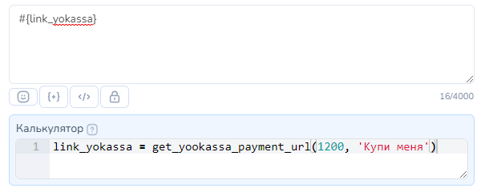
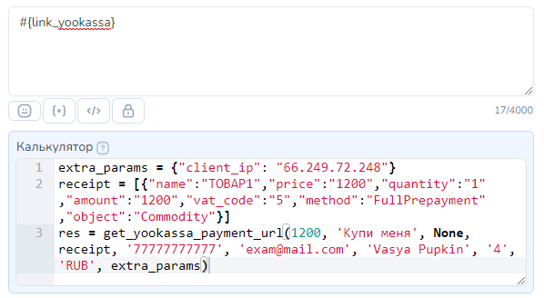
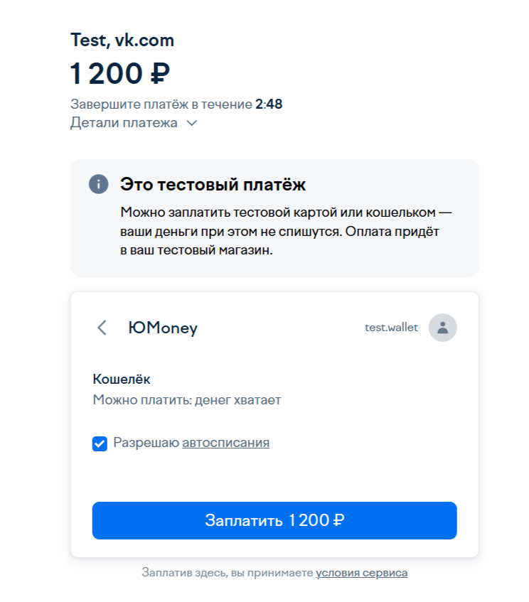

# ЮKassa


**Ссылка на оплату имеет ограничение по времени**. Если клиент не подтвердит оплату до окончания этого срока, то ЮКаssa отменит платеж.

Ссылка может быть неактивной в случае если был повторный переход тем же или другим пользователем с другого устройства или браузера.

В любом случае предусмотрите возможность генерации новой ссылки.

Подробнее в таблице "срок оплаты" [https://yookassa.ru/developers/payment-methods/overview](https://yookassa.ru/developers/payment-methods/overview)


## Как интегрировать ЮKassa в Salebot.pro &#x20;

Для подключения ЮKassa Вам потребуются S**hopID** и **секретный ключ**.&#x20;

**ShopID** можно увидеть в настройках магазина на ЮKassa

<figure><figcaption></figcaption></figure>

Либо в левом меню ЮKassa:

<figure><figcaption></figcaption></figure>

**Секретный ключ** находится в разделе Интеграция  → Ключи API:

<figure><figcaption></figcaption></figure>

Для того, чтобы бот получал уведомления об оплате, также необходимо установить на ЮKassa callback\_url [https://chatter.salebot.pro/yandex\_kassa\_callback/result](https://chatter.salebot.pro/yandex_kassa_callback/result)

Для этого нужно перейти в раздел "Интеграция" → "HTTP-уведомления"

<figure><figcaption>
Настройки уведомлений
</figcaption></figure>


Не забудьте нажать на кнопку "Сохранить"


Теперь переходим в конструктор. Два значения, о которых мы говорили выше необходимо указать в форме ниже. Форма находится в разделе "Эквайринг"

<figure><figcaption></figcaption></figure>

<figure><figcaption></figcaption></figure>

Далее выберите Ставку НДС и систему налогообложения.&#x20;

**Поле Ставка НДС.** Указываем ставку НДС. Возможные значения — числа от 1 до 6:\
1 - Без НДС \
2 - НДС по ставке 0% \
3 - НДС по ставке 5%\
3 - НДС по ставке 10% \
4 - НДС чека по ставке 20% \
5 - НДС чека по расчетной ставке 10/110 \
6 - НДС чека по расчетной ставке 20/120

**Система налогообложения.** Система налогообложения магазина (тег в 54 ФЗ — 1055). Обязательный параметр, если вы используете онлайн-кассу Атол Онлайн, обновленную до ФФД 1.2, или у вас несколько систем налогообложения, в остальных случаях не передается.\
[https://yookassa.ru/developers/api#create\_payment](https://yookassa.ru/developers/api#create_payment)

<figure><figcaption></figcaption></figure>

<mark style="color:red;">**енвд отменен 01.01.2021**</mark>


Для чеков самозанятых данное поле передавать **не передается**


На этом настройка подключения платежной системы закончена.

## Как сформировать ссылку на оплату


Сформировать ссылку на оплату в блоке можно **ОДНИМ ИЗ** из доступных способов:

* [Кнопка с функцией Оплата](priem-platezhei-v-bote-cherez-yandeks.kassu.md#knopka-s-funkciei-oplata), или
* [Функция `get_yookassa_payment_url` в Калькуляторе](priem-platezhei-v-bote-cherez-yandeks.kassu.md#funkciya-get_yookassa_payment_url-v-kalkulyatore), или&#x20;
* [Создание ссылки с помощью переменной payment\_sum  и дополнительных параметров](priem-platezhei-v-bote-cherez-yandeks.kassu.md#sozdanie-ssylki-s-pomoshyu-peremennoi-payment_sum-i-dopolnitelnykh-parametrov) (устаревшая работающая версия)


## Кнопка с функцией Оплата

Ссылку на оплату можно создавать в кнопке с функцией "Оплата". О том как создавать такую кнопку  рассказано в этой статье:&#x20;


Статья про кнопку с функцией Оплата


Рассмотрим все возможные параметры данной кнопки. О том как создавать кнопку с функцией Оплата  рассказано в этой статье:

### **Обязательные параметры кнопки Оплата для ЮKassa**

Для формирования ссылки на оплату в настройках кнопки  необходимо указать  <mark style="color:green;">**обязательные параметры: Сумма оплаты и Наименование товара.**</mark>

<figure><figcaption>
Настройки кнопки
</figcaption></figure>

**поле Текст.** Данный текст будет указан на кнопке с ссылкой на оплату в сообщении

**поле Функция.** Для создания кнопки для выдачи ссылки на оплату выбираем функцию Оплата

**поле Платежная система.** В списке отображаются подключенные к проекту платежные системы. Выбираем ЮKassa


Если к проекту не подключены платежные системы данный тип кнопок будет не доступен


**поле Наименование товара (обязательное).** В данном поле нужно указать название товара. Максимально количество символов для данного поля: 250\
Чем точнее указано описание товара, тем лучше. Например: не Телефон, а Смартфон Xiaomi модель ххх


**НЕЛЬЗЯ** использовать **двойные кавычки** в Описании товара: удалите или замените на одинарные кавычки.&#x20;


**поле Сумма оплаты (обязательное).**  В этом поле указываем стоимость товара.&#x20;

**чекбокс Автоплатеж.** Для подключения автоплатежа включите в настройках платежной системы в Сейлбот ползунок и поставьте галочку в данном чек-боксе в настройке кнопки. По умолчанию, отключен.\
Про настройки для автоплатежей можно почитать здесь: [Как подключить автоматические платежи](priem-platezhei-v-bote-cherez-yandeks.kassu.md#kak-podklyuchit-avtomaticheskie-platezhi)

**чекбокс Двухстадийная оплата.** Данная функция нужная для того чтобы деньги не сразу отправлялись на счёт продавца, а сначала замораживались (холдировались). Такой платёж можно подтвердить или отменить. Подробнее как настроить двухстадийную оплату читайте здесь: [Двухстадийная оплата (холдирование)](priem-platezhei-v-bote-cherez-yandeks.kassu.md#dvukhstadiinaya-oplata-kholdirovanie)

**меню Данные для формирования чека.** При клике по данной кнопке откроются дополнительные обязательные и необязательные поля для формирования чека


Многие платежные системы поддерживают облачные онлайн-кассы, они необходимы по 54-ФЗ.\
Прочитайте особенности оформления чеков на сайте выбранной платежной системы, чтобы не попасть в неловкую ситуацию с налоговой инспекцией.


* Количество
* Название товара
* Итоговая цена
* ФИО покупателя
* Переменная с email покупателя
* Переменная с номером телефона покупателя

**меню Дополнительная информация.** При клике по данной кнопке откроются дополнительные поля для формирования ссылки:

* Валюта

**чекбокс С уведомление о клике.** Для отслеживания перехода по ссылке для оплаты можно поставить галочку. В таком случае, при клике по кнопке в диалог с клиентом в Сейлбот придет уведомление о том, что был совершен переход по ссылке

На данное уведомление можно настраивать дальнейшую логику работы бота.&#x20;

### Дополнительные параметры для формирования чека и ссылки

**выпадающее меню** "**Данные для формирования чека"**

При клике откроется выпадающее меню с параметрами для формирования чека:&#x20;

<figure><figcaption>
Дополнительные настройки "Данные для формирования чека"
</figcaption></figure>

**поле Количество (обязательный).** В этом поле указывается количество или вес товара. Передать можно целое или дробное число через точку. Пример, 5 или 10.3

**поле Название товара (обязательный параметр)**. Название товара (не более 128 символов), которое вы увидите в личном кабинете ЮKassa, а пользователь — при оплате. Если не передать будет иметь вид: 'Оплата счета 35342815-29200591'


**НЕЛЬЗЯ** использовать **двойные кавычки** в Названии товара: удалите или замените на одинарные кавычки.&#x20;


**поле Итоговая цена (обязательный параметр)**. В данном поле необходимо указать сумму к оплате с учетом  количества товаров. Если количество равно 1, то Итоговая цена равна значению в обязательном поле "Сумма" в настройках данной кнопки


Для чеков самозанятых передаем значение 1 (Без НДС)


**Способ расчета** (тег в 54 ФЗ — 1214) — отражает тип оплаты и факт передачи товара. Пример: покупатель полностью оплачивает товар и сразу получает его. В этом случае нужно передать значение full\_payment (полный расчет). Весь список значений поля можно посмотреть [тут.](https://yookassa.ru/developers/payment-acceptance/receipts/54fz/parameters-values#payment-mode)

**Предмет расчета** (тег в 54 ФЗ — 1212) — это то, за что принимается оплата, например товар, услуга.  Весь список значений поля можно посмотреть [тут.](https://yookassa.ru/developers/payment-acceptance/receipts/54fz/parameters-values#payment-subject)

**поле ФИО покупателя.** В этом поле указываем для юрлица — название организации, для ИП и физического лица — ФИО

**Поле Переменная с email покупателя** (необязательный, если передан Номер телефона) В данном поле указывается Email пользователя  (клиента). Можно указывать переменную, в которой хранится  email пользователя.&#x20;

Например, `#{email}`

**Поле Переменная с номером телефона покупателя** (необязательный, если передан Email). В данном поле можно указать переменную, в которой записан  номер телефона покупателя в формате 79000000000\
Например, `#{phone}`


Обязательно должен присутствовать email и/или телефон


**выпадающее меню "Дополнительная информация"**

При клике откроется выпадающее меню с дополнительными параметрами для формирования ссылки:&#x20;

**поле Валюта(обязательный параметр).** В данном поле можно выбрать одну из доступных вариантов валюты платежа. По умолчанию: RUB

<figure><figcaption></figcaption></figure>

### Переменные клиента, которые будут созданы автоматически при использовании кнопки с функцией Оплата

Как только пользователь получит блок с кнопкой "Оплата" автоматически будут созданы переменные клиента:

Служебная переменная клиента **`__payments`** , которая хранит сумму, идентификатор созданной ссылки, нужна для идентификации хука от платежной системы.


Служебную переменную клиента \_\_payments НЕЛЬЗЯ удалять или изменять!


Переменная клиента **`error_payment_button`** создается, если при формировании кнопки возникла ошибка.

В значение переменной error\_payment\_button запишется либо текст ошибки, либо ответ платежной системы с ошибкой.


Значение переменных становятся актуальными при переходе в следующий блок&#x20;


### Как обработать результат

**Успешный платеж.**

В бота <mark style="color:orange;">**АВТОМАТИЧЕСКИ**</mark> придет КОЛЛБЭК, который состоит из 10 символов секретного ключа платежной системы, слова \_success и через пробел сумма платежа. \
&#xNAN;_&#x414;ля использования в настройках схемы достаточно его скопировать._&#x20;

Например: `ovg58keefc_success 44`, где:&#x20;

ovg58keefc : первые 10 символов секретного ключа платежной системы

\_success : результат обработки запроса (успешный платеж)

44 : сумма платежа


Коллбэки (уведомления) от платежной системы пользователь НЕ ВИДИТ. Они отображаются только во вкладке Клиенты и видны оператору.


Пример использования:\
Шаг 1. В блоке "с кнопкой Оплата" добавляем кнопки с функцией Оплата.&#x20;

Шаг 2. В поле Условие соединения от этого блока к блоку "Успешная оплата" указываем коллбэк. Аналогично работает, если указать коллбэк об успешной оплате в поле Условие блока "Стартовое условие".


Важно: выбор соответствия Полное совпадение  или По наличию ключевых слов Если используете По наличию ключевых слов в поле Условие указывайте часть коллбэка без суммы платежа:  10СимволовСекретногоКлюча\_\_success


<figure><figcaption>
Коллбэк об успешной оплате в поле Условие блока
</figcaption></figure>

**Платеж с ошибкой**

<mark style="color:blue;">**При ошибке проведения оплаты**</mark> в бота <mark style="color:orange;">**АВТОМАТИЧЕСКИ**</mark> придет КОЛЛБЭК, который состоит из 10 символов секретного ключа платежной системы, слова \_fail и через пробел сумма платежа

Например, `ovg58keefc_fail 44` , где

`ovg58keefc` : 10 символов секретного ключа платежной системы

`_fail` : результат обработки запроса -  платеж не выполнен или с ошибкой.&#x20;

`44` : сумма платежа


Зависит от платежной системы. Не все платежные системы присылают коллбэк об ошибке платежа.


Если сумма указанная в настройках кнопки <mark style="color:blue;">**отличается от суммы, которую клиент оплатил**</mark>, то <mark style="color:orange;">**АВТОМАТИЧЕСКИ**</mark> придет КОЛЛБЭК, который состоит из 10 символов секретного ключа платежной системы, слова \_different\_amounts и через пробел уникальный ID платежа

Например: `ovg58keefc_different_amounts 123456` , где:&#x20;

`ovg58keefc` : 10 символов секретного ключа платежной системы

`_different_amounts` : результат обработки запроса (сумма оплаты отличается от суммы в ссылке)

`123456` : уникальный ID платежа

## Функция get\_yookassa\_payment\_url в Калькуляторе

Для формирования ссылки на оплату можно воспользоваться функцией `get_yookassa_payment_url` в Калькуляторе блоке.

В поле Калькулятор  переменной присвоим значение функции `get_yookassa_payment_url`&#x20;


Название переменной задаете самостоятельно.  На скринах примеры названия переменных.&#x20;


В эту переменную запишется ссылка на оплату. Переменную можно вывести на экран ссылкой в сообщении или разместить в кнопке с текстом, например, "Оплатить".&#x20;

**ПРИМЕР ссылки на оплату:**

<figure><figcaption></figcaption></figure>


Многие платежные системы поддерживают облачные онлайн-кассы, они необходимы по 54-ФЗ.\
Прочитайте особенности оформления чеков на сайте выбранной платежной системы, чтобы не попасть в неловкую ситуацию с налоговой инспекцией.




`link_yookassa = get_yookassa_payment_url(amount, description, recurrent, products_for_receipt, customer_phone, customer_email, full_name, taxation, currency, extra_params, twostage_payment)`

####

#### Параметры функции:

<table><thead><tr><th width="203">Параметр</th><th>Описание параметра</th></tr></thead><tbody><tr><td><strong><code>amount</code></strong></td><td><mark style="background-color:blue;">Сумма к оплате.</mark>  В этом поле указываем стоимость товара в рублях <strong><code>(обязательный параметр)</code></strong> </td></tr><tr><td><strong><code>description</code></strong></td><td>
<mark style="background-color:blue;">Описание заказа.</mark>  В этом поле можно использовать только символы английского или русского алфавита, цифры и знаки препинания. 

<em>Чтобы пропустить данный параметр передайте вместо него пару одинарных или двойных кавычек или значение</em> <em><code>None</code></em> 
</td></tr><tr><td><strong><code>recurrent</code></strong></td><td><mark style="background-color:blue;">Установочный платеж для автоплатежей.</mark> Если хотите провести первый установочный платеж, то передать значение 1, если нет -  передайте значение None.  В этом случае данные сохраняются в платежной системе для возможности автоплатежей в дальнейшем.</td></tr><tr><td>
<strong><code>products_for_</code></strong>

<strong><code>receipt</code></strong>
</td><td>
<mark style="background-color:blue;">Параметры для формирования чеков.</mark>  <em>Чтобы пропустить данный параметр передайте вместо него пару одинарных / пару двойных кавычек или значение</em> <em><code>None</code></em>

 Имеет следующий вид: 

[{"name":"ТОВАР1","amount":"1200","vat_code":"5","method":"full_payment","object":"commodity", "quantity":1}]

<strong>Важно! Используйте двойные кавычки для формирования словаря {"ключ": "значение"}</strong>

<strong>name</strong> - Наименование товара

<strong>amount -</strong> Полная сумма в рублях за все количество данного товара с учетом всех возможных скидок, бонусов и специальных цен.

<strong>vat_code</strong> - ставка НДС. Этот параметр устанавливает налоговую ставку в ККТ. Возможные значения данного параметра: 

'1' - Без НДС 

'2' - НДС по ставке 0% 

'3' - НДС по ставке 10% 

'4' - НДС чека по ставке 20% 

'5' - НДС чека по расчетной ставке 10/110 

'6' - НДС чека по расчетной ставке 20/120

 Для чеков Самозанятых передать значение '1' 

<strong>method</strong> - Признак способа расчёта (дополнительный параметр для формирования чека)

Пример значения параметра: full_payment — полный расчет 

Остальные доступные варианты можно найти в документации ЮKassa : <a href="https://yookassa.ru/developers/payment-acceptance/scenario-extensions/receipts/54fz/parameters-values#payment-mode">https://yookassa.ru/developers/payment-acceptance/scenario-extensions/receipts/54fz/parameters-values#payment-mode</a> 

<strong>object</strong> - Предмет расчета может принимать разные значения (дополнительный параметр для формирования чека)

 Например, commodity — товар

<strong>quantity</strong> - количество товара

Остальные доступные варианты можно найти в документации ЮKassa : <a href="https://yookassa.ru/developers/payment-acceptance/scenario-extensions/receipts/54fz/parameters-values#payment-subject">https://yookassa.ru/developers/payment-acceptance/scenario-extensions/receipts/54fz/parameters-values#payment-subject</a>

</td></tr><tr><td><strong><code>customer_phone</code></strong></td><td>
<mark style="background-color:blue;">номер телефона покупателя</mark>, не обязательно, если передан параметр <code>customer_email</code> 

Чтобы пропустить данный параметр,  передайте вместо него одинарные или двойные кавычки
</td></tr><tr><td><strong><code>customer_email</code></strong></td><td>
<mark style="background-color:blue;">емейл покупателя</mark>, не обязательно, если передан параметр <code>customer_phone</code> 

Чтобы пропустить данный параметр,  передайте вместо него одинарные или двойные кавычки.
</td></tr><tr><td><strong><code>full_name</code></strong></td><td><mark style="background-color:blue;">ФИО покупателя  или название организации (покупателя)</mark> В данном параметре передайте для ИП и физического лица — ФИО Покупателя, для юрлица — название организации Покупателя  <em>Чтобы пропустить данный параметр передайте вместо него пару одинарных или двойных кавычек или значение</em> <em><code>None</code></em></td></tr><tr><td><mark style="background-color:blue;"><strong><code>taxation</code></strong></mark></td><td>
<mark style="background-color:blue;">Система налогообложения</mark>

<em><strong>Система налогообложения магазина (тег в 54 ФЗ — 1055). Параметр необходим, если вы используете онлайн-кассу Атол Онлайн, обновленную до ФФД 1.2, или у вас несколько систем налогообложения</strong></em><strong>, в остальных случаях не передается</strong> <a href="https://yookassa.ru/developers/api#create_payment"><em><strong>https://yookassa.ru/developers/api#create_payment</strong></em></a>  Возможные значения данного параметра:

 None - Организация имеет один тип налогообложения '1' - Общая система налогообложения 

'2' - Упрощенная (УСН, доходы) 

'3' - Упрощенная (УСН, доходы минус расходы) 

'4' - Единый налог на вмененный доход (ЕНВД) (<mark style="color:red;"><strong>отменен 01.01.2021)</strong></mark>

'5' - Единый сельскохозяйственный налог (ЕСН) 

'6' - Патентная система налогообложения  Для чеков Самозанятых пропустить параметр.   <em><strong>Чтобы пропустить данный параметр</strong> передайте вместо него пару одинарных или двойных кавычек или значение</em> <em><code>None</code></em>
</td></tr><tr><td><strong><code>currency</code></strong></td><td>
<mark style="background-color:blue;">Трехбуквенный код валюты</mark> в формате ISO-4217. 

Пример: 'RUB'  

Должен соответствовать валюте субаккаунта (recipient.gateway_id), если вы разделяете потоки платежей, и валюте аккаунта (ShopID в личном кабинете), если не разделяете.

<em>Чтобы пропустить данный параметр,  передайте вместо него пару одинарных/ пару двойных кавычек или значение None.</em>
</td></tr><tr><td><strong><code>extra_params</code></strong></td><td>
<mark style="background-color:blue;">дополнительные параметры, которых нет в данной функции.</mark> Возможные дополнительные параметры можно посмотреть по ссылке в документации работы с API  платежной системы <a href="https://yookassa.ru/developers/api#create_payment">https://yookassa.ru/developers/api#create_payment</a> Пример: 

<code>extra_params = {"client_ip": "66.249.72.248", "payment_method_data":{"type":"bank_card"}}</code>   <em>Чтобы пропустить данный параметр,  передайте вместо него пару одинарных/ пару двойных кавычек или значение None.</em>
</td></tr><tr><td><code>twostage_payment</code></td><td>двухстадийная оплата (холдирование). Чтобы включить, передайте значение '1'. Подробнее рассказали в разделе "<a href="priem-platezhei-v-bote-cherez-yandeks.kassu.md#dvukhstadiinaya-oplata">Двухстадийная оплата"</a>. </td></tr></tbody></table>



Пример 1: платеж с основными параметрами

<figure><figcaption>
Пример формирования ссылки: переданы только обязательные параметры
</figcaption></figure>

Пример 2: платеж с формированием чека

<figure><figcaption>
Пример формирования ссылки: обычный платеж, автоплатеж НЕ подключен
</figcaption></figure>

Пример 3: Первый платёж для подключения автоплатежа

<figure><figcaption></figcaption></figure>




<mark style="color:green;">Пример 1: Ссылка на оплату без чека</mark>\
\
`link_yokassa = get_yookassa_payment_url(1200, 'Купи меня')`\
\
<mark style="color:green;">Пример 2: Ссылка на оплату с чеком без автоплатежа</mark>\
\
`extra_params = {"client_ip": "66.249.72.248"}`&#x20;

`receipt= [{"name":"ТОВАР1","amount":"1200","vat_code":"5","method":"full_payment","object":"commodity", "quantity":1}]`

`link_yokassa = get_yookassa_payment_url(1200, 'Купи меня', '', receipt, '77777777777', 'exam@mail.com', 'Vasya Pupkin', '4', 'RUB', extra_params)`

<mark style="color:green;">Пример 3: Ссылка на оплату с чеком  и автоплатежом (</mark>первый платеж, при котором сохраняются переменные для автоплатежа<mark style="color:green;">)</mark>\
\
`receipt =  [{"name":"ТОВАР1","price":"1200","quantity":"1","amount":"1200","vat_code":"5","method":"FullPrepayment","object":"Commodity"}]`&#x20;

`link_yokassa = get_yookassa_payment_url(1200, 'Купи меня', '1', receipt, '77777777777', 'exam@mail.com', 'Vasya Pupkin', '4')`




Переменную можно вывести на экран ссылкой в сообщении или разместить в кнопке с текстом, например, "Купить".&#x20;



Если в блоке несколько функций для получения ссылки и допущена ошибка, то значение ошибки будет записано в переменной  **`error_payment_func`**

\
Ошибка запишется по последней функции в Калькуляторе


## Двухстадийная оплата (холдирование)

Чтобы использовать двухстадийную оплату (холдирование), в параметры функции get\_yookassa\_payment\_url нужно передать соответствующий параметр `twostage_payment:`

<figure><figcaption></figcaption></figure>

Если это кнопка для оплаты, то нужно поставить галочку "Двухстадийная оплата".&#x20;

<figure><figcaption></figcaption></figure>


Важно!&#x20;

Также на стороне платежной системы нужно включить уведомления о событиях **waiting\_for\_capture.**&#x20;


Теперь после успешной оплаты сначала придет коллбэк вида "<mark style="color:yellow;">**ovg58keefc\_hold 10**</mark>".&#x20;

Также у клиента в этот момент появится переменная "yandex\_payment\_method\_id\_hold" - она пригодится, если нужно будет подтвердить или отменить оплату через бота:

1. чтобы подтвердить оплату и списать захолдированные средства, нужно использовать функцию "yookassa\_payment\_capture(payment\_id)"
2. чтобы отменить оплату - "yookassa\_payment\_cancel(payment\_id)"

В параметр payment\_id передается ранее сохраненный "yandex\_payment\_method\_id\_hold"

<figure><figcaption>
вместо параметра payment_id сразу передана переменная yandex_payment_method_id_hold 
</figcaption></figure>

После подтверждения/отмены платежа уже придут привычные коллбэки "<mark style="color:yellow;">**ovg58keefc\_success 44**</mark>" или "<mark style="color:yellow;">**ovg58keefc\_fail 44**</mark>" соответственно.

## Создание ссылки с помощью переменной payment\_sum  и дополнительных параметров

Для генерации ссылки на оплату, вам необходимо в поле Калькулятор блока установить значение переменной **payment\_sum**, сразу после этого появится переменная **yandex\_kassa\_pay\_url**.&#x20;

Также до установки значения переменной **payment\_sum**, можно задать следующие необязательные переменные, для настройки платежа:\
**currency** - валюта заказа. Код валюты в формате ISO-4217, по умолчанию RUB \
**payment\_title** – описание заказа. Если не указан, будет заполнен автоматически "Оплата счета 123456-123456"

1. Создаем блок, в котором присваиваем в калькуляторе переменной payment\_sum сумму в виде числового значения:

<figure><figcaption></figcaption></figure>

2. Далее в следующем блоке указываем переменную #{**yandex\_kassa\_pay\_url} через конструкцию #{} в вложении либо в кнопке:**

<figure><figcaption>
Пример: переменная <strong>yandex_kassa_pay_url лежит в поле url в настройках кнопки</strong>
</figcaption></figure>

<figure><figcaption>
Пример: переменная <strong>yandex_kassa_pay_url лежит в поле url в настройках вложений</strong>
</figcaption></figure>

При тестировании схемы бот отработается следующим образом:

1. Если #{**yandex\_kassa\_pay\_url**} в кнопке, то придет кнопка, при клике на которую клиент перейдет в платежную форму:

<figure><figcaption></figcaption></figure>

2. Если #{**yandex\_kassa\_pay\_url**} лежит в поле url настройки вложений, то придет ссылка для оплаты:

<figure><figcaption></figcaption></figure>

И в первом, и во втором случае при клике на кнопку или переходе по ссылке, ваш клиент перенаправится на страницу оплаты:

<figure><figcaption></figcaption></figure>

**ПРИМЕР ссылки на оплату:**


После успешной или неуспешной оплаты в бот придут коллбэки, по которым вы сможете понять, что была успешная оплата. Эти коллбэки в системе вы видите как сообщения от пользователя, чтобы их не мог отправить пользователь, они состоят из ключа ЮKassa и приписки со статусом, например: **test\_k4kyf6E00dpq5ft7vGHmxXCo23JKziwt729O-WcdL8s\_success**. Также после успешной оплаты переменная **yandex\_kassa\_payment\_completed** устанавливается в **True.**

Если ссылка создана с помощью **кнопки  с функцией Оплата** или с помощью **функции в калькуляторе**, в бота <mark style="color:orange;">**АВТОМАТИЧЕСКИ**</mark> придет КОЛЛБЭК, который состоит <mark style="color:orange;">**из 10 символов секретного ключа платежной системы, слова \_success и через пробел сумма платежа.**</mark> \
&#xNAN;_&#x414;ля использования в настройках схемы достаточно его скопировать._&#x20;

Например: `ovg58keefc_success 44`, где:&#x20;

ovg58keefc : первые первые 10 символов секретного ключа платежной системы

\_success : результат обработки запроса (успешный платеж)

44 : сумма платежа


<figure><figcaption></figcaption></figure>


Эти коллбэки НЕ ВИДИТ пользователь, они отображаются только оператору.



Тип сравнения должен быть "**Полное совпадение**"



Для совершения повторного платежа обязательно необходимо обнулить payment\_sum, ранее сформированную ссылку и уже после переназначить переменную payment\_sum для получения свежей ссылки


После завершения оплаты клиенту добавится переменная **yookassa\_callback\_data**, содержащая данные ответа платежной системы по совершенной операции. Из полученного словаря можно извлечь необходимые данные при помощи метода **get**.

## Как подключить автоматические платежи


Для подключения возможности применения автоплатежей требуется связаться с Вашим менеджером. Вот несколько полезных советов:

1. Звонить или писать в техподдержку необходимо самостоятельно
2. Не забудьте подготовить все скрины о ценах в боте и о том, что подписку можно отменить
3. Делать это лучше в будние дни
4. Ожидание одобрения - 2-3 дня


_<mark style="color:blue;">Шаг 1. Включить автоплатежи в настройках ЮКассы в проекте Salebot.</mark>_

Для подключения автоматических платежей в Salebot необходимо включить переключатель "Включить автоплатежи" для ЮKassa в разделе "Эквайринг":

<figure><figcaption>
Чекбокс "Включить автоплатежи" в настройках ЮKassa в разделе "Эквайринг" Salebot
</figcaption></figure>

В этом случае при оплате сервис ЮKassa предложит разрешить автосписания:

<figure><figcaption></figcaption></figure>

При переходе по ссылке ЮKassa объяснит[ как работают автосписания](https://yoomoney.ru/page?id=529482).

_<mark style="color:blue;">Шаг 2. Провести обычный платёж.</mark>_

С помощью удобного способа сформировать ссылку на оплату.  Рекомендуем использовать в блоке [кнопку с функцией "Оплата"](priem-platezhei-v-bote-cherez-yandeks.kassu.md#knopka-s-funkciei-oplata) или с помощью функции  `get_yookassa_payment_url`

<figure><figcaption></figcaption></figure>

После успешной оплаты у клиента появится переменная **yandex\_payment\_method\_id**. Эту переменную необходимо использовать при повторных платежах.

<figure><figcaption></figcaption></figure>


Переменная **yandex\_payment\_method\_id** обязательна для последующих платежей.\
\
Если ее удалить, следующий автоплатеж провести НЕ получится.


_<mark style="color:blue;">Шаг 3. Планируем автосписание</mark>_

От блока Успешная оплата планируем стрелку с таймером к блоку с автоплатежом. Для примера запланируем следующий платеж через 30 дней.&#x20;

<figure><figcaption></figcaption></figure>

_<mark style="color:blue;">Шаг 4. Планируем регулярные списания и настраиваем возможность отказаться от автосписаний.</mark>_

Для поведения повторного платежа необходимо использовать запрос:&#x20;

**Тип запроса:** POST-json

**URL:** https://store.salebot.pro/function/yandex\_kassa\_auto\_pay

**Параметры:**\
shop\_id - идентификатор магазина из настроек\
secret\_key - ключ из настроек подключения\
payment\_sum - сумма платежа\
yandex\_payment\_method\_id - необходимо  передать переменную: #{yandex\_payment\_method\_id}\
order\_id - необходимо  передать переменную: #{order\_id}\
payment\_title - описание платежа(необязательный параметр)\
capture - параметр, отвечающий за платеж без подтверждения пользователя. Установите значение равное 1 (параметр необязательный) &#x20;

**Сохраняемые значения из JSON-ответа:**\
response -> yandex\_kassa\_payment\_id\
По переменной **yandex\_kassa\_payment\_id** система определит что именно оплатил пользователь. Для тестирования вы можете вывести на экран переменную #{custom\_answer}. В случае успеха ответ будет вида: {"status":"1","response":"265b608b-000f-5000-a000-1fab5b6fd51b"}

**Пример параметров:**

`{"shop_id": "653775", "secret_key": "test_k4kyf6E00dpq5ft7vGHmxXCo23JKziwt729O-WcdL8s", "payment_sum": 200, "yandex_payment_method_id": "#{yandex_payment_method_id}", "order_id": "#{order_id}"}`

<figure><figcaption></figcaption></figure>


Для тестирования платежа вам необходимо перейти по ссылке для оплаты, выбрать средство платежа и оплатить


<figure><figcaption></figcaption></figure> <figure><figcaption></figcaption></figure>

После успешной оплаты сможете посмотреть информацию о платеже:

<figure><figcaption></figcaption></figure>


При выполнении автоплатежа не должно быть ссылки на оплату ЮКассы и переменной **payment\_sum**!


<figure><figcaption></figcaption></figure>

#### ОТМЕНИТЬ АВТОСПИСАНИЯ


Автоматические платежи необходимо использовать аккуратно, необходимо предусмотреть возможность отписки от платежа. Также, не всегда требуется подтверждение при проведении платежа и вы можете, в случае ошибки, списать все деньги у человека. Будьте аккуратны.


<figure><figcaption></figcaption></figure>

## **Как сформировать чеки ЮKassa**


Данные чека должны быть заданы **до** указания суммы платежа.


Для формирования чека онлайн-кассы необходимо при формировании ссылки на оплату передать дополнительные параметры.

**Обязательные параметры:**

**products\_for\_receipt** - это массив с перечисленными товарами чека, следующего вида:

\[{**"description"**: "Название товара", **"quantity"**: "Количество товара", **"amount"**: "Цена за единицу товара"}, {**"description"**: "Название товара 2", **"quantity"**: "Количество товара 2", **"amount"**: "Цена за единицу товара 2"}]

1. **description** - название товара (не более 128 символов)
2. **quantity** - количество товара, может быть целое число, либо дробное через точку (например: 1 или 5 или 2.0 или 3.5)
3. **amount** - цена за единицу товара

**vat\_code** - ставка НДС. Возможные значения — числа от 1 до 6:\
1 - Без НДС\
2 - НДС по ставке 0%\
3 - НДС по ставке 10%\
4 - НДС чека по ставке 20%\
5 - НДС чека по расчетной ставке 10/110\
6 - НДС чека по расчетной ставке 20/120

**tax\_system\_code** - система налогообложения. Возможные значения — числа от 1 до 6:\
1 - Общая система налогообложения \
2 - Упрощенная (УСН, доходы) \
3 - Упрощенная (УСН, доходы минус расходы) \
4 - Единый налог на вмененный доход (ЕНВД) <mark style="color:red;">**(отменен с 01.01.2021)**</mark>\
5 - Единый сельскохозяйственный налог (ЕСН) \
6 - Патентная система налогообложения

Также необходимо передать контактные данные клиента, как минимум электронную почту или номер телефона:\
**email** - электронная почта пользователя.\
**phone** - телефон пользователя. Указывается в формате ITU-T E.164, например 79000000000.

**Необязательные параметры:**

**full\_name** - для юрлица — название организации, для ИП и физического лица — ФИО

<figure><figcaption></figcaption></figure>

После определения переменных платежа, определяем переменную payment\_sum, после которой сразу появится ссылка на оплату.

<figure><figcaption></figcaption></figure>


Общая стоимость всех товаров должна быть равной переменной payment\_sum.



**Обратите внимание:** переменная **payment\_sum** получает своё значение последней!


Из примера выше:

## Как сформировать чеки ЮКасса для автоплатежей


Данные чека должны быть заданы **ДО** указания суммы платежа


Для формирования чека онлайн-кассы при вызове функции автоплатежа необходимо  передать дополнительные параметры.

### **Если списание за один товар**

**Обязательные параметры:**\
\
**vat\_code** - ставка НДС. Возможные значения — числа от 1 до 6:\
\
1 - Без НДС \
2 - НДС по ставке 0% \
3 - НДС по ставке 10% \
4 - НДС чека по ставке 20% \
5 - НДС чека по расчетной ставке 10/110 \
6 - НДС чека по расчетной ставке 20/120

**tax\_system\_code** - система налогообложения. Возможные значения — числа от 1 до 6:\
1 - Общая система налогообложения \
2 - Упрощенная (УСН, доходы) \
3 - Упрощенная (УСН, доходы минус расходы) \
4 - Единый налог на вмененный доход (ЕНВД) <mark style="color:red;">**(отменен с 01.01.2021)**</mark>\
5 - Единый сельскохозяйственный налог (ЕСН) \
6 - Патентная система налогообложения

Также необходимо передать контактные данные клиента, как минимум, электронную почту или номер телефона: \
**email** - электронная почта пользователя. \
**phone** - телефон пользователя. Указывается в формате ITU-T E.164, например 79000000000.

**Необязательные параметры:**\
\
**product\_description** - Наименование товара, если не передать будет иметь вид: 'Оплата счета 35342815-29200591'\
**full\_name** - для юр/лица — название организации, для ИП и физического лица — ФИО

<figure><figcaption>
Пример вызова функции автосписания
</figcaption></figure>

### **Если списание сразу за несколько товаров**

**Обязательные параметры:**\
\
**vat\_code** - ставка НДС. Возможные значения — числа от 1 до 6:

1 - Без НДС \
2 - НДС по ставке 0% \
3 - НДС по ставке 10% \
4 - НДС чека по ставке 20% \
5 - НДС чека по расчетной ставке 10/110 \
6 - НДС чека по расчетной ставке 20/120

**tax\_system\_code** - система налогообложения. Возможные значения — числа от 1 до 6:\
1 - Общая система налогообложения \
2 - Упрощенная (УСН, доходы) \
3 - Упрощенная (УСН, доходы минус расходы) \
4 - Единый налог на вмененный доход (ЕНВД) <mark style="color:red;">**(отменен с 01.01.2021)**</mark>\
5 - Единый сельскохозяйственный налог (ЕСН) \
6 - Патентная система налогообложения\
\
**products\_for\_receipt** - это массив с перечисленными товарами чека (нужно записать в переменную и передать), имеет следующий вид:\
\
\[{"**description**": "Название товара", "**quantity**": "Количество товара", "**amount**": "Цена за единицу товара"}, {"**description**": "Название товара 2", "**quantity**": "Количество товара 2", "**amount**": "Цена за единицу товара 2"}]\
\
Обратите внимание, строка описания одного товара имеет вид:\
{"**description**": "Название товара", "**quantity**": "Количество товара", "**amount**": "Цена за единицу товара"}

**description** - название товара (не более 128 символов)\
**quantity** - количество товара, может быть целое число, либо дробное через точку \
&#x20;                 (например: 1 или 5 или 2.0 или 3.5)\
**amount** - цена за единицу товара


Общая стоимость всех товаров должна быть равна переменной **payment\_sum.**


**Необязательные параметры:**\
\
**full\_name** - для юрлица — название организации, для ИП и физического лица — ФИО

Описание переменной, содержащей перечень описаний товара, для формирования чека:

<figure><figcaption></figcaption></figure>

Дополнительные параметры, передаваемые обязательно для формирования чека, выделены жирным: \
{"shop\_id": "123456", "secret\_key": "#{secret\_key}", "payment\_sum": 13, "yandex\_payment\_method\_id": "#{yandex\_payment\_method\_id}", "order\_id": "#{order\_id}", **"vat\_code":"1", "tax\_system\_code":"#{tax\_system\_code}", "products\_for\_receipt": "#{for\_receipt}", "email": "#{email}"**}


**Обратите внимание:** переменная **payment\_sum** получает своё значение последней!


## **Как сделать возврат платежа вместе с чеком**


С помощью нашей интеграции с ЮKassa можно возвращать успешные платежи. Комиссии за проведение возврата нет. Комиссия ЮKassa за проведение платежа **не возвращается**.


### **Полный возврат**

**Тип запроса:** POST-json

**URL:** https://store.salebot.pro/function/yookassa\_function

**Параметры:**\
shop\_id - идентификатор магазина из настроек\
secret\_key - ключ из настроек подключения\
refund\_sum - сумма возврата (пример 100 или с точкой 120.5)\
yandex\_kassa\_payment\_id - идентификатор платежа, необходимо передать переменную: \
\#{yandex\_kassa\_payment\_id}

**Дополнительно можно указать:**\
refund\_description - комментарий к возврату, основание для возврата денег пользователю.

**Сохраняемые значения из JSON-ответа:**

status -> refund\_status;\
response -> resp\
Для тестирования вы можете вывести на экран переменную #{custom\_answer}. \
В случае успеха ответ будет вида: \
{"status":"canceled","response":"265b608b-000f-5000-a000-1fab5b6fd51b"}

status - статус возврата платежа. Возможные значения: canceled, succeeded или 0, если возникла ошибка\
response - идентификатор возврата платежа в ЮKassa или описание ошибки

**Пример параметров:**

`{"shop_id": "653775", "secret_key": "test_k4kyf6E00dpq5ft7vGHmxXCo23JKziwt729O-WcdL8s", "refund_sum": 100, "yandex_kassa_payment_id": "#{yandex_kassa_payment_id}"}`

<figure><figcaption></figcaption></figure>

### **Частичный возврат**

**Тип запроса:** POST-json

**URL:** https://store.salebot.pro/function/yookassa\_function

**Параметры:**\
**peace\_refund** - 1 - отмечаем, что возврат частичный\
**shop\_id** - идентификатор магазина из настроек\
**secret\_key** - ключ из настроек подключения\
**yandex\_kassa\_payment\_id** - идентификатор платежа, необходимо  передать переменную: #{yandex\_kassa\_payment\_id}\
**refund\_products\_list** - список возвращаемых товаров, пример:

`"[{'description': 'Название товара', 'quantity': 'Количество товара', 'amount': 'Цена за единицу товара'}, {'description': 'Название товара 2', 'quantity': 'Количество товара 2', 'amount': 'Цена за единицу товара 2'}]"` 


Важно, чтобы были одинарные кавычки в этом выражении (ниже представлен пример, который можно скопировать и заменить данные на свои).


Каждый товар содержит три значения:

{**'description'**: 'Название товара', **'quantity'**: 'Количество товара', **'amount'**: 'Цена за единицу товара'}

1. **description** - название товара (не более 128 символов)
2. **quantity** - количество товара, может быть целое число, либо дробное через точку (например: 1 или 5 или 2.0 или 3.5)
3. **amount** - цена за единицу товар**а**

\
**refund\_sum** - полная сумма возврата товаров из refund\_products\_list (пример 100 или с точкой 120.5)\
**vat\_code** - ставка НДС. Возможные значения — числа от 1 до 6:

1 - Без НДС\
2 - НДС по ставке 0%\
3 - НДС по ставке 10%\
4 - НДС чека по ставке 20%\
5 - НДС чека по расчетной ставке 10/110\
6 - НДС чека по расчетной ставке 20/120

**tax\_system\_code** - система налогообложения. Возможные значения — числа от 1 до 6:\
1 - Общая система налогообложения \
2 - Упрощенная (УСН, доходы) \
3 - Упрощенная (УСН, доходы минус расходы) \
4 - Единый налог на вмененный доход (ЕНВД) <mark style="color:red;">**(отменен с 01.01.2021)**</mark>\
5 - Единый сельскохозяйственный налог (ЕСН) \
6 - Патентная система налогообложения

**email** - Электронная почта пользователя.\
И\ИЛИ\
**phone** - Телефон пользователя. Указывается в формате ITU-T E.164, например 79000000000.

**Дополнительно можно указать:**\
**full\_name** - для юрлица — название организации, для ИП и физического лица — ФИО\
refund\_description - комментарий к возврату, основание для возврата денег пользователю.

**Сохраняемые значения из JSON-ответа:**

status -> refund\_status;\
response -> resp

Для тестирования вы можете вывести на экран переменную #{custom\_answer}. \
В случае успеха ответ будет вида: \
{"status":"canceled","response":"265b608b-000f-5000-a000-1fab5b6fd51b"}

**status** - статус возврата платежа. Возможные значения: canceled, succeeded или 0, если возникла ошибка\
**response** - идентификатор возврата платежа в ЮKassa или описание ошибки

**Пример параметров:**

{"shop\_id": "769963", "secret\_key": "test\_fMZ0RqpghcoETJ9fhWXbZJsM66DKyvBgJN1rr65Ioz", "refund\_sum": 100, "yandex\_kassa\_payment\_id": "#{yandex\_kassa\_payment\_id}", "peace\_refund": 1, "full\_name": "Иванов Иван Иванович", "email": "example@gmail.com", "phone": "79000000000", "vat\_code": 1, "tax\_system\_code": 6, "refund\_products\_list": "\[{'description': 'Название товара', 'quantity': 'Количество товара', 'amount': 'Цена за единицу товара'}, {'description': 'Название товара 2', 'quantity': 'Количество товара 2', 'amount': 'Цена за единицу товара 2'}]"}

<figure><figcaption></figcaption></figure>

а
