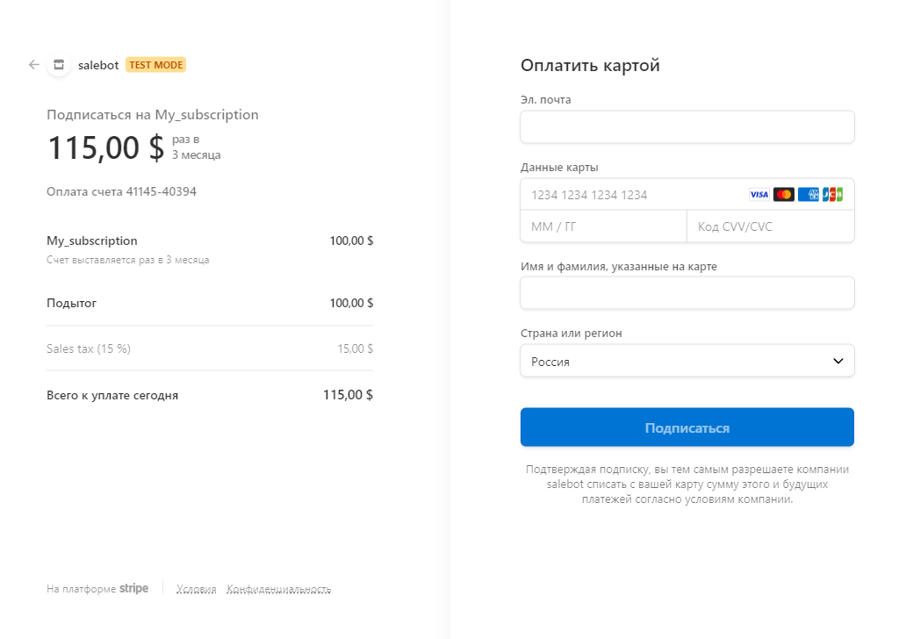

# Stripe

* [Как подключить](stripe.md#podklyuchenie)
* [Как получить ссылку на оплату](stripe.md#kak-poluchit-ssylku-na-oplatu)
* [Как обработать результат](stripe.md#kak-obrabotat-rezultat)
* [Как настроить рекурентные платежи](stripe.md#kak-nastroit-rekurentnye-platezhi)
* [Как тестировать платежи](stripe.md#kak-testirovat-platezhi)

## Как подключить

Для подключения платежной системы Stripe вам потребуется секретный API-ключ и ключ webhook.&#x20;

Секретный API-ключ можно скопировать перейдя в раздел Developers -> API key и копируем Secret key.

Шаг 1. Переходим в раздел Developers -> API key:

<figure><figcaption>
Рис. 1. Как найти раздел api keys
</figcaption></figure>

Шаг 2. Находим и копируем Secret key:

<figure><figcaption></figcaption></figure>

Дальше нужно установить URL-адрес для колбэков. Это необходимо для того, чтобы бот получал уведомления об оплате.&#x20;

Переходим в раздел Webhooks и добавляем адрес для вебхуков.

<figure><figcaption></figcaption></figure>

Откроется форма:

<figure><figcaption></figcaption></figure>

Шаг 1. Нажимаем на "+add destination".

Шаг 2.  Выбираем events:

<figure><figcaption></figcaption></figure>

Шаг 3. Выбираем тип "Webhook endpoint":

<figure><figcaption></figcaption></figure>

Шаг 4. Ознакамливаемся с типом запроса и кликаем "Продолжить":

<figure><figcaption></figcaption></figure>

Шаг 5. Прописываем название и указываем URL endpoint:

<figure><figcaption></figcaption></figure>

URL указываем - [https://chatter.salebot.pro/stripe\_callback/result](https://chatter.salebot.pro/stripe_callback/result)

Шаг 6. Будет создано два эндпоинта, можно посмотреть настройки перед добавлением:&#x20;

<figure><figcaption></figcaption></figure>

Шаг 7. Далее нажмите кнопку "Add destinations". Тогда вебхуки будут сохранены.

Шаг 8. Нажмите кнопку "Done".

<figure><figcaption></figcaption></figure>

Сохраняем и попадаем на страницу с установленным вебхуком:

<figure><figcaption></figcaption></figure>

Шаг 9. Далее нажимаем на вебхук, в котором вы выбрали все ивенты:

<figure><figcaption></figcaption></figure>

Шаг 10. Находим Signig key и сохраняем его себе (в дальнейшем он понадобится для подключения к Salebot):

<figure><figcaption></figcaption></figure>

После получения ключей переходим к подключению в Salebot.

В salebot открываем раздел "Эквайринг", выбираем Stripe.&#x20;

<figure><figcaption></figcaption></figure>

На странице подключения, нужно ввести полученные ключи:

<figure><figcaption></figcaption></figure>

Нажмите "Сохранить настройки".


Готово!&#x20;

На этом подключение платежной системы окончено!&#x20;


## Как подключить колбек о статусе транзакции

Для получения дополнительного колбека нам потребуется подключить вебхук **дополнительно к имеющемуся.**&#x20;

URL указываем - [https://chatter.salebot.pro/stripe\_callback/\<api\_key>/charge\_status](https://chatter.salebot.pro/stripe_callback/%3Capi_key%3E/charge_status)

&#x20;и выбираем события:

* `charge.failed`
* `charge.pending`
* `charge.succeeded`

<figure><figcaption></figcaption></figure>


**Подробнее о каждом из типов вебхука:**

1. **charge.succeeded** - содержит информацию об успешном завершении транзакции (аналогичен колбеку об успешной оплате)
2. **charge.pending** - "транзакция выполняется", на выполнение может уйти до 7 дней. \
   Вебхук будет иметь вид {первые 10 символов }_{тип вебхука}_ \
   Например: _sk\_test\_45LDPJLKT95d\_charge.pending_&#x20;
3. **charge.failed** _- "транзакция провалилась"._ \
   _Вебхук будет иметь вид {первые 10 символов }_{тип вебхука} \
   Например: _sk\_test\_45LDPJLKT95d\_charge.failed_


Полученный после сохранения вебхук добавляем в Salebot поле - Webhook key2:

<figure><figcaption></figcaption></figure>

**stripe\_invoice\_id** - идентификатор сделки, по которой не пришел колбек об успешной оплате сразу после платежа

## Как подключить налоги

Для использования налогов в платежах нужно сперва создать их в личном кабинете Stripe. Для этого введите в поисковой строке tax rates:

<figure><figcaption></figcaption></figure>

И нажмите "+ Add tax rates":

<figure><figcaption></figcaption></figure>

Далее указываем применяемую налоговую ставку:

<figure><figcaption></figcaption></figure>

В открывшемся меню выберите тип налога, регион, для которого он применяется, процентную ставку и признак - будет этот налог включен в сумму платежа Inclusive или будет добавлен сверх суммы - exclusive:

<figure><figcaption></figcaption></figure>

После создания налоговой ставки скопируйте его id в переменную **stripe\_tax\_id** до объявления суммы платежа.

<figure><figcaption></figcaption></figure>

Во избежание ошибок желательно после получения ссылки в переменную stripe\_tax\_id поместить пустую строку (""), так вы сможете применять налог только тогда, когда он нужен

Если все сделать правильно, то в случае с налоговой ставкой с параметром exclusive Вы увидите следующее

<figure><figcaption>
Пример платежа с налоговой ставкой типа exclusive
</figcaption></figure>

## **Как получить ссылку на оплату**

Для генерации ссылки на оплату вам необходимо установить значение переменной **payment\_sum** (например 150 или 100.55 (через точку!)), сразу после этого появится переменная stripe\_pay\_url. Эту переменную можно вывести на экран ссылкой или разместить на кнопке с текстом "Оплатить".&#x20;

Ссылка имеет вид:

`https://checkout.stripe.com/pay/cs_test_a17mskKFFRwEuo3WgBSAUjfk7xaZZIrct9B3Ds2AdODVq1I8aRiqYEBdrU#fidkdWxOYHwnPyd1blpxYHZxWjA0TGFsVzFPVmpmMzJAbVYzUkp1Y0lLYDVgfzR2Q0NxcWZBNUNnTnRSVVRJSGFobEB1UExSczRMMTc8PWRLMGBddl8xalxyPDRoUGhnZm9xXXZANDZyaF0wNTVBVExsPHZyfycpJ2N3amhWYHdzYHcnP3F3cGApJ2lkfGpwcVF8dWAnPyd2bGtiaWBabHFgaCcpJ2BrZGdpYFVpZGZgbWppYWB3dic%2FcXdwYHgl`


По умолчанию установлен USD (доллар), если нужна другая валюта нужно установить значение переменной **currency**


Также до установки значения переменной **payment\_sum**, можно задать следующие необязательные переменные, для настройки платежа.

<table><thead><tr><th width="255">Параметры функции</th><th>Описание паараметра</th></tr></thead><tbody><tr><td><strong>currency</strong></td><td>валюта заказа. Допустимые значения - <a href="https://stripe.com/docs/currencies">https://stripe.com/docs/currencies</a></td></tr><tr><td><strong>payment_description</strong></td><td>описание заказа</td></tr><tr><td> <strong>stripe_tax_id</strong></td><td>
идентификатор налоговой ставки, настроенной в личном кабинете Stripe. 

Как настроить, рассказали в параграфе "<a href="stripe.md#kak-podklyuchit-nalogi">Как подключить налоги</a>"
</td></tr><tr><td><strong>stripe_invoice_enable</strong> </td><td>признак необходимости сохранять инвойсы (счет-фактуры, чеки).  Укажите любое значение, тогда все необходимое Вы найдете в личном кабинете Stripe </td></tr><tr><td><strong>stripe_locale</strong></td><td>установить язык страницы оплаты: en, ru, de.  Все доступные:  <a href="https://stripe.com/docs/api/checkout/sessions/create#create_checkout_session-locale">https://stripe.com/docs/api/checkout/sessions/create#create_checkout_session-locale </a> Если не передано значение <strong>stripe_locale,</strong> то будет использован язык браузера клиента.</td></tr><tr><td><strong>stripe_payment_method_type</strong></td><td>
 метод оплаты, по умолчанию стоит оплата картой (card).  Можно заменить на другие доступные для Stripe методы оплаты. Ниже указаны доступные методы.

Например, <code>stripe_payment_method_type = "customer_balance"</code>
</td></tr><tr><td><strong>stripe_additional_payment_method_type</strong> </td><td>добавить дополнительный метод оплаты. Ниже указаны доступные методыНапример, <code>stripe_additional_payment_method_type  = "sepa_debit"</code></td></tr><tr><td><strong>coupon_id</strong></td><td>идентификатор купона скидки</td></tr><tr><td>stripe_expired </td><td>время жизни ссылки на оплату. Указывается в секундах. Минимальное время 30 минут, максимальное - 24 часа. По умолчанию 24 часа</td></tr><tr><td>stripe_automatic_tax</td><td>включение автоматического расчета и сбора налогов при оплате. Для включения передать "1". Подробная информация об этой настройке <a href="https://docs.stripe.com/tax/set-up">в документации Stripe </a></td></tr></tbody></table>


Важно! Если используете обе переменные _**stripe\_payment\_method\_type** и  **stripe\_additional\_payment\_method\_type, то значения в них ОБЯЗАТЕЛЬНО должны быть РАЗНЫМИ!**_


<em><mark style="color:green;"><strong>Список значений для</strong></mark><strong>  </strong><strong>stripe_payment_method_type</strong> и  <strong>stripe_additional_payment_method_type</strong></em>

card\
acss\_debit\
affirm \
afterpay\_clearpay \
alipay\
au\_becs\_debit \
bacs\_debit \
bancontact \
blik \
boleto \
cashapp \
customer\_balance \
eps \
fpx \
giropay \
grabpay \
ideal \
klarna \
konbini \
link \
oxxo \
p24 \
paynow \
paypal \
pix \
promptpay \
sepa\_debit \
sofort \
us\_bank\_account \
wechat\_pay zip

Подробнее про каждый из методов и для каких стран они доступны можно узнать в документации Stripe: [посмотреть на сайте ](https://stripe.com/docs/api/payment_methods/object#payment_method_object-type)

### **Пример формирования ссылки на оплату**

Создадим ссылку на оплату в размере 1000 рублей (по умолчанию доллар)

<figure><figcaption></figcaption></figure>


**Обратите внимание:** \
\- Сначала указываете необязательные параметры  **first\_name, payment\_description** и т.д.\
\- И последней присваиваем значение переменной **payment\_sum**

Переменные можно задать и ранее в цепочке, а не в одном блоке, это пример.


Далее в нужном месте выводим переменную **stripe\_pay\_url**, в которой содержится ссылка в блоке либо в кнопке:

Пример 1. Выводим ссылку на оплату прямо в сообщении:

<figure><figcaption></figcaption></figure>

Тестирование в боте:

<figure><figcaption></figcaption></figure>

Пример 2. Добавляем ссылку на оплату в кнопку:

<figure><figcaption></figcaption></figure>

<figure><figcaption></figcaption></figure>

Пример 3. Добавляем ссылку в качестве вложения к сообщению:

<figure><figcaption></figcaption></figure>

Тестирование в боте:

<figure><figcaption></figcaption></figure>


Допустимы все три варианта для направления ссылки на оплату в боте.&#x20;


При клике на кнопку или при переходе по ссылке, вашего плательщика переадресует на платежную страницу:

<figure><figcaption></figcaption></figure>

В примере видно, что параметры, которые мы указывали в калькуляторе в настройках блока были применены: описание заказа, валюта и сумма.&#x20;

Если передадите параметр налоговой ставки (**stripe\_tax\_id)** в блоке:&#x20;

<figure><figcaption></figcaption></figure>

То также будет отображена налоговая ставка в форме оплаты:

<figure><figcaption></figcaption></figure>

Пример кода для копирования

`payment_description = 'Тестовая оплата в Страйп'` \
`currency = 'RUB'` \
`stripe_tax_id = 'скопируйте сюда ваш tax ID'` \
`payment_sum = 1000`

Где найти tax ID:

<figure><figcaption></figcaption></figure>

## **Как настроить рекуррентные платежи**

Для рекуррентных платежей (подписки) нужно до объявления переменной **payment\_sum** объявить переменную **stripe\_subscription** и присвоить ей название подписки.&#x20;

Также можно добавить следующие переменные: \
**interval** – продолжительность интервала подписки, в эту переменную нужно передать значение **‘day’** - для дней, **‘week’** - недель, **‘month’** - месяцев, **‘year’** - лет. \
Если переменная не объявлена, то _**по умолчанию**_ будет передан параметр **‘month’.**


**Важно!** Продолжительность одного цикла подписки не может быть более 1 года (для параметра ‘year’), более 12 месяцев (для параметра ‘month’), более 52 недель (для параметра ‘week’).


<figure><figcaption></figcaption></figure>

**interval\_count** – количество указанных интервалов, сколько дней, недель или месяцев будет в подписке за указанную сумму. _**По умолчанию**_ будет передан параметр, равный единице (**1**);

**stripe\_payment\_method\_type** - метод оплаты, по умолчанию стоит оплата картой (card).  Можно заменить на другие доступные для Stripe методы оплаты. Ниже указаны доступные методы.

Например, `stripe_payment_method_type = 'customer_balance'`

**stripe\_additional\_payment\_method\_type** - добавить дополнительный метод оплаты. Ниже указаны доступные методы

Например, `stripe_additional_payment_method_type  = 'sepa_debit'`


Важно! Если используете обе переменные _**stripe\_payment\_method\_type** и  **stripe\_additional\_payment\_method\_type, то значения в них ОБЯЗАТЕЛЬНО должны быть РАЗНЫМИ!**_


<em><mark style="color:green;"><strong>Список значений для</strong></mark><strong>  </strong><strong>stripe_payment_method_type</strong> и  <strong>stripe_additional_payment_method_type:</strong></em>

card\
acss\_debit\
affirm \
afterpay\_clearpay \
alipay\
au\_becs\_debit \
bacs\_debit \
bancontact \
blik \
boleto \
cashapp \
customer\_balance \
eps \
fpx \
giropay \
grabpay \
ideal \
klarna \
konbini \
link \
oxxo \
p24 \
paynow \
paypal \
pix \
promptpay \
sepa\_debit \
sofort \
us\_bank\_account \
wechat\_pay zip


Подробнее про каждый из методов и для каких стран они доступны можно узнать в документации Stripe: [посмотреть на сайте ](https://stripe.com/docs/api/payment_methods/object#payment_method_object-type)



**Важно!** Продолжительность подписки не может быть более 1 года (для параметра ‘year’), более 12 месяцев (для параметра ‘month’), более 52 недель (для параметра ‘week’).


В данном примере подписка с названием 'My\_subscription' будет создана с ценой 90 USD за 1 месяц и повторный платеж будет проведен с той же суммой по истечении 1 месяца:

<figure><figcaption></figcaption></figure>

Пример для копирования:

`stripe_subscription = 'My_subscription'` \
`interval = 'month'` \
`payment_sum = 90`&#x20;

Чтобы списывать платеж по подписке один раз в два, три, четыре месяца, передайте параметр interval\_count:

`stripe_subscription = 'My_subscription'`&#x20;

`interval = 'month'`&#x20;

<mark style="color:yellow;">**`interval_count = 3`**</mark>

`payment_sum = 90`

Чтобы изменить интервал для оплаты подписки с месяца на неделю, то передайте в параметре interval слово week:

`stripe_subscription = 'My_subscription'`&#x20;

<mark style="color:$warning;">**`interval = 'week'`**</mark>&#x20;

`interval_count = 3`

`payment_sum = 90`

После оплаты в переменных сделки у клиента появится переменные stripe\_subscription\_id, которая потребуется для настройки отмены подписки, и stripe\_customer\_id, которую в дальнейшем можно использовать для проверки статуса подписки.


Уведомление(колбэк) приходит только при первом рекуррентном платеже!

На повторные коллбэка НЕ БУДЕТ. Контроль идет [через функцию](stripe.md#proverka-statusa-podpiski) и stripe\_customer\_id.


<figure><figcaption></figcaption></figure>

### Настройки для возврата к обычным платежам

Для возврата к обычным платежам присвойте переменной subscription пустую строку **stripe\_subscription = ''**. В таком случае переменные interval и interval\_count не повлияют на создание ссылки

<figure><figcaption></figcaption></figure>

### **Настройки для отмены подписки**

Для отмены подписки в калькуляторе используйте метод **stripe\_remove\_subscription(stripe\_subscription\_id)**, где **stripe\_subscription\_id** – идентификатор, который был сохранен в переменных о сделке после оплаты.

Это позволит оставить оплаченную подписку активной до конца текущего оплаченного срока, но дальнейшие списания не произойдут, и по истечении срока подписка будет отменена:

<figure><figcaption></figcaption></figure>

answer = stripe\_remove\_subscription('#{stripe\_subscription\_id}')

stripe\_remove\_subscription -  в случае успеха придет ответ с информацией до какого числа будет действовать отмененная подписка

В данном примере результат выполнения функции будет помещен в переменную answer и можно будет проверить результат выполнения.&#x20;

### Проверка статуса подписки

**stripe\_check\_subscription(subscription\_id, customer\_id)**, где

**stripe\_subscription\_id** - идентификатор подписки \
**stripe\_customer\_id** - идентификатор клиента в Stripe (необязательный параметр)

<figure><figcaption></figcaption></figure>

## Как создать купон и получить ID скидки

Для получения идентификатора скидки создайте купон в личном кабинете в разделе ”[coupons](https://dashboard.stripe.com/coupons)”.

<figure><figcaption></figcaption></figure>

При нажатии кнопки “New” откроется страница, где нужно указать:

1. &#x20;Name — название скидки;
2. ID — идентификатор, генерируется автоматически,&#x20;
3. Type — вид скидки: в процентах или фиксированная сумма
4. Duration — длительность скидки (разовая или продолжительная, например, для подписок) и другие параметры.

<figure><figcaption></figcaption></figure>

Купон со скидкой появится в каталоге “Product catalogue“ в разделе “Coupons”, а ID скидки вы можете посмотреть, зайдя в меню купона:

<figure><figcaption></figcaption></figure>

Нажмите на купон, чтобы скопировать ID купона:

<figure><figcaption></figcaption></figure>

### Как добавить скидку в заказ

1. При генерации ссылки на оплату (работает как для подписок, так и для разовых платежей).

В калькуляторе блока до объявления переменной **payment\_sum** задайте переменную **coupon\_id**, передав в неё идентификатор скидки из личного кабинета stripe.

<figure><figcaption></figcaption></figure>

2. В существующую подписку с помощью функции **stripe\_add\_subscription\_discount.**

Задайте условия для срабатывания блока и в калькуляторе вызовите указанную функцию, передав в нее параметры stripe\_subscription\_id (id подписки) и coupon\_id (id купона на скидку). Скидка будет применена для последующих платежей по подписке.

<figure><figcaption></figcaption></figure>

Пример кода для копирования

`stripe_subscription = 'Подписка премиум'` \
`interval = 'month'` \
`payment_description = 'Тестовая оплата в Страйп'` \
`currency = 'USD'` \
`coupon_id = 'ID вашего купона'` \
`stripe_add_subscription_discount(stripe_subscription_id, coupon_id)` \
`stripe_tax_id = 'ID налога'` \
`payment_sum = 90`

При успешном добавлении функция вернёт сообщение с указанием id подписки, вида, суммы или процента скидки, а также срока её действия.

<figure><figcaption></figcaption></figure>


Подробнее о создании подписки расказали в разделе "[Как настроить рекуррентные платежи](stripe.md#kak-nastroit-rekurrentnye-platezhi)"


### Как удалить/изменить скидку для подписки

Прикрепленную к подписке скидку можно удалить или заменить другой скидкой.

Если вы хотите прекратить действие скидки, задайте условие для срабатывания блока и в калькуляторе вызовите функцию **stripe\_remove\_subscription\_discount**, передав в неё параметр **stripe\_subscrition\_id** (id подписки).&#x20;

<figure><figcaption></figcaption></figure>

При успешном выполнении операции функция вернёт сообщение, содержащее id подписки и дату отмены скидки.

Замена скидки, как и добавление новой, производится с помощью функции **stripe\_add\_subscription\_discount.** Не забудьте передать в нее параметры **stripe\_subscription\_id** и **coupon\_id**.\
Успешный запрос обновит прикрепленный к подписке купон и вернет сообщение с актуальными данными.


Как получить идентификатор скидки, рассказали в разделе "[Как создать купон и получить ID скидки](stripe.md#kak-sozdat-kupon-i-poluchit-id-skidki)".


## **Как обработать результат**

После успешной оплаты в бот придут колбэки, по которым вы сможете понять, что была успешная оплата. Эти колбеки в системе вы видите как сообщения от пользователя, чтобы их не мог отправить пользователь, они состоят из 20 первых символов секретного ключа и приписки success, например: **sk\_live\_d35gky6d8ers\_success**&#x20;

<figure><figcaption></figcaption></figure>

Эти колбеки НЕ ВИДИТ пользователь, они отображаются только оператору.

Тип сравнения должен быть **"Полное совпадение"**

Также после успешной оплаты переменная **stripe\_payment\_completed** устанавливается в **True**.

Например, можно сделать обработку успешной оплаты блоком с условием и вывести соответствующее сообщение пользователю:

<figure><figcaption></figcaption></figure>

После завершения оплаты клиенту добавится переменная **stripe\_callback\_data**, содержащая данные ответа платежной системы по совершенной операции. Из полученного словаря можно извлечь необходимые данные при помощи метода **get**.


Для совершения повторного платежа обязательно необходимо обнулить payment\_sum, ранее сформированную ссылку и уже после переназначить переменную payment\_sum для получения свежей ссылки. Можно указать предыдущее значение.


## К**ак тестировать платежи**

Для тестирования интеграции можете использовать секретный ключ из тестовой среды. Для этого в личном кабинете stripe меню справа, нужно переключиться в тестовую среду.&#x20;

Далее провести настройку описанную в начале этой инструкции. Ввести тестовый секретный ключ и добавить адрес для вебхуков в тестовую среду.

Тестовый номер карты

4242 4242 4242 4242\
дата любая в будущем\
CVC - любые три цифры

Если что-то не работает, сравните данные с данными[ на официальном сайте.](https://stripe.com/docs/testing#regulatory-cards)
