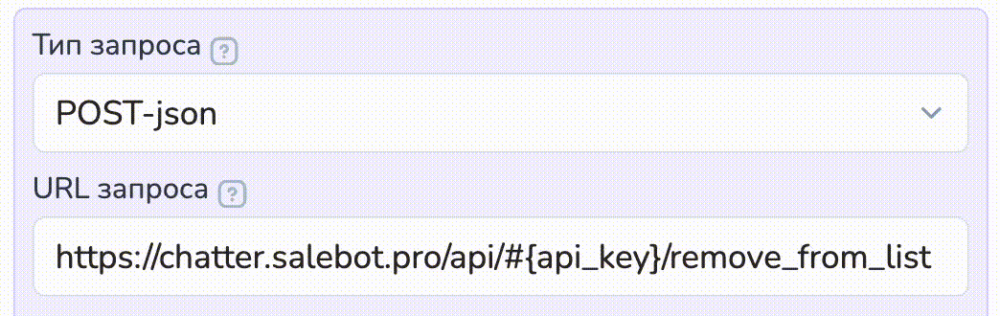

# API конструктора


\*Facebook, Instagram, WhatsApp принадлежат Meta, деятельность которой признана в РФ экстремистской и запрещена.&#x20;


Некоторые Функции API-запросов можно выполнять в  Калькуляторе.

Запросы выполняются методом **POST/GET** на URL, типа: **https://chatter.salebot.pro/api/{api\_key}/{action}**&#x20;

Где: **api\_key** ключ доступа к API, который генерируется в настройках проекта:

<figure><figcaption></figcaption></figure>


Чтобы использовать токен в URL запросе необходимо сгенерировать апи-ключ.&#x20;

Как это сделать, рассказали в разделе "[Генерация api key](api-konstruktora.md#kak-sgenerirovat-api-key)"



При копировании url запроса с этой страницы подставляется пробел, который необходимо при вызове удалить.

Пример неправильно скопированной ссылки: \
https://chatter.salebot.pro /api/callback

Пробел после .pro не так просто заметить. С ним запрос не будет выполняться



**При** **отправке запроса методом GET не используйте запрещенные символы**. Изучите правильное формирование GET запросов.


## **Как сгенерировать api key**


Старый функционал генерации api работает в прежнем режиме, но не доступен для новых проектов.&#x20;

Если в вашем проекте существуют ключи api, сгенерированные без настроек доступа, описанных в данном разделе, то старые api\_key будет работать в штатном режиме.&#x20;

Если вам понадобится генерация новых ключей, то воспользуйтесь новыми настройками.&#x20;


Для генерации ключа api перейдите в настройки проекта:

<figure><figcaption></figcaption></figure>

Далее перейдите в раздел "Интеграции":

<figure><figcaption></figcaption></figure>

В разделе "Интеграции" вы найдете кнопку "Добавить API ключ":

<figure><figcaption></figcaption></figure>

После нажатия на кнопку откроется модальное окно с настройками доступа и генерацией апи ключа:

<figure><figcaption></figcaption></figure>

Далее необходимо выбрать права доступа для ключа api:

<figure><figcaption></figcaption></figure>

В зависимости от выбранного права доступа, будет работать функция api.&#x20;


Обращаем внимание!&#x20;

От выбранных прав доступа зависит работа функции api: если вы сгенерируете api ключ, у которого права только для чтения информации о клиентах, и примените такой ключ в запросе на отправку сообщения клиенту или изменение его переменных, то api-запрос не сработает.&#x20;

Какое разрешение необходимо для каждого api запроса указано в карточке апи-запроса:




Далее пропишите название для api ключа:

<figure><figcaption></figcaption></figure>

Далее сгенерируйте ключ апи, кликнув по кнопке "Сгенерировать":

<figure><figcaption></figcaption></figure>

После чего нажмите "Готово" и ключ api добавится в раздел:

<figure><figcaption></figcaption></figure>

Вы можете добавить любое необходимое количество ключей api, назначив различные права доступа.&#x20;

<figure><figcaption></figcaption></figure>

Далее вам необходимо назначить основной ключ проекта - это необходимо для того, чтобы доступ к апи ключу можно было получить через конструкцию #{api\_key} в URL запроса.&#x20;

Для этого нажмите на кнопку "{+}" справа от строки нужного апи-ключа:

<figure><figcaption></figcaption></figure>

Далее возле ключа появится пометка, что он является основным ключом проекта:

<figure><figcaption></figcaption></figure>

Доступ к основному ключу проекта вы можете получить через api\_key: то есть вам достаточно сгенерировать необходимый ключ, выставить разрешения и назначить его основным ключом проекта. Далее в api-запросе в калькуляторе передать URL запроса с конструкцией #{api\_key}, в котором будет лежать значение основного ключа проекта.&#x20;

<figure><figcaption><p>URL запроса</p></figcaption></figure>

<figure><figcaption></figcaption></figure>

Остальные сгенерированные ключи с настройками доступа будут являться дополнительными. В URL запроса достаточно передать их значение вместо #{api\_key}. Для этого необходимо скопировать значение дополнительного ключа:

<figure><figcaption></figcaption></figure>

И вставить в URL запроса вместо #{api\_key}:

<figure><figcaption></figcaption></figure>


Ранее сгенерированный api-ключ (по-старому типу) является основным ключом проекта по умолчанию и имеет все разрешения.&#x20;



Внимание!&#x20;

Если вы удалите ключ, назначенный основным ключом проекта, то вам необходимо будет назначить новый ключ как основной вручную.&#x20;



Напоминаем!&#x20;

Если у вас есть сгенерированные апи-ключи старого типа, то они будут работать в обычном режиме. Снова сгенерировать апи-ключи старого типа нельзя.&#x20;


## **Как получать сообщения на Webhook URL, указанный в настройках проекта**

.png>)

Каждое входящее или исходящее сообщение будет приходить следующим json POST запросом:

```
{
    'id': идентификатор сообщения в системе,
    'client': {
        'id': идентификатор клиента в системе,
        'recepient': идентификатор клиента в мессенджере,
        'client_type': тип мессенджера,
        'name': имя клиента,
        'avatar': аватар клиента,
        'created_at': дата создания клиента,
        'tag': ключ подписки,
        'group': бот, к которому привязан клиент,
    },
    'message': текст сообщения,
    'attachments': массив, который содержит ссылки на файлы либо словари ссылок на файлы 
    'message_id': id блока, из которого было отправлено сообщение
    'project_id': идентификатор проекта,
    'is_input': 1 если сообщение от клиента, 0 если оно от бота,
    'delivered': 1 если сообщение успешно отправлено, 0 если произошла ошибка отправки,
    'error_message': текст ошибки отправки сообщения
}
```

Если запрос вернул ошибку, повторной отправки не будет. Если сервер возвращает ошибки, уведомления продолжат отправляться несмотря на это.

### Как написать json-запрос

Переходим в настройки блока, в котором у нас будет осуществляться запись данных  таблицу.&#x20;

<figure><figcaption></figcaption></figure>

1. Добавляем раздел API-запрос.
2. Выбираем тип запроса POST-json
3. Переходим к заполнению полей запроса:

<figure><figcaption></figcaption></figure>

**URL запроса** - путь к функции для выполнения запроса. Далее в документации всегда в первой строке, рядом с типом запроса:

<figure><figcaption></figcaption></figure>

**Сохраняемые значения** - перечень параметров ответа запроса с указанием имен переменных, в которые следует сохранить результат в формате:

> **параметр\_из\_запроса -> ваша\_переменная**
>
> Если в ответ получаем параметры сложной структуры, то разбираем их так:&#x20;
>
> * > "cell\_number":{"row":4,"col":2}\
>   > \
>   > \
>   > cell\_number|row -> Строка; \
>   > cell\_number|col -> Столбец<br>

**Заголовок запроса** - заполняется при необходимости. Чаще всего здесь передаются форматы передаваемых данных и/или токен доступа

**JSON-параметры** - тело запроса, в котором прописываются параметры передаваемых данных в формате(ниже возможный вариант написания):

**{"client\_id": "#{id\_получателя\_в\_конструкторе}", "message":"Hello!"}**

Для понимания в какой структуре запрос возвращает ответ,  напишите в поле Сообщение вывод значения переменной #{custom\_answer}. <br>

<figure><figcaption><p>Получение результата выполнения API-запроса в виде сообщения</p></figcaption></figure>

Далее в документации допустимые параметры указаны в Body:&#x20;

<figure><figcaption></figcaption></figure>

## Как использовать универсальный webhook

Перечисленные методы теперь могут быть запущены как POST, так и GET запросом.

* [callback](api-konstruktora.md#zapusk-bota)
* [vk\_callback](api-konstruktora.md#zapusk-bota)
* [ok\_callback](api-konstruktora.md#zapusk-bota)
* [whatsapp\_callback](api-konstruktora.md#zapusk-bota)
* [message](api-konstruktora.md#otpravka-soobshenii)
* [whatsapp\_message](api-konstruktora.md#otpravka-soobshenii)

Раньше в наших методах были жестко прописаны параметры, по которым запускались выполнения методов для подписчиков (например **client\_id** и **vk\_id**) и это накладывало некоторые ограничения для использования их со сторонними сервисами.

Теперь вы можете указать, в каком параметре запроса сэйлбот будет искать идентификатор пользователя: для этого используется параметр с префиксом **value\_**, например **value\_user\_id** и **value\_group\_id**.

А еще метод отправки колбека **callback**, теперь можно запустить передав электронный адрес (**client\_email**) или телефон (**client\_phone**) клиента.


Методы **callback**, **vk\_callback**, **ok\_callback** и **whatsapp\_callback** не привязаны к именам параметра. Вы можете указать, в каком параметре будет находиться номер телефона, email или id-клиента.


Это удобно, когда вы настраиваете прием вебхука с какого-то сайта.&#x20;

Чтобы **указать, в какой переменной лежит client\_id**, необходимо передать параметр **value\_**&#x63;lient\_id, в котором указать название параметра с этим значением.

Чтобы **указать, в какой переменной лежит phone**, необходимо передать параметр **value\_**&#x70;hone, в котором указать название параметра с этим значением.

Чтобы **указать, в какой переменной лежит email**, необходимо передать параметр **value\_**&#x65;mail, в котором указать название параметра с этим значением.

Чтобы **указать, в какой переменной лежит user\_id**, необходимо передать параметр **value\_**&#x75;ser\_id, в котором указать название параметра с этим значением.

Чтобы **указать, в какой переменной лежит group\_id**, необходимо передать параметр **value\_**&#x67;roup\_id, в котором указать название параметра с этим значением.

Чтобы **указать переменную, в которой находится само сообщение в вебхуке,** необходимо передать **value\_message (передается** по аналогии с другими параметрами (phone, email и т.д.))

Пример:

В адрес пропишем value\_client\_id = my\_client

`https://chatter.salebot.pro/api/d3f31dabef80ddeb73d43938b4ef8bb0/callback?value_client_id=my_client`\
`{"my_client":49177759, "message":"Hello world"}`

Запрос будет эквивалентен запросу ниже:

`https://chatter.salebot.pro/api/d3f31dabef80ddeb73d43938b4ef8bb0/callback`\
`{"client_id":49177759, "message":"Hello world"}`

Как можно заметить, название параметра, в котором лежит имя, отличается припиской **value\_**


Обращаем внимание!&#x20;

Некоторые события генерируют системное уведомление в проекте.

Например, существуют системные уведомления с message, которые приходят не пустыми, но без текста от клиента.&#x20;

При этом в проекте также могут генерироваться хуки message с определенным содержанием следующего вида: "message: new\_chat\_member"

Соответственно, следует обращать внимание на содержание: это либо системное уведомление, либо хук с определенным событием.&#x20;


## Как запускать бота

### Запуск бота

<details>

<summary><mark style="color:green;">POST</mark> https://chatter.salebot.pro/api/#{api_key}/callback</summary>

URL запроса: https://chatter.salebot.pro/api/#{api\_key}/callback\
Метод можно использовать для запуска воронки у клиента или подтверждения действия на стороннем ресурсе. Данное сообщение не увидит клиент.\
**Дополнительно переданные параметры сохранятся в переменные.**\
Метод отправки колбека, теперь можно запустить передав электронный адрес (**client\_email**) или телефон (**client\_phone**) клиента.

Разрешение доступа при генерации ключа "Разрешение на изменение/удаление информации о клиентах":


Path

api key\* - токен доступа

Body

client\_phone - телефон, по которому будет искаться клиент

client\_email - email, по которому будет искаться клиент

client\_id - id клиента в конструкторе

message - Текст сообщения

resume\_bot - True (необязательный параметр). Если бот на паузе, чтобы снять с паузы.&#x20;

Пример: resume\_bot = True

time\_shift - число. Если указать, сообщение будет отправлено через указанное количество секунд от текущего времени.

send\_time - дата и время в формате "%Y-%m-%d %H:%M:%S" ("2024-10-16 13:15:59"). Позволяет указать дату и время для отправки сообщения.\
Если указать time\_shift и send\_time одновременно, будет использован time\_shift

```
import requests
import json

params = {"message": "some_text", "client_id": "25554"}
token = 'b551e18c8b8e86bea6f14f38de3f5cc3c31ba1edb4d8'
url = f'https://chatter.salebot.pro/api/{token}/callback'
requests.post(url, json=params)
```

</details>

### Запуск бота по идентификатору пользователя ВКонтакте

<details>

<summary><mark style="color:green;">POST</mark> https://chatter.salebot.pro/api/#{api_key}/vk_callback</summary>

URL запроса: https://chatter.salebot.pro/api/#{api\_key}/vk\_callback

Метод можно использовать для запуска воронки у клиента или подтверждения действия на стороннем ресурсе. Данное сообщение не увидит клиент.\
**Дополнительно переданные параметры сохранятся в переменные.**&#x20;

Разрешение доступа при генерации ключа "Разрешение на изменение/удаление информации о клиентах":&#x20;


Path

api key\* - токен доступа

Body

message - Текст сообщения\
user\_id - id пользователя вконтакте\
group\_id - id группы вконтакте\
resume\_bot - True (необязательный параметр). Если бот на паузе, чтобы снять с паузы. Пример: resume\_bot = True

time\_shift - число. Если указать, сообщение будет отправлено через указанное количество секунд от текущего времени.

send\_time - дата и время в формате "%Y-%m-%d %H:%M:%S" ("2024-10-16 13:15:59"). Позволяет указать дату и время для отправки сообщения.\
Если указать time\_shift и send\_time одновременно, будет использован time\_shift

```
params = {"user_id": '146467928', "group_id": '143414131', 'message': 'test'}
api = 'cab4233db32c8af006c91945fa03cb468d1fd845f140'
url = f'https://chatter.zmservice.ru/api/{api}/vk_callback'
requests.post(url, json=params)
```

</details>

### Запуск бота по номеру WhatsApp\*

<details>

<summary><mark style="color:green;">POST</mark> https://chatter.salebot.pro/api/&#x3C;api_key>/whatsapp_callback *</summary>

URL запроса: https://chatter.salebot.pro/api/\<api\_key>/whatsapp\_callback \*

Этот метод может запустить вотсап бота, после регистрации клиента на сайте или после того, как он оставит заявку с номером телефона.\
**Дополнительно переданные параметры сохранятся в переменные.**

Разрешение доступа при генерации ключа "Разрешение на изменение/удаление информации о клиентах":


Path

api key\* - токен доступа

Body

name - Имя клиента\
message - Текст сообщения\
phone - Номер телефона клиента\
bot\_id - Идентификатор бота\
resume\_bot - True (необязательный параметр). Если бот на паузе, чтобы снять с паузы. Пример: resume\_bot = True

time\_shift - число. Если указать, сообщение будет отправлено через указанное количество секунд от текущего времени.

send\_time - дата и время в формате "%Y-%m-%d %H:%M:%S" ("2024-10-16 13:15:59"). Позволяет указать дату и время для отправки сообщения.\
Если указать time\_shift и send\_time одновременно, будет использован time\_shift

</details>

### Запуск бота по идентификатору пользователя Одноклассников

<details>

<summary> <mark style="color:green;">POST</mark> https://chatter.salebot.pro/api/#{api_key}/ok_callback</summary>

URL запроса: https://chatter.salebot.pro/api/#{api\_key}/ok\_callback

Метод можно использовать для запуска воронки у клиента или подтверждения действия на стороннем ресурсе. Данное сообщение не увидит клиент. \
**Дополнительно переданные параметры сохранятся в переменные.**

Разрешение доступа при генерации ключа "Разрешение на изменение/удаление информации о клиентах":


Path

api key\* - токен доступа

Body

name - Имя клиента\
message - Текст сообщения\
user\_id - Идентификатор бота\
group\_id - ID группы Одноклассников\
resume\_bot - True (необязательный параметр). Если бот на паузе, чтобы снять с паузы. Пример: resume\_bot = True

time\_shift - число. Если указать, сообщение будет отправлено через указанное количество секунд от текущего времени.

send\_time - дата и время в формате "%Y-%m-%d %H:%M:%S" ("2024-10-16 13:15:59"). Позволяет указать дату и время для отправки сообщения.\
Если указать time\_shift и send\_time одновременно, будет использован time\_shift

</details>

### Запуск бота по идентификатору Telegram&#x20;

<details>

<summary><mark style="color:green;">POST</mark> https://chatter.salebot.pro/api/#{api_key}/tg_callback</summary>

URL запроса: https://chatter.salebot.pro/api/#{api\_key}/tg\_callback

Метод можно использовать для запуска воронки у клиента или подтверждения действия на стороннем сайте. Данное сообщение не увидит клиент. \
**Дополнительно переданные параметры сохраняются в переменные.**

Разрешение доступа при генерации ключа "Разрешение на изменение/удаление информации о клиентах":


Path

api key\* - токен доступа

Body

message - Текст сообщения\
user\_id - Идентификатор пользователя в Телеграм\
group\_id - название бота (заканчивается на bot)\
resume\_bot - True (необязательный параметр). Если бот на паузе, чтобы снять с паузы. Пример: resume\_bot = True

time\_shift - число. Если указать, сообщение будет отправлено через указанное количество секунд от текущего времени.

send\_time - дата и время в формате "%Y-%m-%d %H:%M:%S" ("2024-10-16 13:15:59"). Позволяет указать дату и время для отправки сообщения.\
Если указать time\_shift и send\_time одновременно, будет использован time\_shift

</details>

### Отправка Callback-сообщений списку клиентов по platform\_id

<details>

<summary><mark style="color:green;">POST</mark>  https://chatter.salebot.pro/api/#{api_key}/send_callback_by_platform_id</summary>

URL запроса: https://chatter.salebot.pro/api/#{api\_key}/send\_callback\_by\_platform\_id

При обнаружении в проекте клиентов с platform\_id из списка отправит callback с текстом из поля callback\_text.\
\
<mark style="color:red;">**Ограничение: 1 запрос = не более 300 отправлений**</mark>&#x20;

Пример параметров запроса: \
{"platform\_ids":\[407184121, "79609879898", "2rwewefw"], "callback\_text": "test\_callback"}

Разрешение доступа при генерации ключа "Разрешение на изменение/удаление информации о клиентах":


Path

api key\* - токен доступа

Body

platform\_ids - список идентификаторов клиентов в мессенджере\
callback\_text - текст callback\
group\_id - идентификатор бота

time\_shift - число. Если указать, сообщение будет отправлено через указанное количество секунд от текущего времени.

send\_time - дата и время в формате "%Y-%m-%d %H:%M:%S" ("2024-10-16 13:15:59"). Позволяет указать дату и время для отправки сообщения.\
Если указать time\_shift и send\_time одновременно, будет использован time\_shift

</details>

### Отправка callback-сообщения email-клиенту

<details>

<summary><mark style="color:green;">POST</mark> https://chatter.Salebot.pro/api/#{api_key}/email_callback</summary>

URL запроса: https://chatter.Salebot.pro/api/#{api\_key}/email\_callback

Этот метод может запустить email-бот после регистрации клиента на сайте или после того, как он оставит заявку с email, при этом метод находит email-клиента или создает его, если тот не найден.

Разрешение доступа при генерации ключа "Разрешение на изменение/удаление информации о клиентах":


Дополнительно переданные параметры сохранятся в переменные

Path

api key\* - токен доступа

Body

name - имя клиента\
message - текст сообщения\
email - адрес почты\
email\_id\_bot - email-адрес бота\
resume\_bot - True (необязательный параметр).&#x20;

Если бот на паузе, чтобы снять с паузы.&#x20;

Пример: resume\_bot = True

time\_shift - число. Если указать, сообщение будет отправлено через указанное количество секунд от текущего времени.

send\_time - дата и время в формате "%Y-%m-%d %H:%M:%S" ("2024-10-16 13:15:59"). Позволяет указать дату и время для отправки сообщения.\
Если указать time\_shift и send\_time одновременно, будет использован time\_shift

</details>

## Как работать с сообщениями

### Параметры отправки сообщения

**attachment\_type** может принимать значения: **image, video, link, file, audio**\
При отправке вложения параметр **message** необязателен \
\
**buttons** - определяет кнопки, которые будут прикреплены к сообщению. Формат кнопок аналогичен [расширенным настройкам кнопок](https://docs.salebot.pro/osnovnye-ponyatiya.-kak-sozdavat-botov-na-salebot.pro/sozdanie-knopok.-rasshirennye-nastroiki-knopok). Возможны два варианта передачи кнопок: с указанием подсказки для мессенджеров без кнопок и без нее.

Пример параметра buttons:

```
"buttons": {"hint": "Этот текст будет отображен в вотсапе",
 "buttons": [
    {"type": "reply", 
     "text": "Расскажи об услугах", 
     "line": 0, "index_in_line": 0}, 
       
    {"type": "reply", 
     "text": "Стоимость услуг", 
     "line": 0, 
     "index_in_line": 1}, 
        
    {"type": "reply", 
     "text": "Контакты", 
     "line": 1, "index_in_line": 0}, 
        
    {"type": "reply", 
     "text": "Оставить заявку", 
     "line": 1, "index_in_line": 1}
   ] 
}
```

### Отправка сообщения клиенту

<details>

<summary><mark style="color:green;">POST</mark>  https://chatter.salebot.pro/api/#{api_key}/message</summary>

URL запроса: https://chatter.salebot.pro/api/#{api\_key}/message

Этот метод можно использовать для отправки сообщений с уведомлениями. Параметр **message** обязателен, если вы не отправляете файл. Если вы отправляете файл, текст необязателен.

Разрешение доступа при генерации ключа "Разрешение на изменение/удаление информации о клиентах":


Path

api key\* - токен доступа

Body

message\_id - Номер блока для отправки\
message - Текст сообщения\
client\_id - id клиента в конструкторе\
attachment\_type - Тип отображения файла. Обязательный, если передан attacment\_url\
attachment\_url - url файла\
buttons - Кнопки

time\_shift - число. Если указать, сообщение будет отправлено через указанное количество секунд от текущего времени.

send\_time - дата и время в формате "%Y-%m-%d %H:%M:%S" ("2024-10-16 13:15:59"). Позволяет указать дату и время для отправки сообщения.\
Если указать time\_shift и send\_time одновременно, будет использован time\_shift

```
import requests
import json

params = {"message": "some_text", "client_id": "25554"}
token = 'b551e18c8b8e86bea6f14f38de3f5cc3c31ba1edb4d8'
url = f'https://chatter.salebot.pro/api/{token}/message'
requests.post(url, json=params)

ЕСЛИ отправляем вложение:
params = {"message": "какое-нибудь сообщение", 
"client_id": "1234565", "attachment_type": "video/image/file", 
"attachment_url": "https://qwreqw"}
token = 'b551e18c8b8e86bea6f14f38de3f5cc3c31ba1edb4d8'
url = f'https://chatter.salebot.pro/api/{token}/message'
requests.post(url, json=params)

//где в attachment_type указываем либо video, либо image, либо file - 
в зависимости от того, какое вложение: видео, картинка или документ
```

</details>

### Отправка сообщения в Whatsapp

<details>

<summary><mark style="color:green;">POST</mark> https://chatter.salebot.pro/api/&#x3C;api_key>/whatsapp_message</summary>

URL запроса: https://chatter.salebot.pro/api/\<api\_key>/whatsapp\_message

Позволяет отправить сообщение от имени подключенного бота на указанный номер\
whatsapp\_bot\_id необходимо взять из раздела мессенджеры и чаты. Каждому подключенному вотсапу конструктор присваивает уникальный идентификатор.

Разрешение доступа при генерации ключа "Разрешение на изменение/удаление информации о клиентах":


Path

api key\* - токен доступа

Body

message\_id - Номер блока для отправки\
whatsapp\_bot\_id - Идентификатор вотсап бота, от которого нужно отправить сообщение\
attachment\_url - url файла\
attachment\_type - Тип отображения файла. Обязательный, если передан attacment\_url\
message - Текст сообщения\
phone - Номер телефона получателя

time\_shift - число. Если указать, сообщение будет отправлено через указанное количество секунд от текущего времени.

send\_time - дата и время в формате "%Y-%m-%d %H:%M:%S" ("2024-10-16 13:15:59"). Позволяет указать дату и время для отправки сообщения.\
Если указать time\_shift и send\_time одновременно, будет использован time\_shift

```
import requests
import json

params = {"message": "some_text", "phone": "79875146788"}
token = 'b551e18c8b8e86bea6f14f38de3f5cc3c31ba1edb4d8'
url = f'https://chatter.salebot.pro/api/{token}/whatsapp_message'
requests.post(url, json=params)
```

</details>

### Массовая отправка сообщений

<details>

<summary><mark style="color:green;">POST</mark> https://chatter.salebot.pro/api/#{api_key}/broadcast</summary>

URL запроса: https://chatter.salebot.pro/api/#{api\_key}/broadcast

Метод позволяет запустить рассылку.&#x20;

Можно использовать <mark style="color:red;">**один из вариантов**</mark>, они взаимоисключающие:

1. передан параметр **list** - рассылка будет произведена по указанному списку клиентов\
   Метод позволяет запустить рассылку.&#x20;
2. передан параметр **clients** - рассылка будет произведена по массиву переданных идентификаторов клиентов
3. передан параметр **platform\_ids** и **group\_id** - рассылка будет произведена по массиву переданных platform\_id (идентификатор в мессенджере) указанного бота (group\_id)
4. Если **не передан ни один** из выше перечисленных, рассылка не будет отправлена.

Обязательный параметр **message** (и\или attachment\_type и attachment\_url) **ИЛИ** **message\_id**

Разрешение доступа при генерации ключа "Разрешение на изменение/удаление информации о клиентах":


**Path**

api key\* - токен доступа

**Body**

**list** - Номер списка, по которому необходимо разослать

clients - Идентификаторы получателей в конструкторе

message - Текст сообщения

platform\_ids - Идентификаторы получателей в мессенджере. Вместе с ним передать обязательный параметр group\_id

group\_id - Обязательный, работает только с platform\_ids. При работе с другими вариантами - игнорируется. Для отправки по platform\_ids указанного бота.

attachment\_url - url файла

attachment\_type - Тип отображения файла. Обязательный, если передан attacment\_url

buttons - кнопки

message\_id - Номер блока для отправки

shift - Количество секунд между сообщениями. По умолчанию 0.2

time\_shift - число. Если указать, сообщение будет отправлено через указанное количество секунд от текущего времени.

send\_time - дата и время в формате "%Y-%m-%d %H:%M:%S" ("2024-10-16 13:15:59"). Позволяет указать дату и время для отправки сообщения.\
Если указать time\_shift и send\_time одновременно, будет использован time\_shift

```
import requests
import json

params = {"message": "some_text", "clients": ["5", "58", "110"]}
token = 'b551e18c8b8e86bea6f14f38de3f5cc3c31ba1edb4d8'
url = f'https://chatter.salebot.pro/api/{token}/broadcast'
requests.post(url, json=params)
```

</details>

### Получение истории сообщений

<details>

<summary><mark style="color:blue;">GET</mark> https://chatter.salebot.pro/api/#{api_key}/get_history?client_id=</summary>

URL запроса: https://chatter.salebot.pro/api/#{api\_key}/get\_history?client\_id=

Параметр client\_id можно получить [ТУТ](api-konstruktora.md#kak-poluchit-id-klienta-client_id)

Разрешение доступа при генерации ключа "Разрешение на чтение информации о клиентах":


**Path**

api key\* - токен доступа

**Body**

client\_id - id клиента

limit - Количество элементов в ответе/ По умолчанию 2000, максимальное значение 2000

start\_date - указание даты, начало периода выборки\
(поле обязательное, если указывается stop\_date), формат: дд.мм.гггг&#x20;

stop\_date - указание даты, конец периода выборки\
(поле обязательное, если указывается start\_date), формат: дд.мм.гггг

```
{
  "status": "success",
  "result": [
    {
      "id": 104500,
      "answered": true,
      "client_replica": false,
      "message_id": 390,
      "message_from_outside": 0,
      "created_at": 1587895014,
      "text": "Пышь тышь",
      "attachments": {
        
      },
      "delivered": true,
      "error_message": "true",
      "manager_id": 12486,
      "manager_email": "example@mail.com"
    },
  ]
}
```

</details>

### Очистить историю сообщений

<details>

<summary><mark style="color:blue;">GET</mark> https://chatter.salebot.pro/api/#{api_key}/clear_history?client_id=</summary>

URL запроса: https://chatter.salebot.pro/api/#{api\_key}/clear\_history?client\_id=

Удаляет историю переписки&#x20;

Разрешение доступа при генерации ключа "Разрешение на изменение/удаление информации о клиентах":


**Path**

api key\* - токен доступа

**Body**

client\_id - id клиента

```
import requests
import json


token = 'b551e18c8b8e86bea6f14f38de3f5cc3c31ba1edb4d8'
url = f'https://chatter.salebot.pro/api/{token}/clear_history?client_id=85856'
requests.get(url)
```

</details>

## Для работы с клиентами

### Определение клиента сотруднику

<details>

<summary><mark style="color:green;">POST</mark>  https://chatter.salebot.pro/api/#{api_key}/assign_to_user</summary>

URL запроса: https://chatter.salebot.pro/api/#{api\_key}/assign\_to\_user

Метод позволяет определить клиента сотруднику. Параметр e-mail не обязателен. Если емейл не передать, распределит по алгоритму системы.

Разрешение доступа при генерации ключа "Разрешение на изменение/удаление информации о клиентах":


**Path**

api key\* - токен доступа

**Body**

client\_id - id клиента\
email - е-мейл сотрудника (опционально)

```
import requests
import json

params = {"client_id":"#{client_id}","email":"xxxxx@mail.ru"}
token = 'b551e18c8b8e86bea6f14f38de3f5cc3c31ba1edb4d8'
url = f'https://chatter.salebot.pro/api/{token}/broadcast'
requests.post(url, json=params)
```

</details>

### Загрузка клиентов в систему

<details>

<summary><mark style="color:green;">POST</mark> https://chatter.salebot.pro/api/#{api_key}/load_clients</summary>

URL запроса: https://chatter.salebot.pro/api/#{api\_key}/load\_clients

Метод позволяет загрузить клиентов в систему. При загрузке клиентов whatsapp можно передавать номер в свободном формате, как с концовкой @s.whatsapp.net, так и без нее.

Идентификатор группы **(group\_id)** можно получить [ТУТ ](api-konstruktora.md#kakie-eshe-vozmozhnosti)через /api/\<api\_key>/connected\_channels

(если client\_type=13 (телефония), то group\_id="")

Тип мессенджера, откуда пришел клиент **(client\_type)** можно посмотреть [ТУТ](/broken/pages/-LxpXZscJeU6Wb2MlqSH#znacheniya-client_type)

_Пример: \[{"platform\_id":"79875555555","group\_id":34810,"client\_type":6}]_

Разрешение доступа при генерации ключа "Разрешение на изменение/удаление информации о клиентах":


**Path**

api key\* - токен доступа

**Body**

platform\_id - номер телефона\
group\_id - id группы\
client\_type - тип мессенджера, откуда пришел клиент

```
import requests
import json


token = 'b551e18c8b8e86bea6f14f38de3f5cc3c31ba1edb4d8'
url = f'https://chatter.salebot.pro/api/{token}/load_clients'

params = [{ "platform_id": 274827917, "group_id": 169166236, "client_type":0},
{"platform_id":"79538550785@s.whatsapp.net", "group_id": "1hwF7lwEjv4SKYIGFhQnBw==", "client_type": 6}]
requests.post(url, json=params)
# в случае успеха функция вернет каждому элементу идентификатор и статус добавления
# пример ответа
# {"status":"success","items":[{"platform_id":"700000000@s.whatsapp.net","group_id":"5kqchxwyvdvFZOsp80q2qw==","client_type":6,"status":"success","id":1469409}]}
```

</details>

### Добавить клиентов в список

<details>

<summary><mark style="color:green;">POST</mark> https://chatter.salebot.pro/api/&#x3C;api_key>/add_to_list</summary>

URL запроса: https://chatter.salebot.pro/api/\<api\_key>/add\_to\_list

Добавляет клиентов в список

Разрешение доступа при генерации ключа "Разрешение на изменение/удаление информации о клиентах":


**Path**

api key\* - токен доступа

**Body**

list\_id - Номер списка\
clients - массив id клиентов

Пример:\
JSON параметры\
{"list\_id":1170282, "clients":\[411262772, 646410963]}

</details>

### Удалить клиентов из списка

<details>

<summary><mark style="color:green;">POST</mark> https://chatter.salebot.pro/api/#{api_key}/remove_from_list</summary>

URL запроса: https://chatter.salebot.pro/api/#{api\_key}/remove\_from\_list

Удаляет клиентов из списка

Разрешение доступа при генерации ключа "Разрешение на изменение/удаление информации о клиентах":


**Path**

api key\* - токен доступа

**Body**

list\_id - Номер списка\
clients - массив с номерами клиентов в конструкторе Salebot (значения client\_id)

</details>

### Получение списка клиентов

<details>

<summary><mark style="color:blue;">GET</mark> https://chatter.salebot.pro/api/&#x3C;api_key>/get_clients</summary>

**URL запроса:** https://chatter.salebot.pro/api/\<api\_key>/get\_clients

Разрешение доступа при генерации ключа "Разрешение на чтение информации о клиентах":


**Path**

api key\* - токен доступа

**Body**

offset - Смещение относительно первого элемента\
limit - Количество элементов в ответе/ По умолчанию 500, максимальное значение 500.\
list - номер списка\
reverse - указание обратной сортировки(от самой "старой" записи к самой "новой"). Параметр работает при отсутствии параметра list

Возвращает статус и массив элемента

```
{
"status":"success",
"clients":[{
    "id":44483,
    "platform_id":"146467928",
    "client_type":0,
    "name":null,
    "avatar":null,
    "message_id":null,
    "project_id":1,
    "created_at":1588248599,
    "updated_at":1588248599,
    "custom_answer":null,
    "tag":null,
    "group":"143414131",
    "operator_start_dialog":null
    }
]
}
```

</details>

### Разрешение на удаление клиентов

<details>

<summary><mark style="color:$success;"><strong>POST</strong></mark> https://chatter.salebot.pro/api/#{api_key}/delete_clients</summary>

**URL запроса:** https://chatter.salebot.pro/api/#{api\_key}/delete\_clients

Разрешение доступа при генерации ключа: "Разрешение на удаление клиентов":

<figure><figcaption></figcaption></figure>

Path

api key\* - токен доступа

Body

client\_ids - список идентификаторов клиентов, которых нужно удалить. Максимум 500. Пример: \[199571, 199707, 1935722]

</details>

## Как работать с переменными

### Присвоение переменных

<details>

<summary><mark style="color:green;">POST</mark> https://chatter.salebot.pro/api/#{api_key}/save_variables</summary>

URL запроса: https://chatter.salebot.pro/api/#{api\_key}/save\_variables

&#x20;<mark style="color:green;">**! Лимита по данному запросу нет.**</mark>&#x20;

Позволяет сохранить переменные в заявку и в клиента. \
Запрос присвоения переменных по умолчанию добавляет в переменные сделок.\
И если нужно изменить переменные в профиле, нужно прописывать префикс **client.** Например, для телефона: client.phone

Разрешение доступа при генерации ключа "Разрешение на изменение/удаление информации о клиентах":


**Update**: Параметр _**clients**_ позволяет массово присваивать переменные.&#x20;

Пример: {"client\_id":49177759, "variables":{"client.phone":"88888888888"\}}

**Path**

api key\* - токен доступа

**Body**

clients - Массив id клиентов для присвоения переменных\
client\_id - id клиента\
variables - Хеш переменных(ключ-значение)

```
import requests
import json

params = {"client_id": "25554", "variables": {"var_name": "var_value"}}
token = 'b551e18c8b8e86bea6f14f38de3f5cc3c31ba1edb4d8'
url = f'https://chatter.salebot.pro/api/{token}/save_variables'
requests.post(url, json=params)
```

</details>

### Получение переменных

<details>

<summary><mark style="color:blue;">GET</mark> https://chatter.salebot.pro/api/#{api_key}/get_variables?client_id=</summary>

URL запроса: https://chatter.salebot.pro/api/#{api\_key}/get\_variables?client\_id=

Разрешение доступа при генерации ключа "Разрешение на чтение информации о клиентах":


Пример: https://chatter.salebot.pro/api/d3f31dabef80ddeb73d43938b4ef8bb0/get\_variables?client\_id=49177759

**Path**

api key\* - токен доступа

**Body**

client\_id - id клиента

```
import requests
import json


token = 'b551e18c8b8e86bea6f14f38de3f5cc3c31ba1edb4d8'
url = f'https://chatter.salebot.pro/api/{token}/get_variables?client_id=85856'
requests.get(url)
```

</details>

## Как получить id клиента (client\_id)

### Получение client\_id по значению platform\_id

<details>

<summary><mark style="color:green;">POST</mark> https://chatter.salebot.pro/api/#{api_key}/find_client_id_by_platform_id</summary>

**URL запроса:** https://chatter.salebot.pro/api/#{api\_key}/find\_client\_id\_by\_platform\_id

Разрешение доступа при генерации ключа "Разрешение на чтение информации о клиентах":


**Path**

api key\* - токен доступа

**Body**

platform\_ids - массив идентификаторов в мессенджере\
group\_id - идентификатор бота

```
[{
"id":15099119,
"tag":null,
"created_at":1618815253,
"name":"ОЛЬГА БЕЛИК",
"avatar":"https:\\/\\/files.salebot.pro\\/uploads\\/avatars\\/256865200.jpg",
"platform_id":"2568652",
"group":"Salebotpro_bot",
"variables":{"tg_username":"@belik"}},

{"id":21087377,
"tag":null,
"created_at":1626275893,
"name":"Елена Молниева",
"avatar":"https:\\/\\/files.salebot.pro\\/uploads\\/avatars\\/571830542.jpg",
"platform_id":"571830542",
"group":"Salebotpro_bot",
"variables":{"tg_username":"@molniy61"}
}]
```

</details>

### Получить id клиента из Онлайн-чата

<details>

<summary><mark style="color:blue;">GET</mark> https://chatter.salebot.pro/api/#{api_key}/online_chat_client_id?recipient=</summary>

URL запроса: https://chatter.salebot.pro/api/#{api\_key}/online\_chat\_client\_id?recipient=

Этот метод позволяет интегрировать сайт и чат-бота. Например, если человек зашел на страницу с акцией, прислать сразу же сообщение в чат о персональном предложении.

Разрешение доступа при генерации ключа "Разрешение на изменение/удаление информации о клиентах":


**Path**

api key\* - токен доступа

**Body**

tag - Тег (метка клиента)\
name - Имя клиента\
recipient - Идентификатор диалога на сайте

#### Где взять **recipient?**&#x20;

На сайте, где размещен онлайн чат "Salebot.pro" при помощи JS получите свойство **SaleBotPro.recipient\_id**


```
{ "client_id": 36553 }
```

</details>

### Получение client\_id по номеру Whatsapp\*

<details>

<summary><mark style="color:blue;">GET*</mark> https://chatter.salebot.pro/api/#{api_key}/whatsapp_client_id?phone=</summary>

URL запроса\*: https://chatter.salebot.pro/api/#{api\_key}/whatsapp\_client\_id?phone=

Метод вернет идентификатор клиента для выполнения запросов к API, если вы знаете номер телефона клиента в Whatsapp\*\
Если клиента нет с таким номером, то метод вернет 404

Разрешение доступа при генерации ключа "Разрешение на чтение информации о клиентах":


**Path**

api key\* - токен доступа

**Body**

phone - Номер телефона\
group\_id - Идентификатор бота

</details>

### Получение client\_id по номеру телефона

<details>

<summary><mark style="color:blue;">GET</mark> https://chatter.salebot.pro/api/&#x3C;api_key>/find_client_id_by_phone?phone= </summary>

URL запроса: https://chatter.salebot.pro/api/\<api\_key>/find\_client\_id\_by\_phone?phone=&#x20;

Метод вернет идентификатор клиента для выполнения запросов к API. \
Поиск происходит как по клиентам whatsapp, так и по переменным

Разрешение доступа при генерации ключа "Разрешение на чтение информации о клиентах":


**Path**

api key\* - токен доступа

**Body**

phone - Номер телефона

</details>

### Получение client\_id по email

<details>

<summary><mark style="color:blue;">GET</mark> https://chatter.salebot.pro/api/#{api_key}/find_client_id_by_email?email= </summary>

URL запроса: https://chatter.salebot.pro/api/#{api\_key}/find\_client\_id\_by\_email?email=&#x20;

Метод вернет идентификатор клиента для выполнения запросов к API.\
Поиск происходит по переменным.

Разрешение доступа при генерации ключа "Разрешение на чтение информации о клиентах":


**Path**

api key\* - токен доступа

**Body**

email - Email для поиска

</details>

### Получение client\_id по значению переменной

<details>

<summary><mark style="color:blue;">GET</mark> https://chatter.salebot.pro/api/#{api_key}/find_client_id_by_var?var=&#x26;val=</summary>

URL запроса: https://chatter.salebot.pro/api/#{api\_key}/find\_client\_id\_by\_var?var=\&val=

Метод вернет идентификатор клиента для выполнения запросов к API

Разрешение доступа при генерации ключа "Разрешение на чтение информации о клиентах":


**Path**

api key\* - токен доступа

**Body**

**var -** Имя переменной, по которой будет поиск\
**val -** Значение переменной\
**group\_id -** Идентификатор группы\
**search\_in -** Передать значение 'order' для поиска по переменным **сделки;** Ищет до 3-х переменных у клиентов проекта, возвращает список клиентов, у которых есть все заявленные переменные.&#x20;

</details>

### Получение id последнего созданного клиента по значению переменной

<details>

<summary><mark style="color:blue;">GET</mark> https://chatter.salebot.pro/api/#{api_key}/find_latest_client_id_by_var?var=&#x26;val=</summary>

URL запроса: https://chatter.salebot.pro/api/#{api\_key}/find\_latest\_client\_id\_by\_var ?var=\&val=

Метод вернет id последнего созданного клиента для выполнения запросов к API. Ищет по переменным клиента и сделок.

Разрешение доступа при генерации ключа "Разрешение на чтение информации о клиентах":


**Path**

api key\* - токен доступа

**Body**

**var -** Имя переменной, по которой будет поиск\
**val -** Значение переменной

</details>

### Получение списка client\_id по значению переменной

<details>

<summary><mark style="color:blue;">GET</mark> https://chatter.salebot.pro/api/#{api_key}/find_all_client_id_by_var?var=&#x26;val=</summary>

URL запроса: https://chatter.salebot.pro/api/#{api\_key}/find\_all\_client\_id\_by\_var?var=\&val=

Метод вернет список идентификаторов клиентов, у которых есть заданная переменная с заданным значением

Разрешение доступа при генерации ключа "Разрешение на чтение информации о клиентах":


**Path**

api key\* - токен доступа

**Body**

**var -** Имя переменной, по которой будет поиск\
**val -** Значение переменной

```
{
    // Response
}
```

</details>

### Получение списка client\_id по значениям нескольких переменных

<details>

<summary><mark style="color:blue;">GET</mark> https://chatter.salebot.pro/api/#{api_key}/find_all_client_id_by_several_vars?var=val</summary>

URL запроса: https://chatter.salebot.pro/api/#{api\_key}/find\_all\_client\_id\_by\_several\_vars?var=val

Разрешение доступа при генерации ключа "Разрешение на чтение информации о клиентах":


**Path**

api key\* - токен доступа

**Body**

variable1 - Значение1

variable2 - Значение2

variable3 - Значение3

```
{
 "status":"success","client_ids":[93891114]
}
```

</details>

### Поиск по переменным

<details>

<summary><mark style="color:green;">POST</mark> https://chatter.salebot.pro/api/#{api_key}/find_clients</summary>

URL запроса: https://chatter.salebot.pro/api/#{api\_key}/find\_clients

Метод осуществляет поиск по переменным, вернет список идентификаторов клиентов, удовлетворяющих условию запроса.

_Примеры параметров: по умолчанию поиск производится по переменным клиента (рекомендуется)_

{"q": {"result": "ok", "var": "дом", "var": "60"\}} - поиск по переменным клиента, у клиента должны быть все указанные переменные&#x20;

{"q": {"result": "ok", "var": "дом", "var": "60"}, "search\_in": "order", "include\_all": False} - поиск по переменным сделок ("search\_in": "order"), в сделке должны быть хотя бы одна из указанных переменных ("include\_all": False)&#x20;

{"q": {"name": {"\_in": \["Joe", "Jane", "Donald"]\}}} - переменная клиента name равна одному из значений списка \["Joe", "Jane", "Donald"]&#x20;

{"q": {"name": {"\_not\_in": \["Joe", "Jane", "Donald"]\}}} - переменная клиента name НЕ равна одному из значений списка \["Joe", "Jane", "Donald"]&#x20;

{"q": {"name": {"\_not": "Joe"\}}} - переменная клиента name не равна Joe

_**Внимание!**_&#x20;

_**Сравнение чисел возможно только, если у всех клиентов в искомой переменной число. Если хотя бы у одного будет строка, запрос не отработает.**_


Разрешение доступа при генерации ключа "Разрешение на чтение информации о клиентах":


Параметры

**Path**

api key\* - токен доступа

**Body**

q - обязательный параметр, query условия на поиск переменных

search\_in - по переменным какой сущности искать, если не передать ищет по переменным клиента, может принимать значение order

include\_all - обязательное выполнение всех условий из параметра q,\
False - если одно из условий совпало, отбирает сущность

```
Успешно
{"status":"success","client_ids":[41203, 5622354, 785212]} 
{"status":"success","client_ids":[]} 
{"status": "fail", "message": "Parameter "q" required"} {"status": "fail", "message": "Error in parameter format"}
Ошибка
{"status":"fail","message":"Something went wrong"}
```

</details>

## Как работать со сделками

### Получение идентификатора текущей сделки

<details>

<summary><mark style="color:blue;">GET</mark> https://chatter.salebot.pro/api/#{api_key}/get_current_order_id</summary>

**URL запроса:** https://chatter.salebot.pro/api/#{api\_key}/get\_current\_order\_id

Разрешение доступа при генерации ключа: "Разрешение на чтение информации из CRM":


**Path**

api key\* - токен доступа

**Body**

client\_id - идентификатор клиента

```
Успешный ответ: {"status":"success","order_id":40632}, где
order_id - идентификатор текущей сделки
Ответ с ошибкой: {"status":"client_not_found"}
```

</details>

### Получение списка сделок

<details>

<summary><mark style="color:blue;">GET</mark> https://chatter.salebot.pro/api/#{api_key}/get_orders</summary>

**URL запроса:** https://chatter.salebot.pro/api/#{api\_key}/get\_orders

Разрешение доступа при генерации ключа: "Разрешение на чтение информации из CRM":


**Path**

api key\* - токен доступа

**Body**

client\_id - идентификатор клиента

**order\_status** - Статус сделки: \
0 - активные сделки\
1 - успешные сделки\
2 - проваленные сделки

```
Успешный ответ: {"status":"success","order_id":[40338,40340,40341]} 
Ответ с ошибкой: {"status":"client_not_found"}
```

</details>

### Перемещение сделки на следующее по порядку состояние воронки Salebot&#x20;

<details>

<summary><mark style="color:green;">POST</mark> https://chatter.salebot.pro/api/#{api_key}/move_order_to_next_state</summary>

**URL запроса:** https://chatter.salebot.pro/api/#{api\_key}/move\_order\_to\_next\_state

Разрешение доступа при генерации ключа: "Разрешение на изменение/удаление информации из CRM":


**Path**

api key\* - токен доступа

**Body**

client\_id - идентификатор клиента

**order\_id** - Идентификатор сделки

```
Ответ в случае успеха: 
{"status":"success","state_id":37}, где 
state_id - идентификатор состояния в SalebotCRM 
Ответ с ошибкой: 
{"status":"client_not_found"}
```

</details>

### Получение данных сделки

<details>

<summary><mark style="color:green;">POST</mark> https://chatter.salebot.pro/api/#{api_key}/get_order_vars</summary>

**URL запроса:** https://chatter.salebot.pro/api/#{api\_key}/get\_order\_vars

Разрешение доступа при генерации ключа: "Разрешение на чтение информации из CRM":


**Path**

api key\* - токен доступа

**Body**

client\_id - идентификатор клиента

**order\_id** - Идентификатор сделки

variables - массив переменных \
(формат:\["var\_name1", "var\_name2"])

```
Ответ в случае успеха: 
{"status":"success","result":{"var_name1":"111","var_name2":"13.04.2023"}} 

Пример с ошибкой: 
{"status":"client_not_found"}
```

</details>

### Добавление переменных сделки

<details>

<summary><mark style="color:green;">POST</mark> https://chatter.salebot.pro/api/#{api_key}/set_order_vars</summary>

**URL запроса:** https://chatter.salebot.pro/api/#{api\_key}/set\_order\_vars

Разрешение доступа при генерации ключа: "Разрешение на изменение/удаление информации из CRM":


**Path**

api key\* - токен доступа

**Body**

client\_id - идентификатор клиента

**order\_id** - Идентификатор сделки

variables - словарь переменных (Ключ это название переменной, а значение это то, что нужно сохранить в эту переменную)\
(формат:{"var\_name": "var\_velue"})

```
Ответ в случае успеха: {"status":"success"} 
Ответ с ошибкой: {"status":"order 12345 not found"}
```

</details>

### Создание сделки

<details>

<summary><mark style="color:green;">POST</mark> https://chatter.salebot.pro/api/#{api_key}/create_order</summary>

**URL запроса:** https://chatter.salebot.pro/api/#{api\_key}/create\_order

Разрешение доступа при генерации ключа: "Разрешение на изменение/удаление информации из CRM":


**Path**

api key\* - токен доступа

**Body**

client\_id - идентификатор клиента

name - название сделки

description - описание сделки

budget - стоимость сделки

state\_id - id состояния, в которое нужно поместить сделку

При запросе необходимо указать один из следующих параметров: client\_id, email, phone. Если указать несколько из этих параметров, использоваться будет только один. Приоритет использования в порядке убывания: client\_id > phone > email.&#x20;

Если указан phone или email, и клиента с таким телефоном или почтой нет, будет создан новый клиент.

```
Успешный ответ: {"status":"success","order_id":40654}, 
где order_id идентификатор новой активной сделки 
Ответ с ошибкой: {"status":"client_not_found"}
```

</details>

### Перенос сделки в состояние SalebotCRM

<details>

<summary><mark style="color:green;">POST</mark> https://chatter.salebot.pro/api/#{api_key}/set_order_state</summary>

**URL запроса:** https://chatter.salebot.pro/api/#{api\_key}/set\_order\_state

Разрешение доступа при генерации ключа: "Разрешение на изменение/удаление информации из CRM":


**Path**

api key\* - токен доступа

**Body**

client\_id - идентификатор клиента

state\_id - Номер состояния, в которое нужно перенести сделку клиента

</details>

### Получения id состояния воронки в SalebotСRM

<details>

<summary><mark style="color:blue;">GET</mark> https://chatter.salebot.pro/api/#{api_key}/get_order_state</summary>

**URL запроса:** https://chatter.salebot.pro/api/#{api\_key}/get\_order\_state

Разрешение доступа при генерации ключа: "Разрешение на чтение информации из CRM":


**Path**

api key\* - токен доступа

**Body**

client\_id - идентификатор клиента

order\_id - Индентификатор сделки (если не указан, то метод вернет ID этапа текущей сделки)

```
Пример успешного ответа
{'status': 'success', 'state_id': 123456}

Пример неуспешного ответа
{'status': 'order not found'}
```

</details>

## Какие еще есть возможности

### Проверка, есть ли Whatsapp\* на номере телефона

<details>

<summary><mark style="color:blue;">GET</mark> https://chatter.salebot.pro/api/#{api_key}/check_whatsapp *</summary>

**URL запроса:** https://chatter.salebot.pro/api/#{api\_key}/check\_whatsapp[^1]

**Чтобы использовать метод, у вас должен быть подключен Whatsapp\* к Salebot.**

Разрешение доступа при генерации ключа "Разрешение на чтение информации о клиентах":


Вызывается как с методом GET, так и POST\
Номер телефона можно передавать в любом формате.

**Path**

api key\* - токен доступа

**Body**

phone - Номер телефона для проверки

</details>

### Получить список подключенных мессенджеров к проекту

<details>

<summary><mark style="color:blue;">GET</mark> https://chatter.salebot.pro/api/&#x3C;api_key>/connected_channels</summary>

URL запроса: https://chatter.salebot.pro/api/\<api\_key>/connected\_channels

Разрешение доступа при генерации ключа "Разрешение на чтение информации о клиентах":


Функция возвращает к каждому мессенджеру параметр **group\_id**, именно его необходимо передавать при загрузке клиентов.\
Для Whatsapp также возвращается поле **status**, которое принимает значения:\
**NOT\_STARTED = 0**\
**STARTED = 1**\
**ASLEEP = 2**\
**STOPPED = 3**

**Path**

api key\* - токен доступа

```
{'project_id': 1, 
'viber': [{
        'id': 14, 
        'uri': 'salebotstage', 
        'name': 'salebotstage', 
        'enabled': true,
        'group_id': 11}], 
'facebook': [], 
'telegram': [{
        'id': 23, 
        'short_name': 'bulls_vs_bears_bot', 
        'name': 'bulls_vs_bears_bot', 
        'enabled': true,
        'group_id': 'bulls_vs_bears_bot'}], 
'whatsapp': [], 
'avito': [], 
'ok': [], 
'vkontakte': [{
        'id': 33, 
        'group': '143414131',
        'group_id': '143414131'}]
}
```

</details>

### Получение списка блоков из схемы бота

<details>

<summary><mark style="color:blue;">GET</mark> https://chatter.salebot.pro/api/&#x3C;api_key>/get_messages</summary>

**URL запроса:** https://chatter.salebot.pro/api/\<api\_key>/get\_messages

Разрешение доступа при генерации ключа "Разрешение на чтение информации о клиентах":


**Path**

api key\* - токен доступа

</details>

### Получение вложенных  данных клиента

<details>

<summary>delimiter</summary>

Для получения client\_id и/или телефона клиента, которые лежат не на первом уровне, а во вложенных словарях, воспользуйтесь параметром delimiter:

Для этого к URL запроса добавьте:

?delimiter=1\&delimiter\_value\_client\_id={key1}1{key2}\&delimiter\_value\_phone={key1}1{key2}&#x20;

где&#x20;

?delimiter=1 - параметр со значением. Данное значение разделяет ключи {key1}1{key2}1{key3}

delimiter\_value\_client\_id={key1}1{key2} - получение ID клиента;\
delimiter\_value\_phone={key1}1{key2} - получение номера телефона клиента;

{key1} - ключ, в который вкладывается значение с ЛЮБЫМИ символами, кроме символов, лежащих в параметре. Ключей может быть неограниченное количество: \
?delimiter=1\&delimiter\_value\_client\_id={key1}1{key2}1{key3}1{key4}1{key5}1{key6}. \
**Ключ передается БЕЗ фигурных скобок.**&#x20;

Между ключами передавайте заданное значение delimiter!

если delimiter=2, то {key1}2{key2}2{key3}2,

delimiter=5, то {key1}5{key2}5{key3}5.&#x20;

При присвоении значения delimiter=5, в ключе не должно быть символа 5 и т.д.&#x20;

Пример:

https://chatter.salebot.pro/api/\<api\_key>/callback<mark style="color:yellow;">**?delimiter=1\&delimiter\_value\_client\_id={key1}1{key2}\&delimiter\_value\_phone={key1}1{key2}**</mark>&#x20;

Также можно получить только ID либо номер телефона: для этого после URL запроса добавьте один из необходимых запросов:

https://chatter.salebot.pro/api/\<api\_key>/callback<mark style="color:green;">**?delimiter=1\&delimiter\_value\_client\_id={key1}1{key2}**</mark> - для получения ID клиента;

https://chatter.salebot.pro/api/\<api\_key>/callback<mark style="color:green;">**?delimiter=1delimiter\_value\_phone={key1}1{key2}**</mark> - для получения номера телефона;

Для методов API:

1. Запуск бота

https://chatter.salebot.pro/api/\<api\_key>/callback

2. Запуск бота по идентификатору пользователя ВКонтакте

https://chatter.salebot.pro/api/\<api\_key>/vk\_callback

3. Запуск бота по номеру WhatsApp

https://chatter.salebot.pro/api/\<api\_key>/whatsapp\_callback

4. Запуск бота по идентификатору пользователя Одноклассников

https://chatter.salebot.pro/api/\<api\_key>/ok\_callback

5. Запуск бота по идентификатору Telegram

https://chatter.salebot.pro/api/\<api\_key>/tg\_callback

6. Отправка callback-сообщения email-клиенту

https://chatter.salebot.pro/api/\<api\_key>/email\_callback

7. Отправка сообщения клиенту

https://chatter.salebot.pro/api/\<api\_key>/message


8\. Отправка сообщения в Whatsapp


https://chatter.salebot.pro/api/\<api\_key>/whatsapp\_message

9. Массовая отправка сообщений

https://chatter.salebot.pro/api/\<api\_key>/broadcast

10. Присвоение переменных

https://chatter.salebot.pro/api/\<api\_key>/save\_variables
\



</details>


Если вам нужны дополнительные методы, свяжитесь со службой поддержки.


[^1]: whatsapp принадлежит Meta, которая признанана экстремисткой в РФ и запрещена
