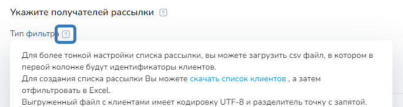
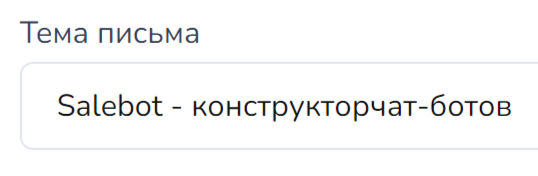
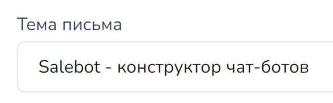
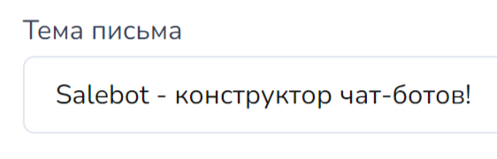
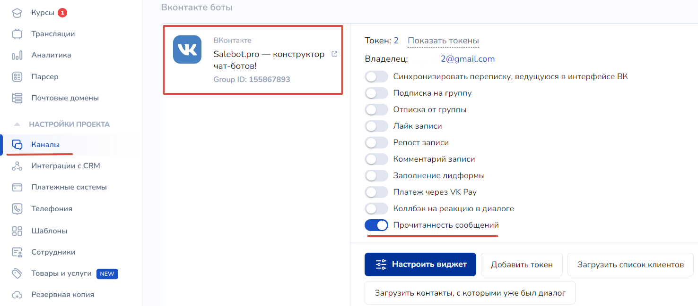
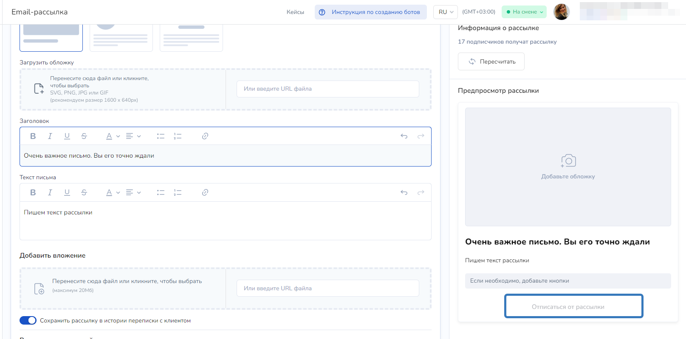

# Создание email-рассылки

## Как создать email-рассылку

Для создания email-рассылки необходимо перейти в соответствующий раздел и нажать “Создать рассылку”.

 (1).png>)

Email-рассылка, как и рассылка в мессенджерах, проходит в 3 этапа: \
&#xNAN;_**выбор получателей,**_ \
_**формирование сообщения,**_ \
_**настройки отправки.**_

Указать получателей рассылки можно с помощью фильтра по действующим подпискам email-бота или загрузить пользователей файлом.

Свою базу пользователей можно загружать файлом. Скачать шаблон файла можно нажав на знак вопроса как на скриншоте нише:

<figure><figcaption>
Скриншот из раздела Рассылки - Email-рассылки - подсказка к "Тип фильтра"
</figcaption></figure>


В файле можно указывать ТОЛЬКО email получателей. Другие параметры (имя, телефон и прочие переменные) НЕ запишутся в диалоги клиентов.

При загрузке файла в рассылке укажите кодировку UTF-8 и разделитель - точка с запятой.


Клиентов также можно загрузить с помощью файла формата .CVS в разделе "Каналы":

<figure><figcaption></figcaption></figure>

<figure><figcaption></figcaption></figure>

С помощью настройки "Фильтр по подписчикам" можно отфильтровать **существующих пользователей email-бота** :&#x20;

* по спискам (можно как добавить, так и исключить список)&#x20;
* по состоянию в Salebot CRM,&#x20;
* по состоянию клиентов (блок, в котором находится клиент),&#x20;
* по подключенным мессенджерам (из раздела Каналы),&#x20;
* по переменным,&#x20;
* по дате регистрации

При формировании email-сообщений можно создать любой дизайн и увидеть, в каком виде письмо дойдет до пользователя в поле “Предпросмотр рассылки”.


<mark style="color:red;">**Важно!**</mark> Обязательным является поле "Текст письма".&#x20;


 (1).png>)


<mark style="color:red;">**Обращаем внимание на особенность рассылки в Gmail**</mark>

Внимательно проверяйте название темы письма в соответствующем поле! \
В случае, если в теме письма присутствует какая-либо опечатка, то при дальнейшем осуществлении данной рассылки тема письма закэшируется и **НЕ ИЗМЕНИТСЯ**, даже если вы смените проект.&#x20;

Единственным выходом из данной ситуации является добавление дополнительного символа.

Пример:

В таком случае, тема письма останется такой же, даже если вы поставите пробел между словами следующим образом:

Письмо придет с темой, как в первом варианте, хотя вы и добавили пробел.

Чтобы выйти из ситуации, исправьте опечатку и добавьте дополнительный символ:

В остальных сервисах email подобного не наблюдается. Только в Gmail.


Также в разделе “Сообщения” можно добавить кнопки с ссылками на нужные вам каналы (подключенные к проекту), либо создать свою кнопку с вшитой ссылкой.

 (1).png>)


**Важно!** Если при email-рассылке не включить ползунок "Сохранить рассылку в историю переписки", то статистика открытия **считаться не будет.**


В третьей вкладке “Отправка” предлагается заполнить: \
\- имя отправителя (если оно пустое - будет отображено имя, заданное в Email-боте) \
\- время отправки \
\- интервал между сообщениями рассылки \
\- настройки разделения рассылки на части

<figure><figcaption></figcaption></figure>

В этой же вкладке можно заметить чекбокс "Сохранять рассылку в истории переписки с клиентом":

<figure><figcaption></figcaption></figure>

Если есть сообщество вконтакте с включенным чекбоксом "Прочитанность сообщений", то необходимо убрать галочку и сохранить по умолчанию:

<figure><figcaption></figcaption></figure>

Пример письма, полученного из рассылки

 (1).png>)

## Кнопка "Отписаться от рассылки"

Кнопка "Отписаться от рассылки" в email появляется автоматически внизу текста письма при создании рассылки в разделе Рассылки.&#x20;

<figure><figcaption>
Поле Предпросмотр рассылки - кнопка Отказаться от рассылки
</figcaption></figure>

## Рейтинг клиента в рассылках

В Сейлбот у каждого email-клиента существует свой рейтинг. Его можно найти в карточке клиента:

<figure><figcaption></figcaption></figure>

При автоматическом добавлении клиента рейтинг равен 7. В случае, если клиент добавлен в систему Вами вручную, то клиенту присваивается рейтинг 10.&#x20;

Если рейтинг падает до 1 - клиент блокируется.&#x20;

Если средний рейтинг клиентов в рассылке ниже 6, то рассылка не будет запущена.&#x20;

<figure><figcaption></figcaption></figure>

Это сделано чтобы ваши письма не попадали в спам, а доставляемость была максимальной и репутация сервиса была высокой.

#### Как формируется рейтинг?

1. Если на email-сервер Salebot придет уведомление о том, что почтовый адрес по той или иной причине вызывает подозрения, то рейтинг клиента автоматически понижается до единицы и блокируется.&#x20;
2. Если на email-сервер Salebot пришло уведомление о том, что ящик клиента переполнен, то за каждое не доставленное письмо рейтинг клиента будет снижаться до 1.&#x20;
3. Если пришло письмо от адреса почты с низким рейтингом, то рейтинг клиента автоматически повышается до 10 (это значит, что почта "ожила");
4. Если рейтинг клиента выше единицы, то письмо все равно отправится.&#x20;

## Статусы email-рассылки

При отправке email-рассылок вы увидите следующие статусы:

1. **Проверка email-рассылки**&#x20;

<figure><figcaption></figcaption></figure>

Проверка списка клиентов рассылки (проверяется автоматически).

2. **Отправлено на модерацию**

<figure><figcaption></figcaption></figure>

Отображается на первом этапе при отправке рассылки и обозначает, что контент письма проверяется сотрудниками Сейлбота на содержание запрещенного материала или вредоносного контента.


Обращаем внимание!

Срок проверки занимает до двух дней.


3. **В процессе**

<figure><figcaption></figcaption></figure>

Отображается, когда письмо прошло проверку / модерацию и теперь отправляется клиентам на почту.

4. **Все сообщения отправлены**

<figure><figcaption></figcaption></figure>

Отображается, когда письмо было отправлено всем клиентам (по спискам клиентов).

4. **Черновик**

<figure><figcaption></figcaption></figure>

Письмо не было отправлено и сохранено в качестве черновика, который в последующем можно редактировать.

5. **Заблокирован модератором**

<figure><figcaption></figcaption></figure>

Если контент содержит запрещенные материалы, рекламу товаров, запрещенных в обороте, неприемлемый контент и т.д., <mark style="color:red;">**то модераторы вынуждены будут отклонить рассылку.**</mark> Тогда будет отображен статус "Заблокирован модератором".

## Уведомление о прочтении: message\_read

Для клиентов email-бота доступна функция о прочтении сообщений. На прочитанные сообщения можно установить уведомления.&#x20;

Для этого в блоке с сообщением необходимо включить значок с двумя галочками.

<figure><figcaption></figcaption></figure>


Важно: **Callback о просмотре работает в ВК и email!**



Важно: **Callback придет**, <mark style="color:orange;">**только если клиент находится в данном блоке**</mark>, если он его покинул, то колбэка не будет.


<figure><figcaption>
Пример Уведомления о прочтении для запуска блока  с условием
</figcaption></figure>


Рассылка должна быть создана в конструкторе воронок из блоков состояния диалога.

Из **раздела Рассылки и из блоков Не состояния** - статистика о прочтении <mark style="color:red;">**НЕ БУДЕТ СЧИТАТЬСЯ.**</mark>  Потому что клиент <mark style="color:red;">**не находится в данных блоках.**</mark>&#x20;


## Как работать с функциями для email-рассылок в калькуляторе


Подробнее об отправке, пересылке подготовленного шаблона, черновика или ранее отправленного письма[ рассказали здесь](../../chat-boty/peremennye-i-funkcii/kalkulyator/dlya-raboty-s-email.md)

