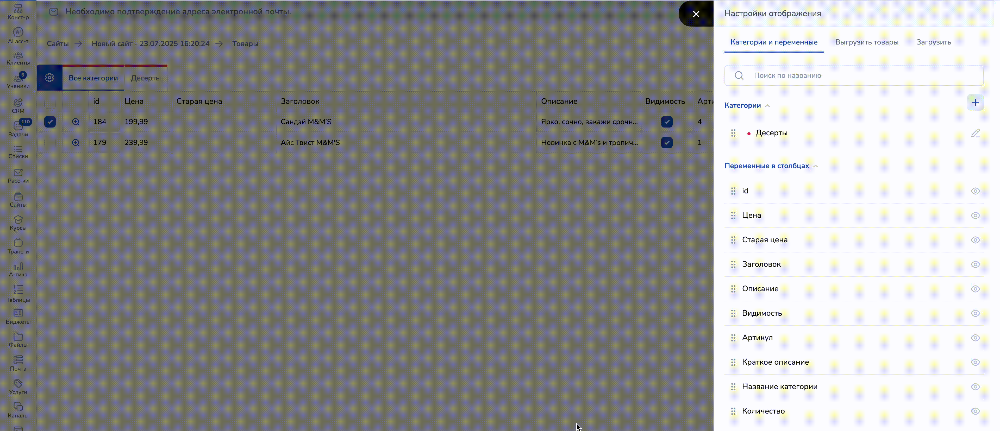

# Как создать интернет-магазин

Перейдите в раздел сайты и нажмите на кнопку "Создать":

<figure><figcaption></figcaption></figure>

При клике на кнопку "Создать" откроется выпадающее меню с типами сайта, где нужно выбрать "Интернет-магазин":

<figure><figcaption></figcaption></figure>

После клика по кнопке "Интернет-магазин" вы перейдете в настройки сайта, где нужно открыть вкладку "Товары":

<figure><figcaption></figcaption></figure>

## Категория товаров

При переходе в раздел "Товары" вы увидите шаблоны карточек товаров:

<figure><figcaption></figcaption></figure>

Можно перейти сразу к настройке самих товаров, но если вы хотите категоризировать товары, чтобы ваши покупатели легко могли найти нужный предмет на сайте по категории, то рекомендуем для начала создать категории.&#x20;

Для этого нажмите на шестеренку:

<figure><figcaption></figcaption></figure>

После чего откроется меню справа с настройками категорий:

<figure><figcaption></figcaption></figure>

Нажмите на кнопку "Создать категорию":

<figure><figcaption></figcaption></figure>

В открывшемся окне пропишите название категории и выберите цвет (будет отображен в таблице с товарами).

<figure><figcaption></figcaption></figure>

Также в настройках категории вы можете менять отображение столбцов:

<figure><figcaption></figcaption></figure>


После настройки категории можно перейти к настройкам карточек товаров.


## Как перенести товары из другой платформы?

Для примера мы выгрузили таблицу с товарами, созданную вручную в разделе "[Таблицы](/broken/pages/aL2b6x8POVavpbwh18Xo)" в Сейлбот:

<figure><figcaption></figcaption></figure>

При необходимости переноса интернет-магазина из одного сайта  или другого сервиса в Сейлбот, воспользуйтесь вкладками для загрузки товаров в настройках категорий:

<figure><figcaption></figcaption></figure>

В настройках категории существуют вкладка "Загрузить". Нажмите на одноименную кнопку для загрузки таблицы с карточками товаров:

<figure><figcaption></figcaption></figure>

Далее после загрузки файла с таблицей, где лежат выгруженные вами карточки товара из другой платформы, необходимо сопоставить колонки.

<figure><figcaption></figcaption></figure>

После загрузки таблицы с товарами вы увидите:

1. **Первая колонка таблицы:** в ней отображаются наименования ваших столбцов из загружаемой таблицы.

<figure><figcaption></figcaption></figure>

Столбцы соответствуют названиям колонки в таблице:

<figure><figcaption></figcaption></figure>

2. **Во второй колонке таблицы** приводятся примеры значений, которые лежат в во второй строке после наименований столбцов:

<figure><figcaption></figcaption></figure>

<figure><figcaption></figcaption></figure>

3. **Колонка товара**: поможет сопоставить (или пропустить, если колонка не нужна) значения столбцов загружаемой таблицы с колонками товара:

<figure><figcaption></figcaption></figure>

<figure><figcaption></figcaption></figure>

Далее нажмите "Загрузить товары":

<figure><figcaption></figcaption></figure>


Готово!&#x20;

Так вы сможете быстро загрузить товары в Сейлбот и запускать свой интернет-магазин.


При необходимости можно отредактировать карточку товара, кликнув на значок лупы в строке товара:

<figure><figcaption></figcaption></figure>

## **Как скачать карточки товаров?**

Чтобы скачать созданные карточки товаров из одного сайта в другой, воспользуйтесь вкладкой для выгрузки в настройках категорий:

<figure><figcaption></figcaption></figure>

В настройках категории существует вкладка "Выгрузить товары".

**Выгрузить товары:** здесь можно настроить, какие именно столбцы из таблицы с карточками товаров вы хотели бы выгрузить (скачать на устройство) и перенести в другой проект.

<figure><figcaption></figcaption></figure>

Чтобы убрать ненужные столбцы, достаточно в строке с наименованием столбца убрать галочку.&#x20;

Далее нажмите на "Выгрузить товары" — тогда карточки товаров в формате таблицы будут скачаны на ваше устройство:

<figure><figcaption></figcaption></figure>

## Карточка товара

Чтобы создать новую карточку, нажмите на круглую кнопку "+":

<figure><figcaption></figcaption></figure>

Вам откроется окно настроек товара:

<figure><figcaption></figcaption></figure>

Чтобы отредактировать существующую карточку товара, нажмите на лупу в строке товара:

<figure><figcaption></figcaption></figure>

Здесь вам необходимо заполнить заголовок, загрузить фото (одно или несколько) и добавить описание:

<figure><figcaption></figcaption></figure>

Далее укажите стоимость товара и иные его характеристики:\
а) категория товара;\
б) цена (например, нынешняя и старая — для отображения скидок для товаров);\
в) артикул товара;\
г) количество товара (можно прописать доступное (оставшееся) количество товара в вашем магазине);\
д) краткое описание и др.:

<figure><figcaption></figcaption></figure>

Далее при необходимости добавьте характеристики товара и нажмите "Сохранить":

<figure><figcaption></figcaption></figure>

После чего карточка товара появится в таблице во вкладке "Товары".

Чтобы добавить еще товары, нажмите на круглую кнопку "+":

<figure><figcaption></figcaption></figure>

### Расширенные настройки цены

Для работы с оптовыми закупками или для начисления дополнительной скидки за покупку более одного товара, в карточке товара существует расширенная настройка цены.

Шаг 1. Перейдите в настройки карточки товара:

<figure><figcaption></figcaption></figure>

Шаг 2. В открывшемся меню настроек найдите поле "Расширенные настройки цены" и поставьте галочку:

<figure><figcaption></figcaption></figure>

Шаг 3. Далее откроется настройки, чтобы установить количество товара и указание скидки при указанном количестве:

<figure><figcaption></figcaption></figure>

Шаг 4. Укажите количество товара (поле принимает только числовое значение) и скиду (только числовое значение):

<figure><figcaption></figcaption></figure>

Можно указать несколько значений для настроек цены, кликнув по кнопке "Добавить условие".

Шаг 5. Нажмите "Сохранить":

<figure><figcaption></figcaption></figure>


Важно!

Скидка начинает учитываться с указанного Вами значения + 1.

Это значит, что если вы укажете скидку от 5 товаров, то скидка будет считаться от 6 товаров и т.д.


## Быстрый запуск

После того как вы заполнили таблицу с карточками товара, в разделе "Товары" вы найдете ссылку на каталог товаров — в нем уже автоматически будут сформированы все карточки с товарами со заполненной вами информацией.&#x20;

Чтобы найти ссылку на каталог товаров, перейдите в настройки — для этого нажмите на шестеренку:

<figure><figcaption></figcaption></figure>

Откроется меню справа, где нужно перейти во вкладку "Настройки каталога":

<figure><figcaption></figcaption></figure>

В настройках каталога вы увидите ссылку на каталог:

<figure><figcaption></figcaption></figure>


Важно!&#x20;

В каталоге товаров после заполнения карточек уже автонастроена корзина, отображения товаров и карточки для быстрого запуска.

Если вам необходимо настроить сайт с каталогом товаров определенным образом, отобразить необходимые товары или не отображать какую-либо категорию, то ознакомьтесь с настройками в статье "[Настройки интернет-магазина](/broken/pages/TnjydvmMWiOl02DWEaws)".


Чтобы для карточки товара была создана отдельная страница, нужно активировать переключатель "Карточка товара на отдельной странице":

<figure><figcaption></figcaption></figure>

Если нужно отображение карточки товара в виде pop-up без перехода на отдельную страницу товара, то переключатель должен быть в неактивном положении.

Также в настройках каталога вы сможете назначить шапку и футер для каталога:

<figure><figcaption></figcaption></figure>

### Футер и шапка каталога


Важно!&#x20;

Футер для каталога настраивается отдельно. Для этого перейдите обратно во вкладку со страницами интернет-магазина.


<figure><figcaption></figcaption></figure>

Далее нажмите на создать страницу:

<figure><figcaption></figcaption></figure>

И выберите пустой шаблон:

<figure><figcaption></figcaption></figure>

В открывшейся странице нажмите "+" и выберите в правом списке секцию "Меню":

<figure><figcaption></figcaption></figure>

Тогда секция будет добавлена на новую страницу и откроются настройки контента:

<figure><figcaption></figcaption></figure>

Здесь вы сможете настроить кнопки с переходом, загрузить логотип, кастомизировать меню по собственному дизайну:

<figure><figcaption></figcaption></figure>


О подробных настройках секции рассказали в статье "[Секция меню](/broken/pages/1UThpTPciQsbPECtlvuK)"


После заполнения контентом секции "Меню" перейдите в настройки страницы:

<figure><figcaption></figcaption></figure>

Далее во вкладку "Основная информация":

<figure><figcaption></figcaption></figure>

И в настройках основной информации измените название в списке — это поможет в дальнейшем быстрее найти меню для каталога:

<figure><figcaption></figcaption></figure>

Далее сохраните настройки основной информации о странице:

<figure><figcaption></figcaption></figure>

А затем нажмите "Сохранить и выйти":

<figure><figcaption></figcaption></figure>

Аналогично создайте страницу для настройки футера.&#x20;


О подробных настройках футера рассказали в статье "[Секция футер](/broken/pages/ONr9Jh8eFZVs3CD2bQm6)".


Теперь перейдите во вкладку "Товары":

<figure><figcaption></figcaption></figure>

Затем перейдите в "Настройки каталога" в настройке товаров:

<figure><figcaption></figcaption></figure>

Теперь выберите в поле "Назначить шапку" и "Назначить подвал" страницы с шапкой и футером.&#x20;


Готово!&#x20;

Теперь вы знаете, как настраивать футер и шапку для каталога товаров.&#x20;

При этом, шапка и футер отображаются не только на основной странице каталога, но и на отдельной странице карточки товара.


## Работа с переменными

Можно указывать количество товаров, используя переменные из настроек проекта. Для этого в таблицах с товарами существует колонка "Переменная количества":

<figure><figcaption></figcaption></figure>

В данной колонке можно прописать название переменной, которую вы назначили в настройках проекта.


Это может быть удобно, если ваш ассортимент часто пополняется: тогда достаточно будет обновить значения в переменной и обновленное количество товара подтянется в каталогах.


Чтобы найти (создать) необходимые переменные, перейдите в настройки проекта:

<figure><figcaption></figcaption></figure>

Скопируйте название переменной, кликнув по ней левой кнопкой мыши:

<figure><figcaption></figcaption></figure>

Если у вас еще нет нужной переменной, нажмите на иконку карандаша:

<figure><figcaption></figcaption></figure>

Далее кликните на "Добавить переменную":

<figure><figcaption></figcaption></figure>

Затем пропишите название переменной и ее значение:

<figure><figcaption></figcaption></figure>

И нажмите "Готово", после чего кликните по переменной левой кнопкой мыши, чтобы скопировать ее:

<figure><figcaption></figcaption></figure>

Теперь перейдите обратно к товарам в интернет-магазине и вставьте переменную в строке с товаром в колонке "Переменные количества":

<figure><figcaption></figcaption></figure>

В колонке "Количество" автоматически подтянутся данные из переменной.

## Как добавить товары на сайт без каталога

<figure><figcaption></figcaption></figure>

Товары на сайт можно добавить без использования каталога: например, если вы хотите показать ваш ассортимент на главной странице сайта, а каталог товара разместить на другой странице.

Сделать это просто — для этого нужно вставить в универсальном блоке ссылку вида:

`# order:Название товара=1000 или # order:Название товара=1000:::ссылка на картинку(без пробела)`&#x20;

Пример готовой ссылки:

`#order:iPhone 17 Pro Max=99999:::https://files.salebot.pro/uploads/file_item/file/499288/vmgi22f3pbc14eyvfvg7n2aq1761sgvs-Photoroom.png`


Как работать с универсальным блоком, рассказали в [одноименной статье.](/broken/pages/JJ6ATiOGjG9qZKXQtXfI)


### Настройки

Шаг 1. Перейдите в раздел "Сайты" и нажмите на ваш сайт:

<figure><figcaption></figcaption></figure>

Шаг 2. Нажмите на страницу, где хотите показывать свой товар:

<figure><figcaption></figcaption></figure>

Шаг 3. Создайте универсальный блок (или нажмите "Редактировать", если у вас уже есть готовый универсальный блок):

<figure><figcaption></figcaption></figure>

Шаг 4. Нажмите "Контент" или "Редактировать":

<figure><figcaption></figcaption></figure>

Шаг 5. Добавьте элемент "Кнопка":

<figure><figcaption></figcaption></figure>

Шаг 6. Добавьте в поле URL ссылку вида&#x20;

\#order:iPhone 17 Pro Max=99999:::https://files.salebot.pro/uploads/file\_item/file/379092/lzx66ri48d3sxf0k60az3m6nof9ob687-Photoroom.png

<figure><figcaption></figcaption></figure>

Шаг 7. Нажмите "Сохранить":

<figure><figcaption></figcaption></figure>

На этом настройка закончена.

Теперь можно добавить текстовые элементы и картинки:

<figure><figcaption></figcaption></figure>

Теперь сохраните настройки универсального блока:

<figure><figcaption></figcaption></figure>

Теперь с помощью кнопки из универсального блока клиенты смогут добавлять товары в корзину на сайте:

<figure><figcaption></figcaption></figure>
