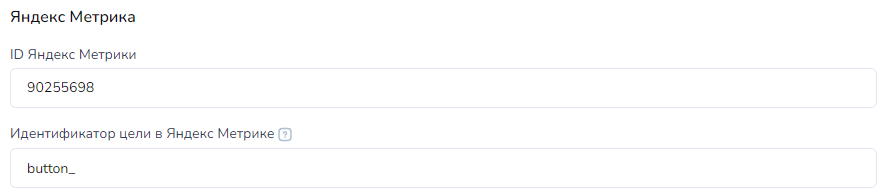

# Аналитика сайта

Данная вкладка необходима для настройки аналитики на сайте:

<figure><figcaption><p>Настройки сайта → Аналитика</p></figcaption></figure>

## Аналитика маркетинга и продаж

**Добавить клиенту метку.** При запуске бота со страницы сайта клиенту будет установлена метка. Её можно увидеть в разделе Клиенты в диалоге. По наличию метки можно фильтровать клиентов и работать в разделе Списки → вкладка Метки.

**Добавить клиента в список.** При запуске бота со страницы сайта клиент будет добавлен в указанный в настройках страницы сайта список. Увидеть списки, в которых есть клиент, можно в разделе Клиенты в диалоге. По наличию клиента в списках можно фильтровать клиентов и работать в разделе Списки. Выдавать различные доступы и настраивать работу бота

Пример настройки добавления клиентам метки и списка:

<figure><figcaption><p>Настройки минилендинга</p></figcaption></figure>

Где смотреть наличия у клиента меток и в какие списках состоит:

<div align="left"><figure><figcaption></figcaption></figure></div>

**Идентификатор сайта CoMagic.**&#x20;

Подключение к минилендингу сквозной аналитики через сервис CoMagic. Подробнее про настройку на стороне CoMagic можно найти на стороне сервиса. В настройках минилендинга достаточно указать Идентификатор сайта, полученный в  CoMagic

<figure><figcaption></figcaption></figure>

**Сохранение в переменные клиента значений из куки.** &#x20;

Для создания сквозной аналитики  можно включить на минилендинге передачу в бота значений куки клиента. И дальше передавать их в системы сквозной аналитики. \
\
Доступные варианты:

<figure><figcaption></figcaption></figure>

Пример переменных клиента, который запустил бота с минилендинга:

<div align="center"><figure><figcaption><p>Пример переменных клиента в диалоге в разделе Клиенты</p></figcaption></figure></div>

В переменные клиента записались данные из куки: Google Client ID, Yandex Client ID, Client IP address, User agent. Остальные сервисы к минилендингу не подключены.

**Пиксель ВКонтакте.** К данному минилендингу можно подключить пиксель ВКонтакте. В данном поле укажите код пикселя.&#x20;

<div align="left"><figure><figcaption><p>Настройка минилендинга</p></figcaption></figure></div>

**Пиксель Facebook.**  К данному минилендингу можно подключить пиксель Facebook. В данном поле укажите код пикселя. &#x20;

<div align="left"><figure><figcaption><p>Настройка минилендинга</p></figcaption></figure></div>

## Сквозная аналитика сторонними сервисами

Для создания сквозной аналитики на сайте отметьте галочками чекбоксы для передачи в бота значений куки клиента.&#x20;

И дальше можно передавать значения из этих куки в системы сквозной аналитики. Например, в Roistat.

<figure><figcaption></figcaption></figure>

Описание доступных интеграций с сервисами аналитики и инструкции по их настройке можно узнать в разделе Интеграции - > Аналитика:



## Google Аналитика

К минилендингу, созданному в Salebot, можно подключить Google Аналитику. Для этого создайте поток данных с указанием домена вашего минилендинга в Google Аналитике, создайте событие-конверсию и укажите данные в настройках минилендинга:

<figure><figcaption><p>Настройки в минилендинге</p></figcaption></figure>

Подробнее о том как подключить и настроить Google Аналитику рассказано в статье:


Подключение и настройка Google Аналитики


_**Создайте событие конверсии для каждой кнопки отдельно или одну цель для всех кнопок.**_

&#x20;Если вы передадите название события в виде "button\_" со знаком "\_" в конце, то конверсия будет отправлена для каждой кнопки мессенджера разная.\
Например: \
"button\_vk" - для ВКонтакте \
"button\_telegram" - для Телеграм. \
\
В конец будет добавлено: \
vk - Вконтакте \
telegram - Телеграм \
viber - Viber \
facebook - FaceBook \
whatsapp - WhatsApp \
ok - Одноклассники \
instagram - Instagram \
\
Если вы передадите идентификатор без нижнего подчеркивания в конце, для всех кнопок будет действовать одинаковое событие конверсии, название которого передано в данное поле.

_<mark style="color:green;">Пример настроек Google Аналитики  на клики по кнопкам каждого мессенджера по отдельности:</mark>_

<div align="left"><figure><figcaption></figcaption></figure></div>

_Настройка конверсий на стороне Google Аналитики:_

<figure><figcaption></figcaption></figure>

## Яндекс Метрика

К минилендингу, созданному в Salebot, можно подключить Яндекс.Метрику. Для этого создайте счётчик в Яндекс.Метрике, создайте цель и укажите данные в настройках минилендинга:

<figure><figcaption></figcaption></figure>

**ID Яндекс Метрики.** Укажите ID счётчика Я.Метрики&#x20;

**Идентификатор цели в Яндекс Метрике.** Укажите идентификатор цели события.

Если передадите идентификатор цели без нижнего подчеркивания в конце, для всех кнопок на минилендинге будет действовать одинаковая Цель, идентификатор которого передан в поле.

Если передадите идентификатор в виде "button\_" со знаком "\_" в конце, то цель будет отправлена для каждой кнопки мессенджера разная.&#x20;

Например, настройка целей в Метрике: \
"button\_0" - для ВКонтакте \
"button\_1" - для Телеграм. \
\
Идентификаторы мессенджеров для настроек на стороне Метрики: \
0 - Вконтакте \
1 - Телеграм \
2 - Viber \
3 - FaceBook \
6 - WhatsApp \
8 - Одноклассники \
10 - Instagram&#x20;

_<mark style="color:green;">Пример как настроить на клики по кнопкам разных мессенджеров:</mark>_

<div align="left"><figure><figcaption><p>Настройки в минилендинге</p></figcaption></figure></div>

_Настройки на стороне Яндекс.Метрика:_

<div align="center"><figure><figcaption><p>Настройки в Яндекс.Метрике</p></figcaption></figure></div>

### Как подключить Яндекс Метрику

 (1) (1).png>)


Для подключения Метрики необходимо в первое вписать ID Яндекс Метрики.&#x20;


Первое поле принимает в себя ID счетчика Яндекс Метрики, его вы можете увидеть на странице Яндекс Метрики в разделе “Сводка” вверху возле Имения счетчика и Адреса сайта, на рисунке выделено



Вставка ID счетчика равносильна добавлению “Код счетчика” на сайт


Это значительно сокращает время на интеграцию Яндекс Метрики в Ваш минилендинг.\
Во второе поле, в настройках минилендинга, вы можете вписать идентификатор Цели для отслеживания нажатий по кнопкам мессенджеров. Для этого вам следует создать цель/цели на сайте Яндекс Метрики. Чтобы это сделать, перейдите в раздел “Цели” и нажмите кнопку “Добавить цель”. У вас откроется попап меню для создания новой Цели.


В поле “Название” вы можете написать что угодно. В графе “Тип условия” нужно выбрать “JavaScript-событие”. После этого ниже появится поле “Идентификатор цели”. В него нужно занести идентификатор, который вы позже укажите в настройках минилендинга.


Цель будет срабатывать по нажатию на любую кнопку минилендинга.&#x20;



Если вы хотите разделить цели по нажитию на разные кнопки минилендинга, название цели должно заканчиваться на знак подчеркивания "\_"


Пример:\
Если вы передадите в наше поле “click\_button”, тогда вам в Яндекс Метрику будет передаваться одна Цель по клику на любой из мессенджеров.&#x20;

Цель с идентификатором “click\_button”.\
Однако, если вы передадите в наше поле “click\_button\_” (у которого в конце стоит “\_” знак нижнего подчеркивания), в вашу Яндекс Метрику будет передаваться разная цель для разного мессенджера,\
click\_button\_0 - по клику на ВКонтакте\
click\_button\_1 - по клику на Телеграм\
click\_button\_2 - по клику на Viber\
click\_button\_3 - по клику на FaceBook\
click\_button\_6 - по клику на WhatsApp\
click\_button\_8 - по клику на Одноклассники\
click\_button\_10 - по клику на Instagram<br>

Сам идентификатор может быть любой. Главное, чтобы в конце было нижнее подчеркивание. К нему будет добавлен индекс мессенджера.

Пример правильно заполненных полей в настройках  сайта и правильно созданных целей в Яндекс Метрике:


### Яндекс Метрика - оффлайн конверсии

СОЗДАНИЕ СЧЕТЧИКА ЯНДЕКС МЕТРИКИ

Для начала сбора оффлайн конверсий в Яндекс.Метрику с Salebot необходимо зарегистрировать Яндекс.Метрику.

**1.** **Если у Вас нет аккаунта Яндекс.Метрики**, следует войти в ваш аккаунт Яндекс почты (или зарегистрировать новый). Далее перейти в[ Яндекс.Метрику](https://metrika.yandex.ru/list?) и нажать добавить счетчик. В настройках счетчика указать следующие данные:

1. Имя счетчика
2. Адрес сайта - в примере ссылка на минилендинг Salebot (и далее пример будет построен на нем).
3. Автоматические цели и Вебвизор, карта скроллинга и аналитика форм - рекомендуем включить обе галочки для сбора большего количества информации.

<figure><figcaption></figcaption></figure>

После заполнения страницы жмем “Создать счетчик”. На открывшейся странице выбираете html-код и копируете весь код, появившийся внизу. Настройки для “Контентной аналитики” и “Электронной коммерции” устанавливайте на свое усмотрение, если они Вам необходимы. Копируем код и вставляем на минилендинг (см. чуть ниже). Затем нажимаем кнопку “Начать пользоваться”.

<figure><figcaption></figcaption></figure>

В редактировании минилендинга, добавьте код во вкладке “Настройки” - “CSS и JS” - HTML-код head(или HTML-код body) и сохранить.

<figure><figcaption><p>Открыть Настройки</p></figcaption></figure>

<figure><figcaption><p>Перейти в раздел CSS и JS</p></figcaption></figure>

Жмем сохранить.&#x20;

Переходим в меню Метрики, где видим список созданных счетчиков. Забираем номер счетчика и записываем его  в переменную проекта ym\_counter\_id (настройки проекта - константы проекта)

<figure><figcaption></figcaption></figure>

<figure><figcaption></figcaption></figure>

**2. Если у Вас есть аккаунт в Яндекс Метрике**, то следует зайти в счетчик, по которому Вы хотите собирать статистику и записать его номер в переменную проекта ym\_counter\_id (настройки проекта - константы проекта). Настраивать счетчик заново Вам не нужно, просто вносим переменную как показано на скриншоте выше и переходим сразу к следующему пункту.&#x20;

В созданном счетчике следует перейти в настройки - загрузка данных и включить передачу оффлайн конверсий.

<figure><figcaption></figcaption></figure>

Далее выйдет уведомление о том, что учет оффлайн конверсий станет доступен в течение суток. Следует помнить, что на данный момент обработка запросов может занимать до 24 часов и появится в статистике метрики лишь на следующие сутки. Сбор информации по цели доступен в течение 21 дней, далее данные будут затираться.

<figure><figcaption></figcaption></figure>

РЕГИСТРИРУЕМ ПРИЛОЖЕНИЕ ЯНДЕКСА И ПОЛУЧАЕМ ТОКЕН АВТОРИЗАЦИИ ДЛЯ ПОДКЛЮЧЕНИЯ API ЯНДЕКС.МЕТРИКИ К SALEBOT

Ссылка на документацию API Яндекс.Метрики, в которой описан Вызов API Яндекс.Метрики из браузера [https://yandex.ru/dev/metrika/doc/api2/intro/browser.html](https://yandex.ru/dev/metrika/doc/api2/intro/browser.html)

Для работы с API из браузера необходимо использовать [авторизационный токен](http://api.yandex.ru/oauth/doc/dg/concepts/authorization-scheme.xml). Чтобы получить токен:

1. [Создайте приложение](https://oauth.yandex.ru/client/new), при этом заполните поля:
   * название — можно указать произвольно;
   * иконка сервиса — необязательно;
   * платформы приложения — выберите веб-сервисы;
   * redirect URI — укажите https://oauth.yandex.ru/verification\_code;
   * доступ к данным — **укажите metrika:read и metrika:write.**
2. Нажмите Создать приложение и скопируйте его ClientID (напротив идентификатора нажмите значок ).
3.  Добавьте скопированный ClientID в ссылку вида

    ```
    https://oauth.yandex.ru/authorize?response_type=token&client_id=<идентификатор приложения>
    ```
4. Перейдите по ссылке и на открывшейся странице скопируйте ваш авторизационный токен.

<mark style="color:green;background-color:green;">1) Регистрируем приложение Яндекса</mark>&#x20;

Для получения данных для связи Яндекс Метрики с Salebot необходимо зарегистрировать [приложение](https://oauth.yandex.ru/client/new) (по ссылке https://oauth.yandex.ru/client/new)

При переходе по ссылке откроется страница:

<figure><figcaption></figcaption></figure>

Далее заполняем данную форму:

<figure><figcaption></figcaption></figure>

1. Введите имя приложения. При желании добавьте иконку.
2. В подпункте “Платформы приложения” выберите веб-сервисы. Укажите `https://oauth.yandex.ru/verification_code`&#x20;

3\. В подпункте “Доступ к данным” выберите поочередно `metrika:read` и `metrika:write`


**ПРИМЕЧАНИЕ**

Вы можете по своему усмотрению подключить и другие сервисы для приложения, если собираетесь использовать его где-то еще, однако стоит иметь ввиду, что часть пунктов сокращают жизнь токена авторизации до полугода, а то и до 7 дней


<figure><figcaption><p>сокращает жизнь токена до 7 дней</p></figcaption></figure>

<figure><figcaption><p>сокращает с года до 180 дней</p></figcaption></figure>

После нажатия на кнопку Создать приложение будет переход на следующую страницу:

<figure><figcaption></figcaption></figure>

Вы получаете данные для получения авторизационного токена для связи с API Salebot - ClientID. (в примере 04cb02016fa54163a9e14b5bb6e\*\*\*\*\*). Скопируйте его.

<mark style="color:green;">2)</mark> <mark style="background-color:green;">Получение токена авторизации</mark>

Для получения токена авторизации следует перейти по ссылке вида `https://oauth.yandex.ru/authorize?response_type=token&client_id={clientID}`

где {clientID} в ссылке замените на значение ClientID скопированный в шаге выше

В нашем случае, токен будет располагаться по ссылке "https://oauth.yandex.ru/authorize?response\_type=token\&client\_id=04cb02016fa54163a9e14b5bb\*\*\*\*\*\*"\
Перейдя по ней, вы увидите окно авторизации в приложение, и, подтвердив вход, получите окно с токеном. Сохраните его в переменные проекта(настройки проекта - константы проекта).&#x20;

<figure><figcaption></figcaption></figure>

<figure><figcaption></figcaption></figure>

<figure><figcaption></figcaption></figure>


**ВАЖНО!**

Время жизни токена - год или меньше: зависит от настроек приложения. Через год необходимо будет заново перепройти по той же ссылке и сохранить новый токен авторизации на новый год.&#x20;

Если при выполнении функций по связи с метрикой, Вы получите уведомление системы по типу “Expired or wrong token. Please, check or refresh your ym\_oath\_token”, повторите действия из этого пункта и замените токен.&#x20;


Проверяем в настройках проекта все внесенные данные. Все готово, приступаем к настройке Целей.

#### НАСТРОЙКА ЦЕЛЕЙ ТИПА JAVA-SCRIPT СОБЫТИЕ ДЛЯ СБОРА ИНФОРМАЦИИ ПО ОФФЛАЙН-КОНВЕРСИЯМ

Итак, мы имеем счетчик метрики.

<figure><figcaption></figcaption></figure>

<mark style="color:orange;">**1.Ручное создание цели в Яндекс. Метрике**</mark>&#x20;

Нажимаем создать цель - добавить цель.&#x20;

<figure><figcaption></figcaption></figure>

В меню настройки целей:

1. задаем название цели - например, старт разговора с ботом.
2. Выбираем тип **JavaScript-событие**.&#x20;


<mark style="color:red;">**ВНИМАНИЕ!!!**</mark> Сбор оффлайн-конверсий Яндекса работает только с этим типом целей. Оффлайн сбор информации по другим целям работать не будет!


&#x20;3\. Устанавливаем идентификатор цели - <mark style="color:green;">**любое значение(цифры)**</mark> - и ставим маркер на “совпадает”.&#x20;

В примере идентификатором цели является число 666, этот идентификатор понадобится нам в будущем как переменная ym\_js\_event\_id.

4\. По желанию, Вы можете указать доход с цели&#x20;

<figure><figcaption></figcaption></figure>

Нажимаем “добавить цель”.

<mark style="color:orange;">**2.Создание НОВОЙ цели через функцию в Salebot**</mark>


Функция (API в калькуляторе) для создания новой цели **ym\_create\_js\_event\_goal()** работает только <mark style="color:green;">на тарифе Премиум</mark>!


В Salebot есть функция создания цели типа JS-событие, \
**ym\_create\_js\_event\_goal(name,price, oauth\_token,counter\_id)**, где \
\
Обязательный параметр:\
<mark style="color:red;">**!**</mark>**&#x20;name** - это имя цели, обязательный параметр, строка \
\
Необязательные параметры:\
**price** - стоимость цели, необязательный параметр, число&#x20;

_<mark style="color:blue;">**Если у вас 2 и более аккаунта нужно передавать данные в параметрах:**</mark>_

**oauth\_token** - токен авторизации&#x20;

**counter\_id** - номер счетчика


**Обращаем внимание!**

**oauth\_token** и **counter\_id**  в параметрах функции **приоритетнее** тех, что указаны в настройках проекта.&#x20;


Пример: \
Создадим две цели, одна(‘Haos goal’) - со стоимостью, другая(‘Free goal’) без нее

<figure><figcaption></figcaption></figure>

Результатом выполнения будет список, состоящий из номера цели (ym\_goal\_id), ее имени (ym\_goal\_name) и идентификатора отслеживания события (ym\_js\_event\_id). В переменных также можно найти этот список с характеристиками целей. А в Яндекс Метрике появятся заявленные цели:

<figure><figcaption></figcaption></figure>

<figure><figcaption></figcaption></figure>

<figure><figcaption></figcaption></figure>

**Дополнительно. Вывод информации обо всех целях в Salebot** \
Если Вы запамятовали данные о своих целях в Яндекс Метрике и хотите вывести их все в переменную в Salebot, воспользуйтесь функцией \
**ym\_info\_about\_goals(ym\_goal\_id, oauth\_token, counter\_id)**, где&#x20;

1. **ym\_goal\_id** - необязательный параметр. &#x20;

&#x20;Если параметр указан, то информация подгрузится о конкретной цели с данным идентификатором.

Если вы не хотите указывать данный параметр, то вместо него пропишите <mark style="color:red;">**"None"**</mark> (в кавычках!).

_<mark style="color:blue;">**Если у вас 2 и более аккаунта нужно передавать данные в параметрах:**</mark>_

2. **oauth\_token** - токен авторизации&#x20;
3. **counter\_id** - номер счетчика


Обращаем внимание!

**oauth\_token** и **counter\_id**  в параметрах функции  **приоритетнее** тех, что указаны в настройках проекта.&#x20;


Пример:

<figure><figcaption></figcaption></figure>

Ответом является список, состоящий из словарей с goal\_id, name, js\_event\_id всех целей. Если цель не является JS-событием, то js\_event\_id будет содержать ссылку/указание на соц. сеть/другой идентификатор. Если указать их при выгрузке конверсий, система Яндекс Метрики их просто не зачтет и вернет ошибку.

<figure><figcaption></figcaption></figure>

Информация об одной конкретной цели содержит словарь с данными.

<figure><figcaption></figcaption></figure>

### Отправка оффлайн конверсий в Яндекс метрику

Функция (API в калькуляторе) для передачи офлайн-конверсий из бота  **ym\_send\_offline\_conversions()**

Для того чтобы отправить данные в Яндекс Метрики, следует использовать функцию **ym\_send\_offline\_conversions(js\_event\_id, client\_id\_type, time\_delta, oauth\_token, counter\_id, comment** **)**, где:&#x20;

<table><thead><tr><th width="328.75390625">Параметр</th><th>Описание</th></tr></thead><tbody><tr><td><mark style="color:red;"><strong>!</strong></mark> <strong>ym_js_event_id</strong></td><td>идентификатор отслеживания события, <strong>обязательный параметр</strong>, число. </td></tr><tr><td><strong>client_id_type</strong></td><td>позволяет использовать по выбору yclid или _ym_uid для идентификации пользователя. Для использования yclid в этом параметре передайте 'yclid', во всех иных случаях будет отрабатывать как раньше</td></tr><tr><td><strong>time_delta</strong></td><td>количество секунд, что необходимо вычесть из времени в которое выполняется функция. Чаще всего не требуется, но в редких случаях может помочь решить вопрос с конверсией, что пришла в "неподходящее" время. Подбирать параметр рекомендуется, начиная с 5.</td></tr><tr><td><em><mark style="color:blue;"><strong>Если у вас 2 и более аккаунта нужно передавать данные в параметрах:</strong></mark></em></td><td></td></tr><tr><td><ol><li><strong>oauth_token</strong></li></ol></td><td>токен авторизации </td></tr><tr><td><ol start="2"><li><strong>counter_id</strong> </li></ol></td><td>номер счетчика</td></tr><tr><td>comment </td><td>необязательный параметр, комментарий. Максимальная длина — 255 символов. Допустимы цифры, латинские и кириллические буквы</td></tr></tbody></table>


**Важно!**

**oauth\_token** и **counter\_id**  в параметрах функции  **приоритетнее** тех, что указаны в настройках проекта.&#x20;



**ВАЖНО!**

Отправка оффлайн-конверсий происходит по идентификатору клиента Яндекс. Если у клиента в переменных есть метка \_ym\_uid (как включить сбор меток в минилендингах смотрите в соответствующем разделе), он автоматически подставится в этот параметр и передаст статистику по данному клиенту.&#x20;

С момента запуска бота до передачи офлайн-конверсии должно пройти достаточно времени для передачи метки \_ym\_uid в Метрику, например, от 5-10 минут. &#x20;


<figure><figcaption></figcaption></figure>

\_ym\_uid - это clientID посетителя, присваиваемый Яндексом каждому пользователю. Он является уникальным и задается только системой Яндекс. Поэтому, если у клиента нет параметра, статистика по нему передаваться не будет. Однако, если у Вас есть данные о метке посетителя, Вы можете добавить клиенту переменную ya\_client\_id, и, если такой посетитель существует, статистика передастся.&#x20;


Если клиента с номером, указанным в ya\_client\_id, не существует, то и статистика собираться не будет&#x20;


<figure><figcaption></figcaption></figure>

Пример:\
Представим, у нас есть цели “Старт чата с ботом” и “клик по кнопке хорошо”&#x20;

<figure><figcaption></figcaption></figure>

В боте у нас создан стартовый блок с приветствием и предложением нажать на две кнопки, нажатие на одну из которых(“хорошо”) приведет нас во второй блок с поздравлением.

<figure><figcaption></figcaption></figure>

Впишем в калькулятор функцию **ym\_send\_offline\_conversions("666")**, где \
666 - идентификатор(ym\_js\_event\_id) цели “Старт чата с ботом”.

В блоке ниже, куда пользователь попадет при нажатии клавиши “Хорошо”, мы поставим ту же функцию с идентификатором второй цели - “клик по кнопке хорошо”.

<figure><figcaption></figcaption></figure>

Если посетитель с меткой \_ym\_uid прошел по этим этапам, статистика соберется и отправится в Яндекс Метрику, где потом будет обработана. Статус обработки до появления информации в статистике можно посмотреть в счетчике - настройки -загрузка данных.

<figure><figcaption></figcaption></figure>


**Внимание!**

Обработка может длиться до 24 часов! По итогу, при успешной загрузке появится значок “Выполнено”, при неуспешной - красная надпись. Это означает, что Яндекс Метрика не обнаружила клиента по заданному \_ym\_uid в своей системе.


<figure><figcaption></figcaption></figure>


**Внимание!**

Иногда системы Яндекса сбоят, и засчитывают загрузку на второй день после ее отправки, поэтому ошибочные загрузки могут выполниться через сутки после появления красной надписи, что увеличивает суммарное время обработки загрузок ДО 48 ЧАСОВ. Возможно, в будущем Яндекс починят свои лаги, но пока что следует учитывать их ошибки.


Если офлайн конверсии подключены меньше суток, то в ответ на запрос придет ошибка с указанием даты, когда данные могут быть загружены:

<figure><figcaption></figcaption></figure>

А в Метрике вы увидите ошибку:

<figure><figcaption></figcaption></figure>

## Пиксели социальных сетей

### Пиксель ВКонтакте

Для того чтобы использовать пиксель ВК, нужно создать его в рекламном кабинете, раздел Ретаргетинг.


Переходим во вкладку Пиксели и нажимаем кнопку Создать пиксель.


Называем пиксель как удобно, выбираем тематику и, возможно, убираем (или оставляем, в зависимости от ваших потребностей) птичку с Автоматически создать аудиторию.

После нажатия кнопки создать, появится окно, в котором нам нужно скопировать код пикселя для вставки на минилендинг.

 (1) (1).png>)

Переходим в настройки минилендинга в salebot и вставляем этот код, выделенный жирным.

Теперь добавим аудиторию для сбора клиентов, которые посетили лендинг. Переходим во вкладку Аудитории и нажимаем кнопку Создать аудиторию.

Вводим название и выбираем подключенный пиксель.


Создаем и переходим на лендинг, после этого статус пикселя в течение 10 минут станет **"**&#x420;аботает".


Salebot автоматически отправляет события открытия минилендинга и подписки на минилендинг.

**View** - открытие/просмотр подписной \
**Subscribe** - подписался

Посмотрели страницу

 (1) (1).png>)

Подписались

 (1) (1).png>)

### Пиксель Facebook<mark style="color:red;">\*</mark>


<mark style="color:red;">**\***</mark>**На территории Российской Федерации&#x20;**<mark style="color:red;">**запрещена деятельность**</mark>**&#x20;социальных сетей&#x20;**<mark style="color:red;">**Facebook**</mark>**&#x20;и&#x20;**<mark style="color:red;">**Instagram**</mark>**, принадлежащих компании Meta Platforms Inc**., признанная экстремистской!


Пиксель Facebook<mark style="color:red;">\*</mark> можно установить на минилендинг, созданный в Salebot.&#x20;


&#x20;Для использования пикселя Facebook<mark style="color:red;">\*</mark> у вас <mark style="color:green;">должен быть установлен свой домен</mark> на минилендинг!


Ниже разберем как это сделать.

#### **Регистрируем пиксель в facebook**<mark style="color:red;">**\***</mark>**&#x20;ads**

Переходим на страницу Events Manager: [https://www.facebook.com/events\_manager2](https://www.facebook.com/events_manager2) \
Открываем меню и выбираем пункт Events Manager


Далее нажимаем на зеленый крестик слева и выбираем:

1. Подключение нового источника данных - Интернет
2. Выберите способ подключения - Пиксель Facebook<mark style="color:red;">\*</mark>
3. Вводим название пикселя и адрес вашего минилендинга


Далее выбираем **Добавить код пикселя на сайт вручную**


Копируем код пикселя


Также его можно скопировать после создания, вот здесь:


Далее переходим в настройки минилендинга и вставляем этот номер в соответствующее поле:

 (1) (1).png>)

На этом настройка завершена. Теперь в фейсбук<mark style="color:red;">\*</mark> будет приходить два события:

**PageView** - просмотр страницы минилендинга\
**Лид** - при нажатии на одну из кнопок мессенджеров

После настройки пикселя и перехода на страницу, где он установлен (или нажатия на кнопку какого-то мессенджера), можно посмотреть тестовые события. Если они есть, то пиксель установлен верно.


а
