# Настройки контента формы

В режиме редактирования страницы с формой наведите курсором на секцию, чтобы появилась кнопка "Редактировать" для того, чтобы настроить контент секции:

<figure><figcaption></figcaption></figure>

Откроется меню с настройками контента справа:

<figure><figcaption></figcaption></figure>

## Стиль отображения

Стиль отображения формы в блоке может быть трех вариантов:

<figure><figcaption></figcaption></figure>

1. Заголовок и текст расположены сверху, форма ответов - снизу:

<figure><figcaption></figcaption></figure>

2. Заголовок и текст слева, форма справа:

<figure><figcaption></figcaption></figure>

3. Заголовок и текст справа, форма слева:&#x20;

<figure><figcaption></figcaption></figure>

## Вопросы в форме

По умолчанию в форме уже создано три вопроса:

<figure><figcaption></figcaption></figure>

Чтобы редактировать вопрос, нажмите на строку с соответствующим вопросом, тогда развернется форма настройки вопроса:

<figure><figcaption></figcaption></figure>

Так, в типе поле можно выбрать иной:

<figure><figcaption></figcaption></figure>

1. "**Выпадающий список**" - тип поля, который позволяет выводить набор возможных вариантов выбора, раскрывающиеся при нажатии на список вопросов. &#x20;

<figure><figcaption>
Настройка вопроса
</figcaption></figure>

Можно выбрать только один ответ:

<figure><figcaption>
Выбор ответа в форме
</figcaption></figure>

2. "**Выбор нескольких вариантов ответов**" - тип вопроса, с помощью которого клиент может выбрать несколько вариантов ответа:

<figure><figcaption></figcaption></figure>

Выглядит в виде чекбоксов в форме:

<figure><figcaption></figcaption></figure>

2. **"Выбор одного варианта ответа"** - соответственно данный элемент позволяет выбрать лишь один вариант ответа.&#x20;
3. "**Текстовое поле**" - элемент интерфейса, который позволит вашим клиентам выбрать свой собственный вариант ответа.&#x20;
4. **"Числовое поле"** - такой вариант принимает значения только в числовом формате:

<figure><figcaption></figcaption></figure>

При необходимости можно устанавливать чекбокс "Дробное число", чтобы форма принимала формат дробного числа.&#x20;

6. **"Календарь"** - такой элемент поможет клиентам вводить необходимую дату:

<figure><figcaption></figcaption></figure>


Также можно менять в настройках вопросов название переменной.&#x20;

Например, вместо прописанной по умолчанию переменной variable\_3, можно прописать client\_birthday, если хотите фиксировать день рождения клиента, например, для направления персональных скидок через бота в день рождения.&#x20;


Теперь в форме наш вопрос будет выглядеть следующим образом:

<figure>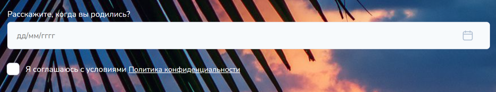<figcaption></figcaption></figure>

Чтобы добавить еще вопросы, нажмите на "Добавить вопрос":

<figure><figcaption></figcaption></figure>


Обращаем внимание!&#x20;

Для типов вопросрв для ввода номера телефона, email или имени АВТОМАТИЧЕСКИ ставится чекбокс для согласия с политикой обработки персональных данных.&#x20;

По умолчанию ссылка возле поля "Я согласен с политикой обработки персональных данных" введет на Политику обработки персональных данных Salebot. В случае необходимости, вы можете указать свою политику обработки персональных данных.&#x20;

Чтобы изменить ссылку на политику обработки персональных данных, перейдите в настройки и в поле URL введите собственную ссылку:



<figure><figcaption></figcaption></figure>

7. "**Имя**" - такой элемент в Ответах форм расположит на странице текстовое поле для ввода имени пользователем:&#x20;

В данном случае в настройке данного элемента НЕ требуется использование переменных и обязательного введения наименования опроса (по умолчанию такая форма опроса будет называться "Ваше имя", а облачная надпись, которую можно изменить в настройках, в текстовом поле - "Имя"):

8. "**Телефон**" - тип поля, позволяющий клиентам отправлять форму сбора номеров телефона для обратной связи.

При настройке данного типа поля опроса можно выбрать кастомные телефоны: доступно использование кастомных телефонов по странам, а также выставление по умолчанию определенного:

<figure><figcaption></figcaption></figure>

При выборе определенных стран в поле кастомные телефоны, на странице для клиента будет отображаться выпадающий список выбранных вами стран:&#x20;

<figure><figcaption></figcaption></figure>


Если в поле "Кастомные телефоны" не были выбраны страны, то будет отображаться весь имеющийся список стран.


Можно установить код страны по умолчанию по своему усмотрению в одноименном поле.&#x20;

Также при настройке воспользуйтесь данными переключателями:

<figure><figcaption></figcaption></figure>

где можно определить код страны по IP-адресу, использовать функцию "Только популярные телефоны" (выдаются популярные страны); а также сразу создать Whatsapp клиента для дальнейшего диалога.&#x20;

9. "**Email**" - тип поля, позволяющий клиентам передавать свои почтовые адреса. Функционал аналогичен типу полю "Имя", где не требуется настройки переменных и обязательного ввода наименования опроса.&#x20;

После каждого из типа опроса можно установить переключатель "Обязательный вопрос" - в данном случае форма, например, заявки не отправится в проект, если пользователь, перешедший на страницу, не заполнит обязательные поля:

<figure><figcaption></figcaption></figure>


На странице такие вопросы помечены символом <mark style="color:red;">\*</mark>, и если пользователь (клиент) не заполнит их, то всплывет окно ошибки:

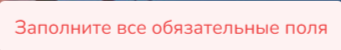


### Дополнительные настройки

С помощью дополнительных настроек в плашке вопроса можно изменить расположение и ширину полей:

<figure><figcaption></figcaption></figure>

При клике на кнопку "Дополнительные настройки" открываются настройки для установления ширины полей и объединения полей формы:

<figure><figcaption></figcaption></figure>

При активации чекбокса "объединить в один ряд со следующим полем", следующее поле будет расположено на одной строке:

<figure><figcaption></figcaption></figure>

## Выбор формы

<figure><figcaption></figcaption></figure>

Выбор формы подразумевает то, что вы хотите получить от клиентов: создать сделку или опросить целевую аудиторию по поводу имеющихся товаров, услуг и т.п. Можно использовать такие переключатели в зависимости от того, хотите ли вы получить информацию и необходимые данные от клиента (например, телефон для обратной связи или email), либо перенаправить его в чат-бота для дальнейшего диалога.&#x20;

Какие переключатели нужно использовать в зависимости от ваших целей рассказываем далее.&#x20;

**Чекбокс "Предупреждение на английском языке"**

Активируя данный переключатель, вы включаете возможность выводить ошибки в форме на английском языке.

Следующие переключатели расположены ниже настройки вопросов и позволяют отобразить форму опроса в различном виде:

1. "**Форма в модальном окне**" - данный переключатель откроет Форму опроса с помощью кнопки в отдельном модальном окне на сайте:

<figure><figcaption></figcaption></figure>

При нажатии на нее откроется окно:

<figure>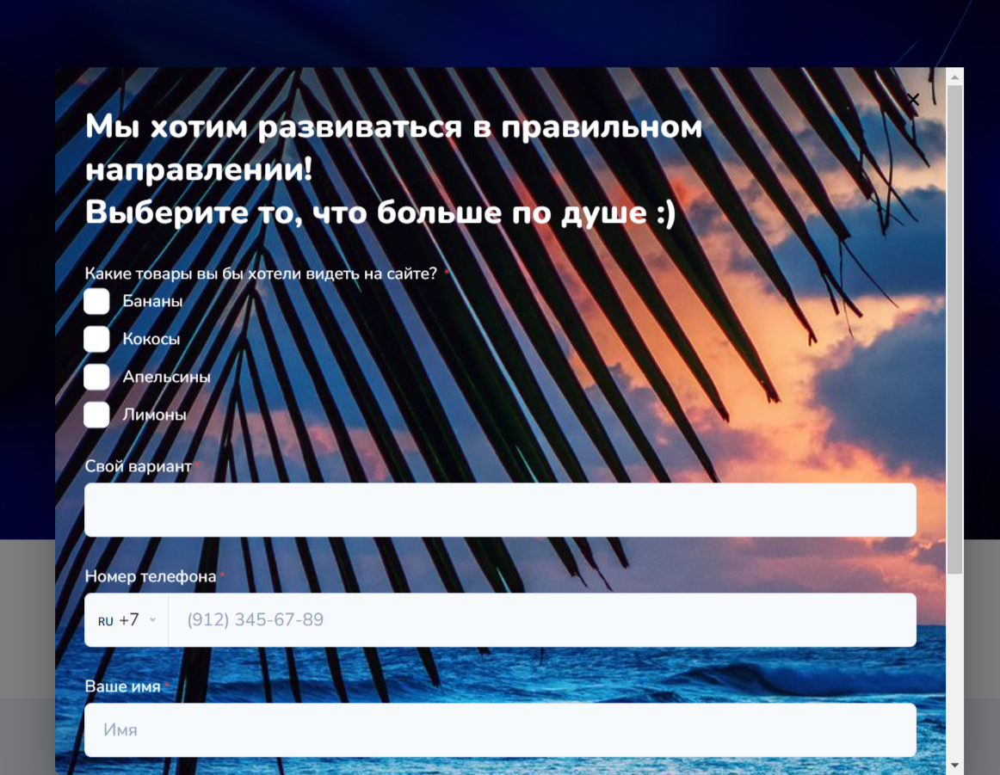<figcaption></figcaption></figure>

При активизации данного переключателя происходит запись ответов во вкладку "**Ответы форм**" и создание сделки.&#x20;

Чтобы настроить открытие формы опроса в отдельном окне необходимо:

_Шаг 1_. Присвоить ID секции для формы опроса:

<figure>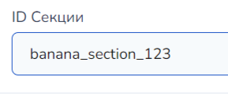<figcaption></figcaption></figure>

Данное поле можно найти перед настройкой шрифтов в ЭТОМ же окне настроек формы опроса.&#x20;

_Шаг 2_. Найти и добавить блок "Кнопки":

<figure>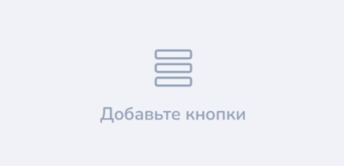<figcaption></figcaption></figure>

_Шаг 3_. В открывшемся окне настройки секции (блока) Кнопки, нажать на "Добавить кнопку":

<figure>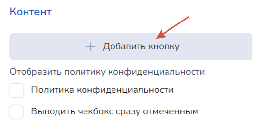<figcaption></figcaption></figure>

Далее откроется окно настройки самой кнопки, где необходимо присвоить в значение кнопки ID секции ФОРМЫ ОПРОСА и выбрать функцию "Открытие модального окна":

<figure><figcaption></figcaption></figure>


Остальные настройки кнопки можно сделать по своему усмотрению, ВАЖНО именно присвоить значение для кнопки в виде ID секции, чтобы она открывала то модальное окно опроса, которое необходимо.&#x20;

Помните, что без создания отдельного блока (секции) "Кнопки" при использовании переключателя "Форма модального окна" форма опроса отображаться не будет.&#x20;


Сохраните полученные настройки.

Готово! Теперь кнопка отображается в отдельном модальном окне, если нажать на кнопку "**Форма**" внизу страницы.&#x20;

2. Переключатель "**Форма опроса**" - отображает форму ответов непосредственно на самой странице.&#x20;

"Форма опроса" не ведет в мессенджер: вы можете создавать ее и отправлять своим клиентам для анкетирования клиентов, получения интересующих данных, поддержания обратной связи с вашей аудиторией и т.п.&#x20;

3. "**Форма создания сделки в CRM**" - данный переключатель в активном состоянии позволит добавлять сделки с клиентами в различные воронки:

<figure>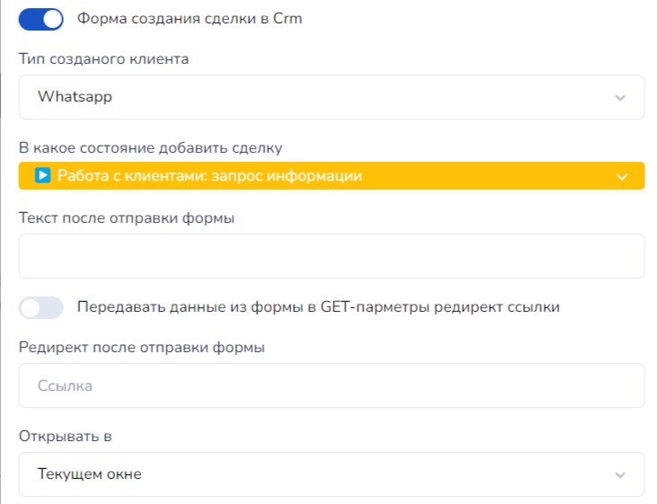<figcaption></figcaption></figure>

Также в форме создании сделки при необходимости можно выбрать тип клиента, если у вас уже подключен(ы) WhatsApp- или Email-бот.

Для удобства, с формы можно добавлять клиента в определенное состояние (стадию) воронки в CRM.&#x20;

Переключатель "**Передавать данные из формы в GET-параметры редирект-ссылки**" - необходим для передачи уникального идентификатора пользователя для ссылки, которую можно указать в поле, расположенном ниже данного переключателя:

<figure>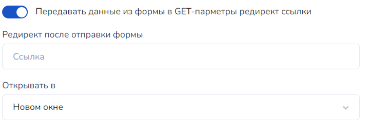<figcaption></figcaption></figure>


Данный функционал доступен только при активном положении переключателя "Форма создания сделки CRM".


Укажите необходимую ссылку в поле и выберите способ отображения: в этом же окне или с помощью открытия нового окна.&#x20;


Нельзя одновременно активизировать переключатели "**Форма опроса**" и "**Форма создания сделки в CRM**".&#x20;

Предусмотрено несколько вариантов:

* Активизация одного из трех переключателей.
* Активизация двух, не конфликтующих друг с другом переключателей:

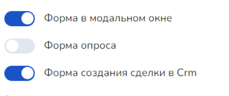

Либо

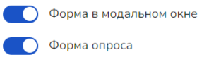



"**Форма опроса**" и "**Форма создания сделки в CRM**" НЕ передаются через переменную **quiz\_link**!&#x20;


## Иные настройки

<figure>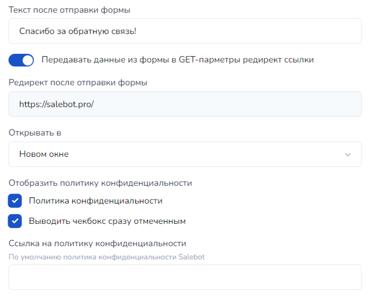<figcaption></figcaption></figure>

После настройки вопросов опроса, а также формы вывода можно перейти к остальным полям раздела:&#x20;

1. Поле "**Текст после отправки формы**" - выводит небольшое всплывающее окно после заполнения полей вопросов и отправки данных:

<figure>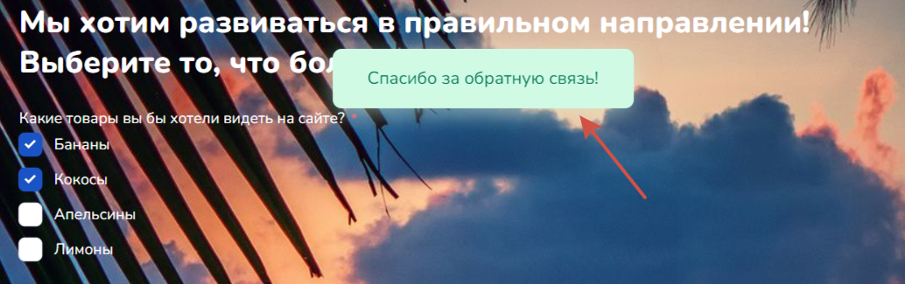<figcaption></figcaption></figure>

2. **Политика конфиденциальности**

<figure><figcaption></figcaption></figure>

При отправке формы можно отображать политику конфиденциальности, а также отмечать чекбокс отмеченным (либо не отмечайте галочкой в поле "Выводить чекбокс сразу отмеченным", если существует необходимость, чтобы пользователь самостоятельно отмечал галочку):&#x20;

<figure>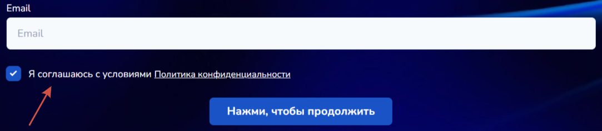<figcaption></figcaption></figure>

Ссылку на политику конфиденциальности можно установить самостоятельно либо воспользоваться по умолчанию от Salebot.&#x20;

3. **Политика обработки персональных данных**&#x20;

<figure><figcaption></figcaption></figure>

Политика обработки персональных данных выводится автоматически, если вы выбрали вопросы для формы вида email, имя и телефон.&#x20;

При необходимости, можно указать собственную ссылку на политику обработки персональных данных (по умолчанию - Политика Сейлбот).&#x20;

<figure><figcaption></figcaption></figure>

4. **Цвет текста**: установите наиболее подходящий цвет по своему смотрению.&#x20;

<figure>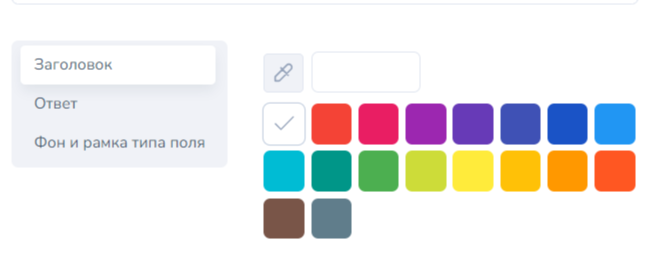<figcaption></figcaption></figure>

В данном случае благодаря списку в левом баре можно настроить цвет применительно к различным текстовым отображениям формы опроса:

* Заголовка
* Ответа
* Фона и рамки типа поля

## Заголовок для формы

<figure>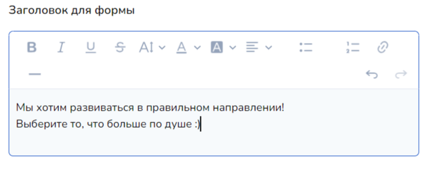<figcaption></figcaption></figure>

В функционале доступно установление заголовка шрифта аналогично настройкам любого текстового редактора:

* жирный&#x20;
* курсив
* подчеркнутый&#x20;
* перечеркнутый&#x20;
* размер
* цвет текста
* цвет выделения текста
* выравнивание текста
* маркированный список
* нумерованный список
* ссылка&#x20;

С помощью стрелок можно отменить действие или наоборот повторить:

<figure>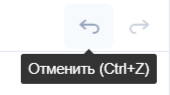<figcaption></figcaption></figure>

## Кнопки формы

### Социальные сети&#x20;

<figure>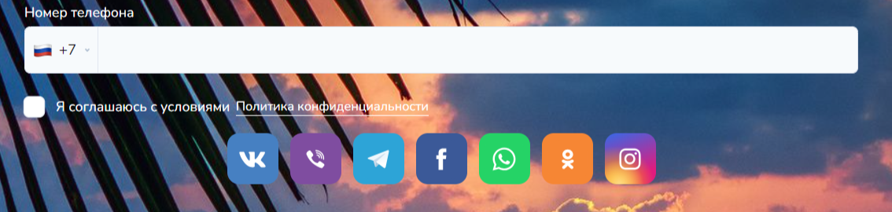<figcaption></figcaption></figure>


Отображение кнопок социальных сетей возможно при <mark style="color:red;">**НЕ активных**</mark> переключателях "**Форма опроса**" и "**Форма создания сделки CRM**", а также при <mark style="color:green;">**АКТИВНОМ**</mark> переключателе "**Форма в модальном окне**".


В настройках кнопок можно отобразить любую необходимую вам социальную сеть:

<figure>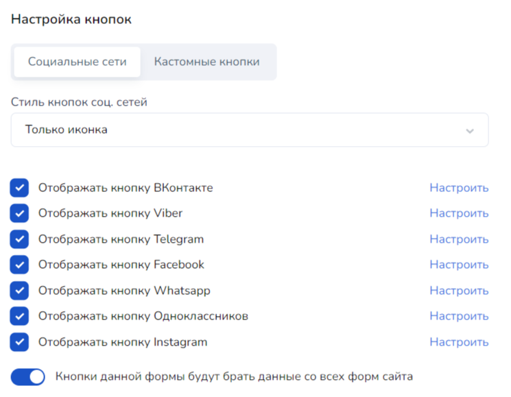<figcaption></figcaption></figure>

Настройка стиля кнопок социальных сетей отобразит просто иконку мессенджера или иконку с названием мессенджера:

<figure>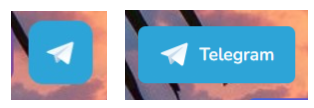<figcaption></figcaption></figure>


Помните, что социальные сети и мессенджеры необходимо подключить в разделе "Каналы".&#x20;


Каждую кнопку мессенджера можно настроить отдельно от другой при клике на "Настроить":

<figure>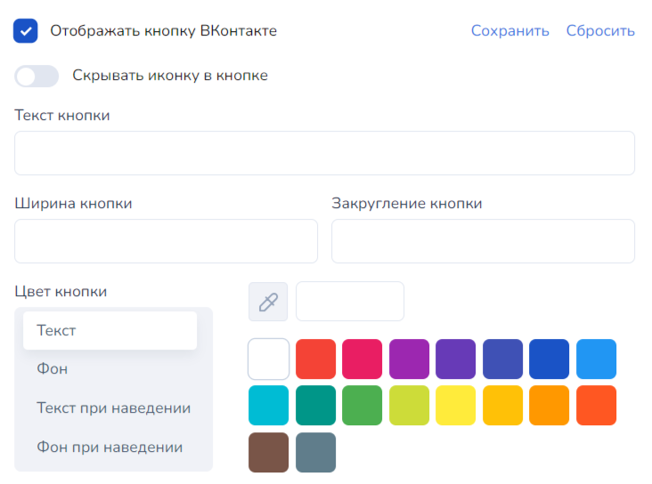<figcaption></figcaption></figure>

Можно вывести необходимый текст кнопки в поле "Текст кнопки", выбрать ее ширину и закругление.

С помощью настройки цвета кнопки при необходимости можно установить различное цветовое отображение в зависимости от наведения на нее курсора мыши.&#x20;

Так, например, нами был выбран различный фон отображения кнопки при наведение на нее курсора:

<figure>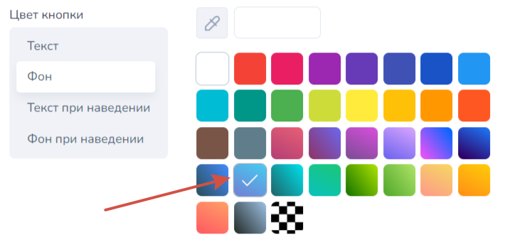<figcaption>
Отображения фона кнопки в обычном состоянии
</figcaption></figure>

<figure>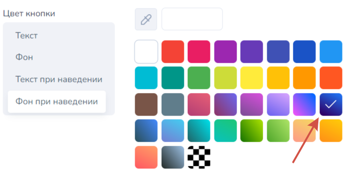<figcaption>
Отображение фона кнопки при наведении курсора
</figcaption></figure>

Тем самым получили выделение кнопки:

<figure>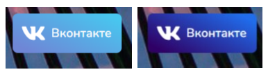<figcaption>
Кнопка в неактивном состоянии/при наведении курсора
</figcaption></figure>

Не забудьте нажать "Сохранить", чтобы применить к кнопке определенные изменения:

<figure>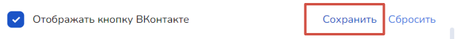<figcaption></figcaption></figure>

### Кастомные кнопки

<figure>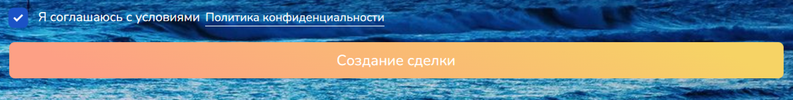<figcaption></figcaption></figure>


Отображение кастомных кнопок возможно только при <mark style="color:green;">**АКТИВНОМ**</mark> переключателе "**Форма создания сделки CRM**".


При настройке кастомной кнопки укажите отображение текста кнопки для страницы сайта или Web app:

<figure>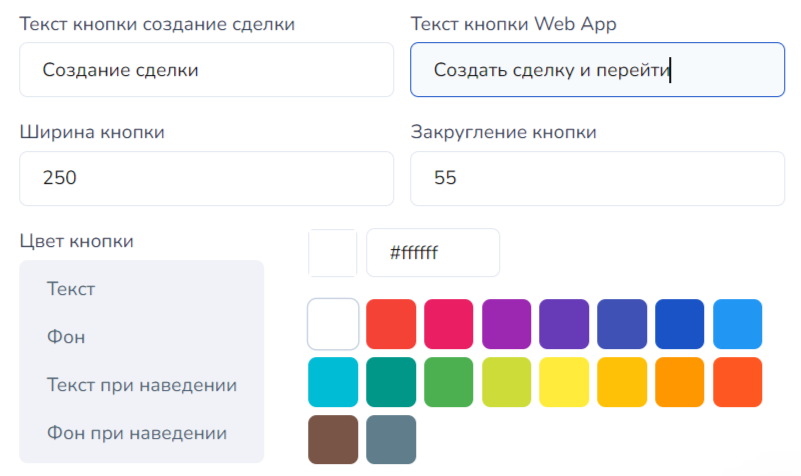<figcaption></figcaption></figure>

В данном случае можно настроить цвет текста кнопки, а также отображение фона при наведении на нее курсора мыши.&#x20;

Также можно установить размер кнопки и округление ее краев.&#x20;

<figure><figcaption>
Кнопка в неактивном состоянии/при наведении курсора
</figcaption></figure>

Так при нажатии на кнопку, данные клиента сделки отправятся в воронку.&#x20;

#### Кнопка **"Отправить"**&#x20;

<figure>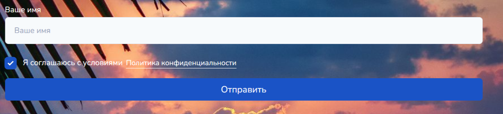<figcaption></figcaption></figure>

Кнопка "Отправить" создается автоматически при включении переключателя "Форма опроса": данная кнопка позволяет пользователю передать интересующую вас информацию, а вам, соответственно, получить результаты опроса в системе, где в последующем вы сможете увидеть результаты ответов респондентов.&#x20;


Где просматривать результаты опросов, расскажем в статье "[Заявки](/broken/pages/sHntJtBur7qLN3bwt4T8)"&#x20;

