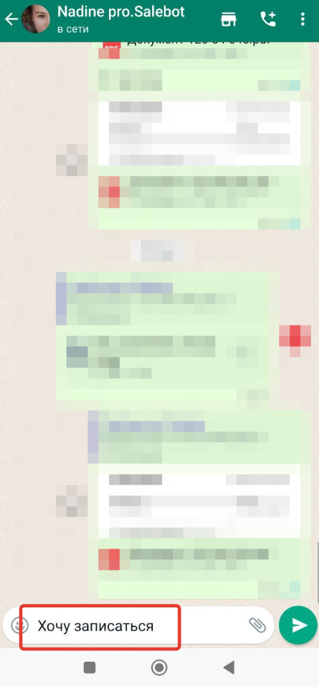

# Настройки мессенджеров

Вкладка для общих настроек работы мессенджеров на странице сайта


Для добавления кнопок мессенджеров на сайт воспольуйтесь блоком "Форма".


<figure><figcaption></figcaption></figure>

## Боты

Выберите Telegram-бот, на который будет вести кнопка с сайта: для этого перейдите в редактирование страницы -> настройки -> мессенджеры:

<figure><figcaption></figcaption></figure>

## Настройка WhatsApp

**Начальное сообщение в Whatsapp.**&#x20;

При переходе со страницы сайта по кнопке Whatsapp текст, указанный в этом поле, будет записан в поле ввода сообщения у пользователя в самом приложении Whatsapp.&#x20;

<figure><figcaption></figcaption></figure>

Ему будет достаточно нажать "Отправить":

<figure><figcaption></figcaption></figure> <figure><figcaption></figcaption></figure>

Создайте в конструкторе блок "Стартовое условие" и пропишите текст из начального сообщения:

<figure><figcaption></figcaption></figure>

Далее можно продолжите схему чат-бота с помощью блоков.&#x20;

## Настройка кнопок Вконтакте

<figure><figcaption></figcaption></figure>

**Ссылка на установку приложения Salebot в сообщество ВКонтакте**

Установите в сообщество ВКонтакте приложение Salebot  для работы с подписной страницей ВК.

**Выбор бота, в которого ведет кнопка на странице сайта и/или Подписной ВК**

Выбор бота появляется, если в проекте подключено несколько мессенджеров одного типа.

**Текст кнопки на сайте ВК**&#x20;

В данном поле можно указать, какой текст будет отображаться на кнопке на сайте ВК

#### Чекбоксы, куда ведет кнопка ВКонтакте со страницы сайта

<mark style="color:green;">**Чекбокс Кнопка ВКонтакте ведет на ref ссылку группы.**</mark> Переход по ref -ссылке ведет в диалог с сообществом (группой) ВК. Тег из настроек страницы сайта передается только, если клиент что-либо напишет в бота. Также и карта клиента в Salebot создастся, когда пользователь (клиент) напишет что-либо или нажмет кнопку Начать.

Включить кнопку "Начать" можно в настройках сообщества:

<figure><figcaption></figcaption></figure>

<mark style="color:green;">Пример диалога</mark> с сообществом при переходе со страницы сайта, в котором включен чекбокс "_**Кнопка ВКонтакте ведет на ref ссылку группы"**_ и в настройках сообщества включена **кнопка "Начать"**

<figure><figcaption>
Диалог в сообществе ВК
</figcaption></figure>

При клике по кнопке Начать в сообщество приходит сообщение:

<figure><figcaption>
Диалог в сообществе ВК
</figcaption></figure>

В разделе Клиенты появился новый клиент и тег из настроек страницы сайта передан в бота

<figure><figcaption>
Диалог в разделе "Клиенты"
</figcaption></figure>

<mark style="color:green;">**Чекбокс Кнопка ВКонтакте ведет на подписную с автоподпиской.**</mark>&#x20;


Автоподписка в данном случае идёт на СООБЩЕНИЯ ОТ СООБЩЕСТВА (БОТА).&#x20;

На само сообщество с помощью данной настройки пользователь не подписывается


При клике на странице сайта по кнопке перехода во ВКонтакте идет перенаправление на обычный сайт во ВКонтакте. Но при включенном данном чекбоксе нажимать на кнопки сайта ВК <mark style="color:green;">НЕ надо</mark>, идет автоматическая имитация клика по кнопке.&#x20;

Если пользователь переходит в бота впервые, появляется контекстное меню с запросом на разрешение отправки сообщений от имени сообщества.

<figure><figcaption></figcaption></figure>

После клика по кнопке "Разрешить" пользователь попадает в диалог с сообществом. От него автоматически приходит сообщение равное тегу страницы сайта. _Пользователь этого не видит, тег приходит только в диалоге Salebot._ Запускается цепочка сообщений, настроенная на получение тега.

<figure><figcaption>
приходит тег, указанный в настройках страницы сайта
</figcaption></figure>

#### **6. Подписная, на которую ведет кнопка ВКонтакте.**&#x20;

В настройках страницы сайта можно указать подписную страницу во ВКонтакте, на которую будет переходить пользователь при клике по кнопке ВК со страницы сайта.

**7. В ВК отображать количество подписчиков (чекбокс)**.&#x20;

На Подписной странице во ВКонтакте будет указано количество подписчиков сообщества, вы можете написать любую подпись к ВК подписчикам

<figure><figcaption>
Настройка страницы сайта
</figcaption></figure>

<figure><figcaption>
Пример Подписной страницы ВК
</figcaption></figure>
